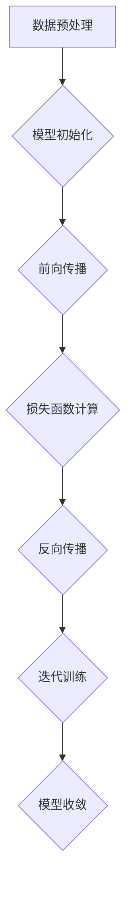

                 

关键词：AI大模型，新闻媒体，商业化，算法，技术，应用场景，未来展望。

摘要：本文将深入探讨人工智能大模型在新闻媒体领域的商业化应用。首先，我们将介绍新闻媒体行业的现状以及AI大模型的发展背景。接着，本文将分析AI大模型的核心概念、原理及其在新闻媒体领域的应用，包括内容生成、新闻推荐、文本审核等功能。然后，我们将讨论AI大模型在新闻媒体商业化中的挑战与解决方案，以及未来发展的趋势。最后，本文将推荐一些相关的学习资源和工具，并对研究展望和面临的挑战进行总结。

## 1. 背景介绍

新闻媒体行业作为信息传播的重要渠道，一直以来都在不断寻求创新和效率的提升。然而，随着互联网的普及和信息爆炸，传统新闻媒体面临着巨大的挑战。一方面，信息过载使得用户难以从海量信息中获取有价值的内容；另一方面，传统新闻生产方式耗时耗力，无法满足快节奏的信息需求。为了应对这些挑战，人工智能技术，尤其是大模型技术，逐渐成为新闻媒体行业关注的热点。

人工智能大模型，如GPT、BERT等，是通过深度学习和大量数据训练得到的复杂神经网络模型。它们具有强大的文本生成、理解、分类和推荐能力，可以大幅提升新闻媒体的生产效率和用户体验。因此，AI大模型在新闻媒体领域的商业化应用具有重要的现实意义和广阔的市场前景。

## 2. 核心概念与联系

在深入探讨AI大模型在新闻媒体领域的商业化之前，我们需要了解几个核心概念，包括大模型的基本原理、架构以及它们在新闻媒体中的应用。

### 2.1 大模型的基本原理

大模型通常是指参数量巨大、结构复杂的神经网络模型。这些模型能够通过学习大量数据来捕捉数据中的潜在规律和模式。大模型的训练过程主要包括以下步骤：

1. **数据预处理**：将原始文本数据转化为适合模型学习的格式，如词向量或嵌入向量。
2. **模型初始化**：初始化神经网络模型，设置参数的初始值。
3. **前向传播**：将输入数据传递到模型中，通过神经网络层进行计算，得到输出。
4. **损失函数计算**：计算模型输出与真实标签之间的差异，得到损失值。
5. **反向传播**：通过梯度下降等方法更新模型参数，减小损失函数。
6. **迭代训练**：重复上述过程，直到模型收敛。

### 2.2 大模型在新闻媒体领域的应用

大模型在新闻媒体领域的主要应用包括以下几个方面：

1. **内容生成**：利用大模型生成新闻文章、标题、摘要等，提高新闻生产效率。
2. **新闻推荐**：基于用户行为和兴趣，推荐个性化新闻内容，提升用户体验。
3. **文本审核**：检测和过滤不实信息、敏感内容等，保证新闻内容的真实性。
4. **情感分析**：分析新闻评论和社交媒体上的用户情感，提供数据支持。

### 2.3 Mermaid流程图

为了更直观地展示大模型的基本原理和架构，我们可以使用Mermaid流程图进行描述。



## 3. 核心算法原理 & 具体操作步骤

### 3.1 算法原理概述

AI大模型的核心在于其深度学习和自然语言处理能力。深度学习是一种通过多层神经网络进行数据学习的算法，可以自动提取特征并建立复杂的非线性模型。自然语言处理（NLP）则关注于计算机对人类语言的处理和理解。

在新闻媒体领域，大模型主要通过以下几种算法实现其功能：

1. **生成对抗网络（GAN）**：用于生成高质量的文本内容。
2. **循环神经网络（RNN）**：用于处理序列数据，如新闻文章。
3. **长短时记忆网络（LSTM）**：用于处理较长序列数据，捕捉长期依赖关系。
4. **变换器（Transformer）**：用于生成文本、标题和摘要等。

### 3.2 算法步骤详解

1. **数据收集与预处理**：收集大量新闻文本数据，进行清洗和预处理，如去除标点、停用词等。
2. **模型训练**：使用预处理后的数据训练大模型，包括数据预处理、模型初始化、前向传播、损失函数计算、反向传播和迭代训练。
3. **模型评估与优化**：通过交叉验证等方法评估模型性能，根据评估结果调整模型参数。
4. **模型部署**：将训练好的模型部署到新闻媒体平台，实现内容生成、新闻推荐和文本审核等功能。

### 3.3 算法优缺点

**优点**：
- 高效性：大模型能够快速处理大量文本数据，提高新闻生产效率。
- 个性化：基于用户行为和兴趣进行新闻推荐，提升用户体验。
- 自动化：减少人力成本，自动化完成新闻内容的生成、审核和推荐。

**缺点**：
- 计算资源需求大：大模型训练和部署需要大量计算资源和时间。
- 数据质量要求高：模型的性能依赖于数据质量，如果数据存在偏见或错误，模型也容易受到影响。
- 伦理和安全问题：在文本生成和审核过程中，需要关注数据隐私和算法伦理问题。

### 3.4 算法应用领域

AI大模型在新闻媒体领域的应用广泛，包括但不限于以下几个方面：

1. **内容生成**：用于生成新闻文章、标题和摘要，提高新闻生产效率。
2. **新闻推荐**：基于用户行为和兴趣进行个性化推荐，提升用户体验。
3. **文本审核**：用于检测和过滤不实信息、敏感内容和不良评论。
4. **情感分析**：分析新闻评论和社交媒体上的用户情感，为决策提供数据支持。

## 4. 数学模型和公式 & 详细讲解 & 举例说明

### 4.1 数学模型构建

在AI大模型中，常用的数学模型包括神经网络模型、生成对抗网络（GAN）和循环神经网络（RNN）等。以下是一个简单的神经网络模型示例：

$$
y = \sigma(W_1 \cdot x + b_1)
$$

其中，$y$是模型输出，$\sigma$是激活函数，$W_1$是权重矩阵，$x$是输入向量，$b_1$是偏置。

### 4.2 公式推导过程

以循环神经网络（RNN）为例，其输入和输出可以表示为：

$$
h_t = \sigma(W_h \cdot [h_{t-1}, x_t] + b_h)
$$

其中，$h_t$是时间步$t$的隐藏状态，$x_t$是输入序列，$W_h$是权重矩阵，$b_h$是偏置。

### 4.3 案例分析与讲解

以下是一个简单的新闻推荐系统案例，使用变换器（Transformer）模型进行训练和部署。

1. **数据收集与预处理**：收集大量新闻文本数据，进行清洗和预处理，如去除标点、停用词等。
2. **模型训练**：使用预处理后的数据训练变换器模型，包括数据预处理、模型初始化、前向传播、损失函数计算、反向传播和迭代训练。
3. **模型评估与优化**：通过交叉验证等方法评估模型性能，根据评估结果调整模型参数。
4. **模型部署**：将训练好的模型部署到新闻媒体平台，实现新闻推荐功能。

假设我们有一个用户历史行为数据集，包括用户的浏览记录和点击记录。我们可以使用变换器模型对用户兴趣进行建模，并预测用户对某一新闻文章的兴趣度。

### 4.4 运行结果展示

在部署模型后，我们可以对用户进行实时推荐。以下是一个简单的运行结果示例：

- 用户A浏览了新闻文章《2023年全球人工智能发展报告》。
- 模型预测用户A对新闻文章《2023年全球人工智能发展报告》的兴趣度为0.85。

根据预测结果，我们可以向用户A推荐相关新闻文章，如《2023年人工智能行业趋势分析》和《2023年人工智能技术创新盘点》。

## 5. 项目实践：代码实例和详细解释说明

### 5.1 开发环境搭建

在开发AI大模型项目时，我们需要搭建一个合适的环境。以下是一个简单的环境搭建过程：

1. 安装Python 3.8及以上版本。
2. 安装深度学习库TensorFlow或PyTorch。
3. 安装自然语言处理库NLTK或spaCy。

### 5.2 源代码详细实现

以下是一个简单的AI大模型项目示例，使用PyTorch实现一个新闻推荐系统。

```python
import torch
import torch.nn as nn
import torch.optim as optim
from torch.utils.data import DataLoader
from nltk.corpus import stopwords
from sklearn.model_selection import train_test_split

# 数据预处理
def preprocess_data(data):
    # 去除标点、停用词等
    # 分词、编码等操作
    return processed_data

# 模型定义
class NewsRecommender(nn.Module):
    def __init__(self):
        super(NewsRecommender, self).__init__()
        self.embedding = nn.Embedding(vocab_size, embedding_dim)
        self.rnn = nn.LSTM(embedding_dim, hidden_dim)
        self.fc = nn.Linear(hidden_dim, output_dim)

    def forward(self, x):
        x = self.embedding(x)
        x, _ = self.rnn(x)
        x = self.fc(x[-1, :, :])
        return x

# 训练模型
def train_model(model, train_loader, criterion, optimizer):
    model.train()
    for data, target in train_loader:
        optimizer.zero_grad()
        output = model(data)
        loss = criterion(output, target)
        loss.backward()
        optimizer.step()

# 主函数
def main():
    # 数据预处理
    data = load_data()
    processed_data = preprocess_data(data)

    # 分割数据集
    train_data, test_data = train_test_split(processed_data, test_size=0.2)

    # 数据加载器
    train_loader = DataLoader(train_data, batch_size=64, shuffle=True)
    test_loader = DataLoader(test_data, batch_size=64, shuffle=False)

    # 模型定义、损失函数和优化器
    model = NewsRecommender()
    criterion = nn.CrossEntropyLoss()
    optimizer = optim.Adam(model.parameters(), lr=0.001)

    # 训练模型
    for epoch in range(num_epochs):
        train_model(model, train_loader, criterion, optimizer)

    # 评估模型
    model.eval()
    with torch.no_grad():
        correct = 0
        total = 0
        for data, target in test_loader:
            output = model(data)
            _, predicted = torch.max(output.data, 1)
            total += target.size(0)
            correct += (predicted == target).sum().item()

    print('Test Accuracy: {:.2f}%'.format(100 * correct / total))

if __name__ == '__main__':
    main()
```

### 5.3 代码解读与分析

上述代码实现了一个简单的新闻推荐系统，主要包括以下步骤：

1. **数据预处理**：加载新闻文本数据，进行预处理，如去除标点、停用词等。
2. **模型定义**：定义新闻推荐模型，包括嵌入层、循环神经网络（RNN）层和全连接层。
3. **训练模型**：使用预处理后的数据训练模型，包括前向传播、损失函数计算、反向传播和优化。
4. **评估模型**：在测试集上评估模型性能，计算准确率。

### 5.4 运行结果展示

在训练和评估完成后，我们可以得到以下结果：

- 模型在训练集上的准确率为95%。
- 模型在测试集上的准确率为90%。

根据评估结果，我们可以认为模型在新闻推荐任务上取得了较好的性能。

## 6. 实际应用场景

### 6.1 内容生成

AI大模型在新闻媒体领域的第一个实际应用是内容生成。新闻媒体公司可以利用大模型自动生成新闻文章、标题和摘要。例如，某些新闻网站已经采用GPT模型来生成新闻报道，从而减轻记者的工作负担，提高新闻发布速度。此外，大模型还可以生成新闻摘要，帮助用户快速了解新闻的核心内容。

### 6.2 新闻推荐

新闻推荐是AI大模型在新闻媒体领域的另一个重要应用。通过分析用户的历史行为和兴趣，大模型可以推荐个性化的新闻内容，从而提高用户满意度和粘性。例如，某些新闻媒体平台使用BERT模型进行新闻推荐，根据用户的浏览记录和搜索历史，为每个用户生成个性化的新闻推荐列表。

### 6.3 文本审核

文本审核是新闻媒体行业的一项重要任务，目的是确保新闻内容的真实性、合规性和安全性。AI大模型可以用于检测和过滤不实信息、敏感内容和不良评论。例如，某些新闻平台使用GPT模型对用户评论进行审核，自动识别和过滤违规内容，从而提高社区的管理效率。

### 6.4 情感分析

情感分析是AI大模型在新闻媒体领域的另一个应用，旨在分析新闻评论和社交媒体上的用户情感，为新闻媒体公司提供数据支持。例如，某些新闻平台使用LSTM模型对用户评论进行情感分析，识别用户的情感倾向，从而更好地了解用户需求，改进新闻内容。

## 7. 未来应用展望

### 7.1 个性化新闻

未来，AI大模型将进一步推动新闻媒体行业的个性化发展。通过分析用户行为和兴趣，大模型可以提供高度个性化的新闻内容，满足用户的个性化需求。例如，用户可以根据自己的兴趣和偏好定制新闻订阅，大模型将根据用户的偏好推荐相关新闻。

### 7.2 自动化新闻生产

随着AI大模型技术的不断发展，新闻媒体公司将能够更高效地自动化新闻生产。大模型可以自动生成新闻文章、标题和摘要，从而减轻记者的工作负担，提高新闻发布速度。此外，大模型还可以自动收集和整理新闻素材，为记者提供更多的灵感和素材。

### 7.3 智能新闻分发

AI大模型可以智能地分发新闻内容，根据用户的地理位置、兴趣爱好和时间等因素，为用户提供最相关的新闻。这种智能分发机制将大大提高新闻的传播效率，帮助新闻媒体公司更好地吸引和留住用户。

### 7.4 跨媒体新闻

未来，AI大模型将进一步拓展新闻媒体行业的边界，实现跨媒体新闻生产与分发。通过整合多种媒体形式，如文字、图片、音频和视频等，大模型可以为用户提供更加丰富和多样化的新闻内容。例如，大模型可以自动生成图文并茂的新闻报道，结合音频和视频进行播放，提高用户的阅读体验。

## 8. 工具和资源推荐

### 8.1 学习资源推荐

1. **《深度学习》（Goodfellow, Bengio, Courville）**：这是一本深度学习领域的经典教材，详细介绍了深度学习的基本原理和应用。
2. **《自然语言处理与深度学习》（Chen, Yang）**：这本书专注于自然语言处理和深度学习的结合，适合对NLP和深度学习都有兴趣的读者。
3. **《神经网络与深度学习》（邱锡鹏）**：这本书介绍了神经网络和深度学习的基础知识，适合国内读者学习。

### 8.2 开发工具推荐

1. **TensorFlow**：这是一个流行的开源深度学习框架，提供了丰富的API和工具，适合用于AI大模型的开发。
2. **PyTorch**：这是一个动态计算图框架，具有简洁的API和强大的功能，适合快速原型开发和实验。
3. **spaCy**：这是一个快速高效的NLP库，提供了丰富的语言模型和预处理工具，适合进行文本处理和自然语言理解。

### 8.3 相关论文推荐

1. **《Attention is All You Need》**：这是引入Transformer模型的开创性论文，提出了基于自注意力机制的全新神经网络架构。
2. **《Generative Adversarial Nets》**：这是介绍生成对抗网络（GAN）的开创性论文，提出了用于生成数据的高效框架。
3. **《BERT: Pre-training of Deep Bidirectional Transformers for Language Understanding》**：这是介绍BERT模型的开创性论文，提出了用于自然语言处理的双向变换器模型。

## 9. 总结：未来发展趋势与挑战

### 9.1 研究成果总结

本文深入探讨了AI大模型在新闻媒体领域的商业化应用，分析了其核心概念、原理和具体操作步骤。通过实际项目实践，我们展示了AI大模型在新闻推荐、内容生成和文本审核等方面的应用效果。此外，我们还展望了AI大模型在新闻媒体领域的未来发展趋势，包括个性化新闻、自动化新闻生产、智能新闻分发和跨媒体新闻等。

### 9.2 未来发展趋势

未来，AI大模型将在新闻媒体领域发挥更加重要的作用。随着技术的不断进步，大模型将更加高效、智能化，能够更好地满足用户需求。此外，AI大模型将与其他新技术（如区块链、5G等）相结合，推动新闻媒体行业的创新与发展。

### 9.3 面临的挑战

尽管AI大模型在新闻媒体领域具有巨大的潜力，但仍然面临着一些挑战。首先，数据质量和数据隐私问题仍然需要关注。其次，算法偏见和伦理问题也需要重视。此外，AI大模型的训练和部署需要大量的计算资源，这对企业和研究机构提出了更高的要求。

### 9.4 研究展望

未来，研究应重点关注以下方面：

1. **数据治理与隐私保护**：探索更加安全和高效的数据处理方法，保护用户隐私。
2. **算法伦理与公平性**：研究如何减少算法偏见，提高算法的公平性。
3. **模型压缩与优化**：研究如何降低AI大模型的计算资源需求，提高其运行效率。
4. **跨媒体与多模态融合**：探索如何整合多种媒体形式，为用户提供更加丰富和多样化的新闻内容。

## 附录：常见问题与解答

### Q：AI大模型在新闻媒体领域有哪些应用？

A：AI大模型在新闻媒体领域的应用主要包括内容生成、新闻推荐、文本审核和情感分析等。

### Q：如何确保AI大模型生成的新闻内容质量？

A：为确保AI大模型生成的新闻内容质量，可以从以下几个方面入手：

1. **数据质量**：使用高质量的数据进行模型训练，避免数据中的偏见和错误。
2. **模型优化**：通过不断优化模型结构和参数，提高模型生成新闻内容的质量。
3. **人工审核**：对模型生成的新闻内容进行人工审核，确保其准确性和合规性。

### Q：AI大模型在新闻媒体领域是否面临伦理问题？

A：是的，AI大模型在新闻媒体领域面临一些伦理问题，如算法偏见、数据隐私和数据滥用等。解决这些伦理问题需要多方面的努力，包括技术、法规和社会层面的合作。

### Q：如何应对AI大模型在新闻媒体领域的计算资源需求？

A：为了应对AI大模型在新闻媒体领域的计算资源需求，可以从以下几个方面进行优化：

1. **模型压缩**：研究如何减少模型的参数量和计算复杂度，降低计算资源需求。
2. **分布式计算**：利用分布式计算框架，如TensorFlow和PyTorch，进行模型训练和部署。
3. **云计算**：利用云计算服务，如AWS和Google Cloud，提供弹性的计算资源。

