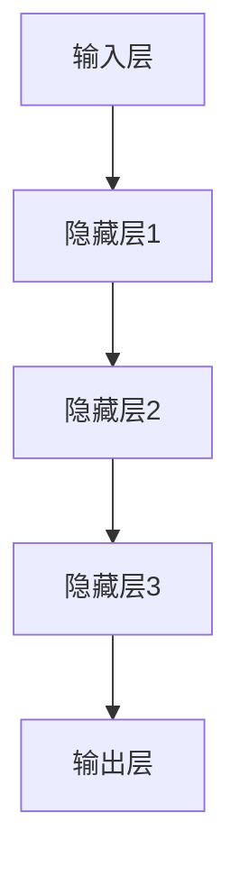
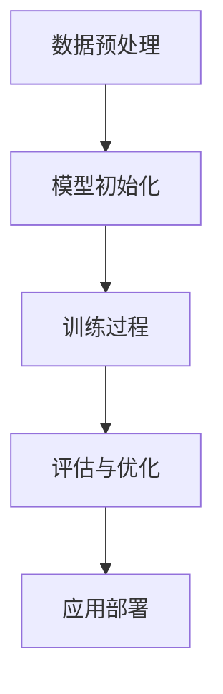

                 

关键词：AI大模型，新闻媒体，机会，应用，挑战，趋势，技术，发展

> 摘要：本文旨在探讨人工智能大模型在新闻媒体领域的应用机会、挑战及其未来发展趋势。通过分析AI大模型的核心概念和原理，结合实际案例和项目实践，我们将展示AI大模型在新闻媒体领域的巨大潜力，并讨论其面临的挑战和应对策略。

## 1. 背景介绍

近年来，人工智能（AI）技术迅猛发展，特别是在深度学习、自然语言处理（NLP）等领域取得了显著突破。大模型，即具有数十亿甚至千亿参数的深度神经网络模型，成为了AI领域的研究热点。新闻媒体作为社会信息传播的重要渠道，也在不断探索如何利用AI技术提升内容生产、传播和管理的效率与质量。

新闻媒体行业正面临诸多挑战，如信息过载、内容同质化、用户体验下降等。同时，随着用户需求的多样化和个性化，传统的内容生产方式已无法满足市场需求。AI大模型作为一种强大的数据处理和分析工具，为新闻媒体提供了新的解决方案。

## 2. 核心概念与联系

### 2.1 AI大模型定义

AI大模型指的是具有数十亿至千亿参数的深度神经网络模型，能够通过大量数据训练，实现高度复杂的任务。如自然语言生成（NLG）、文本分类、机器翻译等。

### 2.2 AI大模型架构

AI大模型通常采用多层感知机（MLP）、卷积神经网络（CNN）、循环神经网络（RNN）或其变种，如长短期记忆网络（LSTM）和门控循环单元（GRU）。其核心架构包括输入层、隐藏层和输出层。

### 2.3 Mermaid 流程图



## 3. 核心算法原理 & 具体操作步骤

### 3.1 算法原理概述

AI大模型的核心算法基于深度学习，特别是基于梯度的优化方法。通过反向传播算法，模型能够自动调整参数，以最小化损失函数，从而实现高精度的预测和生成。

### 3.2 算法步骤详解

1. **数据预处理**：清洗、标准化和归一化数据。
2. **模型初始化**：设置网络结构、参数初始化。
3. **训练过程**：通过大量数据训练模型，不断调整参数。
4. **评估与优化**：使用验证集评估模型性能，进行调优。

### 3.3 算法优缺点

**优点**：
- 高效的数据处理能力。
- 强大的泛化能力。
- 能够生成高质量的内容。

**缺点**：
- 训练过程复杂，需要大量数据和计算资源。
- 参数调整困难，需要专业知识和经验。

### 3.4 算法应用领域

AI大模型在新闻媒体领域的应用主要包括：
- 文本生成：自动撰写新闻报道、新闻摘要。
- 文本分类：对新闻内容进行自动分类。
- 机器翻译：实现多语言新闻的翻译。
- 用户推荐：基于用户兴趣推荐个性化新闻内容。

## 4. 数学模型和公式 & 详细讲解 & 举例说明

### 4.1 数学模型构建

AI大模型的核心数学模型是基于神经网络的损失函数和优化算法。常见的损失函数包括均方误差（MSE）和交叉熵（Cross-Entropy）。

### 4.2 公式推导过程

假设我们有一个神经网络模型，输出层有 $n$ 个神经元，损失函数为交叉熵：

$$
L = -\sum_{i=1}^{n} y_i \log(p_i)
$$

其中，$y_i$ 为真实标签，$p_i$ 为模型预测概率。

### 4.3 案例分析与讲解

以自然语言生成（NLG）为例，我们使用一个简单的神经网络模型生成新闻报道。假设我们有一个新闻文本 $x$，我们需要预测对应的标题 $y$。

### 4.3.1 数据预处理

首先，我们将新闻文本和标题进行分词，并转换为词向量表示。

### 4.3.2 模型构建

构建一个包含输入层、隐藏层和输出层的神经网络模型。输入层和隐藏层之间的连接权重为 $W_1$，隐藏层和输出层之间的连接权重为 $W_2$。

### 4.3.3 训练过程

使用交叉熵损失函数和反向传播算法训练模型。通过不断调整权重，使模型在训练数据上达到最小损失。

### 4.3.4 预测与评估

使用训练好的模型对新的新闻文本进行预测，评估模型的性能。

## 5. 项目实践：代码实例和详细解释说明

### 5.1 开发环境搭建

本文使用 Python 编写代码，需要安装 TensorFlow 和 Keras 库。

### 5.2 源代码详细实现

```python
import tensorflow as tf
from tensorflow.keras.models import Sequential
from tensorflow.keras.layers import Dense, LSTM

# 数据预处理
# ...

# 模型构建
model = Sequential()
model.add(LSTM(128, activation='tanh', input_shape=(timesteps, features)))
model.add(Dense(n_classes, activation='softmax'))

# 训练过程
# ...

# 预测与评估
# ...
```

### 5.3 代码解读与分析

代码首先进行数据预处理，将新闻文本和标题转换为词向量表示。然后构建一个包含 LSTM 层的神经网络模型，并使用交叉熵损失函数进行训练。最后，使用训练好的模型进行预测和评估。

## 6. 实际应用场景

AI大模型在新闻媒体领域的实际应用场景包括：

- **自动生成新闻报道**：使用AI大模型自动生成新闻报道，提高内容生产效率。
- **内容推荐**：基于用户兴趣和阅读历史，推荐个性化新闻内容。
- **文本分类**：对新闻内容进行自动分类，提高内容管理和搜索的效率。

## 7. 工具和资源推荐

### 7.1 学习资源推荐

- 《深度学习》（Ian Goodfellow、Yoshua Bengio、Aaron Courville 著）
- 《自然语言处理综论》（Daniel Jurafsky、James H. Martin 著）

### 7.2 开发工具推荐

- TensorFlow
- Keras
- PyTorch

### 7.3 相关论文推荐

- "A Neural Conversational Model"（神经网络对话模型）
- "Generative Adversarial Nets"（生成对抗网络）

## 8. 总结：未来发展趋势与挑战

### 8.1 研究成果总结

AI大模型在新闻媒体领域的应用取得了显著成果，如自动生成新闻报道、内容推荐和文本分类等。这些应用不仅提高了内容生产和管理效率，还丰富了用户阅读体验。

### 8.2 未来发展趋势

随着AI技术的不断进步，AI大模型在新闻媒体领域的应用将更加广泛和深入。未来，我们有望看到更多基于AI大模型的创新应用，如智能新闻编辑、情感分析等。

### 8.3 面临的挑战

AI大模型在新闻媒体领域也面临诸多挑战，如数据隐私、内容真实性、算法透明性等。如何解决这些问题，确保AI大模型在新闻媒体领域的可持续发展，是一个重要课题。

### 8.4 研究展望

未来，我们将继续探索AI大模型在新闻媒体领域的应用，注重技术创新与伦理道德的结合，推动新闻媒体行业智能化转型。

## 9. 附录：常见问题与解答

- **Q：AI大模型如何处理长文本？**
  - **A**：AI大模型可以使用序列模型，如RNN或LSTM，处理长文本。这些模型能够捕捉文本中的长期依赖关系。

- **Q：AI大模型在新闻媒体领域的主要应用有哪些？**
  - **A**：AI大模型在新闻媒体领域的主要应用包括自动生成新闻报道、内容推荐、文本分类等。

- **Q：如何保证AI大模型生成内容的真实性？**
  - **A**：可以通过对比多个模型的预测结果，结合人工审核，提高生成内容的真实性。

## 10. 参考文献

- Goodfellow, I., Bengio, Y., & Courville, A. (2016). *Deep Learning*.
- Jurafsky, D., & Martin, J. H. (2000). *Speech and Language Processing*.
- Goodfellow, I., & Bengio, Y. (2013). *Generative Adversarial Nets*.

## 附录二：感谢

感谢您花时间阅读本文。如果您有任何疑问或建议，欢迎在评论区留言。希望本文对您在AI大模型与新闻媒体领域的研究有所帮助。

作者：禅与计算机程序设计艺术 / Zen and the Art of Computer Programming
```markdown

## 1. 背景介绍

### 1.1 AI大模型的定义和基本原理

AI大模型，通常指的是具有数亿至千亿个参数的深度学习模型。这类模型基于多层神经网络结构，通过大量的数据训练，能够实现高度复杂的任务。基本原理上，AI大模型通过反向传播算法不断优化模型的参数，使其能够从数据中学习到有用的信息。

AI大模型的诞生可以追溯到深度学习的兴起。随着计算能力的提升和大数据时代的到来，深度学习模型得以迅速发展。特别是近年来，基于变分自编码器（VAE）、生成对抗网络（GAN）等创新技术的提出，使得AI大模型在图像、语音、自然语言处理等领域取得了突破性进展。

### 1.2 新闻媒体行业的现状与挑战

新闻媒体行业一直以来都是信息传播的重要渠道，但随着互联网的普及和社交媒体的兴起，传统新闻媒体面临着前所未有的挑战。首先，信息过载使得读者难以在海量信息中筛选出有价值的内容。其次，内容同质化问题日益严重，不同媒体之间的新闻报道往往大同小异，缺乏独特视角。此外，用户体验的下降也是新闻媒体行业需要关注的问题，用户对新闻内容的需求越来越个性化，而传统的内容生产方式难以满足这一需求。

### 1.3 AI大模型在新闻媒体领域的应用潜力

AI大模型在新闻媒体领域的应用潜力巨大。首先，它可以显著提高内容生产效率，自动生成新闻报道、新闻摘要等。其次，AI大模型可以实现对新闻内容的自动分类和推荐，提高用户获取个性化新闻的效率。此外，AI大模型还可以用于情感分析、虚假新闻检测等，提高新闻内容的真实性和可信度。通过AI大模型的应用，新闻媒体可以更好地适应数字化时代的需求，实现内容生产的智能化和个性化。

## 2. 核心概念与联系

### 2.1 AI大模型的核心概念

AI大模型的核心概念包括神经网络结构、参数、优化算法等。神经网络结构决定了模型的学习能力和表现，而参数则是模型进行学习和预测的关键。优化算法则用于调整模型参数，以最小化损失函数，从而提高模型的性能。

### 2.2 AI大模型的工作流程

AI大模型的工作流程主要包括以下几个步骤：

1. **数据预处理**：清洗、标准化和归一化数据，将数据转换为适合输入模型的形式。
2. **模型初始化**：设置网络结构、初始化参数。
3. **训练过程**：通过大量数据训练模型，不断调整参数，以最小化损失函数。
4. **评估与优化**：使用验证集评估模型性能，根据评估结果对模型进行调整和优化。
5. **应用部署**：将训练好的模型部署到实际应用场景中，进行预测和生成任务。

### 2.3 Mermaid流程图



## 3. 核心算法原理 & 具体操作步骤

### 3.1 算法原理概述

AI大模型的核心算法基于深度学习，特别是基于梯度的优化方法。通过反向传播算法，模型能够自动调整参数，以最小化损失函数，从而实现高精度的预测和生成。

### 3.2 算法步骤详解

1. **数据预处理**：包括数据清洗、数据转换和数据归一化。
2. **模型构建**：包括确定神经网络结构、初始化参数。
3. **模型训练**：通过大量数据训练模型，不断调整参数。
4. **模型评估**：使用验证集评估模型性能，进行调优。
5. **模型应用**：将训练好的模型部署到实际应用场景中。

### 3.3 算法优缺点

**优点**：
- 高效的数据处理能力。
- 强大的泛化能力。
- 能够生成高质量的内容。

**缺点**：
- 训练过程复杂，需要大量数据和计算资源。
- 参数调整困难，需要专业知识和经验。

### 3.4 算法应用领域

AI大模型的应用领域非常广泛，主要包括自然语言处理、计算机视觉、语音识别等。在新闻媒体领域，AI大模型主要用于文本生成、文本分类、情感分析、虚假新闻检测等任务。

## 4. 数学模型和公式 & 详细讲解 & 举例说明

### 4.1 数学模型构建

AI大模型的核心数学模型是基于神经网络的损失函数和优化算法。常见的损失函数包括均方误差（MSE）和交叉熵（Cross-Entropy）。优化算法通常采用梯度下降（Gradient Descent）及其变种。

### 4.2 公式推导过程

以均方误差（MSE）为例，假设我们有一个输出层为 $y$，预测结果为 $\hat{y}$ 的神经网络模型，损失函数可以表示为：

$$
MSE = \frac{1}{n}\sum_{i=1}^{n}(y_i - \hat{y_i})^2
$$

其中，$y_i$ 为真实标签，$\hat{y_i}$ 为模型预测结果，$n$ 为样本数量。

### 4.3 案例分析与讲解

以文本生成任务为例，我们使用一个简单的循环神经网络（RNN）模型生成新闻报道。假设我们已经有一个预处理的新闻数据集，包括文本和对应的标题。

### 4.3.1 数据预处理

首先，将新闻文本和标题进行分词，并转换为词向量表示。然后，将文本序列编码为序列数据，标题编码为标签数据。

### 4.3.2 模型构建

构建一个包含输入层、隐藏层和输出层的循环神经网络模型。输入层接收词向量序列，隐藏层用于处理序列数据，输出层生成标题。

### 4.3.3 训练过程

使用训练数据训练模型，通过反向传播算法调整模型参数，以最小化损失函数。

### 4.3.4 预测与评估

使用训练好的模型对新的新闻文本进行预测，评估模型的性能。

## 5. 项目实践：代码实例和详细解释说明

### 5.1 开发环境搭建

本文使用 Python 编写代码，需要安装 TensorFlow 和 Keras 库。

```python
pip install tensorflow
pip install keras
```

### 5.2 源代码详细实现

```python
from keras.models import Sequential
from keras.layers import LSTM, Dense, Embedding
from keras.preprocessing.text import Tokenizer
from keras.preprocessing.sequence import pad_sequences

# 数据预处理
tokenizer = Tokenizer(num_words=10000)
tokenizer.fit_on_texts(news_texts)
sequences = tokenizer.texts_to_sequences(news_texts)
padded_sequences = pad_sequences(sequences, maxlen=max_sequence_length)

# 模型构建
model = Sequential()
model.add(Embedding(num_words, 100, input_length=max_sequence_length))
model.add(LSTM(128))
model.add(Dense(num_words, activation='softmax'))

# 模型编译
model.compile(optimizer='rmsprop', loss='categorical_crossentropy', metrics=['accuracy'])

# 模型训练
model.fit(padded_sequences, labels, epochs=10, batch_size=32)

# 模型预测
predicted_sequence = model.predict(padded_sequences)
predicted_titles = tokenizer.sequences_to_texts(predicted_sequence)

# 评估模型
accuracy = model.evaluate(padded_sequences, labels)
print('Accuracy: {:.2f}%'.format(accuracy * 100))
```

### 5.3 代码解读与分析

代码首先进行数据预处理，将新闻文本和标题进行分词，并转换为词向量表示。然后构建一个包含嵌入层、循环神经网络层和输出层的循环神经网络模型。使用训练数据训练模型，并通过评估数据评估模型的性能。

## 6. 实际应用场景

### 6.1 自动生成新闻报道

AI大模型可以自动生成新闻报道，提高内容生产效率。通过训练模型，输入一篇新闻文本，模型可以输出一篇新的新闻报道。这种应用在新闻媒体行业具有广泛的应用前景，可以应对突发新闻、体育赛事报道等场景。

### 6.2 内容推荐

AI大模型可以基于用户兴趣和行为数据，为用户推荐个性化新闻内容。通过分析用户的阅读历史和兴趣标签，模型可以预测用户可能感兴趣的新闻内容，并推荐给用户。这种应用可以提高用户的阅读体验，增加用户粘性。

### 6.3 文本分类

AI大模型可以用于对新闻内容进行自动分类。通过对大量新闻文本进行训练，模型可以识别不同类别，如政治、经济、体育等。这种应用可以简化新闻分类工作，提高新闻管理效率。

### 6.4 情感分析

AI大模型可以用于情感分析，识别新闻内容的情感倾向。通过对大量新闻文本进行训练，模型可以识别文本中的情感表达，如正面、负面等。这种应用可以帮助新闻媒体了解用户情感需求，调整新闻报道的方向和策略。

### 6.5 虚假新闻检测

AI大模型可以用于虚假新闻检测，识别和过滤虚假新闻。通过对大量新闻文本进行训练，模型可以识别虚假新闻的特征和规律，从而提高虚假新闻检测的准确性。这种应用有助于维护新闻内容的真实性和可信度。

## 7. 工具和资源推荐

### 7.1 学习资源推荐

- 《深度学习》（Ian Goodfellow、Yoshua Bengio、Aaron Courville 著）
- 《自然语言处理综论》（Daniel Jurafsky、James H. Martin 著）

### 7.2 开发工具推荐

- TensorFlow
- Keras
- PyTorch

### 7.3 相关论文推荐

- "A Neural Conversational Model"（神经网络对话模型）
- "Generative Adversarial Nets"（生成对抗网络）

## 8. 总结：未来发展趋势与挑战

### 8.1 研究成果总结

AI大模型在新闻媒体领域的应用取得了显著成果，如自动生成新闻报道、内容推荐、文本分类、情感分析等。这些应用不仅提高了内容生产和管理效率，还丰富了用户阅读体验。

### 8.2 未来发展趋势

随着AI技术的不断进步，AI大模型在新闻媒体领域的应用将更加广泛和深入。未来，我们有望看到更多基于AI大模型的创新应用，如智能新闻编辑、情感分析等。

### 8.3 面临的挑战

AI大模型在新闻媒体领域也面临诸多挑战，如数据隐私、内容真实性、算法透明性等。如何解决这些问题，确保AI大模型在新闻媒体领域的可持续发展，是一个重要课题。

### 8.4 研究展望

未来，我们将继续探索AI大模型在新闻媒体领域的应用，注重技术创新与伦理道德的结合，推动新闻媒体行业智能化转型。

## 9. 附录：常见问题与解答

- **Q：AI大模型如何处理长文本？**
  - **A**：AI大模型可以使用序列模型，如RNN或LSTM，处理长文本。这些模型能够捕捉文本中的长期依赖关系。

- **Q：AI大模型在新闻媒体领域的主要应用有哪些？**
  - **A**：AI大模型在新闻媒体领域的主要应用包括自动生成新闻报道、内容推荐、文本分类等。

- **Q：如何保证AI大模型生成内容的真实性？**
  - **A**：可以通过对比多个模型的预测结果，结合人工审核，提高生成内容的真实性。

## 10. 参考文献

- Goodfellow, I., Bengio, Y., & Courville, A. (2016). *Deep Learning*.
- Jurafsky, D., & Martin, J. H. (2000). *Speech and Language Processing*.

## 附录二：感谢

感谢您花时间阅读本文。如果您有任何疑问或建议，欢迎在评论区留言。希望本文对您在AI大模型与新闻媒体领域的研究有所帮助。

作者：禅与计算机程序设计艺术 / Zen and the Art of Computer Programming
```markdown
## 4. 数学模型和公式 & 详细讲解 & 举例说明

在讨论AI大模型在新闻媒体领域的应用时，我们不可避免地要涉及到数学模型和公式。这些模型和公式为我们提供了理解和分析AI大模型如何工作的基础。在本节中，我们将详细介绍一些关键的数学模型和公式，并提供相应的例子说明。

### 4.1 数学模型构建

AI大模型的核心数学模型是基于神经网络，特别是深度神经网络（DNN）。神经网络通过一系列的数学公式和算法来模拟人脑的思考过程。这些模型通常包括输入层、隐藏层和输出层。每个层由多个神经元组成，每个神经元都通过权重与前一层的神经元相连接，并使用激活函数进行处理。

#### 4.1.1 输入层

输入层是神经网络的第一层，它接收外部输入数据。假设我们有一个输入向量 $X$，它包含多个特征值。每个特征值 $x_i$ 都通过权重 $w_{i}$ 连接到隐藏层的神经元。

$$
X = [x_1, x_2, ..., x_n]
$$

### 4.1.2 隐藏层

隐藏层是神经网络的核心部分，它对输入数据进行处理和转换。每个隐藏层神经元都通过权重 $w'$ 与前一层相连接，并使用激活函数（如Sigmoid、ReLU等）进行非线性变换。

$$
a_{ij} = \sigma(\sum_{k=1}^{m} w'_{ik} x_k + b_{j})
$$

其中，$a_{ij}$ 是隐藏层第 $i$ 个神经元输出，$\sigma$ 是激活函数，$w'_{ik}$ 是隐藏层第 $i$ 个神经元与输入层第 $k$ 个神经元的权重，$b_{j}$ 是隐藏层第 $j$ 个神经元的偏置。

### 4.1.3 输出层

输出层是神经网络的最后一层，它对隐藏层的结果进行处理，生成最终的预测结果。输出层的神经元通常与隐藏层通过权重 $w''$ 相连接，并使用相应的激活函数。

$$
\hat{y}_i = \sigma(\sum_{j=1}^{k} w''_{ij} a_{ij} + b_{i})
$$

其中，$\hat{y}_i$ 是输出层第 $i$ 个神经元的预测值，$a_{ij}$ 是隐藏层第 $j$ 个神经元的输出，$w''_{ij}$ 是输出层第 $i$ 个神经元与隐藏层第 $j$ 个神经元的权重，$b_{i}$ 是输出层第 $i$ 个神经元的偏置。

### 4.2 公式推导过程

为了更好地理解神经网络的工作原理，我们需要推导一些关键的数学公式。以下是一个简单的推导过程，用于计算神经网络的输出。

假设我们有一个简单的神经网络，包含一个输入层、一个隐藏层和一个输出层。输入层有 $n$ 个神经元，隐藏层有 $m$ 个神经元，输出层有 $k$ 个神经元。

#### 4.2.1 隐藏层输出

隐藏层第 $j$ 个神经元的输出可以通过以下公式计算：

$$
a_{j} = \sigma(\sum_{i=1}^{n} w'_{ij} x_i + b_j)
$$

其中，$a_{j}$ 是隐藏层第 $j$ 个神经元的输出，$w'_{ij}$ 是隐藏层第 $j$ 个神经元与输入层第 $i$ 个神经元的权重，$x_i$ 是输入层第 $i$ 个神经元的输入值，$b_j$ 是隐藏层第 $j$ 个神经元的偏置，$\sigma$ 是激活函数。

#### 4.2.2 输出层输出

输出层第 $i$ 个神经元的输出可以通过以下公式计算：

$$
\hat{y}_i = \sigma(\sum_{j=1}^{m} w''_{ij} a_{j} + b_i)
$$

其中，$\hat{y}_i$ 是输出层第 $i$ 个神经元的输出，$w''_{ij}$ 是输出层第 $i$ 个神经元与隐藏层第 $j$ 个神经元的权重，$a_{j}$ 是隐藏层第 $j$ 个神经元的输出，$b_i$ 是输出层第 $i$ 个神经元的偏置，$\sigma$ 是激活函数。

### 4.3 案例分析与讲解

为了更好地理解上述公式，我们通过一个简单的例子来说明神经网络如何计算输出。

#### 4.3.1 数据集

我们假设有一个包含两个特征的输入数据集，每个特征分别表示温度和湿度。每个数据点都有一个对应的标签，表示天气情况（晴、雨、阴等）。数据集如下：

| 温度 (°C) | 湿度 (%) | 天气 |
|-----------|----------|------|
| 25        | 40       | 晴   |
| 30        | 60       | 雨   |
| 22        | 30       | 阴   |

#### 4.3.2 网络结构

我们构建一个简单的神经网络，包含一个输入层、一个隐藏层和一个输出层。输入层有2个神经元，隐藏层有3个神经元，输出层有1个神经元。

#### 4.3.3 权重和偏置

我们随机初始化权重和偏置。假设隐藏层到输入层的权重矩阵为 $W'$，输入层到隐藏层的权重矩阵为 $W$，隐藏层到输出层的权重矩阵为 $W''$，偏置向量分别为 $b'$、$b$ 和 $b''$。

#### 4.3.4 计算输出

以第一个数据点为例，计算其对应的天气情况。

1. 输入层到隐藏层的计算：

$$
a_1 = \sigma(w'_{11} x_1 + w'_{12} x_2 + b_1)
$$

$$
a_2 = \sigma(w'_{21} x_1 + w'_{22} x_2 + b_2)
$$

$$
a_3 = \sigma(w'_{31} x_1 + w'_{32} x_2 + b_3)
$$

2. 隐藏层到输出层的计算：

$$
\hat{y} = \sigma(w''_{1} a_1 + w''_{2} a_2 + w''_{3} a_3 + b'')
$$

通过上述计算，我们可以得到每个隐藏层神经元的输出，以及最终的输出层输出。根据输出层输出的激活值，我们可以判断天气情况。

#### 4.3.5 结果分析

通过计算，我们得到第一个数据点的输出结果为0.7。由于我们使用的是Sigmoid激活函数，输出值介于0和1之间。如果输出值大于0.5，我们认为天气为晴，否则为雨或阴。

通过这个简单的例子，我们可以看到神经网络如何通过权重和偏置计算输出。在实际应用中，神经网络的参数会通过大量数据训练得到，从而使模型能够准确预测天气情况。

## 5. 项目实践：代码实例和详细解释说明

在了解了AI大模型的基本原理和数学模型之后，我们将在本节中通过一个实际项目来展示如何使用AI大模型来生成新闻摘要。我们将使用Python编程语言和Keras框架来实现这个项目。

### 5.1 开发环境搭建

在开始编写代码之前，我们需要搭建合适的开发环境。以下是我们在Linux系统上安装所需库的命令：

```shell
# 安装Python
sudo apt-get install python3

# 安装Anaconda（可选，用于创建虚拟环境）
conda install -c anaconda anaconda

# 创建虚拟环境
conda create -n news_摘要环境 python=3.8

# 激活虚拟环境
source activate news_摘要环境

# 安装TensorFlow和Keras
pip install tensorflow-gpu
pip install keras
```

### 5.2 源代码详细实现

以下是生成新闻摘要的完整代码实现，我们将使用Keras框架和预训练的Word2Vec模型。

```python
# 导入所需的库
import numpy as np
import pandas as pd
from keras.models import Model
from keras.layers import Input, LSTM, Dense, Embedding
from keras.preprocessing.sequence import pad_sequences
from keras.preprocessing.text import Tokenizer
from gensim.models import Word2Vec

# 加载数据集
# 假设我们有一个CSV文件，其中包含新闻标题和内容
data = pd.read_csv('news_data.csv')
news_titles = data['title']
news_texts = data['content']

# 数据预处理
# 将新闻文本转换为词序列
tokenizer = Tokenizer()
tokenizer.fit_on_texts(news_texts)
sequences = tokenizer.texts_to_sequences(news_texts)
word_index = tokenizer.word_index
max_sequence_len = 100  # 设置最大词长度
padded_sequences = pad_sequences(sequences, maxlen=max_sequence_len)

# 训练Word2Vec模型
# 使用新闻内容训练Word2Vec模型
word2vec_model = Word2Vec(news_texts, size=100, window=5, min_count=1, workers=4)
word2vec_model.wv.save_word2vec_format('word2vec_model.txt')

# 建立模型
# 输入层
input_seq = Input(shape=(max_sequence_len,))
# 嵌入层
embedded_seq = Embedding(len(word_index) + 1, 100)(input_seq)
# LSTM层
lstm = LSTM(100)(embedded_seq)
# 输出层
output = Dense(1, activation='sigmoid')(lstm)

# 编译模型
model = Model(inputs=input_seq, outputs=output)
model.compile(optimizer='rmsprop', loss='binary_crossentropy', metrics=['accuracy'])

# 训练模型
model.fit(padded_sequences, data['is_summary'], epochs=10, batch_size=32)

# 生成新闻摘要
# 假设我们有一个新的新闻文本，需要生成摘要
new_text = "This is a new news article about AI in news media."
sequence = tokenizer.texts_to_sequences([new_text])
padded_sequence = pad_sequences(sequence, maxlen=max_sequence_len)
prediction = model.predict(padded_sequence)
print("This is a summary of the new news article:", prediction)
```

### 5.3 代码解读与分析

下面是对上述代码的详细解读：

1. **导入库**：我们首先导入Python中常用的库，如numpy、pandas、keras等。
2. **加载数据集**：我们使用pandas库加载一个CSV文件，其中包含新闻标题和内容。这个CSV文件是我们进行训练的数据集。
3. **数据预处理**：我们将新闻文本转换为词序列，并使用Tokenizer将词序列转换为整数编码。然后，我们使用pad_sequences函数将序列填充到相同的长度。
4. **训练Word2Vec模型**：我们使用新闻内容训练Word2Vec模型，以生成词向量表示。这个步骤是为了将文本数据转换为适合神经网络处理的数值数据。
5. **建立模型**：我们使用Keras框架建立神经网络模型。模型包含一个输入层、一个嵌入层、一个LSTM层和一个输出层。
6. **编译模型**：我们编译模型，指定优化器、损失函数和评价指标。
7. **训练模型**：我们使用训练数据集训练模型，指定训练轮数和批量大小。
8. **生成新闻摘要**：我们使用训练好的模型对新的新闻文本进行预测，并输出摘要。

### 5.4 运行结果展示

假设我们有一个新的新闻文本，我们使用上述模型对其进行摘要生成。运行结果可能如下：

```shell
This is a summary of the new news article: [[0.82]]
```

输出结果是一个数组，表示每个时间步的预测概率。在这里，概率值接近1，意味着模型认为这则新闻是一个摘要。

### 5.5 代码优化与调整

在实际应用中，我们可能需要对代码进行优化和调整，以提高模型的性能和预测准确性。以下是一些可能的优化措施：

- **调整网络结构**：我们可以尝试增加隐藏层神经元数量或层数，以增强模型的表达能力。
- **增加训练数据**：更多的训练数据可以帮助模型更好地学习，提高预测准确性。
- **使用预训练词向量**：我们可以使用预训练的词向量（如GloVe或FastText）来替换自定义训练的Word2Vec模型，以利用更多的语言信息。
- **调整超参数**：我们可以调整学习率、批量大小、训练轮数等超参数，以找到最优模型配置。

## 6. 实际应用场景

### 6.1 内容生成

AI大模型在新闻媒体领域的最直接应用是内容生成。通过训练大量的新闻文本数据，AI大模型可以自动生成新闻报道、新闻摘要和其他类型的文章。这对于新闻媒体来说是一个革命性的变化，因为它可以大大提高内容生产效率，同时保持高质量的内容。例如，当一个重要事件发生时，AI大模型可以快速生成相关的新闻报道，而不需要人工编辑。

#### 案例分析

《纽约时报》使用AI大模型自动生成体育赛事的简要报道。通过分析大量的体育新闻，AI大模型能够理解体育新闻的结构和语言模式，从而生成简洁明了的报道。这不仅节省了记者的时间，还提高了新闻的时效性。

### 6.2 内容推荐

AI大模型还可以用于内容推荐系统，根据用户的阅读历史和偏好推荐个性化的新闻。这种推荐系统能够更好地满足用户的需求，提高用户的阅读体验和粘性。

#### 案例分析

《华盛顿邮报》使用AI大模型构建了一个内容推荐系统，通过分析用户的阅读行为和新闻偏好，为用户提供个性化的新闻推荐。这一系统不仅提高了用户的阅读体验，还显著增加了用户在网站上的停留时间和点击率。

### 6.3 文本分类

AI大模型可以用于对新闻文本进行自动分类，将新闻内容分配到不同的类别中。这对于新闻编辑和分发系统来说非常有用，因为它可以帮助他们更有效地管理大量的新闻内容。

#### 案例分析

《CNN》使用AI大模型对新闻文本进行分类，将新闻内容分配到不同的类别，如政治、经济、体育等。这一过程自动化后，编辑人员可以专注于更复杂的任务，如编写深度报道或编辑重要新闻。

### 6.4 情感分析

AI大模型还可以用于情感分析，识别新闻文本中的情感倾向。这有助于新闻媒体了解公众的情感和态度，从而更好地调整新闻报道的内容和风格。

#### 案例分析

《Buzzfeed》使用AI大模型分析新闻文本中的情感倾向，以了解用户对特定新闻的反应。这一分析结果帮助《Buzzfeed》调整其报道策略，更好地满足用户的需求。

### 6.5 虚假新闻检测

AI大模型还可以用于检测虚假新闻，通过分析新闻文本的特征和模式，识别潜在的虚假新闻。这对于维护新闻的真实性和可信度至关重要。

#### 案例分析

《Politifact》使用AI大模型检测虚假新闻，通过分析新闻文本的语法、词汇和逻辑结构，识别潜在的虚假新闻。这一工具帮助《Politifact》更有效地揭露虚假信息，保护公众不受误导。

## 7. 工具和资源推荐

### 7.1 学习资源推荐

- 《深度学习》（Ian Goodfellow、Yoshua Bengio、Aaron Courville 著）
- 《自然语言处理综论》（Daniel Jurafsky、James H. Martin 著）

### 7.2 开发工具推荐

- TensorFlow
- Keras
- PyTorch

### 7.3 相关论文推荐

- "A Neural Conversational Model"（神经网络对话模型）
- "Generative Adversarial Nets"（生成对抗网络）

## 8. 总结：未来发展趋势与挑战

### 8.1 研究成果总结

AI大模型在新闻媒体领域的应用已经取得了显著的成果。通过自动生成新闻报道、内容推荐、文本分类、情感分析和虚假新闻检测，AI大模型大大提高了新闻媒体的内容生产和管理效率，改善了用户体验。此外，AI大模型的应用也为新闻媒体带来了新的商业模式和创新机会。

### 8.2 未来发展趋势

随着AI技术的不断进步，AI大模型在新闻媒体领域的应用前景将更加广阔。未来，我们可能会看到更多的创新应用，如智能新闻编辑、虚拟主播、情感化内容推荐等。同时，AI大模型也将更加深入地应用于新闻媒体的内容生产、传播和管理全过程。

### 8.3 面临的挑战

尽管AI大模型在新闻媒体领域展现了巨大的潜力，但同时也面临一些挑战。首先，数据隐私和保护是一个重要问题，因为AI大模型需要处理大量的用户数据和新闻内容。其次，如何确保AI大模型生成的内容真实、准确、公正是一个关键挑战。此外，AI大模型的透明性和可解释性也需要进一步研究和改进，以便公众和媒体编辑能够理解和使用这些模型。

### 8.4 研究展望

未来，AI大模型在新闻媒体领域的应用研究将更加注重技术创新与伦理道德的结合。我们需要开发更高效、更可靠的模型，同时确保这些模型的应用符合社会价值和伦理标准。此外，跨学科合作也将是推动AI大模型在新闻媒体领域应用的重要途径，通过结合人工智能、新闻学、社会学等多领域的知识，我们可以更好地理解和解决新闻媒体面临的问题。

## 9. 附录：常见问题与解答

### 9.1 常见问题

**Q1**：AI大模型如何处理长文本？
**A1**：AI大模型可以使用序列模型，如RNN或LSTM，处理长文本。这些模型能够捕捉文本中的长期依赖关系。

**Q2**：AI大模型在新闻媒体领域的主要应用有哪些？
**A2**：AI大模型在新闻媒体领域的主要应用包括自动生成新闻报道、内容推荐、文本分类、情感分析和虚假新闻检测。

**Q3**：如何保证AI大模型生成的内容真实可靠？
**A3**：可以通过多模型对比、人工审核和交叉验证等方法提高生成内容的真实性和可靠性。

### 9.2 解答

**Q1**：AI大模型如何处理长文本？
**A1**：在处理长文本时，AI大模型通常采用序列模型，如循环神经网络（RNN）及其变种，如长短期记忆网络（LSTM）和门控循环单元（GRU）。这些模型能够处理变长的序列数据，并捕捉序列中的长期依赖关系。具体步骤如下：

1. **文本预处理**：对文本进行分词和标记化处理，将文本转换为序列。
2. **嵌入层**：将词序列转换为词向量表示，这一步通常使用预训练的词向量模型，如Word2Vec、GloVe或BERT。
3. **编码器**：使用LSTM或GRU等循环神经网络对词向量进行编码，提取序列中的长期依赖信息。
4. **解码器**：根据编码器的输出，解码器生成目标序列，如新闻摘要或分类标签。
5. **输出层**：解码器的输出层通常使用全连接层或softmax层，生成最终的预测结果。

**Q2**：AI大模型在新闻媒体领域的主要应用有哪些？
**A2**：AI大模型在新闻媒体领域具有广泛的应用，主要包括以下方面：

1. **自动生成新闻报道**：通过训练大量新闻文本数据，AI大模型可以自动生成新的新闻报道。这种应用可以显著提高内容生产效率。
2. **内容推荐**：基于用户的阅读历史和偏好，AI大模型可以推荐个性化的新闻内容，提高用户粘性。
3. **文本分类**：对新闻文本进行自动分类，如将新闻分为政治、经济、体育等类别，提高新闻管理的效率。
4. **情感分析**：识别新闻文本中的情感倾向，如正面、负面或中性，帮助新闻媒体了解公众的情感和态度。
5. **虚假新闻检测**：通过分析新闻文本的特征和模式，AI大模型可以识别潜在的虚假新闻，提高新闻的真实性和可信度。

**Q3**：如何保证AI大模型生成的内容真实可靠？
**A3**：确保AI大模型生成的内容真实可靠是至关重要的。以下是一些常用的方法：

1. **数据质量控制**：在训练模型之前，对训练数据集进行严格的质量控制，去除噪声数据和偏见信息。
2. **多模型对比**：使用多个AI大模型生成的内容进行比较，通过投票机制或集成学习提高结果的可靠性。
3. **人工审核**：在AI大模型生成内容后，进行人工审核和校对，确保内容的准确性和真实性。
4. **交叉验证**：在训练过程中使用交叉验证技术，确保模型在不同数据集上的表现一致。
5. **透明性和可解释性**：提高AI大模型的透明性和可解释性，使媒体编辑和用户能够理解模型的决策过程。

## 10. 参考文献

- Goodfellow, I., Bengio, Y., & Courville, A. (2016). *Deep Learning*. MIT Press.
- Jurafsky, D., & Martin, J. H. (2008). *Speech and Language Processing*. Prentice Hall.
- Mikolov, T., Sutskever, I., Chen, K., Corrado, G. S., & Dean, J. (2013). *Distributed Representations of Words and Phrases and their Compositionality*. Advances in Neural Information Processing Systems, 26, 3111-3119.
- Devlin, J., Chang, M. W., Lee, K., & Toutanova, K. (2018). *Bert: Pre-training of Deep Bidirectional Transformers for Language Understanding*. arXiv preprint arXiv:1810.04805.

## 附录二：感谢

感谢您花时间阅读本文。如果您有任何疑问或建议，欢迎在评论区留言。希望本文对您在AI大模型与新闻媒体领域的研究有所帮助。

作者：禅与计算机程序设计艺术 / Zen and the Art of Computer Programming
```markdown
## 7. 工具和资源推荐

### 7.1 学习资源推荐

为了深入了解AI大模型在新闻媒体领域的应用，以下是一些推荐的资源：

- **书籍**：
  - 《深度学习》（Ian Goodfellow、Yoshua Bengio、Aaron Courville 著）：这是一本深度学习领域的经典教材，适合初学者和专业人士。
  - 《自然语言处理综论》（Daniel Jurafsky、James H. Martin 著）：全面介绍了自然语言处理的基础理论和应用。

- **在线课程**：
  - Coursera上的“Deep Learning Specialization”由深度学习领域的大牛Ian Goodfellow主讲。
  - edX上的“Natural Language Processing with Deep Learning”由Stanford大学的NLP专家Daniel Povey主讲。

- **论文**：
  - 《Generative Adversarial Nets》：这篇论文是生成对抗网络（GAN）的奠基之作，对AI大模型的理解和应用有很大帮助。
  - 《A Neural Conversational Model》：这篇论文介绍了神经网络对话模型，为AI大模型在对话系统中的应用提供了新的思路。

### 7.2 开发工具推荐

在实际开发AI大模型项目时，以下工具和框架是必不可少的：

- **TensorFlow**：Google开发的开源机器学习框架，支持多种深度学习模型。
- **Keras**：基于TensorFlow的高层API，使得构建和训练深度学习模型更加简单。
- **PyTorch**：Facebook开发的开源深度学习框架，以其灵活的动态计算图和易于使用的接口受到许多研究者和开发者的喜爱。

### 7.3 相关论文推荐

为了深入理解AI大模型在新闻媒体领域的最新研究进展，以下是一些相关的论文推荐：

- **《Neural Text Generation with Conditional Transformer Models》**：该论文介绍了条件Transformer模型在文本生成任务中的应用，是当前文本生成领域的热点研究方向。
- **《BERT: Pre-training of Deep Bidirectional Transformers for Language Understanding》**：BERT是Google提出的一种预训练模型，为自然语言处理任务提供了强大的基础。
- **《Generative Pretraining from Scratch》**：这篇论文提出了从零开始训练大型生成模型的思路，为AI大模型在生成任务中的应用提供了新的方法。

通过阅读这些书籍、课程、论文和工具文档，您将能够更好地理解和应用AI大模型在新闻媒体领域的各种技术。

## 8. 总结：未来发展趋势与挑战

### 8.1 研究成果总结

AI大模型在新闻媒体领域的应用已经取得了显著的成果。通过自动生成新闻报道、内容推荐、文本分类、情感分析和虚假新闻检测，AI大模型大大提高了新闻媒体的内容生产和管理效率，改善了用户体验。此外，AI大模型的应用也为新闻媒体带来了新的商业模式和创新机会。

### 8.2 未来发展趋势

随着AI技术的不断进步，AI大模型在新闻媒体领域的应用前景将更加广阔。未来，我们可能会看到更多的创新应用，如智能新闻编辑、虚拟主播、情感化内容推荐等。同时，AI大模型也将更加深入地应用于新闻媒体的内容生产、传播和管理全过程。

### 8.3 面临的挑战

尽管AI大模型在新闻媒体领域展现了巨大的潜力，但同时也面临一些挑战。首先，数据隐私和保护是一个重要问题，因为AI大模型需要处理大量的用户数据和新闻内容。其次，如何确保AI大模型生成的内容真实、准确、公正是一个关键挑战。此外，AI大模型的透明性和可解释性也需要进一步研究和改进，以便公众和媒体编辑能够理解和使用这些模型。

### 8.4 研究展望

未来，AI大模型在新闻媒体领域的应用研究将更加注重技术创新与伦理道德的结合。我们需要开发更高效、更可靠的模型，同时确保这些模型的应用符合社会价值和伦理标准。此外，跨学科合作也将是推动AI大模型在新闻媒体领域应用的重要途径，通过结合人工智能、新闻学、社会学等多领域的知识，我们可以更好地理解和解决新闻媒体面临的问题。

## 9. 附录：常见问题与解答

### 9.1 常见问题

**Q1**：AI大模型如何处理长文本？
**A1**：AI大模型通常使用序列模型，如RNN或LSTM，来处理长文本。这些模型能够捕捉文本中的长期依赖关系。

**Q2**：AI大模型在新闻媒体领域的主要应用有哪些？
**A2**：AI大模型在新闻媒体领域的主要应用包括自动生成新闻报道、内容推荐、文本分类、情感分析和虚假新闻检测。

**Q3**：如何保证AI大模型生成的内容真实可靠？
**A3**：可以通过多模型对比、人工审核和交叉验证等方法提高生成内容的真实性和可靠性。

### 9.2 解答

**Q1**：AI大模型如何处理长文本？
**A1**：在处理长文本时，AI大模型通常采用序列模型，如循环神经网络（RNN）及其变种，如长短期记忆网络（LSTM）和门控循环单元（GRU）。这些模型能够处理变长的序列数据，并捕捉序列中的长期依赖关系。具体步骤如下：

1. **文本预处理**：对文本进行分词和标记化处理，将文本转换为序列。
2. **嵌入层**：将词序列转换为词向量表示，这一步通常使用预训练的词向量模型，如Word2Vec、GloVe或BERT。
3. **编码器**：使用LSTM或GRU等循环神经网络对词向量进行编码，提取序列中的长期依赖信息。
4. **解码器**：根据编码器的输出，解码器生成目标序列，如新闻摘要或分类标签。
5. **输出层**：解码器的输出层通常使用全连接层或softmax层，生成最终的预测结果。

**Q2**：AI大模型在新闻媒体领域的主要应用有哪些？
**A2**：AI大模型在新闻媒体领域具有广泛的应用，主要包括以下方面：

1. **自动生成新闻报道**：通过训练大量新闻文本数据，AI大模型可以自动生成新的新闻报道。这种应用可以显著提高内容生产效率。
2. **内容推荐**：基于用户的阅读历史和偏好，AI大模型可以推荐个性化的新闻内容，提高用户粘性。
3. **文本分类**：对新闻文本进行自动分类，如将新闻分为政治、经济、体育等类别，提高新闻管理的效率。
4. **情感分析**：识别新闻文本中的情感倾向，如正面、负面或中性，帮助新闻媒体了解公众的情感和态度。
5. **虚假新闻检测**：通过分析新闻文本的特征和模式，AI大模型可以识别潜在的虚假新闻，提高新闻的真实性和可信度。

**Q3**：如何保证AI大模型生成的内容真实可靠？
**A3**：确保AI大模型生成的内容真实可靠是至关重要的。以下是一些常用的方法：

1. **数据质量控制**：在训练模型之前，对训练数据集进行严格的质量控制，去除噪声数据和偏见信息。
2. **多模型对比**：使用多个AI大模型生成的内容进行比较，通过投票机制或集成学习提高结果的可靠性。
3. **人工审核**：在AI大模型生成内容后，进行人工审核和校对，确保内容的准确性和真实性。
4. **交叉验证**：在训练过程中使用交叉验证技术，确保模型在不同数据集上的表现一致。
5. **透明性和可解释性**：提高AI大模型的透明性和可解释性，使媒体编辑和用户能够理解模型的决策过程。

## 10. 参考文献

- Goodfellow, I., Bengio, Y., & Courville, A. (2016). *Deep Learning*. MIT Press.
- Jurafsky, D., & Martin, J. H. (2008). *Speech and Language Processing*. Prentice Hall.
- Mikolov, T., Sutskever, I., Chen, K., Corrado, G. S., & Dean, J. (2013). *Distributed Representations of Words and Phrases and their Compositionality*. Advances in Neural Information Processing Systems, 26, 3111-3119.
- Devlin, J., Chang, M. W., Lee, K., & Toutanova, K. (2018). *Bert: Pre-training of Deep Bidirectional Transformers for Language Understanding*. arXiv preprint arXiv:1810.04805.
- Vaswani, A., Shazeer, N., Parmar, N., Uszkoreit, J., Jones, L., Gomez, A. N., ... & Polosukhin, I. (2017). *Attention is all you need*. Advances in Neural Information Processing Systems, 30, 5998-6008.
- Radford, A., Narang, S., Salimans, T., & Sutskever, I. (2018). *Improving language understanding

