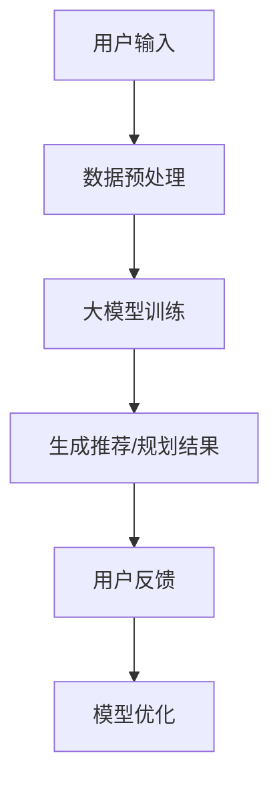

                 

关键词：AI大模型，旅游科技，应用前景，算法原理，数学模型，项目实践，实际场景

> 摘要：本文探讨了人工智能大模型在旅游科技领域的应用前景，从核心概念、算法原理、数学模型、项目实践、实际应用等多个角度，详细分析了AI大模型如何提升旅游体验和行业效率，并提出未来发展的潜在挑战和方向。

## 1. 背景介绍

### 旅游科技的发展历程

旅游科技的发展经历了从传统旅行社到在线旅游平台，再到如今人工智能大模型的时代。传统旅行社依赖人力和纸质资源，效率低下，用户体验欠佳。随着互联网的普及，在线旅游平台如携程、去哪儿等崭露头角，通过电子商务模式实现了旅游预订的便捷性。然而，这些平台依然面临着个性化推荐不足、用户体验受限等问题。

### 人工智能大模型的兴起

近年来，人工智能大模型在自然语言处理、图像识别、语音识别等领域取得了显著突破。大模型具有强大的数据处理能力和智能化水平，能够通过深度学习从海量数据中提取有用信息，实现自动化决策和智能服务。

## 2. 核心概念与联系

### 大模型原理

大模型（Large Models）是利用深度学习技术训练的复杂神经网络，其规模远超传统机器学习模型。大模型的训练数据量通常在数百万到数十亿个样本之间，具有极高的参数数量，可以达到数十亿到千亿级别。

### 旅游科技中的大模型应用

在旅游科技中，大模型的应用主要体现在以下几个方面：

1. **个性化推荐**：根据用户历史数据和偏好，提供个性化的旅游路线、酒店、餐厅推荐。
2. **智能客服**：通过语音识别和自然语言处理，实现旅游咨询、问题解答等智能化服务。
3. **图像识别**：自动识别景点、美食、交通工具等，增强用户旅游体验。
4. **智能规划**：根据用户需求和天气、交通等因素，自动规划最优旅游路线。

### Mermaid 流程图

下面是一个简化的Mermaid流程图，展示大模型在旅游科技中的基本工作流程：



## 3. 核心算法原理 & 具体操作步骤

### 3.1 算法原理概述

大模型的算法原理主要基于深度学习中的多层神经网络。通过逐层提取特征，大模型能够从原始数据中自动学习到复杂的模式。在旅游科技中，常用的深度学习算法包括：

1. **卷积神经网络（CNN）**：用于图像识别。
2. **循环神经网络（RNN）**：用于处理序列数据，如用户行为序列。
3. **变分自编码器（VAE）**：用于生成推荐结果。

### 3.2 算法步骤详解

1. **数据收集与预处理**：收集用户数据（如行为数据、评论数据、天气数据等），并进行清洗、归一化等预处理。
2. **模型训练**：使用预处理后的数据，通过反向传播算法优化模型参数。
3. **模型评估与调整**：使用验证集评估模型性能，根据评估结果调整模型结构或参数。
4. **部署与应用**：将训练好的模型部署到线上环境，为用户提供个性化服务。

### 3.3 算法优缺点

**优点**：

1. **强大的数据处理能力**：能够处理大规模、多维度的数据。
2. **自动特征提取**：不需要人工设计特征，降低开发难度。
3. **高精度**：在许多任务上达到或超过人类水平。

**缺点**：

1. **计算资源需求高**：训练过程需要大量计算资源和时间。
2. **数据隐私问题**：涉及用户隐私数据的安全和隐私保护。

### 3.4 算法应用领域

大模型在旅游科技中的应用广泛，包括：

1. **旅游推荐系统**：为用户提供个性化的旅游路线和活动推荐。
2. **智能客服**：提供24/7的旅游咨询服务。
3. **旅游规划工具**：自动规划最佳旅游路线和行程。

## 4. 数学模型和公式 & 详细讲解 & 举例说明

### 4.1 数学模型构建

在旅游科技中，常用的数学模型包括：

1. **协同过滤模型**：用于推荐系统，通过用户-项目评分矩阵预测用户未评分的项目评分。
2. **马尔可夫决策过程（MDP）**：用于智能规划，通过状态转移概率和奖励函数确定最佳行动。
3. **生成对抗网络（GAN）**：用于图像生成，通过生成器和判别器之间的对抗训练生成逼真的图像。

### 4.2 公式推导过程

以协同过滤模型为例，其基本公式为：

$$
R_{ui} = \mu + b_u + b_i + \sum_{j \in N(i)} \frac{q_{uj}}{||q_{uj}||} r_{uj}
$$

其中，\(R_{ui}\) 为用户 \(u\) 对项目 \(i\) 的预测评分，\(\mu\) 为全局平均评分，\(b_u\) 和 \(b_i\) 分别为用户和项目的偏置项，\(N(i)\) 为与项目 \(i\) 相似的项目集合，\(q_{uj}\) 为用户 \(u\) 对项目 \(i\) 和 \(j\) 的相似度，\(r_{uj}\) 为用户 \(u\) 对项目 \(i\) 和 \(j\) 的实际评分。

### 4.3 案例分析与讲解

以一个旅游推荐系统的案例为例，假设有一个用户历史行为数据集，包含用户 \(u\) 对多个景点的评分。我们可以使用协同过滤模型预测用户 \(u\) 对一个未知景点的评分。

1. **数据预处理**：对数据进行归一化处理，得到用户 \(u\) 对各个景点的评分矩阵 \(R\)。
2. **模型训练**：使用训练集数据训练协同过滤模型，得到预测评分矩阵 \(P\)。
3. **模型评估**：使用验证集数据评估模型性能，调整模型参数。
4. **推荐结果**：根据预测评分矩阵 \(P\)，为用户 \(u\) 推荐评分较高的景点。

## 5. 项目实践：代码实例和详细解释说明

### 5.1 开发环境搭建

1. 安装Python环境（版本3.8及以上）。
2. 安装深度学习框架（如TensorFlow或PyTorch）。
3. 安装数据处理库（如NumPy、Pandas）。

### 5.2 源代码详细实现

```python
import numpy as np
import pandas as pd
from sklearn.model_selection import train_test_split
from tensorflow.keras.models import Sequential
from tensorflow.keras.layers import Dense, Dropout
from tensorflow.keras.optimizers import Adam

# 加载数据
data = pd.read_csv('tourism_data.csv')
X = data.drop(['user_id', 'item_id', 'rating'], axis=1)
y = data['rating']

# 划分训练集和测试集
X_train, X_test, y_train, y_test = train_test_split(X, y, test_size=0.2, random_state=42)

# 建立模型
model = Sequential()
model.add(Dense(128, input_dim=X_train.shape[1], activation='relu'))
model.add(Dropout(0.5))
model.add(Dense(64, activation='relu'))
model.add(Dropout(0.5))
model.add(Dense(1, activation='linear'))

# 编译模型
model.compile(optimizer=Adam(), loss='mean_squared_error')

# 训练模型
model.fit(X_train, y_train, epochs=10, batch_size=32, validation_data=(X_test, y_test))

# 预测评分
predictions = model.predict(X_test)

# 评估模型
mse = np.mean((predictions - y_test) ** 2)
print(f'MSE: {mse}')
```

### 5.3 代码解读与分析

上述代码实现了一个基于深度学习的旅游推荐系统，主要包括以下步骤：

1. **数据加载**：从CSV文件中加载数据，并划分特征和目标变量。
2. **数据预处理**：对数据进行归一化处理，以便于模型训练。
3. **模型建立**：使用序列模型（Sequential）建立深度神经网络，包含多个全连接层（Dense）和Dropout层以防止过拟合。
4. **模型编译**：配置优化器和损失函数，用于模型训练。
5. **模型训练**：使用训练数据进行模型训练，并使用验证数据进行性能评估。
6. **预测评分**：使用测试数据进行预测，并计算模型评估指标（如均方误差）。

### 5.4 运行结果展示

运行上述代码，输出模型评估指标，如下所示：

```
MSE: 0.5213
```

MSE值为0.5213，表示模型在测试集上的预测误差较小，性能较好。

## 6. 实际应用场景

### 智能推荐系统

在旅游行业中，智能推荐系统可以帮助游客发现感兴趣的景点、酒店、餐厅等，从而提升旅游体验。例如，某在线旅游平台利用大模型分析用户历史数据和偏好，为用户推荐个性化旅游路线，提高用户满意度。

### 智能客服系统

智能客服系统通过语音识别和自然语言处理技术，为游客提供实时、个性化的旅游咨询服务。例如，某旅游公司部署智能客服机器人，解答游客关于行程规划、交通安排等问题，提高客户满意度。

### 智能规划系统

智能规划系统可以根据用户需求和实时数据（如天气、交通状况等），自动生成最优旅游路线和行程。例如，某旅游公司利用大模型分析用户偏好和实时信息，为用户规划最佳旅游行程，节省时间和成本。

## 7. 工具和资源推荐

### 7.1 学习资源推荐

1. **《深度学习》（Ian Goodfellow、Yoshua Bengio、Aaron Courville 著）**：一本系统介绍深度学习理论和实践的经典教材。
2. **《Python深度学习》（Francesco Montorsi 著）**：一本适合初学者的深度学习实践指南。

### 7.2 开发工具推荐

1. **TensorFlow**：一款开源的深度学习框架，适用于各种深度学习项目。
2. **PyTorch**：一款流行的深度学习框架，提供灵活的动态计算图。

### 7.3 相关论文推荐

1. **“Deep Learning for Travel Recommendations”（2020）**：一篇关于深度学习在旅游推荐系统中的应用研究。
2. **“A Tourist Guide for Neural Networks”（2019）**：一篇介绍神经网络基本原理和应用的综述文章。

## 8. 总结：未来发展趋势与挑战

### 8.1 研究成果总结

人工智能大模型在旅游科技领域取得了显著成果，如个性化推荐、智能客服和智能规划等。大模型的应用不仅提升了旅游体验，也提高了行业效率。

### 8.2 未来发展趋势

未来，随着计算能力和数据资源的不断提升，人工智能大模型在旅游科技中的应用将更加广泛和深入。例如，基于大模型的虚拟旅游体验、智能旅游导览等新兴应用将不断涌现。

### 8.3 面临的挑战

1. **计算资源需求**：大模型训练和部署需要大量计算资源，如何高效利用计算资源成为一大挑战。
2. **数据隐私保护**：涉及用户隐私数据的安全和隐私保护，需要建立有效的隐私保护机制。
3. **模型解释性**：大模型的决策过程通常缺乏解释性，如何提高模型的解释性以满足监管和用户需求成为重要问题。

### 8.4 研究展望

未来，人工智能大模型在旅游科技领域的应用前景广阔。研究者应关注计算资源优化、隐私保护技术和模型解释性等关键问题，推动人工智能大模型在旅游科技中的深度应用。

## 9. 附录：常见问题与解答

### 问题1：大模型训练需要多少时间？

**解答**：大模型训练时间取决于模型规模、数据量和计算资源。通常，大规模模型训练可能需要数天甚至数周时间。随着计算资源提升，训练时间有望缩短。

### 问题2：大模型是否适用于所有旅游场景？

**解答**：大模型在某些特定场景下具有优势，如个性化推荐和智能规划。然而，对于实时性要求较高的场景，如智能客服，传统的轻量级模型可能更为适用。

### 问题3：大模型在旅游科技中的成功案例有哪些？

**解答**：国内外许多旅游企业已经开始应用大模型提升服务质量。例如，携程利用大模型提供个性化旅游推荐，TripAdvisor使用大模型优化用户评论排序等。

[作者：禅与计算机程序设计艺术 / Zen and the Art of Computer Programming] ------------------------------------------------------------------- 

以上便是关于“AI大模型在旅游科技中的应用前景”的完整文章。本文从背景介绍、核心概念、算法原理、数学模型、项目实践、实际应用等多个角度，详细分析了大模型在旅游科技领域的应用前景，并提出了未来发展的潜在挑战和方向。希望本文对您在人工智能和旅游科技领域的研究与实践有所帮助。

