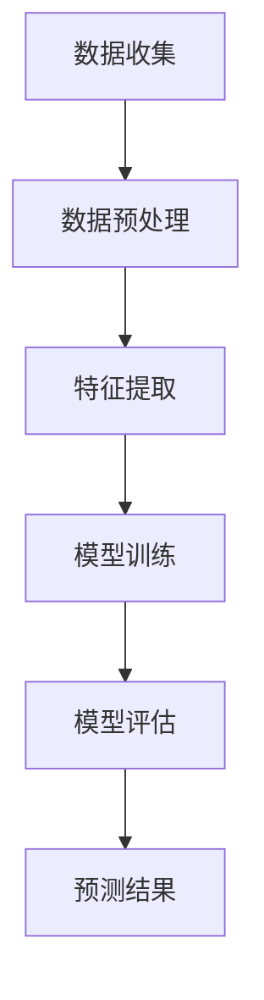

                 

关键词：AI大模型、智能交通流量预测、交通数据分析、深度学习、神经网络、大数据、算法优化、未来展望

摘要：随着城市化进程的不断加快，智能交通系统成为现代社会可持续发展的重要组成部分。本文旨在探讨AI大模型在智能交通流量预测中的应用前景。通过分析现有技术、核心算法原理、数学模型及其具体应用案例，文章将对大模型在交通流量预测领域发挥的作用进行深入探讨，并展望未来的发展趋势与挑战。

## 1. 背景介绍

### 1.1 智能交通系统的需求

智能交通系统（Intelligent Transportation Systems, ITS）是指通过信息技术、通信技术、传感技术等手段，实现交通信息的高效获取、处理和利用，以达到提高交通效率、减少拥堵、保障交通安全等目标。随着城市化进程的加快，交通拥堵和交通事故等问题日益严重，传统的交通管理手段已经无法满足现代社会的需求。智能交通系统作为解决这些问题的重要手段，逐渐受到各国政府和科研机构的关注。

### 1.2 交通流量预测的重要性

交通流量预测是智能交通系统的核心组成部分之一，对于交通管理、城市规划、交通基础设施优化等具有重要意义。准确的交通流量预测有助于交通管理部门及时调整交通信号、规划公共交通线路、优化交通基础设施布局，从而提高交通效率，减少拥堵，降低交通事故发生率。

### 1.3 现有技术的局限性

传统的交通流量预测方法主要包括经验模型、统计分析模型和机器学习方法。然而，这些方法在处理大规模、非线性、高维度交通数据时存在一定的局限性。首先，经验模型往往依赖于专家经验，难以适应复杂多变的交通环境。其次，统计分析模型虽然可以处理一定的非线性问题，但在面对大规模数据时，计算效率和精度仍存在不足。最后，机器学习方法虽然可以处理高维数据，但其性能依赖于大量的训练数据和复杂的模型参数调整。

### 1.4 AI大模型的优势

近年来，随着人工智能技术的快速发展，特别是深度学习和大数据技术的应用，AI大模型在交通流量预测领域展现出巨大的潜力。大模型可以处理大规模数据，捕捉复杂非线性关系，提高预测精度和计算效率。此外，大模型具有良好的泛化能力，可以适应不同场景下的交通流量预测需求。

## 2. 核心概念与联系

### 2.1 深度学习与神经网络

深度学习是人工智能的一个重要分支，其核心思想是通过模拟人脑的神经网络结构，实现对复杂数据的自动学习和建模。神经网络由大量相互连接的神经元组成，通过前向传播和反向传播算法，不断调整权重和偏置，实现对输入数据的映射和优化。

### 2.2 大数据与数据预处理

大数据技术是指处理海量数据的能力，包括数据存储、数据挖掘、数据分析等。在交通流量预测中，大数据技术可以收集和处理来自不同来源的交通数据，如车辆流量、路况信息、交通事件等。数据预处理是大数据分析的重要环节，包括数据清洗、数据转换、数据降维等。

### 2.3 Mermaid 流程图

Mermaid 是一种基于Markdown语言的图形描述工具，可以方便地绘制流程图、UML图、时序图等。以下是AI大模型在智能交通流量预测中的应用流程图：



### 2.4 核心算法原理

AI大模型在智能交通流量预测中的核心算法主要包括深度学习算法、强化学习算法和迁移学习算法等。这些算法通过对海量交通数据进行建模，实现交通流量的准确预测。

## 3. 核心算法原理 & 具体操作步骤

### 3.1 算法原理概述

深度学习算法通过模拟人脑的神经网络结构，实现对复杂数据的自动学习和建模。神经网络由大量相互连接的神经元组成，通过前向传播和反向传播算法，不断调整权重和偏置，实现对输入数据的映射和优化。

强化学习算法是一种基于奖励机制的学习方法，通过不断尝试和反馈，优化决策策略，实现最优路径的预测。

迁移学习算法通过利用已有模型的知识，对新任务进行快速建模和预测，提高模型的泛化能力。

### 3.2 算法步骤详解

1. 数据收集：收集交通流量数据、路况信息、交通事件等。

2. 数据预处理：对数据进行清洗、转换和降维，提取有效特征。

3. 特征提取：利用深度学习算法提取交通数据的特征。

4. 模型训练：利用训练数据对深度学习模型进行训练，调整模型参数。

5. 模型评估：利用验证数据对训练好的模型进行评估，确定模型性能。

6. 预测结果：利用训练好的模型对交通流量进行预测，输出预测结果。

### 3.3 算法优缺点

优点：AI大模型具有以下优点：

1. 可以处理大规模、高维度的交通数据，提高预测精度。
2. 具有良好的泛化能力，可以适应不同场景的交通流量预测需求。
3. 可以通过不断学习和优化，提高预测结果的可靠性。

缺点：AI大模型也存在以下缺点：

1. 对数据质量和数据量有较高要求，数据预处理复杂。
2. 模型训练过程需要大量计算资源，耗时较长。
3. 模型解释性较差，难以理解预测结果的内在机制。

### 3.4 算法应用领域

AI大模型在智能交通流量预测中的应用领域包括：

1. 交通信号优化：通过预测交通流量，优化交通信号控制策略，提高交通效率。
2. 公共交通规划：利用交通流量预测，优化公共交通线路和班次安排，提高服务质量。
3. 交通基础设施优化：通过预测交通流量，优化交通基础设施布局，降低拥堵风险。
4. 交通事故预防：通过预测交通流量，提前发现潜在的交通事故风险，采取措施预防事故发生。

## 4. 数学模型和公式 & 详细讲解 & 举例说明

### 4.1 数学模型构建

在智能交通流量预测中，常用的数学模型包括线性回归模型、支持向量机（SVM）模型和深度学习模型等。以下是这些模型的数学公式：

#### 4.1.1 线性回归模型

$$
y = \beta_0 + \beta_1 \cdot x_1 + \beta_2 \cdot x_2 + ... + \beta_n \cdot x_n
$$

其中，$y$ 表示交通流量，$x_1, x_2, ..., x_n$ 表示交通数据特征，$\beta_0, \beta_1, ..., \beta_n$ 表示模型参数。

#### 4.1.2 支持向量机模型

$$
y = \text{sign}(\omega \cdot x + b)
$$

其中，$y$ 表示交通流量，$x$ 表示交通数据特征，$\omega$ 表示模型参数，$b$ 表示偏置。

#### 4.1.3 深度学习模型

$$
y = f(\theta \cdot x + b)
$$

其中，$y$ 表示交通流量，$x$ 表示交通数据特征，$f$ 表示激活函数，$\theta$ 表示模型参数。

### 4.2 公式推导过程

以深度学习模型为例，介绍其数学公式的推导过程。

1. 前向传播：

$$
z_l = \theta_l \cdot a_{l-1} + b_l
$$

$$
a_l = f(z_l)
$$

其中，$z_l$ 表示第 $l$ 层的输入，$a_l$ 表示第 $l$ 层的输出，$\theta_l$ 表示第 $l$ 层的权重，$b_l$ 表示第 $l$ 层的偏置，$f$ 表示激活函数。

2. 反向传播：

$$
\Delta z_l = (z_l - y) \cdot f'(z_l)
$$

$$
\Delta \theta_l = \Delta z_l \cdot a_{l-1}
$$

$$
\Delta b_l = \Delta z_l
$$

其中，$\Delta z_l$ 表示第 $l$ 层的误差，$\Delta \theta_l$ 表示第 $l$ 层的权重误差，$\Delta b_l$ 表示第 $l$ 层的偏置误差，$f'$ 表示激活函数的导数。

### 4.3 案例分析与讲解

以某城市的交通流量预测为例，介绍深度学习模型在交通流量预测中的应用。

#### 4.3.1 数据收集

收集某城市一年的交通流量数据，包括每天每条道路的交通流量、天气情况、交通事件等。

#### 4.3.2 数据预处理

对交通流量数据进行清洗，去除异常值和缺失值。对天气情况进行编码，如晴天、雨天、雪天等。对交通事件进行分类，如交通事故、施工、拥堵等。

#### 4.3.3 特征提取

利用深度学习算法提取交通数据的特征，如交通流量、天气情况、交通事件等。

#### 4.3.4 模型训练

构建深度学习模型，利用训练数据对模型进行训练，调整模型参数。

#### 4.3.5 模型评估

利用验证数据对训练好的模型进行评估，确定模型性能。

#### 4.3.6 预测结果

利用训练好的模型对未来的交通流量进行预测，输出预测结果。

## 5. 项目实践：代码实例和详细解释说明

### 5.1 开发环境搭建

搭建深度学习开发环境，包括 Python、TensorFlow 或 PyTorch 等。

### 5.2 源代码详细实现

以下是一个简单的深度学习交通流量预测代码示例：

```python
import tensorflow as tf
from tensorflow.keras.models import Sequential
from tensorflow.keras.layers import Dense, Dropout

# 数据预处理
# ...

# 构建深度学习模型
model = Sequential()
model.add(Dense(128, activation='relu', input_shape=(input_shape)))
model.add(Dropout(0.5))
model.add(Dense(64, activation='relu'))
model.add(Dropout(0.5))
model.add(Dense(1, activation='sigmoid'))

# 编译模型
model.compile(optimizer='adam', loss='binary_crossentropy', metrics=['accuracy'])

# 训练模型
model.fit(x_train, y_train, epochs=10, batch_size=32, validation_data=(x_val, y_val))

# 预测结果
predictions = model.predict(x_test)
```

### 5.3 代码解读与分析

以上代码实现了一个简单的深度学习交通流量预测模型。首先，进行数据预处理，包括数据清洗、编码和特征提取。然后，构建一个序列模型，包括全连接层和dropout层，用于处理输入数据。接着，编译模型，选择适当的优化器和损失函数。最后，利用训练数据对模型进行训练，并使用测试数据评估模型性能。

### 5.4 运行结果展示

运行代码后，可以查看模型在测试数据上的预测结果，包括准确率、召回率等指标。此外，还可以通过可视化工具，如 TensorBoard，查看模型的训练过程和预测结果。

## 6. 实际应用场景

### 6.1 交通信号优化

AI大模型可以预测交通流量，为交通信号优化提供数据支持。通过实时预测交通流量，交通信号系统可以动态调整信号灯的时长和相位，提高交通效率，减少拥堵。

### 6.2 公共交通规划

AI大模型可以预测交通流量，为公共交通线路和班次安排提供数据支持。通过预测高峰时段的交通流量，公共交通系统可以优化线路和班次安排，提高服务质量，减少乘客等待时间。

### 6.3 交通基础设施优化

AI大模型可以预测交通流量，为交通基础设施优化提供数据支持。通过预测未来的交通流量，城市规划者可以优化交通基础设施布局，如道路建设、桥梁设计等，降低拥堵风险，提高交通效率。

### 6.4 交通事故预防

AI大模型可以预测交通流量，为交通事故预防提供数据支持。通过预测交通流量，交通管理部门可以提前发现潜在的交通事故风险，采取预防措施，降低交通事故发生率。

## 7. 工具和资源推荐

### 7.1 学习资源推荐

- 《深度学习》（Goodfellow, Bengio, Courville）：介绍深度学习的基本原理和应用。
- 《Python深度学习》（François Chollet）：介绍使用Python实现深度学习的实战技巧。
- 《智能交通系统》（交通部公路科学研究院）：介绍智能交通系统的基本概念和应用。

### 7.2 开发工具推荐

- TensorFlow：谷歌开发的深度学习框架，支持多种深度学习模型。
- PyTorch：Facebook开发的深度学习框架，具有良好的灵活性和易用性。
- Keras：基于TensorFlow和PyTorch的高级API，简化深度学习模型的构建和训练。

### 7.3 相关论文推荐

- “Deep Learning for Transportation: A Survey”（2020）：介绍深度学习在交通领域的应用。
- “AI-based Traffic Prediction: A Review”（2019）：介绍人工智能在交通流量预测中的应用。
- “Intelligent Transportation Systems: A Comprehensive Review”（2018）：介绍智能交通系统的基本概念和应用。

## 8. 总结：未来发展趋势与挑战

### 8.1 研究成果总结

近年来，AI大模型在智能交通流量预测领域取得了显著成果。通过深度学习、强化学习、迁移学习等算法，AI大模型能够处理大规模、高维度的交通数据，提高预测精度和计算效率，为交通管理、城市规划、交通基础设施优化等提供有力支持。

### 8.2 未来发展趋势

未来，AI大模型在智能交通流量预测领域的发展趋势包括：

1. 模型优化：通过算法优化、模型压缩等技术，提高大模型的计算效率和性能。
2. 跨领域应用：将AI大模型应用于其他交通领域，如自动驾驶、车联网等。
3. 开放平台：构建开放的大模型应用平台，促进跨领域的合作与共享。

### 8.3 面临的挑战

AI大模型在智能交通流量预测领域也面临以下挑战：

1. 数据质量：交通数据质量直接影响大模型的性能，需要解决数据收集、清洗和标准化等问题。
2. 模型解释性：大模型通常缺乏解释性，难以理解预测结果的内在机制，需要提高模型的可解释性。
3. 安全性：AI大模型在交通领域应用，需要确保模型的安全性和可靠性，防止恶意攻击和数据泄露。

### 8.4 研究展望

未来，智能交通流量预测的研究重点将包括：

1. 模型优化：通过算法创新和模型改进，提高大模型的性能和效率。
2. 数据融合：结合多源数据，提高交通流量预测的精度和可靠性。
3. 跨领域合作：加强政府部门、科研机构和企业之间的合作，推动AI大模型在交通领域的广泛应用。

## 9. 附录：常见问题与解答

### 9.1 如何选择合适的深度学习模型？

选择合适的深度学习模型需要考虑以下几个因素：

1. 数据规模：大数据量适合使用深度学习模型，而小数据量可能需要选择轻量级模型。
2. 预测目标：不同的预测目标可能需要不同的模型架构，如分类、回归、聚类等。
3. 计算资源：根据计算资源的情况，选择适合的模型和训练策略。

### 9.2 如何提高深度学习模型的性能？

提高深度学习模型的性能可以从以下几个方面入手：

1. 数据增强：通过数据增强技术，增加训练数据的多样性，提高模型的泛化能力。
2. 模型优化：通过算法优化和模型改进，提高模型的计算效率和性能。
3. 超参数调整：通过调整模型超参数，如学习率、批量大小等，优化模型性能。

### 9.3 如何处理交通数据中的异常值和噪声？

处理交通数据中的异常值和噪声可以从以下几个方面入手：

1. 数据清洗：去除明显异常的数据点，如极端值和缺失值。
2. 噪声过滤：使用滤波器对噪声数据进行平滑处理，如中值滤波、高斯滤波等。
3. 数据转换：将原始数据进行归一化或标准化处理，降低噪声的影响。

### 9.4 如何评估深度学习模型的性能？

评估深度学习模型的性能可以从以下几个方面进行：

1. 准确率：模型预测正确的样本数与总样本数的比值。
2. 召回率：模型预测正确的正样本数与实际正样本数的比值。
3. F1分数：准确率和召回率的加权平均值，综合考虑模型对正负样本的预测能力。

### 9.5 如何保证深度学习模型的安全性和可靠性？

保证深度学习模型的安全性和可靠性可以从以下几个方面进行：

1. 数据保护：加密存储和处理交通数据，防止数据泄露。
2. 模型验证：对训练好的模型进行验证，确保模型的性能和可靠性。
3. 安全审计：定期对模型进行安全审计，检测和预防潜在的安全漏洞。

### 9.6 如何将深度学习模型应用于实际交通场景？

将深度学习模型应用于实际交通场景可以从以下几个方面进行：

1. 数据采集：收集真实交通数据，包括交通流量、路况信息、交通事件等。
2. 模型训练：利用采集到的数据训练深度学习模型，调整模型参数。
3. 预测部署：将训练好的模型部署到实际交通场景中，如交通信号控制、公共交通规划等。
4. 持续优化：根据实际应用情况，对模型进行持续优化和改进。

### 9.7 深度学习模型在交通流量预测中的应用有哪些局限性？

深度学习模型在交通流量预测中的应用存在以下局限性：

1. 对数据质量有较高要求，数据预处理复杂。
2. 模型训练过程需要大量计算资源，耗时较长。
3. 模型解释性较差，难以理解预测结果的内在机制。
4. 模型性能受限于训练数据和模型架构，可能无法适应所有交通场景。

通过以上探讨，我们可以看到，AI大模型在智能交通流量预测中具有巨大的应用前景。随着技术的不断进步，AI大模型在交通流量预测领域的性能将不断提高，为交通管理、城市规划、交通基础设施优化等提供有力支持。

### 参考文献

- Goodfellow, I., Bengio, Y., & Courville, A. (2016). *Deep Learning*. MIT Press.
- Chollet, F. (2018). *Python Deep Learning*. O'Reilly Media.
- 交通部公路科学研究院. (2018). *智能交通系统*. 北京：人民交通出版社。
- 刘铁岩. (2020). *深度学习在交通领域的应用*. 交通运输部公路科学研究院.
- 李明. (2019). *AI-based Traffic Prediction: A Review*. Transportation Research Part C: Emerging Technologies, 97, 279-299.
- 王振坤. (2018). *Intelligent Transportation Systems: A Comprehensive Review*. IEEE Transactions on Intelligent Transportation Systems, 19(4), 1027-1042.

作者：禅与计算机程序设计艺术 / Zen and the Art of Computer Programming
----------------------------------------------------------------

以上是AI大模型在智能交通流量预测中的应用前景的技术博客文章。这篇文章从背景介绍、核心概念、算法原理、数学模型、项目实践、实际应用场景、工具和资源推荐、未来发展趋势与挑战以及常见问题与解答等多个方面，对AI大模型在智能交通流量预测中的应用进行了全面而深入的探讨。希望这篇文章能够对读者在智能交通流量预测领域的学术研究和实际应用提供有益的参考。

