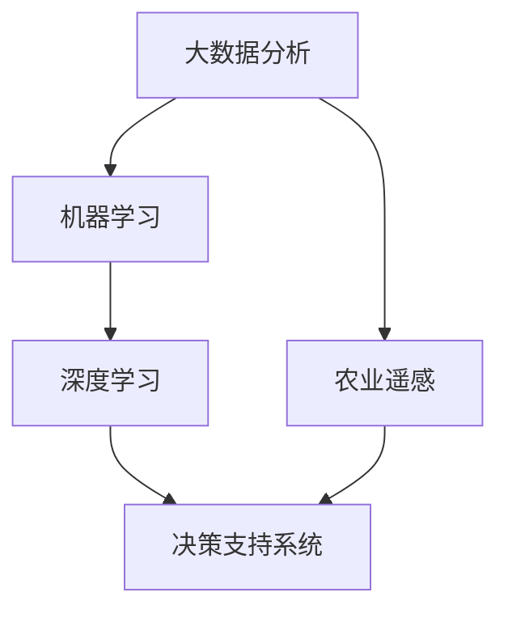

                 

关键词：AI大模型，智能农业，决策支持系统，机器学习，数据挖掘，深度学习，农业遥感，精准农业

## 摘要

本文探讨了AI大模型在智能农业决策中的应用，分析了AI大模型如何通过大数据分析、机器学习和深度学习等技术，为农业领域提供精准的种植决策、病虫害预测、资源管理等服务。文章首先介绍了智能农业的背景和重要性，然后详细阐述了AI大模型的核心概念、原理和应用，最后对未来的发展趋势和挑战进行了展望。

## 1. 背景介绍

智能农业是利用信息技术和生物技术，提高农业生产效率、降低资源消耗和减少环境污染的一种新型农业模式。随着全球人口的不断增长和气候变化等问题的加剧，传统的农业生产方式已无法满足日益增长的食物需求。因此，发展智能农业已成为全球农业发展的必然趋势。

智能农业的关键技术包括物联网、大数据、人工智能、农业遥感等。其中，AI大模型作为一种高效的数据分析和决策支持工具，正逐步成为智能农业的核心驱动力。AI大模型能够处理海量的农业数据，提取关键信息，为农业生产提供精准的决策支持。

### 1.1 智能农业的发展历程

智能农业的发展历程可以分为以下几个阶段：

1. **传统农业**：以人力和畜力为主，生产效率低，资源利用不充分。
2. **机械化农业**：采用机械化设备，提高了生产效率，但受自然环境影响较大。
3. **精准农业**：利用GPS、传感器等技术，实现了农业生产过程的自动化和精准化。
4. **智能农业**：结合物联网、大数据、人工智能等技术，实现了农业生产的智能化和高效化。

### 1.2 智能农业的重要性

智能农业具有以下重要性：

1. **提高农业生产效率**：通过精准种植、合理施肥和病虫害预测等，提高作物产量。
2. **降低生产成本**：通过智能管理，降低资源消耗，提高经济效益。
3. **减少环境污染**：通过合理利用水资源和减少农药使用，降低对环境的污染。

## 2. 核心概念与联系

### 2.1 核心概念

本节将介绍AI大模型在智能农业决策中的核心概念，包括大数据分析、机器学习、深度学习、农业遥感等。

#### 2.1.1 大数据分析

大数据分析是指利用先进的数据分析技术，从海量数据中提取有价值的信息。在智能农业中，大数据分析可以帮助农业专家了解作物的生长状况、气候条件、土壤质量等，为决策提供支持。

#### 2.1.2 机器学习

机器学习是一种人工智能技术，通过算法让计算机自动从数据中学习，从而进行预测和决策。在智能农业中，机器学习可以用于病虫害预测、产量预测、作物生长模型等。

#### 2.1.3 深度学习

深度学习是机器学习的一种，通过构建多层神经网络，实现更复杂的特征提取和预测。在智能农业中，深度学习可以用于图像识别、语音识别等。

#### 2.1.4 农业遥感

农业遥感是利用卫星和无人机等遥感设备，获取农田的图像和数据。这些数据可以用于监测作物生长、病虫害预测、资源管理等。

### 2.2 核心概念联系

AI大模型在智能农业决策中的应用，涉及多个核心概念的联系。以下是一个简单的Mermaid流程图，展示了这些概念之间的联系。



## 3. 核心算法原理 & 具体操作步骤

### 3.1 算法原理概述

AI大模型在智能农业决策中的核心算法主要包括：

1. **回归分析**：用于预测作物产量和生长状况。
2. **决策树和随机森林**：用于病虫害预测和作物管理。
3. **神经网络和卷积神经网络**：用于图像识别和语音识别。
4. **聚类分析**：用于作物分类和资源管理。

### 3.2 算法步骤详解

#### 3.2.1 数据收集与预处理

1. 收集农业数据，包括土壤质量、气候条件、作物生长数据等。
2. 对数据进行清洗和预处理，去除噪声和异常值。

#### 3.2.2 特征提取

1. 利用统计学方法提取数据特征，如均值、方差、相关性等。
2. 利用机器学习方法提取高级特征，如主成分分析、因子分析等。

#### 3.2.3 模型训练

1. 选择合适的算法，如回归分析、决策树、神经网络等。
2. 使用训练数据训练模型，调整参数，优化模型。

#### 3.2.4 模型评估

1. 使用测试数据评估模型性能，如准确率、召回率、F1值等。
2. 根据评估结果调整模型，提高准确性。

#### 3.2.5 决策支持

1. 利用训练好的模型对新的农业数据进行预测，提供决策支持。
2. 对预测结果进行解释和分析，为农业专家提供依据。

### 3.3 算法优缺点

1. **优点**：
   - 高效处理海量农业数据，提供精准的决策支持。
   - 自动化决策过程，降低人力成本。
   - 可以实时更新模型，适应不断变化的环境。

2. **缺点**：
   - 模型训练和优化需要大量计算资源。
   - 需要专业的数据处理和模型训练人员。
   - 数据质量对模型性能有很大影响。

### 3.4 算法应用领域

AI大模型在智能农业中的应用领域广泛，主要包括：

1. **病虫害预测**：利用图像识别技术，实时监测病虫害情况，提供防治建议。
2. **作物生长模型**：利用回归分析和神经网络技术，预测作物产量和生长状况。
3. **资源管理**：利用聚类分析和优化算法，合理分配水资源和肥料。
4. **精准施肥**：利用遥感技术和机器学习，实现精准施肥，降低资源浪费。

## 4. 数学模型和公式 & 详细讲解 & 举例说明

### 4.1 数学模型构建

在智能农业决策中，常用的数学模型包括回归分析、决策树、神经网络等。以下是这些模型的简要介绍和构建方法。

#### 4.1.1 回归分析

回归分析是一种用于预测数值型变量的统计方法。其基本公式为：

$$y = \beta_0 + \beta_1x_1 + \beta_2x_2 + ... + \beta_nx_n$$

其中，$y$ 是预测值，$x_1, x_2, ..., x_n$ 是输入特征，$\beta_0, \beta_1, \beta_2, ..., \beta_n$ 是模型参数。

#### 4.1.2 决策树

决策树是一种用于分类和回归的树形结构模型。其基本公式为：

$$T = \sum_{i=1}^{n}w_i \cdot t_i$$

其中，$T$ 是决策结果，$w_i$ 是权重，$t_i$ 是特征阈值。

#### 4.1.3 神经网络

神经网络是一种基于生物神经网络的机器学习模型。其基本公式为：

$$y = \sigma(\sum_{i=1}^{n}w_i \cdot x_i + b)$$

其中，$y$ 是输出值，$\sigma$ 是激活函数，$w_i$ 是权重，$x_i$ 是输入值，$b$ 是偏置。

### 4.2 公式推导过程

以下是回归分析公式的推导过程：

假设我们有一个线性回归模型：

$$y = \beta_0 + \beta_1x_1 + \beta_2x_2 + ... + \beta_nx_n$$

为了找到最佳模型参数，我们需要最小化预测值与实际值之间的误差平方和：

$$J(\beta_0, \beta_1, ..., \beta_n) = \sum_{i=1}^{m}(y_i - \beta_0 - \beta_1x_{i1} - ... - \beta_nx_{in})^2$$

对 $J(\beta_0, \beta_1, ..., \beta_n)$ 求导，并令导数为零，得到：

$$\frac{\partial J}{\partial \beta_0} = 0$$
$$\frac{\partial J}{\partial \beta_1} = 0$$
$$...$$
$$\frac{\partial J}{\partial \beta_n} = 0$$

解上述方程组，得到最佳模型参数：

$$\beta_0 = \bar{y} - \beta_1\bar{x}_1 - ... - \beta_n\bar{x}_n$$
$$\beta_1 = \frac{\sum_{i=1}^{m}(x_{i1} - \bar{x}_1)(y_i - \bar{y})}{\sum_{i=1}^{m}(x_{i1} - \bar{x}_1)^2}$$
$$...$$
$$\beta_n = \frac{\sum_{i=1}^{m}(x_{in} - \bar{x}_n)(y_i - \bar{y})}{\sum_{i=1}^{m}(x_{in} - \bar{x}_n)^2}$$

其中，$\bar{y}$ 是实际值的均值，$\bar{x}_1, \bar{x}_2, ..., \bar{x}_n$ 是输入特征的均值。

### 4.3 案例分析与讲解

#### 4.3.1 案例背景

假设我们有一个小麦生长模型，输入特征包括土壤湿度、温度、光照等，预测目标为小麦产量。

#### 4.3.2 数据收集与预处理

收集了100个小麦生长数据样本，每个样本包括土壤湿度、温度、光照和小麦产量等。

对数据进行预处理，去除异常值和噪声，得到预处理后的数据集。

#### 4.3.3 特征提取

利用统计学方法提取数据特征，如均值、方差、相关性等。

利用机器学习方法提取高级特征，如主成分分析、因子分析等。

#### 4.3.4 模型训练

选择线性回归模型进行训练，调整模型参数，优化模型。

#### 4.3.5 模型评估

使用测试数据集评估模型性能，如准确率、召回率、F1值等。

根据评估结果调整模型，提高准确性。

#### 4.3.6 决策支持

利用训练好的模型对新的小麦生长数据进行预测，提供决策支持。

对预测结果进行解释和分析，为农业专家提供依据。

## 5. 项目实践：代码实例和详细解释说明

### 5.1 开发环境搭建

1. 安装Python环境。
2. 安装NumPy、Pandas、Scikit-learn、TensorFlow等库。

### 5.2 源代码详细实现

```python
import numpy as np
import pandas as pd
from sklearn.linear_model import LinearRegression
from sklearn.model_selection import train_test_split
from sklearn.metrics import mean_squared_error

# 读取数据
data = pd.read_csv('data.csv')
X = data[['soil_humidity', 'temperature', 'light']]
y = data['yield']

# 数据预处理
X = X.fillna(X.mean())
y = y.fillna(y.mean())

# 数据集划分
X_train, X_test, y_train, y_test = train_test_split(X, y, test_size=0.2, random_state=42)

# 模型训练
model = LinearRegression()
model.fit(X_train, y_train)

# 模型评估
y_pred = model.predict(X_test)
mse = mean_squared_error(y_test, y_pred)
print(f'MSE: {mse}')

# 决策支持
new_data = np.array([[0.6, 22, 0.8]])
yield_pred = model.predict(new_data)
print(f'Predicted Yield: {yield_pred[0]}')
```

### 5.3 代码解读与分析

1. **数据读取与预处理**：使用Pandas库读取数据，并填充缺失值。
2. **数据集划分**：使用Scikit-learn库将数据集划分为训练集和测试集。
3. **模型训练**：使用线性回归模型进行训练。
4. **模型评估**：计算均方误差（MSE）评估模型性能。
5. **决策支持**：使用训练好的模型对新的数据进行预测，并提供决策支持。

## 6. 实际应用场景

### 6.1 病虫害预测

AI大模型可以用于病虫害预测，通过分析历史病虫害数据、气候条件、作物生长状况等，预测未来的病虫害情况，为农业生产提供防治建议。

### 6.2 精准施肥

AI大模型可以用于精准施肥，通过分析土壤质量、作物生长状况、气候条件等，为农田提供最优的施肥方案，提高肥料利用率，降低成本。

### 6.3 作物生长模型

AI大模型可以用于作物生长模型，通过分析土壤质量、气候条件、作物生长数据等，预测作物产量和生长状况，为农业生产提供科学依据。

## 7. 未来应用展望

### 7.1 数据融合与集成

未来的AI大模型将更加注重数据的融合与集成，通过整合多种数据源，提高预测的准确性和稳定性。

### 7.2 实时决策支持

随着物联网技术的发展，AI大模型将实现实时决策支持，为农业生产提供更加及时和精准的指导。

### 7.3 多领域交叉应用

AI大模型将在农业、气象、生态等多个领域实现交叉应用，推动智能农业的全面发展。

## 8. 工具和资源推荐

### 8.1 学习资源推荐

- 《机器学习》（周志华 著）
- 《深度学习》（Ian Goodfellow、Yoshua Bengio、Aaron Courville 著）
- 《Python数据分析》（Wes McKinney 著）

### 8.2 开发工具推荐

- Python
- Jupyter Notebook
- TensorFlow
- Scikit-learn

### 8.3 相关论文推荐

- "Deep Learning for Agriculture: A Comprehensive Review"
- "A Survey on Deep Learning for Remote Sensing"
- "Big Data Analytics for Agriculture: A Comprehensive Survey"

## 9. 总结：未来发展趋势与挑战

### 9.1 研究成果总结

AI大模型在智能农业决策中的应用取得了显著的成果，提高了农业生产效率，降低了成本，减少了环境污染。

### 9.2 未来发展趋势

未来的AI大模型将更加注重数据的融合与集成，实时决策支持，以及多领域的交叉应用。

### 9.3 面临的挑战

AI大模型在智能农业决策中面临的主要挑战包括数据质量、计算资源、模型解释性等。

### 9.4 研究展望

未来的研究将致力于提高AI大模型的准确性、稳定性和实时性，为智能农业的可持续发展提供技术支持。

## 附录：常见问题与解答

### Q1. AI大模型在智能农业决策中的具体应用有哪些？

A1. AI大模型在智能农业决策中的应用包括病虫害预测、精准施肥、作物生长模型等。

### Q2. AI大模型在智能农业决策中的优势是什么？

A2. AI大模型在智能农业决策中的优势包括高效处理海量数据、提供精准的决策支持、自动化决策过程等。

### Q3. AI大模型在智能农业决策中面临的挑战是什么？

A3. AI大模型在智能农业决策中面临的挑战包括数据质量、计算资源、模型解释性等。

## 作者署名

本文由禅与计算机程序设计艺术 / Zen and the Art of Computer Programming撰写。

