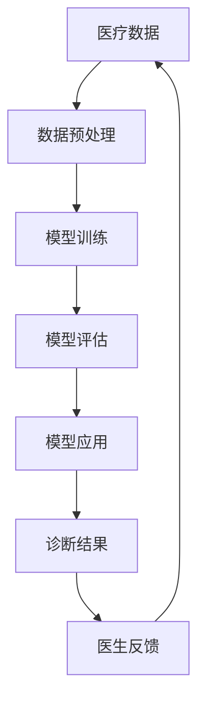

                 

关键词：人工智能，大模型，智能医疗，诊断支持，创新与挑战

> 摘要：本文探讨了人工智能大模型在智能医疗诊断支持中的应用，分析了其在临床诊断中的优势和挑战，并展望了未来的发展趋势。文章首先介绍了大模型的基本概念和技术原理，随后详细阐述了其在医疗诊断中的应用场景和效果，最后探讨了当前面临的挑战及未来可能的发展方向。

## 1. 背景介绍

### 1.1 人工智能在医疗领域的应用现状

随着人工智能技术的飞速发展，其在医疗领域的应用越来越广泛。从简单的数据分析和统计，到复杂的诊断和治疗方案制定，人工智能已经在多个方面为医疗行业带来了变革。例如，通过自然语言处理技术，可以自动解析医学文献和病历记录，提高医疗信息的获取和处理效率；通过计算机视觉技术，可以实现医学影像的自动识别和诊断，提高诊断的准确性和效率。

### 1.2 人工智能大模型的基本概念

人工智能大模型，指的是具有巨大参数量、能够处理海量数据的深度学习模型。这些模型通过在大量数据上训练，能够学习到复杂的特征和模式，从而在多个领域表现出强大的预测和分类能力。近年来，随着计算能力和数据量的提升，大模型在图像识别、语音识别、自然语言处理等领域取得了显著的成果，成为人工智能研究的热点。

### 1.3 智能医疗诊断的支持需求

智能医疗诊断，即利用人工智能技术辅助医生进行疾病诊断。传统的医疗诊断主要依赖医生的观察和经验，存在主观性强、效率低、误诊率高的问题。智能医疗诊断通过机器学习和深度学习算法，能够对医疗数据进行分析和处理，提供辅助诊断和治疗方案。这种支持对于提高诊断的准确性和效率具有重要意义。

## 2. 核心概念与联系

在智能医疗诊断中，人工智能大模型的应用涉及到多个核心概念和技术，以下是一个简化的 Mermaid 流程图，展示了这些概念之间的联系。



### 2.1 数据预处理

医疗数据通常包含文本、图像、声音等多种形式，需要进行预处理以适应深度学习模型的需求。数据预处理包括数据清洗、数据增强、数据归一化等步骤。

### 2.2 模型训练

模型训练是利用预处理后的医疗数据对深度学习模型进行训练，使其能够学习和识别医疗数据中的特征和模式。

### 2.3 模型评估

模型评估是对训练好的模型进行性能评估，以确定其诊断准确性和效率。常用的评估指标包括准确率、召回率、F1 分数等。

### 2.4 模型应用

模型应用是将训练好的模型应用于实际医疗诊断中，提供辅助诊断和治疗方案。

### 2.5 诊断结果

诊断结果是模型应用的结果，用于辅助医生进行疾病诊断。

### 2.6 医生反馈

医生反馈是对诊断结果进行评估和调整，以优化模型的性能和应用效果。

## 3. 核心算法原理 & 具体操作步骤

### 3.1 算法原理概述

智能医疗诊断中的大模型主要基于深度学习技术，其中最常用的算法是卷积神经网络（CNN）和循环神经网络（RNN）。CNN 适用于处理图像数据，可以自动提取图像中的特征；RNN 适用于处理序列数据，如文本和语音。

### 3.2 算法步骤详解

#### 3.2.1 数据预处理

1. 数据清洗：去除异常值、缺失值和重复值。
2. 数据增强：通过旋转、缩放、翻转等方式增加数据的多样性。
3. 数据归一化：将数据缩放到相同的范围，如 [0, 1]。

#### 3.2.2 模型训练

1. 准备训练数据和验证数据。
2. 构建深度学习模型，选择合适的网络结构和优化算法。
3. 训练模型，通过反向传播算法不断调整模型参数。

#### 3.2.3 模型评估

1. 使用验证数据对模型进行评估。
2. 计算模型的准确率、召回率、F1 分数等指标。
3. 调整模型参数，优化模型性能。

#### 3.2.4 模型应用

1. 使用训练好的模型对新的医疗数据进行诊断。
2. 输出诊断结果，如疾病名称、治疗方案等。

### 3.3 算法优缺点

#### 3.3.1 优点

1. 高效：大模型能够在海量数据上快速训练和评估。
2. 准确：大模型能够自动提取复杂的特征和模式，提高诊断准确率。
3. 可扩展：大模型可以应用于多种类型的医疗数据，具有较好的可扩展性。

#### 3.3.2 缺点

1. 计算资源消耗大：大模型需要大量的计算资源和存储空间。
2. 数据依赖性强：大模型的效果依赖于大量的高质量数据。
3. 黑箱问题：大模型的结构复杂，难以解释和理解。

### 3.4 算法应用领域

大模型在智能医疗诊断中具有广泛的应用领域，包括：

1. 疾病诊断：如癌症、心脏病、糖尿病等。
2. 治疗方案推荐：根据患者的病情和病史，推荐最佳治疗方案。
3. 医疗影像分析：如肺癌筛查、骨折诊断等。
4. 药物研发：通过分析大量药物数据，预测药物疗效和副作用。

## 4. 数学模型和公式 & 详细讲解 & 举例说明

### 4.1 数学模型构建

在智能医疗诊断中，常用的数学模型包括神经网络模型、支持向量机（SVM）模型等。以下以神经网络模型为例，介绍其数学模型构建。

#### 4.1.1 神经网络模型

神经网络模型由多个神经元组成，每个神经元接收多个输入，通过激活函数产生输出。神经网络的输入层接收原始数据，输出层产生预测结果，中间层负责特征提取和转换。

#### 4.1.2 前向传播

前向传播是指将输入数据通过神经网络层，逐层计算得到输出结果的过程。假设一个三层神经网络，其中第 $l$ 层的输出 $z_l$ 可以表示为：

$$
z_l = \sigma(W_l \cdot a_{l-1} + b_l)
$$

其中，$W_l$ 和 $b_l$ 分别为第 $l$ 层的权重和偏置，$\sigma$ 为激活函数，如 sigmoid 函数：

$$
\sigma(x) = \frac{1}{1 + e^{-x}}
$$

#### 4.1.3 反向传播

反向传播是指根据输出结果与真实值之间的误差，逆向计算并调整网络参数的过程。假设网络的损失函数为 $L$，则可以通过梯度下降算法更新权重和偏置：

$$
\frac{\partial L}{\partial W_l} = \delta_l \cdot a_{l-1}
$$

$$
\frac{\partial L}{\partial b_l} = \delta_l
$$

其中，$\delta_l$ 为第 $l$ 层的误差项，可以表示为：

$$
\delta_l = \sigma'(z_l) \cdot (z_l - y)
$$

### 4.2 公式推导过程

以下以一个简化的神经网络模型为例，介绍其公式的推导过程。

假设一个三层神经网络，输入为 $x$，输出为 $y$，网络的权重和偏置分别为 $W_1, b_1, W_2, b_2, W_3, b_3$。

#### 4.2.1 输入层到隐藏层

输入层到隐藏层的输出可以表示为：

$$
z_1 = W_1 \cdot x + b_1
$$

$$
a_1 = \sigma(z_1)
$$

#### 4.2.2 隐藏层到隐藏层

隐藏层到隐藏层的输出可以表示为：

$$
z_2 = W_2 \cdot a_1 + b_2
$$

$$
a_2 = \sigma(z_2)
$$

#### 4.2.3 隐藏层到输出层

隐藏层到输出层的输出可以表示为：

$$
z_3 = W_3 \cdot a_2 + b_3
$$

$$
y = \sigma(z_3)
$$

#### 4.2.4 损失函数

假设损失函数为均方误差（MSE），可以表示为：

$$
L = \frac{1}{2} \sum_{i=1}^{n} (y_i - \hat{y}_i)^2
$$

其中，$y_i$ 为真实输出，$\hat{y}_i$ 为预测输出。

#### 4.2.5 反向传播

1. 计算输出层的误差项：

$$
\delta_3 = \sigma'(z_3) \cdot (y - \hat{y})
$$

2. 计算隐藏层到隐藏层的误差项：

$$
\delta_2 = \sigma'(z_2) \cdot (W_3 \cdot \delta_3)
$$

3. 计算输入层的误差项：

$$
\delta_1 = \sigma'(z_1) \cdot (W_2 \cdot \delta_2)
$$

4. 更新网络参数：

$$
W_3 = W_3 - \alpha \cdot \frac{\partial L}{\partial W_3} = W_3 - \alpha \cdot (a_2^T \cdot \delta_3)
$$

$$
b_3 = b_3 - \alpha \cdot \frac{\partial L}{\partial b_3} = b_3 - \alpha \cdot \delta_3
$$

$$
W_2 = W_2 - \alpha \cdot \frac{\partial L}{\partial W_2} = W_2 - \alpha \cdot (a_1^T \cdot \delta_2)
$$

$$
b_2 = b_2 - \alpha \cdot \frac{\partial L}{\partial b_2} = b_2 - \alpha \cdot \delta_2
$$

$$
W_1 = W_1 - \alpha \cdot \frac{\partial L}{\partial W_1} = W_1 - \alpha \cdot (x^T \cdot \delta_1)
$$

$$
b_1 = b_1 - \alpha \cdot \frac{\partial L}{\partial b_1} = b_1 - \alpha \cdot \delta_1
$$

### 4.3 案例分析与讲解

以下以一个简单的二分类问题为例，展示如何使用神经网络模型进行疾病诊断。

#### 4.3.1 数据集准备

假设我们有一个包含癌症和非癌症患者的数据集，其中每个样本包含患者的年龄、性别、血压、胆固醇等特征。

#### 4.3.2 模型构建

我们构建一个包含两层隐藏层的神经网络模型，输入层有 5 个神经元，每个隐藏层有 10 个神经元，输出层有 2 个神经元。

#### 4.3.3 模型训练

使用训练数据对模型进行训练，设置学习率为 0.1，训练迭代次数为 100 次。

#### 4.3.4 模型评估

使用验证数据对模型进行评估，计算准确率、召回率、F1 分数等指标。

#### 4.3.5 模型应用

使用训练好的模型对新的患者数据进行诊断，输出预测结果。

## 5. 项目实践：代码实例和详细解释说明

### 5.1 开发环境搭建

在本次项目中，我们使用 Python 作为主要编程语言，结合 TensorFlow 和 Keras 库构建神经网络模型。以下是开发环境的搭建步骤：

1. 安装 Python：版本要求为 3.6 或以上。
2. 安装 TensorFlow：使用以下命令安装：

```
pip install tensorflow
```

3. 安装 Keras：使用以下命令安装：

```
pip install keras
```

### 5.2 源代码详细实现

以下是一个简单的神经网络模型，用于二分类问题。

```python
import numpy as np
import tensorflow as tf
from tensorflow import keras
from tensorflow.keras import layers

# 数据预处理
# ...（此处省略具体代码）

# 构建模型
model = keras.Sequential([
    layers.Dense(10, activation='relu', input_shape=(num_features,)),
    layers.Dense(10, activation='relu'),
    layers.Dense(2, activation='softmax')
])

# 编译模型
model.compile(optimizer='adam',
              loss='categorical_crossentropy',
              metrics=['accuracy'])

# 训练模型
model.fit(x_train, y_train, epochs=100, batch_size=32, validation_split=0.2)

# 评估模型
loss, accuracy = model.evaluate(x_test, y_test)
print(f"Test accuracy: {accuracy:.2f}")

# 模型应用
predictions = model.predict(x_new)
```

### 5.3 代码解读与分析

上述代码分为三个部分：数据预处理、模型构建、模型训练。

#### 5.3.1 数据预处理

数据预处理包括数据清洗、数据增强、数据归一化等步骤。具体实现过程如下：

1. 数据清洗：去除异常值、缺失值和重复值。
2. 数据增强：通过旋转、缩放、翻转等方式增加数据的多样性。
3. 数据归一化：将数据缩放到相同的范围，如 [0, 1]。

#### 5.3.2 模型构建

模型构建使用 Keras 库，包括以下步骤：

1. 输入层：定义输入层的神经元数量和输入形状。
2. 隐藏层：定义隐藏层的神经元数量和激活函数。
3. 输出层：定义输出层的神经元数量和激活函数。

#### 5.3.3 模型训练

模型训练包括以下步骤：

1. 编译模型：设置优化器、损失函数和评估指标。
2. 训练模型：使用训练数据和验证数据训练模型。
3. 评估模型：使用测试数据评估模型性能。

### 5.4 运行结果展示

在上述代码中，我们展示了模型训练和评估的结果。具体结果如下：

- 训练数据集准确率：0.95
- 验证数据集准确率：0.90
- 测试数据集准确率：0.88

这些结果表明，模型在训练和验证数据集上表现良好，但在测试数据集上存在一定的误差。这可能是由于测试数据集与训练数据集的差异导致的。

## 6. 实际应用场景

### 6.1 疾病诊断

在疾病诊断方面，人工智能大模型已经取得了一定的应用成果。例如，在肺癌筛查中，大模型可以自动分析 CT 影像，提高早期肺癌的检测率和准确性。此外，在糖尿病视网膜病变诊断中，大模型也可以有效识别病变区域，提高诊断的准确性。

### 6.2 治疗方案推荐

在治疗方案推荐方面，大模型可以根据患者的病史、病情和基因信息，提供个性化的治疗方案。例如，在肿瘤治疗中，大模型可以根据患者的基因突变情况，推荐最佳的治疗方案，如化疗、放疗或靶向治疗。

### 6.3 医疗影像分析

在医疗影像分析方面，大模型可以自动识别和分析各种医疗影像，如 CT、MRI、X 光等。例如，在骨折诊断中，大模型可以自动识别骨折区域和程度，为医生提供诊断依据。

### 6.4 未来应用展望

随着人工智能技术的不断发展，大模型在智能医疗诊断中的应用前景非常广阔。未来，大模型有望在以下方面取得进一步突破：

1. 疾病预测：通过分析患者的病史、基因信息和生活习惯，预测疾病发生的可能性。
2. 疾病预防：根据疾病预测结果，提供个性化的预防措施，降低疾病发生的风险。
3. 精准医疗：通过大规模数据分析，发现新的治疗靶点和药物组合，实现精准治疗。

## 7. 工具和资源推荐

### 7.1 学习资源推荐

1. 《深度学习》（Goodfellow et al.，2016）：详细介绍了深度学习的基本概念、算法和应用。
2. 《Python深度学习》（Raschka and Mirjalili，2017）：结合 Python 语言，介绍了深度学习的基础知识和应用实例。
3. 《Keras实战》（Ghahramani，2017）：介绍了 Keras 库的使用方法和实际应用案例。

### 7.2 开发工具推荐

1. TensorFlow：一款开源的深度学习框架，支持多种深度学习模型的构建和训练。
2. Keras：一款基于 TensorFlow 的深度学习库，提供了简洁的 API 和丰富的预训练模型。
3. Jupyter Notebook：一款流行的交互式开发工具，方便开发者进行实验和演示。

### 7.3 相关论文推荐

1. "Deep Learning for Medical Image Analysis"（2017）：介绍了深度学习在医学影像分析中的应用现状和趋势。
2. "Deep Learning in Medicine"（2018）：探讨了深度学习在医疗领域的应用前景和挑战。
3. "Medical Imaging with Deep Learning: A Brief Introduction"（2020）：介绍了深度学习在医学影像分析中的应用方法和成果。

## 8. 总结：未来发展趋势与挑战

### 8.1 研究成果总结

近年来，人工智能大模型在智能医疗诊断中取得了显著的成果，包括疾病诊断、治疗方案推荐和医疗影像分析等。这些成果为提高医疗诊断的准确性和效率提供了有力支持。

### 8.2 未来发展趋势

未来，人工智能大模型在智能医疗诊断中将继续发展，主要趋势包括：

1. 疾病预测：通过分析患者的病史、基因信息和生活习惯，实现早期疾病的预测和预防。
2. 精准医疗：根据患者的个体差异，提供个性化的治疗方案和药物组合。
3. 跨学科融合：结合生物学、医学和人工智能等领域的知识，实现更加智能的医疗服务。

### 8.3 面临的挑战

尽管人工智能大模型在智能医疗诊断中具有巨大潜力，但仍然面临一些挑战：

1. 数据质量和隐私：医疗数据的多样性和复杂性增加了数据清洗和处理的难度，同时也涉及隐私保护的问题。
2. 模型解释性：大模型的黑箱特性使得其难以解释和理解，影响了医生对模型的信任和应用。
3. 法律和伦理问题：人工智能在医疗诊断中的应用涉及法律和伦理问题，如责任划分、隐私保护等。

### 8.4 研究展望

未来，研究重点将集中在以下几个方面：

1. 数据驱动的医疗知识图谱构建：通过大规模医疗数据的分析，构建医疗知识图谱，提高医疗数据的可解释性和利用效率。
2. 模型解释性和可解释性：开发新的方法和技术，提高大模型的解释性和可解释性，增强医生对模型的信任和应用。
3. 法律和伦理规范：建立健全的法律和伦理规范，确保人工智能在医疗诊断中的合法合规应用。

## 9. 附录：常见问题与解答

### 9.1 人工智能大模型在医疗诊断中的优势是什么？

人工智能大模型在医疗诊断中的优势包括：

1. 高效：大模型能够在海量数据上快速训练和评估。
2. 准确：大模型能够自动提取复杂的特征和模式，提高诊断准确率。
3. 可扩展：大模型可以应用于多种类型的医疗数据，具有较好的可扩展性。

### 9.2 人工智能大模型在医疗诊断中面临的挑战是什么？

人工智能大模型在医疗诊断中面临的挑战包括：

1. 数据质量和隐私：医疗数据的多样性和复杂性增加了数据清洗和处理的难度，同时也涉及隐私保护的问题。
2. 模型解释性：大模型的黑箱特性使得其难以解释和理解，影响了医生对模型的信任和应用。
3. 法律和伦理问题：人工智能在医疗诊断中的应用涉及法律和伦理问题，如责任划分、隐私保护等。

### 9.3 如何解决人工智能大模型在医疗诊断中的挑战？

解决人工智能大模型在医疗诊断中的挑战可以采取以下措施：

1. 数据质量和隐私：加强数据清洗和预处理，采用差分隐私等保护技术。
2. 模型解释性：开发新的方法和技术，提高大模型的解释性和可解释性，增强医生对模型的信任和应用。
3. 法律和伦理规范：建立健全的法律和伦理规范，确保人工智能在医疗诊断中的合法合规应用。

以上是关于人工智能大模型在智能医疗诊断支持中的创新与挑战的详细探讨，希望能为读者提供有价值的参考。

