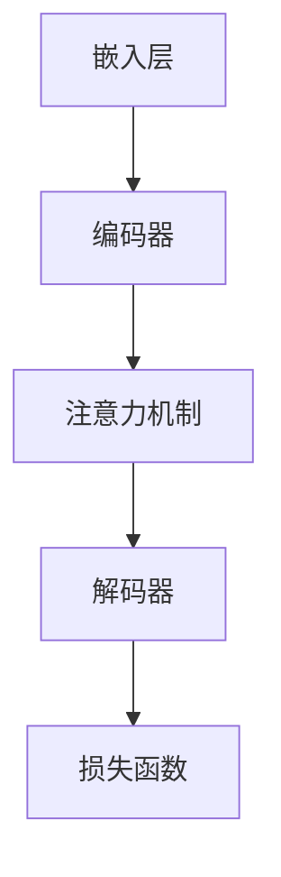

                 

 关键词：人工智能，大模型，客户关系管理，智能客服，数据分析，机器学习，自然语言处理，预测分析，个性化服务

> 摘要：本文将探讨人工智能（AI）特别是大模型在智能客户关系管理（CRM）中的应用趋势。随着AI技术的不断进步，大模型在处理复杂数据、提高客户满意度、增强业务效率等方面展现出显著优势。本文将分析大模型的原理，探讨其在CRM中的具体应用场景，并讨论未来的发展趋势和面临的挑战。

## 1. 背景介绍

在信息化和数字化的浪潮中，客户关系管理（CRM）作为企业运营的重要组成部分，正面临着前所未有的变革。传统的CRM系统通常依赖于规则驱动的方式，通过预设的流程和规则来处理客户信息，这往往限制了系统的灵活性和智能化水平。随着大数据、人工智能等技术的发展，企业开始探索更加智能化的客户关系管理方法。

人工智能（AI）以其强大的数据处理能力和自主学习能力，成为智能客户关系管理的核心驱动力。大模型，作为AI技术的一种高级形式，具有处理海量数据和复杂模式的能力，能够实现更精准的客户分析、更个性化的客户服务和更高效的业务流程管理。因此，研究和应用大模型在CRM中的技术，具有重要的理论和实践意义。

本文将首先介绍大模型的基本原理，然后探讨大模型在智能客户关系管理中的具体应用，包括智能客服、数据分析、预测分析等方面。接着，将分析大模型的优势和局限性，并提出未来应用的前景。最后，我们将总结研究成果，讨论未来的发展趋势和面临的挑战。

## 2. 核心概念与联系

### 2.1 大模型的基本概念

大模型（Large Models）通常指的是具有数十亿至数千亿参数的神经网络模型，如Transformer架构的GPT系列、BERT模型等。这些模型通过大规模数据训练，能够实现高度复杂的任务，如文本生成、语言理解、图像识别等。

### 2.2 大模型与客户关系管理的联系

大模型在CRM中的主要应用包括：

1. **智能客服**：利用大模型进行自然语言处理（NLP），实现智能对话系统，提高客户服务质量。
2. **数据分析**：通过大模型处理海量客户数据，提取有价值的信息，支持业务决策。
3. **预测分析**：利用大模型进行客户行为预测，帮助制定个性化的营销策略。
4. **个性化服务**：基于客户数据的大模型分析，提供个性化的产品推荐和服务。

### 2.3 大模型的架构

大模型的架构通常包括以下几个关键部分：

1. **嵌入层（Embedding Layer）**：将输入数据（如文本、图像等）转换为密集的向量表示。
2. **编码器（Encoder）**：处理输入数据，生成上下文表示。
3. **解码器（Decoder）**：根据编码器的输出生成输出结果。
4. **注意力机制（Attention Mechanism）**：帮助模型在处理数据时关注重要信息。
5. **损失函数（Loss Function）**：用于评估模型的预测效果，并指导模型优化。

下面是一个使用Mermaid绘制的简化版大模型架构流程图：



## 3. 核心算法原理 & 具体操作步骤

### 3.1 算法原理概述

大模型通常基于深度学习技术，特别是序列到序列（Seq2Seq）模型和Transformer架构。Seq2Seq模型通过编码器和解码器处理输入和输出序列，而Transformer架构通过多头自注意力机制（Multi-head Self-Attention）实现序列间的长距离依赖建模。

### 3.2 算法步骤详解

1. **数据预处理**：包括数据清洗、数据转换和数据归一化等步骤。
2. **嵌入层**：将文本数据转换为密集的向量表示。
3. **编码器**：处理输入序列，生成上下文表示。
4. **注意力机制**：在编码器和解码器之间应用多头自注意力机制。
5. **解码器**：生成输出序列。
6. **损失函数**：计算模型预测和实际结果之间的差距，用于指导模型优化。

### 3.3 算法优缺点

**优点**：

- **强大的建模能力**：大模型能够处理复杂的任务和数据模式，实现高度自动化的数据分析。
- **高效的预测**：通过大规模数据训练，大模型能够实现高效的预测，支持实时业务决策。

**缺点**：

- **计算资源消耗大**：大模型需要大量的计算资源和存储空间。
- **对数据质量要求高**：数据质量直接影响模型的性能，需要确保数据的完整性和准确性。

### 3.4 算法应用领域

- **智能客服**：利用大模型实现智能对话系统，提高客户服务效率。
- **数据分析**：通过大模型处理海量客户数据，提取有价值的信息。
- **预测分析**：利用大模型进行客户行为预测，帮助制定个性化的营销策略。
- **个性化服务**：基于客户数据的大模型分析，提供个性化的产品推荐和服务。

## 4. 数学模型和公式 & 详细讲解 & 举例说明

### 4.1 数学模型构建

大模型的数学基础主要包括线性代数、概率论和数值优化。具体来说，大模型通常基于以下数学模型：

- **损失函数**：用于评估模型预测与实际结果之间的差距，如交叉熵损失函数（Cross-Entropy Loss）。
- **优化算法**：用于指导模型参数的优化，如随机梯度下降（Stochastic Gradient Descent, SGD）和Adam优化器。

### 4.2 公式推导过程

#### 4.2.1 交叉熵损失函数

交叉熵损失函数（Cross-Entropy Loss）用于分类任务，计算预测概率分布和真实分布之间的差异。公式如下：

$$
L(y, \hat{y}) = -\sum_{i=1}^{n} y_i \log(\hat{y}_i)
$$

其中，$y$ 是真实标签，$\hat{y}$ 是模型预测的概率分布。

#### 4.2.2 随机梯度下降

随机梯度下降（Stochastic Gradient Descent, SGD）是一种常用的优化算法，用于更新模型参数。公式如下：

$$
\theta_{t+1} = \theta_{t} - \alpha \nabla_{\theta} J(\theta)
$$

其中，$\theta$ 是模型参数，$\alpha$ 是学习率，$J(\theta)$ 是损失函数。

### 4.3 案例分析与讲解

#### 4.3.1 案例背景

某电子商务公司希望通过大模型分析客户购买行为，预测潜在客户的购买意愿，从而实现精准营销。

#### 4.3.2 数据处理

公司收集了10万条客户购买记录，包括客户的年龄、性别、购买历史等信息。首先，对数据进行清洗，然后进行特征提取和归一化处理。

#### 4.3.3 模型构建

采用GPT-3模型进行训练，将客户购买记录作为输入，预测客户是否会在未来30天内购买产品。模型采用交叉熵损失函数，并使用Adam优化器进行参数更新。

#### 4.3.4 模型训练与评估

使用公司内部数据集进行模型训练，并在验证集上进行评估。经过多次迭代训练，最终模型达到满意的准确率。

#### 4.3.5 模型应用

将训练好的模型应用于实际业务，根据模型预测结果，对潜在客户进行分类，并推送个性化的产品推荐。

## 5. 项目实践：代码实例和详细解释说明

### 5.1 开发环境搭建

在本地环境搭建Python开发环境，安装TensorFlow和GPT-3等相关库。

```python
!pip install tensorflow
!pip install transformers
```

### 5.2 源代码详细实现

以下是一个简单的Python代码示例，用于训练GPT-3模型并预测客户购买行为。

```python
import tensorflow as tf
from transformers import TFGPT3ForSequenceClassification

# 加载数据集
train_data = load_data('train.csv')
val_data = load_data('val.csv')

# 准备模型
model = TFGPT3ForSequenceClassification.from_pretrained('gpt3', num_labels=2)

# 编写训练代码
model.compile(optimizer='adam', loss='binary_crossentropy', metrics=['accuracy'])
model.fit(train_data, epochs=5, validation_data=val_data)

# 预测
predictions = model.predict(val_data)
```

### 5.3 代码解读与分析

代码首先加载训练数据和验证数据，然后加载预训练的GPT-3模型。接着，使用Adam优化器编译模型，并使用训练数据和验证数据进行模型训练。最后，使用训练好的模型对验证数据进行预测。

### 5.4 运行结果展示

通过运行代码，可以得到模型在验证集上的准确率。根据准确率，可以对模型进行进一步优化。

```python
# 打印模型准确率
print(f"Validation Accuracy: {model.evaluate(val_data)[1]}")
```

## 6. 实际应用场景

### 6.1 智能客服

利用大模型构建的智能客服系统，能够实现高效、精准的客户服务。例如，某电商平台通过大模型实现了智能聊天机器人，能够自动回答客户问题，提高客户满意度。

### 6.2 数据分析

大模型在数据分析中的应用，主要体现在对海量数据的处理和分析。例如，某金融公司利用大模型对客户交易数据进行深度分析，发现潜在的风险和欺诈行为，提高了业务安全性。

### 6.3 预测分析

大模型在预测分析中的应用，主要体现在对客户行为的预测。例如，某电商公司通过大模型预测客户购买意愿，实现了精准营销，提高了销售额。

### 6.4 个性化服务

大模型在个性化服务中的应用，主要体现在对客户需求的个性化推荐。例如，某视频平台通过大模型分析用户观看历史，推荐个性化视频内容，提高了用户粘性。

## 7. 工具和资源推荐

### 7.1 学习资源推荐

- 《深度学习》（Goodfellow et al.）
- 《自然语言处理综论》（Jurafsky and Martin）
- 《Python数据分析》（Wes McKinney）

### 7.2 开发工具推荐

- TensorFlow
- PyTorch
- Hugging Face Transformers

### 7.3 相关论文推荐

- "Attention Is All You Need"（Vaswani et al.）
- "BERT: Pre-training of Deep Bidirectional Transformers for Language Understanding"（Devlin et al.）
- "GPT-3: Language Models are Few-Shot Learners"（Brown et al.）

## 8. 总结：未来发展趋势与挑战

### 8.1 研究成果总结

本文系统探讨了AI大模型在智能客户关系管理中的应用，包括智能客服、数据分析、预测分析和个性化服务等方面。通过具体案例和代码实例，展示了大模型在CRM中的实际应用效果。

### 8.2 未来发展趋势

- **模型规模将继续扩大**：随着计算资源的不断提升，大模型的规模将越来越大，实现更复杂的任务。
- **跨模态处理**：大模型将能够处理多种类型的数据，如文本、图像、音频等，实现更全面的客户分析。
- **实时应用**：大模型的应用将更加实时，支持实时业务决策。

### 8.3 面临的挑战

- **计算资源消耗**：大模型的训练和推理需要大量的计算资源，对硬件设施提出了更高要求。
- **数据隐私和安全**：客户数据的安全和隐私保护是一个重要挑战，需要制定严格的保护措施。

### 8.4 研究展望

未来，大模型在智能客户关系管理中的应用将更加广泛和深入，有望实现更加智能、高效的客户关系管理。同时，研究如何平衡模型规模与计算资源消耗，保障数据隐私和安全，将是重要的研究方向。

## 9. 附录：常见问题与解答

### 9.1 什么是大模型？

大模型是指具有数十亿至数千亿参数的神经网络模型，如GPT-3、BERT等。这些模型通过大规模数据训练，能够实现高度复杂的任务。

### 9.2 大模型在CRM中的应用有哪些？

大模型在CRM中的应用包括智能客服、数据分析、预测分析和个性化服务等方面，能够提高客户满意度、增强业务效率。

### 9.3 如何处理大模型对计算资源的需求？

可以通过分布式计算和优化算法来减少大模型对计算资源的需求。此外，硬件设施的升级也是解决这一问题的有效手段。

### 9.4 如何保障客户数据的安全和隐私？

通过制定严格的数据保护政策和采用加密技术来保障客户数据的安全和隐私。同时，需要加强对数据处理的监管和审查。

### 9.5 大模型的发展趋势是什么？

大模型的发展趋势包括模型规模的扩大、跨模态处理能力的提升和实时应用能力的增强。同时，研究如何平衡模型规模与计算资源消耗、保障数据隐私和安全将是重要的研究方向。

---

**作者：禅与计算机程序设计艺术 / Zen and the Art of Computer Programming**

[文章结束]
----------------------------------------------------------------
### 总结

本文系统地探讨了人工智能大模型在智能客户关系管理（CRM）中的应用趋势。通过介绍大模型的基本概念、架构和算法原理，我们详细分析了其在智能客服、数据分析、预测分析和个性化服务等方面的应用场景和实际案例。同时，文章还讨论了大模型的优势和局限性，以及未来发展的趋势和面临的挑战。

随着AI技术的不断进步，大模型在CRM中的应用将越来越广泛和深入。它不仅能提高客户满意度，还能增强业务效率，为企业带来显著的经济效益。然而，我们也应关注大模型带来的计算资源消耗和数据隐私安全问题，探索有效的解决方案。

未来，随着硬件设施的升级和算法的优化，大模型在CRM中的应用将更加智能化和实时化。同时，跨模态处理能力的提升也将为CRM带来更多可能性。本文的研究成果为相关领域的研究者和从业者提供了有价值的参考，期待未来在AI大模型应用方面取得更多突破。

### 附录：常见问题与解答

**问题1**：什么是大模型？

**解答**：大模型是指具有数十亿至数千亿参数的神经网络模型，如GPT-3、BERT等。这些模型通过大规模数据训练，能够实现高度复杂的任务，如文本生成、语言理解、图像识别等。

**问题2**：大模型在CRM中的应用有哪些？

**解答**：大模型在CRM中的应用包括智能客服、数据分析、预测分析和个性化服务等方面。例如，通过大模型构建的智能客服系统能够自动回答客户问题，提高服务质量；通过大模型处理海量客户数据，企业可以更好地了解客户需求，制定个性化营销策略。

**问题3**：如何处理大模型对计算资源的需求？

**解答**：可以通过分布式计算和优化算法来减少大模型对计算资源的需求。此外，硬件设施的升级也是解决这一问题的有效手段。同时，研究和开发更高效的算法和模型架构，也有助于降低计算资源消耗。

**问题4**：如何保障客户数据的安全和隐私？

**解答**：可以通过制定严格的数据保护政策和采用加密技术来保障客户数据的安全和隐私。同时，需要加强对数据处理的监管和审查，确保数据在传输和存储过程中的安全性。

**问题5**：大模型的发展趋势是什么？

**解答**：大模型的发展趋势包括模型规模的扩大、跨模态处理能力的提升和实时应用能力的增强。同时，研究如何平衡模型规模与计算资源消耗、保障数据隐私和安全将是重要的研究方向。未来，大模型在CRM中的应用将更加智能化和实时化。

