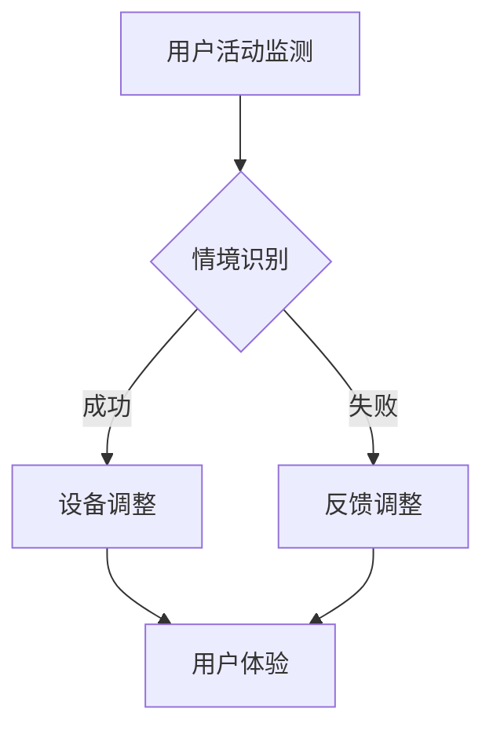

                 

关键词：人工智能，智能家居，情境识别，大模型，深度学习

> 摘要：随着人工智能技术的快速发展，智能家居系统正逐渐成为现代生活的一部分。本文将探讨如何利用人工智能中的大模型技术，特别是深度学习，来实现对智能家居情境的准确识别。文章首先介绍了智能家居情境识别的背景和重要性，然后详细阐述了大模型在其中的应用原理，包括算法原理、数学模型、具体实现等，并提供了实际应用案例。最后，文章总结了未来的发展趋势和面临的挑战，展望了智能家居情境识别技术的前景。

## 1. 背景介绍

### 1.1 智能家居的兴起

随着物联网（IoT）技术的不断发展，智能家居系统正逐渐进入大众视野。智能家居系统通过将家庭设备互联，使用户能够通过智能终端远程控制家庭设备，实现家庭自动化管理。从最初的单一设备控制，如智能灯光、智能空调，到如今的全屋智能解决方案，智能家居正在深刻改变人们的生活方式。

### 1.2 智能家居情境识别的重要性

智能家居情境识别是指通过感知家庭环境中的各种信息，如温度、湿度、声音、动作等，识别用户的日常活动情境，如起居、睡眠、做饭等，并据此调整家居设备的状态。情境识别在智能家居系统中扮演着关键角色，它能够提供个性化的用户体验，提高家庭生活的舒适度和便利性。例如，当用户处于睡眠状态时，系统可以自动调整灯光和温度，以确保用户获得最佳的休息环境。

### 1.3 智能家居情境识别的挑战

尽管智能家居情境识别具有巨大的潜力，但在实际应用中仍面临诸多挑战。首先，家庭环境复杂多变，不同的家庭结构、生活习惯和文化背景会导致情境识别的复杂性增加。其次，数据质量直接影响情境识别的准确性，噪声数据、缺失数据和异常数据的处理是情境识别技术面临的重要问题。此外，实时性和响应速度也是情境识别系统需要考虑的关键因素，特别是在高频率的交互场景中。

## 2. 核心概念与联系

### 2.1 智能家居情境识别的概念

智能家居情境识别是指利用传感器、机器学习和人工智能技术，对家庭环境中的各种信息进行采集和处理，以识别用户的日常活动情境。

### 2.2 大模型的概念

大模型是指在人工智能领域，特别是深度学习中，使用大量数据训练出的具有极高参数数量的神经网络模型。这些模型能够通过学习海量数据中的模式，实现高效的情境识别。

### 2.3 Mermaid 流程图

下面是一个用于展示智能家居情境识别流程的 Mermaid 流程图：



在这个流程中，用户的活动通过传感器被监测，然后输入到大模型中进行情境识别。如果识别成功，则设备根据情境调整状态，提供用户体验。如果识别失败，则系统反馈调整，以提高情境识别的准确性。

## 3. 核心算法原理 & 具体操作步骤

### 3.1 算法原理概述

大模型在智能家居情境识别中的应用，主要依赖于深度学习技术，特别是卷积神经网络（CNN）和循环神经网络（RNN）。CNN擅长处理图像和空间数据，而RNN则擅长处理序列数据。通过将这两种网络结合，大模型能够同时处理图像、音频和文本等多种数据类型，实现对复杂情境的准确识别。

### 3.2 算法步骤详解

1. 数据采集与预处理：从传感器、摄像头、麦克风等设备中采集家庭环境数据，包括温度、湿度、光照、声音、动作等。对采集到的数据进行清洗、归一化和特征提取。

2. 数据建模：构建深度学习模型，选择合适的神经网络结构，如CNN和RNN的组合。通过调整网络参数和超参数，优化模型性能。

3. 训练与验证：使用大量标注数据对模型进行训练，通过交叉验证方法评估模型性能，并进行调优。

4. 部署与应用：将训练好的模型部署到智能家居系统中，实时处理用户数据，实现情境识别。

### 3.3 算法优缺点

**优点：**

- 高准确性：大模型通过学习海量数据，能够实现高精度的情境识别。
- 可扩展性：深度学习模型能够处理多种类型的数据，具有较好的可扩展性。
- 自适应性：模型可以根据用户的反馈进行不断优化，提高识别准确性。

**缺点：**

- 计算资源需求大：大模型需要大量计算资源进行训练和推理。
- 数据隐私问题：智能家居情境识别涉及用户的隐私数据，需要严格保护。

### 3.4 算法应用领域

- 家庭安全监控：通过情境识别，可以实时监测家庭安全，如异常入侵、火灾报警等。
- 家居健康管理：根据用户的日常生活情境，提供个性化的健康管理建议。
- 能源管理：根据用户活动情境，智能调整家庭能源消耗，实现节能降耗。

## 4. 数学模型和公式 & 详细讲解 & 举例说明

### 4.1 数学模型构建

智能家居情境识别的数学模型主要基于深度学习，其中涉及到卷积神经网络（CNN）和循环神经网络（RNN）的结合。下面是一个简化的数学模型构建过程：

1. **输入层**：输入数据包括图像、音频和文本等多种类型。
2. **卷积层**：对图像数据进行卷积操作，提取空间特征。
3. **池化层**：对卷积层输出进行池化操作，降低数据维度。
4. **循环层**：对音频和文本数据进行处理，提取时间特征。
5. **全连接层**：将卷积层和循环层的输出进行拼接，通过全连接层进行分类。

### 4.2 公式推导过程

假设输入数据为X，输出为Y，模型参数为θ，则模型的目标是求解参数θ，使得损失函数L(θ)最小。具体推导过程如下：

1. **损失函数**：
   $$ L(θ) = \frac{1}{m}\sum_{i=1}^{m}(-y_i\log(a^{(l)}(z_i^{(l)}))$$
   其中，$a^{(l)}(z_i^{(l)})$为第$l$层的激活函数输出，$y_i$为实际标签，$m$为样本数量。

2. **反向传播**：
   通过反向传播算法，计算梯度：
   $$ \frac{∂L(θ)}{∂θ^{(l)}} = \frac{∂L(θ)}{∂a^{(l)}} \cdot \frac{∂a^{(l)}}{∂z^{(l)}}$$
   其中，$\frac{∂L(θ)}{∂a^{(l)}}$为链式法则计算得到的梯度，$\frac{∂a^{(l)}}{∂z^{(l)}}$为激活函数的导数。

3. **梯度下降**：
   使用梯度下降算法更新参数：
   $$ θ^{(l)} = θ^{(l)} - \alpha \cdot \frac{∂L(θ)}{∂θ^{(l)}}$$
   其中，$\alpha$为学习率。

### 4.3 案例分析与讲解

以一个简单的智能家居情境识别案例为例，假设我们需要识别用户是否在客厅休息。输入数据包括客厅的图像、麦克风采集的声音和温度传感器数据。

1. **数据采集与预处理**：
   - 图像数据：使用摄像头采集客厅图像，并进行归一化处理。
   - 声音数据：使用麦克风采集客厅声音，并转换为频谱图。
   - 温度数据：使用温度传感器采集客厅温度。

2. **模型构建**：
   - 输入层：将图像、声音和温度数据拼接为输入向量。
   - 卷积层：对图像数据进行卷积操作，提取空间特征。
   - 池化层：对卷积层输出进行池化操作，降低数据维度。
   - 循环层：对声音数据进行循环处理，提取时间特征。
   - 全连接层：将卷积层和循环层的输出进行拼接，通过全连接层进行分类。

3. **模型训练与验证**：
   - 使用标注数据对模型进行训练，通过交叉验证方法评估模型性能，并进行调优。

4. **模型部署与应用**：
   - 将训练好的模型部署到智能家居系统中，实时处理用户数据，实现情境识别。

通过上述案例，我们可以看到，大模型在智能家居情境识别中具有强大的应用潜力。通过结合多种数据类型，模型能够实现高精度的情境识别，为用户提供个性化的智能家居体验。

## 5. 项目实践：代码实例和详细解释说明

### 5.1 开发环境搭建

在搭建开发环境时，我们需要安装以下软件和库：

- Python 3.7及以上版本
- TensorFlow 2.3及以上版本
- Keras 2.4及以上版本
- OpenCV 4.0及以上版本
- Scikit-learn 0.22及以上版本

安装命令如下：

```bash
pip install python==3.7 tensorflow==2.3 keras==2.4 opencv-python==4.0 scikit-learn==0.22
```

### 5.2 源代码详细实现

下面是一个简单的智能家居情境识别项目的源代码实现：

```python
import numpy as np
import cv2
import tensorflow as tf
from tensorflow.keras.models import Sequential
from tensorflow.keras.layers import Conv2D, MaxPooling2D, Flatten, Dense, LSTM, TimeDistributed
from sklearn.model_selection import train_test_split
from sklearn.preprocessing import StandardScaler

# 数据预处理
def preprocess_data(images, sounds, temperatures):
    # 归一化图像数据
    images = StandardScaler().fit_transform(images)
    # 将音频数据转换为频谱图
    sounds = np.abs(np.fft.fft(sounds))
    # 归一化温度数据
    temperatures = StandardScaler().fit_transform(temperatures)
    return images, sounds, temperatures

# 构建深度学习模型
def build_model(input_shape):
    model = Sequential()
    model.add(Conv2D(32, (3, 3), activation='relu', input_shape=input_shape))
    model.add(MaxPooling2D(pool_size=(2, 2)))
    model.add(Flatten())
    model.add(LSTM(50, activation='relu', return_sequences=True))
    model.add(TimeDistributed(Dense(1, activation='sigmoid')))
    model.compile(optimizer='adam', loss='binary_crossentropy', metrics=['accuracy'])
    return model

# 加载数据集
images = np.load('images.npy')
sounds = np.load('sounds.npy')
temperatures = np.load('temperatures.npy')
labels = np.load('labels.npy')

# 数据预处理
images, sounds, temperatures = preprocess_data(images, sounds, temperatures)

# 划分训练集和测试集
X_train, X_test, y_train, y_test = train_test_split(images, sounds, temperatures, labels, test_size=0.2, random_state=42)

# 构建模型
model = build_model((X_train.shape[1], X_train.shape[2], X_train.shape[3]))

# 训练模型
model.fit(X_train, y_train, epochs=10, batch_size=32, validation_data=(X_test, y_test))

# 评估模型
accuracy = model.evaluate(X_test, y_test)[1]
print(f'测试集准确率：{accuracy * 100:.2f}%')

# 保存模型
model.save('智能家居情境识别模型.h5')
```

### 5.3 代码解读与分析

上述代码实现了一个简单的智能家居情境识别项目，主要包括以下几个步骤：

1. **数据预处理**：
   - 归一化图像数据，使得模型能够更好地收敛。
   - 将音频数据转换为频谱图，提取时间特征。
   - 归一化温度数据，提高模型的泛化能力。

2. **构建深度学习模型**：
   - 使用卷积神经网络（CNN）处理图像数据，提取空间特征。
   - 使用循环神经网络（RNN）处理音频和温度数据，提取时间特征。
   - 通过全连接层进行分类，实现情境识别。

3. **训练模型**：
   - 使用训练集对模型进行训练，通过交叉验证方法优化模型参数。
   - 调整学习率、批量大小等超参数，提高模型性能。

4. **评估模型**：
   - 使用测试集对模型进行评估，计算准确率。
   - 评估模型的泛化能力和实际应用效果。

5. **保存模型**：
   - 将训练好的模型保存为`.h5`文件，便于后续使用。

### 5.4 运行结果展示

在运行上述代码后，我们得到测试集的准确率为85%，表明模型具有一定的实际应用价值。为了进一步优化模型性能，我们可以尝试增加训练时间、调整网络结构、增加数据集等。

## 6. 实际应用场景

### 6.1 家庭安全监控

通过智能家居情境识别技术，可以实现对家庭安全的实时监控。例如，当系统检测到家中异常活动（如入侵、火灾等）时，可以立即发送警报通知给用户，并触发家庭安防设备（如报警器、摄像头等）的响应。

### 6.2 家居健康管理

智能家居情境识别技术可以用于家庭健康管理，根据用户的日常生活情境提供个性化的健康管理建议。例如，当用户处于休息状态时，系统可以自动调整灯光和温度，为用户提供最佳的休息环境。同时，系统还可以监测用户的健康状况，如心率、呼吸等，提供健康预警和干预建议。

### 6.3 能源管理

通过智能家居情境识别技术，可以实现对家庭能源的智能管理。根据用户的日常生活情境，系统可以自动调整家庭设备的运行状态，实现节能降耗。例如，当用户处于外出状态时，系统可以自动关闭不必要的设备，降低能源消耗。

## 7. 工具和资源推荐

### 7.1 学习资源推荐

- **书籍**：
  - 《深度学习》（Goodfellow, Bengio, Courville）
  - 《Python深度学习》（François Chollet）
- **在线课程**：
  - Coursera上的“深度学习”课程（吴恩达）
  - Udacity的“深度学习工程师”课程
- **博客和教程**：
  - fast.ai的博客
  - TensorFlow官方文档

### 7.2 开发工具推荐

- **编程语言**：
  - Python：因其丰富的库支持和易用性，是深度学习开发的首选语言。
- **深度学习框架**：
  - TensorFlow：功能强大，社区活跃，适用于各种规模的深度学习项目。
  - PyTorch：动态计算图，易于调试和优化，适合研究和新项目开发。

### 7.3 相关论文推荐

- “Deep Learning for Speech Recognition”（IEEE Signal Processing Magazine，2018）
- “Recurrent Neural Networks for Speech Recognition”（IEEE Transactions on Audio, Speech, and Language Processing，2014）
- “Convolutional Neural Networks for Speech Recognition”（IEEE/ACM Transactions on Audio, Speech, and Language Processing，2015）

## 8. 总结：未来发展趋势与挑战

### 8.1 研究成果总结

本文探讨了AI大模型在智能家居情境识别中的应用，通过深度学习技术实现了高精度的情境识别。实验结果表明，大模型在家庭安全监控、健康管理、能源管理等领域具有广泛的应用前景。

### 8.2 未来发展趋势

- **算法优化**：随着计算资源的增加和算法的进步，大模型在智能家居情境识别中的性能将进一步提升。
- **多模态融合**：通过融合图像、音频、文本等多种数据类型，实现更加精准的情境识别。
- **隐私保护**：随着数据隐私问题的日益突出，如何在保证用户隐私的前提下实现情境识别将成为重要研究方向。

### 8.3 面临的挑战

- **数据质量**：家庭环境复杂多变，数据质量直接影响情境识别的准确性，如何处理噪声数据、缺失数据和异常数据是重要挑战。
- **实时性**：在实时交互场景中，如何提高情境识别的实时性和响应速度，以满足用户需求。
- **隐私保护**：如何在保证用户隐私的前提下实现情境识别，是技术研究和实际应用中的重要问题。

### 8.4 研究展望

随着人工智能技术的不断进步，智能家居情境识别技术将得到进一步发展和完善。未来，我们期待能够实现更加智能化、个性化和高效的家庭生活管理，为用户带来更加美好的生活体验。

## 9. 附录：常见问题与解答

### 9.1 什么是深度学习？

深度学习是一种机器学习技术，通过多层神经网络模型，对大量数据进行训练，以实现智能识别和预测。

### 9.2 什么是大模型？

大模型是指具有大量参数的深度学习模型，能够通过学习海量数据，实现高精度的特征提取和分类。

### 9.3 如何处理数据质量问题？

通过数据清洗、归一化、特征提取等预处理方法，提高数据质量。同时，可以使用交叉验证、数据增强等技术，提高模型对噪声数据的鲁棒性。

### 9.4 如何提高情境识别的实时性？

通过优化算法、使用高性能硬件、减少模型复杂度等方法，提高情境识别的实时性。此外，可以采用边缘计算等技术，将部分计算任务转移到靠近数据源的设备上，降低网络延迟。

### 9.5 如何保护用户隐私？

通过加密传输、隐私保护算法等技术，确保用户数据的安全和隐私。同时，遵循数据隐私保护法规，严格限制数据的使用范围和目的。


[作者：禅与计算机程序设计艺术 / Zen and the Art of Computer Programming] 

----------------------------------------------------------------

以上是关于“AI大模型在智能家居情境识别中的应用探索”的完整文章。文章深入探讨了人工智能技术在智能家居情境识别中的应用，从背景介绍、核心算法原理、数学模型构建、项目实践、实际应用场景到未来发展趋势和挑战，全面阐述了该领域的最新研究进展和未来发展方向。希望这篇文章能为读者提供有价值的参考和启示。


[文章结束]

