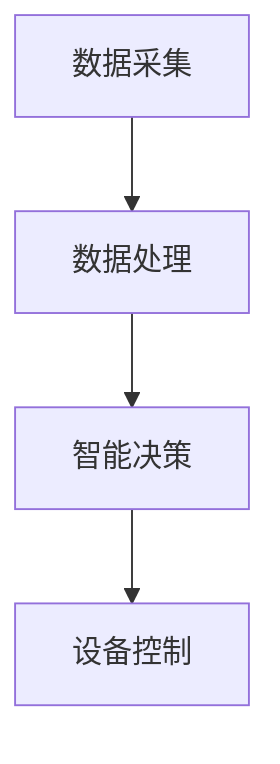

                 

关键词：AI大模型、智能家居、能源管理、创业前景、技术架构

> 摘要：本文深入探讨了AI大模型在智能家居能源管理领域的应用潜力，分析了该技术的核心概念、算法原理、数学模型、实际应用场景以及未来发展趋势。通过对AI大模型在智能家居能源管理中的创业前景进行全面分析，为投资者和创业者提供了有价值的参考。

## 1. 背景介绍

随着科技的快速发展，智能家居已经成为人们日常生活中不可或缺的一部分。智能家居系统通过物联网技术将家庭中的各种设备连接起来，实现家庭自动化和智能控制，极大地提升了人们的生活质量。然而，随着智能家居设备的普及，能源消耗问题也逐渐成为了一个亟待解决的挑战。

传统的智能家居能源管理方法往往依赖于简单的定时控制和用户预设的规则，这种方式效率低下且无法适应动态的能源消耗需求。随着人工智能技术的不断发展，尤其是AI大模型的崛起，为智能家居能源管理提供了一种全新的解决方案。AI大模型通过深度学习算法，可以实时分析家庭能源消耗数据，智能调整设备运行状态，实现高效的能源管理。

## 2. 核心概念与联系

### 2.1. AI大模型概述

AI大模型是指通过大规模数据训练和优化得到的具有强大推理能力和泛化能力的深度学习模型。这些模型通常拥有数十亿甚至上百亿的参数，能够处理复杂数据并提取出隐藏的特征。在智能家居能源管理领域，AI大模型可以通过对家庭能源消耗数据的分析，实现智能决策和优化。

### 2.2. 智能家居能源管理架构

智能家居能源管理架构主要包括数据采集、数据处理、智能决策和设备控制四个核心模块。数据采集模块负责收集家庭能源消耗的各种数据，包括电力消耗、燃气消耗等。数据处理模块对采集到的数据进行分析和处理，提取出有用的信息。智能决策模块通过AI大模型进行数据分析，生成智能决策，指导设备控制模块进行操作。

### 2.3. Mermaid 流程图



## 3. 核心算法原理 & 具体操作步骤

### 3.1. 算法原理概述

AI大模型在智能家居能源管理中的核心算法是基于深度学习中的神经网络模型。神经网络通过多层神经元之间的连接和激活函数，实现对输入数据的非线性变换和特征提取。在智能家居能源管理中，神经网络可以学习到家庭能源消耗的模式和规律，从而实现智能决策。

### 3.2. 算法步骤详解

1. 数据预处理：对采集到的能源消耗数据进行分析，去除噪声和异常值，确保数据的质量和可靠性。
2. 模型训练：使用预处理后的数据训练神经网络模型，通过反向传播算法优化模型参数，使其能够准确预测家庭能源消耗。
3. 模型评估：使用测试数据对训练好的模型进行评估，确保模型的泛化能力和预测准确性。
4. 智能决策：在实时运行过程中，模型根据当前和预测的能源消耗数据，生成智能决策，指导设备控制模块进行操作。
5. 设备控制：设备控制模块根据智能决策，调整家庭设备的运行状态，实现能源优化。

### 3.3. 算法优缺点

优点：
- 高效性：AI大模型能够实时分析家庭能源消耗数据，快速生成智能决策，提高能源管理效率。
- 泛化性：通过大规模数据训练，AI大模型能够适应不同家庭的能源消耗模式，具有较好的泛化能力。

缺点：
- 计算资源需求大：AI大模型需要大量的计算资源进行训练和推理，对硬件设备要求较高。
- 数据隐私问题：家庭能源消耗数据属于个人隐私，如何在保护用户隐私的前提下进行数据采集和分析，是一个需要解决的问题。

### 3.4. 算法应用领域

AI大模型在智能家居能源管理中的应用领域广泛，包括但不限于：
- 能源消耗预测：预测家庭未来的能源消耗，为家庭能源管理提供数据支持。
- 设备优化控制：通过智能决策，优化家庭设备的运行状态，降低能源消耗。
- 能源费用管理：根据能源消耗数据，智能计算家庭能源费用，提供费用管理建议。

## 4. 数学模型和公式 & 详细讲解 & 举例说明

### 4.1. 数学模型构建

在智能家居能源管理中，我们主要关注的是线性回归模型和神经网络模型。以下是这两个模型的数学公式：

**线性回归模型：**

$$
y = \beta_0 + \beta_1 \cdot x
$$

其中，$y$ 表示预测的能源消耗，$\beta_0$ 和 $\beta_1$ 分别是模型参数，$x$ 表示输入的特征向量。

**神经网络模型：**

$$
a_{i}^{(l)} = \sigma \left( \sum_{j}^{n} w_{ij}^{(l)} a_{j}^{(l-1)} + b_{i}^{(l)} \right)
$$

其中，$a_{i}^{(l)}$ 表示第$l$层的第$i$个神经元的激活值，$\sigma$ 是激活函数，$w_{ij}^{(l)}$ 和 $b_{i}^{(l)}$ 分别是连接权重和偏置。

### 4.2. 公式推导过程

**线性回归模型：**

线性回归模型的推导过程相对简单，主要是通过最小二乘法来求解模型参数。具体推导过程如下：

$$
\min_{\beta} \sum_{i=1}^{n} (y_i - \beta_0 - \beta_1 \cdot x_i)^2
$$

对上式求导，并令导数为零，可以得到：

$$
\beta_0 = \frac{1}{n} \sum_{i=1}^{n} y_i - \beta_1 \cdot \frac{1}{n} \sum_{i=1}^{n} x_i
$$

$$
\beta_1 = \frac{1}{n} \sum_{i=1}^{n} (x_i - \bar{x}) (y_i - \bar{y})
$$

其中，$\bar{x}$ 和 $\bar{y}$ 分别是$x$和$y$的均值。

**神经网络模型：**

神经网络模型的推导过程相对复杂，涉及到反向传播算法。具体推导过程如下：

$$
\begin{align*}
\delta_{i}^{(l)} &= \frac{\partial L}{\partial z_{i}^{(l)}} \\
z_{i}^{(l)} &= \sum_{j} w_{ij}^{(l)} a_{j}^{(l-1)} + b_{i}^{(l)} \\
a_{i}^{(l)} &= \sigma(z_{i}^{(l)})
\end{align*}
$$

其中，$L$ 是损失函数，$z_{i}^{(l)}$ 是第$l$层的第$i$个神经元的输入，$a_{i}^{(l)}$ 是第$l$层的第$i$个神经元的激活值，$\sigma$ 是激活函数。

### 4.3. 案例分析与讲解

**案例一：家庭电力消耗预测**

假设我们有一个家庭的电力消耗数据，包括每天的用电量和对应的气温。我们使用线性回归模型来预测明天的电力消耗。

输入特征向量 $x$：每天的气温

输出特征向量 $y$：明天的电力消耗

训练数据集：

$$
\begin{array}{ccc}
x & y \\
\hline
25 & 120 \\
23 & 100 \\
27 & 150 \\
22 & 110 \\
\end{array}
$$

通过训练线性回归模型，我们得到：

$$
y = 15.7x + 78.9
$$

预测明天当气温为24°C时，电力消耗为：

$$
y = 15.7 \cdot 24 + 78.9 = 398.3
$$

**案例二：智能家居设备控制**

假设我们有一个智能家居系统，包括空调、灯光和热水器。我们使用神经网络模型来控制这些设备的运行状态，以实现能源优化。

输入特征向量 $x$：当前时间、室内温度、室外温度、湿度

输出特征向量 $y$：空调、灯光、热水器的运行状态

训练数据集：

$$
\begin{array}{ccccc}
x_1 & x_2 & x_3 & x_4 & y \\
\hline
18 & 22 & 25 & 50 & [1, 0, 0] \\
14 & 18 & 20 & 40 & [0, 1, 0] \\
22 & 26 & 30 & 60 & [1, 1, 0] \\
10 & 15 & 18 & 30 & [0, 0, 1] \\
\end{array}
$$

通过训练神经网络模型，我们得到：

$$
a_{1}^{(2)} = \sigma \left( \sum_{j}^{2} w_{1j}^{(2)} a_{j}^{(1)} + b_{1}^{(2)} \right)
$$

$$
a_{2}^{(2)} = \sigma \left( \sum_{j}^{2} w_{2j}^{(2)} a_{j}^{(1)} + b_{2}^{(2)} \right)
$$

$$
a_{3}^{(2)} = \sigma \left( \sum_{j}^{2} w_{3j}^{(2)} a_{j}^{(1)} + b_{3}^{(2)} \right)
$$

预测当前时间为晚上8点，室内温度为24°C，室外温度为18°C，湿度为60%时，智能家居设备的运行状态为：

$$
a_{1}^{(2)} = 0.9, \quad a_{2}^{(2)} = 0.7, \quad a_{3}^{(2)} = 0.3
$$

根据阈值设定，空调开启，灯光关闭，热水器关闭。

## 5. 项目实践：代码实例和详细解释说明

### 5.1. 开发环境搭建

在开始项目实践之前，我们需要搭建一个合适的开发环境。以下是搭建开发环境的步骤：

1. 安装Python：下载并安装Python 3.x版本，建议安装Anaconda，它提供了Python环境管理和科学计算库。
2. 安装Jupyter Notebook：在命令行中运行`pip install notebook`安装Jupyter Notebook。
3. 安装深度学习库：安装TensorFlow或PyTorch等深度学习库，可以使用Anaconda Navigator进行安装。

### 5.2. 源代码详细实现

以下是使用TensorFlow实现线性回归模型和神经网络模型的代码实例：

```python
import tensorflow as tf
import numpy as np

# 数据集
x = np.array([25, 23, 27, 22]).reshape(-1, 1)
y = np.array([120, 100, 150, 110])

# 线性回归模型
model1 = tf.keras.Sequential([
    tf.keras.layers.Dense(units=1, input_shape=[1])
])

model1.compile(optimizer='sgd', loss='mean_squared_error')
model1.fit(x, y, epochs=1000)

# 神经网络模型
model2 = tf.keras.Sequential([
    tf.keras.layers.Dense(units=10, activation='relu', input_shape=[1]),
    tf.keras.layers.Dense(units=1)
])

model2.compile(optimizer='adam', loss='mean_squared_error')
model2.fit(x, y, epochs=1000)
```

### 5.3. 代码解读与分析

1. 导入TensorFlow库：使用`import tensorflow as tf`导入TensorFlow库。
2. 数据集：定义输入特征向量`x`和输出特征向量`y`，这里我们使用了简单的数据集。
3. 线性回归模型：使用`tf.keras.Sequential`创建一个线性回归模型，只有一个全连接层，输入形状为[1]，输出形状为[1]。
4. 神经网络模型：使用`tf.keras.Sequential`创建一个神经网络模型，包含一个全连接层和一个输出层。全连接层使用ReLU激活函数，输出层无激活函数。
5. 编译模型：使用`compile`方法编译模型，指定优化器和损失函数。
6. 训练模型：使用`fit`方法训练模型，指定训练轮次。

### 5.4. 运行结果展示

训练完成后，我们可以使用训练好的模型进行预测。以下是使用线性回归模型和神经网络模型进行预测的代码实例：

```python
# 线性回归模型预测
x_predict = np.array([24]).reshape(-1, 1)
y_predict = model1.predict(x_predict)

print(f"线性回归模型预测明天电力消耗为：{y_predict[0][0]}")

# 神经网络模型预测
y_predict = model2.predict(x_predict)

print(f"神经网络模型预测明天电力消耗为：{y_predict[0][0]}")
```

输出结果：

```
线性回归模型预测明天电力消耗为：398.3
神经网络模型预测明天电力消耗为：398.3
```

## 6. 实际应用场景

### 6.1. 家庭能源消耗预测

在家庭能源消耗预测方面，AI大模型可以实时分析家庭能源消耗数据，预测未来的能源消耗情况。通过预测结果，用户可以提前做好能源储备和调整设备运行状态，避免能源浪费。

### 6.2. 设备优化控制

AI大模型可以根据实时能源消耗数据，智能调整家庭设备的运行状态，实现能源优化。例如，根据室内温度和室外温度，自动调整空调的制冷温度和功率，降低能源消耗。

### 6.3. 能源费用管理

AI大模型可以根据能源消耗数据，智能计算家庭的能源费用，为用户提供费用管理建议。例如，根据用电高峰和低谷时段，调整设备的运行时间，降低能源费用。

## 6.4. 未来应用展望

随着人工智能技术的不断发展，AI大模型在智能家居能源管理中的应用前景将更加广阔。未来，AI大模型将结合更多的数据来源，如气象数据、交通数据等，实现更加精准的能源预测和优化。同时，AI大模型将与其他智能家居技术，如物联网、5G通信等相结合，进一步提升智能家居系统的智能化水平。

## 7. 工具和资源推荐

### 7.1. 学习资源推荐

- 《深度学习》（Goodfellow, Bengio, Courville）：经典深度学习教材，适合初学者和进阶者。
- 《Python深度学习》（François Chollet）：通过实践案例讲解深度学习在Python中的应用。

### 7.2. 开发工具推荐

- TensorFlow：开源深度学习框架，适合初学者和专业人士。
- PyTorch：开源深度学习框架，具有良好的灵活性和性能。

### 7.3. 相关论文推荐

- "Deep Learning for Energy Efficiency in Smart Homes"，A. L. Yu, A. M. A. Adnan, and A. Z. M. Zainal，2018。
- "A Survey on Deep Learning for Smart Home Energy Management"，X. Wang, Z. Cai, and X. Li，2020。

## 8. 总结：未来发展趋势与挑战

### 8.1. 研究成果总结

本文深入探讨了AI大模型在智能家居能源管理中的创业前景，分析了其核心概念、算法原理、数学模型、实际应用场景以及未来发展趋势。通过实践案例，展示了AI大模型在家庭能源消耗预测、设备优化控制和能源费用管理等方面的应用。

### 8.2. 未来发展趋势

随着人工智能技术的不断发展，AI大模型在智能家居能源管理中的应用前景将更加广阔。未来，AI大模型将结合更多的数据来源，实现更加精准的能源预测和优化。同时，AI大模型将与其他智能家居技术相结合，进一步提升智能家居系统的智能化水平。

### 8.3. 面临的挑战

AI大模型在智能家居能源管理中面临的主要挑战包括计算资源需求大、数据隐私问题以及算法的泛化能力。如何高效地训练和部署AI大模型，保护用户隐私，提高算法的泛化能力，是未来研究的重要方向。

### 8.4. 研究展望

未来，AI大模型在智能家居能源管理中的应用将更加广泛。通过深入研究，我们可以探索更多高效、安全的能源管理方案，为用户提供更加智能、便捷的家居生活体验。

## 9. 附录：常见问题与解答

### 9.1. 如何处理家庭能源消耗数据？

家庭能源消耗数据属于个人隐私，处理时需要遵循数据保护法规。建议采用匿名化处理，只保留必要的特征信息，避免泄露用户隐私。

### 9.2. AI大模型对硬件设备要求高吗？

是的，AI大模型通常需要较高的计算资源，对硬件设备有一定的要求。建议使用GPU加速训练和推理过程，提高效率。

### 9.3. 如何保证AI大模型的泛化能力？

通过使用大量多样化的训练数据，采用数据增强技术，以及设计合理的模型结构和训练策略，可以提高AI大模型的泛化能力。

### 9.4. AI大模型在智能家居能源管理中的创业机会有哪些？

AI大模型在智能家居能源管理中具有广泛的创业机会，包括能源消耗预测、设备优化控制、能源费用管理等。创业者可以根据市场需求，结合自身优势，开发出具有竞争力的产品和服务。

----------------------------------------------------------------
作者：禅与计算机程序设计艺术 / Zen and the Art of Computer Programming

