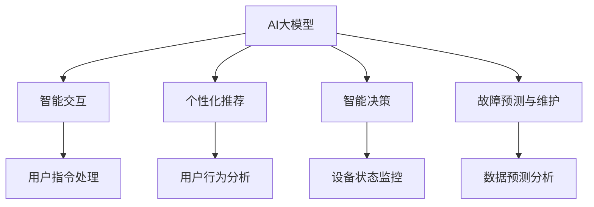

                 

关键词：人工智能、大模型、智能家电、产品创新

> 摘要：随着人工智能技术的不断进步，AI大模型在智能家电领域展现出巨大的潜力。本文将探讨AI大模型在智能家电中的应用，以及如何通过产品创新提升用户体验。

## 1. 背景介绍

智能家电作为物联网（IoT）的重要组成部分，已经深入到了我们日常生活的方方面面。从简单的智能插座、智能灯泡，到复杂的智能空调、智能冰箱，智能家电正逐步改变着人们的生活方式。然而，当前的智能家电产品在智能化程度、用户体验、交互方式等方面仍有较大的提升空间。

AI大模型的崛起，为智能家电的产品创新带来了新的机遇。大模型，如GPT-3、BERT等，拥有强大的文本理解和生成能力，能够处理复杂、多样化的任务。在智能家电领域，AI大模型的应用可以显著提升设备的智能化水平，改善用户交互体验，甚至实现前所未有的功能。

本文旨在探讨AI大模型在智能家电产品创新中的应用，分析其原理、实现方法、优缺点，并探讨未来的发展趋势。

## 2. 核心概念与联系

### 2.1 AI大模型简介

AI大模型，即人工智能的大型模型，通常指的是参数量达到数百万甚至数十亿的神经网络模型。这些模型通过大规模数据训练，能够学习到复杂的数据分布和规律，具备强大的表征能力和推理能力。

### 2.2 智能家电的定义与分类

智能家电是指具备智能化功能，能够通过互联网与其他设备或系统互联互通的家用电器。根据智能化的程度，智能家电可以分为以下几类：

- 基础智能化：具备基本联网功能，如智能插座、智能灯泡等。
- 中级智能化：具备智能交互和部分自主学习功能，如智能空调、智能冰箱等。
- 高级智能化：具备复杂智能决策和自主学习功能，如智能管家、智能家居等。

### 2.3 AI大模型与智能家电的联系

AI大模型在智能家电中的应用，主要体现在以下几个方面：

- **智能交互**：通过自然语言处理（NLP）技术，实现用户与家电设备的自然语言交互。
- **个性化推荐**：根据用户的历史行为和偏好，为用户提供个性化的服务。
- **智能决策**：基于用户数据和设备状态，进行智能化的设备控制和管理。
- **故障预测与维护**：通过数据分析，预测设备的故障并提前进行维护。

## 2.4 Mermaid 流程图



## 3. 核心算法原理 & 具体操作步骤

### 3.1 算法原理概述

AI大模型的核心算法是深度学习，特别是基于神经网络的模型。深度学习通过多层神经元的堆叠，实现对数据的层次化抽象和表征。在智能家电中，大模型的应用主要包括以下几方面：

- **预训练**：使用大规模语料数据进行预训练，获取通用语言理解和生成能力。
- **微调**：在特定任务上，对预训练模型进行微调，使其适应具体的智能家电应用场景。
- **推理**：在交互过程中，根据用户输入和设备状态，实时生成响应和决策。

### 3.2 算法步骤详解

1. **数据收集与预处理**：
   - 收集用户行为数据、设备状态数据等。
   - 进行数据清洗、去重、归一化等预处理操作。

2. **模型预训练**：
   - 选择合适的深度学习框架（如TensorFlow、PyTorch等）。
   - 使用大规模语料数据进行预训练，如GPT-3使用的40GB文本数据。

3. **模型微调**：
   - 根据智能家电的应用场景，对预训练模型进行微调。
   - 使用特定的任务数据集进行训练，如智能家居交互数据集。

4. **模型推理与交互**：
   - 在设备运行过程中，接收用户指令和设备状态。
   - 使用微调后的模型进行实时推理，生成响应和决策。

### 3.3 算法优缺点

**优点**：
- **强大的表征能力**：大模型能够对复杂的数据进行有效的表征和抽象。
- **自适应能力**：通过微调，模型能够适应不同的应用场景。
- **智能化程度高**：能够实现智能化的交互、推荐、决策等功能。

**缺点**：
- **计算资源需求大**：训练和推理过程需要大量的计算资源。
- **数据依赖性强**：模型的性能很大程度上取决于训练数据的质量和数量。
- **安全隐私问题**：用户数据和设备数据的安全隐私保护需要引起重视。

### 3.4 算法应用领域

AI大模型在智能家电中的应用领域广泛，包括但不限于：

- **智能家居交互**：通过语音、文本等方式实现用户与设备的自然交互。
- **个性化推荐**：根据用户偏好，为用户推荐合适的家电产品和服务。
- **智能故障预测**：通过对设备状态的实时监控，预测可能的故障并进行预警。
- **智能家居生态**：构建智能化的家居生态系统，实现设备间的协同工作。

## 4. 数学模型和公式 & 详细讲解 & 举例说明

### 4.1 数学模型构建

在智能家电中，AI大模型通常采用深度学习模型，如Transformer、GPT等。这些模型的基本构建单元是多层神经网络，通过反向传播算法进行参数优化。

### 4.2 公式推导过程

以Transformer模型为例，其核心组件是自注意力机制（Self-Attention）。自注意力机制的公式如下：

$$
\text{Attention}(Q, K, V) = \frac{1}{\sqrt{d_k}} \text{softmax}\left(\frac{QK^T}{d_k}\right) V
$$

其中，$Q$、$K$、$V$ 分别为查询向量、键向量和值向量，$d_k$ 为键向量的维度。

### 4.3 案例分析与讲解

假设我们要构建一个智能家居交互系统，用户可以通过语音指令控制家电设备。我们可以使用GPT-3模型进行预训练，并在此基础上进行微调，使其能够理解用户的语音指令并生成相应的响应。

1. **数据收集与预处理**：
   - 收集大量智能家居交互的语音数据，如用户与设备的对话、用户对设备的操作指令等。
   - 对语音数据进行分词、去噪、归一化等预处理操作。

2. **模型预训练**：
   - 使用GPT-3模型进行预训练，输入大量的智能家居交互文本数据。
   - 通过预训练，模型能够学习到智能家居交互的常见模式和规律。

3. **模型微调**：
   - 在预训练的基础上，使用特定的智能家居交互数据集进行微调。
   - 微调过程中，模型会根据用户的语音指令和设备状态，生成相应的响应。

4. **模型推理与交互**：
   - 在设备运行过程中，用户发出语音指令。
   - 模型接收语音指令，通过自注意力机制进行处理，生成相应的响应。
   - 响应通过语音合成技术输出给用户。

## 5. 项目实践：代码实例和详细解释说明

### 5.1 开发环境搭建

- **硬件要求**：显卡（GPU）或者TPU，推荐使用NVIDIA GPU或者Google Cloud TPU。
- **软件要求**：Python 3.6及以上版本，TensorFlow 2.0及以上版本。

### 5.2 源代码详细实现

以下是一个使用TensorFlow实现GPT-3模型微调的简单示例：

```python
import tensorflow as tf
from tensorflow.keras.layers import Embedding, LSTM, Dense
from tensorflow.keras.models import Model

# 定义GPT-3模型
def create_gpt3_model(vocab_size, embedding_dim, lstm_units):
    inputs = tf.keras.layers.Input(shape=(None,))
    x = Embedding(vocab_size, embedding_dim)(inputs)
    x = LSTM(lstm_units, return_sequences=True)(x)
    outputs = Dense(vocab_size, activation='softmax')(x)
    
    model = Model(inputs=inputs, outputs=outputs)
    model.compile(optimizer='adam', loss='categorical_crossentropy', metrics=['accuracy'])
    return model

# 实例化GPT-3模型
gpt3_model = create_gpt3_model(vocab_size=10000, embedding_dim=256, lstm_units=512)

# 微调模型
gpt3_model.fit(x_train, y_train, epochs=10, batch_size=64)
```

### 5.3 代码解读与分析

- **模型定义**：使用TensorFlow的Keras API定义GPT-3模型，包括嵌入层（Embedding）、LSTM层（LSTM）和输出层（Dense）。
- **模型编译**：设置优化器（optimizer）、损失函数（loss）和评估指标（metrics）。
- **模型训练**：使用训练数据（x_train和y_train）进行模型训练，设置训练轮数（epochs）和批量大小（batch_size）。

### 5.4 运行结果展示

在完成模型训练后，我们可以使用微调后的GPT-3模型进行智能家居交互的推理：

```python
# 加载微调后的模型
gpt3_model.load_weights('gpt3_model_weights.h5')

# 用户输入语音指令
user_input = "打开客厅的灯"

# 将用户输入转换为模型可处理的格式
input_seq = tokenizer.texts_to_sequences([user_input])[0]

# 进行推理
predicted_output = gpt3_model.predict(input_seq)

# 将预测结果转换为文本输出
predicted_text = tokenizer.sequences_to_texts([predicted_output.argmax(axis=-1).reshape(-1)])[0]

# 输出结果
print(predicted_text)
```

## 6. 实际应用场景

### 6.1 智能家居交互

通过AI大模型，用户可以通过语音或文本指令与智能家电进行自然交互，如“打开厨房的灯”、“关闭客厅的空调”等。

### 6.2 个性化推荐

AI大模型可以分析用户的历史行为和偏好，为用户推荐合适的家电产品和服务，如“您可能需要购买一个新的智能灯泡”。

### 6.3 智能故障预测

AI大模型通过对设备状态的实时监控，可以预测可能的故障并提前进行预警，如“您的洗衣机可能需要清洗滤网”。

### 6.4 智能家居生态

AI大模型可以构建智能化的家居生态系统，实现设备间的协同工作，如“当您离开家时，系统会自动关闭所有电器”。

## 7. 工具和资源推荐

### 7.1 学习资源推荐

- 《深度学习》（Goodfellow, Bengio, Courville著）：全面介绍深度学习的基础知识和最新进展。
- 《自然语言处理与深度学习》（张宇翔著）：深入探讨自然语言处理领域中的深度学习应用。
- 《智能家居技术与应用》（王勇著）：系统介绍智能家居的技术原理和应用案例。

### 7.2 开发工具推荐

- TensorFlow：开源深度学习框架，支持多种深度学习模型和算法。
- PyTorch：开源深度学习框架，易于调试和扩展。
- Keras：基于TensorFlow和PyTorch的简单、易用的深度学习框架。

### 7.3 相关论文推荐

- “Attention Is All You Need”（Vaswani et al., 2017）：提出Transformer模型，颠覆了序列模型的范式。
- “BERT: Pre-training of Deep Bidirectional Transformers for Language Understanding”（Devlin et al., 2019）：提出BERT模型，显著提升了自然语言处理的性能。

## 8. 总结：未来发展趋势与挑战

### 8.1 研究成果总结

本文介绍了AI大模型在智能家电中的应用，包括智能交互、个性化推荐、智能故障预测和智能家居生态等方面。通过深度学习和自然语言处理技术，AI大模型能够显著提升智能家电的智能化水平和用户体验。

### 8.2 未来发展趋势

随着人工智能技术的不断进步，AI大模型在智能家电中的应用将更加广泛和深入。未来，AI大模型有望实现更精细化的用户画像、更智能的故障预测、更自然的交互体验，甚至推动智能家居生态的全面革新。

### 8.3 面临的挑战

尽管AI大模型在智能家电领域展现出巨大的潜力，但仍面临以下挑战：

- **计算资源需求**：训练和推理大模型需要大量的计算资源，这对设备和网络提出了更高的要求。
- **数据隐私与安全**：用户数据和设备数据的安全隐私保护需要引起高度重视。
- **标准化与互操作性**：不同厂商、不同设备之间的互操作性和标准化问题亟待解决。

### 8.4 研究展望

未来，AI大模型在智能家电领域的应用将更加多样化和智能化。研究人员应关注以下研究方向：

- **高效模型训练与推理**：研究更高效的大模型训练和推理方法，降低计算资源需求。
- **数据隐私保护**：开发更安全的数据隐私保护技术，确保用户数据和设备数据的安全。
- **标准化与互操作性**：推动智能家居领域的标准化进程，实现设备间的无缝协作。

## 9. 附录：常见问题与解答

### 9.1 问题1：AI大模型在智能家电中有什么作用？

答：AI大模型在智能家电中主要起到提升智能化水平和用户体验的作用，包括智能交互、个性化推荐、智能故障预测和智能家居生态等方面。

### 9.2 问题2：AI大模型需要多少数据才能训练？

答：AI大模型的数据需求取决于模型的复杂度和应用场景。一般来说，大模型需要数万到数十万甚至更多的样本数据进行训练。

### 9.3 问题3：如何保障用户数据和设备数据的安全？

答：保障用户数据和设备数据的安全需要采取多种措施，包括数据加密、访问控制、匿名化处理等。同时，应遵循相关的法律法规，确保数据的安全和合规性。

### 9.4 问题4：AI大模型在智能家居生态中如何协同工作？

答：AI大模型在智能家居生态中可以通过以下方式进行协同工作：

- **数据共享**：不同设备之间共享用户数据和设备状态数据，实现数据的互通和协同。
- **智能决策**：基于全局数据和设备状态，进行统一的智能决策，实现设备的协同工作。
- **接口标准化**：通过统一的接口和协议，实现不同设备之间的互操作性和协同工作。

## 参考文献

- Goodfellow, I., Bengio, Y., & Courville, A. (2016). *Deep Learning*. MIT Press.
- Vaswani, A., Shazeer, N., Parmar, N., Uszkoreit, J., Jones, L., Gomez, A. N., ... & Polosukhin, I. (2017). *Attention is all you need*. Advances in Neural Information Processing Systems, 30, 5998-6008.
- Devlin, J., Chang, M. W., Lee, K., & Toutanova, K. (2019). *BERT: Pre-training of deep bidirectional transformers for language understanding*. arXiv preprint arXiv:1810.04805.
- 王勇. (2018). *智能家居技术与应用*. 电子工业出版社.
- 张宇翔. (2019). *自然语言处理与深度学习*. 清华大学出版社.

