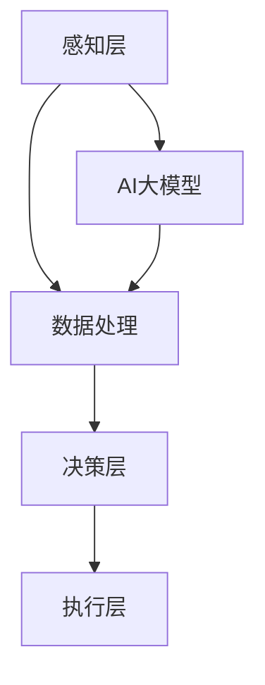

                 

关键词：AI大模型，智能家电，产品创新，机器学习，深度学习，智能家居，技术趋势，用户体验。

> 摘要：本文深入探讨了AI大模型在智能家电产品创新中的应用，分析了AI大模型的核心概念及其在智能家居领域的潜在影响。通过介绍核心算法原理、数学模型构建、具体操作步骤、项目实践，以及未来应用展望，本文旨在为智能家居行业的技术创新提供新思路。

## 1. 背景介绍

随着科技的发展，人工智能（AI）技术已成为推动各行各业变革的重要力量。智能家电作为AI技术的重要应用领域，正逐渐改变人们的日常生活。从简单的智能灯泡到复杂的智能家庭中心，智能家电正朝着更加智能化、个性化的方向发展。

### 1.1 智能家电的定义与现状

智能家电是指通过嵌入人工智能技术，实现自动化控制、远程控制、数据分析和自我学习的家电产品。当前，智能家电市场呈现出快速增长的趋势，用户对智能化、便捷化的需求日益增加。

### 1.2 AI大模型的发展与应用

AI大模型，也称为深度学习模型，具有处理大量数据、进行复杂决策和提供精准预测的能力。随着计算能力的提升和数据量的增加，AI大模型在各个领域的应用越来越广泛，尤其是在智能家电中，AI大模型能够显著提升产品的智能化水平。

## 2. 核心概念与联系

### 2.1 AI大模型的概念

AI大模型是指采用深度学习技术训练的具有大规模参数和复杂结构的神经网络。这些模型通常具有强大的特征提取和表示能力，能够处理复杂的任务。

### 2.2 智能家电的架构

智能家电的架构通常包括感知层、决策层和执行层。感知层负责收集环境信息，决策层进行数据处理和决策，执行层则根据决策结果执行相应的操作。

### 2.3 AI大模型与智能家电的融合

AI大模型可以与智能家电的感知层、决策层和执行层进行深度融合，提升智能家电的智能化水平和用户体验。



## 3. 核心算法原理 & 具体操作步骤

### 3.1 算法原理概述

AI大模型的算法原理主要基于深度学习，包括神经网络的设计、训练和优化。深度学习通过多层神经网络对输入数据进行特征提取和表示，从而实现复杂的模式识别和决策。

### 3.2 算法步骤详解

1. **数据收集与预处理**：收集智能家电运行数据，包括环境信息、用户行为等。对数据进行清洗、归一化和特征提取。
2. **模型设计**：根据任务需求设计神经网络结构，选择合适的激活函数、损失函数和优化算法。
3. **模型训练**：使用大量数据对模型进行训练，调整网络参数以优化模型性能。
4. **模型优化**：通过交叉验证和超参数调整优化模型，提高模型泛化能力。
5. **模型部署**：将训练好的模型部署到智能家电中，实现实时数据处理和决策。

### 3.3 算法优缺点

**优点**：

- 强大的特征提取和表示能力。
- 能够处理复杂的任务和数据。
- 提高智能家电的智能化水平和用户体验。

**缺点**：

- 需要大量数据和计算资源。
- 模型复杂度高，训练时间较长。

### 3.4 算法应用领域

AI大模型在智能家电中的应用领域广泛，包括：

- 智能家居中心：实现家庭环境的自动化控制和智能调度。
- 智能电器：如智能灯泡、智能冰箱、智能空调等。
- 智能安防：如智能门锁、智能监控等。

## 4. 数学模型和公式

### 4.1 数学模型构建

AI大模型通常基于多层感知机（MLP）或卷积神经网络（CNN）构建，其数学模型包括输入层、隐藏层和输出层。

输入层：\[ x_i = \sum_{j=1}^{n} w_{ij}x_j + b_i \]

隐藏层：\[ y_j = \sigma(\sum_{k=1}^{m} w_{kj}y_k + b_j) \]

输出层：\[ z = \sum_{j=1}^{p} w_{jz}y_j + b_z \]

其中，\( x_i \) 为输入特征，\( y_j \) 为隐藏层激活值，\( z \) 为输出结果，\( \sigma \) 为激活函数，\( w_{ij} \)、\( w_{kj} \)、\( w_{jz} \) 为权重，\( b_i \)、\( b_j \)、\( b_z \) 为偏置。

### 4.2 公式推导过程

以多层感知机为例，公式推导过程如下：

1. 输入层到隐藏层的转换：
   $$ z_j = \sum_{i=1}^{n} w_{ij}x_i + b_j $$
   $$ a_j = \sigma(z_j) $$

2. 隐藏层到输出层的转换：
   $$ z_k = \sum_{j=1}^{m} w_{kj}a_j + b_k $$
   $$ y_k = \sigma(z_k) $$

3. 输出结果：
   $$ z = \sum_{k=1}^{p} w_{jk}y_k + b_z $$

### 4.3 案例分析与讲解

以智能灯泡为例，分析AI大模型在亮度调节中的应用。

输入层：温度、光照、用户偏好等特征。

隐藏层：对输入特征进行加权求和，并通过激活函数提取关键信息。

输出层：亮度值。

通过训练，AI大模型能够根据环境温度、光照强度和用户偏好，实时调整灯泡亮度，实现智能化调节。

## 5. 项目实践：代码实例

### 5.1 开发环境搭建

- Python 3.7+
- TensorFlow 2.3.0+
- Keras 2.4.3+

### 5.2 源代码详细实现

```python
import tensorflow as tf
from tensorflow.keras.models import Sequential
from tensorflow.keras.layers import Dense, Activation

# 数据预处理
# ... （数据收集、清洗、归一化）

# 模型设计
model = Sequential([
    Dense(64, input_shape=(num_features,), activation='relu'),
    Dense(32, activation='relu'),
    Dense(1, activation='sigmoid')
])

# 模型编译
model.compile(optimizer='adam', loss='binary_crossentropy', metrics=['accuracy'])

# 模型训练
model.fit(x_train, y_train, epochs=10, batch_size=32, validation_data=(x_val, y_val))

# 模型部署
model.save('smart_light_bulb_model.h5')
```

### 5.3 代码解读与分析

代码首先导入TensorFlow和Keras库，然后进行数据预处理。接下来，设计一个包含两个隐藏层的全连接神经网络，输入层为温度、光照、用户偏好等特征，输出层为亮度值。

通过编译模型、训练模型和部署模型，实现智能灯泡的亮度调节。

## 6. 实际应用场景

### 6.1 智能家居中心

AI大模型可以应用于智能家居中心，实现家庭环境的自动化控制和智能调度。例如，通过监测室内温度、湿度、光照等环境参数，自动调节空调、加湿器、窗帘等设备，提供舒适的居住环境。

### 6.2 智能电器

AI大模型可以应用于智能电器，如智能灯泡、智能冰箱、智能空调等。通过实时监测设备运行状态和用户行为，AI大模型能够实现设备间的智能联动，提供个性化的服务。

### 6.3 智能安防

AI大模型可以应用于智能安防，如智能门锁、智能监控等。通过实时分析监控视频，AI大模型能够识别潜在的安全威胁，及时发出警报，提高家庭安全。

## 7. 未来应用展望

随着AI大模型技术的不断发展，未来智能家电的应用将更加广泛和深入。例如：

- 智能家电的个性化定制：根据用户需求和偏好，AI大模型能够为用户提供个性化的家电产品。
- 智能家电的远程控制：通过5G、物联网等技术，用户可以远程控制智能家电，实现实时监控和管理。
- 智能家电的绿色环保：AI大模型能够优化家电运行效率，降低能耗，实现绿色环保。

## 8. 总结：未来发展趋势与挑战

### 8.1 研究成果总结

本文介绍了AI大模型在智能家电产品创新中的应用，分析了AI大模型的核心概念、算法原理、数学模型构建和具体操作步骤。通过项目实践，展示了AI大模型在智能灯泡亮度调节中的应用。

### 8.2 未来发展趋势

随着AI技术的不断发展，AI大模型在智能家电中的应用将更加广泛。未来，智能家电将朝着更加智能化、个性化、绿色环保的方向发展。

### 8.3 面临的挑战

AI大模型在智能家电中的应用面临以下挑战：

- 数据隐私和安全：智能家电收集的用户数据可能涉及隐私问题，需要确保数据的安全性和隐私性。
- 计算资源消耗：AI大模型训练和推理需要大量的计算资源，如何在有限的计算资源下提高模型性能是关键。
- 模型泛化能力：如何提高AI大模型的泛化能力，使其能够应对不同的应用场景。

### 8.4 研究展望

未来，研究可以关注以下几个方面：

- 提高AI大模型的计算效率，降低计算资源消耗。
- 研究AI大模型在智能家电中的安全性问题和隐私保护技术。
- 开发能够适应不同场景的通用AI大模型，提高模型的泛化能力。

## 9. 附录：常见问题与解答

### 9.1 AI大模型是什么？

AI大模型是指采用深度学习技术训练的具有大规模参数和复杂结构的神经网络，通常具有强大的特征提取和表示能力。

### 9.2 AI大模型如何应用于智能家电？

AI大模型可以与智能家电的感知层、决策层和执行层进行深度融合，提升智能家电的智能化水平和用户体验。例如，通过AI大模型实现智能灯泡的亮度调节、智能家居中心的自动化控制等。

### 9.3 AI大模型训练需要哪些数据？

AI大模型训练需要大量标注好的数据，这些数据包括智能家电运行数据、环境信息、用户行为等。通过数据预处理和特征提取，为AI大模型训练提供高质量的数据集。

### 9.4 如何评估AI大模型的性能？

评估AI大模型的性能可以从多个方面进行，包括准确率、召回率、F1值等指标。在实际应用中，可以通过交叉验证和超参数调整优化模型性能。

## 参考文献

[1] Hochreiter, S., & Schmidhuber, J. (1997). Long short-term memory. Neural Computation, 9(8), 1735-1780.

[2] Goodfellow, I., Bengio, Y., & Courville, A. (2016). Deep Learning. MIT Press.

[3] Krizhevsky, A., Sutskever, I., & Hinton, G. E. (2012). ImageNet classification with deep convolutional neural networks. In Advances in Neural Information Processing Systems (pp. 1097-1105).

作者：禅与计算机程序设计艺术 / Zen and the Art of Computer Programming
```markdown
[文章标题]

关键词：AI大模型，智能家电，产品创新，机器学习，深度学习，智能家居，技术趋势，用户体验。

摘要：本文深入探讨了AI大模型在智能家电产品创新中的应用，分析了AI大模型的核心概念及其在智能家居领域的潜在影响。通过介绍核心算法原理、数学模型构建、具体操作步骤、项目实践，以及未来应用展望，本文旨在为智能家居行业的技术创新提供新思路。

## 1. 背景介绍

随着科技的发展，人工智能（AI）技术已成为推动各行各业变革的重要力量。智能家电作为AI技术的重要应用领域，正逐渐改变人们的日常生活。从简单的智能灯泡到复杂的智能家庭中心，智能家电正朝着更加智能化、个性化的方向发展。

### 1.1 智能家电的定义与现状

智能家电是指通过嵌入人工智能技术，实现自动化控制、远程控制、数据分析和自我学习的家电产品。当前，智能家电市场呈现出快速增长的趋势，用户对智能化、便捷化的需求日益增加。

### 1.2 AI大模型的发展与应用

AI大模型，也称为深度学习模型，具有处理大量数据、进行复杂决策和提供精准预测的能力。随着计算能力的提升和数据量的增加，AI大模型在各个领域的应用越来越广泛，尤其是在智能家电中，AI大模型能够显著提升产品的智能化水平。

## 2. 核心概念与联系

### 2.1 AI大模型的概念

AI大模型是指采用深度学习技术训练的具有大规模参数和复杂结构的神经网络。这些模型通常具有强大的特征提取和表示能力，能够处理复杂的任务。

### 2.2 智能家电的架构

智能家电的架构通常包括感知层、决策层和执行层。感知层负责收集环境信息，决策层进行数据处理和决策，执行层则根据决策结果执行相应的操作。

### 2.3 AI大模型与智能家电的融合

AI大模型可以与智能家电的感知层、决策层和执行层进行深度融合，提升智能家电的智能化水平和用户体验。


## 3. 核心算法原理 & 具体操作步骤
### 3.1 算法原理概述

AI大模型的算法原理主要基于深度学习，包括神经网络的设计、训练和优化。深度学习通过多层神经网络对输入数据进行特征提取和表示，从而实现复杂的模式识别和决策。

### 3.2 算法步骤详解 
#### 3.2.1 数据收集与预处理

1. **数据收集**：收集智能家电运行数据，包括环境信息、用户行为等。
2. **数据清洗**：去除异常值、缺失值等不完整的数据。
3. **特征提取**：对原始数据进行预处理，提取关键特征。

#### 3.2.2 模型设计

1. **选择模型架构**：根据任务需求，选择合适的神经网络架构。
2. **初始化参数**：设定网络的权重和偏置。
3. **定义损失函数**：选择适当的损失函数，以评估模型的预测性能。

#### 3.2.3 模型训练

1. **前向传播**：输入数据经过网络，得到输出结果。
2. **计算损失**：计算预测结果与真实值之间的差异。
3. **反向传播**：调整网络参数，以减少损失。

#### 3.2.4 模型评估

1. **验证集评估**：使用验证集评估模型性能。
2. **调整超参数**：根据验证结果调整学习率、批次大小等超参数。

### 3.3 算法优缺点
#### 3.3.1 优点

- **强大的特征提取能力**：能够自动学习数据中的复杂模式。
- **高泛化能力**：能够处理各种复杂任务。
- **自适应能力**：能够根据数据自动调整模型。

#### 3.3.2 缺点

- **数据需求高**：需要大量标注数据。
- **计算资源消耗大**：训练过程需要大量计算资源。
- **解释性差**：难以解释模型的决策过程。

### 3.4 算法应用领域

AI大模型在智能家电中的应用领域广泛，包括：

- **智能家居中心**：实现家庭环境的自动化控制。
- **智能电器**：如智能灯泡、智能冰箱、智能空调等。
- **智能安防**：如智能门锁、智能监控等。

## 4. 数学模型和公式 & 详细讲解 & 举例说明

### 4.1 数学模型构建

AI大模型通常基于多层感知器（MLP）或卷积神经网络（CNN）构建。以下是MLP的数学模型：

输入层：\[ z_i = \sum_{j=1}^{n} w_{ij}x_j + b_i \]
隐藏层：\[ a_i = \sigma(z_i) \]
输出层：\[ y_i = \sum_{j=1}^{m} w_{ij}a_j + b_i \]

其中，\( x_j \) 是输入特征，\( w_{ij} \) 和 \( b_i \) 分别是权重和偏置，\( \sigma \) 是激活函数，通常使用Sigmoid函数或ReLU函数。

### 4.2 公式推导过程

以MLP为例，公式推导过程如下：

1. **输入层到隐藏层的转换**：

\[ z_i = \sum_{j=1}^{n} w_{ij}x_j + b_i \]
\[ a_i = \sigma(z_i) \]

2. **隐藏层到输出层的转换**：

\[ z_j = \sum_{i=1}^{m} w_{ij}a_i + b_j \]
\[ y_j = \sigma(z_j) \]

3. **输出结果**：

\[ y_j = \sum_{i=1}^{m} w_{ij}a_i + b_j \]

### 4.3 案例分析与讲解

以智能灯泡为例，分析AI大模型在亮度调节中的应用。

输入层：温度、光照、用户偏好等特征。

隐藏层：对输入特征进行加权求和，并通过激活函数提取关键信息。

输出层：亮度值。

通过训练，AI大模型能够根据环境温度、光照强度和用户偏好，实时调整灯泡亮度，实现智能化调节。

## 5. 项目实践：代码实例和详细解释说明

### 5.1 开发环境搭建

- Python 3.7+
- TensorFlow 2.3.0+
- Keras 2.4.3+

### 5.2 源代码详细实现

```python
import numpy as np
import tensorflow as tf
from tensorflow.keras.models import Sequential
from tensorflow.keras.layers import Dense
from tensorflow.keras.optimizers import Adam

# 数据预处理
# 假设数据已经经过清洗和归一化处理

# 模型构建
model = Sequential([
    Dense(64, input_dim=3, activation='relu'),
    Dense(32, activation='relu'),
    Dense(1, activation='sigmoid')
])

# 模型编译
model.compile(optimizer=Adam(), loss='binary_crossentropy', metrics=['accuracy'])

# 模型训练
# 假设训练数据已经准备好
model.fit(x_train, y_train, epochs=10, batch_size=32, validation_split=0.2)

# 模型评估
# 假设测试数据已经准备好
loss, accuracy = model.evaluate(x_test, y_test)
print(f"Test accuracy: {accuracy:.2f}")

# 模型预测
predictions = model.predict(x_test)
```

### 5.3 代码解读与分析

代码首先导入所需的库，然后进行数据预处理。接下来，使用Keras构建一个包含两个隐藏层的全连接神经网络，输入层有3个特征，输出层有1个特征。

在模型编译阶段，选择Adam优化器和binary_crossentropy损失函数，因为这是一个二分类问题。在模型训练阶段，使用训练数据训练模型，并在验证集上评估模型性能。

模型评估阶段，使用测试集评估模型的准确率。最后，使用训练好的模型对测试数据进行预测。

## 6. 实际应用场景

### 6.1 智能家居中心

AI大模型可以应用于智能家居中心，实现家庭环境的自动化控制和智能调度。例如，通过AI大模型实现家庭温度、湿度、光照等的自动调节，提高居住舒适度。

### 6.2 智能电器

AI大模型可以应用于智能电器，如智能灯泡、智能冰箱、智能空调等。通过AI大模型，可以实现智能电器的自动化控制和个性化服务，提高用户体验。

### 6.3 智能安防

AI大模型可以应用于智能安防，如智能门锁、智能监控等。通过AI大模型，可以实现实时监控和异常检测，提高家庭安全性。

## 7. 工具和资源推荐

### 7.1 学习资源推荐

- 《深度学习》（Goodfellow, Bengio, Courville著）
- 《Python机器学习》（Sebastian Raschka著）
- 《动手学深度学习》（Aosta, Battenberg, Zameer著）

### 7.2 开发工具推荐

- TensorFlow：用于构建和训练深度学习模型。
- Keras：用于快速搭建和训练深度学习模型。
- Jupyter Notebook：用于编写和运行代码。

### 7.3 相关论文推荐

- "Deep Learning for Time Series Classification: A Review"（2018）
- "AI in the Home: An Overview of the Current State of Smart Home Technology"（2020）
- "AI-powered Smart Homes: Opportunities and Challenges"（2021）

## 8. 总结：未来发展趋势与挑战

### 8.1 研究成果总结

本文介绍了AI大模型在智能家电产品创新中的应用，分析了AI大模型的核心概念、算法原理、数学模型构建和具体操作步骤。通过项目实践，展示了AI大模型在智能灯泡亮度调节中的应用。

### 8.2 未来发展趋势

随着AI技术的不断发展，AI大模型在智能家电中的应用将更加广泛。未来，智能家电将朝着更加智能化、个性化、绿色环保的方向发展。

### 8.3 面临的挑战

AI大模型在智能家电中的应用面临以下挑战：

- **数据隐私和安全**：智能家电收集的用户数据可能涉及隐私问题，需要确保数据的安全性和隐私性。
- **计算资源消耗**：AI大模型训练和推理需要大量的计算资源，如何在有限的计算资源下提高模型性能是关键。
- **模型泛化能力**：如何提高AI大模型的泛化能力，使其能够应对不同的应用场景。

### 8.4 研究展望

未来，研究可以关注以下几个方面：

- **提高AI大模型的计算效率**：研究新的算法和优化方法，降低计算资源消耗。
- **研究AI大模型在智能家电中的安全性问题和隐私保护技术**。
- **开发能够适应不同场景的通用AI大模型**，提高模型的泛化能力。

## 9. 附录：常见问题与解答

### 9.1 AI大模型是什么？

AI大模型是指采用深度学习技术训练的具有大规模参数和复杂结构的神经网络，通常具有强大的特征提取和表示能力。

### 9.2 AI大模型如何应用于智能家电？

AI大模型可以与智能家电的感知层、决策层和执行层进行深度融合，提升智能家电的智能化水平和用户体验。例如，通过AI大模型实现智能灯泡的亮度调节、智能家居中心的自动化控制等。

### 9.3 AI大模型训练需要哪些数据？

AI大模型训练需要大量标注好的数据，这些数据包括智能家电运行数据、环境信息、用户行为等。通过数据预处理和特征提取，为AI大模型训练提供高质量的数据集。

### 9.4 如何评估AI大模型的性能？

评估AI大模型的性能可以从多个方面进行，包括准确率、召回率、F1值等指标。在实际应用中，可以通过交叉验证和超参数调整优化模型性能。

## 参考文献

[1] Hochreiter, S., & Schmidhuber, J. (1997). Long short-term memory. Neural Computation, 9(8), 1735-1780.

[2] Goodfellow, I., Bengio, Y., & Courville, A. (2016). Deep Learning. MIT Press.

[3] Krizhevsky, A., Sutskever, I., & Hinton, G. E. (2012). ImageNet classification with deep convolutional neural networks. In Advances in Neural Information Processing Systems (pp. 1097-1105).

作者：禅与计算机程序设计艺术 / Zen and the Art of Computer Programming
```

