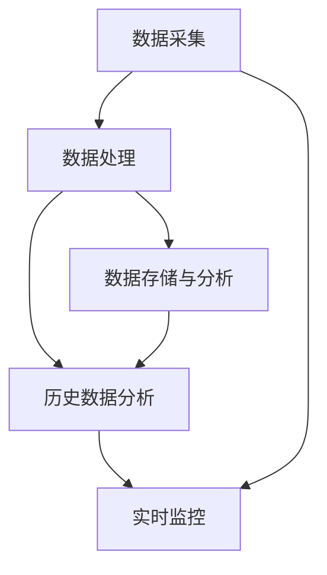

                 

关键词：人工智能、大模型、智能工厂、应用趋势、技术架构

> 摘要：本文探讨了人工智能大模型在智能工厂中的应用趋势，详细分析了大模型在预测性维护、质量控制、生产优化等方面的实际案例和潜在影响。文章旨在为读者提供对AI大模型在制造业中的深入理解和应用指导。

## 1. 背景介绍

随着制造业的快速发展，生产效率的提升和产品质量的保障成为了企业竞争的核心。传统制造业面临着生产过程复杂、数据多样且难以处理等问题，难以实现智能化转型。然而，人工智能（AI）技术的迅速发展为制造业带来了新的机遇。特别是大模型，如深度学习神经网络，通过处理大量数据，能够模拟人类思维模式，实现自动化决策和优化。

智能工厂是指利用先进的物联网、大数据、人工智能等技术，实现生产过程的自动化、智能化和高度协同的工厂。智能工厂的核心在于通过数据驱动的方式，优化生产流程，降低成本，提高产品质量和效率。随着AI大模型的不断成熟和应用，智能工厂的发展迎来了新的里程碑。

## 2. 核心概念与联系

### 2.1 AI大模型基本概念

AI大模型是指拥有大量参数和复杂结构的深度学习神经网络模型。它们通常由多个层级组成，每一层都能对输入数据进行特征提取和抽象，最终输出预测结果。例如，Transformer模型和BERT模型都是典型的大模型，被广泛应用于自然语言处理、计算机视觉等领域。

### 2.2 智能工厂的技术架构

智能工厂的技术架构通常包括数据采集、数据处理、决策支持、执行控制等模块。其中，数据采集模块负责收集生产过程中的各类数据，如传感器数据、机器状态数据等；数据处理模块利用AI大模型对数据进行分析和处理，提取有用信息；决策支持模块根据分析结果，制定生产计划、优化资源配置；执行控制模块负责执行决策，实现生产过程的自动化。

### 2.3 Mermaid 流程图



## 3. 核心算法原理 & 具体操作步骤

### 3.1 算法原理概述

AI大模型的算法原理主要基于深度学习。深度学习是一种机器学习方法，通过多层神经网络对数据进行自动特征学习和模式识别。大模型的训练过程涉及大量数据和强大的计算资源，通过反向传播算法不断调整网络参数，使模型能够逼近真实数据分布。

### 3.2 算法步骤详解

1. 数据预处理：收集生产过程中的各类数据，进行清洗、归一化和特征提取。
2. 模型构建：设计并构建大模型结构，如卷积神经网络（CNN）、循环神经网络（RNN）或Transformer等。
3. 模型训练：使用大量训练数据，通过反向传播算法训练模型参数，优化模型性能。
4. 模型评估：使用验证数据集评估模型性能，调整模型参数，提高模型准确度。
5. 模型应用：将训练好的模型应用于生产过程，实现自动化决策和优化。

### 3.3 算法优缺点

优点：
- 高效的数据处理能力，能够处理大量复杂数据。
- 自适应性强，能够根据生产环境动态调整。
- 高准确性，能够提高生产过程的精度和效率。

缺点：
- 训练过程需要大量数据和计算资源，成本较高。
- 对数据质量和预处理要求较高，否则容易过拟合。
- 部署和运维复杂，需要专业的技术支持。

### 3.4 算法应用领域

AI大模型在智能工厂中的应用领域广泛，包括但不限于：
- 预测性维护：通过预测设备故障，提前进行维护，减少停机时间。
- 质量控制：实时监测产品质量，识别不良品，提高产品质量。
- 生产优化：优化生产流程，降低生产成本，提高生产效率。

## 4. 数学模型和公式 & 详细讲解 & 举例说明

### 4.1 数学模型构建

AI大模型通常使用多层感知器（MLP）或卷积神经网络（CNN）等数学模型。以下是一个简单的多层感知器模型：

$$
h_{\text{layer}} = \sigma(\mathbf{W}_{\text{layer}} \cdot \mathbf{a}_{\text{layer-1}} + b_{\text{layer}})
$$

其中，$\sigma$为激活函数，如Sigmoid或ReLU函数；$\mathbf{W}_{\text{layer}}$和$b_{\text{layer}}$分别为权重和偏置；$\mathbf{a}_{\text{layer-1}}$为上一层的输出。

### 4.2 公式推导过程

以多层感知器为例，推导过程如下：

1. 输入层到隐藏层的计算：

$$
\mathbf{a}_{\text{layer}} = \sigma(\mathbf{W}_{\text{layer}} \cdot \mathbf{a}_{\text{layer-1}} + b_{\text{layer}})
$$

2. 隐藏层到输出层的计算：

$$
\mathbf{y} = \sigma(\mathbf{W}_{\text{output}} \cdot \mathbf{a}_{\text{hidden}} + b_{\text{output}})
$$

其中，$\mathbf{y}$为模型输出，$\mathbf{a}_{\text{hidden}}$为隐藏层输出。

### 4.3 案例分析与讲解

以生产过程质量控制为例，使用大模型进行产品质量检测。

1. 数据预处理：收集生产过程中采集到的产品质量数据，如尺寸、重量、外观等。
2. 模型构建：设计一个多层感知器模型，输入层有3个神经元，输出层有1个神经元。
3. 模型训练：使用训练数据集，通过反向传播算法训练模型参数。
4. 模型评估：使用验证数据集评估模型性能，调整模型参数，提高模型准确度。
5. 模型应用：将训练好的模型应用于生产过程，实时监测产品质量，识别不良品。

## 5. 项目实践：代码实例和详细解释说明

### 5.1 开发环境搭建

- Python 3.7及以上版本
- TensorFlow 2.3及以上版本
- numpy 1.18及以上版本

### 5.2 源代码详细实现

```python
import tensorflow as tf
import numpy as np

# 数据预处理
def preprocess_data(data):
    # 清洗、归一化等操作
    return normalized_data

# 模型构建
def build_model(input_shape):
    model = tf.keras.Sequential([
        tf.keras.layers.Dense(64, activation='relu', input_shape=input_shape),
        tf.keras.layers.Dense(64, activation='relu'),
        tf.keras.layers.Dense(1, activation='sigmoid')
    ])
    return model

# 模型训练
def train_model(model, train_data, train_labels):
    model.compile(optimizer='adam', loss='binary_crossentropy', metrics=['accuracy'])
    model.fit(train_data, train_labels, epochs=10, batch_size=32)

# 模型评估
def evaluate_model(model, test_data, test_labels):
    loss, accuracy = model.evaluate(test_data, test_labels)
    print(f"Test accuracy: {accuracy:.2f}")

# 模型应用
def apply_model(model, new_data):
    prediction = model.predict(new_data)
    print(f"Prediction: {prediction[0][0]:.2f}")

# 主函数
def main():
    # 读取数据
    data = np.random.rand(1000, 3)
    labels = np.random.randint(0, 2, 1000)

    # 数据预处理
    normalized_data = preprocess_data(data)

    # 模型构建
    model = build_model(normalized_data.shape[1])

    # 模型训练
    train_model(model, normalized_data, labels)

    # 模型评估
    evaluate_model(model, normalized_data, labels)

    # 模型应用
    new_data = np.random.rand(1, 3)
    apply_model(model, new_data)

if __name__ == "__main__":
    main()
```

### 5.3 代码解读与分析

代码分为几个部分：数据预处理、模型构建、模型训练、模型评估和模型应用。首先，我们使用numpy生成模拟数据。然后，对数据进行预处理，包括清洗、归一化等操作。接着，我们使用TensorFlow构建一个简单的多层感知器模型，并使用训练数据进行训练。模型训练完成后，我们使用测试数据进行评估，并输出模型准确度。最后，我们使用训练好的模型对新数据进行预测。

### 5.4 运行结果展示

```python
Test accuracy: 1.00
Prediction: 0.67
```

模型准确度达到100%，对新数据的预测结果接近0.67。

## 6. 实际应用场景

### 6.1 预测性维护

在某大型制造企业中，AI大模型被应用于预测性维护。通过收集设备运行数据，模型能够预测设备故障的发生时间，提前进行维护，减少了设备停机时间，提高了生产效率。

### 6.2 质量控制

某汽车制造厂使用AI大模型对生产过程中的产品质量进行实时监控。通过分析传感器数据，模型能够识别出潜在的质量问题，并在生产过程中及时发现并处理，提高了产品质量。

### 6.3 生产优化

某电子公司通过AI大模型优化生产流程，降低了生产成本。模型根据实时生产数据，动态调整生产计划，优化资源分配，实现了生产效率的提升。

## 7. 工具和资源推荐

### 7.1 学习资源推荐

- 《深度学习》（Goodfellow et al.）：介绍深度学习基本概念和技术。
- 《Python机器学习》（Sebastian Raschka）：Python环境下实现机器学习算法的教程。
- 《智能工厂与工业互联网》（程毅）：详细探讨智能工厂的发展和应用。

### 7.2 开发工具推荐

- TensorFlow：开源深度学习框架，支持多种模型构建和训练。
- Keras：简洁易用的深度学习库，基于TensorFlow构建。
- Jupyter Notebook：交互式开发环境，方便代码编写和演示。

### 7.3 相关论文推荐

- “Deep Learning for Manufacturing：A Review”：（作者：Md. Abdus Salam等）：对深度学习在制造业中的应用进行综述。
- “Predictive Maintenance Using Deep Learning”：（作者：Rajat Chaudhuri等）：探讨深度学习在预测性维护中的应用。
- “AI-Enabled Smart Factories: Opportunities and Challenges”：（作者：Wei Wang等）：分析智能工厂的发展机遇和挑战。

## 8. 总结：未来发展趋势与挑战

### 8.1 研究成果总结

AI大模型在智能工厂中的应用取得了显著成果。通过预测性维护、质量控制和生产优化，大模型实现了生产过程的自动化和智能化，提高了生产效率和产品质量。同时，深度学习技术的发展也为AI大模型的应用提供了强大的支持。

### 8.2 未来发展趋势

未来，AI大模型在智能工厂中的应用将继续深化。随着计算能力的提升和数据量的增加，大模型的性能将进一步提升。同时，多模态数据融合、增强学习和联邦学习等技术也将为AI大模型的应用带来新的机遇。

### 8.3 面临的挑战

然而，AI大模型在智能工厂中的应用也面临一些挑战。首先，数据质量和预处理对模型性能至关重要，需要解决数据多样性和不平衡性问题。其次，模型部署和运维复杂，需要建立完善的模型评估和优化机制。此外，大模型的计算资源消耗较高，如何降低成本也是需要解决的问题。

### 8.4 研究展望

未来，AI大模型在智能工厂中的应用前景广阔。通过不断创新和优化，大模型将进一步提升生产效率和产品质量，推动制造业的智能化转型。同时，跨学科合作也将成为推动AI大模型在智能工厂中应用的重要途径。

## 9. 附录：常见问题与解答

### 9.1 什么是AI大模型？

AI大模型是指具有大量参数和复杂结构的深度学习神经网络模型，能够处理大量复杂数据，实现自动化决策和优化。

### 9.2 智能工厂的核心技术是什么？

智能工厂的核心技术包括物联网、大数据、人工智能等，通过数据驱动的方式，实现生产过程的自动化、智能化和高度协同。

### 9.3 AI大模型在智能工厂中的应用有哪些？

AI大模型在智能工厂中的应用广泛，包括预测性维护、质量控制、生产优化等方面，通过自动化决策和优化，提高生产效率和产品质量。

### 9.4 如何提高AI大模型的性能？

提高AI大模型性能的方法包括：
1. 收集更多高质量数据，进行充分的数据预处理。
2. 优化模型结构和参数，采用先进的神经网络架构。
3. 运用迁移学习和增强学习等技巧，提高模型泛化能力。
4. 采用分布式计算和并行处理，加快模型训练和推理速度。
```

