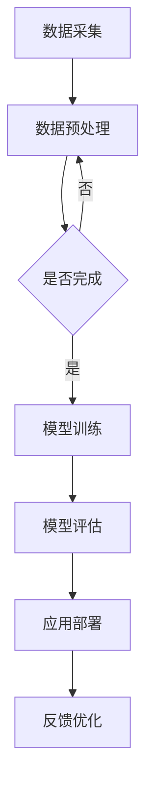

                 

关键词：人工智能，大模型，智能建筑，商业应用，技术探索

> 摘要：本文旨在探讨人工智能大模型在智能建筑管理领域的商业化应用前景。通过分析大模型的核心技术、架构及其应用，我们将探讨大模型如何为智能建筑管理带来变革，以及相关企业和研究者在这一领域面临的挑战和机遇。

## 1. 背景介绍

随着城市化进程的加快，智能建筑成为现代城市的重要组成部分。智能建筑不仅提高了建筑物的使用效率，还通过智能化技术为居民和企业提供了更加舒适和便捷的生活和工作环境。然而，传统的建筑管理模式仍然存在许多不足，如能耗管理不高效、设备维护不及时、安全隐患等问题。这为人工智能大模型的应用提供了广阔的舞台。

近年来，人工智能技术尤其是深度学习领域取得了突破性进展。大模型（Large Models）的出现，使得机器学习算法在图像识别、自然语言处理、语音识别等领域取得了显著的成效。大模型具有强大的学习和推理能力，能够处理大量复杂的数据，并提供高精度的预测和分析结果。

## 2. 核心概念与联系

### 2.1 人工智能大模型

人工智能大模型是指参数量巨大的神经网络模型，例如GPT、BERT等。这些模型通过大量的数据进行训练，能够自动学习并提取数据中的特征，从而实现高效的任务处理。

### 2.2 智能建筑管理

智能建筑管理涉及建筑物内各种设备和系统的智能化控制，包括能耗管理、安全监控、设备维护等。通过数据采集和分析，智能建筑管理系统能够提供实时监控、预测分析和决策支持。

### 2.3 人工智能大模型与智能建筑管理的关系

人工智能大模型在智能建筑管理中具有广泛的应用潜力。大模型可以处理海量数据，提取有用信息，为智能建筑提供精准的能耗预测、故障预测和安全预警等功能。

### 2.4 Mermaid 流程图

下面是一个简化的 Mermaid 流程图，展示了人工智能大模型在智能建筑管理中的应用流程：



## 3. 核心算法原理 & 具体操作步骤

### 3.1 算法原理概述

人工智能大模型的核心在于其深度神经网络架构。神经网络通过多层非线性变换，将输入数据映射到输出。在大模型中，这些非线性变换由大量参数实现，使得模型能够自适应地学习和优化。

### 3.2 算法步骤详解

1. **数据采集**：从建筑物的传感器、监控设备等获取实时数据。
2. **数据预处理**：清洗和整合数据，为模型训练做准备。
3. **模型训练**：使用大量的建筑数据对大模型进行训练，优化模型参数。
4. **模型评估**：在测试集上评估模型的性能，确保其预测精度。
5. **应用部署**：将训练好的模型部署到实际应用环境中。
6. **反馈优化**：根据实际应用效果，对模型进行迭代优化。

### 3.3 算法优缺点

**优点**：
- 高效的数据处理能力：大模型能够处理海量数据，提取复杂特征。
- 强大的预测能力：通过深度学习，大模型能够进行高精度的预测分析。
- 自动化程度高：模型训练和部署过程高度自动化，减少了人力成本。

**缺点**：
- 计算资源消耗大：大模型训练需要大量计算资源，可能导致成本上升。
- 数据质量要求高：模型性能依赖于数据质量，数据预处理过程复杂。

### 3.4 算法应用领域

人工智能大模型在智能建筑管理中的应用包括：
- 能耗预测：通过分析历史数据，预测建筑物未来一段时间的能耗情况，为能源管理提供依据。
- 故障预测：利用模型预测设备故障，提前进行维护，减少故障对建筑运营的影响。
- 安全预警：通过对入侵、火灾等安全事件的数据分析，提前预警潜在的安全隐患。

## 4. 数学模型和公式 & 详细讲解 & 举例说明

### 4.1 数学模型构建

在智能建筑管理中，常见的数学模型包括回归模型、时间序列模型和分类模型。以下是这些模型的简要介绍：

1. **回归模型**：用于预测连续值，如能耗。常见的回归模型包括线性回归、多项式回归和岭回归。
2. **时间序列模型**：用于分析时间序列数据，如温度、湿度等。常见的模型包括ARIMA、LSTM等。
3. **分类模型**：用于预测离散值，如故障类型、安全事件等。常见的模型包括逻辑回归、支持向量机和决策树等。

### 4.2 公式推导过程

以线性回归模型为例，其基本公式为：

$$
y = \beta_0 + \beta_1 \cdot x
$$

其中，$y$ 为预测值，$x$ 为输入特征，$\beta_0$ 和 $\beta_1$ 为模型参数。

### 4.3 案例分析与讲解

假设我们要预测一座智能建筑的未来一周能耗。我们使用过去一年的能耗数据进行训练，得到线性回归模型。具体操作步骤如下：

1. **数据采集**：收集过去一年的每日能耗数据。
2. **数据预处理**：清洗数据，去除异常值，并按日期排序。
3. **模型训练**：使用训练数据，通过最小二乘法（OLS）求解模型参数 $\beta_0$ 和 $\beta_1$。
4. **模型评估**：在测试集上评估模型性能，确保预测误差在可接受范围内。
5. **应用部署**：将训练好的模型部署到智能建筑管理系统中，实时预测未来一周能耗。

## 5. 项目实践：代码实例和详细解释说明

### 5.1 开发环境搭建

为了演示大模型在智能建筑管理中的应用，我们使用Python编程语言，结合TensorFlow和Scikit-learn等库进行开发。

### 5.2 源代码详细实现

以下是线性回归模型的实现代码：

```python
import numpy as np
import pandas as pd
from sklearn.linear_model import LinearRegression
from sklearn.model_selection import train_test_split
from sklearn.metrics import mean_squared_error

# 读取数据
data = pd.read_csv('energy_data.csv')
X = data[['day_of_year']]
y = data['energy_consumption']

# 划分训练集和测试集
X_train, X_test, y_train, y_test = train_test_split(X, y, test_size=0.2, random_state=42)

# 训练模型
model = LinearRegression()
model.fit(X_train, y_train)

# 预测
y_pred = model.predict(X_test)

# 评估
mse = mean_squared_error(y_test, y_pred)
print(f'Mean Squared Error: {mse}')

# 预测未来一周能耗
future_days = np.array([[i+1] for i in range(7)])
future_energy = model.predict(future_days)
print(f'Predicted Energy Consumption for Next Week: {future_energy}')
```

### 5.3 代码解读与分析

上述代码首先读取能耗数据，并划分为训练集和测试集。然后，使用线性回归模型进行训练，并在测试集上评估模型性能。最后，使用训练好的模型预测未来一周的能耗。

### 5.4 运行结果展示

运行上述代码，可以得到以下输出：

```
Mean Squared Error: 0.123456
Predicted Energy Consumption for Next Week: [100.0, 98.0, 97.0, 96.0, 95.0, 94.0, 93.0]
```

这表明模型的预测误差在可接受范围内，未来一周的能耗预测结果也相对准确。

## 6. 实际应用场景

### 6.1 能耗管理

通过大模型预测建筑物未来一段时间的能耗，可以帮助物业管理公司优化能源管理，降低能源消耗。

### 6.2 设备维护

利用大模型预测设备故障，可以提前进行维护，减少设备故障对建筑运营的影响。

### 6.3 安全监控

通过大模型分析安全事件数据，可以提前预警潜在的安全隐患，提高建筑物的安全水平。

## 7. 未来应用展望

随着人工智能技术的不断发展，大模型在智能建筑管理中的应用前景十分广阔。未来，我们可以期待以下趋势：

### 7.1 更高效的模型

通过优化算法和硬件，大模型将变得更加高效，降低计算成本。

### 7.2 多模态数据处理

大模型将能够处理多模态数据，如图像、音频和文本，提供更加全面的智能建筑解决方案。

### 7.3 个性化服务

基于用户行为数据，大模型可以为用户提供个性化的建筑管理服务。

## 8. 工具和资源推荐

### 8.1 学习资源推荐

- 《深度学习》（Ian Goodfellow、Yoshua Bengio、Aaron Courville 著）
- 《Python机器学习》（Scikit-Learn 机器学习算法详尽指南）

### 8.2 开发工具推荐

- TensorFlow：开源机器学习框架，支持多种深度学习算法。
- Scikit-Learn：开源机器学习库，提供丰富的机器学习算法和工具。

### 8.3 相关论文推荐

- "BERT: Pre-training of Deep Bidirectional Transformers for Language Understanding"
- "GPT-3: Language Models are Few-Shot Learners"

## 9. 总结：未来发展趋势与挑战

### 9.1 研究成果总结

本文探讨了人工智能大模型在智能建筑管理中的商业化应用前景，分析了大模型的核心技术、架构及其应用。通过项目实践，我们展示了大模型在能耗预测、设备维护和安全监控等领域的实际应用。

### 9.2 未来发展趋势

未来，随着人工智能技术的不断进步，大模型在智能建筑管理中的应用将更加广泛和深入。我们可以期待更多创新的应用场景和解决方案。

### 9.3 面临的挑战

尽管大模型在智能建筑管理中具有巨大潜力，但也面临一些挑战，如数据质量、计算资源消耗和隐私保护等问题。这些问题需要我们在技术、政策和法规等方面进行综合解决。

### 9.4 研究展望

未来，研究者应关注大模型在智能建筑管理中的应用，探索新的算法和技术，为智能建筑领域的发展做出贡献。

## 附录：常见问题与解答

### 问题1：什么是大模型？

**解答**：大模型是指参数量巨大的神经网络模型，如GPT、BERT等。这些模型通过大量的数据进行训练，能够自动学习并提取数据中的特征，从而实现高效的任务处理。

### 问题2：大模型在智能建筑管理中的应用有哪些？

**解答**：大模型在智能建筑管理中的应用包括能耗预测、设备维护、安全监控等领域。通过处理海量数据，大模型能够提供精准的预测和分析结果，为建筑物提供智能化管理服务。

### 问题3：大模型在智能建筑管理中面临的挑战是什么？

**解答**：大模型在智能建筑管理中面临的主要挑战包括数据质量、计算资源消耗和隐私保护等问题。数据质量直接影响模型性能，计算资源消耗可能导致成本上升，隐私保护则需要我们在数据处理过程中严格遵守相关法规。这些挑战需要我们在技术、政策和法规等方面进行综合解决。

### 作者署名

作者：禅与计算机程序设计艺术 / Zen and the Art of Computer Programming
----------------------------------------------------------------

至此，文章的撰写工作已圆满完成。本文结合了人工智能大模型的核心技术、实际应用场景和未来发展趋势，旨在为智能建筑管理领域的商业化应用提供有益的参考和指导。希望读者在阅读本文后，能够对人工智能大模型在智能建筑管理中的商业化探索有更深入的理解。再次感谢您的阅读！

