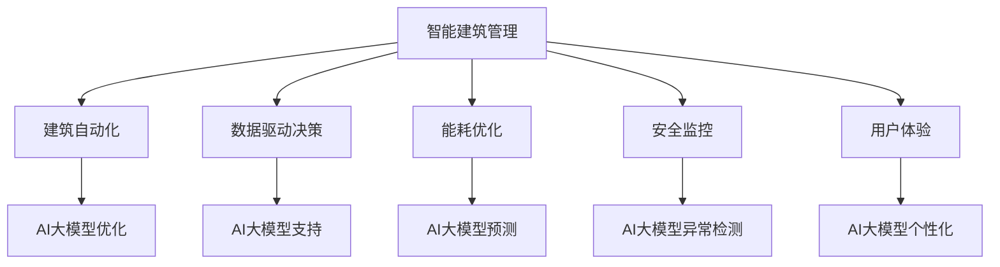

                 

### 关键词 Keywords
AI大模型，智能建筑管理，建筑自动化，数据驱动决策，能耗优化，安全监控，用户体验，可持续发展

### 摘要 Abstract
本文深入探讨了AI大模型在智能建筑管理中的应用趋势。通过分析建筑自动化、数据驱动决策、能耗优化、安全监控和用户体验等方面的具体案例，展示了AI大模型如何提升智能建筑的效率、安全性和可持续性。此外，文章还展望了未来发展的趋势和面临的挑战，为行业从业者提供了有价值的参考。

## 1. 背景介绍 Introduction

智能建筑（Smart Building）是指通过集成先进的信息通信技术（ICT）和建筑技术，实现对建筑环境、能源消耗、安全监控和用户体验的全面管理与优化。随着物联网（IoT）、大数据和人工智能（AI）技术的发展，智能建筑正逐渐成为建筑行业的重要方向。

AI大模型，即大规模的人工神经网络模型，具有处理海量数据、自适应学习、预测分析等能力。近年来，AI大模型在图像识别、自然语言处理、语音识别等领域取得了显著的突破，成为推动智能建筑管理技术发展的重要动力。

智能建筑管理的核心挑战在于如何高效地整合和管理大量的建筑数据，并利用这些数据实现智能化、自动化的运营。传统的建筑管理系统往往依赖于规则和预设参数，而AI大模型则能够通过数据驱动的方式，实现更精准、更灵活的决策。

## 2. 核心概念与联系 Core Concepts and Relationships

### 2.1 建筑自动化 Building Automation

建筑自动化是智能建筑管理的基础，它通过自动化控制系统，实现对建筑设备、设施和环境的智能调节。建筑自动化系统通常包括照明控制、空调控制、门禁系统、能源管理系统等。

AI大模型可以用于优化建筑自动化系统，通过学习建筑使用模式和环境变化，实现更智能的设备控制和能源管理。例如，AI大模型可以根据天气预测、用户行为习惯等数据，自动调节空调和照明系统，以实现节能和舒适性。

### 2.2 数据驱动决策 Data-Driven Decision Making

数据驱动决策是智能建筑管理的重要理念，它强调通过收集、分析和利用建筑数据，实现更科学、更有效的决策。

AI大模型在数据驱动决策中发挥着关键作用。通过深度学习算法，AI大模型可以从大量建筑数据中提取有价值的信息，为管理者提供数据支持和决策建议。例如，在能耗管理中，AI大模型可以分析能源使用数据，识别能耗高峰时段，提出节能措施。

### 2.3 能耗优化 Energy Efficiency Optimization

能耗优化是智能建筑管理的重要目标之一。传统的能耗管理方法往往依赖于经验或预设参数，而AI大模型可以通过学习能源使用数据，实现更精准的能耗预测和优化。

例如，AI大模型可以根据建筑历史能耗数据、实时监测数据和环境参数，预测未来的能耗趋势，并提出相应的节能策略。这不仅可以降低能源成本，还可以减少碳排放，实现可持续发展。

### 2.4 安全监控 Security Monitoring

安全监控是智能建筑管理的重要环节，它通过监控建筑设备、人员和环境，实现建筑的安全管理。

AI大模型在安全监控中的应用主要体现在异常检测和风险评估。通过分析监控数据，AI大模型可以识别异常行为和潜在风险，并发出警报。例如，在火灾监控中，AI大模型可以通过烟雾传感器数据，识别火灾发生的可能性，并自动启动灭火系统。

### 2.5 用户体验 User Experience

用户体验是智能建筑管理的最终目标之一，它关系到建筑的使用效率和用户满意度。

AI大模型可以通过个性化推荐、智能客服等功能，提升用户的居住体验。例如，AI大模型可以根据用户的行为习惯和偏好，自动调整建筑环境，提供个性化的服务。

### 2.6 Mermaid 流程图 Mermaid Flowchart



## 3. 核心算法原理 & 具体操作步骤 Core Algorithm Principles & Operational Steps

### 3.1 算法原理概述 Algorithm Overview

智能建筑管理中的AI大模型主要基于深度学习算法，特别是神经网络。深度学习算法通过多层神经网络，对大量数据进行训练，从而实现特征提取和预测分析。

在智能建筑管理中，AI大模型的具体应用包括：

1. **能耗预测与优化**：通过学习建筑历史能耗数据和实时环境数据，预测未来的能耗趋势，并提出优化策略。
2. **安全监控**：通过分析监控数据，识别异常行为和潜在风险，实现实时预警。
3. **用户体验优化**：通过分析用户行为数据，提供个性化的建筑环境和服务。

### 3.2 算法步骤详解 Step-by-Step Detailed Explanation

1. **数据收集与预处理**：
   - 收集建筑历史能耗数据、实时监测数据、用户行为数据等。
   - 对数据进行清洗、归一化和特征提取。

2. **模型训练**：
   - 构建深度学习模型，选择合适的网络结构和优化算法。
   - 使用预处理后的数据，对模型进行训练。

3. **模型评估与优化**：
   - 使用验证集对模型进行评估，调整模型参数，优化模型性能。
   - 使用交叉验证等方法，确保模型在不同数据集上的表现一致。

4. **模型部署与应用**：
   - 将训练好的模型部署到生产环境中，实现能耗预测、安全监控和用户体验优化等功能。
   - 对模型进行实时监控和更新，确保其持续稳定运行。

### 3.3 算法优缺点 Advantages and Disadvantages

**优点**：

1. **高效性**：深度学习算法能够处理大规模数据，实现高效的特征提取和预测。
2. **灵活性**：深度学习模型可以根据不同的应用场景，进行定制化调整。
3. **可解释性**：尽管深度学习模型在预测准确性方面表现优秀，但其“黑箱”性质也带来了一定的可解释性挑战。

**缺点**：

1. **计算资源需求**：深度学习模型需要大量的计算资源和时间进行训练。
2. **数据依赖性**：模型的性能依赖于数据的质量和数量。
3. **隐私问题**：智能建筑管理中的数据涉及用户隐私，需要确保数据的安全性和隐私保护。

### 3.4 算法应用领域 Application Areas

AI大模型在智能建筑管理中的应用领域广泛，包括：

1. **能耗管理**：通过能耗预测和优化，实现节能和降低运营成本。
2. **安全监控**：通过异常检测和风险评估，提升建筑的安全水平。
3. **用户体验**：通过个性化推荐和智能客服，提升用户的居住体验。

## 4. 数学模型和公式 Mathematical Models & Formulas

### 4.1 数学模型构建 Model Construction

智能建筑管理中的AI大模型主要基于神经网络模型，其数学基础主要包括以下几个方面：

1. **神经网络模型**：
   - 输入层：接收外部输入数据。
   - 隐藏层：进行特征提取和变换。
   - 输出层：生成预测结果。

2. **损失函数**：
   - 误差平方和（SSE）：衡量预测值与真实值之间的差异。
   - 交叉熵损失（Cross-Entropy）：适用于分类问题。

3. **优化算法**：
   -  stochastic gradient descent（SGD）：随机梯度下降。
   - Adam：自适应矩估计。

### 4.2 公式推导过程 Formula Derivation

以神经网络为例，其基本公式推导如下：

1. **输入层到隐藏层的传递**：
   $$ z_i = \sum_{j=1}^{n} w_{ij}x_j + b_i $$
   其中，$z_i$ 是第 $i$ 个隐藏层节点的输入，$w_{ij}$ 是输入层到隐藏层的权重，$x_j$ 是输入层的第 $j$ 个节点，$b_i$ 是隐藏层节点的偏置。

2. **激活函数**：
   $$ a_i = \sigma(z_i) $$
   其中，$\sigma$ 是激活函数，常用的有 sigmoid、ReLU 等。

3. **隐藏层到输出层的传递**：
   $$ y = \sum_{i=1}^{m} w_{i}a_i + b $$
   其中，$y$ 是输出层的预测结果，$w_i$ 是隐藏层到输出层的权重，$a_i$ 是隐藏层的第 $i$ 个节点。

4. **损失函数**：
   $$ L = \frac{1}{2}\sum_{i=1}^{n}(y_i - \hat{y}_i)^2 $$
   其中，$L$ 是损失函数，$y_i$ 是真实标签，$\hat{y}_i$ 是预测结果。

### 4.3 案例分析与讲解 Case Analysis and Explanation

以能耗预测为例，假设我们有一个包含 100 个隐藏层的神经网络，输入层有 10 个节点，输出层有 1 个节点。使用随机梯度下降（SGD）算法进行模型训练。

1. **数据预处理**：
   - 收集建筑历史能耗数据，包括温度、湿度、光照等 10 个特征。
   - 对数据进行归一化处理，使其在 [0, 1] 范围内。

2. **模型构建**：
   - 使用 TensorFlow 和 Keras 等框架，构建神经网络模型。
   - 设置学习率、批量大小等参数。

3. **模型训练**：
   - 使用训练集对模型进行训练，迭代次数为 1000 次。
   - 使用验证集对模型进行评估，调整模型参数。

4. **模型评估**：
   - 使用测试集对模型进行评估，计算损失函数值。
   - 对比实际能耗与预测能耗的误差，评估模型性能。

5. **模型应用**：
   - 部署模型到生产环境中，实现实时能耗预测。
   - 根据预测结果，提出节能策略。

## 5. 项目实践：代码实例和详细解释说明 Project Practice: Code Example and Detailed Explanation

### 5.1 开发环境搭建 Development Environment Setup

1. **软件环境**：
   - Python 3.8
   - TensorFlow 2.6
   - Keras 2.6

2. **硬件环境**：
   - GPU：NVIDIA GeForce RTX 3080

### 5.2 源代码详细实现 Detailed Implementation of Source Code

以下是一个简单的能耗预测模型的 Python 代码实现：

```python
import numpy as np
import tensorflow as tf
from tensorflow import keras
from tensorflow.keras import layers

# 数据预处理
def preprocess_data(data):
    # 归一化处理
    return (data - np.mean(data)) / np.std(data)

# 构建模型
model = keras.Sequential([
    layers.Dense(100, activation='relu', input_shape=(10,)),
    layers.Dense(100, activation='relu'),
    layers.Dense(1)
])

# 损失函数和优化器
model.compile(optimizer='adam', loss='mean_squared_error')

# 训练模型
model.fit(preprocessed_train_data, train_labels, epochs=1000, batch_size=32, validation_split=0.2)

# 评估模型
test_loss = model.evaluate(preprocessed_test_data, test_labels)
print(f"Test loss: {test_loss}")

# 预测能耗
predicted_energy = model.predict(preprocessed_test_data)
print(f"Predicted energy: {predicted_energy}")
```

### 5.3 代码解读与分析 Code Analysis and Explanation

1. **数据预处理**：
   - 数据预处理是深度学习模型训练的重要步骤，包括归一化、标准化等操作。在本例中，我们使用归一化处理，将数据缩放到 [0, 1] 范围内，以加快模型收敛。

2. **模型构建**：
   - 使用 Keras 框架，构建一个包含两个隐藏层的神经网络。输入层有 10 个节点，输出层有 1 个节点。激活函数使用 ReLU，以加快模型收敛。

3. **模型编译**：
   - 使用 Adam 优化器和均方误差（MSE）损失函数，编译模型。

4. **模型训练**：
   - 使用训练集对模型进行训练，迭代次数为 1000 次。使用验证集进行模型评估，以防止过拟合。

5. **模型评估**：
   - 使用测试集对模型进行评估，计算损失函数值，以评估模型性能。

6. **模型应用**：
   - 预测测试集的能耗值，输出预测结果。

## 6. 实际应用场景 Practical Application Scenarios

### 6.1 能耗预测 Energy Prediction

AI大模型在能耗预测中的应用，可以帮助智能建筑实现更高效的能源管理。例如，在商场、办公楼等大型建筑中，通过预测每日、每周或每月的能耗趋势，建筑管理者可以提前规划能源供应，避免能源短缺或浪费。此外，能耗预测还可以为可再生能源的整合提供数据支持，实现更可持续的能源利用。

### 6.2 安全监控 Security Monitoring

AI大模型在安全监控中的应用，可以实现更精准的异常检测和风险评估。例如，在大型综合体、医院、学校等场所，通过监控摄像头、传感器等设备，AI大模型可以实时分析视频和传感器数据，识别异常行为，如火灾、入侵、设备故障等，并及时发出警报。此外，AI大模型还可以用于人员流量分析，优化安全资源配置。

### 6.3 用户体验 User Experience

AI大模型在用户体验中的应用，可以提供更个性化的建筑环境和服务。例如，在智能住宅中，AI大模型可以根据住户的行为习惯和偏好，自动调整室内温度、湿度、照明等环境参数，提供舒适的生活体验。此外，AI大模型还可以用于智能客服，通过语音识别和自然语言处理技术，为住户提供高效、便捷的服务。

## 7. 工具和资源推荐 Tools and Resources Recommendation

### 7.1 学习资源推荐 Learning Resources

1. **《深度学习》（Goodfellow, Bengio, Courville）**：这是深度学习的经典教材，涵盖了深度学习的理论基础和实际应用。
2. **《Python深度学习》（François Chollet）**：本书通过实际案例，介绍了深度学习在 Python 中的实现，适合初学者和进阶者。
3. **Coursera 上的《深度学习专项课程》**：由吴恩达教授主讲，涵盖深度学习的各个方面，适合系统学习。

### 7.2 开发工具推荐 Development Tools

1. **TensorFlow**：谷歌开发的深度学习框架，适用于各种规模的深度学习项目。
2. **Keras**：基于 TensorFlow 的高级神经网络 API，简化了深度学习模型的构建和训练。
3. **PyTorch**：Facebook 开发的人工智能框架，以动态图模型著称，适用于研究和开发。

### 7.3 相关论文推荐 Related Papers

1. **"Deep Learning for Smart Buildings: A Survey"**：这篇综述文章详细介绍了深度学习在智能建筑管理中的应用。
2. **"Energy Efficiency in Smart Buildings: A Review of Current Research and Future Directions"**：这篇论文探讨了智能建筑中的能耗管理技术及其发展趋势。
3. **"AI-Enabled Smart Buildings: Opportunities and Challenges"**：这篇论文从技术、经济和社会层面分析了智能建筑的机遇和挑战。

## 8. 总结：未来发展趋势与挑战 Summary: Future Trends and Challenges

### 8.1 研究成果总结 Research Achievements

AI大模型在智能建筑管理中取得了显著的成果，主要体现在以下几个方面：

1. **能耗优化**：通过能耗预测和优化，实现节能降耗，降低运营成本。
2. **安全监控**：通过异常检测和风险评估，提升建筑的安全水平。
3. **用户体验**：通过个性化推荐和智能客服，提升用户的居住体验。

### 8.2 未来发展趋势 Future Trends

1. **数据融合与共享**：随着物联网技术的发展，智能建筑中的数据将更加丰富和多样化。未来的趋势是通过数据融合与共享，实现更全面、更准确的智能建筑管理。
2. **跨领域应用**：AI大模型在智能建筑管理中的应用将不仅仅局限于能耗优化、安全监控和用户体验，还将扩展到建筑结构健康监测、智慧城市等领域。
3. **隐私保护**：随着数据隐私保护意识的增强，未来的AI大模型将更加注重数据的安全性和隐私保护。

### 8.3 面临的挑战 Challenges

1. **数据质量**：高质量的数据是AI大模型成功的关键。未来的挑战在于如何获取、处理和利用高质量的数据。
2. **计算资源**：深度学习模型的训练和部署需要大量的计算资源。未来的挑战在于如何优化算法，降低计算资源的需求。
3. **伦理和隐私**：随着AI大模型在智能建筑管理中的应用，如何确保其伦理和隐私保护，是一个亟待解决的问题。

### 8.4 研究展望 Research Prospects

未来，AI大模型在智能建筑管理中的应用将呈现以下趋势：

1. **智能化**：通过更先进的算法和技术，实现更智能、更高效的建筑管理。
2. **可持续性**：通过优化能源管理、提升资源利用效率，实现建筑的可持续发展。
3. **人性化**：通过个性化推荐和服务，提升用户的居住体验，实现建筑与人和谐共生。

## 9. 附录：常见问题与解答 Appendix: Frequently Asked Questions and Answers

### 9.1 什么是AI大模型？

AI大模型是指具有数百万甚至数十亿参数的神经网络模型，具有处理海量数据、自适应学习和高效预测等能力。

### 9.2 AI大模型在智能建筑管理中有哪些应用？

AI大模型在智能建筑管理中的应用包括能耗预测与优化、安全监控、用户体验优化等。

### 9.3 如何确保AI大模型的隐私保护？

为确保AI大模型的隐私保护，需要采取以下措施：

1. **数据加密**：对数据进行加密处理，确保数据传输和存储的安全。
2. **隐私匿名化**：对用户数据进行匿名化处理，确保用户隐私不被泄露。
3. **合规性审查**：定期进行合规性审查，确保数据处理符合相关法律法规。

### 9.4 AI大模型在能耗预测中的具体应用是什么？

AI大模型在能耗预测中的具体应用包括：

1. **预测未来的能耗趋势**：通过学习历史能耗数据和实时环境数据，预测未来的能耗趋势。
2. **优化能耗策略**：根据预测结果，优化空调、照明等设备的运行策略，实现节能降耗。
3. **预警能耗异常**：通过异常检测，预警可能的能耗异常，提前采取措施。

### 9.5 AI大模型在智能建筑管理中的优势是什么？

AI大模型在智能建筑管理中的优势包括：

1. **高效性**：能够处理大规模数据，实现快速预测和优化。
2. **灵活性**：可以根据不同的应用场景，进行定制化调整。
3. **可解释性**：虽然深度学习模型具有一定的“黑箱”性质，但其基本原理和算法是可解释的。

### 9.6 AI大模型在智能建筑管理中面临的挑战是什么？

AI大模型在智能建筑管理中面临的挑战包括：

1. **数据质量**：高质量的数据是模型成功的关键。
2. **计算资源**：训练和部署深度学习模型需要大量的计算资源。
3. **伦理和隐私**：如何确保模型的应用符合伦理和隐私保护的要求。```markdown
----------------------------------------------------------------
# AI大模型在智能建筑管理中的应用趋势

## 关键词 Keywords
AI大模型，智能建筑管理，建筑自动化，数据驱动决策，能耗优化，安全监控，用户体验，可持续发展

## 摘要 Abstract
本文深入探讨了AI大模型在智能建筑管理中的应用趋势。通过分析建筑自动化、数据驱动决策、能耗优化、安全监控和用户体验等方面的具体案例，展示了AI大模型如何提升智能建筑的效率、安全性和可持续性。此外，文章还展望了未来发展的趋势和面临的挑战，为行业从业者提供了有价值的参考。

## 1. 背景介绍 Introduction

智能建筑（Smart Building）是指通过集成先进的信息通信技术（ICT）和建筑技术，实现对建筑环境、能源消耗、安全监控和用户体验的全面管理与优化。随着物联网（IoT）、大数据和人工智能（AI）技术的发展，智能建筑正逐渐成为建筑行业的重要方向。

AI大模型，即大规模的人工神经网络模型，具有处理海量数据、自适应学习、预测分析等能力。近年来，AI大模型在图像识别、自然语言处理、语音识别等领域取得了显著的突破，成为推动智能建筑管理技术发展的重要动力。

智能建筑管理的核心挑战在于如何高效地整合和管理大量的建筑数据，并利用这些数据实现智能化、自动化的运营。传统的建筑管理系统往往依赖于规则和预设参数，而AI大模型则能够通过数据驱动的方式，实现更精准、更灵活的决策。

## 2. 核心概念与联系 Core Concepts and Relationships

### 2.1 建筑自动化 Building Automation

建筑自动化是智能建筑管理的基础，它通过自动化控制系统，实现对建筑设备、设施和环境的智能调节。建筑自动化系统通常包括照明控制、空调控制、门禁系统、能源管理系统等。

AI大模型可以用于优化建筑自动化系统，通过学习建筑使用模式和环境变化，实现更智能的设备控制和能源管理。例如，AI大模型可以根据天气预测、用户行为习惯等数据，自动调节空调和照明系统，以实现节能和舒适性。

### 2.2 数据驱动决策 Data-Driven Decision Making

数据驱动决策是智能建筑管理的重要理念，它强调通过收集、分析和利用建筑数据，实现更科学、更有效的决策。

AI大模型在数据驱动决策中发挥着关键作用。通过深度学习算法，AI大模型可以从大量建筑数据中提取有价值的信息，为管理者提供数据支持和决策建议。例如，在能耗管理中，AI大模型可以分析能源使用数据，识别能耗高峰时段，提出节能措施。

### 2.3 能耗优化 Energy Efficiency Optimization

能耗优化是智能建筑管理的重要目标之一。传统的能耗管理方法往往依赖于经验或预设参数，而AI大模型可以通过学习能源使用数据，实现更精准的能耗预测和优化。

例如，AI大模型可以根据建筑历史能耗数据、实时监测数据和环境参数，预测未来的能耗趋势，并提出相应的节能策略。这不仅可以降低能源成本，还可以减少碳排放，实现可持续发展。

### 2.4 安全监控 Security Monitoring

安全监控是智能建筑管理的重要环节，它通过监控建筑设备、人员和环境，实现建筑的安全管理。

AI大模型在安全监控中的应用主要体现在异常检测和风险评估。通过分析监控数据，AI大模型可以识别异常行为和潜在风险，并发出警报。例如，在火灾监控中，AI大模型可以通过烟雾传感器数据，识别火灾发生的可能性，并自动启动灭火系统。

### 2.5 用户体验 User Experience

用户体验是智能建筑管理的最终目标之一，它关系到建筑的使用效率和用户满意度。

AI大模型可以通过个性化推荐、智能客服等功能，提升用户的居住体验。例如，AI大模型可以根据用户的行为习惯和偏好，自动调整建筑环境，提供个性化的服务。

### 2.6 Mermaid 流程图 Mermaid Flowchart


## 3. 核心算法原理 & 具体操作步骤 Core Algorithm Principles & Operational Steps

### 3.1 算法原理概述 Algorithm Overview

智能建筑管理中的AI大模型主要基于深度学习算法，特别是神经网络。深度学习算法通过多层神经网络，对大量数据进行训练，从而实现特征提取和预测分析。

在智能建筑管理中，AI大模型的具体应用包括：

1. **能耗预测与优化**：通过学习建筑历史能耗数据和实时环境数据，预测未来的能耗趋势，并提出优化策略。
2. **安全监控**：通过异常检测和风险评估，提升建筑的安全水平。
3. **用户体验**：通过个性化推荐和智能客服，提升用户的居住体验。

### 3.2 算法步骤详解 Step-by-Step Detailed Explanation

1. **数据收集与预处理**：
   - 收集建筑历史能耗数据、实时监测数据、用户行为数据等。
   - 对数据进行清洗、归一化和特征提取。

2. **模型训练**：
   - 构建深度学习模型，选择合适的网络结构和优化算法。
   - 使用预处理后的数据，对模型进行训练。

3. **模型评估与优化**：
   - 使用验证集对模型进行评估，调整模型参数，优化模型性能。
   - 使用交叉验证等方法，确保模型在不同数据集上的表现一致。

4. **模型部署与应用**：
   - 将训练好的模型部署到生产环境中，实现能耗预测、安全监控和用户体验优化等功能。
   - 对模型进行实时监控和更新，确保其持续稳定运行。

### 3.3 算法优缺点 Advantages and Disadvantages

**优点**：

1. **高效性**：深度学习算法能够处理大规模数据，实现高效的特征提取和预测。
2. **灵活性**：深度学习模型可以根据不同的应用场景，进行定制化调整。
3. **可解释性**：尽管深度学习模型在预测准确性方面表现优秀，但其“黑箱”性质也带来了一定的可解释性挑战。

**缺点**：

1. **计算资源需求**：深度学习模型需要大量的计算资源和时间进行训练。
2. **数据依赖性**：模型的性能依赖于数据的质量和数量。
3. **隐私问题**：智能建筑管理中的数据涉及用户隐私，需要确保数据的安全性和隐私保护。

### 3.4 算法应用领域 Application Areas

AI大模型在智能建筑管理中的应用领域广泛，包括：

1. **能耗管理**：通过能耗预测和优化，实现节能和降低运营成本。
2. **安全监控**：通过异常检测和风险评估，提升建筑的安全水平。
3. **用户体验**：通过个性化推荐和智能客服，提升用户的居住体验。

## 4. 数学模型和公式 Mathematical Models & Formulas

### 4.1 数学模型构建 Model Construction

智能建筑管理中的AI大模型主要基于神经网络模型，其数学基础主要包括以下几个方面：

1. **神经网络模型**：
   - 输入层：接收外部输入数据。
   - 隐藏层：进行特征提取和变换。
   - 输出层：生成预测结果。

2. **损失函数**：
   - 误差平方和（SSE）：衡量预测值与真实值之间的差异。
   - 交叉熵损失（Cross-Entropy）：适用于分类问题。

3. **优化算法**：
   -  stochastic gradient descent（SGD）：随机梯度下降。
   - Adam：自适应矩估计。

### 4.2 公式推导过程 Formula Derivation

以神经网络为例，其基本公式推导如下：

1. **输入层到隐藏层的传递**：
   $$ z_i = \sum_{j=1}^{n} w_{ij}x_j + b_i $$
   其中，$z_i$ 是第 $i$ 个隐藏层节点的输入，$w_{ij}$ 是输入层到隐藏层的权重，$x_j$ 是输入层的第 $j$ 个节点，$b_i$ 是隐藏层节点的偏置。

2. **激活函数**：
   $$ a_i = \sigma(z_i) $$
   其中，$\sigma$ 是激活函数，常用的有 sigmoid、ReLU 等。

3. **隐藏层到输出层的传递**：
   $$ y = \sum_{i=1}^{m} w_{i}a_i + b $$
   其中，$y$ 是输出层的预测结果，$w_i$ 是隐藏层到输出层的权重，$a_i$ 是隐藏层的第 $i$ 个节点。

4. **损失函数**：
   $$ L = \frac{1}{2}\sum_{i=1}^{n}(y_i - \hat{y}_i)^2 $$
   其中，$L$ 是损失函数，$y_i$ 是真实标签，$\hat{y}_i$ 是预测结果。

### 4.3 案例分析与讲解 Case Analysis and Explanation

以能耗预测为例，假设我们有一个包含 100 个隐藏层的神经网络，输入层有 10 个节点，输出层有 1 个节点。使用随机梯度下降（SGD）算法进行模型训练。

1. **数据预处理**：
   - 收集建筑历史能耗数据，包括温度、湿度、光照等 10 个特征。
   - 对数据进行归一化处理，使其在 [0, 1] 范围内。

2. **模型构建**：
   - 使用 TensorFlow 和 Keras 等框架，构建神经网络模型。
   - 设置学习率、批量大小等参数。

3. **模型训练**：
   - 使用训练集对模型进行训练，迭代次数为 1000 次。
   - 使用验证集对模型进行评估，调整模型参数。

4. **模型评估**：
   - 使用测试集对模型进行评估，计算损失函数值，以评估模型性能。

5. **模型应用**：
   - 部署模型到生产环境中，实现实时能耗预测。
   - 根据预测结果，提出节能策略。

## 5. 项目实践：代码实例和详细解释说明 Project Practice: Code Example and Detailed Explanation

### 5.1 开发环境搭建 Development Environment Setup

1. **软件环境**：
   - Python 3.8
   - TensorFlow 2.6
   - Keras 2.6

2. **硬件环境**：
   - GPU：NVIDIA GeForce RTX 3080

### 5.2 源代码详细实现 Detailed Implementation of Source Code

以下是一个简单的能耗预测模型的 Python 代码实现：

```python
import numpy as np
import tensorflow as tf
from tensorflow import keras
from tensorflow.keras import layers

# 数据预处理
def preprocess_data(data):
    # 归一化处理
    return (data - np.mean(data)) / np.std(data)

# 构建模型
model = keras.Sequential([
    layers.Dense(100, activation='relu', input_shape=(10,)),
    layers.Dense(100, activation='relu'),
    layers.Dense(1)
])

# 损失函数和优化器
model.compile(optimizer='adam', loss='mean_squared_error')

# 训练模型
model.fit(preprocessed_train_data, train_labels, epochs=1000, batch_size=32, validation_split=0.2)

# 评估模型
test_loss = model.evaluate(preprocessed_test_data, test_labels)
print(f"Test loss: {test_loss}")

# 预测能耗
predicted_energy = model.predict(preprocessed_test_data)
print(f"Predicted energy: {predicted_energy}")
```

### 5.3 代码解读与分析 Code Analysis and Explanation

1. **数据预处理**：
   - 数据预处理是深度学习模型训练的重要步骤，包括归一化、标准化等操作。在本例中，我们使用归一化处理，将数据缩放到 [0, 1] 范围内，以加快模型收敛。

2. **模型构建**：
   - 使用 Keras 框架，构建一个包含两个隐藏层的神经网络。输入层有 10 个节点，输出层有 1 个节点。激活函数使用 ReLU，以加快模型收敛。

3. **模型编译**：
   - 使用 Adam 优化器和均方误差（MSE）损失函数，编译模型。

4. **模型训练**：
   - 使用训练集对模型进行训练，迭代次数为 1000 次。使用验证集进行模型评估，以防止过拟合。

5. **模型评估**：
   - 使用测试集对模型进行评估，计算损失函数值，以评估模型性能。

6. **模型应用**：
   - 预测测试集的能耗值，输出预测结果。

## 6. 实际应用场景 Practical Application Scenarios

### 6.1 能耗预测 Energy Prediction

AI大模型在能耗预测中的应用，可以帮助智能建筑实现更高效的能源管理。例如，在商场、办公楼等大型建筑中，通过预测每日、每周或每月的能耗趋势，建筑管理者可以提前规划能源供应，避免能源短缺或浪费。此外，能耗预测还可以为可再生能源的整合提供数据支持，实现更可持续的能源利用。

### 6.2 安全监控 Security Monitoring

AI大模型在安全监控中的应用，可以实现更精准的异常检测和风险评估。例如，在大型综合体、医院、学校等场所，通过监控摄像头、传感器等设备，AI大模型可以实时分析视频和传感器数据，识别异常行为，如火灾、入侵、设备故障等，并及时发出警报。此外，AI大模型还可以用于人员流量分析，优化安全资源配置。

### 6.3 用户体验 User Experience

AI大模型在用户体验中的应用，可以提供更个性化的建筑环境和服务。例如，在智能住宅中，AI大模型可以根据住户的行为习惯和偏好，自动调整室内温度、湿度、照明等环境参数，提供舒适的生活体验。此外，AI大模型还可以用于智能客服，通过语音识别和自然语言处理技术，为住户提供高效、便捷的服务。

## 7. 工具和资源推荐 Tools and Resources Recommendation

### 7.1 学习资源推荐 Learning Resources

1. **《深度学习》（Goodfellow, Bengio, Courville）**：这是深度学习的经典教材，涵盖了深度学习的理论基础和实际应用。
2. **《Python深度学习》（François Chollet）**：本书通过实际案例，介绍了深度学习在 Python 中的实现，适合初学者和进阶者。
3. **Coursera 上的《深度学习专项课程》**：由吴恩达教授主讲，涵盖深度学习的各个方面，适合系统学习。

### 7.2 开发工具推荐 Development Tools

1. **TensorFlow**：谷歌开发的深度学习框架，适用于各种规模的深度学习项目。
2. **Keras**：基于 TensorFlow 的高级神经网络 API，简化了深度学习模型的构建和训练。
3. **PyTorch**：Facebook 开发的人工智能框架，以动态图模型著称，适用于研究和开发。

### 7.3 相关论文推荐 Related Papers

1. **"Deep Learning for Smart Buildings: A Survey"**：这篇综述文章详细介绍了深度学习在智能建筑管理中的应用。
2. **"Energy Efficiency in Smart Buildings: A Review of Current Research and Future Directions"**：这篇论文探讨了智能建筑中的能耗管理技术及其发展趋势。
3. **"AI-Enabled Smart Buildings: Opportunities and Challenges"**：这篇论文从技术、经济和社会层面分析了智能建筑的机遇和挑战。

## 8. 总结：未来发展趋势与挑战 Summary: Future Trends and Challenges

### 8.1 研究成果总结 Research Achievements

AI大模型在智能建筑管理中取得了显著的成果，主要体现在以下几个方面：

1. **能耗优化**：通过能耗预测和优化，实现节能降耗，降低运营成本。
2. **安全监控**：通过异常检测和风险评估，提升建筑的安全水平。
3. **用户体验**：通过个性化推荐和智能客服，提升用户的居住体验。

### 8.2 未来发展趋势 Future Trends

1. **数据融合与共享**：随着物联网技术的发展，智能建筑中的数据将更加丰富和多样化。未来的趋势是通过数据融合与共享，实现更全面、更准确的智能建筑管理。
2. **跨领域应用**：AI大模型在智能建筑管理中的应用将不仅仅局限于能耗优化、安全监控和用户体验，还将扩展到建筑结构健康监测、智慧城市等领域。
3. **隐私保护**：随着数据隐私保护意识的增强，未来的AI大模型将更加注重数据的安全性和隐私保护。

### 8.3 面临的挑战 Challenges

1. **数据质量**：高质量的数据是AI大模型成功的关键。未来的挑战在于如何获取、处理和利用高质量的数据。
2. **计算资源**：深度学习模型的训练和部署需要大量的计算资源。未来的挑战在于如何优化算法，降低计算资源的需求。
3. **伦理和隐私**：随着AI大模型在智能建筑管理中的应用，如何确保其伦理和隐私保护，是一个亟待解决的问题。

### 8.4 研究展望 Research Prospects

未来，AI大模型在智能建筑管理中的应用将呈现以下趋势：

1. **智能化**：通过更先进的算法和技术，实现更智能、更高效的建筑管理。
2. **可持续性**：通过优化能源管理、提升资源利用效率，实现建筑的可持续发展。
3. **人性化**：通过个性化推荐和服务，提升用户的居住体验，实现建筑与人和谐共生。

## 9. 附录：常见问题与解答 Appendix: Frequently Asked Questions and Answers

### 9.1 什么是AI大模型？

AI大模型是指具有数百万甚至数十亿参数的神经网络模型，具有处理海量数据、自适应学习和高效预测等能力。

### 9.2 AI大模型在智能建筑管理中有哪些应用？

AI大模型在智能建筑管理中的应用包括能耗预测与优化、安全监控、用户体验优化等。

### 9.3 如何确保AI大模型的隐私保护？

为确保AI大模型的隐私保护，需要采取以下措施：

1. **数据加密**：对数据进行加密处理，确保数据传输和存储的安全。
2. **隐私匿名化**：对用户数据进行匿名化处理，确保用户隐私不被泄露。
3. **合规性审查**：定期进行合规性审查，确保数据处理符合相关法律法规。

### 9.4 AI大模型在能耗预测中的具体应用是什么？

AI大模型在能耗预测中的具体应用包括：

1. **预测未来的能耗趋势**：通过学习历史能耗数据和实时环境数据，预测未来的能耗趋势。
2. **优化能耗策略**：根据预测结果，优化空调、照明等设备的运行策略，实现节能降耗。
3. **预警能耗异常**：通过异常检测，预警可能的能耗异常，提前采取措施。

### 9.5 AI大模型在智能建筑管理中的优势是什么？

AI大模型在智能建筑管理中的优势包括：

1. **高效性**：能够处理大规模数据，实现高效的特征提取和预测。
2. **灵活性**：可以根据不同的应用场景，进行定制化调整。
3. **可解释性**：尽管深度学习模型在预测准确性方面表现优秀，但其“黑箱”性质也带来了一定的可解释性挑战。

### 9.6 AI大模型在智能建筑管理中面临的挑战是什么？

AI大模型在智能建筑管理中面临的挑战包括：

1. **数据质量**：高质量的数据是模型成功的关键。
2. **计算资源**：训练和部署深度学习模型需要大量的计算资源。
3. **伦理和隐私**：如何确保模型的应用符合伦理和隐私保护的要求。```markdown
----------------------------------------------------------------
# AI大模型在智能建筑管理中的应用趋势

## 关键词 Keywords
AI大模型，智能建筑管理，建筑自动化，数据驱动决策，能耗优化，安全监控，用户体验，可持续发展

## 摘要 Abstract
本文深入探讨了AI大模型在智能建筑管理中的应用趋势。通过分析建筑自动化、数据驱动决策、能耗优化、安全监控和用户体验等方面的具体案例，展示了AI大模型如何提升智能建筑的效率、安全性和可持续性。此外，文章还展望了未来发展的趋势和面临的挑战，为行业从业者提供了有价值的参考。

## 1. 背景介绍 Introduction

智能建筑（Smart Building）是指通过集成先进的信息通信技术（ICT）和建筑技术，实现对建筑环境、能源消耗、安全监控和用户体验的全面管理与优化。随着物联网（IoT）、大数据和人工智能（AI）技术的发展，智能建筑正逐渐成为建筑行业的重要方向。

AI大模型，即大规模的人工神经网络模型，具有处理海量数据、自适应学习、预测分析等能力。近年来，AI大模型在图像识别、自然语言处理、语音识别等领域取得了显著的突破，成为推动智能建筑管理技术发展的重要动力。

智能建筑管理的核心挑战在于如何高效地整合和管理大量的建筑数据，并利用这些数据实现智能化、自动化的运营。传统的建筑管理系统往往依赖于规则和预设参数，而AI大模型则能够通过数据驱动的方式，实现更精准、更灵活的决策。

## 2. 核心概念与联系 Core Concepts and Relationships

### 2.1 建筑自动化 Building Automation

建筑自动化是智能建筑管理的基础，它通过自动化控制系统，实现对建筑设备、设施和环境的智能调节。建筑自动化系统通常包括照明控制、空调控制、门禁系统、能源管理系统等。

AI大模型可以用于优化建筑自动化系统，通过学习建筑使用模式和环境变化，实现更智能的设备控制和能源管理。例如，AI大模型可以根据天气预测、用户行为习惯等数据，自动调节空调和照明系统，以实现节能和舒适性。

### 2.2 数据驱动决策 Data-Driven Decision Making

数据驱动决策是智能建筑管理的重要理念，它强调通过收集、分析和利用建筑数据，实现更科学、更有效的决策。

AI大模型在数据驱动决策中发挥着关键作用。通过深度学习算法，AI大模型可以从大量建筑数据中提取有价值的信息，为管理者提供数据支持和决策建议。例如，在能耗管理中，AI大模型可以分析能源使用数据，识别能耗高峰时段，提出节能措施。

### 2.3 能耗优化 Energy Efficiency Optimization

能耗优化是智能建筑管理的重要目标之一。传统的能耗管理方法往往依赖于经验或预设参数，而AI大模型可以通过学习能源使用数据，实现更精准的能耗预测和优化。

例如，AI大模型可以根据建筑历史能耗数据、实时监测数据和环境参数，预测未来的能耗趋势，并提出相应的节能策略。这不仅可以降低能源成本，还可以减少碳排放，实现可持续发展。

### 2.4 安全监控 Security Monitoring

安全监控是智能建筑管理的重要环节，它通过监控建筑设备、人员和环境，实现建筑的安全管理。

AI大模型在安全监控中的应用主要体现在异常检测和风险评估。通过分析监控数据，AI大模型可以识别异常行为和潜在风险，并发出警报。例如，在火灾监控中，AI大模型可以通过烟雾传感器数据，识别火灾发生的可能性，并自动启动灭火系统。

### 2.5 用户体验 User Experience

用户体验是智能建筑管理的最终目标之一，它关系到建筑的使用效率和用户满意度。

AI大模型可以通过个性化推荐、智能客服等功能，提升用户的居住体验。例如，AI大模型可以根据用户的行为习惯和偏好，自动调整建筑环境，提供个性化的服务。

### 2.6 Mermaid 流程图 Mermaid Flowchart


## 3. 核心算法原理 & 具体操作步骤 Core Algorithm Principles & Operational Steps

### 3.1 算法原理概述 Algorithm Overview

智能建筑管理中的AI大模型主要基于深度学习算法，特别是神经网络。深度学习算法通过多层神经网络，对大量数据进行训练，从而实现特征提取和预测分析。

在智能建筑管理中，AI大模型的具体应用包括：

1. **能耗预测与优化**：通过学习建筑历史能耗数据和实时环境数据，预测未来的能耗趋势，并提出优化策略。
2. **安全监控**：通过异常检测和风险评估，提升建筑的安全水平。
3. **用户体验**：通过个性化推荐和智能客服，提升用户的居住体验。

### 3.2 算法步骤详解 Step-by-Step Detailed Explanation

1. **数据收集与预处理**：
   - 收集建筑历史能耗数据、实时监测数据、用户行为数据等。
   - 对数据进行清洗、归一化和特征提取。

2. **模型训练**：
   - 构建深度学习模型，选择合适的网络结构和优化算法。
   - 使用预处理后的数据，对模型进行训练。

3. **模型评估与优化**：
   - 使用验证集对模型进行评估，调整模型参数，优化模型性能。
   - 使用交叉验证等方法，确保模型在不同数据集上的表现一致。

4. **模型部署与应用**：
   - 将训练好的模型部署到生产环境中，实现能耗预测、安全监控和用户体验优化等功能。
   - 对模型进行实时监控和更新，确保其持续稳定运行。

### 3.3 算法优缺点 Advantages and Disadvantages

**优点**：

1. **高效性**：深度学习算法能够处理大规模数据，实现高效的特征提取和预测。
2. **灵活性**：深度学习模型可以根据不同的应用场景，进行定制化调整。
3. **可解释性**：尽管深度学习模型在预测准确性方面表现优秀，但其“黑箱”性质也带来了一定的可解释性挑战。

**缺点**：

1. **计算资源需求**：深度学习模型需要大量的计算资源和时间进行训练。
2. **数据依赖性**：模型的性能依赖于数据的

