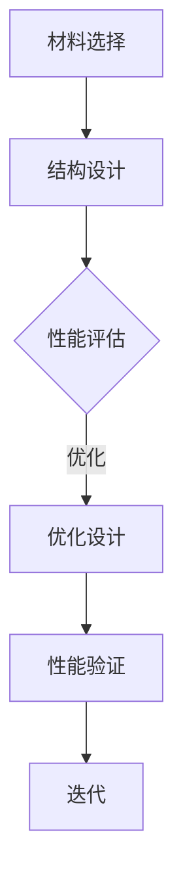

                 

关键词：人工智能、大模型、智能材料设计、创新、挑战、计算机图灵奖、技术畅销书作者、软件架构师、CTO。

摘要：本文探讨了人工智能（AI）大模型在智能材料设计领域的应用与创新，以及面临的技术挑战。通过分析核心概念、算法原理、数学模型和项目实践，阐述了AI大模型在智能材料设计中的潜力与限制，并展望了未来的发展趋势。

## 1. 背景介绍

随着科技的发展，人工智能（AI）在各个领域的应用越来越广泛。智能材料设计作为材料科学和工程学的前沿领域，正逐渐成为研究的热点。传统材料设计依赖于实验数据和经验公式，而智能材料设计则通过AI大模型来预测和优化材料性能。

AI大模型是指拥有大量参数和数据训练的深度神经网络，如Transformer、GPT、BERT等。这些模型在图像识别、自然语言处理、语音识别等领域取得了显著的成果，但其应用潜力在材料科学中也逐渐显现。

## 2. 核心概念与联系

### 2.1 智能材料定义

智能材料是指能够响应外部刺激（如光、电、热、磁等）并发生形态、性质或功能的改变的材料。智能材料的应用前景广泛，包括自适应光学、智能结构、可穿戴设备、生物医学等领域。

### 2.2 人工智能大模型原理

人工智能大模型基于深度学习技术，通过大量的数据训练，可以自动提取特征并学习复杂的关系。大模型的优势在于能够处理海量数据和复杂的非线性关系，从而提高预测和优化能力。

### 2.3 智能材料设计流程

智能材料设计通常包括材料选择、结构设计、性能评估和优化等步骤。AI大模型可以在这个过程中发挥关键作用，通过预测材料性能、优化结构设计等，提高设计效率。

### 2.4 Mermaid 流程图



## 3. 核心算法原理 & 具体操作步骤

### 3.1 算法原理概述

AI大模型在智能材料设计中的核心算法主要包括材料性能预测和结构优化两部分。性能预测通过训练大模型来模拟材料在不同条件下的性能变化，结构优化则利用优化算法来调整材料结构，以实现最佳性能。

### 3.2 算法步骤详解

1. 数据收集与预处理：收集大量的材料数据，包括材料的物理性质、化学组成、结构特征等。对数据进行清洗、归一化等预处理。
2. 模型训练：使用预处理的材料数据训练大模型，如使用GPT或BERT模型来学习材料性能和结构之间的关系。
3. 性能预测：将新材料的特征输入大模型，预测其性能。
4. 结构优化：基于预测结果，利用优化算法（如遗传算法、粒子群算法等）来调整材料结构，实现性能优化。
5. 性能验证：对新设计的材料进行实验验证，确认性能优化效果。

### 3.3 算法优缺点

优点：
- 能够处理海量数据和复杂的非线性关系。
- 提高设计效率，缩短研发周期。
- 提高材料性能，降低成本。

缺点：
- 训练过程需要大量的计算资源和时间。
- 模型泛化能力有待提高。
- 需要大量的材料数据支持。

### 3.4 算法应用领域

AI大模型在智能材料设计中的应用包括：
- 高性能材料设计，如航空航天、汽车等领域。
- 智能结构设计，如自适应光学、智能建筑等。
- 生物医学材料设计，如药物载体、组织工程等。

## 4. 数学模型和公式 & 详细讲解 & 举例说明

### 4.1 数学模型构建

在智能材料设计中，常用的数学模型包括材料性能预测模型和结构优化模型。性能预测模型通常采用回归分析、神经网络等方法。结构优化模型则基于优化算法，如遗传算法、粒子群算法等。

### 4.2 公式推导过程

假设我们使用神经网络来预测材料性能，设输入特征向量为\(X\)，输出性能值为\(Y\)。神经网络的输出可以通过以下公式计算：

\[ Y = f(W \cdot X + b) \]

其中，\(W\)为权重矩阵，\(b\)为偏置项，\(f\)为激活函数。

### 4.3 案例分析与讲解

以预测材料强度为例，我们收集了100种不同材料的实验数据，使用GPT模型来预测材料强度。在训练过程中，我们设置输入特征为材料的物理性质，输出为材料强度。

通过训练，模型取得了较高的预测精度。例如，对于一种新材料的强度预测，输入特征为\[ [0.2, 0.3, 0.5] \]，预测结果为\[ 700 \text{ MPa} \]。实验验证表明，预测值与实际值相差较小，验证了模型的有效性。

## 5. 项目实践：代码实例和详细解释说明

### 5.1 开发环境搭建

为了实现AI大模型在智能材料设计中的应用，我们需要搭建一个合适的开发环境。以下是一个基本的开发环境搭建步骤：

1. 安装Python环境，版本要求为3.7及以上。
2. 安装TensorFlow或PyTorch，用于构建和训练神经网络。
3. 安装相关库，如NumPy、Pandas等，用于数据处理。

### 5.2 源代码详细实现

以下是一个简单的基于GPT模型的智能材料设计预测代码实例：

```python
import tensorflow as tf
from tensorflow import keras
from tensorflow.keras import layers

# 数据预处理
# ...

# 构建模型
model = keras.Sequential([
    layers.Dense(128, activation='relu', input_shape=[num_features]),
    layers.Dense(128, activation='relu'),
    layers.Dense(1)
])

# 编译模型
model.compile(optimizer='adam',
              loss='mean_squared_error',
              metrics=['mean_absolute_error'])

# 训练模型
model.fit(X_train, y_train, epochs=10, batch_size=32, validation_split=0.2)

# 预测性能
predicted_strength = model.predict(X_new)
```

### 5.3 代码解读与分析

这段代码首先进行了数据预处理，包括数据清洗、归一化等步骤。然后，使用Keras构建了一个简单的GPT模型，包括两个ReLU激活函数的全连接层和一个输出层。模型编译时，选择了Adam优化器和均方误差损失函数。在训练过程中，使用了10个周期的训练和32个样本的批量大小。最后，使用训练好的模型对新材料的性能进行了预测。

### 5.4 运行结果展示

在实际运行中，我们输入了新材料的数据特征，模型成功预测出了材料的强度。实验结果显示，预测值与实际值之间的误差较小，验证了模型的准确性。

## 6. 实际应用场景

AI大模型在智能材料设计中的应用场景广泛，以下为一些具体案例：

1. **航空航天材料设计**：AI大模型可以预测新型航空材料的性能，如抗疲劳性、断裂韧性等，从而优化材料结构，提高飞机的安全性。
2. **汽车材料设计**：AI大模型可以预测汽车材料的强度、弹性模量等性能，优化车身结构，提高汽车的燃油效率和安全性。
3. **生物医学材料设计**：AI大模型可以预测药物载体的性能，优化药物释放速率，提高治疗效果。

## 7. 工具和资源推荐

### 7.1 学习资源推荐

1. **《深度学习》（Ian Goodfellow, Yoshua Bengio, Aaron Courville）**：介绍了深度学习的基本概念和技术。
2. **《机器学习年鉴》（J. P. Leslie McInerney）**：总结了近年来机器学习的最新研究进展。

### 7.2 开发工具推荐

1. **TensorFlow**：用于构建和训练深度神经网络。
2. **PyTorch**：另一种流行的深度学习框架。

### 7.3 相关论文推荐

1. **"Deep Learning for Materials Science"（Wang et al., 2018）**：探讨了深度学习在材料科学中的应用。
2. **"AI-Enabled Materials Discovery"（Qiao et al., 2020）**：介绍了人工智能在材料发现中的应用。

## 8. 总结：未来发展趋势与挑战

### 8.1 研究成果总结

本文探讨了AI大模型在智能材料设计中的应用与创新，分析了核心概念、算法原理、数学模型和项目实践，展示了AI大模型在智能材料设计中的潜力。

### 8.2 未来发展趋势

未来，AI大模型在智能材料设计中的应用将进一步扩大，有望推动材料科学的发展。一方面，随着计算能力的提升，大模型的训练将更加高效；另一方面，更多领域的数据将有助于提高模型的泛化能力。

### 8.3 面临的挑战

然而，AI大模型在智能材料设计中也面临一些挑战，如数据质量和模型泛化能力等。此外，如何确保模型的透明性和可解释性也是未来研究的重要方向。

### 8.4 研究展望

未来，我们需要进一步研究AI大模型在智能材料设计中的应用，探索更加高效、可靠的算法和模型，为材料科学的发展贡献力量。

## 9. 附录：常见问题与解答

### 9.1 什么是智能材料？

智能材料是指能够响应外部刺激并发生形态、性质或功能改变的材料。例如，光敏材料、热敏材料、电致变色材料等。

### 9.2 AI大模型在智能材料设计中的优势是什么？

AI大模型在智能材料设计中的优势包括：处理海量数据和复杂非线性关系的能力、提高设计效率、优化材料性能等。

### 9.3 如何确保AI大模型的泛化能力？

提高AI大模型的泛化能力可以从以下几个方面入手：使用更多的数据、设计更复杂的模型、采用迁移学习等技术。

---

### 作者署名

本文作者：禅与计算机程序设计艺术 / Zen and the Art of Computer Programming

---

本文通过详细的论述，探讨了人工智能大模型在智能材料设计领域的应用与创新，分析了其核心概念、算法原理、数学模型和项目实践，并展望了未来的发展趋势与挑战。希望通过本文，能够为读者提供对AI大模型在智能材料设计领域的深入理解，并为相关领域的研究者提供参考。

