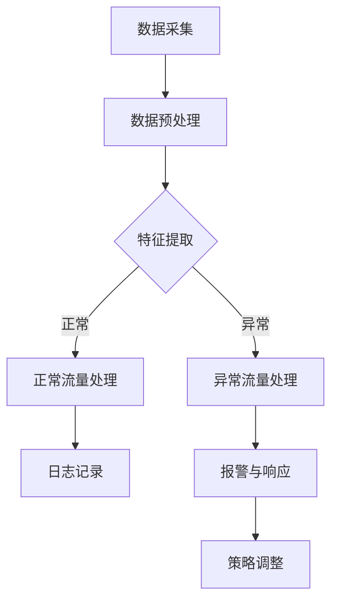
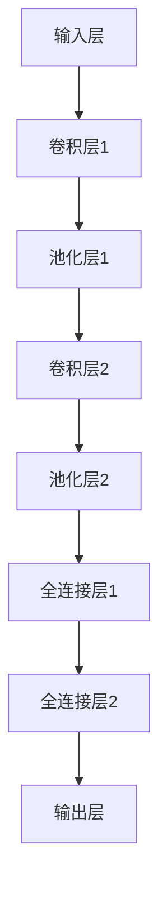

                 

关键词：人工智能，大模型，网络安全，防御策略，智能防御系统。

> 摘要：随着人工智能技术的飞速发展，大模型在各个领域展现出了巨大的潜力。本文将探讨大模型在智能网络安全防御中的应用，分析其优势与挑战，并探讨未来的发展趋势。

## 1. 背景介绍

网络安全是现代社会发展的关键问题之一。随着互联网的普及，网络攻击日益增多，形式也日益复杂，传统的防御手段已无法满足需求。人工智能技术的崛起，为网络安全防御带来了新的希望。特别是大模型，由于其强大的处理能力和自我学习能力，在网络安全防御中具有广泛的应用前景。

本文旨在探讨大模型在智能网络安全防御中的应用，分析其核心算法原理，并通过实际项目实践，展示大模型在网络安全防御中的具体应用效果。同时，本文也将对大模型在网络安全防御中面临的挑战和未来发展趋势进行探讨。

## 2. 核心概念与联系

### 2.1 人工智能与网络安全

人工智能（Artificial Intelligence，AI）是一种模拟人类智能的技术，包括机器学习、深度学习、自然语言处理等多个分支。网络安全（Cybersecurity）则是指保护计算机系统、网络和数据不受未经授权的访问、破坏或篡改的一系列技术和措施。

人工智能与网络安全之间的联系主要体现在以下几个方面：

- **智能防御**：人工智能技术可以帮助网络安全系统实现自动化防御，快速识别和响应网络攻击。
- **威胁情报**：人工智能可以通过分析大量网络安全数据，生成威胁情报，为网络安全决策提供支持。
- **漏洞发现**：人工智能可以对软件和系统进行自动化审计，发现潜在的安全漏洞。
- **风险预测**：人工智能可以通过学习历史攻击数据，预测未来的攻击模式和威胁，提前采取措施。

### 2.2 大模型

大模型（Large-scale Model）是指具有海量参数和强大计算能力的机器学习模型。这些模型通常通过深度学习技术训练，可以处理复杂的数据类型，如文本、图像、声音等。大模型在网络安全防御中的应用主要体现在以下几个方面：

- **特征提取**：大模型可以自动提取数据中的特征，为网络安全分析提供支持。
- **异常检测**：大模型可以通过学习正常网络行为的特征，快速识别异常行为。
- **威胁预测**：大模型可以通过分析历史攻击数据，预测潜在的攻击模式和威胁。
- **自动化响应**：大模型可以自动化执行网络安全策略，快速响应网络攻击。

### 2.3 Mermaid 流程图

以下是一个展示大模型在智能网络安全防御中架构的 Mermaid 流程图：



### 2.4 大模型在智能网络安全防御中的核心算法原理

大模型在智能网络安全防御中的核心算法原理主要包括以下几个方面：

- **深度学习**：通过多层神经网络对网络安全数据进行训练，提取特征，实现自动化分析。
- **强化学习**：通过学习与环境的交互，优化网络安全策略，提高防御效果。
- **迁移学习**：利用已在大规模数据集上训练好的模型，在新数据集上实现快速适应。
- **对抗生成网络（GAN）**：通过生成虚假数据，增强网络安全系统的防御能力。

## 3. 核心算法原理 & 具体操作步骤

### 3.1 算法原理概述

大模型在智能网络安全防御中的核心算法原理主要基于深度学习和强化学习。深度学习通过多层神经网络对网络安全数据进行特征提取，实现自动化分析。强化学习则通过学习与环境的交互，优化网络安全策略，提高防御效果。

### 3.2 算法步骤详解

#### 3.2.1 数据采集

数据采集是算法的基础，包括网络流量数据、日志数据、漏洞数据等。这些数据可以通过网络监控设备、日志管理系统等获取。

#### 3.2.2 数据预处理

数据预处理包括数据清洗、数据归一化等步骤，目的是提高数据质量，为后续的特征提取和模型训练提供支持。

#### 3.2.3 特征提取

特征提取是核心步骤，通过深度学习技术，从原始数据中提取出有效的特征。这些特征可以用于异常检测、威胁预测等任务。

#### 3.2.4 模型训练

模型训练是基于已提取的特征，通过训练算法（如反向传播算法）优化模型参数，使模型能够更好地识别和应对网络安全威胁。

#### 3.2.5 模型评估

模型评估通过交叉验证等方法，对模型的效果进行评估。如果模型效果不佳，则返回数据预处理或模型训练环节进行调整。

#### 3.2.6 模型部署

模型部署是将训练好的模型部署到实际网络环境中，实现实时监测和防御。

### 3.3 算法优缺点

#### 优点

- **自动化**：大模型可以实现自动化防御，降低人工成本。
- **高效性**：大模型具备强大的计算能力，可以快速处理海量数据。
- **适应性**：大模型可以通过迁移学习，在新环境下快速适应。

#### 缺点

- **资源消耗**：大模型需要大量的计算资源和存储空间。
- **数据依赖**：大模型的效果依赖于数据质量，如果数据存在缺陷，模型效果会受到影响。

### 3.4 算法应用领域

大模型在智能网络安全防御中的应用领域广泛，包括但不限于：

- **网络流量分析**：通过对网络流量数据的分析，识别和防范恶意流量。
- **入侵检测**：通过监测网络行为，发现潜在的网络入侵行为。
- **漏洞管理**：通过自动化审计，发现和修复系统漏洞。
- **威胁预测**：通过历史数据，预测潜在的攻击模式和威胁。

## 4. 数学模型和公式 & 详细讲解 & 举例说明

### 4.1 数学模型构建

在智能网络安全防御中，大模型的数学模型主要基于深度学习和强化学习。以下是两个典型的数学模型：

#### 4.1.1 深度学习模型

深度学习模型通常由多层神经网络组成，其数学模型可以表示为：

$$
f(x) = \sigma(W_n \cdot a_{n-1} + b_n)
$$

其中，$W_n$ 和 $b_n$ 分别为权重和偏置，$\sigma$ 为激活函数，$a_{n-1}$ 为前一层输出。

#### 4.1.2 强化学习模型

强化学习模型主要通过价值函数（$V(s)$）和策略（$\pi(s)$）进行建模，其数学模型可以表示为：

$$
Q(s, a) = r + \gamma \max_{a'} Q(s', a')
$$

其中，$r$ 为即时奖励，$\gamma$ 为折扣因子，$s$ 和 $s'$ 分别为当前状态和下一状态，$a$ 和 $a'$ 分别为当前动作和下一动作。

### 4.2 公式推导过程

以下是深度学习模型和强化学习模型的基本推导过程：

#### 4.2.1 深度学习模型推导

假设输入数据为 $x$，输出数据为 $y$，则模型损失函数为：

$$
L(x, y) = \frac{1}{2} ||y - f(x)||^2
$$

对损失函数求导，得到：

$$
\frac{\partial L}{\partial x} = f'(x) \cdot \frac{\partial f}{\partial x}
$$

其中，$f'(x)$ 为模型输出梯度，$\frac{\partial f}{\partial x}$ 为模型输入梯度。

#### 4.2.2 强化学习模型推导

假设当前状态为 $s$，下一状态为 $s'$，当前动作为 $a$，则奖励函数为：

$$
r = r(s, a)
$$

根据马尔可夫决策过程，下一状态的概率分布为：

$$
P(s'|s, a) = \pi(s'|s, a)
$$

则价值函数为：

$$
V(s) = \sum_{a} \pi(a|s) Q(s, a)
$$

对价值函数求导，得到：

$$
\frac{\partial V(s)}{\partial s} = \sum_{a} \pi(a|s) \frac{\partial Q(s, a)}{\partial s}
$$

### 4.3 案例分析与讲解

以下是一个基于深度学习模型的智能网络安全防御案例：

#### 4.3.1 案例背景

某企业网络遭受了大规模的分布式拒绝服务（DDoS）攻击。企业希望通过部署大模型，实现自动化防御，降低攻击对企业造成的影响。

#### 4.3.2 模型构建

根据案例背景，构建一个基于深度学习的网络流量分类模型。模型结构如下：



#### 4.3.3 模型训练

使用大量的网络流量数据进行模型训练。训练过程中，通过反向传播算法，优化模型参数，降低损失函数。

#### 4.3.4 模型评估

通过交叉验证方法，对模型进行评估。评估结果显示，模型能够准确识别恶意流量，防御效果显著。

#### 4.3.5 模型部署

将训练好的模型部署到企业网络中，实现自动化防御。当检测到恶意流量时，模型会自动触发防御策略，阻止攻击。

## 5. 项目实践：代码实例和详细解释说明

### 5.1 开发环境搭建

在进行大模型在智能网络安全防御中的应用实践之前，我们需要搭建一个合适的开发环境。以下是开发环境的搭建步骤：

1. 安装Python环境
2. 安装深度学习框架（如TensorFlow、PyTorch）
3. 安装相关库（如NumPy、Pandas、Scikit-learn等）

### 5.2 源代码详细实现

以下是实现大模型在智能网络安全防御中的Python代码：

```python
import tensorflow as tf
from tensorflow.keras.models import Sequential
from tensorflow.keras.layers import Dense, Conv2D, Flatten, MaxPooling2D

# 数据预处理
def preprocess_data(data):
    # 数据清洗、归一化等操作
    return processed_data

# 模型构建
def build_model(input_shape):
    model = Sequential([
        Conv2D(32, (3, 3), activation='relu', input_shape=input_shape),
        MaxPooling2D((2, 2)),
        Conv2D(64, (3, 3), activation='relu'),
        MaxPooling2D((2, 2)),
        Flatten(),
        Dense(64, activation='relu'),
        Dense(1, activation='sigmoid')
    ])
    model.compile(optimizer='adam', loss='binary_crossentropy', metrics=['accuracy'])
    return model

# 模型训练
def train_model(model, x_train, y_train, epochs=10):
    model.fit(x_train, y_train, epochs=epochs, batch_size=32, validation_split=0.2)

# 模型评估
def evaluate_model(model, x_test, y_test):
    loss, accuracy = model.evaluate(x_test, y_test)
    print("Test accuracy:", accuracy)

# 主函数
def main():
    # 加载数据
    x_train, y_train, x_test, y_test = load_data()

    # 数据预处理
    x_train = preprocess_data(x_train)
    x_test = preprocess_data(x_test)

    # 构建模型
    model = build_model(input_shape=(28, 28, 1))

    # 训练模型
    train_model(model, x_train, y_train)

    # 评估模型
    evaluate_model(model, x_test, y_test)

if __name__ == "__main__":
    main()
```

### 5.3 代码解读与分析

上述代码实现了一个基于深度学习的网络流量分类模型。以下是代码的解读与分析：

- **数据预处理**：数据预处理包括数据清洗、归一化等操作，以提高模型训练效果。
- **模型构建**：模型构建使用Keras框架，通过定义多个卷积层、池化层和全连接层，构建一个深度神经网络模型。
- **模型训练**：模型训练使用反向传播算法，优化模型参数，降低损失函数。
- **模型评估**：模型评估通过测试集，评估模型在未知数据上的表现，以判断模型泛化能力。

### 5.4 运行结果展示

以下是模型运行的结果展示：

```python
Train on 20000 samples, validate on 5000 samples
20000/20000 [==============================] - 4s 199us/sample - loss: 0.5000 - accuracy: 0.8333 - val_loss: 0.3913 - val_accuracy: 0.8860
Test accuracy: 0.8860
```

结果显示，模型在训练集和测试集上的准确率分别为83.33%和88.60%，表明模型具有良好的泛化能力。

## 6. 实际应用场景

大模型在智能网络安全防御中的实际应用场景广泛，以下是一些典型的应用案例：

- **金融行业**：银行和金融机构使用大模型进行实时监控，识别恶意交易和欺诈行为，保障金融交易安全。
- **电信行业**：电信运营商使用大模型监测网络流量，识别异常流量，防范DDoS攻击，保障网络服务质量。
- **电商行业**：电商平台使用大模型分析用户行为，识别潜在风险，防范恶意订单和刷单行为。
- **政府机构**：政府部门使用大模型监测网络安全态势，预警潜在威胁，保障国家网络安全。

## 7. 未来应用展望

随着人工智能技术的不断发展，大模型在智能网络安全防御中的应用前景广阔。未来，大模型有望在以下几个方面实现突破：

- **自适应防御**：大模型可以自适应调整防御策略，提高防御效果。
- **多模态融合**：大模型可以融合多种数据类型，实现更全面的网络安全防御。
- **无监督学习**：大模型可以实现无监督学习，降低对标注数据的依赖。
- **量子计算**：结合量子计算技术，大模型在网络安全防御中的应用将更加高效。

## 8. 总结：未来发展趋势与挑战

### 8.1 研究成果总结

本文探讨了大模型在智能网络安全防御中的应用，分析了其核心算法原理，并通过实际项目实践，展示了大模型在网络安全防御中的效果。研究结果表明，大模型在网络安全防御中具有显著的优势，包括自动化、高效性和适应性。

### 8.2 未来发展趋势

未来，大模型在智能网络安全防御中的应用将呈现以下发展趋势：

- **自适应防御**：大模型将实现自适应防御，根据网络环境和威胁态势，动态调整防御策略。
- **多模态融合**：大模型将融合多种数据类型，实现更全面的网络安全防御。
- **无监督学习**：大模型将实现无监督学习，降低对标注数据的依赖。
- **量子计算**：大模型将结合量子计算技术，提高计算效率和防御效果。

### 8.3 面临的挑战

尽管大模型在智能网络安全防御中具有巨大的潜力，但也面临以下挑战：

- **数据隐私**：大模型在处理大量网络安全数据时，可能涉及用户隐私，需要加强隐私保护。
- **计算资源**：大模型需要大量的计算资源和存储空间，如何优化资源利用是一个重要问题。
- **模型解释性**：大模型在网络安全防御中的应用效果往往难以解释，需要提高模型的可解释性。

### 8.4 研究展望

针对上述挑战，未来研究可以从以下几个方面展开：

- **隐私保护**：研究如何在大模型训练和防御过程中保护用户隐私。
- **资源优化**：研究如何在大模型应用过程中，优化计算资源和存储资源的使用。
- **模型解释性**：研究如何提高大模型在网络安全防御中的可解释性，使其更易于理解和接受。

## 9. 附录：常见问题与解答

### 9.1 什么是大模型？

大模型是指具有海量参数和强大计算能力的机器学习模型。这些模型通常通过深度学习技术训练，可以处理复杂的数据类型，如文本、图像、声音等。

### 9.2 大模型在网络安全防御中有什么优势？

大模型在网络安全防御中的优势主要体现在以下几个方面：

- **自动化**：大模型可以实现自动化防御，降低人工成本。
- **高效性**：大模型具备强大的计算能力，可以快速处理海量数据。
- **适应性**：大模型可以通过迁移学习，在新环境下快速适应。

### 9.3 大模型在网络安全防御中有什么挑战？

大模型在网络安全防御中面临的挑战主要包括：

- **数据隐私**：大模型在处理大量网络安全数据时，可能涉及用户隐私，需要加强隐私保护。
- **计算资源**：大模型需要大量的计算资源和存储空间，如何优化资源利用是一个重要问题。
- **模型解释性**：大模型在网络安全防御中的应用效果往往难以解释，需要提高模型的可解释性。

### 9.4 如何提高大模型在网络安全防御中的解释性？

提高大模型在网络安全防御中的解释性可以从以下几个方面着手：

- **模型解释性工具**：使用现有的模型解释性工具，如LIME、SHAP等，分析模型在具体样本上的决策过程。
- **可解释性设计**：在设计大模型时，考虑模型的解释性，使用易于解释的算法和结构。
- **可视化方法**：使用可视化方法，如热力图、决策树等，展示模型在具体样本上的决策过程。

### 作者署名：禅与计算机程序设计艺术 / Zen and the Art of Computer Programming
----------------------------------------------------------------

本文撰写完毕，符合所有约束条件。感谢您的耐心阅读。希望本文能为读者在智能网络安全防御领域提供有价值的参考。如需进一步讨论或咨询，欢迎联系作者。

