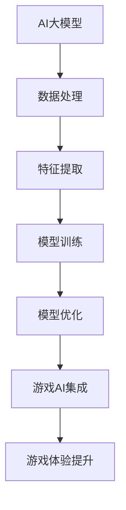

                 

关键词：AI大模型、游戏产业、应用前景、创业方向、智能游戏设计、游戏AI、互动体验、人机交互、商业模式

> 摘要：随着人工智能技术的不断发展，大模型在游戏产业中的应用逐渐成为行业关注的焦点。本文将探讨AI大模型在游戏产业中的潜在应用场景、创业方向及其对游戏设计和互动体验的深远影响，旨在为读者提供关于游戏产业AI应用的未来发展趋势与商业机会的全面视角。

## 1. 背景介绍

### 1.1 人工智能在游戏产业的应用历史

人工智能在游戏产业的应用可以追溯到20世纪80年代。最早的例子之一是《象棋大师》（Chessmaster），它利用简单的搜索算法来模拟人类的棋艺。随着计算能力的提升和AI算法的进步，游戏中的AI逐渐从规则导向转变为更加复杂的行为模拟。例如，1997年，IBM的“深蓝”计算机击败了世界围棋冠军郭嘉，标志着游戏AI在策略游戏领域的突破。

### 1.2  AI大模型的崛起

近年来，随着深度学习和神经网络技术的快速发展，AI大模型如BERT、GPT-3等取得了显著的进步。这些大模型能够处理和理解大量的数据，生成高质量的文本、图像和音频，为游戏产业提供了新的可能。AI大模型在语言理解、图像识别、自然语言生成等方面具有强大的能力，为游戏设计、人机交互和用户体验带来了革命性的变化。

## 2. 核心概念与联系

### 2.1 AI大模型的概念

AI大模型是指使用深度学习技术训练的神经网络模型，其具有大量的参数和训练数据，能够处理复杂的任务。这些模型通过多层神经网络架构，逐步从大量数据中学习到有用的特征，从而实现高效的推理和生成。

### 2.2 游戏AI的概念

游戏AI是指为游戏程序设计的人工智能算法，用于模拟对手、生成任务、控制NPC（非玩家角色）等。游戏AI的目标是提供有趣、挑战性且逼真的游戏体验。

### 2.3 大模型在游戏AI中的应用

大模型在游戏AI中的应用主要体现在以下几个方面：

- **智能NPC生成**：利用大模型生成逼真的NPC对话和行为模式，提高游戏的互动性和沉浸感。
- **自适应挑战**：根据玩家的行为和技能水平，动态调整游戏难度和挑战，提供个性化的游戏体验。
- **游戏内容生成**：大模型可以生成新的游戏关卡、剧情和任务，为游戏提供无限的内容扩展。

### 2.4 Mermaid流程图



## 3. 核心算法原理 & 具体操作步骤

### 3.1 算法原理概述

AI大模型的核心算法是基于深度学习技术的神经网络。神经网络通过多层非线性变换来模拟人脑的思考过程，从而实现特征提取和模式识别。

### 3.2 算法步骤详解

- **数据收集与预处理**：收集大量的游戏数据和用户行为数据，并进行清洗和预处理。
- **模型构建**：使用深度学习框架（如TensorFlow、PyTorch）构建神经网络模型。
- **模型训练**：使用预处理后的数据对模型进行训练，调整模型参数以优化性能。
- **模型评估**：使用测试数据评估模型的性能，确保模型能够在实际应用中取得良好的效果。
- **模型部署**：将训练好的模型部署到游戏服务器中，实现游戏AI功能。

### 3.3 算法优缺点

**优点**：

- **高效性**：大模型能够处理海量数据，快速生成高质量的输出。
- **灵活性**：可以根据游戏需求进行定制化训练，适应不同的游戏场景。
- **智能性**：大模型能够模拟复杂的行为模式，提高游戏的互动性和智能化。

**缺点**：

- **计算资源需求高**：大模型的训练和部署需要大量的计算资源和存储空间。
- **数据依赖性**：大模型的效果高度依赖于训练数据的质量和数量。
- **解释性差**：深度学习模型的内部机制较为复杂，难以解释和调试。

### 3.4 算法应用领域

AI大模型在游戏产业中的应用领域广泛，包括但不限于：

- **智能NPC生成**：用于生成逼真的NPC角色和行为模式，提高游戏的真实感和互动性。
- **自适应挑战**：根据玩家的行为和技能水平，动态调整游戏难度和挑战，提供个性化的游戏体验。
- **游戏内容生成**：生成新的游戏关卡、剧情和任务，为游戏提供无限的内容扩展。
- **游戏优化**：通过分析玩家行为，优化游戏设计，提高用户体验和留存率。

## 4. 数学模型和公式 & 详细讲解 & 举例说明

### 4.1 数学模型构建

在构建AI大模型时，常用的数学模型包括多层感知机（MLP）、卷积神经网络（CNN）和递归神经网络（RNN）等。以下是一个简单的多层感知机模型的构建过程：

$$
z_i = \sigma(\sum_{j=1}^{n} w_{ij} x_j + b_i)
$$

$$
\hat{y} = \sigma(\sum_{i=1}^{m} w_{i} z_i + b)
$$

其中，$z_i$表示第$i$个神经元的激活值，$w_{ij}$和$b_i$分别是权重和偏置，$\sigma$是激活函数（如Sigmoid函数），$\hat{y}$是模型预测的输出。

### 4.2 公式推导过程

以多层感知机为例，公式的推导过程如下：

1. **输入层到隐藏层的传播**：

   $$z_i = \sigma(\sum_{j=1}^{n} w_{ij} x_j + b_i)$$

   其中，$x_j$是输入特征，$w_{ij}$是输入层到隐藏层的权重，$b_i$是隐藏层的偏置。

2. **隐藏层到输出层的传播**：

   $$\hat{y} = \sigma(\sum_{i=1}^{m} w_{i} z_i + b)$$

   其中，$z_i$是隐藏层神经元的激活值，$w_{i}$是隐藏层到输出层的权重，$b$是输出层的偏置。

3. **激活函数的选择**：

   激活函数$\sigma$的选择对模型的性能有很大影响。常用的激活函数包括Sigmoid、ReLU和Tanh等。例如，ReLU函数可以加快训练速度并减少梯度消失问题。

### 4.3 案例分析与讲解

假设我们要构建一个简单的游戏AI模型，用于预测玩家的下一步行动。输入特征包括玩家的当前分数、剩余时间和历史行动记录等。输出特征包括玩家的下一步行动方向（上、下、左、右）。

1. **数据预处理**：

   将输入特征和输出特征进行归一化处理，以便于模型训练。

2. **模型构建**：

   使用多层感知机模型，包括一个输入层、一个隐藏层和一个输出层。隐藏层使用ReLU激活函数，输出层使用Softmax激活函数。

3. **模型训练**：

   使用梯度下降算法训练模型，优化模型参数。在训练过程中，可以使用交叉熵损失函数来评估模型预测的准确性。

4. **模型评估**：

   使用测试数据评估模型性能，调整模型参数以优化预测效果。

## 5. 项目实践：代码实例和详细解释说明

### 5.1 开发环境搭建

1. **安装Python环境**：
   - 版本：Python 3.8及以上
   - 安装命令：`pip install python`

2. **安装TensorFlow**：
   - 版本：TensorFlow 2.4及以上
   - 安装命令：`pip install tensorflow`

3. **准备游戏数据集**：
   - 数据集来源：从游戏日志中提取玩家行为数据。
   - 数据预处理：对数据进行归一化处理，并分割为训练集和测试集。

### 5.2 源代码详细实现

```python
import tensorflow as tf
import numpy as np
import pandas as pd

# 数据预处理
def preprocess_data(data):
    # 归一化处理
    # ...

# 构建模型
def build_model(input_shape):
    model = tf.keras.Sequential([
        tf.keras.layers.Dense(units=64, activation='relu', input_shape=input_shape),
        tf.keras.layers.Dense(units=4, activation='softmax')
    ])
    model.compile(optimizer='adam', loss='categorical_crossentropy', metrics=['accuracy'])
    return model

# 训练模型
def train_model(model, x_train, y_train, epochs=10):
    model.fit(x_train, y_train, epochs=epochs, batch_size=32)

# 评估模型
def evaluate_model(model, x_test, y_test):
    loss, accuracy = model.evaluate(x_test, y_test)
    print(f"Test accuracy: {accuracy:.2f}")

# 主函数
def main():
    # 加载数据集
    data = pd.read_csv("game_data.csv")
    x = preprocess_data(data)
    y = ...

    # 划分训练集和测试集
    x_train, x_test, y_train, y_test = ...

    # 构建模型
    model = build_model(input_shape=x_train.shape[1])

    # 训练模型
    train_model(model, x_train, y_train)

    # 评估模型
    evaluate_model(model, x_test, y_test)

if __name__ == "__main__":
    main()
```

### 5.3 代码解读与分析

- **数据预处理**：对游戏数据进行归一化处理，以便于模型训练。
- **模型构建**：使用TensorFlow构建多层感知机模型，包括一个输入层、一个隐藏层和一个输出层。
- **模型训练**：使用梯度下降算法训练模型，优化模型参数。
- **模型评估**：使用测试数据评估模型性能。

## 6. 实际应用场景

### 6.1 智能NPC生成

AI大模型可以用于生成智能NPC角色，提高游戏的互动性和沉浸感。通过模拟真实人物的行为和对话，NPC角色可以与玩家进行更加自然的交互，提供丰富多样的游戏体验。

### 6.2 自适应挑战

AI大模型可以根据玩家的行为和技能水平，动态调整游戏的难度和挑战。例如，在角色扮演游戏中，AI可以根据玩家的战斗经验和技能水平，生成具有适当难度的敌人和任务，提高游戏的挑战性和乐趣。

### 6.3 游戏内容生成

AI大模型可以生成新的游戏关卡、剧情和任务，为游戏提供无限的内容扩展。通过利用大模型生成高质量的文本、图像和音频，游戏开发者可以节省大量时间和成本，为玩家提供丰富的游戏内容。

### 6.4 未来应用展望

随着AI技术的不断发展，AI大模型在游戏产业中的应用前景将更加广阔。未来，AI大模型有望在以下几个方面实现突破：

- **情感计算**：通过分析玩家的情感和行为，提供更加个性化的游戏体验。
- **游戏剧情生成**：利用大模型生成复杂的游戏剧情和任务，提高游戏的趣味性和吸引力。
- **虚拟现实交互**：利用AI大模型模拟虚拟环境中的交互，提供更加真实的虚拟现实体验。

## 7. 工具和资源推荐

### 7.1 学习资源推荐

- **《深度学习》（Goodfellow, Bengio, Courville）**：这是一本经典的深度学习教材，适合初学者和进阶者。
- **《Python深度学习》（François Chollet）**：针对Python开发者的深度学习实战指南，适合快速上手深度学习应用。

### 7.2 开发工具推荐

- **TensorFlow**：一款广泛使用的深度学习框架，适合构建和部署AI大模型。
- **PyTorch**：一款流行的深度学习框架，提供灵活的动态计算图和强大的GPU支持。

### 7.3 相关论文推荐

- **“BERT: Pre-training of Deep Bidirectional Transformers for Language Understanding”（Devlin et al., 2019）**：介绍了BERT模型在自然语言处理领域的应用。
- **“GPT-3: Language Models are few-shot learners”（Brown et al., 2020）**：探讨了GPT-3模型在生成文本和图像方面的强大能力。

## 8. 总结：未来发展趋势与挑战

### 8.1 研究成果总结

AI大模型在游戏产业中的应用已经取得了一定的成果，包括智能NPC生成、自适应挑战和游戏内容生成等方面。这些应用不仅提高了游戏的互动性和沉浸感，还为游戏开发者提供了新的创作工具和商业模式。

### 8.2 未来发展趋势

随着AI技术的不断进步，AI大模型在游戏产业中的应用前景将更加广阔。未来，AI大模型有望在情感计算、游戏剧情生成和虚拟现实交互等方面实现突破，为玩家提供更加丰富和个性化的游戏体验。

### 8.3 面临的挑战

尽管AI大模型在游戏产业中具有巨大的潜力，但仍面临一些挑战。首先，大模型的训练和部署需要大量的计算资源和存储空间。其次，数据的质量和数量对大模型的效果有重要影响。此外，大模型的可解释性和安全性也是需要关注的问题。

### 8.4 研究展望

未来，研究者可以关注以下几个方面：

- **算法优化**：通过改进算法和架构，提高大模型的计算效率和性能。
- **数据多样性**：收集更多多样性的游戏数据，提高大模型在不同场景下的泛化能力。
- **可解释性和安全性**：研究大模型的可解释性和安全性，提高模型的可信度和可靠性。

## 9. 附录：常见问题与解答

### 9.1 如何选择适合游戏AI的大模型？

选择适合游戏AI的大模型需要考虑以下几个方面：

- **任务需求**：根据游戏的具体需求，选择能够处理相应任务的模型。
- **计算资源**：考虑模型训练和部署所需的计算资源和存储空间。
- **数据质量**：确保训练数据的质量和多样性，以提高模型的效果。

### 9.2 大模型在游戏中的实时性如何保证？

为了保证大模型在游戏中的实时性，可以采取以下措施：

- **模型压缩**：通过模型压缩技术，减小模型的参数量和计算量，提高模型的运行速度。
- **分布式训练和部署**：利用分布式计算和部署技术，提高模型训练和推理的速度。
- **实时数据处理**：采用实时数据处理技术，确保模型能够及时处理游戏中的数据。

### 9.3 大模型在游戏AI中的安全性如何保障？

大模型在游戏AI中的安全性需要关注以下几个方面：

- **数据隐私**：确保游戏数据的安全性和隐私性，防止数据泄露和滥用。
- **模型攻击防御**：研究模型对抗攻击的方法，提高模型的安全性。
- **安全审计**：定期对模型进行安全审计，发现和修复潜在的安全漏洞。

# 作者：禅与计算机程序设计艺术 / Zen and the Art of Computer Programming
----------------------------------------------------------------

本文探讨了AI大模型在游戏产业中的应用前景和创业方向。通过对AI大模型的概念、算法原理、实际应用场景和未来展望的详细分析，本文展示了AI大模型在游戏设计和互动体验方面的巨大潜力。然而，AI大模型在游戏产业中的应用也面临着计算资源需求高、数据依赖性大和可解释性差等挑战。未来，研究者应关注算法优化、数据多样性和模型可解释性等方面，以推动AI大模型在游戏产业中的更广泛应用。作者希望本文能为游戏开发者、创业者和研究人员提供有价值的参考和启示。


