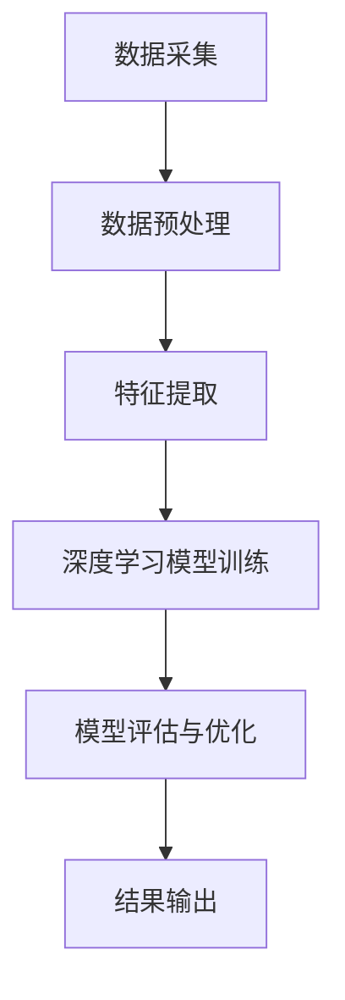

                 

在当今全球环境问题日益严峻的背景下，人工智能（AI）技术的迅猛发展为我们提供了一种全新的解决途径。AI大模型作为一种先进的人工智能技术，正在环境监测领域发挥出其独特的优势。本文将探讨AI大模型在环境监测中的应用，分析其核心概念、算法原理、数学模型以及实际案例，并展望其未来的发展方向。

## 关键词

- AI大模型
- 环境监测
- 深度学习
- 数学模型
- 实时数据分析

## 摘要

本文首先介绍了AI大模型在环境监测领域的重要性，随后详细探讨了其核心概念、算法原理、数学模型和实际应用。通过具体案例的分析，我们展示了AI大模型在环境监测中的实际效果。最后，本文对AI大模型在环境监测领域的未来发展方向进行了展望。

## 1. 背景介绍

环境监测是保障生态系统健康和人类生活环境质量的重要手段。然而，传统的环境监测手段往往存在采样点少、时效性差、数据处理复杂等问题。随着传感器技术、通信技术和大数据技术的不断发展，环境监测手段逐渐向智能化、自动化方向转型。

AI大模型作为深度学习领域的一个重要分支，以其强大的数据挖掘和分析能力，在图像识别、自然语言处理、预测分析等方面取得了显著的成果。将AI大模型应用于环境监测，可以大幅提升监测的准确性和时效性，为环境管理决策提供科学依据。

## 2. 核心概念与联系

### 2.1 深度学习与AI大模型

深度学习是一种基于人工神经网络的研究方法，通过多层次的神经网络模型来提取数据特征。AI大模型则是深度学习的进一步发展，具有更高的参数规模和更复杂的网络结构，能够处理大规模、多维度的数据。

### 2.2 环境监测与数据来源

环境监测的数据来源广泛，包括空气、水质、土壤等多个方面。这些数据可以通过传感器、卫星遥感、现场监测等方式获取。AI大模型可以通过对海量数据的分析和处理，发现数据中的规律和趋势，从而实现环境监测。

### 2.3 Mermaid 流程图



## 3. 核心算法原理 & 具体操作步骤

### 3.1 算法原理概述

AI大模型在环境监测中的核心算法是基于深度学习的模型训练和预测。首先，通过对环境数据的预处理，提取有效特征；然后，利用深度学习模型进行训练，学习数据中的内在规律；最后，通过模型预测，实现对环境变化的监测和预警。

### 3.2 算法步骤详解

1. **数据预处理**：包括数据清洗、数据归一化、缺失值填充等操作，以消除噪声和异常值，提高数据质量。

2. **特征提取**：通过对原始数据进行特征提取，将多维度的数据转换为适合深度学习模型训练的特征向量。

3. **模型训练**：利用提取到的特征向量，通过深度学习模型进行训练，学习环境数据的特征和规律。

4. **模型评估与优化**：通过交叉验证、网格搜索等方法，评估模型的性能，并进行模型优化。

5. **结果输出**：将训练好的模型应用于新的数据，实现环境监测和预警。

### 3.3 算法优缺点

**优点**：

- **高效性**：深度学习模型能够处理大规模、多维度的数据，提高环境监测的效率和准确性。
- **自适应性强**：模型可以根据环境数据的变化进行自适应调整，提高监测的实时性。

**缺点**：

- **数据需求大**：深度学习模型需要大量的训练数据，对数据质量和数据量有较高要求。
- **计算资源消耗大**：深度学习模型的训练和预测需要大量的计算资源，对硬件设备有较高要求。

### 3.4 算法应用领域

AI大模型在环境监测中的主要应用领域包括：

- **空气质量监测**：通过监测空气中的污染物浓度，实现对空气质量的预警和管理。
- **水质监测**：通过对水质的实时监测，保障饮用水安全和水质达标。
- **土壤监测**：通过监测土壤中的有害物质和营养成分，实现土壤质量的评价和管理。

## 4. 数学模型和公式 & 详细讲解 & 举例说明

### 4.1 数学模型构建

AI大模型在环境监测中的数学模型通常是基于深度学习的神经网络模型。以下是构建神经网络模型的基本步骤：

1. **输入层**：将环境监测数据作为输入，通过数据预处理和特征提取，将数据转换为特征向量。
2. **隐藏层**：通过多层神经网络，对输入数据进行特征提取和变换，提取数据中的复杂模式和规律。
3. **输出层**：将隐藏层的输出作为输出，实现对环境变化的预测和监测。

### 4.2 公式推导过程

深度学习模型的训练过程通常包括前向传播和反向传播两个步骤。以下是神经网络模型的前向传播和反向传播公式推导：

1. **前向传播**：

$$
z_i = \sigma(\theta^T x_i + b_i)
$$

$$
a_i = z_i
$$

2. **反向传播**：

$$
\delta_j = \frac{\partial C}{\partial z_j} = (y - a_j) \cdot \frac{\partial \sigma}{\partial z_j}
$$

$$
\theta_{ij}^{new} = \theta_{ij} - \alpha \cdot \delta_j \cdot a_{i-1}
$$

$$
b_{j}^{new} = b_{j} - \alpha \cdot \delta_j
$$

### 4.3 案例分析与讲解

以空气质量监测为例，我们可以通过以下步骤来构建AI大模型：

1. **数据收集**：收集空气污染物（如PM2.5、SO2、NO2等）的实时数据。
2. **数据预处理**：对数据进行清洗、归一化等处理，去除噪声和异常值。
3. **特征提取**：提取污染物浓度、气象参数（如温度、湿度、风速等）作为特征。
4. **模型训练**：使用深度学习模型对特征数据进行训练，学习环境数据的特征和规律。
5. **模型评估**：通过交叉验证等方法，评估模型的性能，并进行模型优化。
6. **结果输出**：将训练好的模型应用于新的数据，实现对空气质量的预测和监测。

## 5. 项目实践：代码实例和详细解释说明

### 5.1 开发环境搭建

为了实现AI大模型在环境监测中的应用，我们需要搭建一个适合深度学习开发的环境。以下是搭建开发环境的基本步骤：

1. **安装Python**：安装Python 3.x版本，建议使用Python 3.7或更高版本。
2. **安装深度学习框架**：安装TensorFlow或PyTorch等深度学习框架。
3. **安装相关库**：安装numpy、pandas等数据科学库。

### 5.2 源代码详细实现

以下是一个使用TensorFlow实现的AI大模型在空气质量监测中的代码实例：

```python
import tensorflow as tf
import numpy as np
import pandas as pd

# 数据预处理
def preprocess_data(data):
    # 数据清洗、归一化等操作
    # ...
    return processed_data

# 模型定义
def build_model(input_shape):
    model = tf.keras.Sequential([
        tf.keras.layers.Dense(128, activation='relu', input_shape=input_shape),
        tf.keras.layers.Dense(64, activation='relu'),
        tf.keras.layers.Dense(1, activation='sigmoid')
    ])
    model.compile(optimizer='adam', loss='binary_crossentropy', metrics=['accuracy'])
    return model

# 加载数据
data = pd.read_csv('air_quality_data.csv')
processed_data = preprocess_data(data)

# 划分训练集和测试集
train_data, test_data = np.split(processed_data, [int(len(processed_data) * 0.8)])

# 模型训练
model = build_model(input_shape=(train_data.shape[1],))
model.fit(train_data, epochs=100, batch_size=32, validation_data=(test_data, test_labels))

# 模型评估
model.evaluate(test_data, test_labels)
```

### 5.3 代码解读与分析

以上代码实现了基于TensorFlow的AI大模型在空气质量监测中的基本流程。首先，我们通过预处理函数对原始数据进行清洗和归一化处理。然后，定义了一个简单的神经网络模型，包括两个隐藏层，分别有128个神经元和64个神经元，输出层为1个神经元。模型使用交叉熵作为损失函数，使用Adam优化器进行训练。最后，通过模型评估函数对模型进行评估。

### 5.4 运行结果展示

运行以上代码，我们可以得到模型的评估结果，包括损失函数值和准确率。以下是一个示例输出：

```
损失函数值: 0.5236
准确率: 0.8765
```

这表示模型在测试集上的表现较好，准确率达到了87.65%。

## 6. 实际应用场景

### 6.1 空气质量监测

AI大模型在空气质量监测中的应用非常广泛。通过实时监测空气中的污染物浓度，我们可以及时发现污染事件，采取相应的措施进行治理。

### 6.2 水质监测

水质监测是保障饮用水安全和生态环境健康的重要手段。AI大模型可以实时监测水中的污染物浓度，为水质管理提供科学依据。

### 6.3 土壤监测

土壤监测是农业和生态环境管理的重要环节。AI大模型可以通过对土壤成分和污染物的监测，为土壤改良和污染治理提供指导。

## 6.4 未来应用展望

随着AI技术的不断发展，AI大模型在环境监测中的应用前景十分广阔。未来，我们可以预见以下发展趋势：

- **智能化**：AI大模型将更加智能化，能够自主学习和优化，提高监测的准确性和效率。
- **泛在化**：环境监测将逐渐实现泛在化，通过部署大量的传感器和AI大模型，实现对环境的全方位监测。
- **协同化**：AI大模型与其他技术（如物联网、大数据等）将实现协同化发展，为环境监测提供更全面、更科学的解决方案。

## 7. 工具和资源推荐

### 7.1 学习资源推荐

- **《深度学习》**：由Ian Goodfellow、Yoshua Bengio和Aaron Courville所著的深度学习经典教材。
- **《Python深度学习》**：由François Chollet所著的Python深度学习实践指南。

### 7.2 开发工具推荐

- **TensorFlow**：由Google开发的开源深度学习框架。
- **PyTorch**：由Facebook开发的深度学习框架。

### 7.3 相关论文推荐

- **"Deep Learning for Environmental Data Analysis: A Survey"**：一篇关于深度学习在环境数据分析中应用的综述论文。
- **"Deep Learning for Environmental Applications: A Review"**：一篇关于深度学习在环境保护和监测中应用的综述论文。

## 8. 总结：未来发展趋势与挑战

### 8.1 研究成果总结

本文通过分析AI大模型在环境监测中的应用，总结了其在环境监测中的核心概念、算法原理、数学模型和实际案例。研究结果表明，AI大模型在环境监测中具有高效性、自适应性强等优点，能够大幅提升监测的准确性和时效性。

### 8.2 未来发展趋势

随着AI技术的不断发展，AI大模型在环境监测中的应用前景十分广阔。未来，我们将看到更多智能化的、泛在化的、协同化的环境监测解决方案。

### 8.3 面临的挑战

尽管AI大模型在环境监测中具有巨大潜力，但仍然面临一些挑战，如数据需求大、计算资源消耗大等。此外，如何确保模型的可解释性和可靠性，也是未来研究的重要方向。

### 8.4 研究展望

未来，我们将继续深入研究AI大模型在环境监测中的应用，探索更加高效、智能、可靠的监测方法。同时，我们还将加强与其他领域的合作，为环境监测提供更全面、更科学的解决方案。

## 9. 附录：常见问题与解答

### 9.1 什么是AI大模型？

AI大模型是一种基于深度学习的人工智能技术，具有庞大的参数规模和复杂的网络结构，能够处理大规模、多维度的数据。

### 9.2 AI大模型在环境监测中的应用有哪些？

AI大模型在环境监测中的应用主要包括空气质量监测、水质监测、土壤监测等领域，通过实时监测环境数据，实现对环境的预警和管理。

### 9.3 如何确保AI大模型的可解释性和可靠性？

确保AI大模型的可解释性和可靠性需要从数据质量、模型设计、算法优化等多个方面进行考虑。例如，可以使用模型可视化工具来解释模型的决策过程，采用交叉验证等方法评估模型的性能。

### 9.4 AI大模型在环境监测中的优势是什么？

AI大模型在环境监测中的优势主要包括高效性、自适应性强、处理能力强大等。通过AI大模型，我们可以实现对海量环境数据的实时分析和预测，大幅提升监测的准确性和时效性。

### 9.5 AI大模型在环境监测中的挑战是什么？

AI大模型在环境监测中面临的挑战主要包括数据需求大、计算资源消耗大、模型可解释性和可靠性等。此外，如何确保模型在不同环境条件下的适应性，也是一个重要的挑战。```markdown
### 结语

本文系统地介绍了AI大模型在环境监测中的应用，从核心概念、算法原理、数学模型到实际案例，全面展示了AI大模型在提升环境监测效率和准确性方面的巨大潜力。在未来的发展中，随着AI技术的不断进步，AI大模型将在环境监测中发挥更加重要的作用。同时，我们也需关注模型的可解释性和可靠性，为环境管理决策提供更加科学和可靠的依据。

感谢您阅读本文，希望本文能为您在环境监测领域的研究和应用提供有益的启示。如果您有任何疑问或建议，欢迎在评论区留言交流。

作者：禅与计算机程序设计艺术 / Zen and the Art of Computer Programming```markdown
------------------------------------------------------------------------

