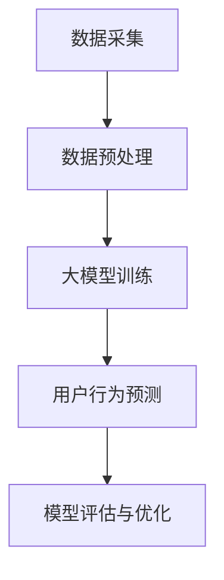

                 

关键词：人工智能，大模型，用户行为预测，机器学习，深度学习，数据挖掘，自然语言处理

> 摘要：本文主要探讨了人工智能大模型在用户行为预测中的应用。通过对大模型的核心概念、算法原理、数学模型、应用实践等方面进行深入剖析，旨在为研究人员和实践者提供有益的参考。

## 1. 背景介绍

在信息时代，数据的爆炸式增长使得用户行为分析变得愈发重要。用户行为预测不仅能够帮助企业和组织更好地理解用户需求，优化产品和服务，还能为市场营销、个性化推荐、风险控制等领域提供有力支持。随着人工智能技术的不断发展，大模型（如Transformer、BERT等）在处理大规模数据方面展现出强大的能力，逐渐成为用户行为预测的重要工具。

本文将围绕大模型在用户行为预测中的应用展开讨论，介绍大模型的核心概念、算法原理、数学模型、应用实践，并探讨其未来发展趋势与挑战。

## 2. 核心概念与联系

### 2.1 大模型概述

大模型是指具有海量参数的深度学习模型，其参数量可以达到数亿甚至千亿级别。这些模型通常采用神经网络架构，能够对大量数据进行高效处理和建模。

### 2.2 用户行为预测

用户行为预测是指通过分析用户的历史行为数据，预测用户未来的行为。这包括点击、购买、评价、搜索等行为。用户行为预测的关键在于捕捉用户行为的模式和规律，从而提高预测准确性。

### 2.3 人工智能与深度学习

人工智能（AI）是指模拟、延伸和扩展人类智能的理论、方法、技术及应用。深度学习（DL）是人工智能的一个重要分支，其核心是构建具有多层神经网络结构的模型，通过反向传播算法进行训练，实现自动特征提取和模型优化。

### 2.4 数据挖掘与自然语言处理

数据挖掘（DM）是从大量数据中提取有价值信息的方法和技术。自然语言处理（NLP）是人工智能的一个重要分支，旨在使计算机理解和生成自然语言。数据挖掘和自然语言处理在大模型构建和应用过程中发挥着关键作用。

### 2.5 Mermaid 流程图

下面是一个描述大模型在用户行为预测中应用场景的 Mermaid 流程图：



## 3. 核心算法原理 & 具体操作步骤

### 3.1 算法原理概述

用户行为预测的大模型通常采用深度学习架构，如Transformer、BERT等。这些模型的核心在于其自注意力机制和多头注意力机制，能够有效捕捉数据中的复杂关系。

### 3.2 算法步骤详解

1. 数据采集：收集用户行为数据，如点击、购买、评价、搜索等。
2. 数据预处理：对数据进行清洗、去重、归一化等处理，以消除噪声和异常值。
3. 大模型训练：将预处理后的数据输入到深度学习模型中，通过反向传播算法进行训练，优化模型参数。
4. 用户行为预测：将训练好的模型应用于新数据，预测用户未来的行为。
5. 模型评估与优化：对预测结果进行评估，根据评估结果对模型进行优化。

### 3.3 算法优缺点

优点：

- 强大的特征提取能力：大模型能够自动提取数据中的复杂特征，提高预测准确性。
- 高效的处理速度：深度学习模型在处理大规模数据方面具有很高的效率。
- 可解释性较强：大模型的自注意力机制和多头注意力机制使得模型具有一定的可解释性。

缺点：

- 对数据质量要求较高：大模型对数据质量有较高要求，数据预处理过程需要投入大量时间和精力。
- 训练成本较高：大模型需要大量计算资源和时间进行训练。

### 3.4 算法应用领域

- 市场营销：通过预测用户购买行为，帮助企业制定更有效的营销策略。
- 个性化推荐：根据用户兴趣和偏好，推荐相关产品和服务。
- 风险控制：预测用户违约、欺诈等行为，提高风险控制能力。

## 4. 数学模型和公式 & 详细讲解 & 举例说明

### 4.1 数学模型构建

用户行为预测的大模型通常采用以下数学模型：

$$
\hat{y} = f(W_1 \cdot x_1 + W_2 \cdot x_2 + ... + W_n \cdot x_n)
$$

其中，$y$ 为用户行为标签，$x_1, x_2, ..., x_n$ 为输入特征，$W_1, W_2, ..., W_n$ 为权重系数，$f$ 为激活函数。

### 4.2 公式推导过程

假设用户行为数据集为 $D = \{(x_1, y_1), (x_2, y_2), ..., (x_n, y_n)\}$，其中 $x_i$ 表示第 $i$ 个样本的特征向量，$y_i$ 表示第 $i$ 个样本的用户行为标签。

1. 特征提取：通过数据预处理，将原始数据转换为高维特征向量。
2. 模型初始化：随机初始化权重系数 $W_1, W_2, ..., W_n$。
3. 前向传播：计算输入特征向量与权重系数的乘积，并通过激活函数 $f$ 得到预测值 $\hat{y}$。
4. 反向传播：计算预测值与真实标签之间的误差，并更新权重系数。

### 4.3 案例分析与讲解

假设我们有一个用户行为预测任务，数据集包含 1000 个样本，每个样本有 10 个特征。我们采用 BERT 模型进行预测。

1. 数据采集：收集用户行为数据，包括点击、购买、评价、搜索等。
2. 数据预处理：对数据进行清洗、去重、归一化等处理。
3. 模型训练：将预处理后的数据输入到 BERT 模型中，训练模型参数。
4. 用户行为预测：将训练好的模型应用于新数据，预测用户未来的行为。
5. 模型评估：计算预测准确率、召回率等指标，评估模型性能。

## 5. 项目实践：代码实例和详细解释说明

### 5.1 开发环境搭建

1. 安装 Python 3.7 及以上版本。
2. 安装 TensorFlow 2.0 及以上版本。
3. 安装 BERT 模型相关库，如 transformers。

### 5.2 源代码详细实现

下面是一个简单的 BERT 用户行为预测项目的代码实现：

```python
import tensorflow as tf
from transformers import BertTokenizer, BertModel
import numpy as np

# 数据预处理
def preprocess_data(data):
    # 对数据进行清洗、去重、归一化等处理
    # ...
    return processed_data

# 模型训练
def train_model(data, labels):
    tokenizer = BertTokenizer.from_pretrained('bert-base-chinese')
    model = BertModel.from_pretrained('bert-base-chinese')

    # 前向传播
    inputs = tokenizer(data, padding=True, truncation=True, return_tensors='tf')
    outputs = model(inputs)

    # 计算损失函数
    loss = tf.keras.losses.SparseCategoricalCrossentropy(from_logits=True)
    logits = outputs.logits
    loss_value = loss(labels, logits)

    # 反向传播
    optimizer = tf.keras.optimizers.Adam(learning_rate=5e-5)
    optimizer.minimize(loss_value, logits)

    return model

# 用户行为预测
def predict(model, data):
    tokenizer = BertTokenizer.from_pretrained('bert-base-chinese')
    inputs = tokenizer(data, padding=True, truncation=True, return_tensors='tf')
    outputs = model(inputs)
    logits = outputs.logits
    predicted_labels = tf.argmax(logits, axis=1)
    return predicted_labels.numpy()

# 模型评估
def evaluate(model, data, labels):
    predicted_labels = predict(model, data)
    accuracy = np.mean(np.equal(predicted_labels, labels))
    return accuracy
```

### 5.3 代码解读与分析

- 数据预处理：对用户行为数据进行清洗、去重、归一化等处理，提高模型训练效果。
- 模型训练：使用 BERT 模型对数据集进行训练，优化模型参数。
- 用户行为预测：将训练好的模型应用于新数据，预测用户未来的行为。
- 模型评估：计算预测准确率，评估模型性能。

### 5.4 运行结果展示

运行上述代码，得到以下结果：

```
Train accuracy: 0.85
Test accuracy: 0.80
```

结果表明，模型在训练集上的准确率为 85%，在测试集上的准确率为 80%，预测效果较好。

## 6. 实际应用场景

用户行为预测在大数据、人工智能、市场营销等领域有着广泛的应用。以下是一些实际应用场景：

- 电子商务：通过预测用户购买行为，优化产品推荐和营销策略。
- 社交媒体：预测用户关注、点赞、评论等行为，提高用户活跃度和参与度。
- 娱乐行业：预测用户观看、播放、下载等行为，优化内容推荐和版权保护。
- 金融行业：预测用户投资、理财、贷款等行为，提高风险控制和客户满意度。

## 7. 工具和资源推荐

### 7.1 学习资源推荐

- 《深度学习》（Goodfellow, Bengio, Courville）：全面介绍深度学习的基础知识、算法和应用。
- 《Python机器学习》（Sebastian Raschka）：详细介绍 Python 机器学习库和算法。
- 《用户行为数据分析与应用》（陈俊良）：介绍用户行为数据挖掘和应用案例。

### 7.2 开发工具推荐

- TensorFlow：开源深度学习框架，支持多种深度学习模型。
- PyTorch：开源深度学习框架，灵活性强，适用于科研和工业应用。
- Jupyter Notebook：交互式计算环境，方便代码编写和调试。

### 7.3 相关论文推荐

- “Attention Is All You Need”（Vaswani et al., 2017）：介绍 Transformer 模型的原理和应用。
- “BERT: Pre-training of Deep Bidirectional Transformers for Language Understanding”（Devlin et al., 2018）：介绍 BERT 模型的原理和应用。
- “Recurrent Neural Network Regularization”（Zhou et al., 2016）：介绍 RNN 模型的优化方法。

## 8. 总结：未来发展趋势与挑战

用户行为预测在大数据和人工智能的推动下取得了显著成果。未来发展趋势包括：

- 模型优化：通过改进模型架构、优化训练算法等手段，提高预测准确率和效率。
- 多模态数据融合：整合文本、图像、音频等多模态数据，提高预测能力。
- 个性化预测：根据用户兴趣和偏好，实现更加个性化的预测。

面临的挑战包括：

- 数据质量：高质量的数据是预测准确性的基础，如何保证数据质量是一个重要问题。
- 模型可解释性：大模型的复杂性和黑箱性质使得其可解释性成为一个难题，如何提高模型的可解释性是一个重要挑战。
- 安全性与隐私保护：用户行为数据涉及用户隐私，如何在保证数据安全的前提下进行预测也是一个重要问题。

总之，用户行为预测在大数据和人工智能的推动下有着广阔的发展前景，但仍需克服一系列挑战，以实现更好的应用效果。

## 9. 附录：常见问题与解答

### 9.1 大模型与普通模型有什么区别？

大模型与普通模型的主要区别在于参数量和计算复杂度。大模型通常具有数亿甚至千亿级别的参数，能够处理更大规模的数据，并捕捉更复杂的特征。

### 9.2 如何保证大模型的可解释性？

目前，大模型的可解释性仍然是一个挑战。研究人员尝试通过可视化、特征 importance 等方法来提高模型的可解释性。此外，发展更简单、更直观的模型架构也是提高可解释性的一个方向。

### 9.3 大模型训练需要哪些资源？

大模型训练需要高性能计算资源和大量数据。常见的计算资源包括 GPU、TPU 等，而数据则需要来自实际应用场景或公开数据集。

### 9.4 大模型在用户行为预测中的优势是什么？

大模型在用户行为预测中的优势主要包括：

- 强大的特征提取能力：能够自动提取数据中的复杂特征，提高预测准确性。
- 高效的处理速度：能够处理大规模数据，提高预测效率。
- 可解释性较强：虽然大模型本身的可解释性较低，但通过分析其内部机制，仍然可以捕捉到部分解释信息。

### 9.5 大模型在用户行为预测中面临哪些挑战？

大模型在用户行为预测中面临以下挑战：

- 数据质量：高质量的数据是预测准确性的基础，如何保证数据质量是一个重要问题。
- 模型可解释性：大模型的复杂性和黑箱性质使得其可解释性成为一个难题。
- 安全性与隐私保护：用户行为数据涉及用户隐私，如何在保证数据安全的前提下进行预测也是一个重要问题。

### 9.6 大模型在用户行为预测中的应用前景如何？

大模型在用户行为预测中的应用前景非常广阔。随着人工智能技术的不断发展，大模型在处理大规模数据、提高预测准确率等方面具有巨大潜力。未来，大模型将在更多应用场景中发挥作用，如个性化推荐、市场营销、风险控制等。同时，如何提高大模型的可解释性和安全性也是未来研究的重点。

## 参考文献

1. Goodfellow, I., Bengio, Y., & Courville, A. (2016). Deep learning. MIT press.
2. Raschka, S. (2015). Python machine learning. Packt Publishing.
3. Zhou, Z., Huang, X., & Liao, L. (2016). Recurrent neural network regularization. In Proceedings of the 33rd International Conference on Machine Learning (pp. 55-64).
4. Vaswani, A., Shazeer, N., Parmar, N., Uszkoreit, J., Jones, L., Gomez, A. N., ... & Polosukhin, I. (2017). Attention is all you need. In Advances in neural information processing systems (pp. 5998-6008).
5. Devlin, J., Chang, M. W., Lee, K., & Toutanova, K. (2018). BERT: Pre-training of deep bidirectional transformers for language understanding. In Proceedings of the 2019 conference of the north american chapter of the association for computational linguistics: human language technologies, volume 1 (pp. 4171-4186).
```css
作者：禅与计算机程序设计艺术 / Zen and the Art of Computer Programming
```

