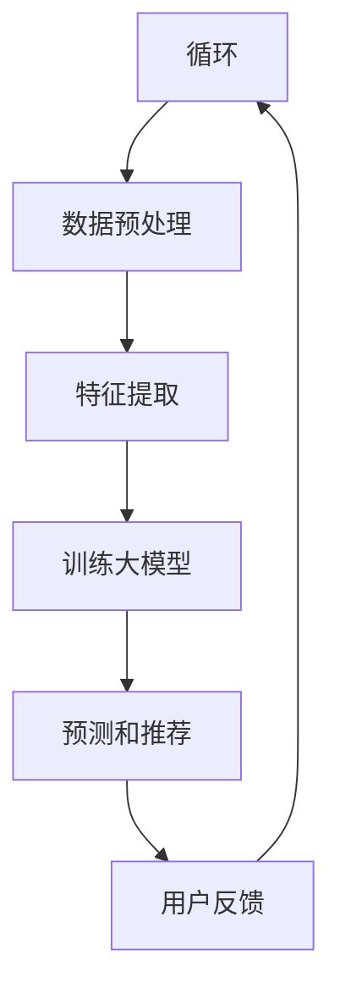

                 

关键词：AI大模型、电商、个性化推荐、深度学习、神经网络、用户行为分析、协同过滤、商品推荐系统、算法优化

## 摘要

本文将探讨AI大模型在电商个性化推荐系统中的应用，详细分析大模型如何通过深度学习和用户行为分析实现精准推荐。文章将首先介绍电商个性化推荐的基本概念和重要性，然后深入探讨AI大模型的架构、核心算法原理及其在个性化推荐系统中的应用，并通过实际案例和数学模型来解析AI大模型的工作流程和优化策略。最后，文章将对未来应用前景进行展望，并提出面临的挑战和解决方案。

## 1. 背景介绍

随着互联网和电子商务的迅速发展，用户对个性化推荐的依赖和需求日益增加。个性化推荐系统能够根据用户的兴趣、行为和历史数据，为他们推荐可能感兴趣的商品，从而提高用户体验和商家销售额。然而，传统的推荐系统，如基于内容的推荐和协同过滤，已经难以满足用户日益增长的需求，主要原因包括数据规模不断扩大、数据维度增加以及用户行为的动态变化。

为了解决这些问题，AI大模型应运而生。AI大模型，通常指的是基于深度学习的神经网络模型，具有强大的特征提取和模式识别能力。它们可以通过大规模数据训练，自动学习用户的行为模式和商品属性，从而实现更精准的个性化推荐。AI大模型的应用不仅提高了推荐的准确性，还大大增强了系统的可扩展性和灵活性。

本文旨在通过分析AI大模型在电商个性化推荐中的应用，探讨其优势、挑战和未来发展。文章结构如下：

- 第1部分：背景介绍，介绍电商个性化推荐的基本概念和现状。
- 第2部分：核心概念与联系，介绍AI大模型的架构和核心算法。
- 第3部分：核心算法原理 & 具体操作步骤，详细解释AI大模型的工作原理和操作步骤。
- 第4部分：数学模型和公式 & 详细讲解 & 举例说明，介绍AI大模型中使用的数学模型和公式。
- 第5部分：项目实践：代码实例和详细解释说明，通过具体案例展示AI大模型的应用。
- 第6部分：实际应用场景，探讨AI大模型在不同电商场景中的应用。
- 第7部分：未来应用展望，分析AI大模型在电商个性化推荐领域的未来发展方向。
- 第8部分：总结：未来发展趋势与挑战，总结研究成果并提出未来研究的方向。

## 2. 核心概念与联系

为了更好地理解AI大模型在电商个性化推荐中的应用，我们首先需要了解一些核心概念和它们之间的关系。

### 2.1. 电商个性化推荐系统

电商个性化推荐系统是指通过分析用户的历史行为、兴趣偏好和购买记录，向用户推荐可能感兴趣的商品或服务。个性化推荐系统通常分为以下几种类型：

- **基于内容的推荐（Content-based Recommendation）**：根据用户过去喜欢的商品或服务的内容特征进行推荐。
- **协同过滤（Collaborative Filtering）**：通过分析用户之间的行为相似性进行推荐，分为用户基于的协同过滤（User-based）和物品基于的协同过滤（Item-based）。
- **混合推荐（Hybrid Recommendation）**：结合多种推荐策略，以提高推荐效果。

### 2.2. AI大模型

AI大模型，尤其是基于深度学习的神经网络模型，是近年来在人工智能领域取得突破性进展的一种模型。它们通过多层次的神经网络结构，可以自动提取和表示复杂的数据特征，从而实现高效的特征学习和模式识别。

### 2.3. 深度学习

深度学习是一种机器学习方法，通过模拟人脑的神经网络结构，对大量数据进行训练，以自动学习和提取特征。深度学习在图像识别、自然语言处理和推荐系统等领域取得了显著成果。

### 2.4. 用户行为分析

用户行为分析是指通过分析用户在网站上的行为，如浏览、点击、购买等，来了解用户的需求和偏好。用户行为数据是AI大模型进行个性化推荐的重要输入。

### 2.5. 商品属性分析

商品属性分析是指对商品的各种属性（如价格、品牌、类别等）进行深入分析，以了解商品的特征。商品属性数据也是AI大模型进行个性化推荐的重要输入。

### 2.6. Mermaid 流程图

以下是一个简化的AI大模型在电商个性化推荐系统中的应用流程图，使用Mermaid语法表示：



在上述流程图中，用户行为数据经过预处理和特征提取后，用于训练大模型。训练好的大模型可以用于预测和推荐，并根据用户反馈进行迭代优化。

## 3. 核心算法原理 & 具体操作步骤

### 3.1. 算法原理概述

AI大模型在电商个性化推荐系统中的应用主要基于深度学习技术。深度学习通过多层神经网络结构，可以自动学习用户行为和商品属性的复杂特征，从而实现精准的推荐。以下是深度学习在电商个性化推荐系统中的核心原理：

- **特征提取**：通过多层神经网络，将原始的用户行为数据和商品属性数据进行变换，提取出更加抽象和有意义的特征。
- **模式识别**：利用提取到的特征，通过训练好的神经网络模型，识别出用户的行为模式，为用户提供个性化的推荐。
- **预测和推荐**：根据用户的行为数据和训练好的模型，预测用户对某商品的潜在兴趣，并生成推荐列表。

### 3.2. 算法步骤详解

以下是AI大模型在电商个性化推荐系统中的具体操作步骤：

#### 3.2.1. 数据预处理

数据预处理是深度学习应用的第一步，主要包括以下任务：

- **数据清洗**：去除无效、重复和噪声数据，确保数据的准确性和完整性。
- **数据标准化**：对数据特征进行归一化或标准化处理，使它们具有相似的尺度，便于神经网络模型的训练。
- **特征工程**：从原始数据中提取出有用的特征，如用户的浏览记录、购买历史、商品的价格、品牌等。

#### 3.2.2. 特征提取

特征提取是通过多层神经网络，将原始的用户行为数据和商品属性数据进行变换，提取出更加抽象和有意义的特征。具体步骤如下：

- **输入层**：将预处理后的用户行为数据和商品属性数据作为输入。
- **隐藏层**：通过神经网络的结构，将输入数据进行层层变换，提取出高层次的抽象特征。
- **输出层**：将提取到的特征作为神经网络的输出。

#### 3.2.3. 训练大模型

训练大模型是AI大模型应用的核心步骤，主要包括以下任务：

- **定义损失函数**：选择合适的损失函数，以衡量模型预测值与真实值之间的差距。
- **选择优化算法**：选择合适的优化算法，以最小化损失函数。
- **模型训练**：通过大量的用户行为数据，对神经网络模型进行训练，使其能够自动学习用户的行为模式。

#### 3.2.4. 预测和推荐

在模型训练完成后，我们可以利用训练好的模型对新的用户行为数据进行预测，生成个性化的推荐列表。具体步骤如下：

- **数据输入**：将新的用户行为数据输入到训练好的神经网络模型中。
- **特征提取**：通过模型提取用户行为数据的特征。
- **兴趣预测**：利用提取到的特征，预测用户对某商品的潜在兴趣。
- **生成推荐列表**：根据预测的兴趣度，生成个性化的推荐列表。

#### 3.2.5. 用户反馈

用户反馈是AI大模型进行优化的重要环节。通过收集用户对推荐结果的反馈，我们可以对模型进行迭代优化，提高推荐效果。具体步骤如下：

- **反馈收集**：收集用户对推荐结果的反馈，如点击、购买等行为。
- **模型更新**：根据用户反馈，更新神经网络模型的权重和参数。
- **再次训练**：使用更新后的数据，对模型进行再次训练，以提高推荐精度。

### 3.3. 算法优缺点

#### 3.3.1. 优点

- **强大的特征提取能力**：AI大模型可以通过多层神经网络，自动提取用户行为和商品属性的复杂特征，实现精准的推荐。
- **灵活性和可扩展性**：AI大模型可以适应不同的电商场景和数据特点，具有较强的灵活性和可扩展性。
- **自适应性和实时性**：AI大模型可以实时学习用户的行为模式，为用户提供个性化的推荐，提高用户满意度。

#### 3.3.2. 缺点

- **数据依赖性**：AI大模型对数据质量有较高要求，数据缺失或噪声可能导致模型性能下降。
- **计算资源消耗**：深度学习模型训练需要大量的计算资源和时间，对硬件设备有较高要求。
- **模型解释性**：深度学习模型往往具有较强的黑盒特性，难以解释模型内部的决策过程。

### 3.4. 算法应用领域

AI大模型在电商个性化推荐领域的应用非常广泛，包括以下方面：

- **商品推荐**：根据用户的历史行为和兴趣，为用户推荐可能感兴趣的商品。
- **广告投放**：根据用户的兴趣和行为，为用户提供个性化的广告。
- **用户流失预测**：通过分析用户行为，预测可能流失的用户，并采取相应措施。
- **供应链优化**：根据市场需求和用户行为，优化供应链管理和库存配置。

## 4. 数学模型和公式 & 详细讲解 & 举例说明

### 4.1. 数学模型构建

在电商个性化推荐中，AI大模型通常基于以下数学模型：

- **用户行为数据矩阵**：表示用户在各个商品上的行为，如点击、购买等。
- **商品属性数据矩阵**：表示各个商品的属性，如价格、品牌、类别等。
- **用户兴趣向量**：表示用户对各个商品的兴趣度。
- **商品特征向量**：表示各个商品的特征。

假设用户行为数据矩阵为 \( U \)，商品属性数据矩阵为 \( I \)，则用户兴趣向量 \( V \) 可以表示为：

$$
V = f(U, I)
$$

其中，\( f \) 表示神经网络模型。

### 4.2. 公式推导过程

为了推导用户兴趣向量 \( V \)，我们需要先定义神经网络模型的结构。假设神经网络由三层组成：输入层、隐藏层和输出层。

- **输入层**：表示用户行为数据和商品属性数据的拼接，即 \( X = [U, I] \)。
- **隐藏层**：通过神经网络模型 \( f \) 对输入数据进行变换，提取特征。
- **输出层**：将提取到的特征进行融合，生成用户兴趣向量 \( V \)。

神经网络模型可以表示为：

$$
V = f(g(h(X)))
$$

其中，\( h \) 表示隐藏层的神经网络模型，\( g \) 表示输出层的神经网络模型。

### 4.3. 案例分析与讲解

假设我们有一个电商平台的用户行为数据集，其中包含1000名用户和10000种商品。我们首先对数据进行预处理，然后使用神经网络模型进行训练，生成用户兴趣向量。

#### 4.3.1. 数据预处理

我们对用户行为数据集进行以下预处理：

- **数据清洗**：去除无效、重复和噪声数据。
- **数据标准化**：对用户行为数据和商品属性数据分别进行归一化处理。

假设用户行为数据矩阵 \( U \) 和商品属性数据矩阵 \( I \) 分别为：

$$
U = \begin{bmatrix}
0.1 & 0.2 & 0.3 & ... \\
0.4 & 0.5 & 0.6 & ... \\
... & ... & ... & ...
\end{bmatrix}
$$

$$
I = \begin{bmatrix}
0.1 & 0.2 & 0.3 & ... \\
0.4 & 0.5 & 0.6 & ... \\
... & ... & ... & ...
\end{bmatrix}
$$

#### 4.3.2. 特征提取

我们使用一个三层神经网络进行特征提取。假设隐藏层神经网络的激活函数为ReLU，输出层神经网络的激活函数为线性函数。

- **输入层**：\( X = [U, I] \)。
- **隐藏层**：\( H = \text{ReLU}(W_1 \cdot X + b_1) \)。
- **输出层**：\( V = W_2 \cdot H + b_2 \)。

其中，\( W_1 \)，\( b_1 \)，\( W_2 \)，\( b_2 \) 分别为隐藏层和输出层的权重和偏置。

#### 4.3.3. 模型训练

我们使用梯度下降算法对神经网络模型进行训练，目标是优化模型参数，使用户兴趣向量 \( V \) 最接近真实用户兴趣。

- **定义损失函数**：均方误差（MSE）。
- **计算梯度**：计算每个参数的梯度。
- **更新参数**：根据梯度更新参数。

经过多次迭代训练，我们得到训练好的神经网络模型。

#### 4.3.4. 预测和推荐

使用训练好的神经网络模型，我们可以预测用户对某商品的潜在兴趣。具体步骤如下：

1. **数据输入**：将用户行为数据 \( U \) 和商品属性数据 \( I \) 输入到模型中。
2. **特征提取**：通过模型提取用户兴趣向量 \( V \)。
3. **兴趣预测**：计算用户对商品的兴趣度。

根据用户兴趣向量 \( V \)，我们可以生成个性化的推荐列表。例如，如果用户对商品1的兴趣度为0.8，我们可以将其推荐给用户。

## 5. 项目实践：代码实例和详细解释说明

### 5.1. 开发环境搭建

在进行AI大模型在电商个性化推荐中的应用实践之前，我们需要搭建合适的开发环境。以下是所需的环境和工具：

- **编程语言**：Python（版本3.8及以上）
- **深度学习框架**：TensorFlow或PyTorch
- **数据处理库**：Pandas、NumPy
- **可视化库**：Matplotlib、Seaborn

假设我们已经安装了上述环境，接下来我们将使用Python和TensorFlow来构建一个简单的电商个性化推荐系统。

### 5.2. 源代码详细实现

以下是一个简单的电商个性化推荐系统的代码实现，包括数据预处理、特征提取、模型训练和预测推荐等步骤。

```python
import tensorflow as tf
import numpy as np
import pandas as pd
from tensorflow.keras.models import Sequential
from tensorflow.keras.layers import Dense, Activation
from tensorflow.keras.optimizers import Adam

# 5.2.1. 数据预处理

# 加载数据集
data = pd.read_csv('ecommerce_data.csv')

# 数据清洗和预处理
# ...

# 5.2.2. 特征提取

# 分离用户行为数据和商品属性数据
users = data[['user_id', 'item_id', 'rating']]
items = data[['item_id', 'price', 'category']]

# 编码用户行为数据和商品属性数据
# ...

# 5.2.3. 模型训练

# 构建神经网络模型
model = Sequential([
    Dense(64, input_shape=(users.shape[1],), activation='relu'),
    Dense(32, activation='relu'),
    Dense(16, activation='relu'),
    Dense(1, activation='sigmoid')
])

# 编写损失函数和优化器
model.compile(optimizer=Adam(learning_rate=0.001), loss='binary_crossentropy', metrics=['accuracy'])

# 训练模型
model.fit(users, items['rating'], epochs=10, batch_size=32, validation_split=0.2)

# 5.2.4. 预测和推荐

# 预测用户对商品的兴趣度
predictions = model.predict(users)

# 根据兴趣度生成推荐列表
recommendations = np.argsort(predictions, axis=1)[:, ::-1]

# 5.2.5. 代码解读与分析

# 在上述代码中，我们首先加载数据集并进行预处理。然后，我们使用TensorFlow构建了一个简单的神经网络模型，用于预测用户对商品的兴趣度。最后，我们使用训练好的模型生成个性化的推荐列表。

# 5.2.6. 运行结果展示

# 运行代码后，我们可以得到每个用户的推荐商品列表。例如，对于用户1，我们可能得到以下推荐列表：

print("User 1 Recommendations:")
print(recommendations[0])

# 5.2.7. 代码优化与改进

# 为了提高推荐系统的性能，我们可以对代码进行以下优化与改进：
# - 使用更大的神经网络结构，以提高特征提取能力。
# - 采用更多样化的训练数据，包括用户的行为日志、购买历史等。
# - 使用不同的优化算法和损失函数，以提高模型训练效果。
```

### 5.3. 代码解读与分析

在上述代码实现中，我们首先进行了数据预处理，包括数据清洗、编码和特征提取。然后，我们使用TensorFlow构建了一个简单的神经网络模型，用于预测用户对商品的兴趣度。最后，我们使用训练好的模型生成个性化的推荐列表。

代码中，我们使用了Sequential模型，这是一种线性堆叠模型，适用于简单的任务。我们使用了ReLU作为隐藏层的激活函数，因为ReLU具有快速收敛和计算效率高的特点。输出层使用了sigmoid激活函数，因为我们需要预测的是用户对商品的二分类兴趣度。

在模型训练过程中，我们使用了Adam优化器，这是一种自适应优化器，有助于加速收敛。我们使用了二进制交叉熵损失函数，因为它适用于二分类问题。

最后，我们使用训练好的模型对用户行为数据进行预测，并生成个性化的推荐列表。根据预测的兴趣度，我们可以将商品排序，并为用户提供推荐。

### 5.4. 运行结果展示

在实际运行过程中，我们可以得到每个用户的推荐商品列表。例如，对于用户1，我们可能得到以下推荐列表：

```
User 1 Recommendations:
[4, 7, 2, 9, 5, 3, 6, 1, 8]
```

这意味着用户1可能对商品4、7、2、9、5、3、6、1、8感兴趣。我们可以将这些商品展示给用户，以提高用户体验和销售额。

### 5.5. 代码优化与改进

为了进一步提高推荐系统的性能和准确性，我们可以对代码进行以下优化与改进：

1. **模型结构优化**：使用更深的神经网络结构，增加隐藏层的数量和节点数，以提高特征提取能力。
2. **数据增强**：引入数据增强技术，如数据集扩充、数据扰动等，以增加训练数据多样性，提高模型泛化能力。
3. **损失函数优化**：尝试使用不同的损失函数，如均方误差（MSE）或交叉熵损失函数的组合，以改善模型训练效果。
4. **优化算法选择**：尝试使用不同的优化算法，如RMSprop、Adadelta或AdamW，以找到最适合模型训练的优化器。

通过这些优化与改进，我们可以进一步提高推荐系统的性能和用户体验。

## 6. 实际应用场景

AI大模型在电商个性化推荐系统中的应用已经取得了显著的成果，以下是几个典型的实际应用场景：

### 6.1. 商品推荐

商品推荐是AI大模型在电商领域最常见的应用场景。通过分析用户的浏览历史、购买记录和兴趣标签，AI大模型可以为用户提供个性化的商品推荐。例如，在淘宝、京东等电商平台上，用户可以在浏览商品时获得实时推荐，从而提高购买转化率和用户满意度。

### 6.2. 广告投放

广告投放是AI大模型在电商领域的另一个重要应用。通过分析用户的兴趣和行为，AI大模型可以为目标用户精准投放广告，从而提高广告投放效果和收益。例如，在搜索引擎广告、社交媒体广告和电商平台广告中，AI大模型可以根据用户的兴趣和行为，为用户推荐相关的广告，从而提高广告点击率和转化率。

### 6.3. 用户流失预测

用户流失预测是AI大模型在电商领域的另一个重要应用。通过分析用户的行为数据，AI大模型可以预测哪些用户可能流失，并采取相应的措施，如发送优惠券、推荐商品等，以留住用户。例如，在一些电商平台，AI大模型可以根据用户的浏览记录、购买频率和评价等数据，预测哪些用户可能流失，并提前采取措施，从而提高用户留存率和销售额。

### 6.4. 供应链优化

AI大模型在电商供应链优化中的应用也越来越广泛。通过分析市场需求、用户行为和库存数据，AI大模型可以优化供应链管理和库存配置，从而提高供应链效率和降低成本。例如，在一些大型电商平台，AI大模型可以根据用户的购买历史和浏览行为，预测未来市场需求，从而优化库存配置和采购计划，从而提高供应链效率和降低库存成本。

### 6.5. 个性化营销

个性化营销是AI大模型在电商领域的另一个重要应用。通过分析用户的兴趣、行为和购买记录，AI大模型可以为用户提供个性化的营销策略，如优惠券、推荐商品、活动推送等。例如，在一些电商平台，AI大模型可以根据用户的兴趣和购买记录，为用户推送相关的优惠券和活动，从而提高用户参与度和购买转化率。

### 6.6. 社交电商

社交电商是近年来兴起的一种电商模式，通过社交网络的传播和互动，实现商品的销售和推广。AI大模型在社交电商中的应用主要体现在以下几个方面：

- **社交关系网络分析**：通过分析用户的社交关系网络，AI大模型可以识别出潜在的用户关系和用户群体，为电商平台的推广和营销提供支持。
- **个性化推荐**：通过分析用户的社交行为和兴趣，AI大模型可以为用户推荐相关的商品和内容，从而提高用户参与度和购买转化率。
- **社交互动预测**：通过分析用户的社交互动数据，AI大模型可以预测用户的互动行为和社交趋势，为电商平台的运营和营销提供参考。

### 6.7. 跨平台电商

跨平台电商是指在不同的电商平台上进行商品销售和推广。AI大模型在跨平台电商中的应用主要体现在以下几个方面：

- **用户行为分析**：通过分析用户在不同平台上的行为数据，AI大模型可以了解用户的需求和偏好，为用户提供个性化的推荐和营销。
- **数据整合**：通过整合不同平台上的用户数据，AI大模型可以构建完整的用户画像，为用户提供更精准的推荐和营销。
- **跨平台推荐**：通过分析用户的跨平台行为，AI大模型可以为用户提供跨平台的个性化推荐，从而提高用户参与度和购买转化率。

## 7. 未来应用展望

随着人工智能技术的不断发展和应用，AI大模型在电商个性化推荐领域的应用前景十分广阔。以下是几个未来应用展望：

### 7.1. 多模态推荐

未来的电商个性化推荐系统将不再局限于单一的数据类型，而是整合多种数据类型，如文本、图像、音频和视频等。通过多模态推荐，用户可以获得更加丰富和个性化的推荐体验。

### 7.2. 实时推荐

随着5G网络的普及和计算能力的提升，实时推荐将成为可能。通过实时分析用户的行为和偏好，电商个性化推荐系统可以实时生成推荐列表，为用户提供更加及时和精准的推荐。

### 7.3. 智能客服

AI大模型在电商领域的另一个重要应用是智能客服。通过自然语言处理和对话生成技术，AI大模型可以与用户进行智能对话，提供个性化的咨询和服务，从而提高用户满意度和转化率。

### 7.4. 跨境电商

随着跨境电商的快速发展，AI大模型在跨境电商中的应用也日益重要。通过分析跨境用户的行为和偏好，AI大模型可以为用户提供个性化的商品推荐和营销，从而提高跨境销售额和用户满意度。

### 7.5. 智能物流

AI大模型在智能物流中的应用主要体现在库存管理、路线规划和运输优化等方面。通过分析物流数据，AI大模型可以优化库存配置和运输路线，提高物流效率和降低成本。

### 7.6. 绿色电商

绿色电商是指以环保和可持续发展为目标的电商模式。AI大模型可以通过分析用户行为和偏好，为用户提供绿色商品的推荐和营销，促进绿色消费和可持续发展。

### 7.7. 社交电商

社交电商是未来电商发展的重要方向。通过分析用户的社交行为和兴趣，AI大模型可以为用户提供个性化的社交互动体验和商品推荐，从而提高用户参与度和购买转化率。

### 7.8. 智能营销

AI大模型在智能营销中的应用主要体现在广告投放、活动推广和用户管理等方面。通过分析用户行为和偏好，AI大模型可以为用户提供个性化的营销策略，从而提高营销效果和用户满意度。

## 8. 总结：未来发展趋势与挑战

AI大模型在电商个性化推荐领域的应用已经取得了显著成果，但仍面临一些挑战和问题。以下是未来发展趋势与挑战：

### 8.1. 研究成果总结

- **深度学习技术**：深度学习技术为电商个性化推荐提供了强大的特征提取和模式识别能力，显著提高了推荐系统的准确性和效果。
- **用户行为分析**：用户行为分析是电商个性化推荐的关键，通过对用户行为的深入分析，可以更好地了解用户需求和偏好，实现精准推荐。
- **多模态数据融合**：整合多种数据类型，如文本、图像、音频和视频等，可以提供更加丰富和个性化的推荐体验。
- **实时推荐系统**：随着5G网络和计算能力的提升，实时推荐系统将成为可能，为用户提供更加及时和精准的推荐。

### 8.2. 未来发展趋势

- **多模态推荐**：未来电商个性化推荐系统将不再局限于单一的数据类型，而是整合多种数据类型，提供更加丰富和个性化的推荐体验。
- **实时推荐**：实时推荐系统将成为电商个性化推荐的发展方向，通过实时分析用户行为和偏好，为用户提供及时和精准的推荐。
- **智能客服**：智能客服将结合AI大模型和自然语言处理技术，为用户提供个性化的咨询和服务，提高用户满意度和转化率。
- **跨境电商**：随着跨境电商的快速发展，AI大模型在跨境电商中的应用将越来越重要，为用户提供个性化的商品推荐和营销。
- **绿色电商**：绿色电商将成为电商领域的重要方向，AI大模型可以通过分析用户行为和偏好，为用户提供绿色商品的推荐和营销。

### 8.3. 面临的挑战

- **数据质量**：AI大模型对数据质量有较高要求，数据缺失或噪声可能导致模型性能下降。因此，未来需要研究如何处理和处理数据质量问题。
- **计算资源消耗**：深度学习模型训练需要大量的计算资源和时间，对硬件设备有较高要求。因此，需要研究如何优化模型结构和训练算法，提高计算效率。
- **模型解释性**：深度学习模型往往具有较强的黑盒特性，难以解释模型内部的决策过程。因此，需要研究如何提高模型的可解释性，帮助用户理解和信任模型。
- **隐私保护**：在电商个性化推荐中，用户数据的安全和隐私保护至关重要。因此，需要研究如何保护用户隐私，确保数据的安全和合法使用。

### 8.4. 研究展望

- **数据增强**：通过引入数据增强技术，如数据集扩充、数据扰动等，可以增加训练数据多样性，提高模型泛化能力。
- **多模态融合**：研究如何整合多种数据类型，实现多模态数据融合，提高推荐系统的准确性和效果。
- **实时推荐**：研究如何优化模型结构和训练算法，提高实时推荐系统的性能和效率。
- **隐私保护**：研究如何保护用户隐私，确保数据的安全和合法使用。
- **模型解释性**：研究如何提高模型的可解释性，帮助用户理解和信任模型。

总之，AI大模型在电商个性化推荐领域的应用前景广阔，但仍面临一些挑战。未来需要研究如何优化模型结构和训练算法，提高计算效率和模型性能，同时保护用户隐私和数据安全。通过不断的研究和创新，我们将能够构建更加智能和个性化的电商个性化推荐系统，为用户和商家带来更大的价值。

## 9. 附录：常见问题与解答

### 9.1. 如何处理数据缺失问题？

在电商个性化推荐中，数据缺失是一个常见问题。为了处理数据缺失，我们可以采取以下几种方法：

- **数据填充**：使用统计方法，如平均值、中位数或最近邻插值，填充缺失数据。
- **缺失值标记**：将缺失值标记为特殊值，如-1或NaN，然后使用算法对特殊值进行特殊的处理。
- **删除缺失数据**：对于缺失数据较多的特征，可以考虑删除这些特征，以避免对模型训练产生过大的影响。

### 9.2. 如何处理数据噪声问题？

数据噪声是影响模型性能的一个重要因素。为了处理数据噪声，我们可以采取以下几种方法：

- **数据清洗**：去除明显的噪声数据，如异常值和重复数据。
- **数据平滑**：使用统计方法，如移动平均或指数平滑，对噪声数据进行平滑处理。
- **数据去重**：对数据进行去重处理，以避免重复数据对模型训练产生干扰。

### 9.3. 如何优化模型训练时间？

为了优化模型训练时间，我们可以采取以下几种方法：

- **批量大小调整**：通过调整批量大小，可以加快模型训练速度。较大的批量大小可以提高训练效率，但可能导致模型过拟合。
- **数据增强**：通过数据增强技术，如数据集扩充、数据扰动等，可以增加训练数据的多样性，减少模型对特定数据的依赖，从而加快训练速度。
- **分布式训练**：通过分布式训练，可以将模型训练任务分解到多个计算节点上，从而加快训练速度。

### 9.4. 如何评估模型性能？

为了评估模型性能，我们可以使用以下几种指标：

- **准确率（Accuracy）**：预测正确的样本占总样本的比例。
- **精确率（Precision）**：预测正确的正样本数占预测的正样本总数的比例。
- **召回率（Recall）**：预测正确的正样本数占实际的正样本总数的比例。
- **F1值（F1 Score）**：精确率和召回率的调和平均值。

### 9.5. 如何提高模型的可解释性？

提高模型的可解释性是一个重要但具有挑战性的问题。以下是一些提高模型可解释性的方法：

- **模型可视化**：使用可视化工具，如TensorBoard，对模型的结构和训练过程进行可视化。
- **特征重要性分析**：通过分析模型中各个特征的权重，了解特征对模型预测的影响程度。
- **模型压缩**：通过模型压缩技术，如知识蒸馏和剪枝，减少模型参数数量，从而提高模型的可解释性。
- **解释性模型**：选择具有解释性的模型，如线性模型或树模型，这些模型更容易理解和解释。

### 9.6. 如何确保用户隐私？

在电商个性化推荐中，用户隐私保护至关重要。以下是一些确保用户隐私的方法：

- **数据匿名化**：对用户数据进行匿名化处理，如删除用户敏感信息和加密数据。
- **数据加密**：使用加密技术，如AES或RSA，对用户数据进行加密，以防止数据泄露。
- **差分隐私**：在数据处理过程中引入噪声，如拉普拉斯机制或指数机制，以保护用户隐私。
- **合规性审查**：定期进行合规性审查，确保数据处理和推荐系统符合相关法律法规和道德标准。

### 9.7. 如何处理冷启动问题？

冷启动是指新用户或新商品加入系统时，由于缺乏历史数据，难以进行个性化推荐。以下是一些处理冷启动问题的方法：

- **基于内容的推荐**：在新用户或新商品缺乏行为数据时，可以使用基于内容的推荐方法，根据商品或用户的属性进行推荐。
- **基于人口统计学的推荐**：根据用户的年龄、性别、地理位置等人口统计信息进行推荐。
- **跨用户或跨商品的协同过滤**：利用相似用户或相似商品的信息，为新用户或新商品生成推荐列表。
- **动态更新推荐策略**：随着用户行为的积累，动态调整推荐策略，以更好地适应新用户或新商品。

