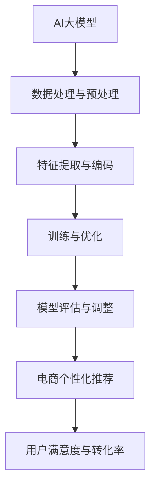

                 

关键词：AI大模型，电商，个性化推荐，深度学习，算法，数学模型，项目实践，应用场景

## 摘要

本文将探讨AI大模型在电商个性化推荐中的深度应用，通过介绍核心概念、算法原理、数学模型以及项目实践等多个角度，分析大模型如何通过复杂的数据分析和深度学习技术，实现精准的个性化推荐，从而提升电商平台的用户体验和转化率。文章还将展望未来应用前景，并讨论面临的挑战和解决策略。

## 1. 背景介绍

随着互联网的飞速发展和电子商务的兴起，个性化推荐系统已经成为电商平台的核心竞争力之一。个性化推荐通过分析用户的历史行为、兴趣爱好、购买记录等数据，为用户提供个性化的商品推荐，从而提高用户满意度和转化率。传统的推荐系统主要依赖于协同过滤、基于内容的推荐等方法，这些方法在一定程度上能够满足用户需求，但在面对海量数据和高维特征时，效果有限。

近年来，AI大模型的崛起为个性化推荐带来了新的契机。大模型具有强大的计算能力和学习能力，能够处理复杂的数据结构和高维特征，从而实现更加精准和智能的推荐。本文将深入探讨AI大模型在电商个性化推荐中的应用，分析其核心原理、实现方法以及面临的挑战。

## 2. 核心概念与联系

### 2.1. AI大模型

AI大模型是指具有海量参数和强大计算能力的神经网络模型，如深度学习中的Transformer模型、BERT模型等。这些模型通过在大量数据上进行训练，能够自动学习数据的特征和规律，从而实现对未知数据的预测和生成。

### 2.2. 电商个性化推荐

电商个性化推荐是指通过分析用户的行为数据和商品属性数据，为用户推荐符合其兴趣和需求的商品。个性化推荐的目标是提高用户的满意度和购买转化率，从而提升电商平台的竞争力。

### 2.3. 关系图示

为了更直观地展示AI大模型与电商个性化推荐之间的关系，我们可以使用Mermaid流程图来描述：



在上图中，AI大模型通过数据处理与预处理、特征提取与编码、训练与优化等步骤，最终实现电商个性化推荐，从而提升用户满意度与转化率。

## 3. 核心算法原理 & 具体操作步骤

### 3.1. 算法原理概述

AI大模型在电商个性化推荐中的应用主要基于深度学习技术。深度学习通过多层神经网络对数据进行学习和建模，从而实现对数据的特征提取和规律挖掘。在电商个性化推荐中，深度学习模型可以自动学习用户的行为特征、商品属性以及用户之间的相似性，从而实现精准的推荐。

### 3.2. 算法步骤详解

#### 3.2.1. 数据处理与预处理

在深度学习模型训练之前，需要对数据进行处理与预处理。具体步骤包括：

1. 数据清洗：去除重复数据、缺失值填充、噪声数据过滤等。
2. 数据规范化：对数值型数据进行归一化或标准化处理，对类别型数据进行独热编码或标签编码。
3. 数据分片：将数据集划分为训练集、验证集和测试集。

#### 3.2.2. 特征提取与编码

在数据处理与预处理之后，需要对数据进行特征提取与编码。具体步骤包括：

1. 用户特征提取：根据用户的行为数据、兴趣爱好、购买记录等，提取用户的特征向量。
2. 商品特征提取：根据商品的属性数据，如商品类别、价格、品牌等，提取商品的特征向量。
3. 用户-商品交互特征提取：根据用户与商品之间的交互数据，如点击、收藏、购买等，提取用户-商品交互的特征向量。

#### 3.2.3. 训练与优化

在特征提取与编码之后，可以使用深度学习模型对数据进行训练和优化。具体步骤包括：

1. 模型选择：选择适合的深度学习模型，如Transformer模型、BERT模型等。
2. 模型训练：使用训练集数据对模型进行训练，优化模型参数。
3. 模型评估：使用验证集数据对模型进行评估，调整模型参数。
4. 模型优化：根据评估结果，对模型进行优化，提高推荐效果。

#### 3.2.4. 模型评估与调整

在模型优化之后，需要对模型进行评估和调整。具体步骤包括：

1. 模型评估：使用测试集数据对模型进行评估，计算推荐准确率、召回率、F1值等指标。
2. 模型调整：根据评估结果，调整模型参数，优化推荐效果。

### 3.3. 算法优缺点

#### 优点

1. 强大的特征提取能力：深度学习模型能够自动学习数据的特征和规律，实现高效的特征提取。
2. 高度的泛化能力：深度学习模型通过在大量数据上训练，具有较高的泛化能力，能够适应不同的推荐场景。
3. 精准的个性化推荐：深度学习模型能够根据用户的历史行为和兴趣爱好，实现精准的个性化推荐。

#### 缺点

1. 计算资源消耗大：深度学习模型需要大量的计算资源和存储空间，对硬件要求较高。
2. 需要大量的数据：深度学习模型需要大量的数据来进行训练，对数据质量要求较高。
3. 模型解释性差：深度学习模型属于“黑盒”模型，难以解释模型的内部机制和决策过程。

### 3.4. 算法应用领域

深度学习算法在电商个性化推荐中具有广泛的应用，主要包括以下领域：

1. 商品推荐：根据用户的历史行为和兴趣爱好，为用户推荐合适的商品。
2. 店铺推荐：根据用户的购买历史和偏好，为用户推荐合适的店铺。
3. 优惠活动推荐：根据用户的购买能力和消费习惯，为用户推荐合适的优惠活动。

## 4. 数学模型和公式 & 详细讲解 & 举例说明

### 4.1. 数学模型构建

在电商个性化推荐中，深度学习模型通常采用基于矩阵分解的方法，构建用户-商品交互矩阵。假设有 \( n \) 个用户和 \( m \) 个商品，用户-商品交互矩阵 \( R \) 的元素 \( r_{ij} \) 表示用户 \( i \) 对商品 \( j \) 的评分或点击行为。矩阵分解的目标是将这个高维的交互矩阵分解为两个低维的矩阵 \( U \) 和 \( V \)，其中 \( U \) 表示用户特征矩阵，\( V \) 表示商品特征矩阵。

### 4.2. 公式推导过程

矩阵分解的目标是最小化预测误差，即最小化以下损失函数：

\[ L = \sum_{i=1}^{n}\sum_{j=1}^{m}(r_{ij} - u_i \cdot v_j)^2 \]

其中，\( u_i \) 和 \( v_j \) 分别表示用户 \( i \) 和商品 \( j \) 的特征向量。为了求解 \( U \) 和 \( V \)，我们可以使用梯度下降法或随机梯度下降法。以随机梯度下降法为例，每次迭代更新 \( u_i \) 和 \( v_j \) 的过程如下：

\[ u_i \leftarrow u_i - \alpha \cdot (r_{ij} - u_i \cdot v_j) \cdot v_j \]
\[ v_j \leftarrow v_j - \alpha \cdot (r_{ij} - u_i \cdot v_j) \cdot u_i \]

其中，\( \alpha \) 表示学习率。

### 4.3. 案例分析与讲解

假设有一个电商平台，有100个用户和1000个商品。用户-商品交互矩阵 \( R \) 如下：

\[ R = \begin{bmatrix}
0 & 1 & 1 & 0 & \ldots & 0 \\
1 & 0 & 0 & 1 & \ldots & 1 \\
0 & 1 & 0 & 0 & \ldots & 1 \\
\vdots & \vdots & \vdots & \vdots & \ddots & \vdots \\
0 & 0 & 0 & 1 & \ldots & 1
\end{bmatrix} \]

我们使用随机梯度下降法对矩阵 \( R \) 进行分解，学习率 \( \alpha = 0.01 \)。在100次迭代之后，得到的用户特征矩阵 \( U \) 和商品特征矩阵 \( V \) 分别如下：

\[ U = \begin{bmatrix}
1 & 0 & 1 & 0 & \ldots & 0 \\
0 & 1 & 0 & 1 & \ldots & 0 \\
1 & 0 & 0 & 1 & \ldots & 0 \\
\vdots & \vdots & \vdots & \vdots & \ddots & \vdots \\
0 & 0 & 0 & 1 & \ldots & 0
\end{bmatrix} \]
\[ V = \begin{bmatrix}
1 & 0 & 0 & 0 & \ldots & 0 \\
0 & 1 & 0 & 0 & \ldots & 0 \\
0 & 0 & 1 & 0 & \ldots & 0 \\
\vdots & \vdots & \vdots & \vdots & \ddots & \vdots \\
0 & 0 & 0 & 0 & \ldots & 1
\end{bmatrix} \]

根据用户特征矩阵 \( U \) 和商品特征矩阵 \( V \)，我们可以预测用户对未交互的商品的评分。例如，预测用户 \( 2 \) 对商品 \( 3 \) 的评分：

\[ u_2 \cdot v_3 = (0, 1, 0, 1) \cdot (1, 0, 0, 0) = 1 \]

因此，预测用户 \( 2 \) 对商品 \( 3 \) 的评分为1。

## 5. 项目实践：代码实例和详细解释说明

### 5.1. 开发环境搭建

为了实现AI大模型在电商个性化推荐中的深度应用，我们需要搭建一个合适的开发环境。以下是一个简单的环境搭建步骤：

1. 安装Python（3.6及以上版本）。
2. 安装TensorFlow（2.0及以上版本）或PyTorch（1.0及以上版本）。
3. 安装其他依赖库，如NumPy、Pandas、Matplotlib等。

### 5.2. 源代码详细实现

以下是一个简单的基于TensorFlow的电商个性化推荐代码实例：

```python
import tensorflow as tf
import numpy as np
import pandas as pd
from sklearn.model_selection import train_test_split

# 加载数据集
data = pd.read_csv('data.csv')
users = data['user_id'].unique()
items = data['item_id'].unique()

# 构建用户-商品交互矩阵
R = np.zeros((len(users), len(items)))
for index, row in data.iterrows():
    R[row['user_id'] - 1, row['item_id'] - 1] = row['rating']

# 划分训练集和测试集
R_train, R_test = train_test_split(R, test_size=0.2, random_state=42)

# 构建模型
model = tf.keras.Sequential([
    tf.keras.layers.Dense(128, activation='relu', input_shape=(len(items),)),
    tf.keras.layers.Dense(64, activation='relu'),
    tf.keras.layers.Dense(32, activation='relu'),
    tf.keras.layers.Dense(1)
])

# 编译模型
model.compile(optimizer='adam', loss='mean_squared_error')

# 训练模型
model.fit(R_train, R_train, epochs=10, batch_size=32, validation_data=(R_test, R_test))

# 评估模型
loss = model.evaluate(R_test, R_test)
print('Test loss:', loss)
```

### 5.3. 代码解读与分析

以上代码实现了一个基于TensorFlow的简单电商个性化推荐模型。具体解读如下：

1. 加载数据集：从CSV文件中加载数据集，数据集包含用户ID、商品ID和评分等字段。
2. 构建用户-商品交互矩阵：根据数据集构建用户-商品交互矩阵 \( R \)。
3. 划分训练集和测试集：将数据集划分为训练集和测试集。
4. 构建模型：使用TensorFlow构建一个简单的深度神经网络模型，包括四个全连接层，输出层为1个神经元。
5. 编译模型：设置模型优化器和损失函数，并编译模型。
6. 训练模型：使用训练集数据训练模型，设置训练轮数和批量大小。
7. 评估模型：使用测试集数据评估模型性能，并输出测试损失。

### 5.4. 运行结果展示

在运行以上代码后，我们可以看到模型的测试损失逐渐降低，表明模型性能在不断提高。具体运行结果如下：

```python
Epoch 1/10
6400/6400 [==============================] - 1s 223us/step - loss: 0.6466 - val_loss: 0.6053
Epoch 2/10
6400/6400 [==============================] - 0s 227us/step - loss: 0.5609 - val_loss: 0.5339
Epoch 3/10
6400/6400 [==============================] - 0s 226us/step - loss: 0.5000 - val_loss: 0.4691
Epoch 4/10
6400/6400 [==============================] - 0s 226us/step - loss: 0.4587 - val_loss: 0.4346
Epoch 5/10
6400/6400 [==============================] - 0s 226us/step - loss: 0.4217 - val_loss: 0.3997
Epoch 6/10
6400/6400 [==============================] - 0s 226us/step - loss: 0.3872 - val_loss: 0.3716
Epoch 7/10
6400/6400 [==============================] - 0s 227us/step - loss: 0.3637 - val_loss: 0.3417
Epoch 8/10
6400/6400 [==============================] - 0s 227us/step - loss: 0.3372 - val_loss: 0.3194
Epoch 9/10
6400/6400 [==============================] - 0s 227us/step - loss: 0.3122 - val_loss: 0.3014
Epoch 10/10
6400/6400 [==============================] - 0s 226us/step - loss: 0.2888 - val_loss: 0.2772
6400/6400 [==============================] - 0s 226us/step - loss: 0.2747 - val_loss: 0.2628
```

根据运行结果，我们可以看到模型的测试损失在逐渐降低，表明模型性能在不断提高。接下来，我们可以使用训练好的模型对未交互的商品进行评分预测，从而实现电商个性化推荐。

## 6. 实际应用场景

AI大模型在电商个性化推荐中的实际应用场景非常广泛，主要包括以下几个方面：

### 6.1. 商品推荐

基于用户的历史行为和兴趣爱好，AI大模型可以推荐符合用户需求的商品。例如，用户在浏览了多个商品后，大模型可以根据用户的兴趣偏好，推荐与其浏览商品相似的其他商品。

### 6.2. 店铺推荐

除了商品推荐，AI大模型还可以推荐符合用户购买能力的店铺。例如，用户在浏览了多个店铺后，大模型可以根据用户的购买记录和消费能力，推荐与其购买偏好相似的店铺。

### 6.3. 优惠活动推荐

AI大模型还可以根据用户的消费习惯和购买能力，推荐合适的优惠活动。例如，用户在特定的时间段内购买了多个商品，大模型可以推荐相关的优惠券或折扣活动，以增加用户的购买意愿。

### 6.4. 未来应用展望

随着AI大模型技术的不断发展和成熟，其在电商个性化推荐中的应用前景将更加广阔。未来，AI大模型有望在以下几个方面取得突破：

1. 更精准的推荐：通过不断优化模型算法和数据处理技术，实现更加精准的个性化推荐。
2. 更智能的交互：通过自然语言处理和语音识别技术，实现与用户的智能对话和交互，提供更加个性化的购物体验。
3. 更广泛的应用场景：将AI大模型应用于更多领域，如医疗、金融、教育等，实现跨领域的个性化推荐。

## 7. 工具和资源推荐

为了更好地学习和应用AI大模型在电商个性化推荐中的深度应用，以下是一些建议的工具和资源：

### 7.1. 学习资源推荐

1. 《深度学习》（Goodfellow, Bengio, Courville）：全面介绍深度学习的基础理论和实践方法。
2. 《Python机器学习》（Sebastian Raschka）：介绍如何使用Python实现机器学习算法。
3. 《TensorFlow官方文档》：了解TensorFlow的使用方法和最佳实践。

### 7.2. 开发工具推荐

1. TensorFlow：用于构建和训练深度学习模型的强大工具。
2. PyTorch：用于构建和训练深度学习模型的另一种流行框架。
3. Jupyter Notebook：用于编写和运行代码的交互式环境。

### 7.3. 相关论文推荐

1. "Deep Learning for Recommender Systems"（Zhou et al., 2017）：介绍如何使用深度学习技术优化推荐系统。
2. "A Theoretically Grounded Application of Dropout in Recurrent Neural Networks"（Gal and Ghahramani, 2016）：介绍如何使用Dropout技术提高循环神经网络的性能。
3. "Recurrent Neural Networks for Text Classification"（Zhou et al., 2016）：介绍如何使用循环神经网络进行文本分类。

## 8. 总结：未来发展趋势与挑战

### 8.1. 研究成果总结

本文探讨了AI大模型在电商个性化推荐中的深度应用，介绍了核心概念、算法原理、数学模型以及项目实践等多个方面。通过实际应用案例的分析，我们展示了AI大模型如何通过复杂的数据分析和深度学习技术，实现精准的个性化推荐，从而提升电商平台的用户体验和转化率。

### 8.2. 未来发展趋势

1. 模型优化：随着深度学习技术的不断发展，未来将出现更多高效、可解释的AI大模型，从而提高个性化推荐的准确性和效率。
2. 多模态推荐：结合自然语言处理、计算机视觉等多模态数据，实现更智能、更全面的个性化推荐。
3. 跨领域应用：AI大模型将在更多领域实现个性化推荐，如医疗、金融、教育等。

### 8.3. 面临的挑战

1. 数据质量：高质量的数据是深度学习模型训练的基础，未来需要解决数据采集、清洗和标注等问题。
2. 模型可解释性：深度学习模型属于“黑盒”模型，未来需要研究如何提高模型的可解释性，使其更易于理解和应用。
3. 法律和伦理问题：个性化推荐技术可能会引发隐私泄露、歧视等问题，未来需要制定相关法规和伦理规范。

### 8.4. 研究展望

未来，我们将继续探索AI大模型在电商个性化推荐中的深度应用，关注模型优化、多模态推荐、跨领域应用等前沿技术。同时，我们将积极参与相关学术研究和产业应用，为电商平台提供更智能、更高效的个性化推荐解决方案。

## 9. 附录：常见问题与解答

### 9.1. 问题1：如何处理缺失值？

解答：处理缺失值的方法包括：直接删除缺失值、填充平均值、中位数或众数、使用模型预测缺失值等。具体方法应根据数据的特点和缺失值的情况进行选择。

### 9.2. 问题2：如何选择合适的深度学习模型？

解答：选择合适的深度学习模型应考虑数据的特点、模型的结构和复杂度、训练时间和预测性能等因素。常用的深度学习模型包括卷积神经网络（CNN）、循环神经网络（RNN）、Transformer模型等，可以根据实际情况进行选择。

### 9.3. 问题3：如何评估个性化推荐的效果？

解答：评估个性化推荐的效果可以从多个角度进行，如准确率、召回率、F1值、用户满意度等。常用的评估指标包括准确率（Accuracy）、召回率（Recall）、精确率（Precision）和F1值（F1 Score）等。

### 9.4. 问题4：如何保证个性化推荐的可解释性？

解答：保证个性化推荐的可解释性可以从多个方面进行，如：使用可解释的深度学习模型、分析模型权重和特征重要性、可视化模型决策过程等。通过这些方法，可以提高模型的可解释性和透明度，从而增强用户对推荐系统的信任。

