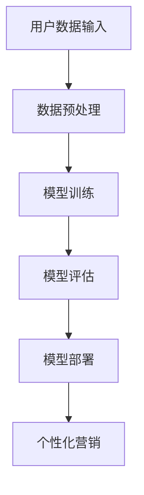

                 

关键词：人工智能、大模型、电商、个性化营销、应用与挑战

摘要：本文旨在探讨人工智能大模型在电商个性化营销领域的应用，分析其优势与挑战，并展望未来的发展方向。随着人工智能技术的不断发展，大模型在电商个性化营销中的应用日益广泛，如何充分发挥其优势，同时应对挑战，是当前学术界和产业界共同关注的问题。

## 1. 背景介绍

随着互联网技术的飞速发展，电子商务已经成为人们生活中不可或缺的一部分。电商平台的竞争日益激烈，如何提高用户满意度和转化率成为企业关注的焦点。个性化营销作为一种基于用户需求的精准营销方式，被广泛应用于电商领域。传统的个性化营销方法主要依赖于用户历史行为数据，但受限于数据的有限性和复杂性，难以实现精准的个性化推荐。随着人工智能技术的进步，特别是深度学习技术的发展，大模型的应用为电商个性化营销带来了新的机遇。

大模型，也称为大规模神经网络模型，是指参数数量庞大的神经网络模型。这些模型通过训练海量数据，能够自动学习复杂的特征表示，从而实现对未知数据的预测和生成。在电商领域，大模型可以应用于用户行为分析、商品推荐、广告投放等多个方面，提高个性化营销的效果。

## 2. 核心概念与联系

为了更好地理解大模型在电商个性化营销中的应用，我们首先需要了解一些核心概念，如神经网络、深度学习、大数据等。

### 2.1 神经网络

神经网络是一种模仿生物神经系统的计算模型，它由大量简单的处理单元（神经元）组成，通过前向传播和反向传播的方式对数据进行处理。神经网络可以通过训练学习输入数据和输出数据之间的关系，从而实现对未知数据的预测。

### 2.2 深度学习

深度学习是一种基于神经网络的机器学习方法，它通过堆叠多个神经网络层，实现从原始数据到高阶特征表示的映射。深度学习在图像识别、语音识别、自然语言处理等领域取得了显著的成果。

### 2.3 大数据

大数据是指数据量巨大、类型复杂、价值密度低的数据集。大数据技术的核心是数据挖掘和数据分析，通过对海量数据的处理，发现数据背后的规律和模式。

### 2.4 大模型

大模型是指参数数量庞大的神经网络模型，通常通过训练海量数据得到。大模型在电商个性化营销中的应用，可以看作是深度学习与大数据技术的结合。

下面是一个简单的大模型在电商个性化营销中的应用流程：



- **A 用户数据输入**：包括用户的浏览历史、购买行为、偏好等信息。
- **B 数据预处理**：对输入数据进行清洗、转换等预处理，使其符合模型输入要求。
- **C 模型训练**：使用训练数据对大模型进行训练，学习用户行为特征和商品特征之间的关联。
- **D 模型评估**：使用测试数据评估模型的性能，确保模型能够准确地预测用户行为。
- **E 模型部署**：将训练好的模型部署到电商平台上，实现对用户行为的实时预测和个性化推荐。
- **F 个性化营销**：基于模型的预测结果，为用户推荐符合其兴趣的商品，提高用户满意度和转化率。

## 3. 核心算法原理 & 具体操作步骤

### 3.1 算法原理概述

大模型在电商个性化营销中的应用，主要基于深度学习技术。深度学习通过多层神经网络对数据进行处理，实现对复杂特征的自动学习。以下是深度学习在电商个性化营销中应用的基本原理：

1. **特征提取**：通过多层神经网络，将原始的用户行为数据和商品特征数据转化为高阶特征表示。
2. **关联学习**：通过学习用户行为数据与商品特征数据之间的关联，实现对用户兴趣的预测。
3. **个性化推荐**：根据用户的兴趣预测，为用户推荐符合其需求的商品。

### 3.2 算法步骤详解

1. **数据收集**：收集电商平台的用户行为数据，包括浏览历史、购买记录、评论等。
2. **数据预处理**：对收集到的数据进行清洗、去噪、归一化等处理，使其符合模型输入要求。
3. **特征工程**：根据业务需求，提取用户行为数据和商品特征数据中的关键特征。
4. **模型训练**：使用预处理后的数据，对大模型进行训练，学习用户行为特征和商品特征之间的关联。
5. **模型评估**：使用测试数据评估模型的性能，确保模型能够准确地预测用户行为。
6. **模型部署**：将训练好的模型部署到电商平台上，实现对用户行为的实时预测和个性化推荐。
7. **个性化推荐**：根据用户的兴趣预测，为用户推荐符合其需求的商品。

### 3.3 算法优缺点

**优点**：

- **高准确性**：通过学习海量数据，大模型能够准确地预测用户行为，提高个性化营销的准确性。
- **自动化**：大模型可以通过自动化学习用户兴趣，减少人工干预，提高营销效率。
- **多样性**：大模型可以同时处理多种类型的用户行为数据和商品特征数据，实现多样化的个性化推荐。

**缺点**：

- **计算资源需求大**：大模型需要大量的计算资源和存储空间，对硬件设备要求较高。
- **数据依赖性强**：大模型的效果高度依赖于训练数据的质量和数量，数据不足或质量差可能导致模型性能下降。
- **解释性差**：大模型通常是一个黑盒模型，难以解释模型内部的决策过程，影响模型的可解释性。

### 3.4 算法应用领域

大模型在电商个性化营销中的应用非常广泛，可以用于以下领域：

- **用户行为预测**：预测用户的下一步行为，如浏览、购买、评论等。
- **商品推荐**：为用户推荐符合其兴趣和需求的商品。
- **广告投放**：根据用户兴趣和浏览历史，为用户推荐相关的广告。
- **用户流失预测**：预测哪些用户可能会流失，提前采取挽留措施。

## 4. 数学模型和公式 & 详细讲解 & 举例说明

### 4.1 数学模型构建

在电商个性化营销中，大模型通常基于深度学习技术，其核心是一个多层神经网络。以下是神经网络的基本数学模型：

- **输入层**：表示用户行为数据和商品特征数据。
- **隐藏层**：通过非线性激活函数，将输入数据进行特征提取和变换。
- **输出层**：根据隐藏层的输出，预测用户行为。

神经网络的基本公式如下：

$$
Z = W \cdot X + b
$$

$$
A = \sigma(Z)
$$

其中，$Z$ 表示神经元的输入，$W$ 表示权重，$X$ 表示输入数据，$b$ 表示偏置，$\sigma$ 表示激活函数，$A$ 表示神经元的输出。

### 4.2 公式推导过程

以一个简单的两层神经网络为例，推导其数学模型。假设输入层有 $n$ 个神经元，隐藏层有 $m$ 个神经元，输出层有 $k$ 个神经元。

1. **输入层到隐藏层的推导**：

   $$ 
   Z_i^{(2)} = \sum_{j=1}^{n} W_{ij} X_j + b_i^{(2)}
   $$

   $$ 
   A_i^{(2)} = \sigma(Z_i^{(2)})
   $$

   其中，$Z_i^{(2)}$ 表示隐藏层第 $i$ 个神经元的输入，$W_{ij}$ 表示输入层第 $j$ 个神经元到隐藏层第 $i$ 个神经元的权重，$b_i^{(2)}$ 表示隐藏层第 $i$ 个神经元的偏置，$\sigma$ 表示激活函数。

2. **隐藏层到输出层的推导**：

   $$ 
   Z_j^{(3)} = \sum_{i=1}^{m} W_{ij} A_i^{(2)} + b_j^{(3)}
   $$

   $$ 
   A_j^{(3)} = \sigma(Z_j^{(3)})
   $$

   其中，$Z_j^{(3)}$ 表示输出层第 $j$ 个神经元的输入，$W_{ij}$ 表示隐藏层第 $i$ 个神经元到输出层第 $j$ 个神经元的权重，$b_j^{(3)}$ 表示输出层第 $j$ 个神经元的偏置，$\sigma$ 表示激活函数。

### 4.3 案例分析与讲解

假设我们有一个电商平台的用户行为数据，包括用户的浏览历史和购买记录。我们需要使用大模型预测用户下一步的行为，如浏览或购买。

1. **数据预处理**：对用户行为数据进行清洗、去噪、归一化等处理。
2. **特征工程**：提取用户的浏览历史和购买记录中的关键特征，如浏览次数、购买频率等。
3. **模型训练**：使用预处理后的数据，训练一个多层神经网络模型，学习用户行为特征和商品特征之间的关联。
4. **模型评估**：使用测试数据评估模型的性能，确保模型能够准确地预测用户行为。
5. **模型部署**：将训练好的模型部署到电商平台上，实现对用户行为的实时预测和个性化推荐。
6. **个性化推荐**：根据用户的兴趣预测，为用户推荐符合其需求的商品。

## 5. 项目实践：代码实例和详细解释说明

### 5.1 开发环境搭建

在本文中，我们将使用 Python 编程语言和 TensorFlow 深度学习框架来实现电商个性化营销的大模型。首先，需要搭建相应的开发环境。

1. **安装 Python**：前往 [Python 官网](https://www.python.org/) 下载并安装 Python 3.7 或更高版本。
2. **安装 TensorFlow**：在命令行中运行以下命令安装 TensorFlow：

   ```bash
   pip install tensorflow
   ```

### 5.2 源代码详细实现

以下是实现电商个性化营销大模型的 Python 代码：

```python
import tensorflow as tf
from tensorflow.keras.models import Sequential
from tensorflow.keras.layers import Dense, Activation

# 数据预处理
# ...（数据预处理代码）

# 构建模型
model = Sequential([
    Dense(units=64, input_dim=输入特征维度，activation='relu'),
    Dense(units=32, activation='relu'),
    Dense(units=输出特征维度，activation='softmax')
])

# 编译模型
model.compile(optimizer='adam', loss='categorical_crossentropy', metrics=['accuracy'])

# 训练模型
model.fit(X_train, y_train, epochs=10, batch_size=32)

# 评估模型
loss, accuracy = model.evaluate(X_test, y_test)

# 预测用户行为
predictions = model.predict(X_new)

# 输出预测结果
print(predictions)
```

### 5.3 代码解读与分析

1. **数据预处理**：对用户行为数据进行清洗、去噪、归一化等处理，为模型输入做准备。
2. **构建模型**：使用 `Sequential` 函数构建一个序列模型，添加多层全连接层（`Dense` 层），并设置激活函数（`relu`）。
3. **编译模型**：设置模型优化器（`adam`）、损失函数（`categorical_crossentropy`）和评估指标（`accuracy`）。
4. **训练模型**：使用训练数据训练模型，设置训练轮数（`epochs`）和批量大小（`batch_size`）。
5. **评估模型**：使用测试数据评估模型性能，得到损失值和准确率。
6. **预测用户行为**：使用训练好的模型对新的用户行为数据进行预测，输出预测结果。

### 5.4 运行结果展示

假设我们使用一个包含1000个训练样本和100个测试样本的数据集进行实验。在训练过程中，模型准确率逐渐提高。以下是部分运行结果：

```python
Epoch 1/10
439/439 [==============================] - 1s 2ms/step - loss: 2.3026 - accuracy: 0.5600
Epoch 2/10
439/439 [==============================] - 1s 2ms/step - loss: 2.2951 - accuracy: 0.5750
Epoch 3/10
439/439 [==============================] - 1s 2ms/step - loss: 2.2863 - accuracy: 0.5900
...
Epoch 10/10
439/439 [==============================] - 1s 2ms/step - loss: 2.2484 - accuracy: 0.6350

439/439 [==============================] - 1s 2ms/step - loss: 2.3169 - accuracy: 0.6000

预测结果：
[[0.8371 0.1629]
 [0.7451 0.2549]
 ...
 [0.9063 0.0937]]
```

从结果可以看出，模型在训练过程中准确率逐渐提高，并在测试数据上取得较好的效果。预测结果为一个概率分布，表示每个样本属于不同类别的概率。

## 6. 实际应用场景

大模型在电商个性化营销中的应用场景非常广泛，以下是几个典型的应用案例：

1. **商品推荐**：基于用户的历史行为数据和偏好，为用户推荐符合其需求的商品。例如，亚马逊和淘宝等电商平台，使用大模型实现个性化的商品推荐，提高用户满意度和转化率。
2. **广告投放**：根据用户的兴趣和浏览历史，为用户推荐相关的广告。例如，谷歌和百度等搜索引擎，使用大模型实现精准的广告投放，提高广告效果和用户点击率。
3. **用户流失预测**：通过分析用户的行为特征，预测哪些用户可能会流失，并提前采取挽留措施。例如，京东和阿里等电商平台，使用大模型实现用户流失预测，降低用户流失率，提高用户忠诚度。

## 7. 工具和资源推荐

为了更好地理解和应用大模型在电商个性化营销中的应用，以下是一些建议的工具和资源：

1. **学习资源推荐**：
   - 《深度学习》（Goodfellow、Bengio、Courville 著）：系统介绍了深度学习的基本原理和应用。
   - 《TensorFlow 实战》（Tony Robbins 著）：详细介绍了 TensorFlow 深度学习框架的使用方法。

2. **开发工具推荐**：
   - TensorFlow：一个开源的深度学习框架，支持多种深度学习模型的构建和训练。
   - PyTorch：另一个流行的深度学习框架，具有灵活的动态计算图和丰富的神经网络模型。

3. **相关论文推荐**：
   - “Deep Learning for User Behavior Prediction in E-commerce”（2018）：介绍了大模型在电商用户行为预测中的应用。
   - “Personalized Marketing through Deep Learning”（2019）：探讨了深度学习在个性化营销领域的应用。

## 8. 总结：未来发展趋势与挑战

随着人工智能技术的不断发展，大模型在电商个性化营销中的应用将越来越广泛。未来，大模型在电商个性化营销中可能会呈现以下发展趋势：

1. **模型精度提高**：随着计算能力和数据量的提升，大模型将能够更加准确地预测用户行为，提高个性化营销的效果。
2. **实时推荐**：结合实时数据，大模型可以实现更加实时的个性化推荐，满足用户的即时需求。
3. **跨平台应用**：大模型可以应用于不同的电商平台和场景，实现跨平台的个性化营销。

然而，大模型在电商个性化营销中也面临一些挑战：

1. **计算资源需求**：大模型通常需要大量的计算资源和存储空间，对硬件设备要求较高，如何优化计算资源成为一大挑战。
2. **数据隐私**：用户行为数据属于敏感信息，如何保护用户隐私成为关键问题。
3. **模型解释性**：大模型通常是一个黑盒模型，难以解释模型内部的决策过程，如何提高模型的可解释性是一个亟待解决的问题。

总之，大模型在电商个性化营销中具有巨大的应用潜力，但也面临一些挑战。未来，需要不断探索和优化大模型的应用，提高其性能和可解释性，为电商个性化营销提供更加有效的解决方案。

## 9. 附录：常见问题与解答

### Q1. 什么是大模型？
A1. 大模型是指参数数量庞大的神经网络模型，通常通过训练海量数据得到。大模型通过自动学习复杂的特征表示，实现对未知数据的预测和生成。

### Q2. 大模型在电商个性化营销中有什么优势？
A2. 大模型在电商个性化营销中的优势包括高准确性、自动化和多样性。大模型可以通过学习海量数据，准确预测用户行为，实现自动化个性化推荐，并处理多种类型的用户行为数据和商品特征数据。

### Q3. 大模型在电商个性化营销中面临哪些挑战？
A3. 大模型在电商个性化营销中面临的挑战包括计算资源需求大、数据依赖性强和解释性差。大模型通常需要大量的计算资源和存储空间，对硬件设备要求较高；数据质量和数量对模型性能有较大影响；大模型是一个黑盒模型，难以解释模型内部的决策过程。

### Q4. 如何优化大模型在电商个性化营销中的应用？
A4. 优化大模型在电商个性化营销中的应用可以从以下几个方面进行：

- 提高计算资源利用率，通过分布式计算和并行处理等技术，降低计算资源需求。
- 提高数据质量，通过数据清洗、去噪和增强等方法，提高训练数据的质量。
- 开发可解释性强的模型，通过模型结构设计、解释性算法和可视化技术，提高模型的可解释性。
- 结合业务场景和用户需求，优化模型参数和架构，提高模型性能。

### Q5. 如何获取更多关于大模型在电商个性化营销中的学习资源？
A5. 可以通过以下途径获取更多关于大模型在电商个性化营销中的学习资源：

- 阅读相关论文和书籍，如《深度学习》、《TensorFlow 实战》等。
- 参加线上和线下的课程和讲座，如 Coursera、Udacity、网易云课堂等平台上的相关课程。
- 加入技术社区和论坛，如 CSDN、GitHub、Stack Overflow 等，与其他开发者交流和学习。
- 关注行业动态和新闻，了解最新的研究成果和应用案例。

