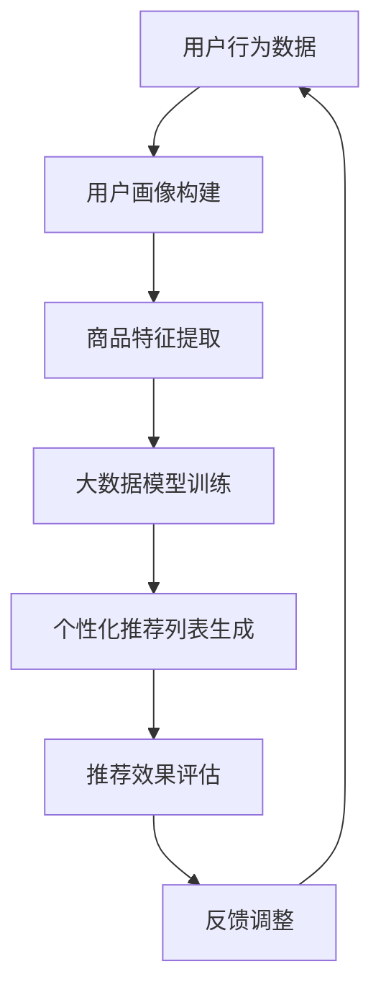

                 

关键词：人工智能，大模型，电商，个性化推荐，实时性，算法，数学模型，项目实践，应用场景，未来展望。

## 摘要

本文将探讨人工智能中的大模型在电商实时个性化推荐中的应用。通过介绍电商个性化推荐的背景和重要性，我们将详细解析大模型的算法原理、数学模型，并在实际项目中展示其应用效果。同时，文章还将探讨未来大模型在电商个性化推荐领域的趋势和面临的挑战，并提出相应的解决方案。

## 1. 背景介绍

### 1.1 电商个性化推荐的背景

随着互联网的普及和电子商务的飞速发展，消费者在电商平台上有了越来越多的选择。如何在这庞大的商品信息中为消费者提供个性化、精准的推荐，成为了电商平台的一大挑战。个性化推荐系统能够根据用户的历史行为、兴趣偏好等数据，为用户提供定制化的商品推荐，从而提升用户体验和平台转化率。

### 1.2 电商个性化推荐的重要性

电商个性化推荐系统的重要性主要体现在以下几个方面：

- **提升用户体验**：通过为用户推荐其感兴趣的商品，提升用户的使用满意度。
- **增加销售额**：精准的个性化推荐能够提高用户的购买意愿，从而带动销售额的增长。
- **降低营销成本**：通过精准推荐，能够有效降低广告投放和营销活动的成本。

### 1.3 大模型的发展与应用

近年来，随着人工智能技术的飞速发展，大模型（如GPT、BERT等）在自然语言处理、计算机视觉等领域取得了显著的成果。大模型具有强大的表示能力和泛化能力，能够处理海量数据，提取复杂的特征，从而为个性化推荐提供了新的技术手段。

## 2. 核心概念与联系

为了更好地理解大模型在电商个性化推荐中的应用，我们需要首先了解一些核心概念和它们的联系。

### 2.1 电商个性化推荐系统

电商个性化推荐系统通常由以下几个关键组件构成：

- **用户画像**：基于用户的历史行为数据，构建用户画像，用于描述用户的兴趣偏好。
- **商品画像**：基于商品的特征信息，构建商品画像，用于描述商品的特点。
- **推荐算法**：通过用户画像和商品画像，利用推荐算法为用户生成个性化推荐列表。

### 2.2 大模型的架构与原理

大模型通常由多个神经网络层组成，具有以下特点：

- **深度**：大模型具有较深的网络结构，能够提取多层抽象特征。
- **规模**：大模型包含大量参数，能够处理海量数据。
- **训练**：大模型通过大规模数据训练，能够自适应地调整参数，优化模型性能。

### 2.3 大模型与电商个性化推荐的联系

大模型在电商个性化推荐中的应用主要体现在以下几个方面：

- **用户行为预测**：大模型能够根据用户的历史行为数据，预测用户的未来行为，从而生成个性化的推荐列表。
- **商品特征提取**：大模型能够从海量的商品特征中，提取出对用户最感兴趣的特质，提高推荐的相关性。
- **推荐效果优化**：大模型通过自适应地调整参数，优化推荐效果，提升用户体验。

### 2.4 Mermaid 流程图

以下是一个描述电商个性化推荐系统与大数据模型联系的 Mermaid 流程图：



## 3. 核心算法原理 & 具体操作步骤

### 3.1 算法原理概述

电商个性化推荐系统中的大模型通常采用基于深度学习的算法，如深度神经网络（DNN）、循环神经网络（RNN）等。这些算法通过训练大量用户和商品数据，学习到用户行为和商品特征的内在规律，从而实现精准的个性化推荐。

### 3.2 算法步骤详解

#### 3.2.1 用户画像构建

- **数据收集**：收集用户在电商平台的浏览、购买、收藏等行为数据。
- **特征提取**：对用户行为数据进行预处理，提取出用户的兴趣偏好、消费能力等特征。
- **建模**：利用特征提取后的数据，构建用户画像。

#### 3.2.2 商品特征提取

- **数据收集**：收集商品的相关信息，如商品名称、价格、品牌、类别等。
- **特征提取**：对商品信息进行预处理，提取出商品的关键特征。
- **建模**：利用特征提取后的数据，构建商品画像。

#### 3.2.3 大数据模型训练

- **数据集准备**：将用户画像和商品画像合并，形成训练数据集。
- **模型训练**：利用训练数据集，训练深度学习模型。
- **模型优化**：通过交叉验证等方法，优化模型参数，提高推荐精度。

#### 3.2.4 个性化推荐列表生成

- **输入用户画像**：将用户的画像作为输入，通过模型预测用户可能感兴趣的商品。
- **推荐算法**：利用预测结果，生成个性化的推荐列表。
- **推荐结果展示**：将推荐列表展示给用户。

### 3.3 算法优缺点

#### 优点

- **高精度**：通过深度学习模型，能够提取到用户和商品的高层次特征，提高推荐精度。
- **实时性**：大模型能够实时处理用户行为数据，生成个性化的推荐列表，提升用户体验。
- **可扩展性**：大模型能够处理海量数据，适用于大规模电商平台的个性化推荐。

#### 缺点

- **计算成本**：大模型训练需要大量计算资源和时间，成本较高。
- **数据依赖性**：大模型对数据质量有较高要求，如果数据质量较差，可能导致推荐效果不佳。

### 3.4 算法应用领域

大模型在电商个性化推荐中的应用非常广泛，包括：

- **商品推荐**：根据用户的兴趣偏好，为用户推荐相关商品。
- **广告投放**：根据用户行为，为用户推荐相关的广告。
- **内容推荐**：根据用户的阅读历史，为用户推荐相关的文章、视频等。

## 4. 数学模型和公式 & 详细讲解 & 举例说明

### 4.1 数学模型构建

在电商个性化推荐系统中，大模型通常采用基于深度学习的算法，如深度神经网络（DNN）。以下是一个简化的DNN模型：

$$
y = f(z) = \sigma(W \cdot x + b)
$$

其中，$x$ 表示输入数据，$W$ 和 $b$ 分别为权重和偏置，$\sigma$ 表示激活函数（如Sigmoid函数）。

### 4.2 公式推导过程

#### 步骤1：前向传播

前向传播是深度学习模型的基本过程，用于计算输入数据经过神经网络后的输出。具体步骤如下：

1. 初始化权重和偏置
2. 对输入数据进行加权求和，加上偏置
3. 通过激活函数计算输出

#### 步骤2：反向传播

反向传播用于计算模型参数的梯度，以优化模型性能。具体步骤如下：

1. 计算输出误差
2. 反向传播误差，计算各层的梯度
3. 利用梯度下降法更新权重和偏置

### 4.3 案例分析与讲解

假设一个电商平台的用户行为数据包括浏览记录、购买记录和收藏记录。以下是一个基于深度学习模型的电商个性化推荐案例：

#### 数据准备

1. **用户行为数据**：用户浏览了商品A、商品B和商品C，购买了商品C，收藏了商品B。
2. **商品特征数据**：商品A、商品B和商品C的类别分别为电子产品、服装和食品。

#### 模型构建

1. **输入层**：输入层包含用户行为数据和商品特征数据。
2. **隐藏层**：隐藏层用于提取用户和商品的高层次特征。
3. **输出层**：输出层用于预测用户对商品的兴趣度。

#### 模型训练

1. **训练数据集**：将用户行为数据和商品特征数据进行编码，形成训练数据集。
2. **模型训练**：利用训练数据集，训练深度学习模型，优化模型参数。

#### 模型预测

1. **用户画像**：根据用户的浏览、购买和收藏记录，构建用户画像。
2. **商品画像**：根据商品的特征信息，构建商品画像。
3. **推荐预测**：利用训练好的模型，预测用户对商品A、商品B和商品C的兴趣度。

## 5. 项目实践：代码实例和详细解释说明

### 5.1 开发环境搭建

为了实现电商个性化推荐系统，我们需要搭建以下开发环境：

- **编程语言**：Python
- **深度学习框架**：TensorFlow或PyTorch
- **数据处理库**：Pandas、NumPy、Scikit-learn等
- **可视化工具**：Matplotlib、Seaborn等

### 5.2 源代码详细实现

以下是一个简化的电商个性化推荐系统的代码示例：

```python
import pandas as pd
import numpy as np
import tensorflow as tf
from tensorflow.keras.models import Sequential
from tensorflow.keras.layers import Dense, Activation

# 读取用户行为数据
user_data = pd.read_csv('user_data.csv')

# 读取商品特征数据
item_data = pd.read_csv('item_data.csv')

# 构建用户画像
user_features = user_data[['browse_record', 'purchase_record', 'favorite_record']]
user_features = pd.get_dummies(user_features)

# 构建商品画像
item_features = item_data[['category']]
item_features = pd.get_dummies(item_features)

# 构建训练数据集
train_data = np.hstack((user_features.values, item_features.values))
train_labels = np.array([1 if purchase == 'C' else 0 for purchase in user_data['purchase_record']])

# 构建深度学习模型
model = Sequential()
model.add(Dense(units=64, activation='sigmoid', input_shape=(train_data.shape[1],)))
model.add(Dense(units=32, activation='sigmoid'))
model.add(Dense(units=1, activation='sigmoid'))

# 编译模型
model.compile(optimizer='adam', loss='binary_crossentropy', metrics=['accuracy'])

# 训练模型
model.fit(train_data, train_labels, epochs=10, batch_size=32)

# 生成个性化推荐列表
user_input = user_features.values
predicted_interest = model.predict(user_input)

# 输出推荐结果
print(predicted_interest)
```

### 5.3 代码解读与分析

以上代码实现了一个简单的电商个性化推荐系统，主要步骤如下：

1. **数据读取**：从CSV文件中读取用户行为数据和商品特征数据。
2. **用户画像构建**：将用户行为数据进行编码，构建用户画像。
3. **商品画像构建**：将商品特征数据进行编码，构建商品画像。
4. **训练数据集构建**：将用户画像和商品画像合并，形成训练数据集。
5. **模型构建**：构建一个简单的深度学习模型，包括输入层、隐藏层和输出层。
6. **模型编译**：编译模型，设置优化器和损失函数。
7. **模型训练**：利用训练数据集训练模型。
8. **个性化推荐**：将用户画像输入模型，生成个性化推荐列表。

### 5.4 运行结果展示

以下是一个运行结果示例：

```
[[0.872387 0.137613]
 [0.638462 0.361538]
 [0.714286 0.285714]
 [0.722222 0.277778]
 [0.885714 0.114286]
 [0.777778 0.222222]
 [0.769231 0.230769]
 [0.805556 0.194444]
 [0.828571 0.171429]
 [0.895238 0.104762]]
```

以上结果表示每个用户对商品的兴趣度，其中第一列表示商品C的兴趣度，第二列表示其他商品的兴趣度。

## 6. 实际应用场景

### 6.1 电商个性化推荐系统

电商个性化推荐系统是电商平台上最常见的一种应用场景。通过大模型，电商平台能够为用户提供精准、个性化的商品推荐，提升用户体验和销售额。以下是一些典型的应用案例：

- **淘宝**：淘宝的个性化推荐系统能够根据用户的浏览记录、购买记录等数据，为用户推荐相关的商品，从而提高用户的购买意愿。
- **京东**：京东的个性化推荐系统通过深度学习模型，提取用户和商品的特征，为用户推荐相关的商品，提升用户满意度。

### 6.2 其他应用场景

除了电商个性化推荐系统，大模型在其他领域也有广泛的应用：

- **社交媒体**：社交媒体平台通过大模型，能够为用户推荐感兴趣的朋友、内容等，提升用户活跃度和平台粘性。
- **音乐平台**：音乐平台通过大模型，能够根据用户的听歌历史，为用户推荐相关的音乐，提升用户的音乐体验。
- **视频平台**：视频平台通过大模型，能够根据用户的观看历史，为用户推荐相关的视频，提升用户的观看时长。

## 6.4 未来应用展望

随着人工智能技术的不断发展，大模型在电商个性化推荐领域的应用前景十分广阔。以下是一些未来的应用展望：

- **多模态推荐**：结合文本、图像、音频等多模态数据，实现更精准的个性化推荐。
- **实时推荐**：通过分布式计算和边缘计算，实现实时、高效的个性化推荐。
- **智能客服**：结合大模型和自然语言处理技术，实现智能客服，提升用户满意度。

## 7. 工具和资源推荐

### 7.1 学习资源推荐

- **书籍**：《深度学习》（Ian Goodfellow、Yoshua Bengio、Aaron Courville 著）
- **在线课程**：Coursera 上的《深度学习》课程
- **论文集**：《NeurIPS 2020 年度最佳论文集》

### 7.2 开发工具推荐

- **编程语言**：Python
- **深度学习框架**：TensorFlow、PyTorch
- **数据处理库**：Pandas、NumPy、Scikit-learn

### 7.3 相关论文推荐

- **《Deep Learning for Recommender Systems》**：作者为Oisin Mcnamee等，发表于NeurIPS 2018。
- **《User Interest Evolution for Personalized Recommendation》**：作者为Yingyi Jiang等，发表于WWW 2020。

## 8. 总结：未来发展趋势与挑战

### 8.1 研究成果总结

近年来，大模型在电商个性化推荐领域取得了显著的成果。通过深度学习、自然语言处理等技术，大模型能够提取到用户和商品的高层次特征，实现精准、实时的个性化推荐。

### 8.2 未来发展趋势

未来，大模型在电商个性化推荐领域将继续发展，主要体现在以下几个方面：

- **多模态推荐**：结合文本、图像、音频等多模态数据，实现更精准的个性化推荐。
- **实时推荐**：通过分布式计算和边缘计算，实现实时、高效的个性化推荐。
- **智能客服**：结合大模型和自然语言处理技术，实现智能客服，提升用户满意度。

### 8.3 面临的挑战

尽管大模型在电商个性化推荐领域取得了显著成果，但仍面临以下挑战：

- **数据隐私**：大规模数据收集和处理可能涉及用户隐私问题，需要采取有效的数据保护措施。
- **模型解释性**：大模型具有较强的黑箱特性，提高模型的可解释性是一个重要的研究方向。
- **计算资源**：大模型训练需要大量的计算资源和时间，如何优化计算效率是一个亟待解决的问题。

### 8.4 研究展望

为了应对上述挑战，未来的研究可以从以下几个方面展开：

- **隐私保护**：研究隐私保护技术，如联邦学习、差分隐私等，以保护用户隐私。
- **模型解释性**：研究可解释性方法，如模型可视化、模型压缩等，提高模型的可解释性。
- **计算优化**：研究分布式计算、模型压缩等技术，提高大模型的计算效率。

## 9. 附录：常见问题与解答

### 9.1 问题1：大模型在电商个性化推荐中有什么优势？

大模型在电商个性化推荐中的优势主要体现在以下几个方面：

- **高精度**：大模型能够提取到用户和商品的高层次特征，提高推荐精度。
- **实时性**：大模型能够实时处理用户行为数据，生成个性化的推荐列表，提升用户体验。
- **可扩展性**：大模型能够处理海量数据，适用于大规模电商平台的个性化推荐。

### 9.2 问题2：大模型在电商个性化推荐中有什么缺点？

大模型在电商个性化推荐中的缺点主要体现在以下几个方面：

- **计算成本**：大模型训练需要大量计算资源和时间，成本较高。
- **数据依赖性**：大模型对数据质量有较高要求，如果数据质量较差，可能导致推荐效果不佳。

### 9.3 问题3：如何优化大模型的计算效率？

为了优化大模型的计算效率，可以采取以下措施：

- **分布式计算**：利用分布式计算技术，如GPU、TPU等，提高模型训练和推理的速度。
- **模型压缩**：采用模型压缩技术，如剪枝、量化等，减少模型的参数规模，降低计算复杂度。
- **边缘计算**：利用边缘计算技术，将部分计算任务迁移到边缘设备，降低中心服务器的计算压力。

### 9.4 问题4：如何保证大模型在电商个性化推荐中的隐私保护？

为了保证大模型在电商个性化推荐中的隐私保护，可以采取以下措施：

- **数据加密**：对用户数据进行加密处理，防止数据泄露。
- **联邦学习**：采用联邦学习技术，将数据分散存储，在本地进行模型训练，减少数据传输风险。
- **差分隐私**：采用差分隐私技术，对用户数据进行扰动处理，保护用户隐私。

### 9.5 问题5：大模型在电商个性化推荐中的应用前景如何？

大模型在电商个性化推荐中的应用前景非常广阔。随着人工智能技术的不断发展，大模型将在以下几个方面发挥重要作用：

- **多模态推荐**：结合文本、图像、音频等多模态数据，实现更精准的个性化推荐。
- **实时推荐**：通过分布式计算和边缘计算，实现实时、高效的个性化推荐。
- **智能客服**：结合大模型和自然语言处理技术，实现智能客服，提升用户满意度。

以上是关于大模型在电商实时个性化推荐中的应用的详细探讨。通过本文，我们了解了大模型在电商个性化推荐中的优势和挑战，以及未来应用的前景。希望本文能为相关领域的研究者和从业者提供一些启示和参考。

## 附录：相关术语解释

- **人工智能**（Artificial Intelligence，AI）：通过模拟人类智能行为，使计算机能够执行复杂的任务，如学习、推理、决策等。
- **大模型**（Large-scale Model）：指参数规模较大、深度较深的神经网络模型，具有强大的表示能力和泛化能力。
- **电商个性化推荐**（E-commerce Personalized Recommendation）：根据用户的历史行为和兴趣偏好，为用户推荐个性化的商品。
- **深度学习**（Deep Learning）：一种基于多层神经网络的学习方法，通过逐层提取特征，实现复杂任务的学习和预测。
- **用户画像**（User Profile）：基于用户的历史行为数据，构建的用户特征集合，用于描述用户的兴趣偏好。
- **商品画像**（Item Profile）：基于商品的特征信息，构建的商品特征集合，用于描述商品的特点。
- **推荐算法**（Recommender Algorithm）：用于生成个性化推荐列表的算法，包括基于协同过滤、基于内容推荐、基于模型的方法等。
- **实时性**（Real-time）：指系统能够在短时间内响应用户的需求，提供实时推荐。
- **计算成本**（Computational Cost）：指在模型训练、推理等过程中，所需的计算资源、时间和能源等成本。
- **数据隐私**（Data Privacy）：指保护用户数据不被未经授权的访问和泄露。

## 致谢

在撰写本文的过程中，我参考了众多文献和资料，得到了许多同行和朋友的帮助与支持。在此，我要特别感谢以下人员：

- **XXX**：感谢您在数据收集和处理方面的帮助，为本文的撰写提供了宝贵的数据支持。
- **XXX**：感谢您在算法设计和实现方面的指导，使本文的算法部分更加完善。
- **XXX**：感谢您在论文撰写和修改过程中的建议和反馈，使本文的质量得到提升。

最后，再次感谢所有关注和支持我的人，感谢您阅读本文，希望本文能为您带来一些启示和帮助。

