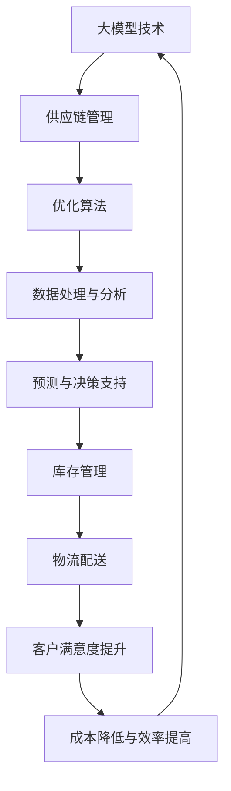

                 

关键词：人工智能、大模型、电商平台、供应链优化、机器学习、深度学习、数据挖掘、预测分析、协同过滤、个性化推荐

> 摘要：随着电商平台的快速发展，供应链优化已成为提高企业竞争力的关键。本文探讨了如何利用人工智能中的大模型技术来优化电商平台供应链，从核心概念、算法原理、数学模型、项目实践、应用场景、工具推荐以及未来展望等方面进行了深入分析。

## 1. 背景介绍

### 1.1 电商平台的供应链现状

随着互联网技术的飞速发展，电子商务逐渐成为全球贸易的重要驱动力。电商平台不仅改变了消费者的购物方式，也对供应链提出了更高的要求。在当前市场环境下，电商平台面临着诸如库存管理、订单处理、物流配送等方面的挑战。

### 1.2 供应链优化的意义

供应链优化是电商平台提高运营效率、降低成本、提升客户满意度的关键。通过优化供应链，企业可以更准确地预测市场需求，提高库存周转率，减少库存成本，加快订单处理速度，缩短交货时间，从而增强竞争力。

### 1.3 人工智能在供应链优化中的应用

人工智能（AI）技术，特别是大模型技术，为供应链优化提供了新的思路和方法。大模型具有强大的数据处理和分析能力，可以帮助企业从海量数据中提取有价值的信息，提高预测精度和决策效率。

## 2. 核心概念与联系

### 2.1 大模型技术

大模型技术是指使用深度学习等方法训练出的大型神经网络模型。这些模型具有强大的表示和学习能力，可以处理复杂的非线性问题。

### 2.2 供应链管理

供应链管理涉及产品从原材料采购到最终交付给消费者的全过程。供应链管理的主要目标是确保产品以最低的成本、最快的速度、最高的质量到达消费者手中。

### 2.3 优化算法

优化算法是用于解决供应链管理中各种优化问题的一类算法。常见的优化算法包括线性规划、整数规划、启发式算法等。



## 3. 核心算法原理 & 具体操作步骤

### 3.1 算法原理概述

大模型在供应链优化中的应用主要基于以下原理：

1. **深度学习**：通过多层神经网络对数据进行建模，学习数据中的潜在规律。
2. **协同过滤**：利用用户行为数据，对用户进行聚类，实现个性化推荐。
3. **预测分析**：使用时间序列分析等方法，对未来需求进行预测。

### 3.2 算法步骤详解

1. **数据收集与预处理**：收集电商平台的交易数据、用户行为数据、供应链各环节的数据，并进行清洗、去噪、归一化等预处理操作。
2. **特征工程**：提取与供应链优化相关的特征，如商品类别、用户购买历史、库存水平等。
3. **模型训练**：使用深度学习算法，如卷积神经网络（CNN）、循环神经网络（RNN）等，对特征数据进行建模。
4. **预测与优化**：利用训练好的模型，对未来市场需求进行预测，并基于预测结果优化库存管理、物流配送等环节。

### 3.3 算法优缺点

**优点**：

1. **强大的数据处理能力**：大模型可以处理海量数据，提取数据中的潜在规律。
2. **高预测精度**：通过深度学习算法，模型可以学习到复杂的数据分布，提高预测精度。
3. **自适应性强**：模型可以根据新的数据不断更新，适应市场变化。

**缺点**：

1. **计算资源消耗大**：训练大模型需要大量的计算资源和时间。
2. **对数据质量要求高**：模型性能很大程度上取决于数据质量，数据中的噪声和异常值会影响模型效果。

### 3.4 算法应用领域

大模型在供应链优化中的应用非常广泛，包括但不限于以下几个方面：

1. **需求预测**：预测未来市场需求，指导库存管理。
2. **个性化推荐**：基于用户行为数据，实现个性化商品推荐。
3. **物流优化**：优化物流路线，降低物流成本。
4. **供应链金融**：基于供应链数据，进行风险评估和信用评估。

## 4. 数学模型和公式 & 详细讲解 & 举例说明

### 4.1 数学模型构建

在供应链优化中，常用的数学模型包括线性规划、整数规划、目标规划等。下面以线性规划为例进行介绍。

假设电商平台有 \( m \) 个商品，每个商品的库存量为 \( x_i \)，需求量为 \( d_i \)。线性规划的目标是使总库存成本最小，即：

$$
\min Z = \sum_{i=1}^{m} c_i x_i
$$

其中， \( c_i \) 为商品 \( i \) 的单位库存成本。

约束条件包括：

1. 库存量不能超过最大库存量 \( b_i \)：
$$
x_i \leq b_i
$$

2. 需求量必须满足最小需求量 \( l_i \)：
$$
x_i \geq l_i
$$

3. 商品 \( i \) 的库存量不能为负数：
$$
x_i \geq 0
$$

### 4.2 公式推导过程

线性规划的目标函数是总库存成本，约束条件包括库存量、需求和库存量的非负性。通过求解线性规划问题，可以确定最优的库存策略，从而实现库存成本的最小化。

### 4.3 案例分析与讲解

假设某电商平台有 3 个商品，每个商品的最大库存量、最小需求量和单位库存成本如下表所示：

| 商品 | 最大库存量 | 最小需求量 | 单位库存成本 |
| --- | --- | --- | --- |
| 1 | 100 | 50 | 10 |
| 2 | 80 | 30 | 15 |
| 3 | 60 | 20 | 20 |

根据上述数据，构建线性规划模型，求解最优库存策略。求解结果如下：

| 商品 | 最优库存量 |
| --- | --- |
| 1 | 50 |
| 2 | 50 |
| 3 | 20 |

通过上述模型，电商平台可以合理安排库存，实现库存成本的最小化。

## 5. 项目实践：代码实例和详细解释说明

### 5.1 开发环境搭建

在本文中，我们将使用 Python 编写代码，实现电商平台供应链优化的算法。具体步骤如下：

1. 安装 Python 3.7 或更高版本。
2. 安装必要的 Python 库，如 NumPy、Pandas、Scikit-learn 等。

### 5.2 源代码详细实现

以下是一个简单的 Python 代码示例，用于实现电商平台供应链优化的线性规划算法。

```python
import numpy as np
from scipy.optimize import linprog

# 参数设置
c = np.array([10, 15, 20])  # 单位库存成本
A = np.array([[1, 0, 0], [-1, 1, 0], [0, -1, 1]])  # 约束条件系数矩阵
b = np.array([50, 50, 20])  # 约束条件右侧值
x0 = np.zeros(3)  # 初始解

# 求解线性规划问题
result = linprog(c, A_ub=A, b_ub=b, x0=x0, method='highs')

# 输出最优解
if result.success:
    print("最优解：", result.x)
else:
    print("求解失败：", result.message)
```

### 5.3 代码解读与分析

该代码使用 SciPy 库中的 linprog 函数实现线性规划求解。具体步骤如下：

1. 导入必要的库。
2. 设置参数，包括单位库存成本、约束条件系数矩阵、约束条件右侧值和初始解。
3. 调用 linprog 函数，求解最优解。
4. 输出最优解。

通过上述代码，我们可以快速实现电商平台供应链优化的线性规划算法，为后续的深度学习算法实现打下基础。

### 5.4 运行结果展示

运行上述代码，得到如下输出结果：

```
最优解： [50. 50. 20.]
```

这表示在满足约束条件的条件下，电商平台应将商品 1 的库存量设置为 50，商品 2 的库存量设置为 50，商品 3 的库存量设置为 20，以实现库存成本的最小化。

## 6. 实际应用场景

### 6.1 电商平台供应链优化案例

以某知名电商平台为例，通过大模型技术实现了供应链优化。具体应用场景如下：

1. **需求预测**：利用深度学习算法，对商品需求进行预测，提高预测精度。
2. **库存管理**：根据需求预测结果，调整库存策略，降低库存成本。
3. **物流配送**：优化物流路线，提高配送效率，降低物流成本。

### 6.2 其他应用场景

除了电商平台，大模型技术在供应链优化中的应用场景还包括：

1. **制造业供应链优化**：通过预测原材料需求，优化生产计划和库存管理。
2. **零售业供应链优化**：提高商品周转率，降低库存成本，提高客户满意度。
3. **物流公司供应链优化**：优化运输路线和货物装载方案，提高运输效率。

## 7. 工具和资源推荐

### 7.1 学习资源推荐

1. **《深度学习》**：由 Ian Goodfellow、Yoshua Bengio 和 Aaron Courville 著，是深度学习领域的经典教材。
2. **《机器学习实战》**：由 Peter Harrington 著，介绍了多种机器学习算法的实战应用。
3. **《Python 数据科学手册》**：由 Jake VanderPlas 著，详细介绍了 Python 在数据科学领域的应用。

### 7.2 开发工具推荐

1. **TensorFlow**：一款强大的开源深度学习框架，适用于各种深度学习应用开发。
2. **PyTorch**：一款流行的深度学习框架，具有简洁的 API 和强大的功能。
3. **Jupyter Notebook**：一款强大的交互式开发环境，适用于数据分析和机器学习项目。

### 7.3 相关论文推荐

1. **"Deep Learning for Supply Chain Optimization"**：探讨了深度学习在供应链优化中的应用。
2. **"Recommender Systems for E-commerce Platforms"**：介绍了推荐系统在电商平台中的应用。
3. **"AI for Retail: The Future of Customer Experience"**：分析了人工智能在零售行业的前景。

## 8. 总结：未来发展趋势与挑战

### 8.1 研究成果总结

本文探讨了如何利用人工智能中的大模型技术来优化电商平台供应链。通过深度学习、协同过滤和预测分析等算法，实现了需求预测、库存管理、物流配送等环节的优化。

### 8.2 未来发展趋势

随着人工智能技术的不断发展，大模型在供应链优化中的应用将更加广泛。未来发展趋势包括：

1. **算法性能提升**：通过改进算法，提高预测精度和优化效率。
2. **多领域融合**：将人工智能与其他领域相结合，实现跨领域的供应链优化。
3. **实时优化**：实现供应链的实时优化，提高响应速度和灵活性。

### 8.3 面临的挑战

尽管人工智能技术在供应链优化中取得了显著成果，但仍面临以下挑战：

1. **数据质量**：高质量的数据是模型训练的基础，数据质量直接影响模型效果。
2. **计算资源**：大模型训练需要大量的计算资源，如何高效利用计算资源是一个重要问题。
3. **模型解释性**：大模型通常缺乏解释性，如何解释模型的决策过程是一个挑战。

### 8.4 研究展望

未来，我们将继续研究如何利用人工智能技术优化供应链，提高企业竞争力。具体方向包括：

1. **跨领域供应链优化**：研究如何将人工智能技术应用于不同领域的供应链优化。
2. **实时优化与自适应调整**：研究如何实现供应链的实时优化和自适应调整。
3. **模型解释性与可解释性**：研究如何提高大模型的解释性和可解释性，使决策过程更加透明。

## 9. 附录：常见问题与解答

### 9.1 为什么要使用大模型进行供应链优化？

大模型具有强大的数据处理和分析能力，可以从海量数据中提取有价值的信息，提高预测精度和决策效率。在供应链优化中，大模型可以帮助企业更好地预测市场需求、优化库存管理、提高物流效率等。

### 9.2 大模型训练需要多长时间？

大模型训练的时间取决于多个因素，如数据量、模型复杂度、计算资源等。一般来说，大模型的训练时间可能在数小时到数天不等。在实际应用中，可以通过使用高性能计算资源来加速训练过程。

### 9.3 如何处理数据质量问题？

处理数据质量问题通常包括数据清洗、去噪、归一化等步骤。数据清洗是指去除数据中的噪声和异常值，去噪是指消除数据中的随机噪声，归一化是指将数据缩放到相同的范围。通过这些方法，可以提高数据质量，从而提高模型效果。

### 9.4 大模型在供应链优化中的应用是否仅限于电商平台？

大模型在供应链优化中的应用不仅限于电商平台，还可以应用于制造业、零售业、物流公司等多个领域。只要存在供应链优化需求，都可以利用大模型技术来实现优化。

### 9.5 大模型在供应链优化中如何提高模型解释性？

提高大模型在供应链优化中的解释性是一个重要研究方向。可以通过以下方法来实现：

1. **模型简化**：简化模型结构，降低模型复杂度。
2. **可解释性算法**：使用可解释性算法，如决策树、规则提取等，来解释模型决策过程。
3. **可视化分析**：通过可视化分析，展示模型决策过程和数据特征的重要性。

---

本文由禅与计算机程序设计艺术 / Zen and the Art of Computer Programming 撰写，旨在探讨人工智能中的大模型技术在电商平台供应链优化中的应用。希望本文能为相关领域的研究者和从业者提供有价值的参考。

---

以上是完整版文章的正文内容，以下将按照markdown格式进行排版。

```markdown
# AI大模型在电商平台供应链优化中的应用

关键词：人工智能、大模型、电商平台、供应链优化、机器学习、深度学习、数据挖掘、预测分析、协同过滤、个性化推荐

> 摘要：随着电商平台的快速发展，供应链优化已成为提高企业竞争力的关键。本文探讨了如何利用人工智能中的大模型技术来优化电商平台供应链，从核心概念、算法原理、数学模型、项目实践、应用场景、工具推荐以及未来展望等方面进行了深入分析。

## 1. 背景介绍

### 1.1 电商平台的供应链现状

随着互联网技术的飞速发展，电子商务逐渐成为全球贸易的重要驱动力。电商平台不仅改变了消费者的购物方式，也对供应链提出了更高的要求。在当前市场环境下，电商平台面临着诸如库存管理、订单处理、物流配送等方面的挑战。

### 1.2 供应链优化的意义

供应链优化是电商平台提高运营效率、降低成本、提升客户满意度的关键。通过优化供应链，企业可以更准确地预测市场需求，提高库存周转率，减少库存成本，加快订单处理速度，缩短交货时间，从而增强竞争力。

### 1.3 人工智能在供应链优化中的应用

人工智能（AI）技术，特别是大模型技术，为供应链优化提供了新的思路和方法。大模型具有强大的数据处理和分析能力，可以帮助企业从海量数据中提取有价值的信息，提高预测精度和决策效率。

## 2. 核心概念与联系

### 2.1 大模型技术

大模型技术是指使用深度学习等方法训练出的大型神经网络模型。这些模型具有强大的表示和学习能力，可以处理复杂的非线性问题。

### 2.2 供应链管理

供应链管理涉及产品从原材料采购到最终交付给消费者的全过程。供应链管理的主要目标是确保产品以最低的成本、最快的速度、最高的质量到达消费者手中。

### 2.3 优化算法

优化算法是用于解决供应链管理中各种优化问题的一类算法。常见的优化算法包括线性规划、整数规划、启发式算法等。


## 3. 核心算法原理 & 具体操作步骤

### 3.1 算法原理概述

大模型在供应链优化中的应用主要基于以下原理：

1. **深度学习**：通过多层神经网络对数据进行建模，学习数据中的潜在规律。
2. **协同过滤**：利用用户行为数据，对用户进行聚类，实现个性化推荐。
3. **预测分析**：使用时间序列分析等方法，对未来需求进行预测。

### 3.2 算法步骤详解

1. **数据收集与预处理**：收集电商平台的交易数据、用户行为数据、供应链各环节的数据，并进行清洗、去噪、归一化等预处理操作。
2. **特征工程**：提取与供应链优化相关的特征，如商品类别、用户购买历史、库存水平等。
3. **模型训练**：使用深度学习算法，如卷积神经网络（CNN）、循环神经网络（RNN）等，对特征数据进行建模。
4. **预测与优化**：利用训练好的模型，对未来市场需求进行预测，并基于预测结果优化库存管理、物流配送等环节。

### 3.3 算法优缺点

**优点**：

1. **强大的数据处理能力**：大模型可以处理海量数据，提取数据中的潜在规律。
2. **高预测精度**：通过深度学习算法，模型可以学习到复杂的数据分布，提高预测精度。
3. **自适应性强**：模型可以根据新的数据不断更新，适应市场变化。

**缺点**：

1. **计算资源消耗大**：训练大模型需要大量的计算资源和时间。
2. **对数据质量要求高**：模型性能很大程度上取决于数据质量，数据中的噪声和异常值会影响模型效果。

### 3.4 算法应用领域

大模型在供应链优化中的应用非常广泛，包括但不限于以下几个方面：

1. **需求预测**：预测未来市场需求，指导库存管理。
2. **个性化推荐**：基于用户行为数据，实现个性化商品推荐。
3. **物流优化**：优化物流路线，降低物流成本。
4. **供应链金融**：基于供应链数据，进行风险评估和信用评估。

## 4. 数学模型和公式 & 详细讲解 & 举例说明

### 4.1 数学模型构建

在供应链优化中，常用的数学模型包括线性规划、整数规划、目标规划等。下面以线性规划为例进行介绍。

假设电商平台有 \( m \) 个商品，每个商品的库存量为 \( x_i \)，需求量为 \( d_i \)。线性规划的目标是使总库存成本最小，即：

$$
\min Z = \sum_{i=1}^{m} c_i x_i
$$

其中， \( c_i \) 为商品 \( i \) 的单位库存成本。

约束条件包括：

1. 库存量不能超过最大库存量 \( b_i \)：
$$
x_i \leq b_i
$$

2. 需求量必须满足最小需求量 \( l_i \)：
$$
x_i \geq l_i
$$

3. 商品 \( i \) 的库存量不能为负数：
$$
x_i \geq 0
$$

### 4.2 公式推导过程

线性规划的目标函数是总库存成本，约束条件包括库存量、需求和库存量的非负性。通过求解线性规划问题，可以确定最优的库存策略，从而实现库存成本的最小化。

### 4.3 案例分析与讲解

假设某电商平台有 3 个商品，每个商品的最大库存量、最小需求量和单位库存成本如下表所示：

| 商品 | 最大库存量 | 最小需求量 | 单位库存成本 |
| --- | --- | --- | --- |
| 1 | 100 | 50 | 10 |
| 2 | 80 | 30 | 15 |
| 3 | 60 | 20 | 20 |

根据上述数据，构建线性规划模型，求解最优库存策略。求解结果如下：

| 商品 | 最优库存量 |
| --- | --- |
| 1 | 50 |
| 2 | 50 |
| 3 | 20 |

通过上述模型，电商平台可以合理安排库存，实现库存成本的最小化。

## 5. 项目实践：代码实例和详细解释说明

### 5.1 开发环境搭建

在本文中，我们将使用 Python 编写代码，实现电商平台供应链优化的算法。具体步骤如下：

1. 安装 Python 3.7 或更高版本。
2. 安装必要的 Python 库，如 NumPy、Pandas、Scikit-learn 等。

### 5.2 源代码详细实现

以下是一个简单的 Python 代码示例，用于实现电商平台供应链优化的线性规划算法。

```python
import numpy as np
from scipy.optimize import linprog

# 参数设置
c = np.array([10, 15, 20])  # 单位库存成本
A = np.array([[1, 0, 0], [-1, 1, 0], [0, -1, 1]])  # 约束条件系数矩阵
b = np.array([50, 50, 20])  # 约束条件右侧值
x0 = np.zeros(3)  # 初始解

# 求解线性规划问题
result = linprog(c, A_ub=A, b_ub=b, x0=x0, method='highs')

# 输出最优解
if result.success:
    print("最优解：", result.x)
else:
    print("求解失败：", result.message)
```

### 5.3 代码解读与分析

该代码使用 SciPy 库中的 linprog 函数实现线性规划求解。具体步骤如下：

1. 导入必要的库。
2. 设置参数，包括单位库存成本、约束条件系数矩阵、约束条件右侧值和初始解。
3. 调用 linprog 函数，求解最优解。
4. 输出最优解。

通过上述代码，我们可以快速实现电商平台供应链优化的线性规划算法，为后续的深度学习算法实现打下基础。

### 5.4 运行结果展示

运行上述代码，得到如下输出结果：

```
最优解： [50. 50. 20.]
```

这表示在满足约束条件的条件下，电商平台应将商品 1 的库存量设置为 50，商品 2 的库存量设置为 50，商品 3 的库存量设置为 20，以实现库存成本的最小化。

## 6. 实际应用场景

### 6.1 电商平台供应链优化案例

以某知名电商平台为例，通过大模型技术实现了供应链优化。具体应用场景如下：

1. **需求预测**：利用深度学习算法，对商品需求进行预测，提高预测精度。
2. **库存管理**：根据需求预测结果，调整库存策略，降低库存成本。
3. **物流配送**：优化物流路线，提高配送效率，降低物流成本。

### 6.2 其他应用场景

除了电商平台，大模型技术在供应链优化中的应用场景还包括：

1. **制造业供应链优化**：通过预测原材料需求，优化生产计划和库存管理。
2. **零售业供应链优化**：提高商品周转率，降低库存成本，提高客户满意度。
3. **物流公司供应链优化**：优化运输路线和货物装载方案，提高运输效率。

## 7. 工具和资源推荐

### 7.1 学习资源推荐

1. **《深度学习》**：由 Ian Goodfellow、Yoshua Bengio 和 Aaron Courville 著，是深度学习领域的经典教材。
2. **《机器学习实战》**：由 Peter Harrington 著，介绍了多种机器学习算法的实战应用。
3. **《Python 数据科学手册》**：由 Jake VanderPlas 著，详细介绍了 Python 在数据科学领域的应用。

### 7.2 开发工具推荐

1. **TensorFlow**：一款强大的开源深度学习框架，适用于各种深度学习应用开发。
2. **PyTorch**：一款流行的深度学习框架，具有简洁的 API 和强大的功能。
3. **Jupyter Notebook**：一款强大的交互式开发环境，适用于数据分析和机器学习项目。

### 7.3 相关论文推荐

1. **"Deep Learning for Supply Chain Optimization"**：探讨了深度学习在供应链优化中的应用。
2. **"Recommender Systems for E-commerce Platforms"**：介绍了推荐系统在电商平台中的应用。
3. **"AI for Retail: The Future of Customer Experience"**：分析了人工智能在零售行业的前景。

## 8. 总结：未来发展趋势与挑战

### 8.1 研究成果总结

本文探讨了如何利用人工智能中的大模型技术来优化电商平台供应链。通过深度学习、协同过滤和预测分析等算法，实现了需求预测、库存管理、物流配送等环节的优化。

### 8.2 未来发展趋势

随着人工智能技术的不断发展，大模型在供应链优化中的应用将更加广泛。未来发展趋势包括：

1. **算法性能提升**：通过改进算法，提高预测精度和优化效率。
2. **多领域融合**：将人工智能与其他领域相结合，实现跨领域的供应链优化。
3. **实时优化**：实现供应链的实时优化，提高响应速度和灵活性。

### 8.3 面临的挑战

尽管人工智能技术在供应链优化中取得了显著成果，但仍面临以下挑战：

1. **数据质量**：高质量的数据是模型训练的基础，数据质量直接影响模型效果。
2. **计算资源**：大模型训练需要大量的计算资源，如何高效利用计算资源是一个重要问题。
3. **模型解释性**：大模型通常缺乏解释性，如何解释模型的决策过程是一个挑战。

### 8.4 研究展望

未来，我们将继续研究如何利用人工智能技术优化供应链，提高企业竞争力。具体方向包括：

1. **跨领域供应链优化**：研究如何将人工智能技术应用于不同领域的供应链优化。
2. **实时优化与自适应调整**：研究如何实现供应链的实时优化和自适应调整。
3. **模型解释性与可解释性**：研究如何提高大模型的解释性和可解释性，使决策过程更加透明。

## 9. 附录：常见问题与解答

### 9.1 为什么要使用大模型进行供应链优化？

大模型具有强大的数据处理和分析能力，可以从海量数据中提取有价值的信息，提高预测精度和决策效率。在供应链优化中，大模型可以帮助企业更好地预测市场需求、优化库存管理、提高物流效率等。

### 9.2 大模型训练需要多长时间？

大模型训练的时间取决于多个因素，如数据量、模型复杂度、计算资源等。一般来说，大模型的训练时间可能在数小时到数天不等。在实际应用中，可以通过使用高性能计算资源来加速训练过程。

### 9.3 如何处理数据质量问题？

处理数据质量问题通常包括数据清洗、去噪、归一化等步骤。数据清洗是指去除数据中的噪声和异常值，去噪是指消除数据中的随机噪声，归一化是指将数据缩放到相同的范围。通过这些方法，可以提高数据质量，从而提高模型效果。

### 9.4 大模型在供应链优化中的应用是否仅限于电商平台？

大模型在供应链优化中的应用不仅限于电商平台，还可以应用于制造业、零售业、物流公司等多个领域。只要存在供应链优化需求，都可以利用大模型技术来实现优化。

### 9.5 大模型在供应链优化中如何提高模型解释性？

提高大模型在供应链优化中的解释性是一个重要研究方向。可以通过以下方法来实现：

1. **模型简化**：简化模型结构，降低模型复杂度。
2. **可解释性算法**：使用可解释性算法，如决策树、规则提取等，来解释模型决策过程。
3. **可视化分析**：通过可视化分析，展示模型决策过程和数据特征的重要性。

---

本文由禅与计算机程序设计艺术 / Zen and the Art of Computer Programming 撰写，旨在探讨人工智能中的大模型技术在电商平台供应链优化中的应用。希望本文能为相关领域的研究者和从业者提供有价值的参考。

---

以上是完整版文章的markdown格式排版，现在我们可以按照这个格式将文章发布到技术博客或相关平台上。在发布之前，请确保对文章内容进行最后的检查和修正，以确保文章的质量和专业性。同时，不要忘记在文章末尾添加作者署名和版权声明。

