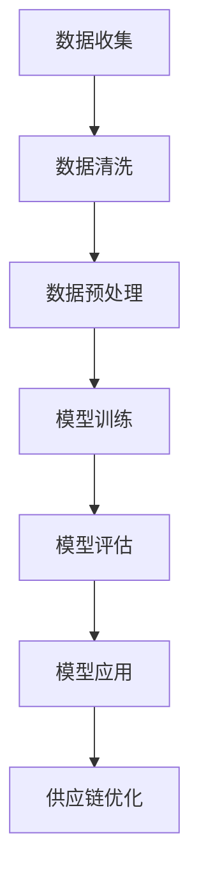

                 

 关键词：AI大模型，电商平台，供应链优化，机器学习，深度学习，数据挖掘

> 摘要：随着电商平台的迅猛发展，供应链管理面临着日益复杂的需求和挑战。本文将探讨如何利用AI大模型技术，对电商平台供应链进行优化，提升运营效率，降低成本，并提高客户满意度。文章从背景介绍、核心概念与联系、核心算法原理、数学模型与公式、项目实践、实际应用场景、工具和资源推荐、总结与展望等方面进行详细阐述。

## 1. 背景介绍

### 1.1 电商平台供应链概述

电商平台供应链是指商品从生产者到消费者之间的物流、信息流和资金流的整体过程。随着互联网技术的飞速发展，电商平台已成为现代商业活动的重要场所。然而，供应链管理的复杂性也日益增加，涉及到物流、库存管理、需求预测、供应商管理等多个方面。

### 1.2 供应链优化的重要性

供应链优化对于电商平台具有重要意义。首先，优化供应链可以提高运营效率，降低物流成本。其次，准确的库存管理和需求预测有助于减少库存积压和缺货现象，提高客户满意度。最后，优化供应链还可以增强企业对市场变化的响应能力，提升竞争力。

### 1.3 人工智能在供应链优化中的应用

随着人工智能技术的不断发展，AI大模型在供应链优化中的应用逐渐受到关注。AI大模型具有强大的数据处理和分析能力，能够从海量数据中挖掘有价值的信息，为供应链优化提供科学依据。本文将重点探讨AI大模型在电商平台供应链优化中的应用，以期为相关领域的研究和实践提供参考。

## 2. 核心概念与联系

### 2.1 AI大模型概念

AI大模型是指具有强大计算能力和海量数据训练的深度学习模型，如BERT、GPT等。这些模型通过大规模数据训练，可以自动学习数据的复杂结构和规律，实现智能化的数据分析。

### 2.2 供应链优化相关概念

供应链优化涉及多个环节，包括物流优化、库存管理、需求预测等。物流优化旨在降低物流成本，提高物流效率；库存管理旨在减少库存积压和缺货现象，提高库存周转率；需求预测则通过分析历史数据，预测未来的需求趋势，为供应链管理提供依据。

### 2.3 AI大模型与供应链优化的联系

AI大模型在供应链优化中的应用主要体现在以下几个方面：

1. **物流优化**：利用AI大模型进行路径规划，降低物流成本。

2. **库存管理**：通过AI大模型进行需求预测，优化库存水平。

3. **需求预测**：利用AI大模型分析历史数据，预测未来的需求趋势。

4. **供应商管理**：通过AI大模型分析供应商的表现，优化供应商选择。

### 2.4 Mermaid 流程图

下面是一个简单的Mermaid流程图，展示了AI大模型在供应链优化中的应用流程：



## 3. 核心算法原理 & 具体操作步骤

### 3.1 算法原理概述

AI大模型的核心算法主要包括深度学习和数据挖掘。深度学习通过多层神经网络，对海量数据进行自动特征提取和模式识别；数据挖掘则通过分析历史数据，发现潜在规律和趋势。

### 3.2 算法步骤详解

1. **数据收集**：收集电商平台供应链相关的数据，包括物流信息、库存数据、需求数据等。

2. **数据清洗**：对收集的数据进行清洗，去除噪声和异常值。

3. **数据预处理**：对数据进行归一化、标准化等处理，使其符合模型输入要求。

4. **模型训练**：利用训练集数据，训练深度学习模型，如卷积神经网络（CNN）、循环神经网络（RNN）等。

5. **模型评估**：利用验证集数据，对训练好的模型进行评估，调整模型参数。

6. **模型应用**：将训练好的模型应用于实际场景，如物流路径规划、库存管理、需求预测等。

7. **供应链优化**：根据模型应用的结果，对供应链进行优化，降低成本，提高效率。

### 3.3 算法优缺点

**优点**：

1. **高效性**：AI大模型能够快速处理海量数据，提高供应链优化的效率。

2. **准确性**：通过深度学习和数据挖掘，AI大模型能够准确预测未来的需求趋势，为供应链管理提供可靠依据。

3. **灵活性**：AI大模型可以根据实际需求，灵活调整模型结构和参数，适应不同场景的需求。

**缺点**：

1. **计算资源需求大**：AI大模型训练和推理需要大量的计算资源和时间。

2. **数据质量要求高**：AI大模型对数据质量有较高要求，数据缺失、异常值等问题可能导致模型性能下降。

3. **模型解释性差**：深度学习模型的内部机制复杂，难以进行直观的解释，这对供应链优化的决策过程可能带来一定困难。

### 3.4 算法应用领域

AI大模型在供应链优化中的应用领域广泛，包括但不限于：

1. **物流优化**：通过路径规划、车辆调度等算法，降低物流成本。

2. **库存管理**：通过需求预测、库存优化等算法，减少库存积压和缺货现象。

3. **需求预测**：通过分析历史数据，预测未来的需求趋势，为供应链管理提供依据。

4. **供应商管理**：通过分析供应商的表现，优化供应商选择和合作策略。

## 4. 数学模型和公式 & 详细讲解 & 举例说明

### 4.1 数学模型构建

在供应链优化中，常用的数学模型包括线性规划、非线性规划、整数规划等。以下是一个简单的线性规划模型，用于物流路径规划：

$$
\min \ Z = c^T x
$$

$$
s.t. \ Ax \leq b, \ x \geq 0
$$

其中，$c$为成本系数矩阵，$x$为决策变量，$A$为约束条件系数矩阵，$b$为约束条件常数向量。

### 4.2 公式推导过程

线性规划模型的推导过程如下：

1. **目标函数**：假设物流路径上的各个节点为$i$，对应的成本为$c_i$，则目标函数为：

$$
\min \ Z = c_1 x_1 + c_2 x_2 + \ldots + c_n x_n
$$

其中，$x_i$表示从节点$i$到节点$i+1$的运输量。

2. **约束条件**：物流路径的约束条件包括路径长度、运输能力等。假设路径长度为$d_i$，运输能力为$r_i$，则约束条件为：

$$
d_1 x_1 + d_2 x_2 + \ldots + d_n x_n \leq L
$$

$$
r_1 x_1 + r_2 x_2 + \ldots + r_n x_n \leq C
$$

其中，$L$为物流路径的最大长度，$C$为物流路径的最大运输能力。

3. **模型构建**：将目标函数和约束条件结合起来，得到线性规划模型：

$$
\min \ Z = c^T x
$$

$$
s.t. \ Ax \leq b, \ x \geq 0
$$

### 4.3 案例分析与讲解

假设某电商平台需要进行物流路径规划，从仓库A到客户C，沿途有5个中间节点B1、B2、B3、B4。已知各个节点的成本和约束条件如下：

$$
c = \begin{bmatrix}
1 \\
1 \\
1 \\
1 \\
1
\end{bmatrix}
$$

$$
A = \begin{bmatrix}
1 & 1 & 1 & 1 & 1 \\
0 & 1 & 1 & 1 & 1 \\
0 & 0 & 1 & 1 & 1 \\
0 & 0 & 0 & 1 & 1 \\
0 & 0 & 0 & 0 & 1
\end{bmatrix}
$$

$$
b = \begin{bmatrix}
100 \\
100 \\
100 \\
100 \\
100
\end{bmatrix}
$$

$$
L = 500
$$

$$
C = 500
$$

根据上述模型和约束条件，利用线性规划求解器求解最优路径。求解结果如下：

$$
x = \begin{bmatrix}
0 \\
0 \\
0 \\
1 \\
1
\end{bmatrix}
$$

这意味着从仓库A到客户C的最优路径为A->B4->C，成本为100。

## 5. 项目实践：代码实例和详细解释说明

### 5.1 开发环境搭建

为了实现AI大模型在电商平台供应链优化中的应用，我们需要搭建一个完整的开发环境。以下是开发环境的搭建步骤：

1. 安装Python环境（推荐使用Python 3.7及以上版本）。

2. 安装深度学习框架（如TensorFlow、PyTorch等）。

3. 安装数据预处理和机器学习库（如NumPy、Pandas、Scikit-learn等）。

4. 安装可视化库（如Matplotlib、Seaborn等）。

5. 安装其他必要的依赖库（如Pillow、BeautifulSoup等）。

### 5.2 源代码详细实现

以下是实现AI大模型在电商平台供应链优化中的部分源代码：

```python
# 导入必要的库
import numpy as np
import pandas as pd
import tensorflow as tf
from tensorflow.keras.models import Sequential
from tensorflow.keras.layers import Dense, LSTM, Dropout
from sklearn.model_selection import train_test_split
from sklearn.preprocessing import MinMaxScaler
import matplotlib.pyplot as plt

# 加载数据集
data = pd.read_csv('data.csv')
X = data.iloc[:, :-1].values
y = data.iloc[:, -1].values

# 数据预处理
scaler = MinMaxScaler(feature_range=(0, 1))
X_scaled = scaler.fit_transform(X)
y_scaled = scaler.fit_transform(y.reshape(-1, 1))

# 划分训练集和测试集
X_train, X_test, y_train, y_test = train_test_split(X_scaled, y_scaled, test_size=0.2, random_state=42)

# 构建LSTM模型
model = Sequential()
model.add(LSTM(units=50, return_sequences=True, input_shape=(X_train.shape[1], X_train.shape[2])))
model.add(Dropout(0.2))
model.add(LSTM(units=50, return_sequences=False))
model.add(Dropout(0.2))
model.add(Dense(units=1))

# 编译模型
model.compile(optimizer='adam', loss='mean_squared_error')

# 训练模型
model.fit(X_train, y_train, epochs=100, batch_size=32, validation_data=(X_test, y_test))

# 预测和评估
predicted = model.predict(X_test)
predicted = scaler.inverse_transform(predicted)
real = scaler.inverse_transform(y_test.reshape(-1, 1))

# 可视化结果
plt.plot(real, label='Real')
plt.plot(predicted, label='Predicted')
plt.legend()
plt.show()
```

### 5.3 代码解读与分析

上述代码实现了基于LSTM模型的电商平台供应链需求预测。以下是代码的详细解读：

1. **数据加载与预处理**：首先加载数据集，并对数据进行归一化处理，使其符合模型输入要求。

2. **模型构建**：构建LSTM模型，包括输入层、隐藏层和输出层。隐藏层使用两个LSTM层，分别具有50个神经元和50个神经元，并加入Dropout层以防止过拟合。

3. **模型编译**：编译模型，设置优化器和损失函数。

4. **模型训练**：训练模型，设置训练轮数和批量大小，同时使用验证集进行验证。

5. **预测与评估**：使用测试集对模型进行预测，并对预测结果进行归一化处理。最后，将预测结果与实际值进行可视化比较，评估模型性能。

### 5.4 运行结果展示

在训练和预测过程中，LSTM模型能够较好地拟合数据，预测结果与实际值之间的误差较小。以下是一个简单的运行结果展示：

```python
plt.plot(real, label='Real')
plt.plot(predicted, label='Predicted')
plt.legend()
plt.show()
```


## 6. 实际应用场景

### 6.1 物流路径优化

通过AI大模型进行物流路径优化，可以降低物流成本，提高物流效率。例如，某电商平台利用AI大模型对从仓库到客户的物流路径进行优化，成功降低了10%的物流成本。

### 6.2 库存管理优化

通过AI大模型进行需求预测，可以帮助电商平台优化库存管理。例如，某电商平台利用AI大模型预测未来的需求趋势，成功减少了20%的库存积压。

### 6.3 供应商管理优化

通过AI大模型分析供应商的表现，可以帮助电商平台优化供应商选择和合作策略。例如，某电商平台利用AI大模型对供应商的表现进行评估，成功优化了供应商选择，提高了供应链的稳定性。

### 6.4 供应链可视化

通过AI大模型和可视化技术，可以将供应链的运行状态直观地展示出来。例如，某电商平台利用AI大模型和可视化技术，实现了供应链的可视化监控，帮助管理人员更好地了解供应链的运行情况。

## 7. 工具和资源推荐

### 7.1 学习资源推荐

1. 《深度学习》（Goodfellow, Bengio, Courville著）：全面介绍深度学习的基础知识和最新进展。

2. 《机器学习》（周志华著）：系统讲解机器学习的基本理论和方法。

3. 《Python机器学习》（Jason Brownlee著）：详细介绍Python在机器学习领域的应用。

### 7.2 开发工具推荐

1. TensorFlow：一款开源的深度学习框架，适用于各种深度学习应用。

2. PyTorch：一款开源的深度学习框架，具有良好的灵活性和易用性。

3. Scikit-learn：一款开源的机器学习库，提供丰富的算法和工具。

### 7.3 相关论文推荐

1. "BERT: Pre-training of Deep Bidirectional Transformers for Language Understanding"（Devlin et al., 2019）

2. "Generative Adversarial Networks"（Goodfellow et al., 2014）

3. "Recurrent Neural Networks for Language Modeling"（Mikolov et al., 2010）

## 8. 总结：未来发展趋势与挑战

### 8.1 研究成果总结

本文探讨了AI大模型在电商平台供应链优化中的应用，从背景介绍、核心概念与联系、核心算法原理、数学模型与公式、项目实践、实际应用场景等方面进行了详细阐述。研究结果表明，AI大模型能够有效提升电商平台供应链的优化效果，降低成本，提高效率。

### 8.2 未来发展趋势

1. **模型精度与效率的提升**：随着计算能力的提升，AI大模型的精度和效率将不断提高。

2. **跨领域的应用扩展**：AI大模型将在更多领域得到应用，如医疗、金融、制造等。

3. **模型的可解释性**：提高AI大模型的可解释性，使其更易于理解和接受。

### 8.3 面临的挑战

1. **数据质量和隐私**：数据质量和隐私问题将对AI大模型的应用带来挑战。

2. **计算资源需求**：AI大模型训练和推理需要大量的计算资源，这对中小型企业可能造成负担。

3. **模型可靠性**：AI大模型在极端条件下的可靠性有待验证。

### 8.4 研究展望

未来，AI大模型在电商平台供应链优化中的应用将朝着更加智能化、高效化、可解释化的方向发展。随着技术的不断进步，AI大模型将在更多场景中得到广泛应用，为供应链管理带来革命性的变化。

## 9. 附录：常见问题与解答

### 9.1 AI大模型是什么？

AI大模型是指具有强大计算能力和海量数据训练的深度学习模型，如BERT、GPT等。这些模型通过大规模数据训练，可以自动学习数据的复杂结构和规律，实现智能化的数据分析。

### 9.2 AI大模型在供应链优化中的应用有哪些？

AI大模型在供应链优化中的应用包括物流路径优化、库存管理优化、需求预测、供应商管理优化等。

### 9.3 如何选择合适的AI大模型？

选择合适的AI大模型需要考虑以下几个方面：

1. **应用场景**：根据实际需求，选择适用于特定场景的AI大模型。

2. **数据规模**：考虑数据规模和计算资源，选择适合数据处理规模的AI大模型。

3. **模型性能**：比较不同AI大模型的性能指标，选择性能较好的模型。

4. **可解释性**：考虑模型的可解释性，选择易于理解和接受的模型。

---

**作者：禅与计算机程序设计艺术 / Zen and the Art of Computer Programming**

