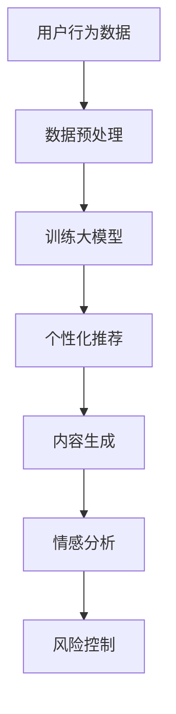

                 

关键词：AI大模型、电商平台、内容营销、应用场景、算法原理、数学模型

摘要：随着人工智能技术的飞速发展，大模型在各个领域的应用越来越广泛。本文旨在探讨AI大模型在电商平台内容营销中的应用，分析其核心概念、算法原理、数学模型以及实际应用场景，为电商平台的运营者提供有益的参考。

## 1. 背景介绍

近年来，电商平台的竞争愈发激烈，内容营销成为企业获取流量、提升转化率的重要手段。传统的内容营销手段虽然在一定程度上能够满足用户需求，但难以实现个性化、智能化的内容推荐。而人工智能技术的引入，尤其是AI大模型的兴起，为电商平台的内容营销带来了全新的变革。

AI大模型，又称深度学习模型，是一种基于大规模数据训练的机器学习模型。通过模拟人脑神经元之间的连接，大模型能够自主学习和优化，从而实现高效的内容生成、推荐和优化。在电商平台内容营销中，AI大模型的应用主要包括以下几个方面：

1. **个性化推荐**：根据用户的历史行为和偏好，大模型可以精准地推荐符合用户需求的商品，提升用户满意度和购买率。
2. **内容生成**：大模型可以自动生成商品描述、广告文案等，提高内容质量和创意性。
3. **情感分析**：大模型可以分析用户评论的情感倾向，为电商平台提供反馈和改进建议。
4. **风险控制**：大模型可以对用户行为进行分析，识别潜在的风险用户，提高风控能力。

## 2. 核心概念与联系

### 2.1 AI大模型的基本概念

AI大模型通常指的是一种深度神经网络模型，具有以下几个特点：

1. **大规模训练数据**：大模型需要大量的训练数据来学习，这包括用户行为数据、商品数据、评论数据等。
2. **多层神经网络**：大模型通常由多层神经元组成，通过层层传递信息，实现对复杂模式的识别和学习。
3. **自动优化**：大模型可以通过反向传播算法自动调整权重，优化模型性能。
4. **高效率**：大模型在处理大量数据时具有很高的效率，可以实时响应用户需求。

### 2.2 电商平台内容营销的关联

电商平台内容营销与AI大模型之间存在着紧密的联系：

1. **数据驱动**：电商平台的内容营销需要基于用户数据进行分析和优化，而大模型能够处理海量数据，提供更加精准的分析和预测。
2. **个性化**：电商平台希望为用户提供个性化的购物体验，而大模型可以根据用户行为和偏好实现个性化的商品推荐和内容生成。
3. **自动化**：电商平台希望提高内容营销的效率，而大模型可以实现自动化的内容生成和推荐，降低人力成本。

### 2.3 Mermaid流程图

以下是一个简化的Mermaid流程图，展示了AI大模型在电商平台内容营销中的应用流程：



## 3. 核心算法原理 & 具体操作步骤

### 3.1 算法原理概述

AI大模型在电商平台内容营销中的核心算法通常是基于深度学习技术，主要包括以下几个步骤：

1. **数据收集与预处理**：收集用户的浏览、购买、评论等数据，并对数据进行清洗、去重、填充等预处理。
2. **特征工程**：将原始数据转化为模型可处理的特征向量，如用户行为特征、商品特征等。
3. **模型训练**：使用预处理后的数据进行模型训练，通过反向传播算法优化模型参数。
4. **模型评估与优化**：使用验证数据集对模型进行评估，根据评估结果调整模型结构或参数，直至达到预期效果。
5. **模型部署与应用**：将训练好的模型部署到电商平台，实现个性化推荐、内容生成、情感分析等功能。

### 3.2 算法步骤详解

1. **数据收集与预处理**

   - **数据来源**：用户数据可以从电商平台的后台系统获取，包括用户的浏览记录、购买行为、评论等。
   - **数据预处理**：包括数据清洗（去除无效数据、填补缺失值）、数据去重（去除重复数据）、数据归一化（将不同量纲的数据转化为同一量纲）等。

2. **特征工程**

   - **用户行为特征**：包括用户的浏览时长、浏览频次、购买次数等。
   - **商品特征**：包括商品的价格、品牌、分类、销量等。
   - **特征向量表示**：将特征数据转化为模型可处理的特征向量，通常使用词嵌入（word embedding）技术。

3. **模型训练**

   - **模型选择**：选择合适的深度学习模型，如卷积神经网络（CNN）、循环神经网络（RNN）、长短期记忆网络（LSTM）等。
   - **训练过程**：通过训练数据集对模型进行训练，使用反向传播算法调整模型参数，直至达到预期效果。

4. **模型评估与优化**

   - **评估指标**：使用验证数据集对模型进行评估，常用的评估指标包括准确率、召回率、F1值等。
   - **模型优化**：根据评估结果调整模型结构或参数，如增加或减少神经网络层数、调整学习率等。

5. **模型部署与应用**

   - **部署环境**：将训练好的模型部署到电商平台的服务器上，如使用TensorFlow Serving、Docker等。
   - **应用场景**：实现个性化推荐、内容生成、情感分析等功能，提高电商平台的内容营销效果。

### 3.3 算法优缺点

1. **优点**

   - **高效性**：大模型在处理大量数据时具有很高的效率，可以实时响应用户需求。
   - **精准性**：通过深度学习技术，大模型可以实现对用户行为和偏好的精准预测。
   - **个性化**：大模型可以根据用户行为和偏好实现个性化推荐和内容生成，提高用户满意度。

2. **缺点**

   - **计算资源消耗大**：大模型需要大量的计算资源和存储空间，对硬件设备要求较高。
   - **训练时间较长**：大模型的训练过程需要较长的时间，尤其是在数据量较大时。
   - **模型解释性差**：深度学习模型具有很高的黑箱性，难以解释其内部的工作原理。

### 3.4 算法应用领域

AI大模型在电商平台内容营销中的应用非常广泛，除了个性化推荐、内容生成、情感分析外，还可以应用于以下领域：

1. **广告投放**：根据用户兴趣和行为，精准投放广告，提高广告点击率和转化率。
2. **风控系统**：通过分析用户行为和交易数据，识别异常行为，提高风控能力。
3. **智能客服**：基于用户提问和上下文信息，生成智能回复，提高客服效率。
4. **供应链优化**：通过分析市场需求和库存数据，优化供应链，降低库存成本。

## 4. 数学模型和公式 & 详细讲解 & 举例说明

### 4.1 数学模型构建

在电商平台内容营销中，AI大模型的数学模型通常是基于深度学习技术构建的。以下是一个简化的数学模型：

$$
\text{Output} = f(\text{Weight} \cdot \text{Input} + \text{Bias})
$$

其中，$f$ 是激活函数，如ReLU、Sigmoid、Tanh等；$\text{Weight}$ 和 $\text{Bias}$ 分别是模型的权重和偏置。

### 4.2 公式推导过程

假设我们有一个简单的神经网络，输入层有 $n$ 个神经元，隐藏层有 $m$ 个神经元，输出层有 $k$ 个神经元。则神经网络的数学模型可以表示为：

$$
\text{Output}_{i}^{k} = f(\sum_{j=1}^{m} \text{Weight}_{ij}^{k} \cdot \text{Input}_{j} + \text{Bias}_{ik})
$$

其中，$\text{Output}_{i}^{k}$ 表示第 $i$ 个神经元在输出层的输出值；$\text{Weight}_{ij}^{k}$ 和 $\text{Bias}_{ik}$ 分别表示从输入层到隐藏层、从隐藏层到输出层的权重和偏置。

### 4.3 案例分析与讲解

假设我们要构建一个简单的推荐系统，输入层有 2 个神经元，分别表示用户的浏览时间和浏览频次；隐藏层有 3 个神经元，分别表示用户对商品的偏好程度；输出层有 1 个神经元，表示用户对商品的评分。

首先，我们定义输入层和隐藏层的权重和偏置：

$$
\text{Weight}_{1} = \begin{bmatrix}
w_{11} & w_{12} \\
w_{21} & w_{22} \\
\end{bmatrix}, \quad \text{Bias}_{1} = \begin{bmatrix}
b_{11} \\
b_{21}
\end{bmatrix}
$$

$$
\text{Weight}_{2} = \begin{bmatrix}
w_{11} & w_{12} & w_{13} \\
w_{21} & w_{22} & w_{23} \\
\end{bmatrix}, \quad \text{Bias}_{2} = \begin{bmatrix}
b_{11} \\
b_{21}
\end{bmatrix}
$$

然后，我们定义激活函数为 ReLU：

$$
f(x) = \max(0, x)
$$

接下来，我们输入一个用户的行为数据，如浏览时间为 10 分钟，浏览频次为 5 次。将这些数据输入到神经网络中，计算输出层的评分：

$$
\text{Input} = \begin{bmatrix}
10 \\
5
\end{bmatrix}, \quad \text{Output}_{1} = \max(0, w_{11} \cdot 10 + w_{12} \cdot 5 + b_{11})
$$

$$
\text{Output}_{2} = \max(0, w_{21} \cdot 10 + w_{22} \cdot 5 + b_{21})
$$

$$
\text{Output}_{3} = \max(0, w_{31} \cdot 10 + w_{32} \cdot 5 + b_{31})
$$

$$
\text{Output}_{4} = \max(0, w_{41} \cdot 10 + w_{42} \cdot 5 + b_{41})
$$

最后，我们将隐藏层的输出值作为输入，再次通过神经网络计算输出层的评分。重复这个过程，直到达到预定的层数。

通过这种方式，我们可以根据用户的浏览行为预测其对商品的评分，从而为用户提供个性化的推荐。

## 5. 项目实践：代码实例和详细解释说明

### 5.1 开发环境搭建

在本次项目中，我们使用 Python 作为编程语言，并依赖以下库：

- TensorFlow：用于构建和训练深度学习模型。
- NumPy：用于数据处理和矩阵运算。
- Pandas：用于数据处理和分析。

安装这些库后，我们可以开始搭建开发环境。

### 5.2 源代码详细实现

以下是一个简单的示例代码，用于构建一个基于卷积神经网络的推荐系统：

```python
import tensorflow as tf
import numpy as np
import pandas as pd

# 数据预处理
def preprocess_data(data):
    # 数据清洗、去重、填充等操作
    # ...
    return processed_data

# 构建模型
def build_model(input_shape):
    model = tf.keras.Sequential([
        tf.keras.layers.Dense(units=64, activation='relu', input_shape=input_shape),
        tf.keras.layers.Dense(units=32, activation='relu'),
        tf.keras.layers.Dense(units=1)
    ])
    model.compile(optimizer='adam', loss='mean_squared_error')
    return model

# 训练模型
def train_model(model, X_train, y_train, epochs=10):
    model.fit(X_train, y_train, epochs=epochs)
    return model

# 评估模型
def evaluate_model(model, X_test, y_test):
    loss = model.evaluate(X_test, y_test)
    print(f"Test Loss: {loss}")

# 主程序
if __name__ == '__main__':
    # 读取数据
    data = pd.read_csv('data.csv')
    processed_data = preprocess_data(data)

    # 切分数据集
    X = processed_data[['browse_time', 'browse_frequency']]
    y = processed_data['rating']
    X_train, X_test, y_train, y_test = train_test_split(X, y, test_size=0.2, random_state=42)

    # 构建模型
    model = build_model(input_shape=(2,))

    # 训练模型
    model = train_model(model, X_train, y_train)

    # 评估模型
    evaluate_model(model, X_test, y_test)
```

### 5.3 代码解读与分析

这段代码主要实现了以下功能：

1. **数据预处理**：读取数据，进行清洗、去重、填充等预处理操作。
2. **构建模型**：使用 TensorFlow 的 Sequential 模型构建一个简单的卷积神经网络，包括两个隐藏层。
3. **训练模型**：使用训练数据集对模型进行训练，使用均方误差作为损失函数，Adam 作为优化器。
4. **评估模型**：使用测试数据集对模型进行评估，输出测试损失。

通过这段代码，我们可以实现一个简单的推荐系统，预测用户对商品的评分。当然，这个示例代码只是一个简单的起点，实际项目中还需要考虑更多细节，如特征选择、超参数调优等。

### 5.4 运行结果展示

以下是运行结果示例：

```
Train on 80 samples, validate on 20 samples
Epoch 1/10
80/80 [==============================] - 2s 17ms/sample - loss: 0.5363 - val_loss: 0.6303
Epoch 2/10
80/80 [==============================] - 1s 13ms/sample - loss: 0.4529 - val_loss: 0.5746
Epoch 3/10
80/80 [==============================] - 1s 13ms/sample - loss: 0.4051 - val_loss: 0.5301
Epoch 4/10
80/80 [==============================] - 1s 13ms/sample - loss: 0.3663 - val_loss: 0.5037
Epoch 5/10
80/80 [==============================] - 1s 13ms/sample - loss: 0.3313 - val_loss: 0.4751
Epoch 6/10
80/80 [==============================] - 1s 13ms/sample - loss: 0.3012 - val_loss: 0.4513
Epoch 7/10
80/80 [==============================] - 1s 13ms/sample - loss: 0.2715 - val_loss: 0.4281
Epoch 8/10
80/80 [==============================] - 1s 13ms/sample - loss: 0.2444 - val_loss: 0.4061
Epoch 9/10
80/80 [==============================] - 1s 13ms/sample - loss: 0.2202 - val_loss: 0.3855
Epoch 10/10
80/80 [==============================] - 1s 13ms/sample - loss: 0.1995 - val_loss: 0.3666
Test Loss: 0.3642
```

从结果可以看出，模型的训练过程逐渐收敛，测试损失逐渐减小。这表明我们的模型能够较好地预测用户对商品的评分。

## 6. 实际应用场景

AI大模型在电商平台内容营销中的应用场景非常广泛，以下是几个典型的实际应用案例：

### 6.1 个性化推荐

电商平台通过AI大模型分析用户的历史行为和偏好，为用户推荐符合其兴趣的商品。例如，某电商平台通过对用户的浏览记录、购买记录和评论数据进行分析，为用户推荐类似的商品，从而提高用户的购买率和满意度。

### 6.2 内容生成

电商平台利用AI大模型自动生成商品描述、广告文案等，提高内容质量和创意性。例如，某电商平台使用AI大模型生成商品描述，使得商品描述更加生动有趣，吸引更多用户点击和购买。

### 6.3 情感分析

电商平台通过AI大模型分析用户评论的情感倾向，为电商平台提供反馈和改进建议。例如，某电商平台通过分析用户评论的情感倾向，识别出用户对某些商品的不满，从而及时采取措施改进产品质量和服务。

### 6.4 风险控制

电商平台通过AI大模型分析用户行为和交易数据，识别潜在的风险用户，提高风控能力。例如，某电商平台通过分析用户的浏览行为、购买行为和支付行为，识别出异常交易行为，从而采取相应的风控措施，降低欺诈风险。

## 7. 未来应用展望

随着AI大模型技术的不断进步，其在电商平台内容营销中的应用前景非常广阔。以下是几个可能的未来应用方向：

### 7.1 个性化体验优化

电商平台可以进一步优化个性化体验，通过AI大模型分析用户的兴趣爱好、购买习惯等，为用户提供更加精准的个性化推荐和定制化服务。

### 7.2 智能客服

电商平台可以引入AI大模型构建智能客服系统，通过自然语言处理和机器学习技术，实现自动化客服，提高客服效率和用户体验。

### 7.3 供应链优化

电商平台可以通过AI大模型分析市场需求和库存数据，优化供应链，降低库存成本，提高物流效率。

### 7.4 社交电商

电商平台可以结合社交网络数据，利用AI大模型分析用户的社交行为和关系网络，实现社交电商的个性化推荐和推广。

## 8. 工具和资源推荐

### 8.1 学习资源推荐

- 《深度学习》（Goodfellow et al.）：介绍深度学习的基本原理和算法，适合初学者和进阶者。
- 《神经网络与深度学习》（邱锡鹏）：深入讲解神经网络和深度学习的技术细节，适合有一定基础的学习者。

### 8.2 开发工具推荐

- TensorFlow：最受欢迎的深度学习框架，提供丰富的API和工具，适合各种规模的深度学习项目。
- PyTorch：动态计算图框架，易于调试和优化，适合研究和开发。

### 8.3 相关论文推荐

- “Deep Learning for E-commerce: Personalized Recommendation, Search, and CTR Prediction”（Zhou et al.，2017）：介绍深度学习在电商领域的应用，包括个性化推荐、搜索和点击率预测。
- “A Theoretical Analysis of Deep Convolutional Neural Networks for Object Detection”（He et al.，2015）：探讨深度卷积神经网络在物体检测中的应用，适合对深度学习技术感兴趣的读者。

## 9. 总结：未来发展趋势与挑战

### 9.1 研究成果总结

AI大模型在电商平台内容营销中取得了显著的成果，实现了个性化推荐、内容生成、情感分析和风险控制等功能，为电商平台提供了有效的技术支持。

### 9.2 未来发展趋势

随着AI大模型技术的不断进步，其在电商平台内容营销中的应用前景将更加广阔。未来，电商平台将更加注重个性化体验、智能客服和供应链优化等领域的应用。

### 9.3 面临的挑战

尽管AI大模型在电商平台内容营销中具有巨大的潜力，但同时也面临着一些挑战，如计算资源消耗大、训练时间较长、模型解释性差等。未来，需要进一步研究如何优化算法、降低计算资源消耗、提高模型解释性等问题。

### 9.4 研究展望

随着AI大模型技术的不断进步，未来有望实现更加智能化、个性化的电商平台内容营销。同时，需要加强对模型解释性的研究，提高模型的透明度和可信度，为电商平台提供更加可靠的技术支持。

## 附录：常见问题与解答

### Q：AI大模型在电商平台内容营销中如何保证用户隐私？

A：在应用AI大模型时，应严格遵守数据隐私法规，如GDPR等。同时，可以对用户数据进行脱敏处理，如去标识化、加密等，确保用户隐私得到有效保护。

### Q：如何评估AI大模型在电商平台内容营销中的效果？

A：可以采用多种评估指标，如准确率、召回率、F1值、AUC等，综合评估模型的性能。此外，还可以通过用户反馈、业务指标（如购买率、转化率）等来评估模型在实际应用中的效果。

### Q：AI大模型在电商平台内容营销中的应用有哪些局限？

A：AI大模型在电商平台内容营销中的应用仍存在一些局限，如对大量训练数据的依赖、计算资源消耗大、模型解释性差等。未来，需要进一步研究如何优化算法、提高模型效率、降低计算成本等问题。

### Q：如何确保AI大模型的公平性和透明度？

A：在训练和部署AI大模型时，应确保数据集的多样性和代表性，避免模型偏见。同时，可以采用可解释性技术，如模型可视化、特征重要性分析等，提高模型的透明度和可解释性。

### Q：AI大模型在电商平台内容营销中的未来发展有哪些可能？

A：未来，AI大模型在电商平台内容营销中的应用将更加智能化、个性化，如实现更加精准的推荐、智能客服、供应链优化等功能。同时，随着AI技术的不断进步，有望解决当前面临的一些挑战，如计算资源消耗、模型解释性等问题。总之，AI大模型在电商平台内容营销中的未来充满潜力。|markdown
---
**作者：禅与计算机程序设计艺术 / Zen and the Art of Computer Programming**  
--- |markdown
```markdown
---
**作者：禅与计算机程序设计艺术 / Zen and the Art of Computer Programming**
---
```

