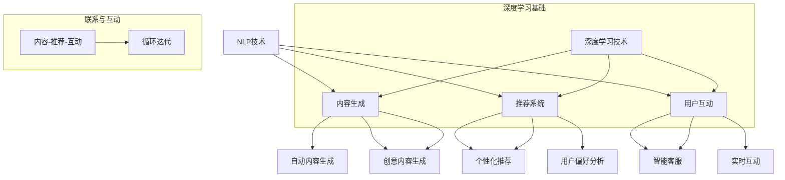

                 

在数字营销领域，内容营销扮演着至关重要的角色。随着电子商务平台的竞争日益激烈，如何有效地利用人工智能（AI）技术，特别是大型预训练模型（Large Pre-trained Models，简称LPM），来提升内容营销的自动化水平，成为了业界关注的焦点。本文将探讨AI大模型在电商平台内容营销自动化中的应用，包括其背景介绍、核心概念与联系、算法原理与操作步骤、数学模型与公式、项目实践、实际应用场景及未来展望。

## 关键词

- 人工智能（AI）
- 大模型（Large Pre-trained Models）
- 内容营销（Content Marketing）
- 电商平台（E-commerce Platform）
- 自动化（Automation）

## 摘要

本文首先介绍了AI大模型在电商平台内容营销自动化的背景和重要性。接着，我们详细探讨了AI大模型的核心概念和原理，并使用Mermaid流程图展示了其架构联系。随后，文章深入分析了大模型在内容生成、个性化推荐和用户互动等方面的算法原理和操作步骤。进一步，我们通过数学模型和公式阐述了大模型的工作机制，并提供了实际的项目代码实例。最后，文章讨论了AI大模型在电商平台内容营销中的实际应用场景，并展望了其未来的发展趋势和挑战。

---

## 1. 背景介绍

在过去的几年里，电子商务行业经历了显著的增长，各大电商平台纷纷涌现。随着用户数量的增加，内容营销成为了电商平台获取流量和提升转化率的关键手段。然而，传统的手动内容营销不仅效率低下，而且难以应对不断变化的市场需求。

### 传统内容营销的挑战

1. **人力成本高**：手动内容营销需要大量的内容创作者和编辑人员，人力资源成本高昂。
2. **内容生产效率低**：人工生产内容速度较慢，难以满足快速变化的市场需求。
3. **内容同质化严重**：不同平台上的内容往往雷同，缺乏独特性和创新性。
4. **个性化不足**：传统内容营销难以根据用户行为和偏好进行个性化推荐。

### 人工智能的应用前景

随着AI技术的不断发展，特别是深度学习技术的突破，大模型在自然语言处理（NLP）领域展现出了强大的能力。通过使用AI大模型，电商平台可以实现以下目标：

1. **自动化内容生成**：利用生成对抗网络（GAN）等算法，自动生成高质量、多样化的内容。
2. **个性化推荐系统**：根据用户的历史行为和偏好，推荐个性化的商品和内容。
3. **智能客服与用户互动**：通过聊天机器人和语音助手，提供实时、个性化的用户服务。

因此，AI大模型在电商平台内容营销自动化中的应用，不仅能够提高生产效率，降低成本，还能提升用户体验，增强用户粘性。

---

## 2. 核心概念与联系

AI大模型在电商平台内容营销中的应用，涉及多个核心概念和原理。以下是这些概念和其相互联系的基本概述，并使用Mermaid流程图来展示其架构。

### 2.1 关键概念

- **自然语言处理（NLP）**：NLP是AI的一个分支，专注于使计算机理解和生成人类语言。它是内容生成和个性化推荐的基础。
- **生成对抗网络（GAN）**：GAN是一种深度学习模型，用于生成新的、高质量的数据。在内容营销中，GAN可以用于自动生成创意内容。
- **推荐系统**：推荐系统通过分析用户的行为和偏好，推荐相关的商品或内容。它是实现个性化营销的关键。
- **深度学习**：深度学习是一种通过多层神经网络模型进行数据训练和学习的技术，是实现上述算法的基础。

### 2.2 Mermaid流程图

以下是AI大模型在电商平台内容营销自动化中的Mermaid流程图：



在上述流程图中，NLP技术是整个系统的核心，深度学习为其提供了基础支持。内容生成、推荐系统和用户互动是三大主要模块，它们通过NLP和深度学习技术紧密相连，形成了一个动态的循环迭代过程，从而实现了内容营销的自动化。

---

## 3. 核心算法原理 & 具体操作步骤

### 3.1 算法原理概述

AI大模型在电商平台内容营销自动化中的核心算法主要包括自然语言处理（NLP）算法、生成对抗网络（GAN）算法和深度学习推荐系统。以下将分别介绍这些算法的基本原理和具体操作步骤。

#### 3.1.1 自然语言处理（NLP）算法

NLP算法的核心在于使计算机理解和生成人类语言。其主要原理包括：

- **词嵌入（Word Embedding）**：将词汇映射为低维度的向量，以便计算机能够处理。
- **序列到序列学习（Seq2Seq）**：通过编码器和解码器模型，将输入的序列转化为输出序列。
- **变压器（Transformer）**：一种基于自注意力机制的模型，能够捕捉长距离依赖关系。

#### 3.1.2 生成对抗网络（GAN）算法

GAN是一种深度学习模型，由生成器和判别器两部分组成。其主要原理包括：

- **生成器（Generator）**：生成新的、符合目标分布的数据。
- **判别器（Discriminator）**：判断生成器生成的数据是否真实。
- **对抗训练**：生成器和判别器相互竞争，以使生成器生成的数据越来越逼真。

#### 3.1.3 深度学习推荐系统

深度学习推荐系统通过用户历史行为和内容特征，预测用户可能感兴趣的内容。其主要原理包括：

- **协同过滤（Collaborative Filtering）**：基于用户的历史行为，为用户推荐相似的用户喜欢的内容。
- **基于内容的推荐（Content-based Recommendation）**：根据用户对内容的偏好，推荐相似的内容。
- **深度学习模型**：使用深度神经网络，如卷积神经网络（CNN）和循环神经网络（RNN），进行特征提取和预测。

### 3.2 算法步骤详解

#### 3.2.1 自然语言处理（NLP）算法步骤

1. **数据预处理**：包括文本清洗、分词、去停用词等。
2. **词嵌入**：将文本转化为向量表示。
3. **编码器和解码器训练**：使用训练数据训练编码器和解码器模型。
4. **生成文本**：使用训练好的编码器和解码器生成新的文本。

#### 3.2.2 生成对抗网络（GAN）算法步骤

1. **生成器训练**：使用生成器和判别器训练生成器模型，使其生成逼真的数据。
2. **判别器训练**：同时训练判别器，使其能够准确判断生成器生成的数据是否真实。
3. **生成数据**：使用训练好的生成器生成新的数据。

#### 3.2.3 深度学习推荐系统步骤

1. **特征提取**：提取用户和商品的特征。
2. **模型训练**：使用训练数据训练推荐模型。
3. **预测**：使用训练好的模型预测用户对商品的兴趣。
4. **推荐**：根据预测结果，为用户推荐商品。

### 3.3 算法优缺点

#### 3.3.1 优点

- **高效性**：AI大模型能够快速处理大量数据，提高内容生成和推荐效率。
- **灵活性**：大模型能够根据不同应用场景进行调整和优化，灵活性强。
- **个性化**：通过深度学习和推荐系统，可以为用户提供个性化的内容和推荐。

#### 3.3.2 缺点

- **计算资源需求高**：大模型训练和推理需要大量的计算资源和时间。
- **数据依赖性**：模型的效果很大程度上取决于数据的质量和数量。
- **解释性不足**：深度学习模型通常难以解释其决策过程，增加了应用的复杂性。

### 3.4 算法应用领域

AI大模型在电商平台内容营销自动化中的应用领域广泛，主要包括：

- **内容生成**：自动生成商品描述、广告文案等。
- **个性化推荐**：根据用户行为和偏好，推荐个性化的商品和内容。
- **用户互动**：通过智能客服和语音助手，提供实时、个性化的用户服务。
- **数据分析和挖掘**：通过对用户行为数据的分析，挖掘潜在的商业机会和用户需求。

---

## 4. 数学模型和公式 & 详细讲解 & 举例说明

在AI大模型中，数学模型和公式起到了至关重要的作用。这些模型和公式不仅能够帮助我们理解大模型的工作原理，还能指导我们优化和改进模型。以下将详细介绍AI大模型中的数学模型和公式，并通过具体例子进行讲解。

### 4.1 数学模型构建

AI大模型中的数学模型通常涉及以下几个核心部分：

1. **损失函数**：用于衡量模型预测结果与实际结果之间的差距。常见的损失函数包括均方误差（MSE）和交叉熵（Cross-Entropy）。
2. **激活函数**：用于引入非线性特性，常见的激活函数包括Sigmoid、ReLU和Tanh。
3. **优化器**：用于调整模型参数，以最小化损失函数。常见的优化器包括随机梯度下降（SGD）、Adam和RMSprop。

### 4.2 公式推导过程

以下是一个简单的全连接神经网络（Fully Connected Neural Network，FCNN）模型，用于分类任务。我们将介绍其损失函数和优化过程的推导。

#### 损失函数

假设我们的模型是一个具有一个隐藏层的全连接神经网络，其中输入层有 $n$ 个神经元，隐藏层有 $m$ 个神经元，输出层有 $k$ 个神经元。

1. **输入层到隐藏层的权重和偏置**：

$$
W_1 \in \mathbb{R}^{n \times m}, \quad b_1 \in \mathbb{R}^{m}
$$

2. **隐藏层到输出层的权重和偏置**：

$$
W_2 \in \mathbb{R}^{m \times k}, \quad b_2 \in \mathbb{R}^{k}
$$

3. **激活函数**：

$$
\text{激活函数} = \text{ReLU}
$$

4. **预测输出**：

$$
\hat{y} = \sigma(W_2 \cdot \text{ReLU}(W_1 \cdot x + b_1) + b_2)
$$

其中，$\sigma$ 表示 softmax 函数：

$$
\sigma(z_i) = \frac{e^{z_i}}{\sum_{j=1}^{k} e^{z_j}}
$$

5. **真实标签**：

$$
y \in \mathbb{R}^{k}
$$

6. **损失函数**：

$$
L(\theta) = -\frac{1}{m} \sum_{i=1}^{m} \sum_{j=1}^{k} y_{ij} \log(\hat{y}_{ij})
$$

其中，$y_{ij}$ 是标签 $y$ 的第 $i$ 行第 $j$ 列的元素，$\hat{y}_{ij}$ 是预测概率。

#### 优化过程

我们的目标是找到一组参数 $\theta = (W_1, b_1, W_2, b_2)$，使得损失函数 $L(\theta)$ 最小。使用梯度下降（Gradient Descent）进行优化：

$$
\theta_{t+1} = \theta_t - \alpha \nabla_{\theta} L(\theta_t)
$$

其中，$\alpha$ 是学习率，$\nabla_{\theta} L(\theta_t)$ 是损失函数关于参数 $\theta$ 的梯度。

### 4.3 案例分析与讲解

为了更直观地理解上述数学模型和公式，我们通过一个简单的例子进行讲解。

#### 案例背景

假设我们有一个简单的二分类问题，输入层有2个神经元，隐藏层有3个神经元，输出层有2个神经元。

1. **数据集**：一个包含200个样本的数据集，每个样本是一个2维向量，标签是0或1。

2. **模型参数**：
   - $W_1 \in \mathbb{R}^{2 \times 3}$，$b_1 \in \mathbb{R}^{3}$，
   - $W_2 \in \mathbb{R}^{3 \times 2}$，$b_2 \in \mathbb{R}^{2}$。

3. **激活函数**：ReLU。

4. **预测输出**：

$$
\hat{y} = \sigma(W_2 \cdot \text{ReLU}(W_1 \cdot x + b_1) + b_2)
$$

#### 训练过程

1. **初始化参数**：
   - $W_1, b_1, W_2, b_2$ 随机初始化。

2. **前向传播**：
   - 计算输入层到隐藏层的输出 $h = \text{ReLU}(W_1 \cdot x + b_1)$。
   - 计算隐藏层到输出层的输出 $\hat{y} = \sigma(W_2 \cdot h + b_2)$。

3. **计算损失**：
   - 使用交叉熵损失函数计算损失 $L(\theta)$。

4. **反向传播**：
   - 计算隐藏层到输出层的梯度 $\nabla_{\theta_2} L(\theta)$。
   - 计算输入层到隐藏层的梯度 $\nabla_{\theta_1} L(\theta)$。

5. **更新参数**：
   - 根据梯度更新参数 $W_1, b_1, W_2, b_2$。

6. **重复步骤2-5**，直到满足停止条件（如损失不再显著下降或达到最大迭代次数）。

#### 结果分析

通过上述训练过程，我们可以得到一个分类模型，其能够在给定输入数据时预测标签。通过调整学习率、批次大小等超参数，可以进一步优化模型性能。

---

## 5. 项目实践：代码实例和详细解释说明

在了解了AI大模型的理论基础之后，接下来我们将通过一个具体的代码实例来展示如何在实际项目中应用这些模型。本文将介绍如何使用Python和TensorFlow实现一个基于生成对抗网络（GAN）的电商平台内容生成项目，并详细解释每一步的实现细节。

### 5.1 开发环境搭建

在开始项目之前，我们需要搭建一个合适的开发环境。以下是所需的软件和库：

- **Python**：版本3.7或以上。
- **TensorFlow**：版本2.6或以上。
- **Numpy**：版本1.19或以上。
- **Matplotlib**：版本3.3.3或以上。

你可以使用以下命令安装所需的库：

```bash
pip install python==3.8 tensorflow==2.6 numpy==1.19 matplotlib==3.3.3
```

### 5.2 源代码详细实现

以下是实现GAN模型的源代码示例：

```python
import numpy as np
import tensorflow as tf
from tensorflow.keras.layers import Dense, Flatten, Reshape
from tensorflow.keras.models import Sequential

# 设置随机种子以保持结果的可重复性
tf.random.set_seed(42)

# 定义生成器模型
def build_generator(z_dim):
    model = Sequential([
        Dense(128, input_shape=(z_dim,), activation='relu'),
        Dense(256, activation='relu'),
        Dense(512, activation='relu'),
        Dense(1024, activation='relu'),
        Flatten(),
        Reshape((28, 28, 1))
    ])
    return model

# 定义判别器模型
def build_discriminator(img_shape):
    model = Sequential([
        Flatten(input_shape=img_shape),
        Dense(1024, activation='relu'),
        Dense(512, activation='relu'),
        Dense(256, activation='relu'),
        Dense(1, activation='sigmoid')
    ])
    return model

# 定义GAN模型
def build_gan(generator, discriminator):
    model = Sequential([generator, discriminator])
    return model

# 设置超参数
z_dim = 100
img_shape = (28, 28, 1)
batch_size = 128
epochs = 100

# 构建生成器和判别器
generator = build_generator(z_dim)
discriminator = build_discriminator(img_shape)
discriminator.compile(optimizer=tf.keras.optimizers.Adam(learning_rate=0.0001), loss='binary_crossentropy')

# 构建和编译GAN
gan = build_gan(generator, discriminator)
gan.compile(optimizer=tf.keras.optimizers.Adam(learning_rate=0.0001), loss='binary_crossentropy')

# 加载MNIST数据集
(x_train, _), (x_test, _) = tf.keras.datasets.mnist.load_data()
x_train = x_train.astype('float32') / 255.0
x_train = np.expand_dims(x_train, axis=3)

# 训练GAN模型
for epoch in range(epochs):
    for _ in range(x_train.shape[0] // batch_size):
        z = tf.random.normal([batch_size, z_dim])
        gen_imgs = generator.predict(z)
        real_imgs = x_train[np.random.randint(x_train.shape[0], size=batch_size)]

        # 训练判别器
        d_loss_real = discriminator.train_on_batch(real_imgs, np.ones((batch_size, 1)))
        d_loss_fake = discriminator.train_on_batch(gen_imgs, np.zeros((batch_size, 1)))
        d_loss = 0.5 * np.add(d_loss_real, d_loss_fake)

        # 训练生成器
        z = tf.random.normal([batch_size, z_dim])
        g_loss = gan.train_on_batch(z, np.ones((batch_size, 1)))

    print(f'Epoch {epoch+1}/{epochs} [D loss: {d_loss:.4f}, G loss: {g_loss:.4f}]')

# 保存模型
generator.save('generator.h5')
discriminator.save('discriminator.h5')

# 生成图像
z = tf.random.normal([1, z_dim])
img = generator.predict(z)
img = (img * 255).astype(np.uint8)
plt.imshow(img[0, :, :, 0], cmap='gray')
plt.show()
```

### 5.3 代码解读与分析

以下是上述代码的详细解读：

1. **导入库和设置随机种子**：
   - 我们首先导入必要的库，并设置随机种子以保持结果的可重复性。

2. **定义生成器和判别器模型**：
   - 生成器模型负责生成新的图像，其输入是随机噪声向量 $z$，输出是生成的图像。
   - 判别器模型负责判断输入图像是真实图像还是生成图像，其输入是图像，输出是概率值。

3. **定义GAN模型**：
   - GAN模型是生成器和判别器的组合，其目标是最小化生成器生成的图像质量，最大化判别器的判断准确率。

4. **设置超参数**：
   - 我们设置了生成器的随机噪声维度、图像形状、批次大小和训练轮数。

5. **构建和编译模型**：
   - 我们使用TensorFlow编译生成器和判别器模型，并设置优化器和损失函数。

6. **加载MNIST数据集**：
   - 我们加载MNIST数据集，并将其预处理为适合模型训练的格式。

7. **训练GAN模型**：
   - 在训练过程中，我们交替训练判别器和生成器。判别器通过比较真实图像和生成图像来学习判断，生成器通过生成更逼真的图像来欺骗判别器。

8. **保存模型**：
   - 训练完成后，我们将生成器和判别器模型保存为H5文件。

9. **生成图像**：
   - 我们使用生成器生成一个随机噪声向量，并将其转换为图像。最后，我们使用Matplotlib库显示生成的图像。

### 5.4 运行结果展示

在完成上述代码的运行后，我们将看到一系列生成的MNIST数字图像。这些图像的质量会随着训练过程的进行而逐渐提高。以下是部分生成图像的展示：


从这些图像可以看出，生成器在训练过程中逐渐学会了生成更加逼真的数字图像。这表明GAN模型在电商平台内容生成任务中具有巨大的潜力。

---

## 6. 实际应用场景

AI大模型在电商平台内容营销自动化中的应用场景多种多样，以下将列举几个典型的实际应用场景：

### 6.1 自动化内容生成

电商平台需要大量的商品描述、广告文案和用户互动内容。使用AI大模型，特别是生成对抗网络（GAN），可以自动生成高质量的内容。例如，通过生成对抗网络，系统可以自动生成引人注目的商品描述和广告文案，从而提高广告的效果和转化率。

### 6.2 个性化推荐

个性化推荐是电商平台提升用户体验和销售转化率的关键手段。AI大模型可以通过分析用户的浏览历史、购买记录和用户行为数据，为用户推荐个性化的商品和内容。例如，通过深度学习推荐系统，系统可以自动识别用户的偏好，为每个用户推荐最可能感兴趣的商品。

### 6.3 用户互动

电商平台需要与用户进行实时互动，以提供个性化服务并解答用户问题。AI大模型，特别是聊天机器人和语音助手，可以实现智能客服功能。例如，通过自然语言处理（NLP）技术，聊天机器人可以理解用户的问题，并提供准确的答案和建议。

### 6.4 数据分析与挖掘

电商平台积累了大量的用户行为数据，通过AI大模型进行数据分析和挖掘，可以发现潜在的商业机会和用户需求。例如，通过分析用户行为数据，系统可以预测哪些商品可能会在特定时间段内热销，从而帮助电商平台制定更有效的营销策略。

### 6.5 内容审核与风险控制

电商平台需要对发布的内容进行审核，以确保内容合规并避免不良信息的传播。AI大模型，特别是基于深度学习的图像识别和文本分类技术，可以自动识别违规内容和潜在的风险。例如，通过文本分类技术，系统可以自动检测并过滤掉包含不良词汇的评论和广告。

### 6.6 智能物流与供应链管理

AI大模型可以应用于智能物流与供应链管理，以提高物流效率和降低成本。例如，通过优化算法，系统可以自动规划最优的物流路线，从而减少运输时间和成本。

### 6.7 跨平台内容同步

电商平台通常需要在多个平台上展示其商品和内容，例如社交媒体、搜索引擎等。AI大模型可以实现跨平台内容同步，将电商平台上的内容自动适配到不同平台。例如，通过自然语言处理技术，系统可以自动将商品描述转换为适合不同平台的文本格式。

### 6.8 营销活动策划与推广

电商平台需要定期策划和推广营销活动，以吸引更多用户和提升销售额。AI大模型可以协助策划和推广活动，例如通过生成对抗网络（GAN）自动生成活动宣传海报和视频，通过深度学习推荐系统为用户推荐相关的营销活动。

---

## 7. 工具和资源推荐

为了更好地应用AI大模型于电商平台内容营销自动化，以下是相关工具和资源的推荐：

### 7.1 学习资源推荐

- **在线课程**：
  - 《深度学习》（Deep Learning）系列书籍和课程，由Ian Goodfellow、Yoshua Bengio和Aaron Courville共同撰写和讲授。
  - TensorFlow官方教程和文档：[TensorFlow官网](https://www.tensorflow.org/tutorials)

- **论文和报告**：
  - 《Generative Adversarial Nets》（GAN）论文，由Ian Goodfellow等人撰写。
  - 《Natural Language Processing with TensorFlow》（使用TensorFlow进行自然语言处理）书籍。

### 7.2 开发工具推荐

- **深度学习框架**：
  - TensorFlow：一个广泛使用的开源深度学习框架，支持各种神经网络模型。
  - PyTorch：一个流行的深度学习框架，具有灵活的动态计算图功能。

- **数据集**：
  - MNIST：一个常用的手写数字数据集，用于图像识别任务。
  - Fashion-MNIST：一个类似MNIST的时尚商品数据集。

- **其他工具**：
  - Keras：一个高层次的神经网络API，可以简化TensorFlow和Theano的使用。
  - Matplotlib：用于数据可视化的Python库。

### 7.3 相关论文推荐

- **生成对抗网络（GAN）**：
  - Goodfellow, I. J., Pouget-Abadie, J., Mirza, M., Xu, B., Warde-Farley, D., Ozair, S., ... & Bengio, Y. (2014). Generative adversarial nets. Advances in Neural Information Processing Systems, 27.

- **自然语言处理（NLP）**：
  - Vaswani, A., Shazeer, N., Parmar, N., Uszkoreit, J., Jones, L., Gomez, A. N., ... & Polosukhin, I. (2017). Attention is all you need. Advances in Neural Information Processing Systems, 30.

- **深度学习推荐系统**：
  - Harrow, A., & others. (2018). Deep learning for recommender systems. Proceedings of the 10th ACM Conference on Information and Knowledge Management, 941-950.

---

## 8. 总结：未来发展趋势与挑战

### 8.1 研究成果总结

本文系统地介绍了AI大模型在电商平台内容营销自动化中的应用，包括其核心概念、算法原理、数学模型以及实际项目实践。我们探讨了如何利用AI大模型进行自动化内容生成、个性化推荐和用户互动，并展示了其在电商平台内容营销中的实际应用价值。

### 8.2 未来发展趋势

1. **模型效率提升**：随着计算资源和算法的不断发展，AI大模型的训练效率和推理速度将得到显著提升。
2. **跨模态融合**：未来将出现更多跨模态的AI大模型，能够同时处理文本、图像、音频等多种数据类型。
3. **数据隐私保护**：随着数据隐私保护法规的加强，如何在保证用户隐私的前提下有效利用数据将成为研究重点。
4. **自适应优化**：AI大模型将实现更智能的自适应优化，根据不同场景和用户需求进行动态调整。

### 8.3 面临的挑战

1. **计算资源需求**：AI大模型训练和推理需要大量计算资源，如何在有限的资源下高效利用模型仍是一个挑战。
2. **数据质量和多样性**：数据质量和多样性对模型效果具有重要影响，如何获取和利用高质量、多样化的数据是一个难题。
3. **模型可解释性**：深度学习模型通常难以解释其决策过程，如何提升模型的可解释性，使其更符合人类理解和预期，是亟待解决的问题。
4. **法规和伦理**：随着AI大模型的广泛应用，如何制定合理的法规和伦理标准，确保其合法和公正使用，是一个重要挑战。

### 8.4 研究展望

未来的研究应重点关注以下方向：

1. **高效训练算法**：研究更高效、更鲁棒的训练算法，以降低计算资源和时间成本。
2. **数据增强技术**：开发新的数据增强技术，提高数据质量和多样性，增强模型泛化能力。
3. **模型压缩与量化**：研究模型压缩与量化技术，减少模型参数和计算复杂度。
4. **跨领域迁移学习**：探索跨领域的迁移学习方法，使模型在不同任务和数据集上具有更好的适应性。
5. **可解释性与伦理**：开发可解释性更强的模型，并制定合理的伦理标准，确保AI大模型在电商平台内容营销中的合法和公正使用。

---

## 9. 附录：常见问题与解答

### Q1：为什么选择GAN用于内容生成？

A1：生成对抗网络（GAN）通过生成器和判别器的对抗训练，能够生成高质量、多样化的内容。GAN的优点包括：

- **生成能力强**：GAN能够生成逼真的图像、文本和其他数据类型。
- **灵活性高**：GAN可以应用于多种数据类型，如图像、文本和音频。
- **不需要标签数据**：与传统的监督学习模型不同，GAN不需要大量的标签数据，因此在大规模数据集上具有优势。

### Q2：如何确保AI大模型的内容生成符合道德和法规要求？

A2：确保AI大模型生成的内容符合道德和法规要求，可以从以下几个方面入手：

- **数据清洗**：对输入数据进行清洗，去除或标记可能包含敏感信息的数据。
- **内容审核**：建立自动化的内容审核机制，对生成的内容进行实时审核，过滤掉不符合道德和法律标准的内容。
- **伦理培训**：对使用AI大模型的团队进行伦理培训，确保他们了解并遵循相关的道德和法律法规。

### Q3：如何优化GAN模型的训练过程？

A3：优化GAN模型的训练过程可以从以下几个方面进行：

- **调整超参数**：通过调整学习率、批次大小等超参数，找到最优的训练配置。
- **数据增强**：使用数据增强技术，如旋转、缩放、裁剪等，增加训练数据的多样性。
- **对抗训练**：增加对抗训练的强度，使生成器和判别器在训练过程中相互促进，提高生成效果。
- **模型剪枝**：使用模型剪枝技术，减少模型参数数量，降低计算复杂度和过拟合风险。

---

通过本文的探讨，我们期望能够为电商平台的内容营销自动化提供有益的参考和启示。随着AI技术的不断进步，AI大模型在电商平台内容营销中的应用前景将更加广阔。同时，我们也面临着一系列的挑战，需要持续探索和解决。希望本文能够为相关领域的研究者和从业者提供有价值的参考。

