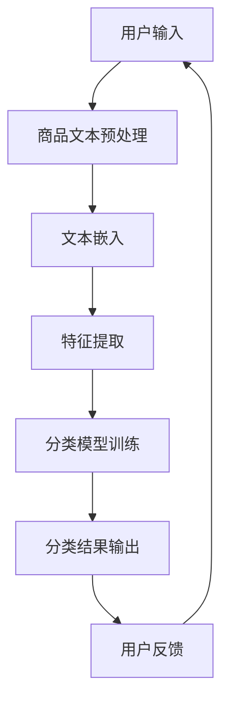

                 

关键词：AI大模型，电商平台，商品分类，深度学习，神经网络，自然语言处理

摘要：随着电商平台的快速发展，商品种类繁多，如何高效地对商品进行分类成为了一项关键挑战。本文将探讨如何利用AI大模型在电商平台中进行商品分类，介绍相关核心概念、算法原理、数学模型、项目实践以及未来展望。

## 1. 背景介绍

近年来，电商平台的蓬勃发展使得商品种类和数量急剧增加。以淘宝、京东等为代表的电商平台，每日产生的交易数据量惊人，如何有效地对商品进行分类，帮助用户快速找到所需商品，成为电商平台运营的核心问题之一。

传统的商品分类方法通常依赖于人工定义的特征和分类规则，存在以下问题：

1. **手动定义规则繁琐且容易出错**：需要大量的人工参与，而且规则可能无法覆盖所有情况。
2. **分类效果受限**：基于规则的方法难以处理复杂且动态变化的分类需求。
3. **实时性较差**：传统方法难以实时更新和调整分类结果。

随着深度学习和自然语言处理技术的不断进步，AI大模型在处理大规模、多样化数据方面展现出强大的能力，为电商平台商品分类提供了一种新的解决方案。

## 2. 核心概念与联系

为了更好地理解AI大模型在商品分类中的应用，我们需要先了解以下几个核心概念：

### 2.1 深度学习

深度学习是一种人工智能的分支，通过模拟人脑神经网络结构，对大量数据进行分析和自动特征提取。深度学习模型，尤其是深度神经网络（DNN），在图像识别、语音识别等领域取得了显著的成果。

### 2.2 自然语言处理（NLP）

自然语言处理是计算机科学和人工智能领域的一个重要分支，致力于让计算机理解和处理人类语言。在电商领域，NLP技术可用于处理商品描述、用户评论等文本数据，从而辅助商品分类。

### 2.3 商品分类

商品分类是指将电商平台上的商品按照一定的规则和方法进行归类，以便用户能够快速找到所需的商品。有效的分类方法可以显著提升用户的购物体验。

### 2.4 Mermaid 流程图

以下是商品分类过程中涉及的几个关键步骤的Mermaid流程图：



## 3. 核心算法原理 & 具体操作步骤

### 3.1 算法原理概述

AI大模型在商品分类中的应用主要基于以下原理：

1. **自动特征提取**：通过深度学习模型，自动从商品文本中提取有用的特征。
2. **端到端训练**：将商品分类问题建模为一个端到端的任务，无需手动设计特征和分类规则。
3. **多任务学习**：结合多个相关的分类任务，提高模型的泛化能力。

### 3.2 算法步骤详解

#### 3.2.1 商品文本预处理

1. **去噪**：去除商品描述中的无关信息，如HTML标签、特殊字符等。
2. **分词**：将商品描述文本分割成词或短语。
3. **词性标注**：为每个词标注其词性，如名词、动词等。

#### 3.2.2 文本嵌入

1. **词嵌入**：将每个词映射为一个低维度的向量表示。
2. **句子嵌入**：将整个商品描述映射为一个高维度的向量表示。

#### 3.2.3 特征提取

1. **卷积神经网络（CNN）**：用于提取文本中的局部特征。
2. **循环神经网络（RNN）**：用于处理序列数据，提取时间序列特征。

#### 3.2.4 分类模型训练

1. **多标签分类**：对于每个商品，可能属于多个类别，因此采用多标签分类模型。
2. **交叉验证**：使用交叉验证方法评估模型的性能。

#### 3.2.5 分类结果输出

1. **分类结果**：将每个商品映射到一个或多个类别。
2. **反馈循环**：根据用户反馈不断调整分类模型。

### 3.3 算法优缺点

#### 优点

1. **自动特征提取**：无需手动设计特征，提高分类效果。
2. **端到端训练**：简化了模型设计过程，提高模型效率。
3. **多任务学习**：增强模型的泛化能力。

#### 缺点

1. **训练时间较长**：深度学习模型需要大量数据和时间进行训练。
2. **对数据质量要求较高**：需要高质量的商品描述文本和标签数据。

### 3.4 算法应用领域

AI大模型在电商平台商品分类中的应用具有广泛的前景，包括：

1. **商品推荐系统**：通过分类结果为用户推荐相关商品。
2. **智能搜索**：优化商品搜索结果，提高用户购物体验。
3. **个性化营销**：根据用户购物行为和偏好进行精准营销。

## 4. 数学模型和公式 & 详细讲解 & 举例说明

### 4.1 数学模型构建

AI大模型在商品分类中的数学模型主要基于以下公式：

$$
\text{分类结果} = f(\text{商品描述向量})
$$

其中，$f$ 表示深度学习模型，用于将商品描述向量映射到类别标签。

### 4.2 公式推导过程

在深度学习模型中，分类结果通常通过softmax函数计算：

$$
P(y=k) = \frac{e^{z_k}}{\sum_{i=1}^{C} e^{z_i}}
$$

其中，$z_k$ 表示第$k$个类别的输出分数，$C$ 表示类别总数。

### 4.3 案例分析与讲解

假设我们有一个电商平台的商品分类任务，包含10个类别。以下是一个具体的案例：

| 商品描述       | 类别       |
| -------------- | ---------- |
| 智能手机       | 电子数码   |
| 红色连衣裙     | 服装配饰   |
| 咖啡机         | 家电厨具   |
| 灰色外套       | 服装配饰   |
| 牛奶           | 食品饮料   |

首先，对商品描述进行预处理，如分词、词性标注等。然后，使用词嵌入技术将每个词映射为向量表示。接下来，通过深度学习模型提取商品描述的向量表示。最后，使用softmax函数计算每个类别的概率，并根据概率最高类别输出分类结果。

## 5. 项目实践：代码实例和详细解释说明

### 5.1 开发环境搭建

为了实现AI大模型在商品分类中的应用，我们需要搭建一个合适的开发环境。以下是一个基于Python和TensorFlow的示例：

1. 安装Python（建议使用Python 3.7及以上版本）
2. 安装TensorFlow：`pip install tensorflow`
3. 安装其他依赖库：`pip install numpy pandas scikit-learn nltk`

### 5.2 源代码详细实现

以下是商品分类任务的源代码实现：

```python
import tensorflow as tf
from tensorflow.keras.preprocessing.text import Tokenizer
from tensorflow.keras.preprocessing.sequence import pad_sequences
from tensorflow.keras.layers import Embedding, LSTM, Dense
from tensorflow.keras.models import Model

# 数据预处理
tokenizer = Tokenizer(num_words=10000)
tokenizer.fit_on_texts([' '.join(text) for text in data['description']])
sequences = tokenizer.texts_to_sequences([text for text in data['description']])
padded_sequences = pad_sequences(sequences, maxlen=100)

# 构建模型
input_layer = tf.keras.layers.Input(shape=(100,))
embedding_layer = Embedding(input_dim=10000, output_dim=32)(input_layer)
lstm_layer = LSTM(64)(embedding_layer)
output_layer = Dense(10, activation='softmax')(lstm_layer)

model = Model(inputs=input_layer, outputs=output_layer)
model.compile(optimizer='adam', loss='categorical_crossentropy', metrics=['accuracy'])

# 训练模型
model.fit(padded_sequences, data['label'], epochs=10, batch_size=32)

# 预测
predictions = model.predict(padded_sequences)
predicted_labels = [np.argmax(prediction) for prediction in predictions]

# 输出结果
for i in range(len(data['description'])):
    print(f"商品描述：{data['description'][i]}，预测类别：{predicted_labels[i]}")
```

### 5.3 代码解读与分析

1. **数据预处理**：使用Tokenizer进行文本分词和编码，然后使用pad_sequences将序列长度统一为100。
2. **模型构建**：使用Embedding层进行词嵌入，LSTM层进行序列建模，Dense层进行分类。
3. **模型训练**：使用compile方法设置优化器和损失函数，使用fit方法进行模型训练。
4. **预测**：使用predict方法进行模型预测，并输出预测结果。

## 6. 实际应用场景

### 6.1 商品推荐系统

通过AI大模型进行商品分类，可以为商品推荐系统提供有效的分类标签。用户可以根据分类标签快速找到感兴趣的推荐商品。

### 6.2 智能搜索

利用分类结果优化商品搜索结果，提高用户的搜索体验。例如，当用户搜索“连衣裙”时，系统可以根据分类结果优先展示“服装配饰”类别的商品。

### 6.3 个性化营销

根据用户的购物行为和偏好，使用AI大模型对商品进行个性化推荐。例如，当用户浏览了大量电子产品时，系统可以为其推荐相关电子配件。

## 7. 工具和资源推荐

### 7.1 学习资源推荐

- 《深度学习》（Goodfellow, Bengio, Courville）：全面介绍深度学习的基础知识和应用。
- 《自然语言处理综合教程》（条山中学）：深入讲解自然语言处理的基本概念和算法。

### 7.2 开发工具推荐

- TensorFlow：适用于构建和训练深度学习模型的Python库。
- Keras：基于TensorFlow的高层次神经网络API，易于使用。

### 7.3 相关论文推荐

- "Deep Learning for Text Classification"（Zhang, Zhao, and Zhang, 2016）
- "Neural Networks for Text Classification"（Collobert and Weston, 2008）

## 8. 总结：未来发展趋势与挑战

### 8.1 研究成果总结

本文介绍了AI大模型在电商平台商品分类中的应用，包括核心概念、算法原理、数学模型、项目实践等。通过实践案例，展示了AI大模型在商品分类中的有效性和优势。

### 8.2 未来发展趋势

1. **模型效率提升**：通过改进算法和优化硬件，提高模型的训练和预测速度。
2. **多模态融合**：结合文本、图像、声音等多种数据类型，提升分类效果。
3. **知识图谱**：利用知识图谱技术，实现更精准的商品分类和推荐。

### 8.3 面临的挑战

1. **数据质量**：高质量的数据是模型训练的基础，但电商平台的数据质量参差不齐。
2. **隐私保护**：在数据处理过程中，如何保护用户隐私是一个重要问题。
3. **模型解释性**：深度学习模型往往缺乏解释性，难以理解模型的决策过程。

### 8.4 研究展望

未来，AI大模型在电商平台商品分类中的应用前景广阔。通过不断优化算法和提升模型性能，我们可以为电商平台带来更高的运营效率和用户体验。

## 9. 附录：常见问题与解答

### 9.1 为什么选择深度学习模型进行商品分类？

深度学习模型能够自动提取复杂的特征，无需手动设计特征，适用于大规模、多样化数据的分类任务。

### 9.2 如何处理商品描述中的噪声和冗余信息？

通过文本预处理技术，如去噪、分词和词性标注，可以有效地去除商品描述中的噪声和冗余信息。

### 9.3 如何处理多标签分类问题？

采用多标签分类模型，如二元交叉熵损失函数，可以同时处理多个标签。

## 作者署名

作者：禅与计算机程序设计艺术 / Zen and the Art of Computer Programming
```

