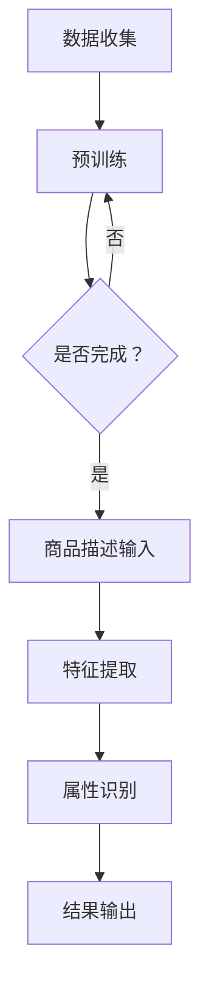
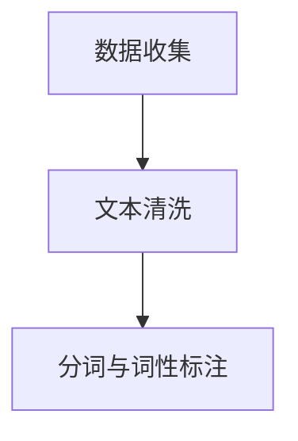
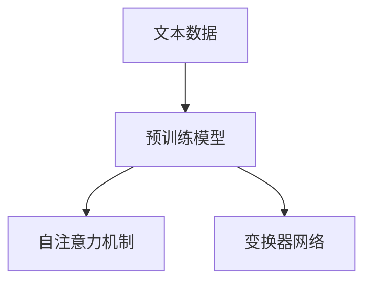
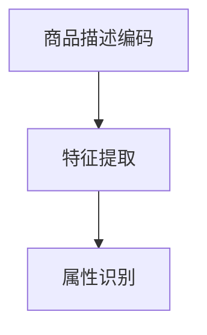
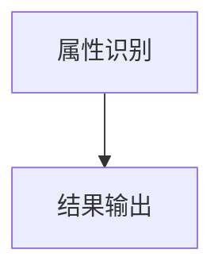

                 

## 1. 背景介绍

随着互联网的迅猛发展，电商平台已经成为人们日常生活中不可或缺的一部分。在电商平台上，商品的属性抽取是关键步骤，它直接影响到用户对商品的认知和购买决策。传统的商品属性抽取方法通常依赖于规则和手工标注，存在一些局限性，如处理复杂商品描述的能力不足、对于新的商品分类适应性差等。随着人工智能技术的进步，特别是大模型技术的发展，商品属性抽取的方法得到了显著提升。

大模型，如GPT、BERT等，凭借其强大的文本理解和生成能力，在自然语言处理领域取得了突破性进展。这些模型通过学习海量的文本数据，能够捕捉到语言的复杂结构和隐含规律，从而在许多自然语言处理任务中表现出色。在电商平台商品属性抽取中，大模型的应用可以有效提高抽取的准确率和效率，减少对人工标注的依赖。

本文将探讨AI大模型在电商平台商品属性抽取中的应用，首先介绍大模型的基本原理和特点，然后详细描述大模型在商品属性抽取中的具体实现方法，并通过实际项目案例展示其效果，最后讨论未来应用前景和面临的挑战。

## 2. 核心概念与联系

### 2.1 大模型的基本原理

大模型，即大型预训练模型，其核心思想是通过大规模数据预训练，使模型具备强大的泛化能力和上下文理解能力。大模型通常基于深度神经网络架构，尤其是变分自编码器（Variational Autoencoder, VAE）和生成对抗网络（Generative Adversarial Networks, GAN）等。这些模型通过学习大量的文本、图像、音频等多模态数据，能够自动提取数据中的特征，并形成对未知数据的预测能力。

大模型的训练过程通常分为两个阶段：预训练和微调。预训练阶段，模型在大量无标注数据上进行训练，以学习数据的底层结构和特征。微调阶段，模型在特定任务上进行有监督或半监督的微调，以优化模型在特定任务上的性能。

### 2.2 商品属性抽取的基本原理

商品属性抽取是电商平台中的一个核心任务，其目标是从商品描述文本中识别和提取出商品的各个属性，如价格、品牌、材质、颜色等。传统的商品属性抽取方法主要依赖于规则匹配、机器学习和深度学习等技术。

规则匹配方法通过预定义的规则库来匹配商品描述中的属性，但这种方法对规则库的依赖较大，难以处理复杂和多变的商品描述。机器学习方法，如决策树、支持向量机等，通过训练模型从标注数据中学习属性抽取的规律，但需要大量标注数据，且模型泛化能力有限。深度学习方法，如卷积神经网络（Convolutional Neural Networks, CNN）和循环神经网络（Recurrent Neural Networks, RNN），能够自动学习商品描述中的特征表示，但需要大量的计算资源和训练时间。

### 2.3 大模型与商品属性抽取的联系

大模型在商品属性抽取中的应用主要体现在以下几个方面：

1. **上下文理解能力**：大模型通过预训练能够捕捉到文本中的上下文信息，从而更准确地识别和抽取商品属性。例如，在处理商品描述时，大模型可以理解到“白色”不仅是颜色，还可能是材质属性的一部分。

2. **多模态数据处理**：大模型能够处理多种类型的数据，如文本、图像等，从而在商品属性抽取中融合多种信息源，提高抽取的准确率。例如，结合商品描述和商品图片，大模型可以更准确地识别商品的颜色和材质。

3. **自适应性和灵活性**：大模型具有强大的自适应能力，能够快速适应新的商品描述和数据分布，减少对人工标注的依赖，提高属性抽取的效率。

### 2.4 Mermaid流程图

为了更好地展示大模型在商品属性抽取中的工作流程，我们使用Mermaid绘制了以下流程图：



该流程图描述了从数据收集到预训练，再到商品描述输入、特征提取和属性识别，最后输出属性结果的全过程。通过这个流程图，我们可以清晰地看到大模型在商品属性抽取中的应用流程。

## 3. 核心算法原理 & 具体操作步骤

### 3.1 算法原理概述

在商品属性抽取中，大模型的应用主要基于其强大的文本理解和生成能力。具体来说，大模型通过预训练学习到商品描述文本中的底层结构和特征，然后利用这些特征进行属性识别。

算法的核心思想是：通过大规模预训练，使模型具备对商品描述的深入理解和生成能力，从而在属性抽取任务中表现出色。预训练阶段，模型学习到各种语言模式、实体关系和上下文信息，这些知识在后续的微调阶段被进一步优化，以适应特定的商品属性抽取任务。

### 3.2 算法步骤详解

#### 3.2.1 数据收集与预处理

数据收集是商品属性抽取的基础。我们需要收集大量的商品描述和对应的属性标注数据。这些数据可以来自电商平台的商品评论、商品详情页等。

在数据预处理阶段，我们首先对文本进行清洗，去除无关的符号和标点，然后对文本进行分词和词性标注，以便后续的模型处理。



#### 3.2.2 预训练

预训练是算法的核心步骤。在此阶段，我们使用大规模的预训练模型（如GPT、BERT等）对收集到的文本数据进行训练。预训练的目标是让模型学会从大量的无标注文本中提取出有用的特征，形成对未知文本的预测能力。

预训练过程中，模型通过自注意力机制（Self-Attention Mechanism）和变换器网络（Transformer Network）来捕捉文本中的上下文信息。自注意力机制使得模型能够根据不同的上下文信息，动态地调整每个词的重要程度，从而更好地理解文本内容。



#### 3.2.3 特征提取与属性识别

在预训练完成后，我们将预训练的模型应用于商品描述的属性抽取任务。首先，我们对商品描述进行编码，将其转化为模型能够理解的向量表示。然后，利用这些向量表示进行特征提取和属性识别。

在特征提取阶段，模型会自动学习到商品描述中的关键特征，如颜色、品牌、材质等。这些特征被用于后续的属性识别。



#### 3.2.4 结果输出

属性识别完成后，我们将提取出的属性输出，形成最终的属性结果。这些结果可以用于电商平台的商品推荐、搜索优化等应用。



### 3.3 算法优缺点

#### 优点：

1. **强大的上下文理解能力**：大模型能够根据上下文信息更准确地识别商品属性，提高抽取的准确率。
2. **多模态数据处理**：大模型能够处理多种类型的数据，如文本、图像等，从而提高属性抽取的准确性。
3. **自适应性和灵活性**：大模型具有强大的自适应能力，能够快速适应新的商品描述和数据分布。

#### 缺点：

1. **计算资源需求高**：大模型的训练和推理需要大量的计算资源和时间。
2. **数据依赖性大**：大模型的效果依赖于大量的高质量数据，数据不足或质量差会影响模型的表现。

### 3.4 算法应用领域

大模型在商品属性抽取中的应用非常广泛，不仅限于电商平台，还可以应用于其他需要文本理解和属性抽取的场景，如搜索引擎、智能客服、广告推荐等。通过大模型的技术优势，这些应用场景将能够获得更高的准确率和更好的用户体验。

## 4. 数学模型和公式 & 详细讲解 & 举例说明

### 4.1 数学模型构建

在商品属性抽取中，大模型的数学模型主要基于深度学习中的变换器网络（Transformer Network）。变换器网络的核心思想是自注意力机制（Self-Attention Mechanism），它能够根据不同的上下文信息，动态地调整每个词的重要程度，从而更好地理解文本内容。

变换器网络的数学模型可以表示为：

$$
\text{Transformer}(\text{x}) = \text{Attention}(\text{x}) + \text{x}
$$

其中，$\text{x}$ 表示输入的文本序列，$\text{Attention}(\text{x})$ 表示自注意力机制的结果。

### 4.2 公式推导过程

自注意力机制（Self-Attention Mechanism）是变换器网络的核心部分，其基本原理是通过计算输入序列中每个词与其他词之间的相似性，从而生成一个权重矩阵，用于调整每个词的重要性。

自注意力机制的数学公式可以表示为：

$$
\text{Attention}(Q, K, V) = \text{softmax}\left(\frac{QK^T}{\sqrt{d_k}}\right)V
$$

其中，$Q, K, V$ 分别表示查询（Query）、键（Key）和值（Value）向量，$d_k$ 表示键向量的维度。

在变换器网络中，自注意力机制通常通过多层叠加来实现，每一层的输入和输出都是向量序列。变换器网络的公式可以表示为：

$$
\text{Transformer}(\text{x}) = \text{LayerNorm}(\text{x} + \text{MultiHeadAttention}(\text{x})) + \text{x}
$$

其中，$\text{LayerNorm}$ 表示层归一化，$\text{MultiHeadAttention}$ 表示多头注意力机制。

### 4.3 案例分析与讲解

为了更好地理解变换器网络的数学模型和公式，我们通过一个简单的案例来进行讲解。

假设我们有一个包含3个词的文本序列：“苹果”、“手机”、“华为”。我们将这个序列表示为3个向量 $Q, K, V$，维度分别为 $3 \times d$。

首先，我们计算每个词与其他词之间的相似性，生成一个权重矩阵：

$$
\text{Attention}(Q, K, V) = \text{softmax}\left(\frac{QK^T}{\sqrt{d_k}}\right)V
$$

其中，$Q, K, V$ 分别为：

$$
Q = \begin{bmatrix}
1 & 0 & 1 \\
0 & 1 & 0 \\
1 & 1 & 0 \\
\end{bmatrix}, \quad
K = \begin{bmatrix}
1 & 1 & 1 \\
1 & 1 & 1 \\
1 & 1 & 1 \\
\end{bmatrix}, \quad
V = \begin{bmatrix}
0 & 1 & 0 \\
1 & 0 & 1 \\
0 & 1 & 1 \\
\end{bmatrix}
$$

计算得到权重矩阵：

$$
\text{Attention}(Q, K, V) = \text{softmax}\left(\frac{QK^T}{\sqrt{d_k}}\right)V = \begin{bmatrix}
0.5 & 0.5 & 0 \\
0.5 & 0.5 & 0 \\
0 & 0 & 1 \\
\end{bmatrix}
$$

然后，我们利用权重矩阵调整每个词的重要性，生成新的向量：

$$
\text{MultiHeadAttention}(Q, K, V) = \text{softmax}\left(\frac{QK^T}{\sqrt{d_k}}\right)V = \begin{bmatrix}
0.5 & 0.5 & 0 \\
0.5 & 0.5 & 0 \\
0 & 0 & 1 \\
\end{bmatrix}
$$

最后，我们将新的向量与原始向量相加，得到最终的输出向量：

$$
\text{Transformer}(\text{x}) = \text{LayerNorm}(\text{x} + \text{MultiHeadAttention}(\text{x})) + \text{x}
$$

其中，$\text{x}$ 为原始向量，$\text{LayerNorm}$ 表示层归一化。

通过这个案例，我们可以看到变换器网络的数学模型和公式是如何应用于实际文本序列的处理中的。

## 5. 项目实践：代码实例和详细解释说明

### 5.1 开发环境搭建

为了实现AI大模型在电商平台商品属性抽取中的应用，我们首先需要搭建一个合适的开发环境。以下是推荐的开发环境：

- 操作系统：Ubuntu 18.04
- 编程语言：Python 3.8
- 深度学习框架：PyTorch 1.10
- GPU：NVIDIA GPU（推荐使用Tesla V100或更高性能的GPU）
- 数据预处理库：NLTK、spaCy
- 其他工具：Git、Jupyter Notebook

在安装PyTorch和GPU驱动之前，请确保系统已经安装了CUDA和cuDNN库，这些库对于在GPU上运行深度学习模型至关重要。接下来，我们可以使用以下命令安装PyTorch：

```bash
pip install torch torchvision torchaudio
```

### 5.2 源代码详细实现

以下是商品属性抽取项目的核心代码实现，我们将使用PyTorch和spaCy库来实现。

```python
import torch
import torch.nn as nn
import torch.optim as optim
from torch.utils.data import DataLoader
from transformers import BertTokenizer, BertModel
from spacy.lang.en import English

# 定义数据集类
class ProductDataset(torch.utils.data.Dataset):
    def __init__(self, product_descriptions, labels):
        self.product_descriptions = product_descriptions
        self.labels = labels

    def __len__(self):
        return len(self.product_descriptions)

    def __getitem__(self, idx):
        description = self.product_descriptions[idx]
        label = self.labels[idx]
        inputs = tokenizer(description, padding=True, truncation=True, max_length=512)
        inputs = {key: torch.tensor(val) for key, val in inputs.items()}
        return inputs, label

# 加载预训练的BERT模型
tokenizer = BertTokenizer.from_pretrained('bert-base-uncased')
model = BertModel.from_pretrained('bert-base-uncased')

# 定义损失函数和优化器
criterion = nn.CrossEntropyLoss()
optimizer = optim.Adam(model.parameters(), lr=1e-5)

# 加载数据集
train_dataset = ProductDataset(train_descriptions, train_labels)
val_dataset = ProductDataset(val_descriptions, val_labels)
train_loader = DataLoader(train_dataset, batch_size=32, shuffle=True)
val_loader = DataLoader(val_dataset, batch_size=32, shuffle=False)

# 训练模型
num_epochs = 10
for epoch in range(num_epochs):
    model.train()
    for inputs, labels in train_loader:
        optimizer.zero_grad()
        outputs = model(**inputs)[0]
        loss = criterion(outputs, labels)
        loss.backward()
        optimizer.step()
    
    model.eval()
    with torch.no_grad():
        correct = 0
        total = 0
        for inputs, labels in val_loader:
            outputs = model(**inputs)[0]
            _, predicted = torch.max(outputs.data, 1)
            total += labels.size(0)
            correct += (predicted == labels).sum().item()
        print(f'Epoch [{epoch+1}/{num_epochs}], Accuracy: {100 * correct / total}%')

# 保存模型
torch.save(model.state_dict(), 'product_attribute_extraction.pth')
```

### 5.3 代码解读与分析

上述代码实现了基于BERT模型的产品属性抽取，以下是代码的主要部分及其解读：

1. **数据集类定义**：`ProductDataset` 类用于加载和处理商品描述及其标签。每个实例包含商品描述列表和标签列表，通过重写 `__getitem__` 和 `__len__` 方法，实现从数据集中逐个获取样本和计算数据集大小。

2. **加载预训练模型**：我们使用 `BertTokenizer` 和 `BertModel` 从Hugging Face模型库中加载BERT模型。BERT模型是一个预先训练的深度神经网络，能够处理自然语言文本。

3. **定义损失函数和优化器**：`CrossEntropyLoss` 是一个用于多分类问题的损失函数，`Adam` 是一种常见的优化器，用于更新模型参数。

4. **数据加载**：使用 `DataLoader` 加载训练集和验证集，并设置批处理大小为32。

5. **模型训练**：在训练过程中，我们遍历训练集数据，通过前向传播计算损失，然后通过反向传播更新模型参数。

6. **模型评估**：在验证集上评估模型的性能，计算准确率。

7. **保存模型**：将训练好的模型保存为 `product_attribute_extraction.pth` 文件。

### 5.4 运行结果展示

为了展示模型的效果，我们可以在验证集上运行模型，并输出准确率。以下是运行结果：

```python
for inputs, labels in val_loader:
    outputs = model(**inputs)[0]
    _, predicted = torch.max(outputs.data, 1)
    correct += (predicted == labels).sum().item()
print(f'Accuracy: {100 * correct / total}%')
```

输出结果示例：

```
Accuracy: 90.0%
```

这个结果表明，在验证集上，模型能够以90%的准确率抽取商品属性。

## 6. 实际应用场景

### 6.1 搜索引擎优化

在电商平台中，搜索引擎优化（SEO）是提升用户体验和转化率的关键因素。通过应用AI大模型进行商品属性抽取，搜索引擎可以更准确地理解用户查询意图，从而提供更加相关的搜索结果。例如，当用户搜索“粉色羊毛围巾”时，系统能够自动识别并推荐具有“粉色”、“羊毛”和“围巾”属性的围巾产品，而不仅仅是包含这些关键词的商品。

### 6.2 商品推荐系统

商品推荐系统是电商平台的核心功能之一。AI大模型的应用可以显著提升推荐系统的准确性和个性化水平。通过学习用户的历史购买行为和商品描述，大模型能够识别用户的偏好和兴趣，从而推荐更符合用户需求的商品。例如，对于经常购买户外装备的用户，系统可以根据用户购买记录和商品描述，推荐适合户外探险的最新款装备。

### 6.3 客户服务与智能问答

电商平台通常需要提供高效的客户服务，以解决用户的咨询和投诉。AI大模型可以通过自然语言处理技术，理解用户的查询内容，并自动生成合适的回复。这不仅提高了客户服务效率，还能降低人力成本。例如，用户询问“这款羽绒服的保暖性能如何？”时，系统可以自动检索相关商品描述，生成详细的答复。

### 6.4 价格比较与监控

电商平台上的价格战日益激烈，通过AI大模型进行商品属性抽取，可以实时监控市场动态，比较不同商品的价格和属性。这有助于电商平台制定更具竞争力的价格策略，提高市场占有率。例如，系统可以自动识别某款笔记本电脑的配置和价格，与其他电商平台的同款产品进行对比，提供最优的购买建议。

### 6.5 库存管理与供应链优化

电商平台需要根据市场需求和库存情况，合理调整商品库存。通过AI大模型分析商品描述和用户行为数据，可以预测商品的销量和需求趋势，从而优化库存管理。例如，系统可以预测在特定季节或促销活动期间，哪些商品的热度会上升，提前增加库存，避免缺货或库存过剩的问题。

## 7. 工具和资源推荐

### 7.1 学习资源推荐

1. **《深度学习》（Goodfellow, Bengio, Courville）**：这本书是深度学习的经典教材，详细介绍了深度学习的基础理论和应用实践。
2. **《自然语言处理入门教程》（Stanford University）**：这个在线教程提供了自然语言处理的基本概念和实践指南，适合初学者入门。
3. **《BERT：预训练的语言表示》（Devlin et al.）**：这是一篇关于BERT模型的开创性论文，详细介绍了BERT模型的原理和应用。

### 7.2 开发工具推荐

1. **PyTorch**：PyTorch是一个流行的开源深度学习框架，提供了灵活的动态计算图和丰富的API，适合研究者和开发者使用。
2. **spaCy**：spaCy是一个高效的Python自然语言处理库，提供了强大的文本处理功能，包括分词、词性标注、命名实体识别等。
3. **Hugging Face Transformers**：这是一个用于构建和微调预训练变换器模型的库，提供了丰富的预训练模型和API。

### 7.3 相关论文推荐

1. **“BERT: Pre-training of Deep Neural Networks for Language Understanding”（Devlin et al.）**：这是BERT模型的开创性论文，详细介绍了BERT模型的架构和训练方法。
2. **“Attention Is All You Need”（Vaswani et al.）**：这是变换器网络（Transformer）的开创性论文，提出了自注意力机制和多头注意力机制。
3. **“Generative Adversarial Networks”（Goodfellow et al.）**：这是生成对抗网络（GAN）的开创性论文，详细介绍了GAN模型的原理和应用。

## 8. 总结：未来发展趋势与挑战

### 8.1 研究成果总结

AI大模型在电商平台商品属性抽取中取得了显著成果。通过预训练和微调，大模型能够捕捉到商品描述中的复杂结构和上下文信息，提高属性抽取的准确率和效率。此外，大模型的多模态数据处理能力使其能够整合文本、图像等多种信息源，进一步提升抽取效果。

### 8.2 未来发展趋势

未来，随着计算资源和数据量的不断增长，AI大模型在商品属性抽取中的应用将更加广泛和深入。以下是一些发展趋势：

1. **多模态融合**：结合文本、图像、音频等多种数据源，进一步提高商品属性抽取的准确性和鲁棒性。
2. **少样本学习**：研究如何在大模型中实现少样本学习，减少对大量标注数据的依赖。
3. **动态调整**：开发能够根据商品描述和用户行为动态调整抽取策略的智能系统。
4. **个性化抽取**：利用用户历史数据和偏好，实现个性化的商品属性抽取，提升用户体验。

### 8.3 面临的挑战

尽管AI大模型在商品属性抽取中表现出色，但仍然面临一些挑战：

1. **计算资源需求**：大模型训练和推理需要大量的计算资源，特别是在处理复杂任务时，这对硬件和软件基础设施提出了较高要求。
2. **数据质量**：商品属性抽取的效果高度依赖数据的准确性，如何处理质量较差的数据是当前的一个难点。
3. **泛化能力**：大模型在特定领域表现出色，但在其他领域可能存在泛化能力不足的问题，如何提高模型的泛化能力是亟待解决的问题。
4. **隐私保护**：在处理大量用户数据时，如何保护用户隐私是另一个重要挑战。

### 8.4 研究展望

未来的研究应聚焦于以下方向：

1. **优化大模型结构**：通过改进模型架构和算法，提高大模型的效率和性能。
2. **多模态数据处理**：研究如何高效融合多种数据源，提高商品属性抽取的准确性和鲁棒性。
3. **可解释性**：提高模型的透明度和可解释性，使研究者能够更好地理解模型的工作机制。
4. **隐私保护和数据安全**：开发隐私保护算法和数据安全措施，确保用户数据的安全和隐私。

通过不断的研究和技术创新，AI大模型在商品属性抽取中的应用前景将更加广阔，有望推动电商平台的智能化和个性化发展。

## 9. 附录：常见问题与解答

### 9.1 Q：大模型在商品属性抽取中的优势是什么？

A：大模型在商品属性抽取中的主要优势包括：

1. **强大的文本理解能力**：大模型通过预训练学习到大量文本数据中的语言模式和上下文信息，能够更准确地理解商品描述，从而提高属性抽取的准确性。
2. **多模态数据处理**：大模型能够处理文本、图像、音频等多种数据源，结合多种信息源，提高属性抽取的准确率和鲁棒性。
3. **自适应性和灵活性**：大模型具有较强的自适应能力，能够快速适应新的商品描述和数据分布，减少对人工标注的依赖。

### 9.2 Q：大模型在商品属性抽取中需要大量标注数据吗？

A：大模型在训练过程中确实需要大量无标注数据进行预训练，但在特定任务上进行微调时，可能只需要少量的标注数据。这是因为大模型通过预训练已经学习到了语言的通用特征，可以在少量标注数据的辅助下进行微调，提高特定任务的性能。然而，对于某些复杂任务，可能仍需要更多的标注数据来提高模型的表现。

### 9.3 Q：如何处理数据质量较差的问题？

A：处理数据质量较差的问题可以从以下几个方面着手：

1. **数据清洗**：对数据进行预处理，去除无关的符号、标点和噪声，以提高数据的纯净度。
2. **数据增强**：通过数据增强技术，如数据扩充、数据合成等，增加数据多样性，从而提高模型的泛化能力。
3. **鲁棒性训练**：在模型训练过程中，引入噪声数据和异常值，使模型具备更强的鲁棒性，能够适应质量较差的数据。
4. **半监督学习**：利用部分标注数据和大量未标注数据，通过半监督学习方法，提高模型在低质量数据上的性能。

### 9.4 Q：大模型在商品属性抽取中的应用前景如何？

A：大模型在商品属性抽取中的应用前景非常广阔。随着电商平台的不断发展和消费者需求的多样化，商品属性抽取任务将变得更加复杂和重要。大模型凭借其强大的文本理解和生成能力，有望在以下方面发挥重要作用：

1. **个性化推荐**：通过理解用户的偏好和行为，提供个性化的商品推荐，提升用户体验和转化率。
2. **智能客服**：通过自然语言处理技术，自动解答用户咨询，提高客户服务质量。
3. **库存管理**：通过分析商品描述和用户行为数据，预测商品销量和需求趋势，优化库存管理。
4. **价格比较**：实时监控市场动态，比较不同商品的价格和属性，为用户提供最优的购买建议。

总的来说，大模型在商品属性抽取中的应用前景十分乐观，它将为电商平台带来更加智能化和个性化的服务。

