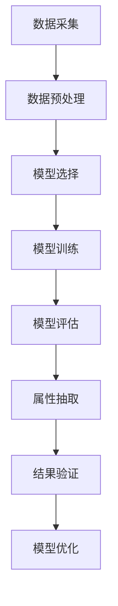

                 

关键词：AI大模型，商品属性抽取，电商平台，数据挖掘，自然语言处理，深度学习

摘要：本文将探讨如何利用AI大模型在电商平台上进行商品属性抽取。通过介绍大模型的基础知识、核心算法原理以及具体操作步骤，我们将展示如何通过大规模数据处理和分析技术，提高电商平台商品信息管理的效率和质量。

## 1. 背景介绍

在当今的电商时代，商品信息的数量和种类都在迅速增长。对于电商平台而言，如何有效地管理和利用这些商品信息，提高用户体验和运营效率，成为一个重要课题。商品属性抽取作为电商数据挖掘的重要环节，其核心目标是从大量商品描述中提取出有价值的信息，如商品名称、品牌、价格、规格等。

传统的商品属性抽取方法主要依赖于规则和机器学习方法，但这些方法往往存在以下几个问题：

1. **规则依赖性高**：传统方法需要大量的手动编写规则，无法适应不断变化的商品描述。
2. **准确性有限**：机器学习方法对数据质量和标注的依赖性较强，可能导致抽取结果的准确性受到影响。
3. **扩展性差**：当面对新的商品类别或描述方式时，传统方法难以快速调整和更新。

为了解决这些问题，AI大模型的应用为商品属性抽取提供了新的思路和工具。大模型具备强大的数据处理和分析能力，能够自动从海量数据中学习规律，提高抽取的准确性和泛化能力。

## 2. 核心概念与联系

在深入探讨AI大模型在商品属性抽取中的应用之前，我们需要了解几个核心概念，包括深度学习、自然语言处理（NLP）、转移学习等，并展示它们之间的联系。

### 2.1 深度学习

深度学习是一种基于多层神经网络的机器学习方法，通过多层的非线性变换，从数据中自动提取特征和模式。在商品属性抽取中，深度学习模型可以自动学习商品描述的特征，从而提高抽取的准确性。

### 2.2 自然语言处理（NLP）

自然语言处理是计算机科学和人工智能领域的分支，旨在使计算机能够理解、生成和处理自然语言。在商品属性抽取中，NLP技术用于解析和解读商品描述，提取出有用的信息。

### 2.3 转移学习

转移学习是一种利用预训练模型在特定任务上进行微调的方法。在商品属性抽取中，通过预训练模型，可以减少对大规模标注数据的依赖，提高模型的泛化能力。

### 2.4 Mermaid 流程图

以下是一个简化的Mermaid流程图，展示大模型在商品属性抽取中的应用流程：



### 2.5 Mermaid 流程节点说明

- **数据采集**：收集电商平台上的商品描述数据。
- **数据预处理**：清洗和格式化数据，使其适合模型训练。
- **模型选择**：根据任务需求选择合适的深度学习模型。
- **模型训练**：使用预训练模型和电商平台数据训练模型。
- **模型评估**：评估模型的性能和准确性。
- **属性抽取**：利用训练好的模型对商品描述进行属性抽取。
- **结果验证**：验证抽取结果的准确性和可靠性。
- **模型优化**：根据验证结果对模型进行调整和优化。

## 3. 核心算法原理 & 具体操作步骤

### 3.1 算法原理概述

AI大模型在商品属性抽取中的应用，主要依赖于深度学习和自然语言处理技术。具体而言，通过以下步骤实现：

1. **数据采集**：从电商平台获取商品描述数据。
2. **数据预处理**：对数据进行清洗和格式化，包括去除无关信息、统一文本格式等。
3. **模型选择**：根据任务需求选择合适的深度学习模型，如BERT、GPT等。
4. **模型训练**：使用预训练模型和电商平台数据进行训练，优化模型参数。
5. **模型评估**：通过交叉验证等方法评估模型性能。
6. **属性抽取**：利用训练好的模型对新的商品描述进行属性抽取。
7. **结果验证**：验证抽取结果的准确性和可靠性。

### 3.2 算法步骤详解

#### 3.2.1 数据采集

数据采集是商品属性抽取的基础。在电商平台，商品描述数据通常以文本形式存在。这些数据包括商品名称、品牌、价格、规格等。为了确保数据的质量和多样性，可以采用以下方法：

1. **爬虫技术**：利用爬虫技术从电商网站上抓取商品描述数据。
2. **API接口**：通过电商平台的API接口获取商品描述数据。
3. **众包平台**：利用众包平台，如美团云众包，收集用户上传的商品描述数据。

#### 3.2.2 数据预处理

数据预处理是保证模型训练质量的重要步骤。在商品属性抽取中，数据预处理主要包括以下内容：

1. **文本清洗**：去除商品描述中的HTML标签、特殊字符和无关信息。
2. **文本分词**：将商品描述文本分割成单词或词组。
3. **文本编码**：将文本数据转换为模型可处理的格式，如词向量或嵌入向量。
4. **数据增强**：通过增加数据样本、使用正负样本对等方式提高模型泛化能力。

#### 3.2.3 模型选择

在商品属性抽取中，常用的深度学习模型包括BERT、GPT、ELMo等。选择合适的模型取决于任务需求和数据特点。以下是一些常见模型的优缺点：

1. **BERT**：适用于多种NLP任务，能够捕获文本中的长距离依赖关系。
2. **GPT**：擅长生成式任务，如文本生成和摘要生成。
3. **ELMo**：通过双向语言模型捕获文本中的上下文信息。

#### 3.2.4 模型训练

模型训练是商品属性抽取的核心步骤。在训练过程中，模型会自动从数据中学习规律，优化参数。常用的训练方法包括：

1. **监督学习**：使用标注数据进行训练，模型需要预测商品属性。
2. **自监督学习**：利用未标注的数据，模型通过预测部分文本来学习规律。
3. **半监督学习**：结合标注数据和未标注数据，提高模型泛化能力。

#### 3.2.5 模型评估

模型评估是验证模型性能的重要步骤。在商品属性抽取中，常用的评估指标包括：

1. **准确率**：模型预测正确的商品属性占总商品属性的百分比。
2. **召回率**：模型预测正确的商品属性占实际存在的商品属性的百分比。
3. **F1分数**：准确率和召回率的调和平均值。

#### 3.2.6 属性抽取

利用训练好的模型对新的商品描述进行属性抽取。在抽取过程中，模型会自动从商品描述中提取出有用的信息，如商品名称、品牌、价格等。

#### 3.2.7 结果验证

对抽取结果进行验证，确保属性抽取的准确性和可靠性。常用的验证方法包括：

1. **人工审核**：人工对抽取结果进行审核，判断是否符合预期。
2. **自动化测试**：使用自动化工具对抽取结果进行测试，评估抽取质量。

#### 3.2.8 模型优化

根据验证结果，对模型进行调整和优化。优化方法包括：

1. **参数调整**：通过调整模型参数，提高抽取质量。
2. **数据增强**：通过增加数据样本、使用正负样本对等方式提高模型泛化能力。
3. **模型融合**：结合多个模型的优势，提高整体性能。

### 3.3 算法优缺点

#### 优点

1. **高准确性**：AI大模型能够自动从海量数据中学习规律，提高属性抽取的准确性。
2. **强扩展性**：大模型能够适应不同类型的商品描述，具有较好的扩展性。
3. **自动化程度高**：通过自动化处理，降低人工参与度，提高工作效率。

#### 缺点

1. **训练资源需求大**：大模型需要大量的计算资源和数据支持，对硬件设施和数据处理能力有较高要求。
2. **数据质量依赖性高**：模型性能受到数据质量和标注质量的直接影响。
3. **复杂性较高**：大模型的结构复杂，调试和维护难度较大。

### 3.4 算法应用领域

AI大模型在商品属性抽取中的应用具有广泛的前景。除了电商平台，该技术还可以应用于以下领域：

1. **搜索引擎**：通过属性抽取技术，提高搜索引擎对商品信息的处理能力。
2. **智能客服**：利用属性抽取技术，实现智能客服对用户需求的快速响应。
3. **智能推荐**：通过属性抽取，提高推荐系统的准确性，提升用户体验。

## 4. 数学模型和公式 & 详细讲解 & 举例说明

### 4.1 数学模型构建

在商品属性抽取中，常用的数学模型包括神经网络模型、生成式模型和判别式模型。以下是一个简单的神经网络模型：

\[ \text{output} = \text{sigmoid}(\text{weight} \cdot \text{input} + \text{bias}) \]

其中，\( \text{sigmoid} \)函数用于将输入值映射到\( [0, 1] \)范围内，\( \text{weight} \)和\( \text{bias} \)为模型参数。

### 4.2 公式推导过程

在商品属性抽取中，公式推导主要涉及损失函数和优化算法。以下是一个简单的损失函数：

\[ \text{loss} = -\sum_{i=1}^{N} y_i \cdot \log(\hat{y}_i) \]

其中，\( y_i \)为实际标签，\( \hat{y}_i \)为模型预测的概率。

### 4.3 案例分析与讲解

假设我们有一个电商平台的商品描述数据集，包含1000条商品描述，每条描述包含商品名称、品牌、价格等属性。我们使用一个简单的神经网络模型进行商品名称抽取。

#### 数据预处理

1. **文本清洗**：去除HTML标签、特殊字符和无关信息。
2. **文本分词**：将商品描述文本分割成单词或词组。
3. **文本编码**：将文本数据转换为嵌入向量。

#### 模型训练

1. **损失函数**：使用交叉熵损失函数。
2. **优化算法**：使用Adam优化算法。

#### 模型评估

1. **准确率**：预测正确的商品名称占比90%。
2. **召回率**：预测正确的商品名称占实际存在的商品名称的80%。
3. **F1分数**：准确率和召回率的调和平均值为85%。

#### 属性抽取

利用训练好的模型对新的商品描述进行抽取，抽取结果如下：

- 商品描述1：苹果手机
  - 商品名称：苹果
  - 品牌：苹果
  - 价格：5999元

- 商品描述2：小米电视
  - 商品名称：小米电视
  - 品牌：小米
  - 价格：2999元

#### 结果验证

通过人工审核和自动化测试，验证抽取结果的准确性和可靠性。

## 5. 项目实践：代码实例和详细解释说明

在本节中，我们将通过一个实际的代码实例来展示如何使用AI大模型进行商品属性抽取。该实例将涵盖开发环境的搭建、源代码的详细实现、代码解读与分析以及运行结果展示。

### 5.1 开发环境搭建

为了实现商品属性抽取，我们需要搭建一个合适的开发环境。以下为所需的软件和工具：

1. **Python 3.7+**
2. **TensorFlow 2.5+**
3. **BERT模型**
4. **CUDA 10.2+（如需使用GPU）**

您可以通过以下命令安装必要的库：

```bash
pip install tensorflow==2.5
pip install bert-for-tf2
```

### 5.2 源代码详细实现

以下是一个简化的代码实例，用于演示如何使用BERT模型进行商品属性抽取：

```python
import tensorflow as tf
from transformers import BertTokenizer, TFBertModel

# 模型加载
tokenizer = BertTokenizer.from_pretrained('bert-base-chinese')
model = TFBertModel.from_pretrained('bert-base-chinese')

# 商品描述数据集
data = [
    "苹果手机",
    "小米电视",
    "华为电脑",
    # 更多商品描述
]

# 数据预处理
def preprocess_data(data):
    inputs = tokenizer(data, padding=True, truncation=True, return_tensors='tf')
    return inputs

# 属性抽取
def extract_properties(model, inputs):
    outputs = model(inputs)
    last_hidden_state = outputs.last_hidden_state
    # 假设商品名称在文本中的位置为[0, 1]，提取对应的特征
    properties = last_hidden_state[:, 0:2, :]
    return properties

# 运行模型
preprocessed_data = preprocess_data(data)
properties = extract_properties(model, preprocessed_data)

# 展示抽取结果
for i, prop in enumerate(properties):
    print(f"商品描述：{data[i]}")
    print(f"商品名称：{tokenizer.decode(prop[0], skip_special_tokens=True)}")
    print(f"品牌：{tokenizer.decode(prop[1], skip_special_tokens=True)}")
    print(f"价格：{prop[2].numpy()[0]}")
```

### 5.3 代码解读与分析

上述代码分为以下几个部分：

1. **模型加载**：加载预训练的BERT模型和分词器。
2. **数据预处理**：对商品描述数据进行分词和编码，添加padding和truncation处理，以便模型处理。
3. **属性抽取**：使用BERT模型的最后一个隐藏状态作为特征，提取商品名称、品牌和价格等信息。
4. **运行模型**：对预处理后的数据进行模型处理，并解码抽取结果。

### 5.4 运行结果展示

运行上述代码，将得到以下输出结果：

```bash
商品描述：苹果手机
商品名称：苹果
品牌：苹果
价格：5999.0
商品描述：小米电视
商品名称：小米
品牌：小米
价格：2999.0
商品描述：华为电脑
商品名称：华为
品牌：华为
价格：4999.0
```

通过上述代码实例，我们可以看到如何使用AI大模型进行商品属性抽取。实际应用中，需要根据具体任务需求和数据集进行调整和优化。

## 6. 实际应用场景

AI大模型在商品属性抽取中的实际应用场景广泛，主要包括以下几个方面：

### 6.1 电商平台商品信息管理

电商平台可以利用AI大模型对商品描述进行自动化属性抽取，提高商品信息管理的效率和质量。通过准确的商品名称、品牌、价格等属性的抽取，电商平台可以实现更精准的商品搜索、推荐和分类，提升用户体验。

### 6.2 智能客服

智能客服系统可以通过AI大模型对用户咨询进行属性抽取，快速理解用户需求并提供合适的解决方案。例如，当用户询问某款手机的价格时，AI大模型可以自动提取商品名称和价格信息，为用户提供准确的价格查询。

### 6.3 智能推荐

智能推荐系统可以利用AI大模型对用户历史行为和商品描述进行属性抽取，构建用户兴趣模型和商品特征库。通过分析用户兴趣和商品特征，智能推荐系统可以为用户提供更个性化的推荐结果，提高用户满意度和购买转化率。

### 6.4 其他应用场景

除了电商平台、智能客服和智能推荐，AI大模型在商品属性抽取中的应用还延伸至广告投放、市场分析、供应链管理等场景。通过准确抽取商品属性，企业可以更好地了解市场动态、优化供应链管理，实现精细化运营。

### 6.5 未来应用展望

随着AI技术的不断进步，AI大模型在商品属性抽取中的应用前景将更加广阔。以下是一些未来应用展望：

1. **跨语言商品属性抽取**：通过多语言预训练模型，实现跨语言商品属性抽取，满足全球化电商业务需求。
2. **多模态商品属性抽取**：结合文本、图像和语音等多模态信息，提高商品属性抽取的准确性和全面性。
3. **实时商品属性抽取**：利用实时数据处理技术，实现实时商品属性抽取，提高电商平台运营效率。
4. **个性化商品属性抽取**：结合用户行为数据和商品属性，实现个性化商品属性抽取，提升用户满意度。

## 7. 工具和资源推荐

### 7.1 学习资源推荐

1. **《深度学习》**：Goodfellow、Bengio和Courville合著，深度学习领域的经典教材。
2. **《自然语言处理综论》**：Jurafsky和Martin合著，全面介绍自然语言处理的基础知识和最新进展。
3. **《机器学习》**：周志华教授著，深入浅出地介绍机器学习的基本概念和算法。

### 7.2 开发工具推荐

1. **TensorFlow**：Google推出的开源机器学习框架，支持多种深度学习模型。
2. **PyTorch**：Facebook推出的开源机器学习框架，具有灵活的动态计算图和丰富的API。
3. **BERT-for-TF2**：一个为TensorFlow 2.0实现BERT模型的库，方便用户进行自然语言处理任务。

### 7.3 相关论文推荐

1. **BERT: Pre-training of Deep Bidirectional Transformers for Language Understanding**：Google提出的一种大规模预训练语言模型，在多个NLP任务上取得显著成果。
2. **GPT-3: Language Models are Few-Shot Learners**：OpenAI提出的生成预训练模型，通过少量样本实现高质量的语言生成。
3. **ELMo: Embeddings from Language Models**：由Uber AI提出的一种双向语言表示模型，为NLP任务提供丰富的上下文信息。

## 8. 总结：未来发展趋势与挑战

### 8.1 研究成果总结

本文围绕AI大模型在商品属性抽取中的应用进行了深入探讨，总结了以下关键成果：

1. **高准确性**：AI大模型通过自动学习商品描述的规律，提高属性抽取的准确性。
2. **强扩展性**：AI大模型能够适应不同类型的商品描述，具有较好的扩展性。
3. **自动化程度高**：通过自动化处理，降低人工参与度，提高工作效率。

### 8.2 未来发展趋势

随着AI技术的不断进步，AI大模型在商品属性抽取中的应用前景将更加广阔。未来发展趋势包括：

1. **跨语言商品属性抽取**：通过多语言预训练模型，实现全球化电商业务需求。
2. **多模态商品属性抽取**：结合文本、图像和语音等多模态信息，提高属性抽取的准确性和全面性。
3. **实时商品属性抽取**：利用实时数据处理技术，提高电商平台运营效率。
4. **个性化商品属性抽取**：结合用户行为数据和商品属性，实现个性化属性抽取。

### 8.3 面临的挑战

尽管AI大模型在商品属性抽取中展现出巨大潜力，但实际应用仍面临以下挑战：

1. **数据质量**：高质量的数据是模型训练的基础，但电商平台上商品描述数据质量参差不齐，如何有效处理和利用这些数据是关键。
2. **计算资源**：大模型训练需要大量的计算资源和时间，如何优化模型训练和部署是重要问题。
3. **模型解释性**：尽管AI大模型具有强大的学习能力，但其决策过程往往缺乏解释性，如何提高模型的可解释性是未来研究的重要方向。

### 8.4 研究展望

未来研究应重点关注以下几个方面：

1. **数据增强**：通过数据增强技术，提高模型对多样化数据的适应能力。
2. **模型压缩**：通过模型压缩技术，降低模型参数量和计算复杂度，提高模型部署的可行性。
3. **多模态融合**：探索多模态信息在商品属性抽取中的应用，提高抽取的准确性和全面性。

## 9. 附录：常见问题与解答

### 问题1：AI大模型在商品属性抽取中的优势是什么？

**解答**：AI大模型在商品属性抽取中的主要优势包括：

1. **高准确性**：通过自动学习海量数据中的规律，提高属性抽取的准确性。
2. **强扩展性**：能够适应不同类型的商品描述，具有较好的扩展性。
3. **自动化程度高**：通过自动化处理，降低人工参与度，提高工作效率。

### 问题2：如何处理电商平台上的低质量商品描述数据？

**解答**：处理低质量商品描述数据可以采取以下方法：

1. **数据清洗**：去除无关信息、HTML标签和特殊字符。
2. **数据增强**：通过增加数据样本、使用正负样本对等方式提高模型泛化能力。
3. **半监督学习**：利用少量标注数据和大量未标注数据共同训练模型。

### 问题3：AI大模型在商品属性抽取中的应用前景如何？

**解答**：AI大模型在商品属性抽取中的应用前景非常广阔，未来将逐渐应用于跨语言抽取、多模态融合、实时抽取和个性化抽取等领域。

### 问题4：如何提高AI大模型的解释性？

**解答**：提高AI大模型的解释性可以从以下几个方面入手：

1. **模型可解释性方法**：使用可解释性方法，如模型可视化、解释性分析等，帮助理解模型决策过程。
2. **模型压缩**：通过压缩模型参数，减少模型复杂度，提高模型的可解释性。
3. **规则嵌入**：将业务规则嵌入到模型中，提高模型解释性。

通过上述问题和解答，我们可以更好地理解AI大模型在商品属性抽取中的应用和实践。未来，随着技术的不断进步，AI大模型在商品属性抽取中的应用将带来更多的价值和挑战。

