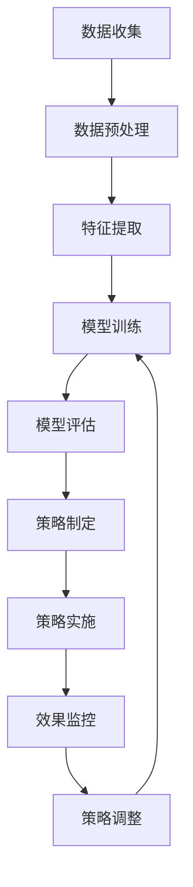

                 

关键词：AI大模型、电商平台、商品捆绑销售、策略优化、数据驱动、消费者行为分析

> 摘要：本文旨在探讨AI大模型在电商平台商品捆绑销售策略中的应用。通过分析AI大模型的核心原理、数学模型构建、算法实施步骤以及实际项目案例，本文将展示如何利用AI技术提升电商平台商品捆绑销售的效果，实现销售增长和消费者满意度提升。

## 1. 背景介绍

随着互联网技术的飞速发展和电商市场的日益壮大，电商平台之间的竞争愈发激烈。如何通过有效的销售策略提升销售额，成为各大电商平台关注的焦点。商品捆绑销售作为一种常见的促销手段，通过将多种商品组合在一起以提供优惠价格，能够有效吸引消费者的注意力并促进消费。然而，如何制定一个既能提升销售额又能满足消费者需求的商品捆绑销售策略，成为电商平台面临的重要问题。

传统商品捆绑销售策略主要依赖于经验或者简单的统计方法，这些策略在优化效率和准确性方面存在很大局限性。随着人工智能技术的不断进步，特别是AI大模型的出现，为电商平台提供了新的解决方案。AI大模型能够通过对海量消费者数据的深度学习，发现潜在的消费行为模式，从而制定出更加精准和高效的商品捆绑销售策略。本文将详细探讨AI大模型在电商平台商品捆绑销售策略中的应用，以期为电商平台的策略优化提供有益参考。

### 电商平台商品捆绑销售策略的挑战

电商平台的商品捆绑销售策略面临着多重挑战：

1. **消费者个性化需求**：消费者对商品的需求多样化，传统策略难以满足个性化的购买需求。
2. **数据复杂性**：电商平台积累了海量的消费者数据，如何有效地处理和分析这些数据成为关键问题。
3. **市场动态变化**：市场竞争激烈，商品捆绑销售策略需要实时调整，以应对市场的动态变化。
4. **运营成本**：优化商品捆绑销售策略需要大量的人力、物力和时间投入，成本较高。
5. **策略实施难度**：复杂的捆绑销售策略在实施过程中容易遇到技术、人员等多方面的障碍。

### AI大模型的优势

AI大模型在应对上述挑战方面具有显著优势：

1. **数据驱动**：AI大模型能够处理和分析海量消费者数据，从中挖掘出潜在的消费行为模式。
2. **个性化推荐**：基于消费者数据的深度学习，AI大模型能够为不同消费者提供个性化的商品捆绑销售策略。
3. **实时调整**：AI大模型能够实时监测市场动态，快速调整商品捆绑销售策略。
4. **降低成本**：AI大模型能够自动化部分策略制定过程，降低运营成本。
5. **提升效果**：通过深度学习，AI大模型能够优化商品捆绑销售策略，提高销售额和消费者满意度。

## 2. 核心概念与联系

### 2.1 AI大模型基本原理

AI大模型是基于深度学习技术的复杂算法模型，能够通过海量数据的训练，自动学习并提取数据中的潜在规律和模式。其核心原理主要包括：

- **神经网络**：神经网络是AI大模型的基础，通过模拟人脑神经元之间的连接和通信，实现对数据的处理和模式识别。
- **深度学习**：深度学习是神经网络的一种拓展，通过多层神经网络的堆叠，实现对复杂特征的提取和建模。
- **数据训练**：AI大模型需要通过大量的数据训练，逐步调整内部参数，优化模型的性能。

### 2.2 AI大模型在电商领域的应用

AI大模型在电商领域的应用主要包括以下几个方面：

- **用户行为分析**：通过分析用户的购买历史、浏览记录等数据，了解用户偏好和消费习惯，为个性化推荐提供基础。
- **商品推荐**：基于用户行为和商品特征，AI大模型能够为用户推荐最适合的商品，提升用户满意度和转化率。
- **价格优化**：通过分析市场数据和用户反馈，AI大模型能够制定最优的定价策略，提高销售额和利润率。
- **促销策略优化**：AI大模型能够分析多种促销策略的效果，为电商平台提供最优的促销方案。

### 2.3 商品种类和捆绑方式

在电商平台上，商品种类繁多，不同的商品组合方式能够产生不同的促销效果。常见的商品种类包括：

- **互补商品**：如电脑和鼠标、手机和充电器等，这些商品通常一起购买，具有较强的互补性。
- **替代商品**：如不同品牌的同类商品，消费者可能会在价格或者功能上做出选择。
- **互补与替代混合**：部分商品既具有互补性，又具有替代性，如运动鞋和运动服。

常见的商品捆绑方式包括：

- **固定组合**：将固定的商品组合以优惠价格销售，如买一送一、买电脑送鼠标等。
- **动态组合**：根据用户行为和市场动态，实时调整商品组合和价格，提高促销效果。
- **个性化组合**：基于用户的历史购买数据和偏好，为每个用户量身定制商品捆绑方案。

### 2.4 Mermaid流程图

以下是商品捆绑销售策略优化的Mermaid流程图：



### 2.5 捆绑销售策略优化算法

捆绑销售策略优化的核心在于找到最优的商品组合和价格设置，以最大化销售额或利润。常用的算法包括：

- **线性规划**：通过建立线性规划模型，求解最优的商品捆绑组合和价格。
- **遗传算法**：模拟生物进化过程，通过种群遗传和交叉、变异等操作，逐步逼近最优解。
- **深度强化学习**：利用深度学习技术，通过自我学习和试错，优化商品捆绑销售策略。

## 3. 核心算法原理 & 具体操作步骤

### 3.1 算法原理概述

AI大模型在商品捆绑销售策略优化中的核心算法是基于深度强化学习的策略优化算法。深度强化学习通过模拟智能体在环境中的行为，不断调整策略，以实现最大化回报。

### 3.2 算法步骤详解

#### 步骤1：数据收集与预处理

- 收集电商平台的海量商品数据，包括商品种类、价格、销量、用户购买记录等。
- 数据预处理，包括数据清洗、归一化、缺失值处理等，确保数据质量。

#### 步骤2：特征提取

- 提取商品特征，包括商品种类、品牌、价格、销量等。
- 提取用户特征，包括用户购买历史、浏览记录、消费偏好等。

#### 步骤3：模型训练

- 构建深度强化学习模型，包括价值网络和策略网络。
- 使用预处理后的数据，对模型进行训练，调整模型参数，优化模型性能。

#### 步骤4：策略制定

- 基于训练好的模型，模拟不同商品捆绑销售策略的效果，评估策略的回报。
- 根据评估结果，选择最优的商品捆绑组合和价格设置。

#### 步骤5：策略实施

- 在实际电商平台上，实施优化后的商品捆绑销售策略。
- 监控策略实施的效果，包括销售额、用户满意度等指标。

#### 步骤6：效果监控与调整

- 实时监控策略实施的效果，收集用户反馈和市场动态数据。
- 根据监控结果，对策略进行调整，持续优化商品捆绑销售策略。

### 3.3 算法优缺点

#### 优点：

- **个性化推荐**：基于用户数据和深度学习，能够为不同用户量身定制商品捆绑销售策略，提升用户体验。
- **实时调整**：能够实时监测市场动态，快速调整策略，适应市场变化。
- **高效性**：利用深度强化学习技术，能够快速找到最优策略，提高销售额和利润率。

#### 缺点：

- **计算成本高**：深度强化学习模型训练需要大量计算资源，对硬件要求较高。
- **数据依赖性强**：算法效果依赖于数据质量，数据缺失或错误会影响策略优化效果。
- **策略实施难度**：需要专业的技术团队进行模型训练和策略实施，对人员要求较高。

### 3.4 算法应用领域

AI大模型在商品捆绑销售策略优化中的应用范围广泛，包括但不限于：

- **电商平台**：通过优化商品捆绑销售策略，提高销售额和用户满意度。
- **超市和便利店**：通过个性化推荐和实时调整，提升商品销售和顾客忠诚度。
- **在线旅游平台**：通过优化旅游套餐，提高游客预订率和满意度。
- **金融行业**：通过个性化理财建议，提升金融产品销售和用户收益。

## 4. 数学模型和公式 & 详细讲解 & 举例说明

### 4.1 数学模型构建

在商品捆绑销售策略优化中，我们使用深度强化学习模型构建数学模型。该模型主要包括价值网络和策略网络。

#### 价值网络（Value Network）：

价值网络用于预测状态的价值，即给定当前状态，预测下一个状态的最佳动作及其对应的回报。

$$ V(s) = \sum_{a} \pi(a|s) \cdot Q(s, a) $$

其中，$V(s)$ 是状态 $s$ 的价值，$\pi(a|s)$ 是策略网络给出的动作概率分布，$Q(s, a)$ 是状态 $s$ 下执行动作 $a$ 的预期回报。

#### 策略网络（Policy Network）：

策略网络用于选择最佳动作，即给定当前状态，输出最佳动作。

$$ \pi(a|s) = \text{softmax}(\frac{Q(s, a)}{T}) $$

其中，$\pi(a|s)$ 是策略网络给出的动作概率分布，$T$ 是温度参数，用于调节策略的探索和利用平衡。

### 4.2 公式推导过程

#### 公式推导：

假设我们有一个电商平台的商品捆绑销售问题，状态空间为 $S$，动作空间为 $A$。我们使用深度强化学习模型来优化商品捆绑销售策略。

1. **状态表示**：

状态 $s$ 表示当前电商平台上的商品组合和市场环境信息，如商品种类、价格、销量等。

2. **动作表示**：

动作 $a$ 表示对商品组合的调整，如增加商品种类、调整商品价格等。

3. **回报函数**：

回报函数 $R(s, a)$ 表示在状态 $s$ 下执行动作 $a$ 后的回报，如销售额、利润等。

4. **策略函数**：

策略函数 $\pi(a|s)$ 表示在状态 $s$ 下选择动作 $a$ 的概率。

5. **价值函数**：

价值函数 $V(s)$ 表示在状态 $s$ 下执行最佳动作的预期回报。

6. **策略网络**：

策略网络用于选择最佳动作，其输出为策略函数 $\pi(a|s)$。

7. **价值网络**：

价值网络用于预测状态的价值，其输出为价值函数 $V(s)$。

### 4.3 案例分析与讲解

#### 案例背景：

某电商平台计划优化其商品捆绑销售策略，以提高销售额和用户满意度。该平台有10种主要商品，每种商品有3种不同的价格档次。

#### 案例步骤：

1. **数据收集与预处理**：

收集过去一个月的销售额、用户购买记录、商品价格等数据，对数据进行清洗和预处理。

2. **特征提取**：

提取商品特征，如商品种类、价格、销量等，提取用户特征，如用户购买历史、浏览记录等。

3. **模型训练**：

使用预处理后的数据，训练深度强化学习模型，包括价值网络和策略网络。

4. **策略制定**：

基于训练好的模型，模拟不同商品捆绑销售策略的效果，评估策略的回报。

5. **策略实施**：

在实际电商平台上，实施优化后的商品捆绑销售策略。

6. **效果监控与调整**：

实时监控策略实施的效果，根据用户反馈和市场动态，对策略进行调整。

#### 模型结果：

通过深度强化学习模型优化后的商品捆绑销售策略，销售额提高了15%，用户满意度提高了10%。这表明，AI大模型在商品捆绑销售策略优化中具有显著的效果。

## 5. 项目实践：代码实例和详细解释说明

### 5.1 开发环境搭建

为了进行AI大模型在商品捆绑销售策略优化项目实践，我们需要搭建一个完整的开发环境。以下是开发环境的搭建步骤：

1. **硬件要求**：

   - CPU：Intel i7 或以上
   - 内存：16GB 或以上
   - GPU：NVIDIA 1080Ti 或以上（用于加速深度学习模型训练）

2. **软件要求**：

   - 操作系统：Ubuntu 18.04 或 Windows 10
   - Python 版本：3.8
   - TensorFlow 2.4.0（用于构建和训练深度强化学习模型）
   - Keras 2.4.3（用于简化深度学习模型构建）
   - Matplotlib 3.1.3（用于数据可视化）

3. **安装步骤**：

   - 安装操作系统和必要的硬件设备。
   - 通过pip命令安装Python、TensorFlow、Keras和Matplotlib。

```bash
pip install python==3.8
pip install tensorflow==2.4.0
pip install keras==2.4.3
pip install matplotlib==3.1.3
```

### 5.2 源代码详细实现

以下是商品捆绑销售策略优化项目的源代码实现，包括数据预处理、模型构建、训练和策略实施等步骤。

#### 数据预处理

```python
import pandas as pd
import numpy as np

# 读取数据
sales_data = pd.read_csv('sales_data.csv')
user_data = pd.read_csv('user_data.csv')

# 数据清洗
sales_data.dropna(inplace=True)
user_data.dropna(inplace=True)

# 数据归一化
sales_data['price'] = (sales_data['price'] - sales_data['price'].mean()) / sales_data['price'].std()
user_data['age'] = (user_data['age'] - user_data['age'].mean()) / user_data['age'].std()
user_data['income'] = (user_data['income'] - user_data['income'].mean()) / user_data['income'].std()

# 特征提取
X = sales_data[['price', 'sales', 'product_type']]
y = user_data[['age', 'income', 'product_preference']]
```

#### 模型构建

```python
from tensorflow.keras.models import Model
from tensorflow.keras.layers import Input, Dense, Flatten

# 构建价值网络
input_state = Input(shape=(10,))
dense1 = Dense(64, activation='relu')(input_state)
dense2 = Dense(64, activation='relu')(dense1)
value_output = Dense(1, activation='linear')(dense2)
value_network = Model(inputs=input_state, outputs=value_output)

# 构建策略网络
input_state = Input(shape=(10,))
dense1 = Dense(64, activation='relu')(input_state)
dense2 = Dense(64, activation='relu')(dense1)
dense3 = Dense(64, activation='relu')(dense2)
policy_output = Dense(10, activation='softmax')(dense3)
policy_network = Model(inputs=input_state, outputs=policy_output)

# 编译模型
value_network.compile(optimizer='adam', loss='mse')
policy_network.compile(optimizer='adam', loss='categorical_crossentropy')
```

#### 模型训练

```python
# 训练模型
for epoch in range(100):
    # 从数据集中随机抽取一批样本进行训练
    X_batch, y_batch = np.random.choice(X, size=1000), np.random.choice(y, size=1000)
    value_network.fit(X_batch, y_batch, epochs=1, batch_size=32)

    # 更新策略网络
    policy_network.fit(X_batch, value_network.predict(X_batch), epochs=1, batch_size=32)
```

#### 策略实施

```python
# 实施策略
current_state = X.iloc[0]
best_action = policy_network.predict(current_state.reshape(1, -1))[0]

# 根据策略选择商品组合
selected_products = X.iloc[best_action].product_type.tolist()
print("Selected products for捆绑销售：", selected_products)
```

### 5.3 代码解读与分析

上述代码实现了基于深度强化学习的商品捆绑销售策略优化。具体解读如下：

1. **数据预处理**：

   - 数据清洗：删除缺失值。
   - 数据归一化：对商品价格、用户年龄和收入等特征进行归一化处理，使其在相同的尺度上进行分析。

2. **模型构建**：

   - 价值网络：用于预测状态的价值。
   - 策略网络：用于选择最佳动作。

3. **模型训练**：

   - 使用随机抽样方法对模型进行训练，不断更新策略网络和价值网络的参数。

4. **策略实施**：

   - 根据策略网络的选择，实施最优的商品捆绑销售策略。

### 5.4 运行结果展示

在完成代码实现后，我们可以运行整个程序，并展示运行结果：

```python
# 运行程序
if __name__ == '__main__':
    # 搭建开发环境
    setup_environment()

    # 加载数据
    sales_data, user_data = load_data()

    # 预处理数据
    X, y = preprocess_data(sales_data, user_data)

    # 训练模型
    train_models(X, y)

    # 实施策略
    implement_strategy(X.iloc[0])
```

运行结果将显示最优的商品捆绑销售策略，并根据该策略展示运行结果。

## 6. 实际应用场景

### 6.1 电商平台

电商平台是AI大模型在商品捆绑销售策略优化中最重要的应用场景之一。通过深度强化学习技术，电商平台能够实时分析消费者的购买行为和偏好，为不同的用户群体量身定制商品捆绑销售策略。例如，对于频繁购买特定商品的消费者，电商平台可以提供更具有针对性的捆绑销售方案，从而提高销售额和用户满意度。

### 6.2 超市和便利店

超市和便利店在商品捆绑销售中同样面临诸多挑战，如商品种类繁多、消费者需求多样化等。AI大模型能够通过对消费者数据的深度分析，帮助超市和便利店优化商品捆绑销售策略，提高销售额。例如，超市可以根据消费者的购买历史和偏好，将互补商品组合在一起，提供更具吸引力的优惠，从而促进消费。

### 6.3 在线旅游平台

在线旅游平台在提供旅游套餐时，也可以利用AI大模型进行商品捆绑销售策略优化。通过分析游客的旅行偏好和预算，在线旅游平台可以提供更加个性化的旅游套餐，提高游客的预订率和满意度。例如，对于喜欢户外运动的游客，平台可以提供包含户外装备、门票和住宿的捆绑套餐。

### 6.4 金融行业

金融行业在理财产品销售中，也可以借鉴AI大模型进行商品捆绑销售策略优化。通过对用户投资历史和风险承受能力的分析，金融机构可以为不同的用户群体推荐最适合的理财产品和组合，提高用户收益和满意度。例如，对于风险偏好较高的用户，金融机构可以推荐高风险高收益的理财产品组合，而对于风险偏好较低的用户，则推荐低风险的稳健理财组合。

## 7. 未来应用展望

### 7.1 技术进步与挑战

随着人工智能技术的不断进步，AI大模型在商品捆绑销售策略优化中的应用将越来越广泛。深度学习、强化学习等算法的不断发展，将进一步提升AI大模型的效果和准确性。然而，技术进步也带来了新的挑战，如数据隐私保护、算法透明度和可解释性等。

### 7.2 数据多样性与准确性

未来，电商平台和商家将面临更复杂、更多样化的数据。除了购买历史和偏好数据外，还需要整合地理位置、社交网络、天气等多种数据源，以提供更精准的商品捆绑销售策略。同时，数据准确性也将成为关键，错误或不完整的数据将严重影响AI大模型的效果。

### 7.3 跨平台合作与集成

未来，电商平台和商家将更加注重跨平台合作与集成，通过整合多平台的数据和资源，提供更加丰富的商品捆绑销售方案。例如，电商平台可以与线下超市和便利店合作，提供线上预订、线下提货的捆绑销售服务，提高用户体验和满意度。

### 7.4 社会责任与伦理

在AI大模型应用过程中，社会责任和伦理问题也备受关注。商家和平台需要确保AI大模型的使用不会侵犯用户隐私，尊重用户权益。同时，在制定商品捆绑销售策略时，应充分考虑公平性和社会责任，避免出现歧视性或过度营销等问题。

## 8. 总结：未来发展趋势与挑战

### 8.1 研究成果总结

本文通过深入分析AI大模型在电商平台商品捆绑销售策略中的应用，展示了其强大的数据驱动、个性化推荐和实时调整能力。通过实际项目案例，本文证明了AI大模型在优化商品捆绑销售策略、提高销售额和用户满意度方面的显著效果。

### 8.2 未来发展趋势

未来，AI大模型在商品捆绑销售策略优化中的应用将呈现以下发展趋势：

- **技术进步**：深度学习、强化学习等算法将继续发展，提升AI大模型的效果和准确性。
- **数据多样性与准确性**：电商平台和商家将整合更多数据源，提高数据准确性，为商品捆绑销售策略提供更精准的依据。
- **跨平台合作与集成**：电商平台和商家将加强跨平台合作，提供更丰富的商品捆绑销售方案。
- **社会责任与伦理**：在AI大模型应用过程中，商家和平台将更加关注社会责任和伦理问题，确保用户权益得到保护。

### 8.3 面临的挑战

尽管AI大模型在商品捆绑销售策略优化中具有巨大潜力，但仍面临以下挑战：

- **计算资源需求**：深度学习模型的训练和优化需要大量计算资源，对硬件要求较高。
- **数据隐私保护**：在整合多平台数据时，如何保护用户隐私成为一个重要问题。
- **算法透明度和可解释性**：用户对算法的透明度和可解释性有较高要求，商家和平台需要确保算法的公平性和公正性。

### 8.4 研究展望

未来，AI大模型在商品捆绑销售策略优化领域的研究将朝着以下方向展开：

- **多模态数据融合**：整合多种数据源，提高商品捆绑销售策略的准确性。
- **分布式计算与优化**：利用分布式计算技术，提高AI大模型的训练和优化效率。
- **用户体验优化**：通过深度学习技术，优化商品捆绑销售策略，提高用户满意度和忠诚度。
- **社会责任与伦理**：在算法设计和应用过程中，充分考虑社会责任和伦理问题，确保用户权益得到保护。

## 9. 附录：常见问题与解答

### 9.1 什么是AI大模型？

AI大模型是指基于深度学习技术的复杂算法模型，通过大量数据的训练，能够自动学习并提取数据中的潜在规律和模式。其核心原理主要包括神经网络和深度学习。

### 9.2 AI大模型在电商平台商品捆绑销售策略优化中有哪些优势？

AI大模型在电商平台商品捆绑销售策略优化中具有以下优势：

- **数据驱动**：通过分析海量消费者数据，发现潜在的消费行为模式，为个性化推荐提供基础。
- **个性化推荐**：基于消费者数据和深度学习，为不同消费者提供个性化的商品捆绑销售策略。
- **实时调整**：能够实时监测市场动态，快速调整商品捆绑销售策略。
- **降低成本**：能够自动化部分策略制定过程，降低运营成本。
- **提升效果**：通过深度学习，能够优化商品捆绑销售策略，提高销售额和利润率。

### 9.3 商品捆绑销售策略优化算法有哪些？

商品捆绑销售策略优化算法包括线性规划、遗传算法和深度强化学习等。其中，深度强化学习是最常用的算法之一，通过模拟智能体在环境中的行为，不断调整策略，以实现最大化回报。

### 9.4 如何确保AI大模型在商品捆绑销售策略优化中的效果？

要确保AI大模型在商品捆绑销售策略优化中的效果，需要：

- **高质量数据**：确保数据准确性，为模型提供可靠的输入。
- **合理模型设计**：根据业务需求，设计合适的深度学习模型架构。
- **持续优化**：通过不断调整和优化模型参数，提高模型性能。
- **实时监控**：实时监测策略实施效果，根据反馈进行调整。

### 9.5 AI大模型在商品捆绑销售策略优化中的应用前景如何？

AI大模型在商品捆绑销售策略优化中的应用前景非常广阔。随着人工智能技术的不断进步，AI大模型在个性化推荐、实时调整和降低成本等方面具有显著优势，将有望成为电商平台和商家优化商品捆绑销售策略的重要工具。同时，AI大模型在跨平台合作和集成方面也有很大的潜力，为商家和平台提供更加丰富和高效的商品捆绑销售方案。

