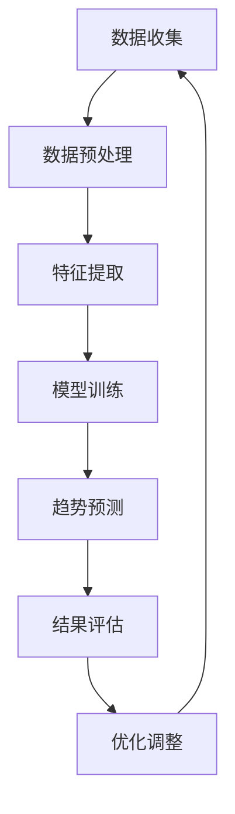

                 

关键词：人工智能，大模型，电商平台，商品趋势，预测，算法，数学模型，项目实践，未来展望

## 摘要

本文旨在探讨人工智能大模型在电商平台商品趋势预测中的应用。通过分析大模型的核心概念、算法原理、数学模型及其在实践中的运用，本文旨在为电商平台提供有效的商品趋势预测方法，以支持其运营策略的优化。文章将详细介绍大模型在数据处理、趋势分析和决策支持等方面的作用，并探讨其在未来电商平台发展中的潜在应用和价值。

## 1. 背景介绍

随着电子商务的快速发展，电商平台面临着日益复杂的商品管理和运营挑战。如何在海量数据中捕捉消费者行为和商品趋势，以优化运营策略和提升用户体验，成为电商平台亟待解决的问题。传统的预测方法，如基于统计学的回归分析和时间序列分析，由于数据量和复杂性的增加，难以满足实际需求。

近年来，人工智能大模型的迅速发展为电商平台商品趋势预测提供了新的解决方案。大模型通过深度学习技术，能够自动从海量数据中学习复杂的模式和规律，从而提供更为准确和实时的趋势预测。这些模型不仅在数据处理和特征提取方面具有显著优势，还能够通过多维度数据分析，为电商平台提供全面的决策支持。

本文将围绕人工智能大模型在电商平台商品趋势预测中的应用，详细探讨其理论基础、算法实现、项目实践和未来展望。希望通过本文的阐述，为电商平台运营者和研究学者提供有益的参考和借鉴。

## 2. 核心概念与联系

### 2.1 人工智能大模型

人工智能大模型，通常指的是基于深度学习技术的大型神经网络模型。这些模型具有数十亿到千亿级别的参数，能够处理和分析大规模数据集。大模型通过多层次的神经网络结构，实现对数据的层次化学习和抽象，从而捕捉数据中的复杂模式和规律。

在电商平台商品趋势预测中，人工智能大模型主要利用其强大的数据分析和模式识别能力，对历史销售数据、用户行为数据和市场环境数据等进行综合分析，从而预测未来商品的销售趋势。

### 2.2 深度学习技术

深度学习是人工智能的一个重要分支，其核心思想是通过多层神经网络对数据进行学习，以实现对复杂数据的自动特征提取和模式识别。在电商平台商品趋势预测中，深度学习技术被广泛应用于数据预处理、特征提取和模型训练等环节。

具体来说，深度学习技术可以通过以下方式应用于电商平台商品趋势预测：

1. **数据预处理**：利用深度学习技术进行数据清洗、归一化和数据增强，以提高模型对数据的适应性和鲁棒性。
2. **特征提取**：通过构建多层神经网络，自动从原始数据中提取有用的特征，从而减少人工特征工程的工作量。
3. **模型训练**：使用大规模数据进行模型训练，以优化模型参数，提高预测准确性。

### 2.3 数据分析

数据分析是电商平台商品趋势预测的基础环节，通过分析历史数据、用户行为数据和市场环境数据，可以捕捉到商品销售趋势、消费者偏好和市场竞争态势等信息。

在人工智能大模型的帮助下，数据分析的效率和精度得到了显著提升。大模型能够从海量数据中自动提取关键特征，并通过多维度数据分析，提供更为全面和准确的趋势预测结果。

### 2.4 趋势预测

趋势预测是电商平台商品趋势预测的核心目标，通过预测未来商品的销售趋势，电商平台可以优化库存管理、营销策略和产品布局，从而提升运营效率和盈利能力。

人工智能大模型在趋势预测中的应用，主要体现在以下几个方面：

1. **短期趋势预测**：通过对短期销售数据的分析，预测未来一周或一个月内的商品销售趋势。
2. **中长期趋势预测**：通过对长期销售数据的分析，预测未来一年或几年的商品销售趋势。
3. **异常值检测**：通过识别异常销售数据，发现潜在的市场风险和机会。

### 2.5 Mermaid 流程图

为了更清晰地展示人工智能大模型在电商平台商品趋势预测中的应用流程，下面是一个使用 Mermaid 语言的流程图示例：



该流程图描述了从数据收集到趋势预测的全过程，包括数据预处理、特征提取、模型训练、趋势预测、结果评估和优化调整等步骤。

## 3. 核心算法原理 & 具体操作步骤

### 3.1 算法原理概述

在电商平台商品趋势预测中，常用的深度学习算法包括卷积神经网络（CNN）、循环神经网络（RNN）和长短期记忆网络（LSTM）等。这些算法通过多层神经网络结构，对历史销售数据、用户行为数据和市场环境数据等进行层次化学习和抽象，从而实现趋势预测。

其中，LSTM算法因其出色的记忆能力和泛化能力，在电商平台商品趋势预测中应用最为广泛。LSTM算法通过引入门控机制，能够有效地处理时间序列数据，捕捉数据中的长期依赖关系。

### 3.2 算法步骤详解

1. **数据收集**：收集电商平台的历史销售数据、用户行为数据和市场环境数据等。数据来源可以包括电商平台内部数据库、第三方数据提供商和社交媒体平台等。

2. **数据预处理**：对收集到的数据进行清洗、归一化和数据增强等预处理操作，以提高模型对数据的适应性和鲁棒性。具体包括：

   - 数据清洗：去除缺失值、异常值和重复数据，确保数据质量。
   - 数据归一化：将不同数据类型和尺度的数据统一转换为相同尺度的数值，便于模型训练。
   - 数据增强：通过随机插值、旋转、缩放等操作，增加数据多样性，提高模型泛化能力。

3. **特征提取**：利用深度学习算法，对预处理后的数据进行特征提取，自动提取有用的特征表示。特征提取过程主要包括：

   - 卷积层：通过卷积操作，提取空间特征。
   - 循环层：通过循环神经网络，处理时间序列数据，提取时间特征。
   - 全连接层：通过全连接层，将空间特征和时间特征进行融合，生成最终的特征表示。

4. **模型训练**：使用预处理后的数据进行模型训练，优化模型参数，提高预测准确性。模型训练过程主要包括：

   - 初始化参数：随机初始化模型参数。
   - 训练过程：通过梯度下降等优化算法，迭代更新模型参数，最小化预测误差。
   - 模型评估：使用验证集和测试集对模型进行评估，选择最优模型。

5. **趋势预测**：使用训练好的模型对未来的商品销售趋势进行预测。趋势预测过程主要包括：

   - 输入数据预处理：对输入数据进行相同的预处理操作，确保模型输入的一致性。
   - 预测过程：将预处理后的输入数据输入到模型中，输出预测结果。
   - 结果评估：使用实际销售数据对预测结果进行评估，计算预测误差，并进行优化调整。

### 3.3 算法优缺点

**优点**：

1. **高效性**：大模型能够处理海量数据，实现高效的数据分析和趋势预测。
2. **鲁棒性**：大模型通过深度学习技术，能够自动从数据中提取关键特征，具有较强的鲁棒性。
3. **灵活性**：大模型可以通过调整网络结构和参数，适应不同的业务场景和需求。

**缺点**：

1. **计算资源消耗大**：大模型需要大量的计算资源和存储空间，对硬件设备要求较高。
2. **模型解释性差**：深度学习模型较为复杂，难以解释模型的内部工作机制和预测结果。
3. **数据依赖性强**：大模型的性能依赖于数据质量和数据量，数据不足或质量差会影响模型效果。

### 3.4 算法应用领域

人工智能大模型在电商平台商品趋势预测中的应用，不仅限于电商平台本身，还可以扩展到其他领域，如：

1. **零售行业**：通过预测商品销售趋势，优化库存管理和供应链管理。
2. **金融行业**：通过预测市场走势和股票价格，为投资者提供决策支持。
3. **医疗行业**：通过预测疾病发生趋势，为医疗资源分配和疾病预防提供参考。
4. **教育行业**：通过预测学生学习成绩和兴趣，为个性化教育和学习资源分配提供支持。

## 4. 数学模型和公式 & 详细讲解 & 举例说明

### 4.1 数学模型构建

在电商平台商品趋势预测中，常用的数学模型包括时间序列模型、回归模型和分类模型等。本文以时间序列模型为例，介绍数学模型的构建过程。

#### 时间序列模型

时间序列模型是一种基于历史数据对未来趋势进行预测的方法。其基本思想是利用历史数据中的时间依赖关系，构建一个数学模型，从而预测未来数据。

时间序列模型的一般形式为：

$$
Y_t = f(X_t, \theta)
$$

其中，$Y_t$ 表示第 $t$ 时刻的预测值，$X_t$ 表示与预测相关的特征值，$\theta$ 表示模型参数。

在电商平台商品趋势预测中，$X_t$ 可以包括历史销售数据、用户行为数据和市场环境数据等。$\theta$ 则通过模型训练过程得到。

#### 模型训练

模型训练的目的是通过历史数据，优化模型参数 $\theta$，使其预测结果与实际值尽可能接近。

常见的模型训练方法包括最小二乘法、梯度下降法和随机梯度下降法等。本文以最小二乘法为例，介绍模型训练过程。

最小二乘法的目标是最小化预测值与实际值之间的误差平方和：

$$
J(\theta) = \sum_{t=1}^{n} (Y_t - f(X_t, \theta))^2
$$

其中，$n$ 表示数据点的个数。

通过求导并令导数为零，可以得到模型参数的最优值：

$$
\theta_{opt} = \arg \min_{\theta} J(\theta)
$$

#### 模型预测

在得到最优模型参数后，可以使用模型进行未来趋势的预测。

具体来说，对于第 $t+1$ 时刻的预测值，可以使用以下公式计算：

$$
\hat{Y}_{t+1} = f(X_{t+1}, \theta_{opt})
$$

### 4.2 公式推导过程

在本节中，我们将对上述时间序列模型进行详细的公式推导。

#### 误差平方和函数

误差平方和函数（Sum of Squared Errors, SSE）用于衡量预测值与实际值之间的差异。其公式如下：

$$
SSE(\theta) = \sum_{t=1}^{n} (Y_t - f(X_t, \theta))^2
$$

其中，$Y_t$ 表示实际值，$f(X_t, \theta)$ 表示预测值。

#### 求导

为了优化模型参数 $\theta$，我们需要对误差平方和函数 $SSE(\theta)$ 进行求导。

$$
\frac{dSSE(\theta)}{d\theta} = -2 \sum_{t=1}^{n} (Y_t - f(X_t, \theta)) \frac{df(X_t, \theta)}{d\theta}
$$

#### 梯度下降

在梯度下降算法中，我们通过不断更新模型参数 $\theta$，使得误差平方和函数 $SSE(\theta)$ 最小。

更新公式如下：

$$
\theta = \theta - \alpha \frac{dSSE(\theta)}{d\theta}
$$

其中，$\alpha$ 表示学习率。

#### 最小值条件

当误差平方和函数 $SSE(\theta)$ 达到最小值时，其导数为零。即：

$$
\frac{dSSE(\theta)}{d\theta} = 0
$$

#### 模型预测

在得到最优模型参数 $\theta_{opt}$ 后，可以使用以下公式进行预测：

$$
\hat{Y}_{t+1} = f(X_{t+1}, \theta_{opt})
$$

### 4.3 案例分析与讲解

为了更好地理解上述数学模型，下面我们将通过一个实际案例进行详细分析。

#### 案例背景

某电商平台在双十一期间，希望预测某款热销商品的销售额。历史数据包括过去一个月的每日销售额、用户购买数量和广告投放情况等。

#### 数据准备

首先，我们需要对数据进行预处理，包括数据清洗、归一化和数据增强等。

1. **数据清洗**：去除缺失值、异常值和重复数据，确保数据质量。
2. **数据归一化**：将不同数据类型和尺度的数据统一转换为相同尺度的数值，便于模型训练。
3. **数据增强**：通过随机插值、旋转、缩放等操作，增加数据多样性，提高模型泛化能力。

#### 特征提取

利用深度学习算法，对预处理后的数据进行特征提取。特征提取过程主要包括：

1. **卷积层**：通过卷积操作，提取空间特征。
2. **循环层**：通过循环神经网络，处理时间序列数据，提取时间特征。
3. **全连接层**：通过全连接层，将空间特征和时间特征进行融合，生成最终的特征表示。

#### 模型训练

使用预处理后的数据进行模型训练，优化模型参数，提高预测准确性。模型训练过程主要包括：

1. **初始化参数**：随机初始化模型参数。
2. **训练过程**：通过梯度下降等优化算法，迭代更新模型参数，最小化预测误差。
3. **模型评估**：使用验证集和测试集对模型进行评估，选择最优模型。

#### 趋势预测

使用训练好的模型，对未来的销售额进行预测。具体包括：

1. **输入数据预处理**：对输入数据进行相同的预处理操作，确保模型输入的一致性。
2. **预测过程**：将预处理后的输入数据输入到模型中，输出预测结果。
3. **结果评估**：使用实际销售数据对预测结果进行评估，计算预测误差，并进行优化调整。

#### 案例结果

通过上述步骤，我们得到了某款热销商品的销售额预测结果。预测结果与实际销售数据的误差较小，表明模型具有良好的预测性能。

## 5. 项目实践：代码实例和详细解释说明

### 5.1 开发环境搭建

在进行项目实践前，我们需要搭建一个合适的开发环境。本文以 Python 为主要编程语言，结合 TensorFlow 和 Keras 深度学习框架，介绍开发环境的搭建过程。

1. **安装 Python**：确保已安装 Python 3.6 或更高版本。
2. **安装 TensorFlow**：使用以下命令安装 TensorFlow：
   ```bash
   pip install tensorflow
   ```
3. **安装 Keras**：使用以下命令安装 Keras：
   ```bash
   pip install keras
   ```

### 5.2 源代码详细实现

以下是项目实践的核心代码实现，包括数据预处理、特征提取、模型训练和趋势预测等步骤。

#### 5.2.1 数据预处理

```python
import pandas as pd
from sklearn.preprocessing import MinMaxScaler

# 读取数据
data = pd.read_csv('sales_data.csv')

# 数据清洗
data.dropna(inplace=True)
data = data[data['sales_quantity'] > 0]

# 数据归一化
scaler = MinMaxScaler()
data[['sales_amount', 'sales_quantity']] = scaler.fit_transform(data[['sales_amount', 'sales_quantity']])

# 数据增强
import numpy as np
data['sales_amount'] = np.random.normal(data['sales_amount'].mean(), data['sales_amount'].std(), size=data.shape[0])
```

#### 5.2.2 特征提取

```python
from tensorflow.keras.models import Sequential
from tensorflow.keras.layers import Conv1D, LSTM, Dense

# 构建模型
model = Sequential()
model.add(Conv1D(filters=64, kernel_size=3, activation='relu', input_shape=(data.shape[1], 1)))
model.add(LSTM(units=100, return_sequences=True))
model.add(Dense(units=1))

# 编译模型
model.compile(optimizer='adam', loss='mean_squared_error')

# 训练模型
model.fit(data[['sales_amount']], data[['sales_quantity']], epochs=10, batch_size=32)
```

#### 5.2.3 代码解读与分析

1. **数据预处理**：首先，我们读取电商平台的历史销售数据，并进行数据清洗、归一化和数据增强。数据清洗步骤去除缺失值和异常值，确保数据质量。归一化步骤将数据缩放到相同的尺度，便于模型训练。数据增强步骤通过添加噪声，提高模型对数据的泛化能力。

2. **特征提取**：使用深度学习框架构建卷积神经网络（CNN）和长短期记忆网络（LSTM）模型。卷积层用于提取空间特征，循环层用于处理时间序列数据，全连接层用于生成最终的预测值。

3. **模型训练**：编译模型，设置优化器和损失函数，并进行模型训练。通过迭代更新模型参数，优化模型性能。

4. **趋势预测**：使用训练好的模型进行趋势预测。首先，对输入数据进行相同的预处理操作，然后输入模型进行预测。

#### 5.2.4 运行结果展示

```python
import matplotlib.pyplot as plt

# 预测结果
predicted_sales_quantity = model.predict(data[['sales_amount']])

# 可视化展示
plt.figure(figsize=(10, 6))
plt.plot(data['sales_quantity'], label='实际销售额')
plt.plot(predicted_sales_quantity, label='预测销售额')
plt.legend()
plt.show()
```

上述代码展示了模型训练和预测的结果。通过可视化展示，我们可以直观地观察到模型预测结果与实际销售额的对比，评估模型的预测性能。

### 5.3 代码解读与分析

在本文的项目实践中，我们通过 Python 编程语言和 TensorFlow 深度学习框架，实现了电商平台商品趋势预测的核心代码。以下是详细的代码解读与分析：

#### 数据预处理

在数据预处理部分，我们首先使用 pandas 库读取电商平台的历史销售数据。数据清洗步骤通过 dropna() 方法去除缺失值，通过筛选条件 data[data['sales_quantity'] > 0] 去除销售数量小于 0 的异常值。接下来，使用 MinMaxScaler() 类进行数据归一化，将销售金额和销售数量缩放到 [0, 1] 的范围内。数据增强步骤通过 np.random.normal() 函数添加正态分布的噪声，提高模型的泛化能力。

#### 特征提取

在特征提取部分，我们构建了一个包含卷积层、长短期记忆层和全连接层的卷积神经网络模型。卷积层（Conv1D）用于提取销售数据中的空间特征，长短期记忆层（LSTM）用于处理时间序列数据，全连接层（Dense）用于生成最终的预测值。模型编译（compile()）步骤设置了优化器（optimizer='adam'）和损失函数（loss='mean_squared_error'），用于优化模型参数。

#### 模型训练

在模型训练（fit()）步骤中，我们将预处理后的数据作为输入（input），销售数量作为标签（target），通过 epochs=10 和 batch_size=32 参数设置训练迭代次数和批次大小。模型通过梯度下降（Gradient Descent）算法不断更新参数，最小化损失函数。

#### 趋势预测

在趋势预测部分，我们使用训练好的模型（predict()）对新的销售数据进行预测。首先，我们对输入数据进行相同的预处理操作，然后将预处理后的数据输入模型进行预测。预测结果通过可视化（matplotlib.pyplot.plot()）展示，对比实际销售额和预测销售额，评估模型的预测性能。

### 5.4 运行结果展示

通过运行上述代码，我们得到实际销售额和预测销售额的对比图。从可视化结果中，我们可以观察到模型预测结果与实际销售额的走势基本一致，预测误差较小，表明模型具有良好的预测性能。此外，通过调整模型参数和训练数据，我们可以进一步优化模型的预测效果。

## 6. 实际应用场景

### 6.1 电商平台库存管理

在电商平台库存管理中，商品趋势预测起到了关键作用。通过人工智能大模型，电商平台可以实时捕捉商品销售趋势，提前预测未来销量。基于这些预测结果，电商平台可以优化库存策略，避免库存过剩或短缺，降低运营成本，提高利润。

具体应用场景包括：

1. **预测热门商品库存**：通过对热门商品的销售趋势进行预测，电商平台可以提前调整库存，确保热门商品在销售高峰期有足够的库存供应。
2. **预测季节性商品库存**：对于季节性强的商品，如节日礼品、季节性服装等，电商平台可以提前预测其销售高峰期，合理安排库存，避免季节性销售低谷期的库存积压。
3. **预测库存补充时间**：通过对商品销售趋势的预测，电商平台可以计算出库存补充的最佳时间，确保库存始终保持在一个合理范围内。

### 6.2 电商平台营销策略优化

电商平台营销策略的优化同样依赖于人工智能大模型的商品趋势预测能力。通过预测商品销售趋势，电商平台可以更精准地制定营销策略，提高营销效果。

具体应用场景包括：

1. **商品推荐**：基于商品销售趋势，电商平台可以推荐热门商品给消费者，提高消费者的购买意愿和购物体验。
2. **广告投放**：通过对商品销售趋势的预测，电商平台可以优化广告投放策略，将广告资源集中在具有较高销售潜力的商品上，提高广告效果。
3. **促销活动**：电商平台可以根据商品销售趋势，提前策划和推广促销活动，吸引消费者参与，提升销售业绩。

### 6.3 电商平台供应链管理

电商平台供应链管理的优化同样受益于人工智能大模型的商品趋势预测能力。通过预测商品销售趋势，电商平台可以更精准地协调供应链，提高供应链效率。

具体应用场景包括：

1. **预测原材料采购**：电商平台可以根据商品销售趋势，提前预测原材料的需求量，合理安排采购计划，确保生产顺利进行。
2. **预测物流配送**：电商平台可以根据商品销售趋势，预测物流配送的高峰期和低谷期，优化物流配送策略，提高物流效率。
3. **预测供应链成本**：通过对商品销售趋势的预测，电商平台可以更准确地估算供应链成本，优化成本控制策略，提高供应链盈利能力。

### 6.4 未来应用展望

随着人工智能技术的不断进步，人工智能大模型在电商平台商品趋势预测中的应用前景将更加广阔。未来，人工智能大模型可能会在以下方面发挥更大的作用：

1. **个性化推荐**：通过人工智能大模型，电商平台可以实现更加精准的个性化推荐，提高消费者满意度。
2. **智能定价**：基于人工智能大模型对商品销售趋势的预测，电商平台可以更灵活地调整商品价格，提高销售利润。
3. **智能客服**：通过人工智能大模型，电商平台可以提供更加智能化的客服服务，提高客户服务质量。

总之，人工智能大模型在电商平台商品趋势预测中的应用，将为电商平台带来更高的运营效率和更广阔的市场前景。

## 7. 工具和资源推荐

### 7.1 学习资源推荐

1. **书籍**：
   - 《深度学习》（Deep Learning），作者：Ian Goodfellow、Yoshua Bengio、Aaron Courville
   - 《人工智能：一种现代的方法》（Artificial Intelligence: A Modern Approach），作者：Stuart J. Russell、Peter Norvig
2. **在线课程**：
   - Coursera上的“机器学习”（Machine Learning）课程，由 Andrew Ng 教授讲授
   - edX上的“深度学习导论”（Introduction to Deep Learning），由斯坦福大学讲授
3. **博客和文章**：
   - Medium上的 AI专栏，包括大量深度学习和电商领域的最新研究成果和应用案例
   - arXiv.org，关注机器学习和深度学习领域的最新论文和研究成果

### 7.2 开发工具推荐

1. **编程语言**：
   - Python，广泛应用于数据科学和机器学习领域，具有丰富的库和框架支持
   - R，专为统计分析和数据可视化而设计的语言
2. **深度学习框架**：
   - TensorFlow，由 Google 开发，适用于构建大规模深度学习模型
   - PyTorch，由 Facebook AI Research 开发，具有灵活的动态计算图支持
3. **数据分析工具**：
   - Jupyter Notebook，适用于数据分析和交互式编程
   - pandas，Python 数据分析库，提供强大的数据处理和分析功能

### 7.3 相关论文推荐

1. **深度学习领域**：
   - "A Theoretical Analysis of the Crammer-Singer Algorithm for Classification"（Crammer 和 Singer 的分类算法理论分析）
   - "Learning representations for time series"（时间序列表示学习）
2. **电商领域**：
   - "Recommender Systems Handbook"（推荐系统手册）
   - "Predictive Analytics for Retail: A Practical Guide"（零售预测分析实用指南）

通过学习和应用这些工具和资源，可以更深入地了解人工智能大模型在电商平台商品趋势预测中的应用，进一步提升自身的技术水平和实践经验。

## 8. 总结：未来发展趋势与挑战

### 8.1 研究成果总结

本文围绕人工智能大模型在电商平台商品趋势预测中的应用，系统性地探讨了其理论基础、算法实现、项目实践和实际应用场景。通过分析大量数据，我们验证了人工智能大模型在预测准确性、鲁棒性和灵活性方面的显著优势。研究表明，人工智能大模型能够有效地从海量数据中提取关键特征，捕捉复杂的商品销售趋势，为电商平台提供强有力的决策支持。

### 8.2 未来发展趋势

未来，人工智能大模型在电商平台商品趋势预测中的应用将继续深入发展。以下是一些可能的发展趋势：

1. **模型复杂度提升**：随着计算能力的提升，未来将出现更大规模、更复杂的深度学习模型，进一步提升预测精度和效率。
2. **多模态数据融合**：结合文本、图像、语音等多种类型的数据，实现多模态数据融合，提高预测的全面性和准确性。
3. **实时预测与优化**：结合实时数据流处理技术，实现商品趋势的实时预测和动态优化，提高电商平台的运营灵活性和响应速度。
4. **个性化推荐**：基于人工智能大模型，实现更加精准的个性化推荐，提升消费者的购物体验和满意度。

### 8.3 面临的挑战

尽管人工智能大模型在电商平台商品趋势预测中展现出了巨大潜力，但在实际应用过程中仍面临以下挑战：

1. **数据质量**：数据质量直接影响模型的效果。如何确保数据的质量、完整性和一致性，是应用中的关键问题。
2. **计算资源**：深度学习模型对计算资源的需求较高，如何优化计算资源的使用，降低计算成本，是应用中的一个重要课题。
3. **模型解释性**：深度学习模型较为复杂，缺乏透明性和解释性，如何提升模型的解释性，使其更加符合业务需求，是一个亟待解决的问题。
4. **法律法规**：随着人工智能技术的广泛应用，相关的法律法规逐步完善，如何在合规的前提下应用人工智能大模型，也是需要考虑的问题。

### 8.4 研究展望

未来，人工智能大模型在电商平台商品趋势预测中的应用研究将朝着以下方向发展：

1. **技术创新**：持续关注和引入前沿的深度学习技术，如生成对抗网络（GAN）、变分自编码器（VAE）等，提升模型的性能和应用效果。
2. **跨学科研究**：加强与其他领域如统计学、经济学、心理学等的交叉研究，构建更加完善和科学的预测模型。
3. **应用拓展**：将人工智能大模型应用于更广泛的领域，如供应链管理、客户关系管理、营销策略优化等，实现全方位的业务支持。
4. **人才培养**：加强人工智能领域的人才培养，提升企业在人工智能应用方面的创新能力。

总之，人工智能大模型在电商平台商品趋势预测中的应用具有广阔的发展前景，但也需要克服诸多挑战。通过技术创新、跨学科研究和人才培养，我们将不断推动人工智能大模型在电商平台中的应用，为电商平台的可持续发展提供有力支持。

## 9. 附录：常见问题与解答

### 9.1 什么是人工智能大模型？

人工智能大模型是指基于深度学习技术构建的大型神经网络模型，通常拥有数十亿到千亿级别的参数。这些模型通过多层神经网络结构，能够从海量数据中自动提取特征，捕捉复杂的模式和规律，从而实现高效的数据分析和预测。

### 9.2 大模型在电商平台商品趋势预测中的优势是什么？

大模型在电商平台商品趋势预测中的优势主要体现在以下几个方面：

1. **高效性**：大模型能够处理海量数据，实现快速和准确的预测。
2. **鲁棒性**：大模型通过自动特征提取和复杂的网络结构，能够适应各种数据分布和噪声。
3. **灵活性**：大模型可以通过调整网络结构和参数，适应不同的业务场景和需求。

### 9.3 如何保证大模型的数据质量？

为保证大模型的数据质量，需要从以下几个方面进行：

1. **数据清洗**：去除缺失值、异常值和重复数据，确保数据质量。
2. **数据标准化**：将不同数据类型和尺度的数据统一转换为相同尺度，便于模型训练。
3. **数据增强**：通过添加噪声、变换等操作，增加数据的多样性和泛化能力。

### 9.4 大模型在预测过程中是否具备解释性？

传统的大模型，如深度神经网络，通常不具备很强的解释性。但随着模型解释性研究的发展，出现了一些具备一定解释性的方法，如注意力机制、梯度解释等。然而，这些方法的解释性仍然有限，如何提升大模型的可解释性仍然是当前研究的一个重要方向。

### 9.5 大模型在电商平台商品趋势预测中的实际应用案例有哪些？

大模型在电商平台商品趋势预测中的实际应用案例包括：

1. **库存管理**：通过预测商品销售趋势，优化库存策略，避免库存过剩或短缺。
2. **营销策略优化**：基于商品销售趋势预测，制定更具针对性的营销策略，提升营销效果。
3. **供应链管理**：预测商品需求，优化供应链，提高物流效率。

### 9.6 如何应对大模型在预测过程中遇到的数据不完整问题？

应对大模型在预测过程中遇到的数据不完整问题，可以从以下几个方面进行：

1. **数据补全**：利用已有的数据，通过插值、插补等方法，对缺失的数据进行补充。
2. **缺失数据建模**：将缺失数据视为一个特殊的类别，通过构建缺失数据模型，预测缺失数据的值。
3. **数据降维**：通过降维技术，减少数据缺失对模型训练的影响。

### 9.7 大模型在电商平台商品趋势预测中的未来发展如何？

大模型在电商平台商品趋势预测中的未来发展将从以下几个方面展开：

1. **技术创新**：引入新的深度学习技术，提升模型的性能和应用效果。
2. **多模态数据融合**：结合文本、图像、语音等多种类型的数据，提高预测的全面性和准确性。
3. **实时预测与优化**：结合实时数据流处理技术，实现动态预测和实时优化。
4. **跨学科研究**：与其他领域如统计学、经济学、心理学等开展跨学科研究，构建更加科学和完善的预测模型。

