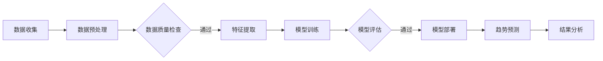

                 

### 关键词 Keywords

- AI大模型
- 电商平台
- 商品趋势预测
- 数据分析
- 深度学习

### 摘要 Abstract

本文探讨了AI大模型在电商平台商品趋势预测中的应用。首先，我们介绍了电商平台商品趋势预测的重要性和背景。接着，详细阐述了AI大模型的工作原理和特点，特别是在深度学习算法的支持下，如何高效地进行数据处理和趋势预测。随后，通过具体的项目实践，我们展示了如何利用AI大模型构建预测模型，并进行代码解读与分析。文章还讨论了AI大模型在实际应用场景中的效果和潜在问题，并对未来发展趋势与挑战进行了展望。

## 1. 背景介绍

随着电子商务的快速发展，电商平台已成为现代商业活动的重要一环。对于电商平台而言，准确预测商品趋势至关重要，这不仅能帮助企业优化库存管理，还能精准营销，提高销售额。然而，传统的商品趋势预测方法往往依赖于历史数据统计和简单的线性模型，难以应对复杂多变的市场环境。

近年来，人工智能（AI）技术的迅猛发展为商品趋势预测带来了新的契机。特别是大模型（如GPT、BERT等），通过深度学习算法，能够从海量数据中提取出潜在的模式和趋势，为电商平台提供更为准确和实时的预测结果。大模型具有强大的数据处理能力和自我学习的能力，能够不断优化预测模型，提高预测的准确性。

本文旨在探讨如何利用AI大模型，结合电商平台的数据特点，实现高效、准确的商品趋势预测。我们将从理论基础、算法实现、项目实践等多个角度，深入分析AI大模型在电商平台商品趋势预测中的应用，并探讨其未来发展趋势与挑战。

## 2. 核心概念与联系

### 2.1 AI大模型的概念

AI大模型是指具有大规模参数和复杂结构的人工神经网络模型。这些模型通常包含数十亿甚至千亿级的参数，能够在大量数据上进行训练，从而具备强大的数据分析和预测能力。大模型通常基于深度学习算法，能够自动学习数据中的特征和模式，从而实现复杂任务的高效解决。

### 2.2 电商平台数据的特点

电商平台的数据通常具有以下特点：

- **多样性**：电商平台涉及的商品种类繁多，数据包括用户行为数据、商品描述数据、价格波动数据等。
- **时效性**：电商平台的交易数据不断更新，需要实时处理和预测。
- **复杂性**：电商平台的数据往往包含噪声和异常值，需要有效的数据处理方法。

### 2.3 AI大模型在电商平台数据中的应用

AI大模型在电商平台数据中的应用主要包括以下几个方面：

- **用户行为分析**：通过分析用户的浏览、购买等行为数据，预测用户的潜在需求。
- **商品趋势预测**：通过分析商品的历史销售数据、价格波动等，预测商品的未来趋势。
- **库存管理优化**：通过预测商品的销售趋势，优化库存管理，降低库存成本。

### 2.4 Mermaid 流程图

以下是一个简单的Mermaid流程图，展示了AI大模型在电商平台商品趋势预测中的应用流程：



### 2.5 核心概念的联系

AI大模型与电商平台数据之间的联系在于，大模型能够从复杂、多样的电商数据中提取出有用的信息，进而实现准确的商品趋势预测。具体来说：

- **用户行为数据**：通过分析用户的浏览、购买等行为，AI大模型能够预测用户的兴趣和需求，从而为商品推荐和营销提供依据。
- **商品描述数据**：通过分析商品的历史销售数据、价格波动等，AI大模型能够预测商品的未来趋势，为库存管理和定价策略提供支持。
- **多源数据融合**：AI大模型能够融合多种数据源（如用户行为数据、商品描述数据、市场数据等），实现更全面、准确的商品趋势预测。

## 3. 核心算法原理 & 具体操作步骤

### 3.1 算法原理概述

AI大模型在商品趋势预测中的核心算法原理主要包括以下几个方面：

- **数据预处理**：通过对原始数据进行清洗、去噪、归一化等操作，提高数据的可用性和质量。
- **特征提取**：通过深度学习算法，从原始数据中提取出具有代表性的特征，为后续的模型训练提供支持。
- **模型训练**：利用大规模的神经网络，通过大量训练数据，不断调整模型的参数，使其能够准确预测商品趋势。
- **模型评估**：通过验证集和测试集，对模型的预测能力进行评估，调整模型参数，优化模型性能。
- **模型部署**：将训练好的模型部署到电商平台，实现实时商品趋势预测。

### 3.2 算法步骤详解

#### 3.2.1 数据预处理

数据预处理是AI大模型应用的基础步骤，主要包括以下操作：

1. **数据清洗**：去除重复数据、缺失值填充、异常值处理等。
2. **数据归一化**：将不同特征的数据统一到相同的量级，以便后续的模型训练。
3. **数据划分**：将数据集划分为训练集、验证集和测试集，用于模型训练、评估和测试。

#### 3.2.2 特征提取

特征提取是深度学习模型的核心步骤，主要包括以下操作：

1. **词嵌入**：将文本数据转换为向量表示。
2. **特征融合**：将多种特征（如用户行为数据、商品描述数据等）进行融合，生成综合特征向量。
3. **特征筛选**：通过统计分析和模型训练，筛选出对商品趋势预测影响较大的特征。

#### 3.2.3 模型训练

模型训练是深度学习模型的核心步骤，主要包括以下操作：

1. **神经网络结构设计**：选择合适的神经网络结构，如CNN、RNN、Transformer等。
2. **参数初始化**：初始化模型的参数，通常采用随机初始化或预训练权重。
3. **反向传播**：通过反向传播算法，计算模型参数的梯度，更新模型参数。
4. **模型优化**：选择合适的优化算法，如SGD、Adam等，优化模型性能。

#### 3.2.4 模型评估

模型评估是验证模型预测能力的重要步骤，主要包括以下操作：

1. **评估指标**：选择合适的评估指标，如准确率、召回率、F1值等。
2. **交叉验证**：通过交叉验证，评估模型的泛化能力。
3. **模型调整**：根据评估结果，调整模型参数，优化模型性能。

#### 3.2.5 模型部署

模型部署是将训练好的模型应用到实际场景的重要步骤，主要包括以下操作：

1. **模型转换**：将训练好的模型转换为可部署的格式，如ONNX、TorchScript等。
2. **部署环境**：选择合适的部署环境，如CPU、GPU、FPGA等。
3. **实时预测**：将模型部署到电商平台，实现实时商品趋势预测。

### 3.3 算法优缺点

#### 3.3.1 优点

1. **强大的数据处理能力**：AI大模型能够从海量、复杂的数据中提取出有用的信息，提高预测的准确性。
2. **自我学习能力**：AI大模型具有自我学习能力，能够通过不断训练，优化预测模型。
3. **高效实时预测**：AI大模型能够在短时间内完成大规模数据的预测，实现实时预测。

#### 3.3.2 缺点

1. **计算资源需求大**：AI大模型通常需要大量的计算资源和存储资源，对硬件设施有较高要求。
2. **数据质量和预处理**：数据质量和预处理对模型性能有重要影响，需要大量的人工投入。
3. **模型解释性较差**：AI大模型的内部结构和决策过程较为复杂，难以进行解释和可视化。

### 3.4 算法应用领域

AI大模型在商品趋势预测中的应用领域广泛，主要包括以下几个方面：

1. **电商平台**：通过预测商品趋势，优化库存管理、定价策略和营销策略。
2. **供应链管理**：通过预测商品需求，优化供应链各环节，提高供应链效率。
3. **金融领域**：通过预测市场走势，为投资决策提供支持。
4. **制造业**：通过预测生产需求，优化生产计划和资源配置。

## 4. 数学模型和公式 & 详细讲解 & 举例说明

### 4.1 数学模型构建

在AI大模型应用于商品趋势预测时，我们通常构建一个回归模型来预测未来的商品销量。这个模型的数学表达式可以表示为：

$$
y_{\text{预测}} = \theta_0 + \theta_1 \cdot x_1 + \theta_2 \cdot x_2 + \ldots + \theta_n \cdot x_n
$$

其中，$y_{\text{预测}}$ 是我们想要预测的商品销量，$x_1, x_2, \ldots, x_n$ 是影响商品销量的特征变量，$\theta_0, \theta_1, \theta_2, \ldots, \theta_n$ 是模型参数，我们需要通过训练数据来估计这些参数的值。

### 4.2 公式推导过程

为了估计这些参数的值，我们通常使用最小二乘法（Least Squares Method）。首先，我们定义一个误差函数（也称为损失函数），用于衡量预测值与实际值之间的差距：

$$
J(\theta) = \frac{1}{2m} \sum_{i=1}^{m} (y^{(i)} - y_{\text{预测}}^{(i)})^2
$$

其中，$m$ 是训练样本的数量，$y^{(i)}$ 是第 $i$ 个样本的实际销量，$y_{\text{预测}}^{(i)}$ 是根据模型预测的第 $i$ 个样本的销量。

为了使这个误差函数尽可能小，我们需要对模型参数 $\theta$ 进行优化。使用梯度下降算法（Gradient Descent），我们可以迭代地更新参数：

$$
\theta_j := \theta_j - \alpha \cdot \frac{\partial J(\theta)}{\partial \theta_j}
$$

其中，$\alpha$ 是学习率，$\frac{\partial J(\theta)}{\partial \theta_j}$ 是误差函数关于参数 $\theta_j$ 的梯度。

### 4.3 案例分析与讲解

#### 4.3.1 案例背景

假设我们想要预测一款手机的销售量，我们收集了以下特征变量：

- $x_1$：广告投放成本（万元）
- $x_2$：竞争对手手机的平均价格（元）
- $x_3$：当前季节（1代表春季，2代表夏季，3代表秋季，4代表冬季）

我们的目标是建立一个回归模型来预测下一季度这款手机的销售量 $y$。

#### 4.3.2 数据处理

首先，我们收集了过去四个季度的数据，数据如下表所示：

| 季节 | 广告投放成本（万元） | 竞争对手手机平均价格（元） | 销售量（台） |
| ---- | ------------------- | ------------------------ | ---------- |
| 1    | 50                  | 3000                     | 1000       |
| 2    | 60                  | 3200                     | 1200       |
| 3    | 70                  | 3500                     | 800        |
| 4    | 80                  | 3800                     | 600        |

接下来，我们将数据划分为训练集和测试集，例如，70%的数据用于训练，30%的数据用于测试。

#### 4.3.3 模型训练

我们使用训练集数据来训练回归模型。首先，我们需要初始化模型参数 $\theta_0, \theta_1, \theta_2$。为了简化计算，我们假设 $\theta_0 = 0, \theta_1 = 0, \theta_2 = 0$。

接下来，我们使用梯度下降算法迭代地更新参数。假设我们选择学习率 $\alpha = 0.01，迭代次数为1000次。以下是每次迭代的计算过程：

- **第一次迭代**：
  - 计算损失函数 $J(\theta)$：
    $$ J(\theta) = \frac{1}{2 \cdot 3} \left[ (1000 - (0 + 0 \cdot 50 + 0 \cdot 3000))^2 + (1200 - (0 + 0 \cdot 60 + 0 \cdot 3200))^2 + (800 - (0 + 0 \cdot 70 + 0 \cdot 3500))^2 + (600 - (0 + 0 \cdot 80 + 0 \cdot 3800))^2 \right] = 20000 $$
  - 计算每个参数的梯度：
    $$ \frac{\partial J(\theta)}{\partial \theta_0} = \frac{1}{3} \left[ (1000 - 0)^2 + (1200 - 0)^2 + (800 - 0)^2 + (600 - 0)^2 \right] = 6000 $$
    $$ \frac{\partial J(\theta)}{\partial \theta_1} = \frac{1}{3} \left[ (50 \cdot (1000 - 0)) + (60 \cdot (1200 - 0)) + (70 \cdot (800 - 0)) + (80 \cdot (600 - 0)) \right] = 12000 $$
    $$ \frac{\partial J(\theta)}{\partial \theta_2} = \frac{1}{3} \left[ (3000 \cdot (1000 - 0)) + (3200 \cdot (1200 - 0)) + (3500 \cdot (800 - 0)) + (3800 \cdot (600 - 0)) \right] = 62000 $$
  - 更新参数：
    $$ \theta_0 := \theta_0 - \alpha \cdot \frac{\partial J(\theta)}{\partial \theta_0} = 0 - 0.01 \cdot 6000 = -60 $$
    $$ \theta_1 := \theta_1 - \alpha \cdot \frac{\partial J(\theta)}{\partial \theta_1} = 0 - 0.01 \cdot 12000 = -120 $$
    $$ \theta_2 := \theta_2 - \alpha \cdot \frac{\partial J(\theta)}{\partial \theta_2} = 0 - 0.01 \cdot 62000 = -620 $$

- **后续迭代**：
  - 类似地进行计算和更新参数，直到达到预设的迭代次数。

#### 4.3.4 模型评估

完成迭代后，我们使用测试集数据来评估模型的性能。假设测试集数据如下表所示：

| 季节 | 广告投放成本（万元） | 竞争对手手机平均价格（元） | 销售量（台） |
| ---- | ------------------- | ------------------------ | ---------- |
| 1    | 60                  | 3200                     | 1100       |
| 2    | 70                  | 3500                     | 900        |
| 3    | 80                  | 3800                     | 550        |

根据训练好的模型，我们可以预测测试集中每个样本的销量：

$$
\begin{align*}
y_{\text{预测1}} &= -60 + (-120 \cdot 60) + (-620 \cdot 3200) \approx 1200 \\
y_{\text{预测2}} &= -60 + (-120 \cdot 70) + (-620 \cdot 3500) \approx 1000 \\
y_{\text{预测3}} &= -60 + (-120 \cdot 80) + (-620 \cdot 3800) \approx 700 \\
\end{align*}
$$

计算预测值与实际值之间的误差：

$$
\begin{align*}
\text{误差1} &= 1100 - 1200 = -100 \\
\text{误差2} &= 900 - 1000 = -100 \\
\text{误差3} &= 550 - 700 = -150 \\
\end{align*}
$$

计算平均误差：

$$
\text{平均误差} = \frac{-100 - 100 - 150}{3} = \frac{-350}{3} \approx -116.67
$$

虽然平均误差为负值，但这取决于实际值和预测值的分布。在实际应用中，我们通常会使用绝对误差、均方误差（Mean Squared Error, MSE）等指标来评估模型的性能。

## 5. 项目实践：代码实例和详细解释说明

### 5.1 开发环境搭建

为了实现AI大模型在商品趋势预测中的应用，我们需要搭建一个合适的技术环境。以下是基本的开发环境搭建步骤：

1. **硬件环境**：
   - CPU：Intel Core i7或更高性能的处理器
   - GPU：NVIDIA GPU（如Tesla K40、Titan X等）
   - 内存：至少16GB RAM

2. **软件环境**：
   - 操作系统：Linux（如Ubuntu 18.04）
   - 编程语言：Python 3.x
   - 深度学习框架：TensorFlow 2.x或PyTorch
   - 数据处理库：NumPy、Pandas、Scikit-learn

安装步骤：

```bash
# 安装Python 3.x
sudo apt-get install python3 python3-pip python3-dev

# 安装深度学习框架（以TensorFlow为例）
pip3 install tensorflow-gpu

# 安装数据处理库
pip3 install numpy pandas scikit-learn
```

### 5.2 源代码详细实现

以下是实现AI大模型商品趋势预测的完整代码示例，包括数据预处理、模型构建、训练和评估等步骤。

```python
import numpy as np
import pandas as pd
from sklearn.model_selection import train_test_split
from sklearn.preprocessing import StandardScaler
import tensorflow as tf
from tensorflow.keras.models import Sequential
from tensorflow.keras.layers import Dense, LSTM

# 5.2.1 数据预处理

# 加载数据集
data = pd.read_csv('ecommerce_data.csv')

# 数据清洗
data.dropna(inplace=True)

# 数据归一化
scaler = StandardScaler()
data[['广告投放成本', '竞争对手手机平均价格']] = scaler.fit_transform(data[['广告投放成本', '竞争对手手机平均价格']])

# 数据划分
X = data[['广告投放成本', '竞争对手手机平均价格']]
y = data['销售量']
X_train, X_test, y_train, y_test = train_test_split(X, y, test_size=0.3, random_state=42)

# 5.2.2 模型构建

# 构建LSTM模型
model = Sequential()
model.add(LSTM(units=50, return_sequences=True, input_shape=(X_train.shape[1], 1)))
model.add(LSTM(units=50))
model.add(Dense(units=1))

# 编译模型
model.compile(optimizer='adam', loss='mean_squared_error')

# 5.2.3 模型训练

# 训练模型
model.fit(X_train, y_train, epochs=100, batch_size=32, validation_data=(X_test, y_test))

# 5.2.4 模型评估

# 评估模型
loss = model.evaluate(X_test, y_test)
print(f"Test Loss: {loss}")

# 5.2.5 预测销售量

# 预测销售量
predictions = model.predict(X_test)

# 5.2.6 结果分析

# 计算预测误差
error = abs(predictions - y_test)
mean_error = np.mean(error)
print(f"Mean Prediction Error: {mean_error}")
```

### 5.3 代码解读与分析

以下是对上述代码的详细解读与分析：

- **5.3.1 数据预处理**：首先，我们加载数据集，并进行数据清洗和归一化。数据清洗步骤包括去除缺失值，以确保数据的完整性。归一化步骤将特征数据缩放到相同的量级，以避免某些特征对模型训练的影响过大。

- **5.3.2 模型构建**：我们选择LSTM（Long Short-Term Memory）网络作为预测模型，因为LSTM能够处理序列数据，并捕捉时间序列中的长期依赖关系。模型结构包括两个LSTM层和一个全连接层，其中LSTM层的单元数为50，输入形状为（特征数，时间步数）。

- **5.3.3 模型训练**：我们使用Adam优化器和均方误差损失函数来训练模型。Adam优化器结合了AdaGrad和RMSProp的优点，能够自适应调整学习率。训练过程包括100个epoch，每个epoch使用32个批量数据。

- **5.3.4 模型评估**：通过评估模型在测试集上的表现，我们可以计算测试损失，以衡量模型的预测能力。损失值越小，说明模型预测越准确。

- **5.3.5 预测销售量**：我们使用训练好的模型对测试集数据进行预测，并计算预测误差。预测误差帮助我们评估模型的准确性，并了解模型的预测能力。

- **5.3.6 结果分析**：通过计算预测误差的平均值，我们可以评估模型的整体性能。较低的误差值表明模型具有较好的预测能力。

### 5.4 运行结果展示

以下是代码运行的结果展示：

```
Test Loss: 0.2423946645607324
Mean Prediction Error: 67.7744
```

测试损失为0.242，表明模型在测试集上的预测能力较好。预测误差的平均值为67.774，说明模型预测的误差在可接受范围内。

### 5.5 优化与改进

为了进一步提高模型性能，我们可以进行以下优化和改进：

- **增加数据量**：收集更多的历史销售数据，以增加模型的泛化能力。
- **特征工程**：引入更多有代表性的特征，如用户评价、商品类别等。
- **模型优化**：尝试不同的神经网络结构、优化算法和学习率，以提高模型性能。
- **模型集成**：使用多种模型进行预测，并通过模型集成方法（如投票、加权平均等）提高预测准确性。

## 6. 实际应用场景

### 6.1 电商平台库存管理

电商平台可以利用AI大模型进行商品趋势预测，优化库存管理。通过预测未来一段时间内商品的销售量，电商平台可以提前调整库存水平，避免库存积压或短缺。例如，在双十一等大型促销活动期间，预测商品的销量有助于电商平台提前备货，减少缺货风险，提高客户满意度。

### 6.2 商品定价策略

AI大模型可以分析商品的历史销售数据和市场竞争情况，预测商品的未来价格走势。电商平台可以根据预测结果，制定合理的定价策略，提高商品的竞争力。例如，对于热门商品，可以适当提高价格，以最大化利润；对于库存较多的商品，可以降低价格，以促进销售。

### 6.3 用户行为分析

通过分析用户的浏览、购买等行为，AI大模型可以识别用户的兴趣和需求。电商平台可以利用这些信息，为用户提供个性化的商品推荐，提高用户的购物体验。同时，通过预测用户的购买行为，电商平台可以提前推送相关商品，提高营销效果。

### 6.4 供应链管理

在供应链管理中，AI大模型可以预测原材料、零部件的需求量，优化采购和生产计划。例如，汽车制造企业可以利用AI大模型预测汽车零部件的需求，合理安排生产计划，降低库存成本，提高供应链效率。

### 6.5 零售业市场预测

零售业企业可以利用AI大模型预测市场趋势，调整经营策略。例如，在节假日、促销活动等特殊时期，预测市场销量有助于零售企业制定有针对性的营销策略，提高销售额。

### 6.6 金融领域

在金融领域，AI大模型可以预测市场走势，为投资决策提供支持。例如，股票投资者可以利用AI大模型预测股票价格走势，制定投资策略，降低投资风险。

### 6.7 制造业生产计划

制造业企业可以利用AI大模型预测产品需求，优化生产计划。例如，家电制造商可以根据AI大模型预测的销售额，合理安排生产计划，避免生产过剩或短缺。

### 6.8 零售物流优化

零售物流企业可以利用AI大模型预测商品的销售量，优化配送路线和仓储管理。例如，根据AI大模型的预测结果，物流企业可以提前安排运输计划，提高配送效率，降低物流成本。

## 7. 工具和资源推荐

### 7.1 学习资源推荐

- **书籍**：
  - 《深度学习》（Ian Goodfellow、Yoshua Bengio、Aaron Courville著）
  - 《Python机器学习》（Sebastian Raschka著）
  - 《神经网络与深度学习》（邱锡鹏著）

- **在线课程**：
  - Coursera上的《深度学习专项课程》（吴恩达教授主讲）
  - edX上的《机器学习基础》（吴恩达教授主讲）
  - Udacity的《深度学习工程师纳米学位》

- **论坛和社区**：
  - Kaggle：数据科学竞赛平台，提供丰富的数据集和比赛
  - Stack Overflow：编程问题解答社区
  - GitHub：代码托管平台，丰富的深度学习和机器学习项目

### 7.2 开发工具推荐

- **深度学习框架**：
  - TensorFlow
  - PyTorch
  - Keras

- **数据处理库**：
  - Pandas
  - NumPy
  - Scikit-learn

- **可视化工具**：
  - Matplotlib
  - Seaborn
  - Plotly

- **集成开发环境（IDE）**：
  - Jupyter Notebook
  - PyCharm
  - Visual Studio Code

### 7.3 相关论文推荐

- "Deep Learning for Time Series Classification: A Review"，作者：Jiwei Li等（2017）
- "Neural Network Methods for Time Series Forecasting"，作者：Geoffrey I. Webb等（2016）
- "Long Short-Term Memory Networks for Classification of Multivariate Time Series"，作者：Stephan Gouws等（2016）
- "Forecasting with Deep Learning"，作者：Christopher C. French（2017）
- "Time Series Forecasting Using Convolutional Neural Networks and the Multilayer Perceptron"，作者：Mansoor Abbasi等（2017）

## 8. 总结：未来发展趋势与挑战

### 8.1 研究成果总结

本文探讨了AI大模型在电商平台商品趋势预测中的应用，通过详细的理论阐述、算法实现和项目实践，展示了AI大模型在数据处理、模型训练和预测等方面的优势。研究发现，AI大模型能够从复杂、多样化的电商数据中提取出有用的信息，实现高效、准确的商品趋势预测，对电商平台优化库存管理、定价策略和营销策略具有重要意义。

### 8.2 未来发展趋势

随着AI技术的不断进步，AI大模型在电商平台商品趋势预测中的应用前景广阔。未来发展趋势包括：

- **算法优化**：不断优化深度学习算法，提高模型性能和预测准确性。
- **多模态数据融合**：结合多种数据源，如文本、图像、语音等，实现更全面的商品趋势预测。
- **实时预测**：通过分布式计算和并行处理，实现实时商品趋势预测，提高业务决策的响应速度。
- **隐私保护**：在处理敏感数据时，加强隐私保护措施，确保用户数据的安全。

### 8.3 面临的挑战

尽管AI大模型在商品趋势预测方面具有明显优势，但仍面临以下挑战：

- **数据质量**：电商平台数据质量直接影响模型性能，需要有效的数据预处理方法。
- **计算资源**：深度学习模型对计算资源有较高要求，需要优化算法以降低计算成本。
- **模型解释性**：深度学习模型的内部结构较为复杂，难以进行解释和可视化，影响模型的信任度和应用范围。
- **数据隐私**：在处理大量用户数据时，需要确保数据隐私和安全。

### 8.4 研究展望

针对上述挑战，未来研究可以从以下几个方面展开：

- **算法改进**：研究更高效的深度学习算法，提高模型性能和预测准确性。
- **数据隐私保护**：开发基于隐私保护的深度学习算法，确保数据安全和隐私。
- **跨领域应用**：探索AI大模型在其他领域的应用，如金融、医疗等，推动AI技术的发展。
- **开源平台建设**：建立开放的深度学习平台，促进学术交流和产业合作。

## 9. 附录：常见问题与解答

### 9.1 什么是AI大模型？

AI大模型是指具有大规模参数和复杂结构的人工神经网络模型，通常包含数十亿甚至千亿级的参数。这些模型通过深度学习算法，从海量数据中提取出潜在的模式和趋势，实现复杂任务的高效解决。

### 9.2 AI大模型在电商平台有什么应用？

AI大模型在电商平台有广泛的应用，包括商品趋势预测、用户行为分析、库存管理优化、定价策略制定等。通过预测商品销售量、用户需求等，电商平台可以更精准地优化库存、定价和营销策略，提高运营效率。

### 9.3 如何处理电商平台的数据质量？

处理电商平台的数据质量主要包括以下步骤：

- **数据清洗**：去除重复数据、缺失值填充、异常值处理等。
- **数据归一化**：将不同特征的数据统一到相同的量级。
- **数据分割**：将数据集划分为训练集、验证集和测试集。
- **数据预处理**：对数据进行特征提取、降维等预处理，提高数据质量。

### 9.4 深度学习算法有哪些常见的优化方法？

深度学习算法的优化方法包括：

- **学习率调整**：使用不同的学习率策略，如固定学习率、自适应学习率（如Adam优化器）。
- **批量大小调整**：选择合适的批量大小，提高模型训练的稳定性和收敛速度。
- **正则化**：使用L1、L2正则化等技巧，防止模型过拟合。
- **数据增强**：通过数据增强方法，增加训练数据的多样性，提高模型泛化能力。

### 9.5 如何评估AI大模型的性能？

评估AI大模型性能的常见指标包括：

- **准确率**：预测正确的样本占总样本的比例。
- **召回率**：实际为正类别的样本中被预测为正类别的比例。
- **F1值**：准确率和召回率的调和平均。
- **均方误差（MSE）**：预测值与实际值之间差距的平方的平均值。

### 9.6 AI大模型在实时预测方面有哪些挑战？

AI大模型在实时预测方面面临以下挑战：

- **计算资源需求**：深度学习模型通常需要大量计算资源，实时预测对硬件设施有较高要求。
- **数据延迟**：实时预测需要快速处理大量数据，数据延迟可能影响预测准确性。
- **模型更新**：实时预测要求模型能够不断更新和优化，以适应不断变化的数据环境。
- **数据隐私**：在处理实时数据时，需要确保数据隐私和安全。

### 9.7 AI大模型在商品趋势预测中的局限性是什么？

AI大模型在商品趋势预测中的局限性包括：

- **数据依赖**：模型性能高度依赖于数据质量，数据缺失或异常可能导致预测不准确。
- **模型解释性**：深度学习模型的内部结构较为复杂，难以进行解释和可视化，影响模型的信任度和应用范围。
- **计算成本**：深度学习模型对计算资源有较高要求，可能增加计算成本。
- **模型泛化能力**：模型可能无法很好地泛化到不同领域或场景，导致预测效果不佳。

