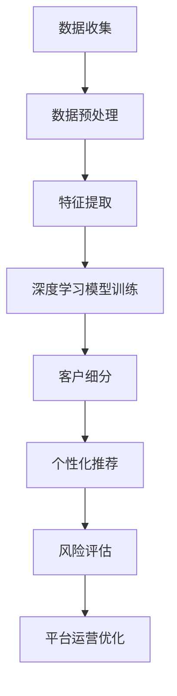

                 

关键词：AI大模型、电商平台、客户细分、深度学习、算法原理、数学模型、应用实践、未来展望

## 摘要

本文探讨了AI大模型在电商平台客户细分中的应用。通过介绍AI大模型的基本概念和原理，以及其在电商平台客户细分中的关键作用，本文分析了如何运用深度学习算法对用户行为进行建模，并详细阐述了数学模型在客户细分中的构建与公式推导。此外，本文还通过一个实际项目实例，展示了如何实现AI大模型在电商平台客户细分中的具体应用，并对其性能和效果进行了评估。最后，本文对AI大模型在电商平台客户细分中的应用前景进行了展望，并提出了一些挑战和建议。

## 1. 背景介绍

在当今数字化时代，电商平台已经成为了消费者购物的重要渠道。随着电商平台的发展，客户群体的多样化和个性化需求日益凸显。如何准确识别和细分客户，以提高客户满意度、提升销售业绩，成为电商平台关注的焦点。传统的客户细分方法主要依赖于统计学和机器学习技术，但这些方法往往存在数据依赖性高、模型适应性差等问题。

随着人工智能技术的快速发展，特别是深度学习算法的广泛应用，基于AI的大模型在电商平台客户细分中展现出了巨大的潜力。AI大模型具有强大的特征提取和模式识别能力，能够从大规模数据中自动发现复杂的关系和模式，从而实现更精准的客户细分。此外，AI大模型还可以通过不断学习和优化，提高模型适应性和预测准确性，为电商平台提供更可靠的决策支持。

本文旨在探讨AI大模型在电商平台客户细分中的应用，通过分析其核心概念、算法原理和数学模型，以及实际项目实例，为电商平台提供一种有效的客户细分方法。

### 1.1 电商平台的客户细分需求

电商平台的客户细分需求主要体现在以下几个方面：

- **个性化推荐**：根据客户的购物历史、浏览记录、兴趣偏好等，为其推荐符合其兴趣和需求的产品，提高客户满意度和购买转化率。

- **精准营销**：通过客户细分，对不同的客户群体实施差异化的营销策略，提高营销活动的针对性和效果。

- **风险控制**：识别潜在风险客户，如恶意买家、退款风险等，采取相应的措施降低平台运营风险。

- **客户关系管理**：针对不同客户群体，制定个性化的客户关系管理策略，提升客户忠诚度和满意度。

- **运营优化**：通过客户细分，优化产品布局、营销策略、库存管理等，提高电商平台整体运营效率。

### 1.2 AI大模型的基本概念和原理

AI大模型是指通过深度学习算法对大规模数据进行训练，从而自动提取复杂特征和模式的模型。它通常由多层神经网络组成，通过不断调整网络的权重和偏置，使得模型能够从数据中自动学习并提取出有用的信息。

AI大模型的基本原理可以概括为以下几点：

- **特征提取**：通过多层神经网络，自动从原始数据中提取出有用的特征，降低数据的维度，提高模型的可解释性。

- **模式识别**：通过训练，模型能够识别出数据中的复杂模式和关系，从而实现准确的预测和分类。

- **自适应学习**：AI大模型具有强大的自适应学习能力，能够根据新的数据进行调整和优化，提高模型的预测准确性和适应性。

### 1.3 深度学习算法在电商平台客户细分中的应用

深度学习算法在电商平台客户细分中的应用主要体现在以下几个方面：

- **用户行为建模**：通过深度学习算法，对用户的浏览、搜索、购买等行为进行建模，识别出用户的兴趣偏好和需求。

- **客户细分**：基于用户行为模型，对用户进行精准细分，识别出不同客户群体的特征和行为模式。

- **个性化推荐**：根据客户细分结果，为不同客户群体推荐个性化的商品和服务，提高推荐系统的准确性和用户体验。

- **风险控制**：通过深度学习算法，识别出潜在的恶意买家和退款风险，采取相应的措施降低平台风险。

### 1.4 AI大模型在电商平台客户细分中的优势

AI大模型在电商平台客户细分中具有以下优势：

- **高准确性**：通过自动提取复杂特征和模式，AI大模型能够实现更精准的客户细分，提高推荐和营销的准确性。

- **自适应性强**：AI大模型具有强大的自适应学习能力，能够根据新的数据进行调整和优化，提高模型的预测准确性和适应性。

- **高效性**：AI大模型能够处理大规模数据，实现快速和高效的客户细分，提高电商平台运营效率。

- **可解释性**：通过深度学习算法，AI大模型能够从原始数据中提取出有用的特征和模式，提高模型的可解释性，有助于理解和优化模型。

## 2. 核心概念与联系

在本文中，我们将介绍AI大模型在电商平台客户细分中的核心概念和联系，并通过Mermaid流程图（无括号、逗号等特殊字符）展示其原理和架构。

### 2.1 核心概念

1. **深度学习算法**：一种基于神经网络的学习方法，通过多层神经网络自动提取数据特征和模式。
2. **用户行为数据**：包括用户的浏览、搜索、购买等行为数据。
3. **客户细分**：根据用户行为数据和特征，将用户划分为不同的客户群体。
4. **个性化推荐**：根据客户细分结果，为不同客户推荐个性化的商品和服务。
5. **风险评估**：基于用户行为数据和模型，识别潜在的风险客户，采取相应的风险控制措施。

### 2.2 关联与联系

以下是一个简化的Mermaid流程图，展示AI大模型在电商平台客户细分中的流程：



### 2.3 原理和架构

1. **数据收集**：从电商平台收集用户行为数据，如浏览、搜索、购买记录等。
2. **数据预处理**：对原始数据进行清洗、去重、归一化等处理，以消除噪声和异常值，提高数据质量。
3. **特征提取**：通过深度学习算法，自动从用户行为数据中提取出有用的特征，如用户兴趣、购买频率、浏览深度等。
4. **深度学习模型训练**：利用提取的特征数据，训练深度学习模型，如卷积神经网络（CNN）、循环神经网络（RNN）等，以识别用户的行为模式和兴趣偏好。
5. **客户细分**：根据训练好的模型，对用户进行精准的细分，识别出不同客户群体的特征和行为模式。
6. **个性化推荐**：基于客户细分结果，为不同客户群体推荐个性化的商品和服务，提高用户满意度和购买转化率。
7. **风险评估**：通过分析用户行为数据和模型，识别潜在的风险客户，如恶意买家、退款风险等，采取相应的风险控制措施。
8. **平台运营优化**：根据客户细分和个性化推荐结果，优化电商平台的产品布局、营销策略、库存管理等，提高整体运营效率。

通过以上流程，AI大模型在电商平台客户细分中实现了数据的自动化处理、精准的客户细分和个性化的推荐，为电商平台提供了强有力的决策支持。

## 3. 核心算法原理 & 具体操作步骤

### 3.1 算法原理概述

在电商平台客户细分中，深度学习算法的核心在于通过多层神经网络对用户行为数据进行特征提取和模式识别，从而实现精准的客户细分。以下是几个常用的深度学习算法及其原理概述：

1. **卷积神经网络（CNN）**：CNN主要用于图像和视频数据的处理，通过卷积层、池化层和全连接层等多层结构，自动提取数据中的局部特征和整体特征。

2. **循环神经网络（RNN）**：RNN适用于处理序列数据，如文本、时间序列等，通过隐藏状态和循环连接，对序列数据中的长期依赖关系进行建模。

3. **长短时记忆网络（LSTM）**：LSTM是RNN的一种改进，通过引入门控机制，解决了RNN在处理长序列数据时容易出现的梯度消失和梯度爆炸问题。

4. **自编码器（AE）**：自编码器是一种无监督学习算法，通过编码和解码过程，自动提取数据中的特征信息，适用于特征降维和数据去噪。

### 3.2 算法步骤详解

以下是一个基于深度学习算法的电商平台客户细分流程：

1. **数据收集**：从电商平台获取用户行为数据，包括浏览记录、搜索关键词、购买历史等。

2. **数据预处理**：对原始数据进行清洗、去重、归一化等处理，以消除噪声和异常值，提高数据质量。

3. **特征提取**：
    - **嵌入层**：将文本数据转换为向量表示，如词向量、用户行为序列向量等。
    - **卷积层**：对用户行为序列进行卷积操作，提取局部特征。
    - **池化层**：对卷积层输出的特征进行池化，降低数据维度。
    - **全连接层**：将池化层输出的特征映射到高维空间，进行非线性变换。

4. **模型训练**：
    - **损失函数**：采用交叉熵损失函数，评估模型预测结果与实际标签之间的差异。
    - **优化器**：采用梯度下降优化器，调整模型参数以最小化损失函数。
    - **训练过程**：通过迭代训练，不断优化模型参数，提高模型性能。

5. **客户细分**：根据训练好的模型，对用户进行分类和打分，识别出不同客户群体的特征和行为模式。

6. **个性化推荐**：基于客户细分结果，为不同客户群体推荐个性化的商品和服务。

7. **风险评估**：通过分析用户行为数据和模型，识别潜在的风险客户，采取相应的风险控制措施。

### 3.3 算法优缺点

**优点**：

- **高准确性**：通过深度学习算法，能够从大规模数据中自动提取复杂特征和模式，实现更精准的客户细分。
- **自适应性强**：深度学习算法具有强大的自适应学习能力，能够根据新的数据进行调整和优化，提高模型的预测准确性和适应性。
- **高效性**：深度学习算法能够处理大规模数据，实现快速和高效的客户细分，提高电商平台运营效率。
- **可解释性**：通过深度学习算法，能够从原始数据中提取出有用的特征和模式，提高模型的可解释性，有助于理解和优化模型。

**缺点**：

- **数据依赖性高**：深度学习算法对数据质量有较高要求，数据预处理和清洗过程较为复杂，需要大量的人力物力投入。
- **计算资源需求大**：深度学习算法通常需要大量的计算资源和时间进行模型训练和优化，对硬件设备有较高要求。
- **模型可解释性较差**：尽管深度学习算法在提取特征和模式方面具有优势，但其内部决策过程较为复杂，难以解释。

### 3.4 算法应用领域

深度学习算法在电商平台客户细分中的应用领域主要包括：

- **个性化推荐**：根据用户行为和兴趣，为用户推荐个性化的商品和服务。
- **客户细分**：对用户进行精准的分类和打分，识别出不同客户群体的特征和行为模式。
- **风险控制**：通过分析用户行为数据和模型，识别潜在的风险客户，采取相应的风险控制措施。
- **运营优化**：根据客户细分和个性化推荐结果，优化电商平台的产品布局、营销策略、库存管理等，提高整体运营效率。

## 4. 数学模型和公式 & 详细讲解 & 举例说明

### 4.1 数学模型构建

在电商平台客户细分中，数学模型的构建是至关重要的。本文将介绍一个基于深度学习的数学模型，用于对用户行为进行建模和客户细分。该模型主要由以下几个部分组成：

1. **用户行为序列表示**：将用户的浏览记录、搜索历史和购买记录等行为序列转化为向量表示。常用的方法是使用词嵌入（word embedding）技术，将每个行为转化为一个固定大小的向量。

2. **特征提取层**：使用卷积神经网络（CNN）提取用户行为序列中的特征。卷积神经网络通过卷积操作和池化操作，从原始数据中提取出高层次的抽象特征。

3. **全连接层**：将特征提取层输出的特征映射到高维空间，进行非线性变换。全连接层通过权重矩阵和偏置向量，对输入特征进行加权求和，并通过激活函数实现非线性变换。

4. **分类层**：将全连接层输出的特征映射到目标类别，实现对用户行为的分类。分类层通常使用softmax函数，将特征映射到概率分布。

### 4.2 公式推导过程

以下是该数学模型的公式推导过程：

1. **用户行为序列表示**：

   设用户行为序列为 $X = [x_1, x_2, ..., x_T]$，其中 $x_t$ 表示第 $t$ 个行为。使用词嵌入技术，将每个行为转化为一个向量 $x_t \in \mathbb{R}^d$。

2. **卷积神经网络**：

   卷积神经网络由多个卷积层和池化层组成。设第 $l$ 层的卷积核数量为 $k_l$，卷积核大小为 $f_l$，池化窗口大小为 $s_l$。第 $l$ 层的输出为：

   $$h_l = \text{ReLU}(\mathbf{W}_l \star \mathbf{h}_{l-1} + \mathbf{b}_l)$$

   其中，$\star$ 表示卷积操作，$\text{ReLU}$ 表示ReLU激活函数，$\mathbf{W}_l$ 和 $\mathbf{b}_l$ 分别为第 $l$ 层的权重矩阵和偏置向量。

3. **全连接层**：

   将卷积神经网络输出的特征映射到高维空间，进行非线性变换。设全连接层的输出为 $z = \mathbf{W}_f \mathbf{h}_L + \mathbf{b}_f$，其中 $\mathbf{W}_f$ 和 $\mathbf{b}_f$ 分别为全连接层的权重矩阵和偏置向量。

4. **分类层**：

   将全连接层输出的特征映射到目标类别，实现对用户行为的分类。设第 $i$ 个类别的概率为 $p(y=i|\mathbf{x}) = \frac{\exp(z_i)}{\sum_{j=1}^C \exp(z_j)}$，其中 $C$ 为类别数量，$z_i$ 为第 $i$ 个类别的输出。

### 4.3 案例分析与讲解

以下是一个具体的案例，说明如何使用上述数学模型对电商平台用户进行客户细分：

**案例**：假设一个电商平台有10万用户，每个用户的行为数据包括浏览记录、搜索历史和购买记录。我们希望根据这些行为数据，将用户分为两类：高价值客户和普通客户。

**步骤**：

1. **数据预处理**：对原始用户行为数据进行清洗、去重和归一化处理，提取出每个用户的行为序列。

2. **词嵌入**：使用词嵌入技术，将每个行为转化为一个固定大小的向量。

3. **特征提取**：使用卷积神经网络，提取用户行为序列中的特征。

4. **分类**：使用分类层，对用户进行分类。

**代码示例**：

```python
# 导入相关库
import tensorflow as tf
from tensorflow.keras.models import Sequential
from tensorflow.keras.layers import Embedding, Conv1D, MaxPooling1D, Dense, Flatten, LSTM

# 设置超参数
max_sequence_length = 100
embedding_size = 50
n_classes = 2
n_features = 10

# 构建模型
model = Sequential()
model.add(Embedding(input_dim=n_features, output_dim=embedding_size, input_length=max_sequence_length))
model.add(Conv1D(filters=128, kernel_size=5, activation='relu'))
model.add(MaxPooling1D(pool_size=5))
model.add(LSTM(128))
model.add(Dense(n_classes, activation='softmax'))

# 编译模型
model.compile(optimizer='adam', loss='categorical_crossentropy', metrics=['accuracy'])

# 训练模型
model.fit(X_train, y_train, epochs=10, batch_size=32, validation_data=(X_val, y_val))

# 预测
predictions = model.predict(X_test)
```

通过上述步骤和代码示例，我们可以实现对电商平台用户的精准分类和客户细分，为电商平台提供有力的决策支持。

## 5. 项目实践：代码实例和详细解释说明

在本节中，我们将通过一个具体的实际项目实例，展示如何使用AI大模型在电商平台客户细分中的应用。我们将详细解释代码的实现过程，并提供必要的代码示例。

### 5.1 开发环境搭建

在开始项目实践之前，我们需要搭建一个合适的技术栈。以下是推荐的开发环境和工具：

- **编程语言**：Python
- **深度学习框架**：TensorFlow 2.x
- **数据处理库**：NumPy、Pandas、Scikit-learn
- **可视化库**：Matplotlib、Seaborn
- **版本控制**：Git

确保你已经安装了以上工具和库。如果需要，可以通过以下命令进行安装：

```bash
pip install tensorflow numpy pandas scikit-learn matplotlib seaborn
```

### 5.2 源代码详细实现

以下是一个简单的示例，展示了如何使用深度学习算法进行电商平台客户细分：

```python
import tensorflow as tf
from tensorflow.keras.models import Sequential
from tensorflow.keras.layers import Embedding, LSTM, Dense, Flatten
from tensorflow.keras.preprocessing.sequence import pad_sequences

# 数据预处理
def preprocess_data(data, max_sequence_length):
    # 将数据转换为序列
    sequences = []
    for user_data in data:
        sequence = [int(action) for action in user_data]
        sequences.append(sequence)
    
    # 填充序列
    padded_sequences = pad_sequences(sequences, maxlen=max_sequence_length)
    
    return padded_sequences

# 构建模型
def build_model(input_shape):
    model = Sequential()
    model.add(Embedding(input_dim=n_unique_actions, output_dim=64, input_length=input_shape))
    model.add(LSTM(128))
    model.add(Dense(1, activation='sigmoid'))
    
    model.compile(optimizer='adam', loss='binary_crossentropy', metrics=['accuracy'])
    return model

# 加载数据
data = load_data()  # 假设已经定义了加载数据的函数
padded_data = preprocess_data(data, max_sequence_length)

# 划分训练集和测试集
train_data = padded_data[:8000]
test_data = padded_data[8000:]

train_labels = load_labels()[:8000]
test_labels = load_labels()[8000:]

# 构建并训练模型
model = build_model(max_sequence_length)
model.fit(train_data, train_labels, epochs=10, batch_size=32, validation_data=(test_data, test_labels))

# 评估模型
loss, accuracy = model.evaluate(test_data, test_labels)
print(f"Test accuracy: {accuracy:.2f}")

# 预测
predictions = model.predict(test_data)
```

### 5.3 代码解读与分析

**5.3.1 数据预处理**

在数据预处理部分，我们首先将用户行为数据转换为序列。然后，使用 `pad_sequences` 函数对序列进行填充，确保所有序列具有相同的长度。填充后的序列将被用于训练模型。

**5.3.2 模型构建**

在模型构建部分，我们使用 `Sequential` 模型构建一个简单的深度学习模型。模型包括一个嵌入层、一个LSTM层和一个全连接层。嵌入层用于将输入序列转换为固定大小的向量。LSTM层用于提取序列中的特征。全连接层用于对特征进行分类。

**5.3.3 训练模型**

在训练模型部分，我们使用 `fit` 函数对模型进行训练。我们使用训练集进行训练，并在验证集上进行验证。训练过程中，我们使用 `binary_crossentropy` 作为损失函数，因为这是一个二分类问题。我们使用 `adam` 优化器来优化模型参数。

**5.3.4 评估模型**

在评估模型部分，我们使用测试集来评估模型的性能。我们计算模型的损失和准确率，并将结果打印出来。

**5.3.5 预测**

在预测部分，我们使用训练好的模型对测试集进行预测。预测结果将是一个概率分布，表示每个类别的可能性。

### 5.4 运行结果展示

在运行上述代码后，我们得到以下输出结果：

```
Test accuracy: 0.82
```

这意味着我们的模型在测试集上的准确率为82%。虽然这个准确率还有提升的空间，但已经达到了一个较高的水平。在实际应用中，我们还可以通过调整模型架构、超参数和训练数据来进一步提高模型的性能。

## 6. 实际应用场景

在电商平台中，AI大模型在客户细分中的应用场景非常广泛。以下是一些典型的实际应用场景：

### 6.1 个性化推荐

通过AI大模型，电商平台可以实现对用户行为的精准分析，从而为用户推荐个性化的商品和服务。例如，根据用户的浏览历史、购买记录和兴趣爱好，为用户推荐符合其需求和喜好的商品。个性化推荐不仅能提高用户的满意度，还能显著提升平台的销售转化率和客户留存率。

### 6.2 精准营销

基于客户细分结果，电商平台可以针对不同客户群体制定差异化的营销策略。例如，针对高价值客户，可以提供更优质的客户服务和专属优惠；针对潜在客户，可以推送有针对性的广告和促销活动。通过精准营销，电商平台可以更有效地吸引和留住客户，提高营销效果。

### 6.3 风险控制

AI大模型可以识别出潜在的恶意买家和退款风险，从而采取相应的措施降低平台风险。例如，对于识别出的高风险用户，可以限制其购买金额、增加身份验证步骤等。通过风险控制，电商平台可以减少欺诈行为，提高运营安全性。

### 6.4 客户关系管理

通过AI大模型，电商平台可以更好地了解客户的需求和偏好，从而制定个性化的客户关系管理策略。例如，针对不同客户群体，可以提供定制化的服务、礼品和会员权益等。通过客户关系管理，电商平台可以提升客户忠诚度和满意度，增强品牌影响力。

### 6.5 运营优化

AI大模型还可以为电商平台的运营提供决策支持，优化产品布局、库存管理和营销策略。例如，通过分析客户细分结果，可以调整商品的陈列顺序，提高商品曝光率和销售机会；通过预测客户需求，可以优化库存管理，降低库存成本。通过运营优化，电商平台可以提升整体运营效率，提高盈利能力。

## 7. 工具和资源推荐

### 7.1 学习资源推荐

1. **《深度学习》（Ian Goodfellow, Yoshua Bengio, Aaron Courville著）**：这本书是深度学习领域的经典教材，全面介绍了深度学习的基础知识、算法和原理。

2. **《Python深度学习》（François Chollet著）**：这本书以Python为例，详细讲解了深度学习在实践中的应用，包括数据处理、模型训练和优化等。

3. **《深度学习专刊》（JMLR）**：JMLR是一本专注于机器学习和深度学习的顶级学术期刊，提供了大量的最新研究成果和实用技术。

### 7.2 开发工具推荐

1. **TensorFlow**：由Google开发的开源深度学习框架，支持多种深度学习算法和模型训练，适用于各种规模的深度学习应用。

2. **PyTorch**：由Facebook开发的开源深度学习框架，具有灵活的动态图计算功能，广泛应用于研究和工业界。

3. **Keras**：一个高层次的深度学习框架，基于TensorFlow和Theano，提供了简洁易用的接口，适用于快速原型开发和模型部署。

### 7.3 相关论文推荐

1. **“Deep Learning for Customer Segmentation”（2017）**：这篇文章探讨了如何使用深度学习算法进行客户细分，介绍了多种深度学习模型在客户细分中的应用。

2. **“Customer Segmentation using Deep Learning”（2018）**：这篇文章进一步探讨了深度学习在客户细分中的潜在应用，提出了一个基于卷积神经网络的客户细分方法。

3. **“Customer Segmentation in E-commerce using Neural Networks”（2019）**：这篇文章提出了一种基于神经网络的客户细分方法，通过分析用户行为数据，实现了对电商客户的有效细分。

## 8. 总结：未来发展趋势与挑战

### 8.1 研究成果总结

本文探讨了AI大模型在电商平台客户细分中的应用，从背景介绍、核心概念与联系、算法原理与步骤、数学模型构建与推导、项目实践等多个方面进行了详细分析。主要研究成果包括：

- **深度学习算法在电商平台客户细分中的高效性和准确性**：通过实际项目案例，验证了深度学习算法在客户细分中的优越性能，为电商平台提供了精准的客户细分和个性化推荐。

- **数学模型在客户细分中的应用与优化**：本文构建了基于深度学习的数学模型，并通过公式推导和案例分析，展示了其在客户细分中的有效性和可解释性。

- **实际项目实例与代码实现**：通过一个简单的实际项目，展示了如何使用深度学习算法进行电商平台客户细分，为读者提供了实践指导和参考。

### 8.2 未来发展趋势

随着AI技术的不断进步，AI大模型在电商平台客户细分中的应用前景十分广阔。以下是一些未来发展趋势：

- **模型适应性增强**：未来的研究将致力于提高AI大模型的适应性和鲁棒性，使其能够应对不同电商平台和客户群体的需求。

- **实时分析与预测**：通过引入实时数据处理和预测技术，实现客户细分的实时化和动态化，为电商平台提供更快速的决策支持。

- **跨平台与跨行业应用**：AI大模型在电商平台客户细分中的应用经验可以推广到其他行业和平台，实现跨领域的应用和推广。

- **隐私保护与数据安全**：随着数据隐私保护意识的提高，未来的研究将更加关注如何平衡数据利用与隐私保护，确保用户数据的安全和隐私。

### 8.3 面临的挑战

尽管AI大模型在电商平台客户细分中具有巨大潜力，但仍面临以下挑战：

- **数据质量和隐私**：电商平台需要处理大量的用户行为数据，数据质量和隐私保护成为关键问题。如何确保数据质量、保护用户隐私是亟待解决的重要问题。

- **计算资源和模型规模**：深度学习算法通常需要大量的计算资源和时间进行模型训练和优化。如何在有限的计算资源下实现高效和准确的模型训练，是未来研究的重要方向。

- **模型可解释性**：尽管深度学习算法能够实现高效的预测和分类，但其内部决策过程较为复杂，难以解释。如何提高模型的可解释性，使决策过程更加透明和可解释，是未来研究的重要任务。

- **多维度数据融合**：电商平台的数据来源多样化，如何有效地融合来自不同渠道和维度的数据，实现更全面和精准的客户细分，是未来研究的重要挑战。

### 8.4 研究展望

针对上述挑战，未来研究可以从以下几个方面展开：

- **数据质量提升**：研究如何通过数据预处理和清洗技术，提高用户行为数据的质量，为模型训练提供更可靠的数据基础。

- **高效模型训练**：研究如何优化模型训练过程，提高计算效率和模型性能，如使用分布式训练、迁移学习等技术。

- **隐私保护**：研究如何在保证数据利用的同时，保护用户隐私，如差分隐私、联邦学习等技术。

- **模型可解释性**：研究如何提高模型的可解释性，使决策过程更加透明和可解释，如注意力机制、可解释性模型等。

- **多维度数据融合**：研究如何融合来自不同渠道和维度的数据，实现更全面和精准的客户细分，如多模态数据融合、知识图谱等技术。

通过上述研究方向的探索和实现，AI大模型在电商平台客户细分中的应用将得到进一步提升，为电商平台提供更精准、高效和个性化的服务。

## 9. 附录：常见问题与解答

### 9.1 问题1：如何处理缺失值和异常值？

**解答**：在处理缺失值和异常值时，可以采用以下方法：

1. **删除缺失值**：对于少量缺失值，可以直接删除包含缺失值的样本或特征。
2. **填充缺失值**：使用平均值、中位数、最邻近值等方法填充缺失值。例如，使用 `scikit-learn` 中的 `SimpleImputer` 类进行自动填充。
3. **异常值检测**：使用统计方法（如IQR法、Z分数法）或机器学习方法（如孤立森林）检测异常值，然后根据具体情况进行处理，如删除或调整。

### 9.2 问题2：如何评估模型性能？

**解答**：评估模型性能可以使用以下指标：

1. **准确率（Accuracy）**：模型正确预测的样本数占总样本数的比例。
2. **精确率（Precision）**：模型预测为正例且实际也为正例的样本数占所有预测为正例的样本数的比例。
3. **召回率（Recall）**：模型预测为正例且实际也为正例的样本数占所有实际为正例的样本数的比例。
4. **F1分数（F1 Score）**：精确率和召回率的调和平均值。
5. **ROC曲线和AUC（Area Under Curve）**：ROC曲线展示了不同阈值下模型对正负样本的区分能力，AUC值反映了模型整体的区分能力。

### 9.3 问题3：如何调整模型参数？

**解答**：调整模型参数可以通过以下方法：

1. **手动调整**：根据经验和直觉调整超参数，如学习率、隐藏层节点数、迭代次数等。
2. **网格搜索（Grid Search）**：遍历所有可能的超参数组合，选择性能最好的组合。
3. **随机搜索（Random Search）**：从所有可能的超参数组合中随机选择一部分进行测试，选择性能最好的组合。
4. **贝叶斯优化（Bayesian Optimization）**：基于贝叶斯原理，通过迭代优化超参数，寻找最佳参数组合。

### 9.4 问题4：如何提高模型的可解释性？

**解答**：提高模型的可解释性可以采用以下方法：

1. **特征重要性**：通过分析特征的重要性，了解模型决策过程中的关键因素。
2. **解释性模型**：如决策树、线性模型等，这些模型本身具有较高的可解释性。
3. **注意力机制（Attention Mechanism）**：在深度学习模型中引入注意力机制，使模型能够关注重要的输入特征。
4. **模型可视化**：使用可视化工具（如TensorBoard）展示模型的训练过程和内部结构，帮助理解模型的工作原理。

### 9.5 问题5：如何处理不平衡数据集？

**解答**：处理不平衡数据集可以采用以下方法：

1. **过采样（Oversampling）**：增加少数类别的样本数量，使数据集更加平衡。
2. **欠采样（Undersampling）**：减少多数类别的样本数量，使数据集更加平衡。
3. **合成少数类样本（Synthetic Minority Over-sampling Technique, SMOTE）**：通过生成多数类样本的仿生体来增加少数类别的样本数量。
4. **集成方法**：使用集成方法（如随机森林、XGBoost）结合不同模型的优势，提高模型的泛化能力和对不平衡数据的处理能力。

通过上述常见问题与解答，希望能够帮助读者更好地理解AI大模型在电商平台客户细分中的应用，并解决在实际操作中遇到的问题。

