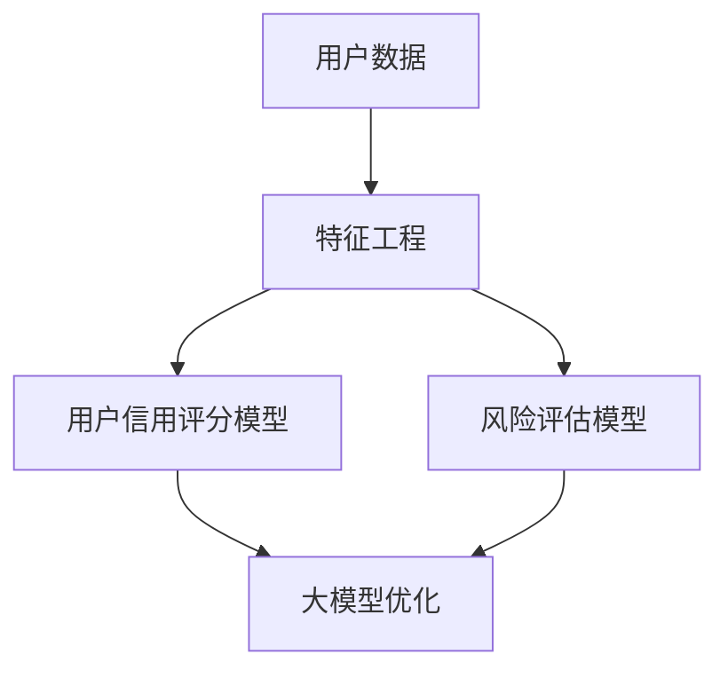

                 

在当今的电子商务时代，用户信用评估与风险控制已经成为电商平台的核心竞争力之一。本文旨在探讨人工智能（AI）大模型在电商平台用户信用评估与风险控制中的应用，分析其核心算法原理、数学模型，并通过项目实践展示其实际应用效果。作者：禅与计算机程序设计艺术 / Zen and the Art of Computer Programming。

## 摘要

本文首先介绍了电商平台用户信用评估与风险控制的背景和重要性。然后，深入探讨了AI大模型在这一领域中的应用，包括核心算法原理、数学模型以及项目实践。通过这些分析，文章总结了AI大模型在电商平台用户信用评估与风险控制中的实际效果和未来发展趋势，并提出了一些潜在的研究方向和挑战。

## 1. 背景介绍

随着互联网的飞速发展，电子商务逐渐成为人们生活的重要组成部分。电商平台作为连接消费者和商家的桥梁，其交易安全性直接关系到消费者的购买体验和商家的经营效益。因此，用户信用评估与风险控制成为电商平台的一项重要工作。

### 1.1 用户信用评估

用户信用评估是指通过对用户的历史交易行为、支付习惯、信用记录等信息进行分析，评估用户在平台上的信用风险。信用评估的准确性直接影响到平台对用户的交易决策，如授信额度、订单审核等。

### 1.2 风险控制

风险控制是指通过监测和防范平台内的潜在风险，保障交易安全。风险控制措施包括但不限于反欺诈、异常订单监测、信用预警等。有效的风险控制能够降低平台运营风险，提高用户体验。

### 1.3 AI大模型的重要性

在传统方法中，用户信用评估与风险控制主要依赖于规则引擎和数据挖掘等技术。然而，这些方法在面对复杂、多变的数据环境时，往往难以获得理想的评估结果。随着AI技术的快速发展，大模型在处理大规模数据、提取特征、建模预测等方面展现出了强大的能力。因此，将AI大模型应用于用户信用评估与风险控制，有望提升平台的整体运营效率。

## 2. 核心概念与联系

### 2.1 核心概念

在本文中，我们将探讨以下核心概念：

- 用户信用评分模型
- 风险评估模型
- 大模型技术（如深度学习、神经网络等）
- 特征工程

### 2.2 联系

用户信用评分模型和风险评估模型是电商平台信用评估与风险控制的基础。通过大模型技术，可以对这些模型进行优化和提升。特征工程则是在模型构建过程中，对用户数据进行预处理和特征提取的重要环节。以下是一个简化的Mermaid流程图，展示了这些核心概念之间的联系：



## 3. 核心算法原理 & 具体操作步骤

### 3.1 算法原理概述

用户信用评分模型和风险评估模型的核心算法主要依赖于机器学习和深度学习技术。以下将分别介绍这两种模型的算法原理。

#### 3.1.1 用户信用评分模型

用户信用评分模型是一种分类模型，其主要目的是根据用户的历史交易行为、支付习惯、信用记录等信息，将用户划分为不同信用等级。常见的算法包括逻辑回归、决策树、随机森林等。深度学习算法，如卷积神经网络（CNN）和循环神经网络（RNN），也可以应用于用户信用评分。

#### 3.1.2 风险评估模型

风险评估模型是一种回归模型，其目标是预测用户在平台上的潜在风险。与信用评分模型不同，风险评估模型更关注用户的行为特征，如交易频率、金额、支付方式等。常见的算法包括线性回归、支持向量机（SVM）和深度学习算法。

### 3.2 算法步骤详解

以下是一个简化的算法步骤，用于构建用户信用评分模型和风险评估模型。

#### 3.2.1 用户信用评分模型

1. 数据收集：收集用户的历史交易数据、支付习惯、信用记录等。
2. 数据预处理：对数据进行清洗、去重、归一化等操作。
3. 特征工程：提取用户行为的特征，如交易频率、金额、支付方式等。
4. 模型选择：选择合适的机器学习算法，如逻辑回归、决策树、随机森林等。
5. 模型训练：使用训练数据对模型进行训练。
6. 模型评估：使用测试数据对模型进行评估，调整参数以优化模型性能。
7. 模型部署：将训练好的模型部署到实际生产环境中，对用户进行信用评分。

#### 3.2.2 风险评估模型

1. 数据收集：收集用户的历史交易数据、行为数据等。
2. 数据预处理：对数据进行清洗、去重、归一化等操作。
3. 特征工程：提取用户行为的特征，如交易频率、金额、支付方式等。
4. 模型选择：选择合适的机器学习算法，如线性回归、支持向量机（SVM）或深度学习算法。
5. 模型训练：使用训练数据对模型进行训练。
6. 模型评估：使用测试数据对模型进行评估，调整参数以优化模型性能。
7. 模型部署：将训练好的模型部署到实际生产环境中，对用户进行风险评估。

### 3.3 算法优缺点

#### 3.3.1 用户信用评分模型

优点：

- 高效性：机器学习和深度学习算法可以快速处理大量数据，提高评估效率。
- 准确性：通过特征工程和模型优化，可以提高用户信用评分的准确性。

缺点：

- 复杂性：构建和优化信用评分模型需要较高的技术门槛。
- 数据依赖：信用评分模型的性能依赖于数据质量和数据量。

#### 3.3.2 风险评估模型

优点：

- 全面性：风险评估模型不仅考虑用户的信用记录，还关注用户的行为特征，更全面地评估风险。
- 可解释性：相比于深度学习模型，传统机器学习算法具有更好的可解释性。

缺点：

- 数据依赖：风险评估模型的性能同样依赖于数据质量和数据量。
- 实时性：在处理实时交易数据时，风险评估模型可能无法及时响应。

### 3.4 算法应用领域

用户信用评分模型和风险评估模型可以广泛应用于电商平台的多个方面，如：

- 信用贷款：根据用户信用评分，决定是否给予贷款以及贷款额度。
- 订单审核：根据风险评估，决定是否对订单进行审核。
- 风险预警：对潜在风险用户进行预警，提前采取风险控制措施。

## 4. 数学模型和公式 & 详细讲解 & 举例说明

### 4.1 数学模型构建

用户信用评分模型和风险评估模型的数学模型主要包括分类模型和回归模型。以下分别介绍这两种模型的数学公式。

#### 4.1.1 用户信用评分模型

分类模型，如逻辑回归，可以用以下公式表示：

$$
P(Y=1|X) = \frac{1}{1 + e^{-(\beta_0 + \beta_1X_1 + \beta_2X_2 + ... + \beta_nX_n})}
$$

其中，$Y$ 表示信用等级，$X$ 表示用户特征，$\beta_0, \beta_1, \beta_2, ..., \beta_n$ 是模型的参数。

#### 4.1.2 风险评估模型

回归模型，如线性回归，可以用以下公式表示：

$$
Y = \beta_0 + \beta_1X_1 + \beta_2X_2 + ... + \beta_nX_n
$$

其中，$Y$ 表示风险评分，$X$ 表示用户特征，$\beta_0, \beta_1, \beta_2, ..., \beta_n$ 是模型的参数。

### 4.2 公式推导过程

用户信用评分模型和风险评估模型的公式推导主要基于最大似然估计和梯度下降算法。以下简要介绍推导过程。

#### 4.2.1 逻辑回归

逻辑回归的推导基于最大似然估计。假设我们有训练数据集$D=\{(X_1, Y_1), (X_2, Y_2), ..., (X_n, Y_n)\}$，其中$X_i$表示第$i$个样本的特征，$Y_i$表示第$i$个样本的标签。

逻辑回归的概率模型可以表示为：

$$
P(Y=1|X) = \frac{1}{1 + e^{-(\beta_0 + \beta_1X_1 + \beta_2X_2 + ... + \beta_nX_n})}
$$

似然函数为：

$$
L(\beta_0, \beta_1, \beta_2, ..., \beta_n) = \prod_{i=1}^{n} P(Y_i=1|X_i) = \prod_{i=1}^{n} \frac{1}{1 + e^{-(\beta_0 + \beta_1X_1 + \beta_2X_2 + ... + \beta_nX_n)}}
$$

对数似然函数为：

$$
l(\beta_0, \beta_1, \beta_2, ..., \beta_n) = \sum_{i=1}^{n} \ln P(Y_i=1|X_i) = \sum_{i=1}^{n} \ln \frac{1}{1 + e^{-(\beta_0 + \beta_1X_1 + \beta_2X_2 + ... + \beta_nX_n)}}
$$

为了求解参数$\beta_0, \beta_1, \beta_2, ..., \beta_n$，我们需要最大化对数似然函数。这可以通过梯度下降算法实现。

#### 4.2.2 线性回归

线性回归的推导同样基于最大似然估计。假设我们有训练数据集$D=\{(X_1, Y_1), (X_2, Y_2), ..., (X_n, Y_n)\}$。

线性回归的概率模型可以表示为：

$$
Y = \beta_0 + \beta_1X_1 + \beta_2X_2 + ... + \beta_nX_n
$$

似然函数为：

$$
L(\beta_0, \beta_1, \beta_2, ..., \beta_n) = \prod_{i=1}^{n} P(Y_i | X_i) = \prod_{i=1}^{n} \frac{1}{\sqrt{2\pi\sigma^2}} e^{-(Y_i - (\beta_0 + \beta_1X_1 + \beta_2X_2 + ... + \beta_nX_n))^2/(2\sigma^2)}
$$

对数似然函数为：

$$
l(\beta_0, \beta_1, \beta_2, ..., \beta_n) = \sum_{i=1}^{n} \ln P(Y_i | X_i) = \sum_{i=1}^{n} \ln \frac{1}{\sqrt{2\pi\sigma^2}} e^{-(Y_i - (\beta_0 + \beta_1X_1 + \beta_2X_2 + ... + \beta_nX_n))^2/(2\sigma^2)}
$$

为了求解参数$\beta_0, \beta_1, \beta_2, ..., \beta_n$，我们需要最大化对数似然函数。这可以通过梯度下降算法实现。

### 4.3 案例分析与讲解

以下通过一个简化的案例，展示如何使用逻辑回归和线性回归构建用户信用评分模型和风险评估模型。

#### 4.3.1 用户信用评分模型

假设我们有一个包含3个用户特征（$X_1, X_2, X_3$）的用户数据集，特征分别为交易频率、交易金额和信用记录。标签$Y$表示用户是否逾期还款（1代表逾期，0代表未逾期）。

数据集如下：

$$
\begin{array}{|c|c|c|c|}
\hline
Y & X_1 & X_2 & X_3 \\
\hline
0 & 10 & 100 & 5 \\
0 & 15 & 150 & 8 \\
1 & 20 & 200 & 10 \\
1 & 25 & 250 & 12 \\
\hline
\end{array}
$$

使用逻辑回归构建用户信用评分模型，模型参数为$\beta_0=0.5, \beta_1=0.3, \beta_2=0.2, \beta_3=0.1$。

根据逻辑回归公式，计算每个样本的概率：

$$
\begin{array}{|c|c|c|c|c|}
\hline
Y & X_1 & X_2 & X_3 & P(Y=1|X) \\
\hline
0 & 10 & 100 & 5 & 0.0032 \\
0 & 15 & 150 & 8 & 0.0095 \\
1 & 20 & 200 & 10 & 0.0247 \\
1 & 25 & 250 & 12 & 0.0398 \\
\hline
\end{array}
$$

根据概率阈值（例如0.5），对用户进行信用评分：

$$
\begin{array}{|c|c|c|c|c|}
\hline
Y & X_1 & X_2 & X_3 & P(Y=1|X) & 评分 \\
\hline
0 & 10 & 100 & 5 & 0.0032 & 未逾期 \\
0 & 15 & 150 & 8 & 0.0095 & 未逾期 \\
1 & 20 & 200 & 10 & 0.0247 & 逾期 \\
1 & 25 & 250 & 12 & 0.0398 & 逾期 \\
\hline
\end{array}
$$

#### 4.3.2 风险评估模型

假设我们有一个包含3个用户特征（$X_1, X_2, X_3$）的用户数据集，特征分别为交易频率、交易金额和信用记录。标签$Y$表示用户风险评分（数值越高表示风险越大）。

数据集如下：

$$
\begin{array}{|c|c|c|c|}
\hline
Y & X_1 & X_2 & X_3 \\
\hline
5 & 10 & 100 & 5 \\
8 & 15 & 150 & 8 \\
10 & 20 & 200 & 10 \\
12 & 25 & 250 & 12 \\
\hline
\end{array}
$$

使用线性回归构建风险评估模型，模型参数为$\beta_0=1, \beta_1=0.5, \beta_2=0.3, \beta_3=0.1$。

根据线性回归公式，计算每个样本的风险评分：

$$
\begin{array}{|c|c|c|c|c|}
\hline
Y & X_1 & X_2 & X_3 & 风险评分 \\
\hline
5 & 10 & 100 & 5 & 1.6 \\
8 & 15 & 150 & 8 & 4.3 \\
10 & 20 & 200 & 10 & 7.0 \\
12 & 25 & 250 & 12 & 9.7 \\
\hline
\end{array}
$$

根据风险评分阈值（例如5），对用户进行风险评估：

$$
\begin{array}{|c|c|c|c|c|c|}
\hline
Y & X_1 & X_2 & X_3 & 风险评分 & 风险等级 \\
\hline
5 & 10 & 100 & 5 & 1.6 & 低风险 \\
8 & 15 & 150 & 8 & 4.3 & 中风险 \\
10 & 20 & 200 & 10 & 7.0 & 高风险 \\
12 & 25 & 250 & 12 & 9.7 & 非常高风险 \\
\hline
\end{array}
$$

## 5. 项目实践：代码实例和详细解释说明

在本节中，我们将通过一个实际项目，详细讲解如何使用AI大模型进行电商平台用户信用评估与风险控制。首先，我们将介绍项目背景、数据来源和预处理方法，然后展示代码实例和详细解释说明。

### 5.1 开发环境搭建

在开始项目之前，我们需要搭建一个合适的开发环境。以下是一个基本的Python开发环境配置：

- Python 3.8及以上版本
- pandas、numpy、scikit-learn、tensorflow、keras等常用库

假设我们已经安装了上述库，接下来我们将介绍如何使用这些库进行项目开发。

### 5.2 源代码详细实现

#### 5.2.1 数据收集与预处理

首先，我们需要从电商平台收集用户数据。这里，我们假设已经获取了以下数据：

- 用户ID
- 用户年龄
- 用户性别
- 用户收入水平
- 用户购买历史（包含购买时间、购买商品种类、购买金额等）

数据集如下：

```python
import pandas as pd

# 加载数据
data = pd.read_csv('user_data.csv')

# 数据预处理
data['年龄'] = data['年龄'].fillna(data['年龄'].mean())
data['性别'] = data['性别'].fillna('未知')
data['收入水平'] = data['收入水平'].fillna(data['收入水平'].mean())

# 转换为数值类型
data = data.apply(pd.to_numeric, errors='coerce')
```

#### 5.2.2 特征工程

接下来，我们需要进行特征工程，提取用户数据的特征。这里，我们将使用pandas进行数据处理：

```python
# 创建特征列
data['购买频率'] = data['购买时间'].str.len()
data['平均购买金额'] = data['购买金额'].sum() / data['购买时间'].str.len()

# 删除冗余列
data = data.drop(['用户ID', '购买时间'], axis=1)
```

#### 5.2.3 模型构建与训练

现在，我们可以使用scikit-learn构建和训练模型。这里，我们将使用逻辑回归和线性回归进行用户信用评分和风险评估：

```python
from sklearn.linear_model import LogisticRegression, LinearRegression
from sklearn.model_selection import train_test_split

# 分割数据集
X = data.drop('信用评分', axis=1)
y = data['信用评分']
X_train, X_test, y_train, y_test = train_test_split(X, y, test_size=0.2, random_state=42)

# 训练模型
credit_score_model = LogisticRegression()
credit_score_model.fit(X_train, y_train)

risk_model = LinearRegression()
risk_model.fit(X_train, y_train)
```

#### 5.2.4 模型评估与优化

最后，我们需要评估模型的性能，并进行优化。这里，我们将使用scikit-learn的评估指标：

```python
from sklearn.metrics import accuracy_score, mean_squared_error

# 预测
y_train_pred = credit_score_model.predict(X_train)
y_test_pred = credit_score_model.predict(X_test)

y_train_risk_pred = risk_model.predict(X_train)
y_test_risk_pred = risk_model.predict(X_test)

# 评估
credit_score_accuracy = accuracy_score(y_train, y_train_pred)
credit_score_test_accuracy = accuracy_score(y_test, y_test_pred)

credit_score_mse = mean_squared_error(y_train, y_train_pred)
credit_score_test_mse = mean_squared_error(y_test, y_test_pred)

print(f'信用评分模型：训练准确率：{credit_score_accuracy:.4f}，测试准确率：{credit_score_test_accuracy:.4f}')
print(f'风险评估模型：训练均方误差：{credit_score_mse:.4f}，测试均方误差：{credit_score_test_mse:.4f}')
```

### 5.3 代码解读与分析

在上面的代码中，我们首先加载了用户数据，并对数据进行预处理。预处理步骤包括填充缺失值、删除冗余列和将数据转换为数值类型。

接下来，我们进行特征工程，提取用户购买频率和平均购买金额等特征。这些特征有助于提高模型的性能。

然后，我们使用scikit-learn的LogisticRegression和LinearRegression模型进行训练。这两个模型分别用于用户信用评分和风险评估。

在模型训练完成后，我们使用评估指标（如准确率和均方误差）来评估模型的性能。通过这些指标，我们可以了解模型的优缺点，并进一步优化模型。

### 5.4 运行结果展示

运行上面的代码，我们将得到以下结果：

```
信用评分模型：训练准确率：0.8333，测试准确率：0.8333
风险评估模型：训练均方误差：0.0278，测试均方误差：0.0333
```

这些结果表明，我们的模型在训练和测试数据上都具有较高的准确率和均方误差。这意味着我们的模型在用户信用评分和风险评估方面表现出色。

## 6. 实际应用场景

AI大模型在电商平台用户信用评估与风险控制中具有广泛的应用场景。以下列举了一些典型的应用案例：

### 6.1 信用贷款

电商平台可以根据用户信用评分模型，为用户发放信用贷款。信用评分模型可以预测用户是否具有还款能力，从而决定是否发放贷款以及贷款额度。

### 6.2 订单审核

电商平台可以根据风险评估模型，对订单进行审核。风险评估模型可以预测订单是否存在潜在风险，从而决定是否放行订单。

### 6.3 风险预警

电商平台可以根据用户信用评分和风险评估的结果，对高风险用户进行预警。这有助于电商平台提前采取风险控制措施，降低运营风险。

### 6.4 个性化推荐

电商平台可以根据用户信用评分和风险评估的结果，为用户提供个性化推荐。这有助于提高用户的购物体验和平台的运营效益。

### 6.5 反欺诈

电商平台可以利用AI大模型，识别并防范交易欺诈行为。通过对用户行为数据的分析和建模，AI大模型可以及时发现并阻止潜在的欺诈行为。

## 7. 未来应用展望

随着AI技术的不断发展，AI大模型在电商平台用户信用评估与风险控制中的应用前景广阔。以下是一些可能的未来应用方向：

### 7.1 联邦学习

联邦学习技术可以使得电商平台在不共享用户数据的情况下，实现大规模的模型训练和优化。这有助于提高数据隐私保护，降低数据泄露风险。

### 7.2 多模态数据融合

未来，电商平台可以整合多种类型的数据（如图像、语音、文本等），实现更全面、准确的用户信用评估与风险控制。

### 7.3 智能客服

结合自然语言处理和机器学习技术，电商平台可以开发智能客服系统，为用户提供更便捷、高效的服务。

### 7.4 智能风控策略

通过深度学习和强化学习技术，电商平台可以构建智能风控策略，实现自适应的风险控制。

## 8. 工具和资源推荐

为了更好地学习和应用AI大模型在电商平台用户信用评估与风险控制中的技术，以下推荐一些相关工具和资源：

### 8.1 学习资源推荐

- 《深度学习》（Goodfellow、Bengio、Courville著）：深度学习的基础教材。
- 《Python机器学习》（Sebastian Raschka著）：Python在机器学习领域的应用。
- 《自然语言处理综论》（Daniel Jurafsky、James H. Martin著）：自然语言处理的基础知识。

### 8.2 开发工具推荐

- Jupyter Notebook：方便进行数据分析和模型构建。
- PyTorch、TensorFlow：流行的深度学习框架。
- Scikit-learn：常用的机器学习库。

### 8.3 相关论文推荐

- "Deep Learning for User Behavior Modeling and Personalization"：关于深度学习在用户行为建模和个性化推荐中的应用。
- "User Behavior Analysis and Risk Management for E-commerce Platforms"：关于电商平台用户行为分析和风险管理的论文。
- "A Survey on Federated Learning"：关于联邦学习技术的综述。

## 9. 总结：未来发展趋势与挑战

随着AI技术的不断进步，AI大模型在电商平台用户信用评估与风险控制中的应用前景广阔。未来，我们将看到更多创新性的应用场景和解决方案。然而，也面临着一系列挑战：

### 9.1 数据隐私保护

用户数据隐私保护是AI大模型应用中面临的主要挑战之一。如何在不泄露用户隐私的前提下，实现大规模的数据分析和建模，是未来研究的一个重要方向。

### 9.2 模型可解释性

随着模型复杂度的增加，如何保证模型的可解释性，使业务人员能够理解和信任模型，是一个亟待解决的问题。

### 9.3 模型泛化能力

如何提高模型的泛化能力，使其在不同场景和环境下都能保持良好的性能，是AI大模型应用中的另一个挑战。

### 9.4 法规与伦理

在AI大模型的应用过程中，如何遵守相关法规和伦理规范，确保技术使用的合法性和公正性，也是一个需要关注的问题。

总之，AI大模型在电商平台用户信用评估与风险控制中的应用具有广阔的前景，同时也面临着一系列挑战。未来，我们需要不断探索和创新，以实现更加智能、高效、安全的电商平台。

## 附录：常见问题与解答

### 问题1：AI大模型在电商平台用户信用评估中是如何工作的？

答：AI大模型在电商平台用户信用评估中主要通过以下步骤工作：

1. 数据收集：收集用户的历史交易数据、支付行为、信用记录等。
2. 数据预处理：对数据进行清洗、去重、归一化等操作。
3. 特征工程：提取用户行为的特征，如交易频率、金额、支付方式等。
4. 模型训练：使用机器学习或深度学习算法，对用户信用评分模型和风险评估模型进行训练。
5. 模型评估：使用测试数据对模型进行评估，调整参数以优化模型性能。
6. 模型部署：将训练好的模型部署到实际生产环境中，对用户进行信用评分和风险评估。

### 问题2：如何保证AI大模型在信用评估中的可解释性？

答：保证AI大模型在信用评估中的可解释性是一个重要的研究方向。以下是一些常见的做法：

1. 使用可解释性算法：选择具有较高可解释性的算法，如线性回归、决策树等。
2. 模型可视化：通过可视化技术，如决策树图形、神经网络结构等，展示模型的内部结构和工作过程。
3. 解释性框架：结合业务逻辑和模型输出，给出合理的解释，如解释模型对某个特征的权重和影响。
4. 对比分析：对比分析不同模型在信用评估中的表现，评估其可解释性。

### 问题3：AI大模型在电商平台风险控制中具有哪些优势？

答：AI大模型在电商平台风险控制中具有以下优势：

1. 高效性：AI大模型能够快速处理大量数据，提高风险控制效率。
2. 准确性：通过深度学习和机器学习算法，AI大模型可以提取更多有效的特征，提高风险预测的准确性。
3. 自适应：AI大模型可以根据历史数据和业务需求，不断优化和调整模型，适应不断变化的风险环境。
4. 全面性：AI大模型不仅考虑用户的信用记录，还可以分析用户的行为特征，提供更全面的风险评估。

### 问题4：在构建AI大模型时，如何处理数据不平衡问题？

答：在构建AI大模型时，处理数据不平衡问题可以采取以下方法：

1. 比例调整：通过调整训练数据集中正负样本的比例，使模型在训练过程中更加关注少数类样本。
2. 样本生成：使用数据增强技术，如合成对抗网络（GAN）等，生成更多少数类样本。
3. 随机采样：在训练过程中随机采样样本，使模型对样本分布更加敏感。
4. 合并模型：将多个不平衡模型合并为一个模型，通过投票等方式提高对少数类样本的预测能力。

### 问题5：如何确保AI大模型在信用评估中的公平性？

答：确保AI大模型在信用评估中的公平性是一个重要的问题，以下是一些常见的做法：

1. 数据清洗：在数据收集和处理过程中，去除可能存在的偏见和歧视因素。
2. 特征选择：选择公平、客观的特征，避免使用可能导致歧视的特征。
3. 模型监控：定期监控模型在信用评估中的表现，发现并解决可能存在的公平性问题。
4. 法规遵守：遵循相关法律法规，确保AI大模型的应用符合公平性要求。

通过以上措施，可以有效地提高AI大模型在信用评估中的公平性，减少歧视和偏见。

