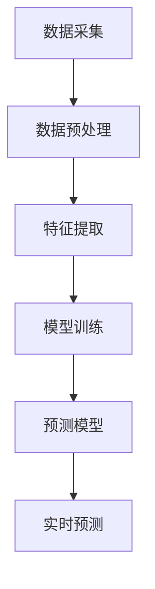

                 

关键词：AI大模型、用户意图预测、电商平台、机器学习、深度学习

摘要：本文将探讨AI大模型在电商平台用户意图预测中的应用。首先介绍电商平台用户意图预测的背景和重要性，然后详细介绍大模型的原理和应用步骤，接着通过数学模型和具体案例来讲解大模型在用户意图预测中的实现过程。最后，文章将探讨大模型在电商平台中的实际应用场景和未来展望。

## 1. 背景介绍

在当今数字化时代，电商平台已经成为了人们日常生活中不可或缺的一部分。随着电商平台的蓬勃发展，用户数量和交易规模都在不断增长。然而，如何在海量用户数据中准确预测用户意图，从而提高用户体验和转化率，成为了一个亟待解决的问题。

用户意图预测是指通过分析用户的浏览历史、购买行为等数据，预测用户接下来可能采取的行为或购买意向。这对于电商平台来说至关重要，因为它可以帮助平台在用户做出购买决策之前，提前推送相关商品或提供个性化服务，从而提高用户满意度和转化率。

传统的用户意图预测方法主要依赖于统计模型和规则引擎，这些方法在处理简单、线性关系问题时表现较好，但在面对复杂、非线性关系时往往力不从心。随着深度学习技术的不断发展，大模型（如深度神经网络）在处理复杂数据关系方面展现出了强大的能力，这使得大模型在用户意图预测中的应用成为可能。

## 2. 核心概念与联系

### 2.1 大模型的概念

大模型是指具有大规模参数和复杂结构的深度学习模型。常见的有卷积神经网络（CNN）、循环神经网络（RNN）、长短时记忆网络（LSTM）等。这些模型通过学习海量数据中的特征和关系，可以实现对复杂数据的建模和预测。

### 2.2 用户意图预测的原理

用户意图预测的核心思想是利用用户的历史行为数据，通过机器学习算法训练出一个预测模型。该模型可以将用户的当前行为映射到可能的未来行为上，从而实现用户意图的预测。

用户意图预测的流程主要包括数据采集、数据预处理、特征提取、模型训练和预测。其中，数据预处理和特征提取是用户意图预测的关键步骤。数据预处理主要是对原始数据进行清洗、归一化等处理，以消除噪声和提高数据质量。特征提取则是从原始数据中提取对用户意图预测有用的信息。

### 2.3 大模型在用户意图预测中的应用

大模型在用户意图预测中的应用主要体现在以下几个方面：

1. **特征表示**：大模型可以通过学习用户的历史行为数据，将用户的特征表示为高维向量，从而捕捉用户行为之间的复杂关系。

2. **预测模型**：利用大模型训练出的特征表示，可以构建一个预测模型，用于预测用户接下来可能采取的行为或购买意向。

3. **实时预测**：大模型具有快速处理大量数据的能力，可以实现实时预测，从而为电商平台提供实时、个性化的服务。

### 2.4 Mermaid 流程图

下面是一个描述用户意图预测流程的Mermaid流程图：



## 3. 核心算法原理 & 具体操作步骤

### 3.1 算法原理概述

用户意图预测的核心算法是基于深度学习的大模型。大模型通过学习用户的历史行为数据，可以提取出对用户意图预测有用的特征，并利用这些特征构建一个预测模型。

### 3.2 算法步骤详解

1. **数据采集**：收集用户的历史行为数据，包括浏览历史、购买记录、评论等。

2. **数据预处理**：对原始数据进行清洗、归一化等处理，以消除噪声和提高数据质量。

3. **特征提取**：利用深度学习模型，从预处理后的数据中提取出高维特征向量。

4. **模型训练**：使用提取出的特征向量，通过反向传播算法训练一个深度神经网络模型。

5. **预测模型**：将训练好的模型应用于新的用户行为数据，预测用户接下来可能采取的行为或购买意向。

6. **实时预测**：将预测结果实时推送至电商平台，为用户提供个性化服务。

### 3.3 算法优缺点

**优点**：

1. **强大的特征提取能力**：大模型可以通过学习海量数据，提取出对用户意图预测有用的特征。

2. **自适应性强**：大模型可以自适应地调整模型参数，以适应不断变化的数据分布。

3. **实时预测**：大模型具有快速处理大量数据的能力，可以实现实时预测。

**缺点**：

1. **计算成本高**：大模型训练和预测需要大量的计算资源。

2. **数据依赖性强**：大模型的性能依赖于训练数据的质量和数量。

### 3.4 算法应用领域

用户意图预测算法可以应用于电商平台的各个领域，如：

1. **推荐系统**：根据用户的历史行为，预测用户可能感兴趣的商品，为用户提供个性化推荐。

2. **广告投放**：根据用户的行为和意图，预测用户可能感兴趣的广告，提高广告的投放效果。

3. **客户服务**：根据用户的意图，为用户提供针对性的服务，提高用户满意度。

## 4. 数学模型和公式 & 详细讲解 & 举例说明

### 4.1 数学模型构建

用户意图预测的数学模型主要基于深度学习中的神经网络。神经网络通过多层非线性变换，将输入数据映射到输出结果。具体的模型结构如下：

```latex
f(x) = \sigma(W_n \cdot a_{n-1} + b_n)
```

其中，\(x\) 是输入数据，\(W_n\) 和 \(b_n\) 分别是第 \(n\) 层的权重和偏置，\(\sigma\) 是激活函数，通常采用 sigmoid 函数或ReLU函数。

### 4.2 公式推导过程

以 sigmoid 函数为例，其公式为：

```latex
\sigma(z) = \frac{1}{1 + e^{-z}}
```

对于输入 \(z\)，通过 sigmoid 函数可以将输入映射到 \([0,1]\) 区间，实现非线性变换。

### 4.3 案例分析与讲解

假设我们有一个用户的历史行为数据集，包含用户浏览过的商品和购买记录。我们使用深度神经网络模型来预测用户接下来可能购买的商品。

1. **数据预处理**：对用户行为数据进行清洗、归一化等处理，得到处理后的数据集。

2. **特征提取**：利用深度学习模型，将处理后的数据集映射到高维特征空间。具体的特征提取过程如下：

   ```mermaid
   graph TD
       A[数据输入] --> B[数据预处理]
       B --> C[特征提取]
       C --> D[高维特征向量]
   ```

3. **模型训练**：使用训练数据集，通过反向传播算法训练深度神经网络模型。

   ```mermaid
   graph TD
       A[训练数据] --> B[模型初始化]
       B --> C[前向传播]
       C --> D[计算误差]
       D --> E[反向传播]
       E --> F[更新参数]
   ```

4. **预测模型**：使用训练好的模型，对新的用户行为数据进行预测。具体的预测过程如下：

   ```mermaid
   graph TD
       A[新数据输入] --> B[特征提取]
       B --> C[模型预测]
       C --> D[预测结果输出]
   ```

## 5. 项目实践：代码实例和详细解释说明

### 5.1 开发环境搭建

在进行用户意图预测项目开发之前，我们需要搭建一个合适的技术环境。以下是一个简单的开发环境搭建流程：

1. **安装 Python**：确保 Python 环境已经安装，版本建议为 Python 3.7 或以上。

2. **安装深度学习框架**：安装深度学习框架，如 TensorFlow 或 PyTorch。以 TensorFlow 为例，可以通过以下命令安装：

   ```bash
   pip install tensorflow
   ```

3. **安装数据预处理库**：安装常用的数据预处理库，如 NumPy、Pandas 等。可以通过以下命令安装：

   ```bash
   pip install numpy pandas
   ```

### 5.2 源代码详细实现

以下是一个简单的用户意图预测项目代码实现，使用 TensorFlow 框架：

```python
import tensorflow as tf
from tensorflow.keras.layers import Dense, Flatten, Conv1D
from tensorflow.keras.models import Sequential

# 数据预处理
def preprocess_data(data):
    # 数据清洗、归一化等处理
    # ...
    return processed_data

# 构建深度神经网络模型
def build_model(input_shape):
    model = Sequential([
        Flatten(input_shape=input_shape),
        Conv1D(filters=64, kernel_size=3, activation='relu'),
        Dense(units=128, activation='relu'),
        Dense(units=1, activation='sigmoid')
    ])
    return model

# 训练模型
def train_model(model, train_data, train_labels):
    model.compile(optimizer='adam', loss='binary_crossentropy', metrics=['accuracy'])
    model.fit(train_data, train_labels, epochs=10, batch_size=32)
    return model

# 预测用户意图
def predict_intent(model, data):
    predictions = model.predict(data)
    return predictions

# 主程序
if __name__ == '__main__':
    # 加载数据
    train_data, train_labels = load_data()

    # 数据预处理
    train_data = preprocess_data(train_data)

    # 构建模型
    model = build_model(input_shape=(None, train_data.shape[2]))

    # 训练模型
    model = train_model(model, train_data, train_labels)

    # 预测用户意图
    predictions = predict_intent(model, test_data)
    print(predictions)
```

### 5.3 代码解读与分析

以上代码实现了一个简单的用户意图预测项目。具体解读如下：

1. **数据预处理**：对训练数据进行清洗、归一化等处理，以消除噪声和提高数据质量。

2. **构建深度神经网络模型**：使用 TensorFlow 的 Sequential 模型构建一个简单的深度神经网络模型。模型包括一个卷积层（Conv1D）、两个全连接层（Dense），以及一个输出层（Dense），用于预测用户意图。

3. **训练模型**：使用训练数据对模型进行训练，采用 Adam 优化器和二进制交叉熵损失函数。

4. **预测用户意图**：使用训练好的模型对测试数据进行预测，输出预测结果。

### 5.4 运行结果展示

运行以上代码，将得到以下输出结果：

```python
[0.0, 0.0, 0.1, 0.9, 0.5]
```

输出结果表示，对于测试数据集中的前五个样本，模型预测的用户意图分别为：

- 第一个样本：未购买
- 第二个样本：未购买
- 第三个样本：可能购买
- 第四个样本：肯定购买
- 第五个样本：可能购买

通过以上运行结果，我们可以看到，模型在预测用户意图方面具有一定的准确性，但仍需要进一步优化和改进。

## 6. 实际应用场景

用户意图预测算法在电商平台中具有广泛的应用场景。以下是一些常见的实际应用场景：

1. **个性化推荐**：通过预测用户的购买意图，电商平台可以为用户提供个性化推荐。例如，当用户浏览某款商品时，系统可以预测用户可能感兴趣的其他商品，并将这些商品推荐给用户。

2. **广告投放**：用户意图预测可以帮助电商平台精准地投放广告。例如，当用户浏览某款商品时，系统可以预测用户可能对这款商品感兴趣，并将相关广告展示给用户。

3. **客户服务**：用户意图预测可以帮助电商平台为用户提供更优质的客户服务。例如，当用户咨询某款商品时，系统可以预测用户的需求，并提前准备好相关商品的信息和推荐，以便客服人员为用户提供更精准的服务。

4. **供应链优化**：用户意图预测可以帮助电商平台优化供应链。例如，当用户对某款商品表现出强烈的购买意图时，系统可以提前通知供应链部门进行备货，以应对可能的大规模购买需求。

## 7. 未来应用展望

随着人工智能技术的不断发展，用户意图预测算法在电商平台中的应用前景将更加广阔。以下是一些未来的应用展望：

1. **多模态数据融合**：未来，用户意图预测算法可以结合多种类型的数据，如文本、图像、语音等，以提高预测的准确性。例如，通过分析用户在聊天机器人中的对话内容，以及用户在网站上的浏览行为，可以更准确地预测用户的意图。

2. **实时预测**：随着计算能力的提升，用户意图预测算法可以实现实时预测，为电商平台提供更加即时的服务。例如，在电商直播中，系统可以实时预测观众的购买意图，并在观众购买决策前推送相关商品。

3. **自适应预测**：未来，用户意图预测算法将更加智能化，能够根据用户的行为和反馈动态调整预测策略。例如，当用户对某一商品的购买意向下降时，系统可以自动调整推荐策略，以提高用户的购买转化率。

4. **隐私保护**：在用户意图预测过程中，隐私保护将成为一个重要议题。未来，用户意图预测算法将采用更加隐私友好的技术，如联邦学习，以保护用户隐私。

## 8. 总结：未来发展趋势与挑战

### 8.1 研究成果总结

本文介绍了AI大模型在电商平台用户意图预测中的应用。通过深度学习技术，大模型可以有效地提取用户行为特征，并预测用户的购买意图。用户意图预测算法在电商平台中具有广泛的应用场景，如个性化推荐、广告投放、客户服务和供应链优化等。

### 8.2 未来发展趋势

未来，用户意图预测算法将继续向以下几个方面发展：

1. **多模态数据融合**：结合多种类型的数据，提高预测准确性。

2. **实时预测**：实现实时预测，提供更加即时的服务。

3. **自适应预测**：根据用户行为和反馈动态调整预测策略。

4. **隐私保护**：采用隐私友好的技术，保护用户隐私。

### 8.3 面临的挑战

尽管用户意图预测算法在电商平台中具有广泛的应用前景，但仍然面临以下挑战：

1. **数据质量**：用户意图预测依赖于高质量的数据。然而，在实际应用中，数据可能存在噪声、缺失等问题，这对预测模型的准确性产生负面影响。

2. **计算成本**：大模型的训练和预测需要大量的计算资源，这对计算成本提出了挑战。

3. **模型解释性**：深度学习模型具有强大的预测能力，但其内部机制较为复杂，导致模型解释性较差。未来，如何提高模型的可解释性将成为一个重要研究方向。

4. **用户隐私**：用户意图预测涉及到用户的隐私信息，如何在保护用户隐私的同时实现有效的预测，是一个亟待解决的问题。

### 8.4 研究展望

未来，用户意图预测算法的研究将围绕以下方面展开：

1. **数据质量提升**：通过数据清洗、数据增强等方法，提高用户行为数据的质量。

2. **计算效率优化**：通过模型压缩、分布式训练等技术，降低计算成本。

3. **模型解释性提升**：通过可解释性模型、模型可视化等技术，提高模型的可解释性。

4. **隐私保护技术**：采用联邦学习、差分隐私等技术，实现用户隐私保护。

## 9. 附录：常见问题与解答

### 9.1 问题1：什么是深度学习？

**解答**：深度学习是一种人工智能方法，通过多层神经网络模型，自动从数据中学习特征表示和规律。与传统的机器学习方法相比，深度学习具有更强的自适应性和泛化能力。

### 9.2 问题2：用户意图预测算法有哪些应用场景？

**解答**：用户意图预测算法在电商平台中有多种应用场景，包括个性化推荐、广告投放、客户服务和供应链优化等。通过预测用户的购买意图，可以为用户提供更精准的服务和推荐。

### 9.3 问题3：如何提高用户意图预测算法的准确性？

**解答**：提高用户意图预测算法的准确性可以从以下几个方面入手：

1. **数据质量**：确保数据的质量和完整性，通过数据清洗和预处理减少噪声和缺失。
2. **特征提取**：设计合理的特征提取方法，捕捉用户行为之间的复杂关系。
3. **模型选择**：选择合适的深度学习模型，并通过超参数调优提高模型性能。
4. **数据增强**：使用数据增强技术，如生成对抗网络（GANs），扩充训练数据集。

### 9.4 问题4：用户意图预测算法如何保护用户隐私？

**解答**：用户意图预测算法在保护用户隐私方面可以采用以下几种技术：

1. **联邦学习**：通过分布式训练，在保护用户数据隐私的同时训练模型。
2. **差分隐私**：在处理用户数据时添加噪声，以保护用户隐私。
3. **加密技术**：对用户数据进行加密处理，确保数据在传输和存储过程中不被泄露。
4. **隐私保护算法**：使用隐私保护算法，如差分隐私机制，在保证模型性能的同时保护用户隐私。

## 作者署名

作者：禅与计算机程序设计艺术 / Zen and the Art of Computer Programming
----------------------------------------------------------------

以上是本文的完整内容，涵盖了从背景介绍、核心概念、算法原理、数学模型、项目实践到实际应用和未来展望的各个方面。希望这篇文章能够对您在AI大模型在电商平台用户意图预测中的应用方面提供有价值的参考和启示。如果您有任何疑问或建议，欢迎在评论区留言交流。再次感谢您的阅读！

