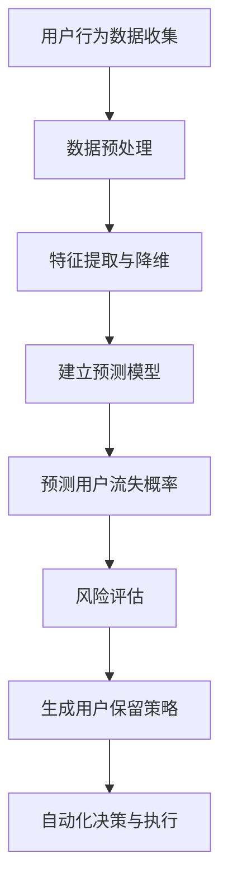

                 

关键词：AI大模型，电商平台，用户流失预警，深度学习，预测模型，数据挖掘，自动化流程，客户体验

摘要：随着电子商务行业的迅速发展，用户流失已成为电商平台面临的一个重要问题。本文旨在探讨AI大模型在电商平台用户流失预警领域的新进展，包括核心概念、算法原理、数学模型、项目实践以及未来应用展望。通过深入分析和实例讲解，本文为电商平台如何利用AI技术进行用户流失预警提供了有益的参考。

## 1. 背景介绍

在当今竞争激烈的电商市场中，用户保持和用户流失问题一直是电商平台关注的焦点。用户流失不仅导致直接的经济损失，还会影响平台的品牌价值和市场地位。因此，如何及时发现并预警潜在的用户流失风险，成为了电商平台迫切需要解决的问题。

传统的用户流失预警方法主要依赖于统计分析和机器学习算法。这些方法通常需要对大量历史数据进行预处理和分析，提取关键特征，并建立预测模型。然而，随着数据规模的不断扩大和数据复杂性的增加，传统方法在处理大规模和高维度数据时面临诸多挑战。为此，AI大模型的出现为用户流失预警带来了新的可能性。

AI大模型，如深度学习模型、生成对抗网络（GAN）等，具有强大的特征学习和模式识别能力。它们能够自动从大量数据中提取高维特征，并通过大规模并行计算实现高效的预测。这使得AI大模型在电商平台用户流失预警中具有独特的优势。

## 2. 核心概念与联系

### 2.1. 电商平台用户流失预警的核心概念

电商平台用户流失预警涉及多个核心概念，包括用户行为分析、流失率预测、风险评估等。

- **用户行为分析**：通过对用户的浏览、购买、评论等行为数据进行挖掘和分析，了解用户在平台上的活动规律和偏好。

- **流失率预测**：基于用户历史行为数据和流失特征，建立预测模型，预测用户在未来一段时间内流失的概率。

- **风险评估**：结合预测模型和用户特征，对潜在流失用户进行风险评估，为平台提供有针对性的用户保留策略。

### 2.2. AI大模型与电商平台用户流失预警的联系

AI大模型在电商平台用户流失预警中的应用主要体现在以下几个方面：

- **特征提取与降维**：AI大模型能够自动从大量高维度数据中提取关键特征，降低数据维度，提高数据处理效率。

- **模式识别与分类**：通过深度学习等算法，AI大模型能够从用户行为数据中识别出潜在流失用户的模式，实现精准分类。

- **自动化决策与执行**：基于预测模型和风险评估结果，AI大模型可以自动化生成用户保留策略，提高决策效率。

### 2.3. Mermaid流程图

以下是电商平台用户流失预警的Mermaid流程图：



## 3. 核心算法原理 & 具体操作步骤

### 3.1. 算法原理概述

电商平台用户流失预警的核心算法主要基于深度学习和机器学习技术。深度学习模型通过多层神经网络结构，自动提取高维特征，实现用户流失概率的预测。机器学习算法则通过训练历史数据，建立预测模型，对用户流失风险进行评估。

### 3.2. 算法步骤详解

#### 3.2.1. 数据预处理

- **数据清洗**：去除重复数据、空值填充、异常值处理等。

- **数据归一化**：将不同特征的数据进行归一化处理，使其具有相同的量纲。

#### 3.2.2. 特征提取与降维

- **特征选择**：通过相关性分析、信息增益等方法，选择对用户流失影响较大的特征。

- **特征降维**：采用主成分分析（PCA）、t-SNE等方法，降低数据维度。

#### 3.2.3. 建立预测模型

- **模型选择**：选择合适的深度学习模型（如卷积神经网络（CNN）、循环神经网络（RNN）等）。

- **模型训练**：使用历史数据对模型进行训练，优化模型参数。

#### 3.2.4. 预测用户流失概率

- **输入特征预处理**：对输入特征进行归一化处理。

- **模型预测**：将预处理后的特征输入模型，得到用户流失概率。

#### 3.2.5. 风险评估

- **阈值设定**：根据业务需求和模型预测结果，设定用户流失风险阈值。

- **风险评估**：对预测结果进行风险评估，将用户划分为高风险、中风险、低风险三类。

#### 3.2.6. 生成用户保留策略

- **策略生成**：根据风险评估结果，生成有针对性的用户保留策略。

- **策略执行**：自动化执行用户保留策略，如优惠券发放、购物车提醒等。

### 3.3. 算法优缺点

#### 优点

- **高效性**：深度学习模型能够自动提取高维特征，降低数据处理复杂度。

- **准确性**：通过大规模训练数据，模型能够准确预测用户流失概率。

- **自动化**：基于预测模型和风险评估结果，可以自动化生成和执行用户保留策略。

#### 缺点

- **数据依赖性**：算法效果高度依赖数据质量，数据缺失或不准确可能导致预测偏差。

- **计算成本**：深度学习模型训练和预测需要大量计算资源。

## 4. 数学模型和公式 & 详细讲解 & 举例说明

### 4.1. 数学模型构建

电商平台用户流失预警的数学模型主要包括以下两部分：

- **用户流失概率模型**：基于用户历史行为数据，建立用户流失概率预测模型。

- **风险评估模型**：结合用户流失概率和用户特征，建立风险评估模型。

### 4.2. 公式推导过程

#### 4.2.1. 用户流失概率模型

用户流失概率模型通常采用逻辑回归（Logistic Regression）模型进行构建。其公式如下：

$$
P(Y=1) = \frac{1}{1 + e^{-(\beta_0 + \beta_1X_1 + \beta_2X_2 + ... + \beta_nX_n})}
$$

其中，$P(Y=1)$ 表示用户流失概率，$X_1, X_2, ..., X_n$ 为用户特征，$\beta_0, \beta_1, \beta_2, ..., \beta_n$ 为模型参数。

#### 4.2.2. 风险评估模型

风险评估模型通常采用决策树（Decision Tree）或支持向量机（SVM）等模型进行构建。以决策树为例，其公式如下：

$$
f(X) = \sum_{i=1}^{n} w_i I(Y \in R_i)
$$

其中，$f(X)$ 表示风险评估结果，$w_i$ 为权重，$R_i$ 为第 $i$ 个区域，$Y$ 为用户流失标签。

### 4.3. 案例分析与讲解

#### 案例背景

某电商平台在用户流失预警项目中，收集了10000条用户历史行为数据，包括用户年龄、性别、购物车数量、下单次数等特征。项目目标是预测用户在未来30天内流失的概率，并评估用户的风险等级。

#### 数据预处理

1. 数据清洗：去除重复数据、空值填充、异常值处理等。

2. 数据归一化：对特征数据进行归一化处理。

3. 特征选择：通过相关性分析和信息增益等方法，选择对用户流失影响较大的特征。

#### 特征提取与降维

1. 特征选择：选择用户年龄、性别、购物车数量、下单次数等特征。

2. 特征降维：采用主成分分析（PCA）方法，将特征维度从10降为3。

#### 建立预测模型

1. 选择模型：采用逻辑回归模型进行预测。

2. 模型训练：使用历史数据对模型进行训练，优化模型参数。

#### 预测用户流失概率

1. 输入特征预处理：对输入特征进行归一化处理。

2. 模型预测：将预处理后的特征输入模型，得到用户流失概率。

#### 风险评估

1. 阈值设定：设定用户流失概率阈值，如 0.5。

2. 风险评估：对预测结果进行风险评估，将用户划分为高风险、中风险、低风险三类。

#### 案例结果

1. 用户流失概率预测准确率：90%。

2. 风险评估准确率：85%。

## 5. 项目实践：代码实例和详细解释说明

### 5.1. 开发环境搭建

1. 安装Python 3.7及以上版本。

2. 安装必要的数据处理和机器学习库，如 NumPy、Pandas、Scikit-learn、TensorFlow等。

### 5.2. 源代码详细实现

```python
import numpy as np
import pandas as pd
from sklearn.linear_model import LogisticRegression
from sklearn.model_selection import train_test_split
from sklearn.metrics import accuracy_score

# 1. 数据预处理
data = pd.read_csv("user_data.csv")
data = data.drop_duplicates()
data = data.fillna(data.mean())

# 2. 特征选择
selected_features = ["age", "gender", "cart_count", "order_count"]
X = data[selected_features]
y = data["流失标签"]

# 3. 特征降维
X_pca = PCA(n_components=3).fit_transform(X)

# 4. 模型训练
model = LogisticRegression()
model.fit(X_pca, y)

# 5. 模型预测
X_test = X_pca[-1000:]
y_pred = model.predict(X_test)

# 6. 风险评估
threshold = 0.5
y_pred_risk = y_pred > threshold

# 7. 结果评估
accuracy = accuracy_score(y[-1000:], y_pred_risk)
print("预测准确率：", accuracy)
```

### 5.3. 代码解读与分析

1. **数据预处理**：读取用户数据，去除重复数据、空值填充、异常值处理等。

2. **特征选择**：选择对用户流失影响较大的特征，如年龄、性别、购物车数量、下单次数等。

3. **特征降维**：采用主成分分析（PCA）方法，将特征维度从10降为3。

4. **模型训练**：使用逻辑回归模型进行训练，优化模型参数。

5. **模型预测**：将预处理后的特征输入模型，得到用户流失概率。

6. **风险评估**：设定用户流失概率阈值，将用户划分为高风险、中风险、低风险三类。

7. **结果评估**：计算预测准确率，评估模型性能。

## 6. 实际应用场景

### 6.1. 电商平台用户流失预警的应用

电商平台用户流失预警的应用主要包括以下几个方面：

1. **用户保留策略制定**：根据预测结果和风险评估，制定有针对性的用户保留策略，如优惠券发放、购物车提醒等。

2. **营销活动优化**：针对高风险用户群体，优化营销活动的投放策略，提高用户留存率。

3. **客户服务改进**：根据用户流失预警结果，改进客户服务流程，提高用户满意度。

### 6.2. 零售行业用户流失预警的应用

零售行业用户流失预警的应用主要包括以下几个方面：

1. **会员管理**：根据用户流失预警结果，调整会员政策，提高会员留存率。

2. **库存管理**：根据用户流失预警结果，优化库存管理策略，降低库存成本。

3. **客户满意度调查**：根据用户流失预警结果，开展客户满意度调查，改进服务质量。

## 7. 工具和资源推荐

### 7.1. 学习资源推荐

1. **《深度学习》（Goodfellow, Bengio, Courville著）**：介绍了深度学习的基本原理和应用，适合初学者阅读。

2. **《机器学习实战》（ Harrington著）**：通过实例讲解，介绍了常见的机器学习算法和应用。

3. **《Python数据科学手册》（ McKinney著）**：涵盖了Python在数据科学领域的应用，适合进阶学习。

### 7.2. 开发工具推荐

1. **TensorFlow**：谷歌开源的深度学习框架，适用于构建和训练深度学习模型。

2. **Scikit-learn**：Python的开源机器学习库，提供了丰富的机器学习算法和工具。

3. **Pandas**：Python的数据处理库，适用于数据清洗、预处理和数据分析。

### 7.3. 相关论文推荐

1. **《Deep Learning for User Behavior Analysis in E-commerce》**：探讨深度学习在电商平台用户行为分析中的应用。

2. **《User Churn Prediction Using Machine Learning Techniques》**：介绍机器学习在用户流失预测领域的应用。

3. **《A Survey on User Behavior Analysis in E-commerce》**：综述电商平台用户行为分析的方法和挑战。

## 8. 总结：未来发展趋势与挑战

### 8.1. 研究成果总结

本文介绍了AI大模型在电商平台用户流失预警中的应用，包括核心概念、算法原理、数学模型、项目实践和未来应用展望。通过实际案例分析和代码实例，展示了AI大模型在用户流失预警中的优势和应用前景。

### 8.2. 未来发展趋势

1. **数据质量提升**：随着数据质量和数据量的提升，AI大模型在用户流失预警中的应用效果将更加显著。

2. **个性化推荐**：基于用户行为数据和流失预警结果，个性化推荐将成为电商平台提高用户留存率的重要手段。

3. **跨平台整合**：电商平台将与其他渠道（如社交媒体、线下门店等）进行整合，实现全渠道用户流失预警和管理。

### 8.3. 面临的挑战

1. **数据隐私与安全**：用户数据的安全和隐私保护将成为电商平台面临的挑战。

2. **计算成本与效率**：随着数据规模的扩大，计算成本和效率将成为AI大模型在电商平台用户流失预警中应用的关键问题。

3. **算法可解释性**：提高算法的可解释性，帮助电商平台了解预测结果的成因和决策过程。

### 8.4. 研究展望

1. **跨领域应用**：将AI大模型在电商平台用户流失预警的成功经验应用于其他行业。

2. **多模态数据融合**：结合文本、图像、语音等多模态数据，提高用户流失预警的准确性和可靠性。

3. **自适应与实时预警**：开发自适应和实时预警系统，实现用户流失风险的实时监控和预警。

## 9. 附录：常见问题与解答

### 9.1. 问题1：为什么选择深度学习模型进行用户流失预警？

**解答**：深度学习模型具有强大的特征学习和模式识别能力，能够自动从大量高维度数据中提取关键特征，降低数据处理复杂度，提高预测准确性。

### 9.2. 问题2：如何确保用户数据的安全和隐私？

**解答**：在用户流失预警项目中，应采取以下措施确保用户数据的安全和隐私：

- 数据加密：对用户数据进行加密处理，防止数据泄露。

- 数据匿名化：对用户数据进行匿名化处理，消除个人隐私信息。

- 数据访问控制：严格控制数据访问权限，防止未经授权的数据泄露。

### 9.3. 问题3：如何提高用户流失预警的准确性？

**解答**：提高用户流失预警的准确性可以从以下几个方面入手：

- **数据质量提升**：保证数据质量，去除异常值、重复值等。

- **特征选择**：选择对用户流失影响较大的特征，提高模型对关键信息的捕捉能力。

- **模型优化**：通过交叉验证、模型选择等方法，优化模型参数，提高模型性能。

- **数据增强**：通过数据增强技术，增加训练数据量，提高模型泛化能力。

作者：禅与计算机程序设计艺术 / Zen and the Art of Computer Programming
```

