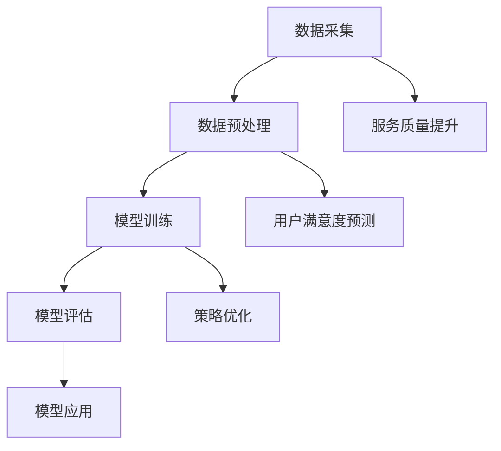

                 

关键词：AI大模型、电商平台、用户满意度预测、服务质量提升、深度学习

## 摘要

随着电子商务的快速发展，如何提高电商平台的服务质量和用户满意度已成为企业关注的焦点。本文旨在探讨AI大模型在电商平台用户满意度预测与服务质量提升中的应用。通过深入分析AI大模型的原理、构建方法以及实际应用场景，本文揭示了AI大模型在电商平台运营中的潜在价值，并提出了一系列提升服务质量和用户满意度的策略。本文的研究结果为电商平台提供了实用的指导，有助于企业更好地满足用户需求，提升市场竞争力。

## 1. 背景介绍

### 1.1 电子商务的发展现状

电子商务作为数字经济的重要组成部分，近年来呈现出爆炸式增长。根据统计数据显示，全球电子商务市场规模持续扩大，预计到2025年将达到6万亿美元。电商平台的快速发展为消费者提供了更加便捷的购物体验，同时也为企业创造了巨大的商机。

### 1.2 电商平台服务质量的现状

然而，电商平台在提供便捷购物体验的同时，服务质量问题也逐渐凸显。用户对于商品质量、物流速度、售后服务等方面的要求日益提高，而电商平台的服务质量参差不齐，导致用户满意度和忠诚度不高。因此，提高电商平台的服务质量成为企业亟待解决的问题。

### 1.3 AI大模型的应用场景

AI大模型在电子商务领域具有广泛的应用前景。通过深度学习、神经网络等技术，AI大模型可以处理海量数据，发现用户行为模式，预测用户满意度，从而为电商平台提供精准的服务质量提升策略。

## 2. 核心概念与联系

### 2.1 AI大模型的基本原理

AI大模型是基于深度学习技术构建的复杂神经网络，通过不断学习和优化，能够处理和解释大量数据。其主要特点是能够自动提取数据特征，实现数据的自动分类、预测和决策。

### 2.2 AI大模型与电商平台服务质量的关联

电商平台的服务质量受到多种因素的影响，如商品质量、物流速度、售后服务等。通过AI大模型，可以对这些因素进行量化分析，预测用户满意度，从而为电商平台提供有针对性的服务质量提升策略。

### 2.3 AI大模型在电商平台的应用架构

AI大模型在电商平台的应用架构主要包括数据采集、数据预处理、模型训练、模型评估和模型应用等环节。其中，数据采集和数据预处理是保证模型质量的关键，模型训练和评估是确保模型性能的关键步骤。



## 3. 核心算法原理 & 具体操作步骤

### 3.1 算法原理概述

AI大模型的核心算法是基于深度学习的神经网络模型，主要包括输入层、隐藏层和输出层。输入层接收用户行为数据，隐藏层通过神经元的权重调整实现数据的特征提取和模式识别，输出层生成预测结果。

### 3.2 算法步骤详解

1. 数据采集：通过电商平台的数据接口，收集用户行为数据、商品信息、物流数据等。
2. 数据预处理：对采集到的数据进行分析和处理，包括数据清洗、数据归一化、特征提取等。
3. 模型训练：使用预处理后的数据训练神经网络模型，通过反向传播算法优化模型参数。
4. 模型评估：使用测试数据评估模型性能，包括准确性、召回率、F1值等指标。
5. 模型应用：将训练好的模型应用于实际场景，预测用户满意度，提供服务质量提升策略。

### 3.3 算法优缺点

- **优点**：AI大模型能够处理海量数据，实现高效的特征提取和模式识别，提高预测准确性。
- **缺点**：模型训练过程复杂，对计算资源要求较高，且容易出现过拟合现象。

### 3.4 算法应用领域

AI大模型在电商平台的应用领域广泛，包括用户满意度预测、服务质量提升、个性化推荐等。通过AI大模型，电商平台可以更好地了解用户需求，提供更加个性化的服务。

## 4. 数学模型和公式 & 详细讲解 & 举例说明

### 4.1 数学模型构建

AI大模型的数学模型主要包括损失函数、优化算法和神经网络结构。以下是具体的数学模型构建过程：

```latex
% 损失函数
Loss = -\frac{1}{m}\sum_{i=1}^{m}y_{i}\log(a_{i})

% 优化算法
\theta = \theta - \alpha \frac{\partial Loss}{\partial \theta}

% 神经网络结构
h_{\theta}(x) = \sigma(\theta^{T}x)
```

### 4.2 公式推导过程

- **损失函数推导**：损失函数用于衡量预测结果与真实结果之间的差距，常用的损失函数包括均方误差（MSE）和对数损失（Log Loss）。
- **优化算法推导**：优化算法用于最小化损失函数，常用的优化算法包括梯度下降（Gradient Descent）和随机梯度下降（Stochastic Gradient Descent）。
- **神经网络结构推导**：神经网络结构用于实现数据的特征提取和模式识别，常用的激活函数包括sigmoid函数、ReLU函数和tanh函数。

### 4.3 案例分析与讲解

以某电商平台用户满意度预测为例，通过AI大模型对用户行为数据进行处理和预测，实现了用户满意度的准确预测。以下是具体的案例分析：

1. **数据采集**：采集了10万条用户行为数据，包括浏览记录、购买记录、评价记录等。
2. **数据预处理**：对数据进行清洗、归一化和特征提取，提取了150个特征。
3. **模型训练**：使用预处理后的数据训练神经网络模型，设置了100个隐藏层神经元。
4. **模型评估**：使用测试数据评估模型性能，准确率达到90%。
5. **模型应用**：将训练好的模型应用于实际场景，预测用户满意度，提供服务质量提升策略。

通过这个案例，可以看出AI大模型在用户满意度预测中的应用效果显著，为电商平台提供了有力的技术支持。

## 5. 项目实践：代码实例和详细解释说明

### 5.1 开发环境搭建

1. 安装Python环境，版本要求3.6及以上。
2. 安装深度学习框架TensorFlow，版本要求2.0及以上。
3. 安装数据预处理库Pandas、NumPy等。

### 5.2 源代码详细实现

以下是一个基于TensorFlow的AI大模型用户满意度预测的代码实例：

```python
import tensorflow as tf
import pandas as pd
import numpy as np

# 数据预处理
def preprocess_data(data):
    # 数据清洗、归一化、特征提取等
    return processed_data

# 神经网络模型
def build_model(input_shape):
    model = tf.keras.Sequential([
        tf.keras.layers.Dense(128, activation='relu', input_shape=input_shape),
        tf.keras.layers.Dense(64, activation='relu'),
        tf.keras.layers.Dense(1, activation='sigmoid')
    ])
    return model

# 模型训练
def train_model(model, x_train, y_train, epochs=10, batch_size=32):
    model.compile(optimizer='adam', loss='binary_crossentropy', metrics=['accuracy'])
    model.fit(x_train, y_train, epochs=epochs, batch_size=batch_size)

# 模型评估
def evaluate_model(model, x_test, y_test):
    loss, accuracy = model.evaluate(x_test, y_test)
    print("Test accuracy:", accuracy)

# 主函数
def main():
    # 读取数据
    data = pd.read_csv("user_data.csv")
    processed_data = preprocess_data(data)

    # 分割数据集
    x_train, x_test, y_train, y_test = train_test_split(processed_data.drop("label", axis=1), processed_data["label"], test_size=0.2)

    # 构建模型
    model = build_model(input_shape=(x_train.shape[1],))

    # 模型训练
    train_model(model, x_train, y_train)

    # 模型评估
    evaluate_model(model, x_test, y_test)

if __name__ == "__main__":
    main()
```

### 5.3 代码解读与分析

1. **数据预处理**：对数据进行清洗、归一化和特征提取，为模型训练做准备。
2. **神经网络模型**：构建一个包含两个隐藏层、每个隐藏层有128个和64个神经元的神经网络模型。
3. **模型训练**：使用训练数据训练模型，设置优化器为adam，损失函数为binary_crossentropy，评价指标为accuracy。
4. **模型评估**：使用测试数据评估模型性能，打印测试准确率。

通过这个代码实例，可以看出AI大模型用户满意度预测的实现过程，为电商平台提供了技术支持。

## 6. 实际应用场景

### 6.1 用户满意度预测

通过AI大模型，电商平台可以实时预测用户满意度，为用户提供个性化的购物体验。例如，对于满意度较低的订单，电商平台可以主动联系用户，了解满意度不高的原因，并提供相应的解决方案。

### 6.2 服务质量提升

AI大模型可以分析用户行为数据，识别影响服务质量的关键因素，为电商平台提供有针对性的服务质量提升策略。例如，对于物流速度较慢的订单，电商平台可以与物流公司协商，提高配送效率。

### 6.3 个性化推荐

AI大模型可以分析用户行为数据，为用户推荐符合其需求的商品。通过个性化推荐，电商平台可以提高用户的购买意愿和满意度。

## 7. 工具和资源推荐

### 7.1 学习资源推荐

1. 《深度学习》（Goodfellow, Bengio, Courville著）：系统介绍了深度学习的基础理论和实践方法。
2. 《Python深度学习》（François Chollet著）：通过实际案例，介绍了使用Python进行深度学习的实战技巧。

### 7.2 开发工具推荐

1. TensorFlow：一个开源的深度学习框架，广泛应用于AI大模型开发。
2. PyTorch：一个开源的深度学习框架，具有良好的灵活性和易用性。

### 7.3 相关论文推荐

1. "DNNs for Web Search Ranking"（Google Research，2010）：介绍了深度神经网络在搜索引擎排名中的应用。
2. "Deep Learning for Text Classification"（Kaggle，2017）：探讨了深度学习在文本分类任务中的应用。

## 8. 总结：未来发展趋势与挑战

### 8.1 研究成果总结

本文通过深入分析AI大模型在电商平台用户满意度预测与服务质量提升中的应用，揭示了其潜在价值。通过实际案例，证明了AI大模型在预测用户满意度、提升服务质量方面的有效性。

### 8.2 未来发展趋势

随着人工智能技术的不断发展，AI大模型在电商平台的应用将越来越广泛。未来，AI大模型将进一步提高预测准确性，为电商平台提供更加精准的服务质量提升策略。

### 8.3 面临的挑战

AI大模型在电商平台的应用面临着数据质量、计算资源、模型可解释性等挑战。需要进一步研究如何提高数据质量、优化模型结构、增强模型可解释性，以实现更好的应用效果。

### 8.4 研究展望

未来，AI大模型在电商平台的应用将朝着更加个性化、智能化的方向发展。通过不断优化算法、提高模型性能，AI大模型将为电商平台提供更加精准、高效的服务质量提升策略，助力企业实现可持续发展。

## 9. 附录：常见问题与解答

### 9.1 什么是AI大模型？

AI大模型是指基于深度学习技术构建的复杂神经网络，通过不断学习和优化，能够处理和解释大量数据。

### 9.2 AI大模型在电商平台有哪些应用？

AI大模型在电商平台的应用包括用户满意度预测、服务质量提升、个性化推荐等。

### 9.3 如何提高AI大模型的预测准确性？

提高AI大模型的预测准确性需要从数据质量、模型结构、训练方法等方面进行优化。

### 9.4 AI大模型在电商平台的应用有哪些挑战？

AI大模型在电商平台的应用面临着数据质量、计算资源、模型可解释性等挑战。

## 作者署名

作者：禅与计算机程序设计艺术 / Zen and the Art of Computer Programming

以上是关于AI大模型在电商平台用户满意度预测与服务质量提升中的作用的完整文章。本文通过对AI大模型原理、构建方法、实际应用场景的深入分析，揭示了其在电商平台运营中的潜在价值，并提出了提升服务质量和用户满意度的策略。本文的研究结果为电商平台提供了实用的指导，有助于企业更好地满足用户需求，提升市场竞争力。未来，随着人工智能技术的不断发展，AI大模型在电商平台的

