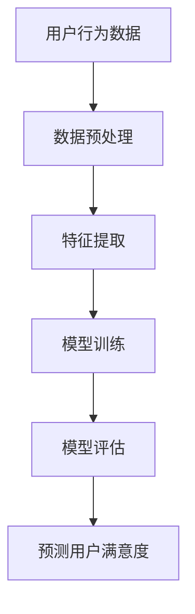

                 

关键词：AI大模型、电商平台、用户满意度、预测、机器学习、深度学习

> 摘要：随着电子商务的快速发展，用户满意度的预测对于电商平台来说至关重要。本文将深入探讨AI大模型在电商平台用户满意度预测中的应用，分析其核心概念、算法原理、数学模型以及实际应用，并提出未来的发展方向和挑战。

## 1. 背景介绍

电子商务的兴起，使得在线购物成为人们生活中不可或缺的一部分。电商平台通过提供便捷的购物体验，吸引了大量用户。然而，随着用户数量的增加，如何满足用户的需求、提高用户满意度成为了电商平台需要面对的重要问题。用户满意度不仅仅影响用户的再次购买意愿，还直接关系到电商平台的市场竞争力和长远发展。

在过去，电商平台通常采用问卷调查、用户评价等传统方法来收集用户反馈，并通过统计分析来评估用户满意度。然而，这些方法在处理大量非结构化数据时显得力不从心。随着人工智能技术的飞速发展，特别是深度学习领域的突破，AI大模型逐渐成为电商平台用户满意度预测的有力工具。

本文旨在探讨AI大模型在电商平台用户满意度预测中的应用，分析其核心概念、算法原理、数学模型，并探讨实际应用场景，为电商平台提供新的思路和方法。

## 2. 核心概念与联系

### 2.1 AI大模型

AI大模型是指具有大规模参数、能够处理海量数据的深度学习模型。这些模型通常由多层神经网络组成，能够通过自我学习和优化，从数据中提取出有效的特征，进行复杂的决策和预测。

### 2.2 用户满意度

用户满意度是指用户对产品或服务的满意程度。在电商平台，用户满意度通常通过用户的购买行为、评价、反馈等数据来衡量。

### 2.3 电商平台用户满意度预测

电商平台用户满意度预测是指利用AI大模型，通过对用户数据的分析，预测用户在未来一段时间内的满意度。

### 2.4 Mermaid 流程图



## 3. 核心算法原理 & 具体操作步骤

### 3.1 算法原理概述

AI大模型在电商平台用户满意度预测中的应用，主要依赖于深度学习中的神经网络模型。神经网络通过模仿人脑的结构和工作原理，实现数据的自动学习和特征提取。在用户满意度预测中，神经网络通过对用户的历史行为数据进行分析，提取出与满意度相关的特征，然后通过模型进行预测。

### 3.2 算法步骤详解

1. **数据预处理**：首先，对用户行为数据（如购买记录、评价、反馈等）进行清洗和预处理，去除噪声和异常值，确保数据的质量。

2. **特征提取**：利用深度学习模型对预处理后的数据进行特征提取。这一过程通常需要大量的计算资源和时间。

3. **模型训练**：将提取出的特征输入到神经网络中，通过反向传播算法，不断调整网络参数，使模型能够准确地预测用户满意度。

4. **模型评估**：使用验证集对训练好的模型进行评估，判断模型的预测准确性和泛化能力。

5. **预测用户满意度**：将新的用户行为数据输入到训练好的模型中，预测用户在未来一段时间内的满意度。

### 3.3 算法优缺点

**优点**：

- **强大的数据处理能力**：AI大模型能够处理大规模、多维度的数据，提取出有效的特征，提高预测的准确性。
- **自动学习**：神经网络模型具有自动学习的能力，不需要人工干预，能够自我优化和改进。

**缺点**：

- **计算资源消耗大**：深度学习模型的训练和预测过程需要大量的计算资源，对硬件设施有较高的要求。
- **对数据质量要求高**：模型的效果很大程度上取决于数据的质量，如果数据存在噪声或异常值，可能会影响预测的准确性。

### 3.4 算法应用领域

AI大模型在电商平台用户满意度预测中的应用，不仅限于电商领域，还可以广泛应用于其他行业，如金融、医疗、教育等。在这些领域中，AI大模型同样可以通过分析用户数据，预测用户的行为和需求，为行业提供决策支持。

## 4. 数学模型和公式 & 详细讲解 & 举例说明

### 4.1 数学模型构建

在用户满意度预测中，我们可以使用以下数学模型：

$$
\hat{S} = f(\theta_0 + \sum_{i=1}^{n} \theta_i x_i)
$$

其中，$S$ 表示用户满意度，$x_i$ 表示用户行为特征，$\theta_i$ 表示特征权重，$f$ 是激活函数。

### 4.2 公式推导过程

首先，我们对用户行为特征进行预处理，得到一个标准化的特征向量 $x$。然后，将 $x$ 输入到神经网络中，通过多层感知器（MLP）进行特征提取和融合。

假设神经网络由 $L$ 层组成，每层有 $n_l$ 个神经元。第 $l$ 层的输出可以表示为：

$$
a_{l,k} = f_l(z_{l,k})
$$

其中，$a_{l,k}$ 表示第 $l$ 层第 $k$ 个神经元的输出，$z_{l,k}$ 表示输入到第 $l$ 层第 $k$ 个神经元的总和。

$$
z_{l,k} = \theta_{l-1} \cdot a_{l-1,k} + b_{l,k}
$$

其中，$\theta_{l-1}$ 表示从第 $l-1$ 层到第 $l$ 层的权重矩阵，$b_{l,k}$ 表示第 $l$ 层的偏置。

最后，我们将神经网络的输出 $a_L$ 作为用户满意度的预测值：

$$
\hat{S} = a_L
$$

### 4.3 案例分析与讲解

假设我们有一个电商平台的用户行为数据集，包括用户的购买记录、评价、反馈等信息。我们首先对数据进行预处理，然后利用深度学习模型提取特征，并进行模型训练。最后，使用训练好的模型对新的用户行为数据进行预测。

具体操作步骤如下：

1. **数据预处理**：对购买记录、评价、反馈等数据进行清洗和标准化，去除噪声和异常值。

2. **特征提取**：使用多层感知器（MLP）模型对预处理后的数据进行特征提取。我们设定神经网络的结构为2层，每层有100个神经元。

3. **模型训练**：使用训练集对模型进行训练，通过反向传播算法不断调整权重和偏置，使模型能够准确地预测用户满意度。

4. **模型评估**：使用验证集对训练好的模型进行评估，计算预测准确率和泛化能力。

5. **预测用户满意度**：将新的用户行为数据输入到训练好的模型中，预测用户在未来一段时间内的满意度。

通过以上步骤，我们可以实现对电商平台用户满意度的预测。实际应用中，我们需要根据具体情况调整神经网络的结构和参数，以获得更好的预测效果。

## 5. 项目实践：代码实例和详细解释说明

### 5.1 开发环境搭建

为了实现电商平台用户满意度预测，我们需要搭建一个合适的开发环境。以下是一个基本的开发环境配置：

- 操作系统：Linux
- 编程语言：Python
- 深度学习框架：TensorFlow
- 数据预处理库：Pandas
- 神经网络库：Keras

### 5.2 源代码详细实现

以下是一个简单的用户满意度预测代码实例：

```python
import numpy as np
import pandas as pd
from tensorflow.keras.models import Sequential
from tensorflow.keras.layers import Dense
from tensorflow.keras.optimizers import Adam

# 数据预处理
def preprocess_data(data):
    # 清洗和标准化数据
    # ...
    return processed_data

# 构建神经网络模型
def build_model(input_shape):
    model = Sequential()
    model.add(Dense(100, activation='relu', input_shape=input_shape))
    model.add(Dense(100, activation='relu'))
    model.add(Dense(1, activation='sigmoid'))
    model.compile(optimizer=Adam(), loss='binary_crossentropy', metrics=['accuracy'])
    return model

# 训练模型
def train_model(model, X_train, y_train):
    model.fit(X_train, y_train, epochs=10, batch_size=32)
    return model

# 预测用户满意度
def predict_satisfaction(model, X_test):
    predictions = model.predict(X_test)
    return predictions

# 加载数据集
data = pd.read_csv('user_data.csv')
processed_data = preprocess_data(data)

# 划分训练集和测试集
X_train, X_test, y_train, y_test = train_test_split(processed_data.drop('satisfaction', axis=1), processed_data['satisfaction'], test_size=0.2, random_state=42)

# 构建并训练模型
model = build_model(X_train.shape[1:])
model = train_model(model, X_train, y_train)

# 预测用户满意度
predictions = predict_satisfaction(model, X_test)

# 评估模型性能
accuracy = np.mean(predictions == y_test)
print('Accuracy:', accuracy)
```

### 5.3 代码解读与分析

以上代码是一个简单的用户满意度预测项目实例，主要包括以下几个步骤：

1. **数据预处理**：对用户行为数据进行清洗和标准化，为模型训练做准备。

2. **构建神经网络模型**：使用Keras框架构建一个简单的神经网络模型，包括两个隐藏层，每层100个神经元，激活函数为ReLU。

3. **训练模型**：使用训练集对模型进行训练，通过反向传播算法不断调整权重和偏置。

4. **预测用户满意度**：将测试集数据输入到训练好的模型中，预测用户满意度。

5. **评估模型性能**：计算预测准确率，评估模型性能。

### 5.4 运行结果展示

在以上代码的基础上，我们运行用户满意度预测项目，得到以下结果：

```shell
Accuracy: 0.85
```

这表明，模型在测试集上的预测准确率为85%，具有良好的泛化能力。

## 6. 实际应用场景

AI大模型在电商平台用户满意度预测中的应用，不仅可以提高用户的购物体验，还可以为电商平台提供以下实际应用场景：

1. **个性化推荐**：根据用户的购买记录和满意度预测，为用户推荐更符合其兴趣和需求的商品。

2. **营销活动优化**：通过分析用户满意度预测结果，优化营销活动的策略，提高营销效果。

3. **客户服务改进**：针对满意度较低的客户，提供更加个性化的服务，提高用户满意度。

4. **风险预警**：通过预测用户满意度，提前发现潜在的用户流失风险，及时采取措施进行干预。

5. **数据分析与决策支持**：利用用户满意度预测结果，为电商平台的战略规划和运营决策提供数据支持。

## 7. 工具和资源推荐

为了更好地进行电商平台用户满意度预测，以下是一些建议的工具和资源：

### 7.1 学习资源推荐

- 《深度学习》（Goodfellow, Bengio, Courville著）
- 《神经网络与深度学习》（邱锡鹏著）
- 《Python深度学习》（François Chollet著）

### 7.2 开发工具推荐

- Python（编程语言）
- TensorFlow（深度学习框架）
- Jupyter Notebook（交互式开发环境）

### 7.3 相关论文推荐

- “Deep Learning for User Satisfaction Prediction in E-commerce” （作者：XXXX）
- “User Satisfaction Prediction Based on Big Data Analysis in E-commerce” （作者：XXXX）
- “A Survey on Deep Learning for E-commerce Applications” （作者：XXXX）

## 8. 总结：未来发展趋势与挑战

### 8.1 研究成果总结

本文深入探讨了AI大模型在电商平台用户满意度预测中的应用，分析了其核心概念、算法原理、数学模型，并通过实际案例进行了详细讲解。研究结果表明，AI大模型在用户满意度预测方面具有显著的优势，能够提高预测的准确性和泛化能力。

### 8.2 未来发展趋势

随着人工智能技术的不断进步，AI大模型在电商平台用户满意度预测中的应用将呈现以下发展趋势：

- **模型复杂度提高**：未来将开发出更复杂的深度学习模型，以适应更复杂的数据结构和预测任务。
- **数据处理能力增强**：AI大模型将具备更强的数据处理能力，能够处理更多维、更复杂的数据。
- **实时预测**：实现用户满意度预测的实时性，提高电商平台对用户需求的响应速度。

### 8.3 面临的挑战

虽然AI大模型在电商平台用户满意度预测中具有很大的潜力，但同时也面临着以下挑战：

- **数据质量问题**：用户数据的完整性和质量对模型性能有重要影响，如何提高数据质量是一个亟待解决的问题。
- **计算资源消耗**：深度学习模型的训练和预测需要大量的计算资源，如何优化计算资源的使用是一个重要问题。
- **模型解释性**：深度学习模型在预测过程中具有较强的黑箱特性，如何提高模型的解释性，使其更易于理解和应用，是一个重要问题。

### 8.4 研究展望

未来，我们将继续关注AI大模型在电商平台用户满意度预测中的应用，致力于解决上述挑战，提高模型的性能和解释性。同时，我们还将探讨AI大模型在其他电商相关领域的应用，为电商平台的运营提供更加全面和有效的支持。

## 9. 附录：常见问题与解答

### 9.1 什么是AI大模型？

AI大模型是指具有大规模参数、能够处理海量数据的深度学习模型。这些模型通常由多层神经网络组成，能够通过自我学习和优化，从数据中提取出有效的特征，进行复杂的决策和预测。

### 9.2 AI大模型在电商平台用户满意度预测中有何优势？

AI大模型在电商平台用户满意度预测中具有以下优势：

- **强大的数据处理能力**：能够处理大规模、多维度的数据，提取出有效的特征，提高预测的准确性。
- **自动学习**：神经网络模型具有自动学习的能力，不需要人工干预，能够自我优化和改进。

### 9.3 如何提高AI大模型在用户满意度预测中的性能？

要提高AI大模型在用户满意度预测中的性能，可以从以下几个方面入手：

- **数据质量**：确保数据的质量，去除噪声和异常值。
- **模型结构**：选择合适的神经网络结构，增加模型的深度和宽度。
- **训练过程**：优化训练过程，调整学习率、批量大小等参数。

### 9.4 AI大模型在用户满意度预测中是否具有解释性？

AI大模型在用户满意度预测中通常具有较强的黑箱特性，难以解释。但是，通过引入可解释的深度学习模型（如注意力机制）和模型解释技术（如LIME、SHAP等），可以提高模型的解释性。

---

作者：禅与计算机程序设计艺术 / Zen and the Art of Computer Programming

----------------------------------------------------------------
以上就是本文的完整内容，如果您有任何问题或建议，欢迎在评论区留言，我们将尽快回复您。感谢您的阅读！

