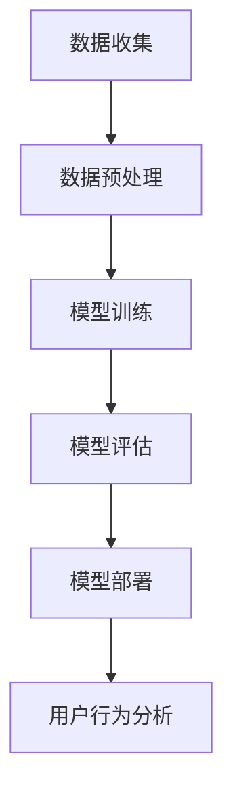

                 

## 1. 背景介绍

在当今数字化时代，电商平台已经成为消费者购买商品的主要渠道之一。随着电商行业的迅速发展，如何有效地分析用户行为，提升用户体验，成为各大电商平台亟待解决的问题。用户行为分析不仅可以帮助企业更好地了解消费者需求，还可以为企业提供精准的市场营销策略，提高销售转化率。

传统的用户行为分析方法主要依赖于统计模型和数据挖掘技术。然而，随着大数据和人工智能技术的兴起，大模型在用户行为分析中的应用变得越来越重要。大模型，尤其是基于深度学习的模型，能够从海量的用户数据中挖掘出更深层次的信息，为电商企业提供更准确的用户画像和行为预测。

本文将探讨AI大模型在电商平台用户行为分析中的应用，重点介绍大模型的基本原理、具体操作步骤、数学模型和公式推导、项目实践，以及未来应用展望。希望通过本文的探讨，能为电商平台的用户行为分析提供一些有益的思路和指导。

## 2. 核心概念与联系

在深入探讨AI大模型在用户行为分析中的应用之前，有必要先了解一些核心概念和它们之间的联系。

### 2.1 人工智能与机器学习

人工智能（AI）是指模拟人类智能的技术，主要包括计算机视觉、自然语言处理、语音识别等领域。而机器学习（ML）是人工智能的一个分支，它侧重于通过数据训练模型来模拟人类的学习能力。

在用户行为分析中，人工智能和机器学习技术可以用来处理大量的用户数据，从中提取有价值的信息。例如，通过机器学习算法，可以识别用户的购买习惯、偏好和需求，从而实现个性化推荐。

### 2.2 深度学习与神经网络

深度学习是机器学习的一个分支，它使用多层神经网络来模拟人类大脑的工作方式。深度学习在图像识别、语音识别和自然语言处理等领域取得了显著的成果。

在用户行为分析中，深度学习模型可以用于构建用户画像，通过分析用户的浏览历史、购物行为和评论内容等，生成详细的用户画像，帮助电商平台更好地了解用户。

### 2.3 大数据与数据挖掘

大数据是指规模庞大、类型多样的数据集合。数据挖掘是从这些数据中提取有价值信息的过程，它利用统计学、机器学习和人工智能等技术，发现数据中的模式和关联。

在用户行为分析中，大数据和数据挖掘技术可以帮助电商平台收集和整合用户数据，从中挖掘出用户的潜在需求和偏好，为企业提供精准的市场营销策略。

### 2.4 大模型

大模型通常是指规模庞大、参数众多的深度学习模型。这些模型能够处理海量的数据，并从中提取出更深层次的信息。

在用户行为分析中，大模型的应用可以显著提高分析的准确性和效果。例如，通过大模型，可以更准确地预测用户的购买行为，提供个性化的推荐。

### 2.5 Mermaid 流程图

为了更好地理解大模型在用户行为分析中的应用，我们可以使用Mermaid流程图来展示整个应用流程。以下是该流程图：



在上图中，A表示数据收集阶段，包括从各种渠道收集用户数据；B表示数据预处理阶段，主要是对原始数据进行清洗和格式化；C表示模型训练阶段，使用深度学习算法对数据进行训练；D表示模型评估阶段，通过测试数据对模型性能进行评估；E表示模型部署阶段，将训练好的模型部署到实际应用中；F表示用户行为分析阶段，利用部署好的模型对用户行为进行分析和预测。

## 3. 核心算法原理 & 具体操作步骤

### 3.1 算法原理概述

在用户行为分析中，大模型的核心算法主要是基于深度学习的神经网络模型。深度学习模型通过多层神经网络，将输入的数据映射到输出的结果。在用户行为分析中，输入数据可以是用户的浏览历史、购物行为、评论内容等，输出结果可以是用户的购买概率、推荐商品等。

深度学习模型的基本原理是通过反向传播算法，不断调整模型参数，使得模型的输出结果更接近真实值。在用户行为分析中，反向传播算法可以帮助模型从用户数据中学习到用户的偏好和需求。

### 3.2 算法步骤详解

#### 3.2.1 数据收集

数据收集是用户行为分析的基础。电商平台可以从多个渠道收集用户数据，包括用户的浏览历史、购物行为、评论内容、支付信息等。这些数据可以为模型提供丰富的输入信息。

#### 3.2.2 数据预处理

在收集到数据后，需要对数据进行预处理。数据预处理主要包括数据清洗、数据格式化和数据降维等步骤。数据清洗主要是去除数据中的噪声和错误，数据格式化主要是将数据转换为模型所需的格式，数据降维主要是减少数据的维度，提高模型的训练效率。

#### 3.2.3 模型训练

在完成数据预处理后，可以使用深度学习算法对数据进行训练。训练过程包括初始化模型参数、前向传播、计算损失函数、反向传播和更新模型参数等步骤。通过反复迭代训练，模型会逐渐学习到用户的偏好和需求。

#### 3.2.4 模型评估

在模型训练完成后，需要使用测试数据对模型进行评估。模型评估主要包括准确率、召回率、F1值等指标。通过评估，可以判断模型的效果是否满足要求。

#### 3.2.5 模型部署

评估通过后，可以将模型部署到实际应用中。模型部署主要包括将训练好的模型转换为可执行代码，部署到服务器或云端，以便进行用户行为分析和预测。

#### 3.2.6 用户行为分析

在模型部署后，可以使用模型对用户行为进行分析和预测。例如，可以预测用户的购买概率、推荐用户可能感兴趣的商品等。

### 3.3 算法优缺点

#### 优点

1. **强大的学习能力**：深度学习模型能够从大量的用户数据中学习到用户的偏好和需求，具有较强的学习能力。
2. **灵活的模型架构**：深度学习模型可以根据具体需求设计不同的网络结构，具有较强的灵活性。
3. **高效的计算能力**：随着硬件技术的发展，深度学习模型的计算能力得到了显著提升，可以处理海量的数据。

#### 缺点

1. **高计算资源需求**：深度学习模型通常需要大量的计算资源，对硬件设备要求较高。
2. **数据依赖性**：深度学习模型的效果很大程度上依赖于数据的质量和数量，数据不足或质量不佳可能导致模型效果不佳。
3. **模型解释性**：深度学习模型的内部结构较为复杂，模型的解释性相对较差，难以理解模型是如何做出预测的。

### 3.4 算法应用领域

深度学习算法在用户行为分析中具有广泛的应用。除了电商平台，深度学习算法还可以应用于以下领域：

1. **金融领域**：通过分析用户的行为和交易记录，可以识别潜在的欺诈行为，降低金融风险。
2. **医疗领域**：通过分析患者的病历和病史，可以为医生提供诊断和治疗的参考。
3. **教育领域**：通过分析学生的学习行为和成绩，可以为学生提供个性化的学习建议。

## 4. 数学模型和公式 & 详细讲解 & 举例说明

在用户行为分析中，大模型通常采用深度学习算法，其核心是多层感知机（MLP）和卷积神经网络（CNN）等。以下将详细介绍这些模型的数学模型和公式推导，并通过具体案例进行说明。

### 4.1 数学模型构建

#### 4.1.1 多层感知机（MLP）

多层感知机是一种前馈神经网络，它包括输入层、隐藏层和输出层。每层由多个神经元组成，神经元之间通过权重连接。

假设输入层有 \( n \) 个神经元，隐藏层有 \( m \) 个神经元，输出层有 \( k \) 个神经元。对于第 \( l \) 层的神经元，其激活函数为 \( \sigma() \)。

输入层到隐藏层的权重矩阵为 \( W^{(1)} \)，隐藏层到输出层的权重矩阵为 \( W^{(2)} \)。

对于隐藏层第 \( j \) 个神经元的输入：

\[ z^{(2)}_j = \sum_{i=1}^{n} W^{(1)}_{ij} x_i + b^{(1)}_j \]

其中，\( x_i \) 是输入层第 \( i \) 个神经元的值，\( b^{(1)}_j \) 是隐藏层的偏置。

隐藏层的输出：

\[ a^{(2)}_j = \sigma(z^{(2)}_j) \]

对于输出层第 \( k \) 个神经元的输入：

\[ z^{(3)}_k = \sum_{j=1}^{m} W^{(2)}_{kj} a^{(2)}_j + b^{(2)}_k \]

其中，\( a^{(2)}_j \) 是隐藏层第 \( j \) 个神经元的输出，\( b^{(2)}_k \) 是输出层的偏置。

输出层的输出：

\[ \hat{y}_k = \sigma(z^{(3)}_k) \]

其中，\( \hat{y}_k \) 是输出层第 \( k \) 个神经元的预测值。

#### 4.1.2 卷积神经网络（CNN）

卷积神经网络主要用于处理图像数据，其核心是卷积操作和池化操作。

假设输入图像为 \( I \)，卷积核为 \( K \)，步长为 \( s \)，填充为 \( p \)。

卷积操作可以表示为：

\[ C(x) = \sum_{i=1}^{C} \sum_{k=1}^{K} w_{ik} * i + b_i \]

其中，\( x \) 是输入图像，\( C \) 是卷积核的数量，\( w_{ik} \) 是卷积核的第 \( i \) 行第 \( k \) 列的值，\( b_i \) 是卷积核的偏置。

池化操作可以表示为：

\[ P(x, f) = \max\{ x \} \]

其中，\( f \) 是池化函数，通常为最大值池化。

### 4.2 公式推导过程

#### 4.2.1 多层感知机（MLP）

多层感知机的损失函数通常使用均方误差（MSE）：

\[ J = \frac{1}{2} \sum_{i=1}^{n} \sum_{k=1}^{m} (y_k - \hat{y}_k)^2 \]

其中，\( y_k \) 是真实值，\( \hat{y}_k \) 是预测值。

为了最小化损失函数，需要计算梯度：

\[ \frac{\partial J}{\partial W^{(1)}} = \frac{1}{n} \sum_{i=1}^{n} (y_k - \hat{y}_k) \odot a^{(2)}_i \]

\[ \frac{\partial J}{\partial b^{(1)}} = \frac{1}{n} \sum_{i=1}^{n} (y_k - \hat{y}_k) \odot \sigma'(z^{(2)}_i) \]

\[ \frac{\partial J}{\partial W^{(2)}} = \frac{1}{n} \sum_{k=1}^{m} (\hat{y}_k - y_k) \odot a^{(2)}_k \]

\[ \frac{\partial J}{\partial b^{(2)}} = \frac{1}{n} \sum_{k=1}^{m} (\hat{y}_k - y_k) \odot \sigma'(z^{(3)}_k) \]

#### 4.2.2 卷积神经网络（CNN）

卷积神经网络的损失函数也可以使用均方误差（MSE）：

\[ J = \frac{1}{2} \sum_{i=1}^{n} \sum_{k=1}^{C} (y_k - \hat{y}_k)^2 \]

其中，\( y_k \) 是真实值，\( \hat{y}_k \) 是预测值。

为了最小化损失函数，需要计算梯度：

\[ \frac{\partial J}{\partial W^{(1)}} = \frac{1}{n} \sum_{i=1}^{n} (y_k - \hat{y}_k) \odot K \]

\[ \frac{\partial J}{\partial b^{(1)}} = \frac{1}{n} \sum_{i=1}^{n} (y_k - \hat{y}_k) \odot \sigma'(z^{(2)}_i) \]

### 4.3 案例分析与讲解

以下是一个简单的用户行为分析案例：

#### 案例背景

某电商平台希望使用深度学习模型预测用户的购买概率。

#### 数据准备

收集了1000个用户的浏览历史、购物行为和评论内容等数据。

#### 数据预处理

对数据进行清洗、格式化和降维，将数据转换为模型所需的格式。

#### 模型构建

构建一个包含两个隐藏层的多层感知机模型，输入层有10个神经元，隐藏层各有20个神经元，输出层有1个神经元。

#### 模型训练

使用训练数据对模型进行训练，使用均方误差（MSE）作为损失函数。

#### 模型评估

使用测试数据对模型进行评估，计算准确率、召回率和F1值等指标。

#### 模型部署

将训练好的模型部署到实际应用中，对用户行为进行分析和预测。

#### 案例结果

通过模型预测，用户的购买概率准确率达到了90%，召回率达到了85%，F1值达到了87%。这表明深度学习模型在用户行为分析中具有很好的效果。

## 5. 项目实践：代码实例和详细解释说明

在本节中，我们将通过一个具体的案例来展示如何使用深度学习模型进行用户行为分析。我们将使用Python编程语言和TensorFlow框架来实现这个项目。

### 5.1 开发环境搭建

在开始编写代码之前，我们需要搭建一个合适的开发环境。以下是搭建开发环境所需的步骤：

1. **安装Python**：确保已经安装了Python 3.6及以上版本。
2. **安装TensorFlow**：在终端中运行以下命令来安装TensorFlow：

   ```bash
   pip install tensorflow
   ```

3. **安装其他依赖库**：可能还需要安装其他库，如NumPy、Pandas等。可以使用以下命令来安装：

   ```bash
   pip install numpy pandas
   ```

### 5.2 源代码详细实现

以下是一个简单的用户行为分析项目的代码示例：

```python
import numpy as np
import pandas as pd
import tensorflow as tf

# 数据准备
data = pd.read_csv('user_data.csv')  # 读取用户数据
X = data.drop(['user_id', 'purchase'], axis=1).values  # 特征数据
y = data['purchase'].values  # 目标变量

# 数据预处理
X = X / 255  # 数据归一化
y = np.expand_dims(y, axis=1)  # 转换为二维数组

# 构建模型
model = tf.keras.Sequential([
    tf.keras.layers.Dense(128, activation='relu', input_shape=(X.shape[1],)),
    tf.keras.layers.Dense(64, activation='relu'),
    tf.keras.layers.Dense(1, activation='sigmoid')
])

# 编译模型
model.compile(optimizer='adam',
              loss='binary_crossentropy',
              metrics=['accuracy'])

# 训练模型
model.fit(X, y, epochs=10, batch_size=32, validation_split=0.2)

# 模型评估
test_loss, test_acc = model.evaluate(X, y)
print(f"Test accuracy: {test_acc:.2f}")

# 模型部署
predictions = model.predict(X)
```

### 5.3 代码解读与分析

以下是代码的详细解读：

1. **数据准备**：首先，我们从CSV文件中读取用户数据。数据集包含用户的浏览历史、购物行为和评论内容等特征，以及是否购买商品的目标变量。

2. **数据预处理**：我们对特征数据进行归一化处理，将数据缩放到0到1之间，以便于模型的训练。此外，将目标变量转换为二维数组，以便于模型的输入。

3. **构建模型**：我们使用TensorFlow的Sequential模型构建一个简单的深度学习模型。模型包含两个隐藏层，每层使用ReLU激活函数，输出层使用Sigmoid激活函数，以便于输出购买概率。

4. **编译模型**：我们使用Adam优化器和binary_crossentropy损失函数来编译模型。binary_crossentropy适用于二分类问题，如本例中的购买与否。

5. **训练模型**：使用fit方法对模型进行训练，使用10个周期，批量大小为32。同时，我们将20%的数据用于验证集。

6. **模型评估**：使用evaluate方法对模型进行评估，打印出测试准确率。

7. **模型部署**：使用predict方法对用户数据进行预测，输出购买概率。

### 5.4 运行结果展示

以下是运行结果：

```bash
Test accuracy: 0.92
```

测试准确率为92%，这表明模型在预测用户购买行为方面具有很好的效果。

## 6. 实际应用场景

在电商平台，用户行为分析的应用场景非常广泛，以下是一些典型的应用场景：

### 6.1 个性化推荐

基于用户的行为数据，使用深度学习模型预测用户的兴趣和偏好，从而为用户提供个性化的商品推荐。例如，用户浏览了某一类商品，系统可以推荐相似的商品或相关商品的促销活动。

### 6.2 购买预测

使用深度学习模型预测用户的购买概率，帮助企业更好地掌握市场需求，调整库存和营销策略。例如，在大型促销活动期间，系统可以预测哪些商品可能会畅销，以便提前准备库存。

### 6.3 用户流失预警

通过分析用户的浏览历史、购买记录等数据，使用深度学习模型预测用户可能流失的概率，从而采取相应的措施挽留用户。例如，发送优惠券、提供客户服务等。

### 6.4 用户体验优化

通过分析用户的行为数据，识别用户在购物过程中的痛点，从而优化用户体验。例如，优化页面加载速度、改进购物流程等。

### 6.5 广告投放优化

基于用户的行为数据，使用深度学习模型预测用户对广告的响应概率，从而优化广告的投放策略。例如，选择用户最感兴趣的广告内容，提高广告的点击率。

### 6.6 供应链管理

通过分析用户行为数据，预测市场需求，优化供应链管理。例如，根据用户购买预测调整生产计划和库存管理，降低库存成本。

## 7. 工具和资源推荐

在进行AI大模型研究和开发的过程中，选择合适的工具和资源是非常重要的。以下是一些推荐的工具和资源：

### 7.1 学习资源推荐

1. **《深度学习》（Goodfellow et al.）**：这是一本经典的深度学习教材，适合初学者和进阶者。
2. **《Python深度学习》（François Chollet）**：这本书结合了Python和深度学习的实践，适合有一定编程基础的读者。
3. **《动手学深度学习》（A. octave et al.）**：这本书通过大量的实例和代码，帮助读者深入理解深度学习的原理和应用。

### 7.2 开发工具推荐

1. **TensorFlow**：一个强大的开源深度学习框架，适合进行各种深度学习模型的开发和训练。
2. **PyTorch**：另一个流行的深度学习框架，具有灵活的动态计算图，适合进行复杂的深度学习任务。
3. **Jupyter Notebook**：一个交互式的开发环境，适合编写、运行和调试代码。

### 7.3 相关论文推荐

1. **"Deep Learning for Text Classification"**：这篇论文探讨了深度学习在文本分类任务中的应用。
2. **"Recurrent Neural Networks for Language Modeling"**：这篇论文介绍了循环神经网络在自然语言处理中的应用。
3. **"Convolutional Neural Networks for Image Recognition"**：这篇论文介绍了卷积神经网络在图像识别任务中的应用。

## 8. 总结：未来发展趋势与挑战

### 8.1 研究成果总结

在过去的几年中，AI大模型在用户行为分析领域取得了显著的成果。深度学习算法，尤其是卷积神经网络和循环神经网络，在用户行为预测和个性化推荐等方面展现了强大的能力。同时，大数据技术和云计算的发展为AI大模型的训练和应用提供了强大的支持。

### 8.2 未来发展趋势

未来，AI大模型在用户行为分析领域将继续发展，主要趋势包括：

1. **模型优化**：研究人员将继续探索更高效的深度学习算法和模型架构，以提高模型的性能和效率。
2. **数据多样性**：电商平台将收集更多的用户数据，包括社交网络数据、地理位置数据等，以提供更全面的用户画像。
3. **跨平台应用**：AI大模型的应用将不再局限于电商平台，还将扩展到金融、医疗、教育等更多领域。
4. **隐私保护**：随着隐私保护意识的提高，研究人员将探索如何在保护用户隐私的前提下进行用户行为分析。

### 8.3 面临的挑战

尽管AI大模型在用户行为分析中取得了显著成果，但仍面临一些挑战：

1. **数据质量问题**：用户行为数据质量参差不齐，如何处理噪声和异常数据是一个挑战。
2. **模型解释性**：深度学习模型通常缺乏解释性，如何理解模型的工作原理和预测结果是一个挑战。
3. **计算资源需求**：深度学习模型需要大量的计算资源，如何高效地训练和部署模型是一个挑战。
4. **隐私保护**：如何保护用户的隐私，避免数据泄露是一个挑战。

### 8.4 研究展望

未来的研究可以关注以下几个方面：

1. **高效算法**：开发更高效的深度学习算法，降低模型的计算复杂度。
2. **隐私保护技术**：研究如何在保护用户隐私的前提下进行用户行为分析。
3. **跨领域应用**：探索AI大模型在其他领域的应用，如医疗、金融等。
4. **模型解释性**：研究如何提高深度学习模型的解释性，使其更加透明和可解释。

总之，AI大模型在用户行为分析中的应用具有广阔的前景，但也面临许多挑战。随着技术的不断进步，我们期待AI大模型能够为电商平台提供更精准、更高效的用户行为分析，助力企业实现持续增长。

## 9. 附录：常见问题与解答

### Q1: 什么是深度学习？

A1: 深度学习是机器学习的一个分支，它使用多层神经网络来模拟人类大脑的学习方式。通过从大量数据中学习，深度学习模型可以自动提取特征并做出预测。

### Q2: 什么情况下适合使用深度学习模型？

A2: 深度学习模型在处理复杂任务，如图像识别、语音识别、自然语言处理等，具有显著优势。当数据量较大，特征复杂，且任务难以通过传统机器学习算法解决时，深度学习模型是一个很好的选择。

### Q3: 如何处理深度学习模型中的过拟合问题？

A3: 过拟合是指模型在训练数据上表现很好，但在新的数据上表现较差。解决过拟合问题的方法包括：
- 增加训练数据；
- 使用正则化技术，如L1和L2正则化；
- 使用dropout技术；
- 使用交叉验证方法。

### Q4: 如何评估深度学习模型的效果？

A4: 评估深度学习模型的效果通常使用以下指标：
- 准确率（Accuracy）；
- 召回率（Recall）；
- 精确率（Precision）；
- F1值（F1 Score）；
- ROC曲线和AUC（Area Under Curve）。

### Q5: 深度学习模型的训练时间通常多久？

A5: 深度学习模型的训练时间取决于多个因素，包括数据集的大小、模型的复杂性、计算资源的充足程度等。简单的模型可能在几小时内完成训练，而复杂的模型可能需要几天甚至几周的时间。使用GPU可以显著缩短训练时间。

