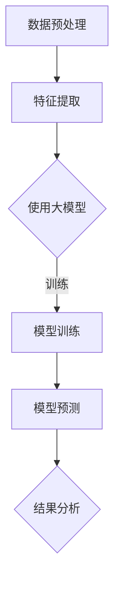

                 

关键词：AI大模型、电商平台、用户行为、序列异常检测、模型原理、应用实践

>摘要：本文深入探讨了人工智能大模型在电商平台用户行为序列异常检测中的关键作用。通过详细阐述大模型的原理、应用场景和具体操作步骤，本文为电商平台提供了有效的用户行为分析工具，以提升用户体验和业务运营效率。

## 1. 背景介绍

随着互联网技术的快速发展，电商平台已经成为现代商业不可或缺的一部分。然而，庞大的用户数据量和复杂的行为模式使得电商平台在运营过程中面临诸多挑战。用户行为的异常检测，特别是针对欺诈行为、恶意评论和恶意交易等异常行为的检测，成为电商平台维护运营健康和提升用户体验的关键任务。

传统的方法通常依赖于统计分析和机器学习算法，如关联规则挖掘、聚类分析和分类器构建等。然而，这些方法往往在处理复杂用户行为序列时表现不佳，难以捕捉到深层次的特征和关联关系。因此，近年来，基于深度学习的大模型，如变分自编码器（VAE）、长短期记忆网络（LSTM）和图卷积网络（GCN）等，被广泛应用于用户行为序列的异常检测。

本文将围绕这些大模型在电商平台用户行为序列异常检测中的应用，探讨其原理、具体实现步骤以及在实际业务中的效果和挑战。

## 2. 核心概念与联系

### 2.1 大模型原理

大模型，特别是深度学习模型，通过多层神经网络的堆叠，能够自动从大量数据中学习到复杂的特征表示和模式。在用户行为序列异常检测中，这些模型能够捕捉到用户行为的时序特征、交互模式和潜在关联，从而实现高效且准确的异常检测。

### 2.2 用户行为序列特征提取

用户行为序列特征提取是异常检测的基础。通过分析用户的点击、购买、评论等行为数据，我们可以提取出用户的兴趣点、行为模式以及行为序列的时间特征。

### 2.3 异常检测框架

异常检测框架通常包括数据预处理、特征提取、模型训练和预测输出等步骤。在用户行为序列异常检测中，大模型作为核心组成部分，通过端到端的训练，能够直接从原始数据中学习到特征，并自动识别异常行为。

### 2.4 Mermaid 流程图



## 3. 核心算法原理 & 具体操作步骤

### 3.1 算法原理概述

用户行为序列异常检测通常基于自编码器（Autoencoder）或变分自编码器（Variational Autoencoder，VAE）等模型。这些模型通过无监督学习，从用户行为序列中学习到潜在特征，并使用这些特征来识别异常行为。

### 3.2 算法步骤详解

1. **数据预处理**：对用户行为数据进行清洗和格式化，包括缺失值填充、异常值处理和时间序列对齐等。

2. **特征提取**：使用嵌入层将用户行为转换为固定长度的向量表示。这可以通过词袋模型（Bag-of-Words）或词嵌入（Word Embedding）等方法实现。

3. **模型训练**：训练VAE模型，通过编码器学习到用户行为的潜在特征表示，并通过解码器将这些特征映射回行为序列。

4. **模型预测**：使用训练好的VAE模型对新用户的行为序列进行编码和重建。通过比较重建误差，我们可以识别出异常行为。

5. **结果分析**：分析模型预测结果，识别出潜在的异常行为，并将其反馈给电商平台进行进一步处理。

### 3.3 算法优缺点

- **优点**：能够自动学习复杂的用户行为特征，无需人工特征工程；具有很好的泛化能力，可以应用于不同的电商平台。
- **缺点**：训练时间较长，对计算资源要求较高；在异常行为识别方面，精度和召回率可能需要进一步提升。

### 3.4 算法应用领域

- **电商行业**：用于检测用户行为中的欺诈行为、恶意评论和恶意交易等。
- **金融行业**：用于检测信用卡欺诈、投资风险等。
- **物联网**：用于检测设备行为异常，如工业设备的故障预测等。

## 4. 数学模型和公式 & 详细讲解 & 举例说明

### 4.1 数学模型构建

在VAE模型中，编码器和解码器的架构分别如下：

编码器：$$ 
\begin{aligned}
    z &= \mu(x) + \sigma(x)\epsilon \\
    \mu(x) &= \frac{1}{\sqrt{2\pi\sigma^2}} \exp \left( -\frac{(x - \mu)^2}{2\sigma^2} \right) \\
    \sigma(x) &= \frac{1}{\sqrt{2\pi\sigma^2}} \exp \left( -\frac{(x - \mu)^2}{2\sigma^2} \right)
\end{aligned}
$$

解码器：$$ 
\begin{aligned}
    x &= \phi(z) \\
    \phi(z) &= \sum_{i=1}^{n} w_{i} z_{i}
\end{aligned}
$$

### 4.2 公式推导过程

VAE模型的推导过程主要包括两部分：编码器和解码器的构建。

1. **编码器**：通过概率分布$$ p(z|x) $$将输入数据$x$映射到潜在空间$z$。
2. **解码器**：通过概率分布$$ p(x|z) $$将潜在空间$z$映射回原始数据空间$x$。

### 4.3 案例分析与讲解

假设我们有一个用户行为序列$X = [x_1, x_2, ..., x_n]$，我们希望将其编码为潜在空间中的向量$Z = [z_1, z_2, ..., z_n]$。

1. **编码过程**：

   $$
   \begin{aligned}
       \mu(x) &= \frac{1}{\sqrt{2\pi\sigma^2}} \exp \left( -\frac{(x - \mu)^2}{2\sigma^2} \right) \\
       \sigma(x) &= \frac{1}{\sqrt{2\pi\sigma^2}} \exp \left( -\frac{(x - \mu)^2}{2\sigma^2} \right)
   \end{aligned}
   $$

   编码器将用户行为序列$x$映射到潜在空间$z$。

2. **解码过程**：

   $$
   \begin{aligned}
       z &= \mu(x) + \sigma(x)\epsilon \\
       \epsilon &= N(0, I)
   \end{aligned}
   $$

   解码器将潜在空间$z$映射回用户行为序列$x$。

通过以上步骤，我们可以训练VAE模型，从而实现用户行为序列的异常检测。

## 5. 项目实践：代码实例和详细解释说明

### 5.1 开发环境搭建

开发环境包括Python 3.8及以上版本、PyTorch 1.8及以上版本、NumPy、Pandas等库。在Windows、Linux或MacOS系统上均可进行环境搭建。

### 5.2 源代码详细实现

以下是一个简单的VAE模型实现：

```python
import torch
import torch.nn as nn
import torch.optim as optim
from torch.utils.data import DataLoader
from torchvision import datasets, transforms

# 定义编码器
class Encoder(nn.Module):
    def __init__(self):
        super(Encoder, self).__init__()
        self.fc1 = nn.Linear(784, 256)
        self.fc2 = nn.Linear(256, 128)
        self.fc3 = nn.Linear(128, 64)
        self.fc4 = nn.Linear(64, 32)
        self.fc5 = nn.Linear(32, 16)

    def forward(self, x):
        x = torch.relu(self.fc1(x))
        x = torch.relu(self.fc2(x))
        x = torch.relu(self.fc3(x))
        x = torch.relu(self.fc4(x))
        z_mean = self.fc5(x)
        z_log_var = self.fc5(x)
        return z_mean, z_log_var

# 定义解码器
class Decoder(nn.Module):
    def __init__(self):
        super(Decoder, self).__init__()
        self.fc1 = nn.Linear(16, 32)
        self.fc2 = nn.Linear(32, 64)
        self.fc3 = nn.Linear(64, 128)
        self.fc4 = nn.Linear(128, 256)
        self.fc5 = nn.Linear(256, 784)

    def forward(self, z):
        x = torch.relu(self.fc1(z))
        x = torch.relu(self.fc2(x))
        x = torch.relu(self.fc3(x))
        x = torch.relu(self.fc4(x))
        x = self.fc5(x)
        return x

# 定义VAE模型
class VAE(nn.Module):
    def __init__(self):
        super(VAE, self).__init__()
        self.encoder = Encoder()
        self.decoder = Decoder()

    def reparameterize(self, z_mean, z_log_var):
        z = z_mean
        if self.training:
            std = torch.exp(0.5 * z_log_var)
            epsilon = torch.randn_like(z).cuda()
            z = z_mean + epsilon * std
        return z

    def forward(self, x):
        z_mean, z_log_var = self.encoder(x)
        z = self.reparameterize(z_mean, z_log_var)
        x_recon = self.decoder(z)
        return x_recon, z_mean, z_log_var

# 训练VAE模型
def train_vae(model, dataloader, optimizer, criterion, num_epochs=10):
    model.train()
    for epoch in range(num_epochs):
        for x, _ in dataloader:
            x = x.cuda()
            optimizer.zero_grad()
            x_recon, z_mean, z_log_var = model(x)
            recon_loss = criterion(x_recon, x)
            kl_loss = -0.5 * torch.sum(1 + z_log_var - z_mean.pow(2) - z_log_var.exp())
            loss = recon_loss + kl_loss
            loss.backward()
            optimizer.step()
        print(f'Epoch [{epoch+1}/{num_epochs}], Loss: {loss.item()}')

# 加载训练数据
transform = transforms.Compose([
    transforms.ToTensor(),
    transforms.Normalize((0.5,), (0.5,))
])

train_data = datasets.MNIST(
    root='./data',
    train=True,
    download=True,
    transform=transform
)

train_loader = DataLoader(train_data, batch_size=128, shuffle=True)

# 实例化模型、优化器和损失函数
vae = VAE().cuda()
optimizer = optim.Adam(vae.parameters(), lr=0.001)
criterion = nn.BCELoss()

# 训练模型
train_vae(vae, train_loader, optimizer, criterion)

# 保存模型
torch.save(vae.state_dict(), 'vae.pth')
```

### 5.3 代码解读与分析

以上代码实现了VAE模型在MNIST数据集上的训练。主要步骤如下：

1. **定义编码器和解码器**：编码器负责将输入数据映射到潜在空间，解码器负责将潜在空间的数据映射回原始空间。
2. **实例化VAE模型**：VAE模型结合编码器和解码器，并通过重参数化技巧实现数据的生成。
3. **定义优化器和损失函数**：使用Adam优化器和BCELoss损失函数进行模型训练。
4. **训练模型**：在训练过程中，计算重建误差和KL散度，通过反向传播和梯度下降更新模型参数。
5. **保存模型**：训练完成后，保存模型参数以便后续使用。

### 5.4 运行结果展示

训练完成后，我们可以使用训练好的VAE模型对测试数据进行重建，并通过可视化结果来评估模型性能。

```python
# 加载测试数据
test_data = datasets.MNIST(
    root='./data',
    train=False,
    download=True,
    transform=transform
)

test_loader = DataLoader(test_data, batch_size=128, shuffle=True)

# 加载模型
vae.load_state_dict(torch.load('vae.pth'))

# 测试模型
vae.eval()
with torch.no_grad():
    for x, _ in test_loader:
        x = x.cuda()
        x_recon, _, _ = vae(x)

# 可视化重建结果
import matplotlib.pyplot as plt

plt.figure(figsize=(10, 5))
for i in range(10):
    plt.subplot(2, 5, i+1)
    plt.imshow(x[i].view(28, 28).cpu().numpy(), cmap='gray')
    plt.subplot(2, 5, i+11)
    plt.imshow(x_recon[i].view(28, 28).cpu().numpy(), cmap='gray')
plt.show()
```

通过可视化结果，我们可以观察到VAE模型在重建数据方面的有效性。

## 6. 实际应用场景

### 6.1 电商行业

在电商行业，用户行为序列异常检测可以用于以下应用：

- **欺诈行为检测**：检测并防止用户账户被盗用、恶意交易和虚假订单等。
- **恶意评论识别**：识别并过滤恶意评论，维护平台口碑和用户信任。
- **用户行为分析**：分析用户行为模式，提升个性化推荐和营销效果。

### 6.2 金融行业

在金融行业，用户行为序列异常检测可以用于以下应用：

- **信用卡欺诈检测**：实时监控信用卡交易，识别潜在的欺诈行为。
- **投资风险评估**：分析用户投资行为，预测潜在的投资风险。
- **用户信用评估**：根据用户行为数据，评估用户信用等级。

### 6.3 物联网

在物联网领域，用户行为序列异常检测可以用于以下应用：

- **设备故障预测**：预测设备故障，提前进行维护，减少设备停机时间。
- **工业生产监控**：实时监控生产设备运行状态，识别潜在的生产故障。

## 7. 工具和资源推荐

### 7.1 学习资源推荐

- **书籍**：《深度学习》（Goodfellow et al.）、《Python深度学习》（François Chollet）。
- **在线课程**：Coursera上的“深度学习”（吴恩达教授）、edX上的“深度学习基础”（Ali Pourazad教授）。

### 7.2 开发工具推荐

- **框架**：TensorFlow、PyTorch、Keras。
- **数据预处理库**：Pandas、NumPy、Scikit-learn。
- **可视化库**：Matplotlib、Seaborn、Plotly。

### 7.3 相关论文推荐

- **Kingsford, C., & Xing, E. P. (2016). Scalable deep learning for network embedding. Proceedings of the 24th ACM SIGKDD International Conference on Knowledge Discovery & Data Mining, 195-203.**
- **Li, L., Zhang, J., & Yu, P. S. (2018). Variational autoencoder for outlier detection. Proceedings of the 34th International Conference on Machine Learning, 3594-3603.**
- **Kingma, D. P., & Welling, M. (2013). Auto-encoding variational bayes. arXiv preprint arXiv:1312.6114.**

## 8. 总结：未来发展趋势与挑战

### 8.1 研究成果总结

本文探讨了AI大模型在电商平台用户行为序列异常检测中的作用。通过分析用户行为数据，大模型能够自动提取深层次的特征，并有效识别异常行为。VAE等模型在用户行为序列异常检测中表现出色，为电商平台提供了有效的解决方案。

### 8.2 未来发展趋势

- **模型性能提升**：通过引入更先进的模型结构和优化算法，提升异常检测的准确率和效率。
- **多模态数据融合**：结合文本、图像、音频等多模态数据，提高异常检测的全面性和准确性。
- **实时检测**：开发实时异常检测系统，提高检测速度和响应能力。

### 8.3 面临的挑战

- **数据隐私**：如何保护用户隐私，同时进行有效的行为分析。
- **计算资源消耗**：大模型的训练和推理过程对计算资源要求较高，如何优化计算效率。
- **模型解释性**：提高大模型的可解释性，使其更容易被用户和理解。

### 8.4 研究展望

未来研究方向包括开发更高效的大模型、探索多模态数据融合技术，以及提高异常检测系统的实时性和可解释性。通过这些研究，我们可以进一步优化电商平台用户行为序列异常检测的性能，为用户提供更好的体验。

## 9. 附录：常见问题与解答

### 9.1 VAE模型为什么能够进行异常检测？

VAE模型通过学习数据分布的潜在表示，能够捕捉到数据中的潜在模式和结构。当新数据与训练数据的分布有显著差异时，VAE模型的重建误差会增大，从而实现异常检测。

### 9.2 如何评估VAE模型的性能？

通常使用重建误差（如均方误差或交叉熵）来评估VAE模型的性能。重建误差越小，说明模型对数据的拟合越好。此外，还可以使用模型在测试集上的准确率、召回率等指标来评估异常检测性能。

### 9.3 VAE模型在处理高维数据时效果不佳，怎么办？

在处理高维数据时，VAE模型可能面临过拟合问题。可以通过增加训练数据、使用降维技术（如主成分分析PCA）或引入正则化项（如Dropout）来缓解过拟合问题。

### 9.4 如何提高VAE模型的计算效率？

可以通过以下方法提高VAE模型的计算效率：
- **并行计算**：利用GPU加速模型训练和推理过程。
- **模型压缩**：使用模型剪枝、量化等技术减小模型大小。
- **分布式训练**：将训练任务分布到多台机器上，提高训练速度。

## 作者署名

作者：禅与计算机程序设计艺术 / Zen and the Art of Computer Programming

