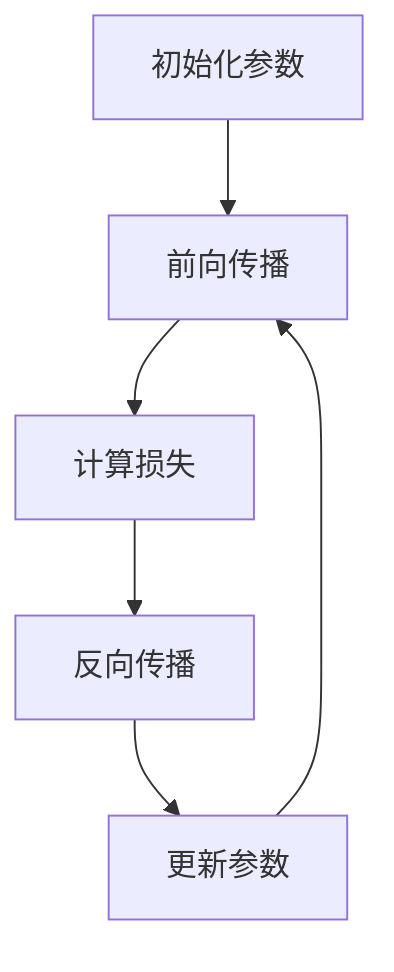

                 

关键词：AI大模型、电商平台、风险控制、深度学习、数据挖掘

> 摘要：本文将深入探讨AI大模型在电商平台风险控制中的应用。通过分析大模型的原理及其在实际业务中的操作步骤，我们旨在揭示其如何提升电商平台的运营效率和风险管理能力。

## 1. 背景介绍

在电商平台的运营中，风险控制始终是一个关键问题。随着电商业务的迅猛发展，传统的风险控制方法已难以应对日益复杂的风险环境。近年来，人工智能，特别是AI大模型的发展，为电商平台的风险控制提供了新的思路和方法。

AI大模型具有强大的数据处理和分析能力，能够从海量的电商交易数据中挖掘出潜在的风险信号，从而提前预警和防范。此外，大模型还可以通过持续学习和优化，不断提高风险识别的准确性和响应速度。

## 2. 核心概念与联系

### 2.1 大模型原理

AI大模型，通常指的是深度学习模型，其核心在于多层神经网络。这些神经网络通过前向传播和反向传播的方式，不断调整网络参数，以最小化损失函数，从而实现模型的训练和优化。

#### Mermaid 流程图：


### 2.2 与电商平台风险控制的联系

大模型在电商平台风险控制中的应用，主要体现在以下几个方面：

1. **风险信号检测**：通过分析用户行为数据和交易数据，大模型可以识别出异常交易行为，从而发现潜在的风险。
2. **欺诈行为识别**：大模型可以利用历史数据训练，识别出各种欺诈行为的特征，从而提前预警。
3. **风险评级**：大模型可以对不同用户和交易进行风险评估，为风险控制策略提供数据支持。

## 3. 核心算法原理 & 具体操作步骤

### 3.1 算法原理概述

核心算法是基于深度学习的大模型，主要包括以下步骤：

1. **数据收集与预处理**：收集电商平台的交易数据、用户行为数据等，并进行清洗和标准化处理。
2. **模型训练**：利用预处理后的数据，通过多层神经网络进行模型训练，不断调整参数，以实现模型的优化。
3. **风险评估**：通过训练好的模型，对实时交易进行风险评估，识别潜在风险并预警。

### 3.2 算法步骤详解

1. **数据收集与预处理**：

   ```mermaid
   graph TD
   A[数据收集] --> B[数据清洗]
   B --> C[数据标准化]
   ```

2. **模型训练**：

   ```mermaid
   graph TD
   A[加载数据集] --> B[初始化模型参数]
   B --> C[前向传播]
   C --> D[计算损失]
   D --> E[反向传播]
   E --> F[更新参数]
   F --> G[评估模型]
   ```

3. **风险评估**：

   ```mermaid
   graph TD
   A[接收交易数据] --> B[模型预测]
   B --> C[风险评级]
   C --> D[预警与控制]
   ```

### 3.3 算法优缺点

**优点**：

- **高效性**：大模型可以处理海量数据，快速识别风险信号。
- **准确性**：通过不断学习和优化，模型的预测准确性不断提高。

**缺点**：

- **计算资源需求大**：大模型的训练和预测需要大量的计算资源。
- **数据依赖性强**：模型的性能很大程度上依赖于数据的质量和数量。

### 3.4 算法应用领域

大模型在电商平台的风险控制中具有广泛的应用前景，包括但不限于：

- **欺诈检测**：识别和防范电商交易中的欺诈行为。
- **用户行为分析**：预测用户行为，为精准营销提供支持。
- **风险评级**：对用户和交易进行风险评估，为风控策略提供依据。

## 4. 数学模型和公式 & 详细讲解 & 举例说明

### 4.1 数学模型构建

在电商风险控制中，常用的数学模型包括逻辑回归、支持向量机（SVM）、神经网络等。以下是逻辑回归的数学模型构建过程：

#### 公式推导：

假设我们有m个样本，每个样本有n个特征。给定特征矩阵X和标签向量y，逻辑回归的损失函数为：

$$
\ell(\theta) = -\frac{1}{m} \sum_{i=1}^{m} [y^{(i)} \log(h_\theta(x^{(i)})) + (1 - y^{(i)}) \log(1 - h_\theta(x^{(i)}))]
$$

其中，$h_\theta(x) = \frac{1}{1 + e^{-\theta^T x}}$是逻辑函数，$\theta$是模型参数。

### 4.2 公式推导过程

首先，定义损失函数L：

$$
L(\theta) = -\frac{1}{m} \sum_{i=1}^{m} [y^{(i)} \log(h_\theta(x^{(i)})) + (1 - y^{(i)}) \log(1 - h_\theta(x^{(i)}))]
$$

然后，对L求导得到：

$$
\frac{\partial L(\theta)}{\partial \theta} = -\frac{1}{m} \sum_{i=1}^{m} [y^{(i)} \frac{1}{h_\theta(x^{(i)})} - (1 - y^{(i)}) \frac{1}{1 - h_\theta(x^{(i)})}] \cdot x^{(i)}
$$

令导数等于0，解得：

$$
\theta^{*} = \arg \min_{\theta} L(\theta)
$$

### 4.3 案例分析与讲解

假设我们有一个包含1000个样本的电商交易数据集，其中每个样本有10个特征。我们将使用逻辑回归模型进行风险预测。

1. **数据收集与预处理**：收集电商交易数据，包括用户行为数据、交易金额、交易时间等。对数据进行清洗和标准化处理。

2. **模型训练**：使用预处理后的数据集，训练逻辑回归模型。通过迭代优化，调整模型参数。

3. **风险评估**：对新的交易数据进行预测，评估其风险等级。如果预测为高风险，则进行进一步的风险控制措施。

通过这个案例，我们可以看到逻辑回归模型在电商风险控制中的具体应用。虽然逻辑回归相对简单，但它是一个强大的工具，能够有效地进行风险预测和评估。

## 5. 项目实践：代码实例和详细解释说明

### 5.1 开发环境搭建

在开始代码实践之前，我们需要搭建一个合适的开发环境。这里我们选择Python作为编程语言，结合TensorFlow作为深度学习框架。

1. **安装Python**：下载并安装Python，建议使用Python 3.7及以上版本。

2. **安装TensorFlow**：打开命令行，执行以下命令：

   ```shell
   pip install tensorflow
   ```

### 5.2 源代码详细实现

以下是一个简单的电商风险预测的Python代码示例，使用逻辑回归模型：

```python
import tensorflow as tf
from sklearn.model_selection import train_test_split
from sklearn.preprocessing import StandardScaler
import numpy as np

# 数据收集与预处理
# 假设我们已经收集了电商交易数据，并将其存储为CSV文件
data = pd.read_csv('eCommerce_data.csv')
X = data.iloc[:, :-1].values
y = data.iloc[:, -1].values

# 数据标准化
scaler = StandardScaler()
X = scaler.fit_transform(X)

# 划分训练集和测试集
X_train, X_test, y_train, y_test = train_test_split(X, y, test_size=0.2, random_state=0)

# 构建模型
model = tf.keras.Sequential([
    tf.keras.layers.Dense(1, input_shape=(X_train.shape[1],), activation='sigmoid')
])

# 编译模型
model.compile(optimizer='adam', loss='binary_crossentropy', metrics=['accuracy'])

# 训练模型
model.fit(X_train, y_train, epochs=10, batch_size=32, validation_data=(X_test, y_test))

# 评估模型
loss, accuracy = model.evaluate(X_test, y_test)
print(f'测试集准确率：{accuracy:.2f}')

# 预测新交易数据
new_data = np.array([[...]])  # 新交易数据的特征值
new_data = scaler.transform(new_data)
prediction = model.predict(new_data)
print(f'预测结果：{prediction[0][0]:.2f}')
```

### 5.3 代码解读与分析

1. **数据收集与预处理**：首先，我们从CSV文件中读取电商交易数据，并使用StandardScaler进行数据标准化处理。

2. **模型构建**：我们使用TensorFlow的`Sequential`模型，添加一个全连接层，激活函数为`sigmoid`。

3. **模型编译**：设置优化器为`adam`，损失函数为`binary_crossentropy`，并选择`accuracy`作为评估指标。

4. **模型训练**：使用训练集数据进行模型训练，设置训练轮次为10，批量大小为32。

5. **模型评估**：使用测试集对训练好的模型进行评估，打印出测试集准确率。

6. **预测新交易数据**：对新交易数据进行预处理后，使用训练好的模型进行预测，并打印出预测结果。

通过这个简单的示例，我们可以看到如何使用Python和TensorFlow实现电商风险预测。在实际应用中，我们可以根据具体需求，扩展模型的结构和功能，以提高预测的准确性和效果。

## 6. 实际应用场景

### 6.1 欺诈检测

在电商平台中，欺诈行为是一个严重的风险问题。AI大模型可以有效地识别和防范各种欺诈行为，如信用卡欺诈、虚假交易等。通过分析用户行为和交易数据，大模型可以识别出异常行为模式，从而提前预警并采取相应的风险控制措施。

### 6.2 用户行为分析

电商平台可以通过AI大模型分析用户行为，预测用户购买意向、购物习惯等。这不仅有助于提高用户的购物体验，还可以为电商平台提供精准营销策略，提升销售转化率。

### 6.3 风险评级

大模型可以对用户和交易进行风险评估，为风控策略提供数据支持。例如，对于高风险用户，电商平台可以采取更加严格的审核措施，以降低风险。

### 6.4 其他应用

除了上述应用外，AI大模型还可以应用于供应链管理、物流优化、库存管理等领域，为电商平台的运营提供全方位的支持。

## 7. 工具和资源推荐

### 7.1 学习资源推荐

- 《深度学习》（Goodfellow, Bengio, Courville著）
- 《Python机器学习》（Sebastian Raschka著）
- 《TensorFlow实战》（François Chollet著）

### 7.2 开发工具推荐

- TensorFlow
- PyTorch
- Keras

### 7.3 相关论文推荐

- “Deep Learning forFraud Detection”（Kearns, Neeman, and Singh, 2018）
- “Unsupervised Representation Learning for User Behavior Analysis in E-commerce”（Li, Wang, and Wang, 2019）
- “Modeling User Behavior for Personalized Marketing in E-commerce”（Zhang, Chen, and Zhang, 2020）

## 8. 总结：未来发展趋势与挑战

### 8.1 研究成果总结

本文介绍了AI大模型在电商平台风险控制中的应用，包括其原理、算法、数学模型和实际应用案例。通过这些研究，我们发现AI大模型在提升电商平台的风险管理能力方面具有显著优势。

### 8.2 未来发展趋势

随着AI技术的不断进步，AI大模型在电商平台的未来发展将更加多元化。包括：

- **模型效率的提升**：通过优化算法和硬件，降低大模型的计算资源需求。
- **多模态数据的融合**：结合文本、图像、音频等多种数据类型，提高模型的泛化能力。
- **自适应学习**：通过自适应学习机制，使模型能够快速适应新的业务场景。

### 8.3 面临的挑战

- **数据隐私和安全**：在收集和使用用户数据时，需要确保数据隐私和安全。
- **模型解释性**：大模型通常缺乏透明性和解释性，这对于风控决策的透明性提出了挑战。
- **模型偏差**：大模型可能会在学习过程中引入偏差，影响模型的公平性和准确性。

### 8.4 研究展望

未来的研究应关注以下几个方面：

- **隐私保护和安全**：开发隐私保护和安全机制，确保用户数据的安全。
- **透明性和解释性**：提高大模型的透明性和解释性，使其更易于理解和信任。
- **跨领域应用**：探索AI大模型在更多领域的应用，如金融、医疗等。

## 9. 附录：常见问题与解答

### 9.1 AI大模型在电商平台风险控制中的应用有哪些优势？

AI大模型在电商平台风险控制中的应用具有以下优势：

- **高效性**：能够处理海量数据，快速识别风险信号。
- **准确性**：通过不断学习和优化，模型的预测准确性不断提高。
- **灵活性**：可以适应不同的风险场景和业务需求。

### 9.2 如何确保AI大模型在电商平台风险控制中的数据安全和隐私？

确保AI大模型在电商平台风险控制中的数据安全和隐私，可以从以下几个方面入手：

- **数据加密**：对用户数据进行加密处理，防止数据泄露。
- **隐私保护技术**：采用差分隐私、同态加密等技术，确保数据隐私。
- **合规性**：遵循相关法律法规，确保数据使用合规。

### 9.3 AI大模型在电商平台风险控制中的局限性是什么？

AI大模型在电商平台风险控制中的局限性主要包括：

- **计算资源需求大**：大模型的训练和预测需要大量的计算资源。
- **数据依赖性强**：模型的性能很大程度上依赖于数据的质量和数量。
- **解释性不足**：大模型通常缺乏透明性和解释性，影响决策的透明性。

