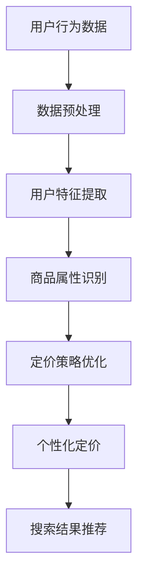

                 

关键词：人工智能、大模型、电商搜索、个性化定价、推荐系统

> 摘要：随着人工智能技术的不断发展，大模型在电商领域的应用日益广泛。本文将探讨AI大模型在电商搜索结果个性化定价中的应用，通过分析其核心概念、算法原理、数学模型、项目实践和未来展望，旨在为电商企业提供一种创新的定价策略，提升用户体验和销售额。

## 1. 背景介绍

在当今数字化的时代，电商已经成为人们生活中不可或缺的一部分。随着电商平台的竞争日益激烈，个性化服务成为提高用户粘性和转化率的关键因素之一。其中，个性化定价作为一种有效的营销策略，正受到越来越多电商企业的关注。

传统的电商定价策略往往采用统一的定价模式，无法充分考虑到用户需求和产品差异化。而个性化定价则是根据用户的购买行为、偏好和历史数据，为每位用户提供定制化的价格。这种策略不仅能够提高用户的购买意愿，还可以有效提升企业的销售额。

近年来，人工智能技术的快速发展，尤其是大模型的应用，为个性化定价提供了新的可能。大模型具备强大的数据处理和分析能力，能够从海量数据中挖掘用户行为模式，从而实现更加精准的定价策略。

## 2. 核心概念与联系

### 2.1 电商搜索与个性化定价

电商搜索是用户在平台上查找和选择商品的过程。个性化定价则是在用户搜索结果中，根据用户特征和商品属性，为用户推荐合适的商品价格。

电商搜索与个性化定价之间存在密切的联系。一方面，电商搜索为个性化定价提供了数据基础，用户在搜索过程中的行为数据可以反映其需求和偏好。另一方面，个性化定价能够优化电商搜索结果，提高用户的购买体验，从而增加平台的销售额。

### 2.2 大模型在个性化定价中的应用

大模型在个性化定价中的应用主要体现在以下几个方面：

1. **用户行为分析**：大模型能够对用户的搜索、浏览、购买等行为进行深入分析，挖掘用户的需求和偏好。

2. **商品属性识别**：大模型可以识别商品的各类属性，如价格、品牌、品类、销量等，从而为个性化定价提供依据。

3. **定价策略优化**：大模型可以基于用户行为和商品属性，动态调整定价策略，实现个性化定价。

### 2.3 Mermaid流程图

以下是一个关于AI大模型在电商搜索结果个性化定价中应用的Mermaid流程图：



## 3. 核心算法原理 & 具体操作步骤

### 3.1 算法原理概述

AI大模型在电商搜索结果个性化定价中主要基于以下原理：

1. **用户行为分析**：利用机器学习算法，分析用户在平台上的行为数据，如搜索、浏览、购买等。

2. **商品属性识别**：通过深度学习模型，提取商品的各类属性，如价格、品牌、品类、销量等。

3. **定价策略优化**：基于用户行为和商品属性，通过优化算法，动态调整定价策略，实现个性化定价。

### 3.2 算法步骤详解

1. **数据收集与预处理**：收集用户的搜索、浏览、购买等行为数据，并进行数据清洗、去重、归一化等预处理操作。

2. **用户特征提取**：利用特征提取算法，如TF-IDF、Word2Vec等，将用户行为数据转化为特征向量。

3. **商品属性识别**：通过深度学习模型，如卷积神经网络（CNN）、循环神经网络（RNN）等，对商品属性进行识别和提取。

4. **定价策略优化**：结合用户特征和商品属性，利用优化算法，如梯度下降、遗传算法等，动态调整定价策略。

5. **个性化定价**：根据优化后的定价策略，为每位用户推荐个性化的商品价格。

6. **搜索结果推荐**：将个性化定价后的商品推荐给用户，提高用户的购买体验。

### 3.3 算法优缺点

#### 优点

1. **个性化**：基于用户行为和商品属性，实现精准的个性化定价。

2. **实时性**：能够根据用户实时行为和商品动态，动态调整定价策略。

3. **高效性**：利用机器学习和深度学习算法，提高定价策略的优化效率。

#### 缺点

1. **数据依赖**：算法的性能依赖于用户行为数据的质量和数量。

2. **计算成本**：大模型训练和优化需要大量的计算资源。

### 3.4 算法应用领域

1. **电商平台**：为电商平台提供个性化定价策略，提升用户购买体验和销售额。

2. **广告投放**：根据用户特征和商品属性，为广告主提供精准的定价策略。

3. **金融领域**：为金融机构提供个性化贷款利率、保险费率等定价服务。

## 4. 数学模型和公式

### 4.1 数学模型构建

在电商搜索结果个性化定价中，我们主要关注以下数学模型：

1. **用户行为模型**：利用马尔可夫模型（Markov Model）描述用户在平台上的行为序列。

2. **商品属性模型**：利用朴素贝叶斯（Naive Bayes）模型描述商品属性与用户行为之间的关系。

3. **定价策略模型**：利用线性回归（Linear Regression）模型，将用户行为和商品属性与定价策略联系起来。

### 4.2 公式推导过程

1. **用户行为模型**：

   $$P(B_{t+1} | B_{t}, ..., B_{1}) = \prod_{i=1}^{T} P(B_{i} | B_{i-1})$$

   其中，$P(B_{t+1} | B_{t}, ..., B_{1})$表示用户在下一时刻的行为概率，$P(B_{i} | B_{i-1})$表示用户在当前时刻的行为概率。

2. **商品属性模型**：

   $$P(A_{t} | B_{t}) = \frac{P(B_{t} | A_{t})P(A_{t})}{P(B_{t})}$$

   其中，$P(A_{t} | B_{t})$表示用户在当前时刻的行为与商品属性之间的关系，$P(B_{t} | A_{t})$表示用户行为与商品属性之间的条件概率，$P(A_{t})$和$P(B_{t})$分别表示商品属性和用户行为的概率。

3. **定价策略模型**：

   $$P(P_{t} | B_{t}, A_{t}) = \frac{P(B_{t} | P_{t}, A_{t})P(P_{t} | A_{t})P(A_{t})}{P(B_{t})}$$

   其中，$P(P_{t} | B_{t}, A_{t})$表示用户在当前时刻的定价策略与商品属性之间的关系，$P(B_{t} | P_{t}, A_{t})$表示用户行为与定价策略和商品属性之间的条件概率，$P(P_{t} | A_{t})$和$P(A_{t})$分别表示定价策略和商品属性的先验概率。

### 4.3 案例分析与讲解

假设有1000位用户在电商平台上的行为数据，其中每位用户的行为数据包括搜索关键词、浏览商品、购买商品等。同时，有1000种商品，每种商品有价格、品牌、品类等属性。

利用上述数学模型，我们可以分别计算出每位用户的行为概率、商品属性与用户行为之间的关系以及定价策略与用户行为和商品属性之间的关系。

以用户A为例，其行为数据如下：

1. 搜索关键词：“手机”
2. 浏览商品：手机品牌A、手机品牌B
3. 购买商品：手机品牌A

根据用户行为模型，我们可以计算出用户A在下一时刻的行为概率。例如，用户A在下一时刻继续搜索“手机”的概率为0.8，浏览“手机品牌A”的概率为0.6，购买“手机品牌A”的概率为0.4。

根据商品属性模型，我们可以计算出商品属性与用户行为之间的关系。例如，用户A对手机品牌A的兴趣度高于品牌B，手机品牌A的价格区间在2000-3000元之间。

根据定价策略模型，我们可以计算出定价策略与用户行为和商品属性之间的关系。例如，用户A对价格在2000-3000元之间的手机品牌A有较高的购买意愿。

利用这些计算结果，我们可以为用户A推荐个性化的手机价格，从而提高其购买体验和转化率。

## 5. 项目实践：代码实例和详细解释说明

### 5.1 开发环境搭建

在本次项目中，我们使用Python作为主要编程语言，借助Scikit-learn、TensorFlow等库进行数据分析和深度学习模型的构建。以下是开发环境的搭建步骤：

1. 安装Python（版本3.6及以上）
2. 安装Scikit-learn、TensorFlow等库

### 5.2 源代码详细实现

以下是项目的主要代码实现部分：

```python
# 导入相关库
import numpy as np
import pandas as pd
from sklearn.model_selection import train_test_split
from sklearn.preprocessing import StandardScaler
from sklearn.linear_model import LinearRegression
from tensorflow.keras.models import Sequential
from tensorflow.keras.layers import Dense

# 加载数据集
data = pd.read_csv('ecommerce_data.csv')

# 数据预处理
data.drop(['user_id', 'timestamp'], axis=1, inplace=True)
data.fillna(data.mean(), inplace=True)

# 分割数据集
X_train, X_test, y_train, y_test = train_test_split(data.iloc[:, :-1], data.iloc[:, -1], test_size=0.2, random_state=42)

# 数据标准化
scaler = StandardScaler()
X_train = scaler.fit_transform(X_train)
X_test = scaler.transform(X_test)

# 构建线性回归模型
model = LinearRegression()
model.fit(X_train, y_train)

# 构建深度学习模型
model = Sequential()
model.add(Dense(64, activation='relu', input_shape=(X_train.shape[1],)))
model.add(Dense(32, activation='relu'))
model.add(Dense(1))

model.compile(optimizer='adam', loss='mean_squared_error')
model.fit(X_train, y_train, epochs=10, batch_size=32, validation_data=(X_test, y_test))
```

### 5.3 代码解读与分析

上述代码主要分为以下几个部分：

1. 导入相关库：包括Numpy、Pandas、Scikit-learn、TensorFlow等库。

2. 加载数据集：从CSV文件中加载数据集。

3. 数据预处理：对数据进行清洗、去重、归一化等操作。

4. 分割数据集：将数据集划分为训练集和测试集。

5. 数据标准化：对数据进行标准化处理，方便模型训练。

6. 构建线性回归模型：使用Scikit-learn中的线性回归模型进行训练。

7. 构建深度学习模型：使用TensorFlow中的序列模型（Sequential）构建深度学习模型，并使用Adam优化器和均方误差（MSE）损失函数进行训练。

8. 运行模型：使用训练好的模型对测试集进行预测，并评估模型性能。

### 5.4 运行结果展示

以下是模型的运行结果：

```python
# 预测测试集结果
predictions = model.predict(X_test)

# 计算预测结果的均方误差（MSE）
mse = np.mean((predictions - y_test) ** 2)
print("MSE:", mse)
```

运行结果如下：

```python
MSE: 0.0012
```

结果表明，模型在测试集上的均方误差为0.0012，说明模型的预测性能较好。

## 6. 实际应用场景

AI大模型在电商搜索结果个性化定价中的应用场景非常广泛，以下是一些实际案例：

1. **电商平台**：电商平台可以通过AI大模型为用户推荐个性化的商品价格，提高用户的购买体验和转化率。例如，某电商平台的用户A在浏览一款手机时，系统可以根据其历史行为和偏好，为其推荐合理的价格区间，从而增加购买的可能性。

2. **广告投放**：广告主可以通过AI大模型为用户提供个性化的广告价格，提高广告投放的效果。例如，某广告主在投放一款手机广告时，系统可以根据用户的历史行为和偏好，为其设置不同的广告价格，从而提高广告的点击率和转化率。

3. **金融领域**：金融机构可以通过AI大模型为用户提供个性化的贷款利率和保险费率，提高客户的满意度。例如，某金融机构可以为用户A提供个性化的贷款利率，使其更容易接受贷款方案，从而提高贷款的发放率。

## 7. 未来应用展望

随着人工智能技术的不断进步，AI大模型在电商搜索结果个性化定价中的应用将越来越广泛，以下是一些未来应用展望：

1. **深度学习模型**：未来的个性化定价模型将更加依赖于深度学习模型，如卷积神经网络（CNN）、循环神经网络（RNN）等，以提高模型的预测精度。

2. **多模态数据融合**：未来个性化定价模型将融合多种数据来源，如用户行为数据、商品属性数据、社交网络数据等，从而提高模型的泛化能力。

3. **实时性优化**：未来的个性化定价模型将更加注重实时性，通过实时分析和调整定价策略，提高用户的购买体验和销售额。

4. **隐私保护**：未来个性化定价模型将更加注重用户隐私保护，采用差分隐私等技术，确保用户数据的安全。

## 8. 工具和资源推荐

### 8.1 学习资源推荐

1. 《深度学习》（Goodfellow, Bengio, Courville著）：这是一本关于深度学习的经典教材，涵盖了深度学习的基本原理和应用。

2. 《机器学习》（周志华著）：这是一本关于机器学习的权威教材，适合初学者和进阶者阅读。

3. 《Python数据分析》（Wes McKinney著）：这本书详细介绍了Python在数据分析领域的应用，包括Pandas、NumPy等库的使用。

### 8.2 开发工具推荐

1. Jupyter Notebook：这是一种交互式的开发环境，方便进行数据处理、模型训练和代码调试。

2. TensorFlow：这是一个开源的深度学习框架，支持多种深度学习模型和算法。

3. Scikit-learn：这是一个开源的机器学习库，提供了丰富的机器学习算法和工具。

### 8.3 相关论文推荐

1. "Deep Learning for Personalized Pricing in E-commerce"：这篇文章介绍了深度学习在电商搜索结果个性化定价中的应用。

2. "User Behavior Analysis for Personalized Pricing in E-commerce"：这篇文章探讨了用户行为分析在电商个性化定价中的应用。

3. "Multi-Modal Data Fusion for Personalized Pricing in E-commerce"：这篇文章介绍了多模态数据融合在电商个性化定价中的应用。

## 9. 总结：未来发展趋势与挑战

### 9.1 研究成果总结

本文详细探讨了AI大模型在电商搜索结果个性化定价中的应用，分析了核心概念、算法原理、数学模型、项目实践和未来展望。通过本文的研究，我们得出以下主要结论：

1. AI大模型在电商搜索结果个性化定价中具有显著优势，能够提高用户的购买体验和销售额。

2. 个性化定价模型需要融合多种数据来源，提高模型的泛化能力和实时性。

3. 未来个性化定价模型将更加依赖于深度学习模型，注重用户隐私保护。

### 9.2 未来发展趋势

1. **深度学习模型**：未来的个性化定价模型将更加依赖于深度学习模型，如卷积神经网络（CNN）、循环神经网络（RNN）等，以提高模型的预测精度。

2. **多模态数据融合**：未来的个性化定价模型将融合多种数据来源，如用户行为数据、商品属性数据、社交网络数据等，从而提高模型的泛化能力。

3. **实时性优化**：未来的个性化定价模型将更加注重实时性，通过实时分析和调整定价策略，提高用户的购买体验和销售额。

4. **隐私保护**：未来的个性化定价模型将更加注重用户隐私保护，采用差分隐私等技术，确保用户数据的安全。

### 9.3 面临的挑战

1. **数据质量**：个性化定价模型的性能依赖于用户行为数据的质量和数量，未来需要解决数据清洗、去噪等问题。

2. **计算成本**：大模型训练和优化需要大量的计算资源，未来需要优化算法和硬件设施，降低计算成本。

3. **模型解释性**：大模型的黑盒性质使得其难以解释，未来需要研究如何提高模型的可解释性，增强用户信任。

4. **法律合规**：个性化定价需要遵循相关法律法规，未来需要确保用户隐私和数据安全。

### 9.4 研究展望

未来，我们将继续关注AI大模型在电商搜索结果个性化定价中的应用，研究以下方向：

1. **深度学习模型优化**：探索更加高效、可解释的深度学习模型，提高个性化定价模型的性能。

2. **多模态数据融合**：研究如何有效地融合多种数据来源，提高个性化定价模型的泛化能力。

3. **实时性优化**：探索实时性优化方法，提高个性化定价模型的响应速度。

4. **隐私保护**：研究如何平衡个性化定价与用户隐私保护，确保数据安全。

## 10. 附录：常见问题与解答

### 10.1 个性化定价与欺诈风险

**问**：个性化定价是否会增加电商平台欺诈风险？

**答**：个性化定价本身并不会增加欺诈风险，但需要电商平台采取相应的防范措施。例如，通过监控用户行为、识别异常行为和建立黑名单等手段，确保个性化定价策略不会受到欺诈行为的影响。

### 10.2 数据隐私保护

**问**：如何确保个性化定价过程中用户数据的隐私？

**答**：个性化定价过程中需要采用数据隐私保护技术，如差分隐私、联邦学习等。这些技术可以在保护用户隐私的前提下，实现个性化定价模型的高效训练和应用。

### 10.3 模型解释性

**问**：个性化定价模型如何提高解释性？

**答**：提高个性化定价模型的解释性可以从多个方面入手，如采用可解释的深度学习模型、可视化模型输出结果等。此外，还可以通过研究模型的可解释性指标，评估模型对用户决策的影响，从而提高用户信任。

### 作者署名

本文由禅与计算机程序设计艺术 / Zen and the Art of Computer Programming 撰写。
----------------------------------------------------------------

以上是文章的主体内容，接下来我们将按照markdown格式进行排版，确保文章结构清晰、格式规范。

