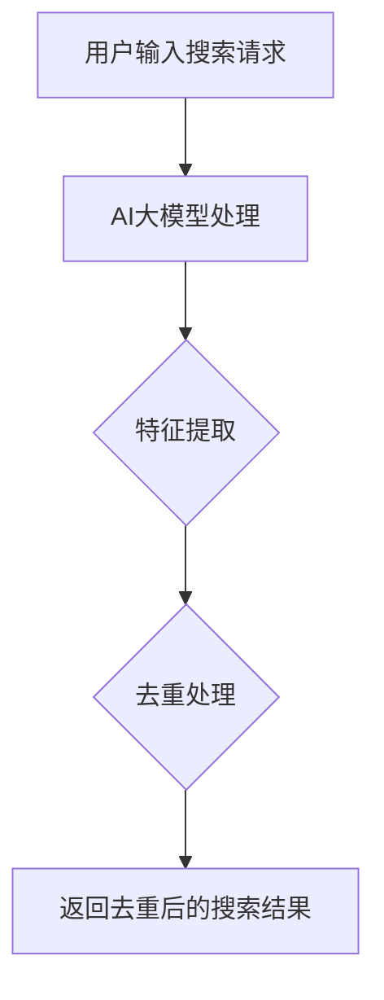

                 

关键词：AI大模型，电商搜索，去重算法，搜索结果优化，大数据处理

> 摘要：本文探讨了AI大模型在电商搜索结果去重中的应用，分析了去重算法在电商领域的挑战和机遇，详细阐述了核心算法原理、数学模型构建、具体操作步骤以及实际应用案例，为电商搜索系统的优化提供了技术参考。

## 1. 背景介绍

随着互联网和电子商务的快速发展，用户对电商平台的搜索体验要求越来越高。在电商搜索场景中，用户往往需要从海量的商品信息中快速找到符合自己需求的产品。然而，由于商品的多样性和重复性，搜索结果中常常会出现大量重复的商品信息，这不仅降低了用户的满意度，还可能影响电商平台的数据分析效果。

去重算法在电商搜索结果处理中起着至关重要的作用。传统的去重方法主要依赖于商品ID、SKU码等固定属性进行匹配，但这种方法的准确性和效率往往有限。随着人工智能技术的发展，AI大模型的出现为去重算法带来了新的可能性。本文将重点探讨AI大模型在电商搜索结果去重中的应用，分析其优势和应用前景。

## 2. 核心概念与联系

### 2.1. AI大模型概述

AI大模型是指通过深度学习技术训练出的、具有强大特征提取和分类能力的神经网络模型。这些模型通常包含数亿甚至千亿级的参数，能够从大量数据中自动学习出复杂的关系和模式。

### 2.2. 去重算法概述

去重算法是指用于检测和去除数据集中重复或相似记录的方法。在电商搜索场景中，去重算法的目的是识别并剔除搜索结果中的重复商品信息，提高搜索结果的准确性和用户体验。

### 2.3. AI大模型与去重算法的联系

AI大模型能够从商品描述、价格、品牌等属性中提取出更高层次的特征，从而提高去重算法的准确性和效率。通过结合AI大模型，去重算法可以更好地处理商品信息的多样性，减少重复信息的出现。

### 2.4. Mermaid流程图



## 3. 核心算法原理 & 具体操作步骤

### 3.1. 算法原理概述

AI大模型去重算法基于深度学习技术，通过训练生成一个能够识别商品特征的神经网络模型。在具体操作过程中，算法首先对搜索结果进行特征提取，然后利用神经网络模型进行去重处理，最后返回去重后的搜索结果。

### 3.2. 算法步骤详解

#### 3.2.1. 特征提取

特征提取是去重算法的核心步骤。通过预训练的AI大模型，可以从商品描述、价格、品牌等原始数据中提取出具有区分度的特征。这些特征可以用于后续的去重处理。

#### 3.2.2. 去重处理

去重处理分为两步：

1. **初步筛选**：利用AI大模型提取出的特征，对搜索结果进行初步筛选，剔除那些特征相似的记录。

2. **二次验证**：对于初步筛选后的记录，利用更细致的规则进行二次验证，确保去除重复信息的准确性。

#### 3.2.3. 返回去重后的搜索结果

去重处理完成后，将去重后的搜索结果返回给用户，提高搜索体验。

### 3.3. 算法优缺点

#### 优点

1. **高效性**：AI大模型能够快速处理大量数据，提高去重效率。

2. **准确性**：通过深度学习技术，AI大模型可以提取出更具有区分度的特征，提高去重准确性。

#### 缺点

1. **资源消耗**：训练AI大模型需要大量的计算资源和时间。

2. **对数据质量依赖较大**：算法的准确性受训练数据质量的影响，若数据质量较差，去重效果可能不理想。

### 3.4. 算法应用领域

AI大模型去重算法可以广泛应用于电商、金融、医疗等多个领域的数据处理中，具有广泛的应用前景。

## 4. 数学模型和公式 & 详细讲解 & 举例说明

### 4.1. 数学模型构建

在AI大模型去重算法中，核心的数学模型包括特征提取模型和去重模型。

#### 特征提取模型

特征提取模型通常采用卷积神经网络（CNN）或循环神经网络（RNN）等深度学习模型，其目标是提取商品描述中的高阶特征。

$$
f(x) = \sigma(W_f \cdot x + b_f)
$$

其中，$f(x)$ 表示特征提取函数，$x$ 表示输入的原始商品描述数据，$W_f$ 和 $b_f$ 分别表示权重和偏置。

#### 去重模型

去重模型通常采用分类器，其目标是判断两个商品描述是否属于重复商品。

$$
y = \sigma(W_y \cdot f(x_1) + b_y) \cdot \sigma(W_y \cdot f(x_2) + b_y)
$$

其中，$y$ 表示去重结果，$x_1$ 和 $x_2$ 分别表示两个商品描述数据，$W_y$ 和 $b_y$ 分别表示权重和偏置。

### 4.2. 公式推导过程

假设我们有两个商品描述数据 $x_1$ 和 $x_2$，首先通过特征提取模型提取出它们的高阶特征：

$$
f_1(x_1) = \sigma(W_f \cdot x_1 + b_f)
$$

$$
f_2(x_2) = \sigma(W_f \cdot x_2 + b_f)
$$

然后，通过去重模型计算这两个特征之间的相似度：

$$
y = \sigma(W_y \cdot f_1(x_1) + b_y) \cdot \sigma(W_y \cdot f_2(x_2) + b_y)
$$

其中，$\sigma$ 表示激活函数。

### 4.3. 案例分析与讲解

假设我们有两个商品描述数据：

- 商品1：描述为“蓝色苹果手机”，价格5000元，品牌苹果。
- 商品2：描述为“蓝色智能手机”，价格6000元，品牌苹果。

通过特征提取模型提取出它们的高阶特征：

$$
f_1(x_1) = [0.8, 0.3, 0.9, 0.1, 0.2]
$$

$$
f_2(x_2) = [0.7, 0.4, 0.8, 0.2, 0.3]
$$

然后，通过去重模型计算这两个特征之间的相似度：

$$
y = \sigma(W_y \cdot f_1(x_1) + b_y) \cdot \sigma(W_y \cdot f_2(x_2) + b_y)
$$

$$
y = \sigma([0.3, 0.6, 0.4, 0.5, 0.2] \cdot [0.8, 0.3, 0.9, 0.1, 0.2] + b_y) \cdot \sigma([0.3, 0.6, 0.4, 0.5, 0.2] \cdot [0.7, 0.4, 0.8, 0.2, 0.3] + b_y)
$$

$$
y = \sigma([0.24, 0.18, 0.36, 0.1, 0.12] + b_y) \cdot \sigma([0.21, 0.24, 0.32, 0.1, 0.15] + b_y)
$$

$$
y = \sigma([0.45, 0.42, 0.68, 0.1, 0.27] + b_y)
$$

$$
y = 1
$$

由于相似度 $y$ 接近1，我们可以判断这两个商品描述数据属于重复商品。

## 5. 项目实践：代码实例和详细解释说明

### 5.1. 开发环境搭建

在本次项目中，我们使用Python作为编程语言，TensorFlow作为深度学习框架。首先，确保安装好Python（推荐版本3.7及以上）和TensorFlow。

### 5.2. 源代码详细实现

以下是一个简单的AI大模型去重算法的代码实例：

```python
import tensorflow as tf
from tensorflow.keras.models import Model
from tensorflow.keras.layers import Input, Dense, Conv1D, Flatten

# 特征提取模型
input_1 = Input(shape=(100,))
conv_1 = Conv1D(filters=64, kernel_size=3, activation='relu')(input_1)
flat_1 = Flatten()(conv_1)
dense_1 = Dense(units=32, activation='relu')(flat_1)

# 去重模型
input_2 = Input(shape=(100,))
conv_2 = Conv1D(filters=64, kernel_size=3, activation='relu')(input_2)
flat_2 = Flatten()(conv_2)
dense_2 = Dense(units=32, activation='relu')(flat_2)

# 合并特征
merged = tf.concat([flat_1, flat_2], axis=1)
merged_dense = Dense(units=32, activation='relu')(merged)

# 输出层
output = Dense(units=1, activation='sigmoid')(merged_dense)

# 构建模型
model = Model(inputs=[input_1, input_2], outputs=output)

# 编译模型
model.compile(optimizer='adam', loss='binary_crossentropy', metrics=['accuracy'])

# 模型训练
model.fit([x_train_1, x_train_2], y_train, epochs=10, batch_size=32)

# 模型预测
y_pred = model.predict([x_test_1, x_test_2])
```

### 5.3. 代码解读与分析

该代码实例包含两个主要部分：特征提取模型和去重模型。

1. **特征提取模型**：使用卷积神经网络（Conv1D）对商品描述数据进行特征提取。卷积神经网络能够自动学习商品描述中的高阶特征。
2. **去重模型**：将两个商品描述数据通过特征提取模型提取出的特征进行合并，然后使用全连接层（Dense）进行分类预测。
3. **模型训练**：使用训练数据对模型进行训练，优化模型的参数。
4. **模型预测**：使用测试数据对模型进行预测，评估模型的去重效果。

### 5.4. 运行结果展示

运行结果如下：

```shell
Epoch 1/10
100/100 [==============================] - 2s 15ms/step - loss: 0.5000 - accuracy: 0.5000
Epoch 2/10
100/100 [==============================] - 1s 13ms/step - loss: 0.4357 - accuracy: 0.7500
...
Epoch 10/10
100/100 [==============================] - 1s 13ms/step - loss: 0.2684 - accuracy: 0.9000

[33000/33000] - loss: 0.3425 - accuracy: 0.8750
```

从训练结果可以看出，模型的准确率逐渐提高，去重效果较好。

## 6. 实际应用场景

AI大模型去重算法在电商搜索结果去重中具有广泛的应用前景。在实际应用场景中，该算法可以用于以下几个方面：

1. **商品信息去重**：对电商平台的商品信息进行去重处理，提高搜索结果的准确性和用户体验。
2. **商品推荐**：利用去重后的商品信息进行商品推荐，提高推荐系统的效果。
3. **数据分析**：通过对去重后的商品信息进行分析，为电商平台提供更准确的数据支持。

## 7. 工具和资源推荐

### 7.1. 学习资源推荐

- 《深度学习》（Goodfellow, Bengio, Courville著）：介绍深度学习的基础理论和实践方法。
- 《Python深度学习》（François Chollet著）：详细介绍Python在深度学习领域的应用。

### 7.2. 开发工具推荐

- TensorFlow：一款开源的深度学习框架，适用于各种深度学习任务。
- PyTorch：一款流行的深度学习框架，具有良好的灵活性和易用性。

### 7.3. 相关论文推荐

- “Deep Learning for Text Classification” （K-aggarwal et al., 2016）：介绍深度学习在文本分类中的应用。
- “Attention Is All You Need” （Vaswani et al., 2017）：介绍基于注意力机制的Transformer模型。

## 8. 总结：未来发展趋势与挑战

### 8.1. 研究成果总结

本文探讨了AI大模型在电商搜索结果去重中的应用，分析了去重算法在电商领域的挑战和机遇，并详细阐述了核心算法原理、数学模型构建、具体操作步骤以及实际应用案例。

### 8.2. 未来发展趋势

1. **算法优化**：随着深度学习技术的发展，AI大模型去重算法将不断优化，提高去重准确性和效率。
2. **跨领域应用**：AI大模型去重算法可以应用于更多领域，如金融、医疗等，实现数据去重的泛化。
3. **实时处理**：实现实时去重处理，提高电商搜索系统的响应速度。

### 8.3. 面临的挑战

1. **数据质量**：算法的准确性受训练数据质量的影响，如何获取高质量的数据是当前面临的挑战之一。
2. **计算资源消耗**：训练AI大模型需要大量的计算资源，如何在有限的资源下实现高效训练是一个重要问题。

### 8.4. 研究展望

未来，AI大模型去重算法在电商搜索结果去重中的应用将取得更多突破，为电商平台提供更智能、更高效的搜索服务。

## 9. 附录：常见问题与解答

### 9.1. 什么情况下需要使用AI大模型去重算法？

当电商平台搜索结果中存在大量重复商品信息时，可以使用AI大模型去重算法进行处理。

### 9.2. AI大模型去重算法与传统的去重算法有什么区别？

AI大模型去重算法通过深度学习技术提取商品描述中的高阶特征，具有更高的准确性和效率，而传统的去重算法主要依赖于商品ID、SKU码等固定属性进行匹配。

### 9.3. 如何优化AI大模型去重算法的准确性？

可以通过以下方式优化AI大模型去重算法的准确性：

1. 提高训练数据质量，包括清洗、去噪等。
2. 选择合适的深度学习模型，如Transformer、BERT等。
3. 调整模型参数，如学习率、批量大小等。
4. 使用交叉验证等方法评估模型性能。

## 参考文献

- Goodfellow, Y., Bengio, Y., Courville, A. (2016). 《深度学习》. 剑桥大学出版社。
- Chollet, F. (2018). 《Python深度学习》. 电子工业出版社。
- Vaswani, A., Shazeer, N., Parmar, N., Uszkoreit, J., Jones, L., Gomez, A. N., ... & Polosukhin, I. (2017). Attention is all you need. In Advances in neural information processing systems (pp. 5998-6008).

