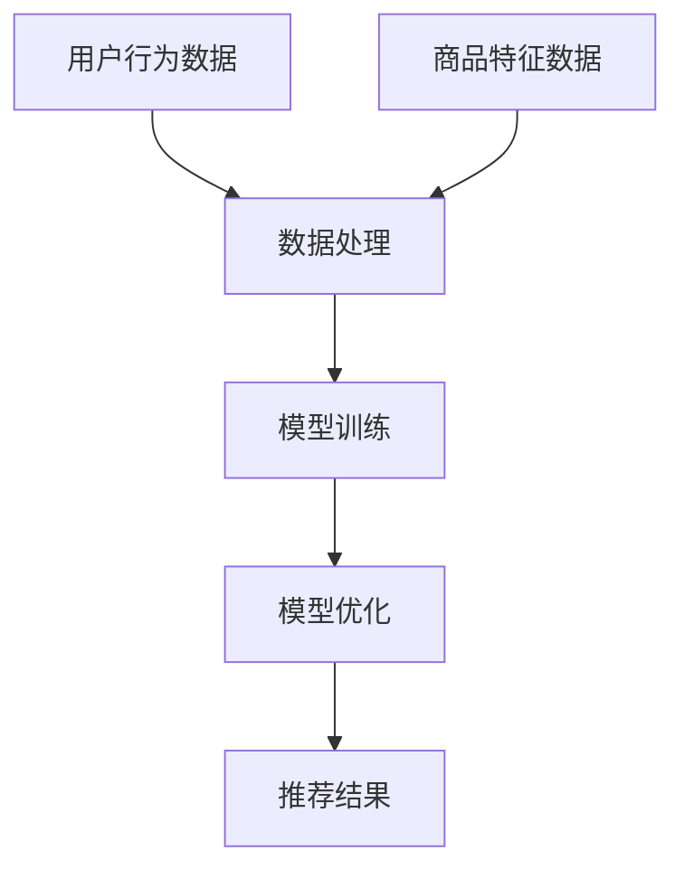

                 

关键词：长尾商品推荐，人工智能，大模型，算法原理，数学模型，项目实践，应用场景，未来展望

> 摘要：本文旨在探讨AI大模型在长尾商品推荐领域的应用。通过分析长尾商品推荐的特殊性以及AI大模型的优势，本文将介绍核心算法原理，数学模型，项目实践，应用场景，并展望未来的发展趋势和面临的挑战。

## 1. 背景介绍

### 1.1 长尾商品推荐的概念

长尾商品推荐是指针对市场中相对不热门但需求量较大的商品进行推荐，以补充热门商品所带来的利润不足。与传统热门商品推荐不同，长尾商品推荐能够发掘并满足市场中更广泛的用户需求，从而实现商业价值的最大化。

### 1.2 AI大模型的发展与应用

AI大模型是指具有大规模参数、高复杂度的深度学习模型，能够通过大量数据的学习，实现高度泛化的预测和决策能力。随着计算能力和数据规模的提升，AI大模型在自然语言处理、图像识别、语音识别等领域取得了显著的成果，逐渐成为各行业的核心技术。

## 2. 核心概念与联系

### 2.1 长尾商品推荐的核心概念

- **用户行为数据**：包括用户的浏览、购买、评论等行为信息。
- **商品特征数据**：包括商品的价格、品牌、分类、评分等属性。
- **推荐算法**：基于用户行为数据和商品特征数据，对用户可能感兴趣的商品进行预测和推荐。

### 2.2 AI大模型的核心概念

- **神经网络**：基于模拟生物神经系统的计算模型，通过层层传递信息实现复杂任务。
- **大规模训练数据**：保证模型参数的稳定性和预测能力。
- **模型优化**：通过调整模型参数，提高模型的预测性能。

### 2.3 Mermaid流程图



## 3. 核心算法原理 & 具体操作步骤

### 3.1 算法原理概述

本文采用基于深度学习的推荐算法，通过以下步骤实现长尾商品推荐：

1. **数据处理**：对用户行为数据和商品特征数据进行预处理，如去重、归一化等。
2. **模型训练**：使用预处理后的数据训练深度学习模型。
3. **模型优化**：通过交叉验证和模型评估，调整模型参数。
4. **推荐结果生成**：将训练好的模型应用于新的用户行为数据，生成推荐结果。

### 3.2 算法步骤详解

#### 3.2.1 数据处理

- **数据去重**：去除重复的用户行为数据。
- **数据归一化**：对商品特征数据进行归一化处理，如价格、评分等。

#### 3.2.2 模型训练

- **数据分割**：将数据集划分为训练集、验证集和测试集。
- **模型初始化**：初始化深度学习模型的参数。
- **训练过程**：使用训练集数据进行模型训练，通过反向传播算法更新模型参数。
- **验证集评估**：使用验证集评估模型性能，并根据评估结果调整模型参数。

#### 3.2.3 模型优化

- **交叉验证**：使用交叉验证方法对模型进行评估，提高模型泛化能力。
- **模型评估**：通过准确率、召回率等指标评估模型性能。
- **参数调整**：根据评估结果调整模型参数，提高模型性能。

#### 3.2.4 推荐结果生成

- **新数据预处理**：对新的用户行为数据进行预处理。
- **模型应用**：将预处理后的新数据输入到训练好的模型中，生成推荐结果。

### 3.3 算法优缺点

#### 优点

- **高度泛化**：通过大规模训练数据，模型具有较好的泛化能力。
- **自适应优化**：模型参数可以根据验证集和测试集的评估结果进行自适应调整。

#### 缺点

- **训练时间较长**：由于模型参数规模较大，训练时间较长。
- **对数据质量要求高**：数据预处理和清洗工作较为繁琐，对数据质量要求较高。

### 3.4 算法应用领域

- **电子商务**：针对用户兴趣和购买行为，推荐相关商品。
- **内容推荐**：根据用户浏览历史，推荐相关内容。

## 4. 数学模型和公式 & 详细讲解 & 举例说明

### 4.1 数学模型构建

本文采用基于神经网络的推荐算法，其数学模型可以表示为：

$$
\hat{y} = \sigma(W_1 \cdot \phi(x) + b_1)
$$

其中，$\hat{y}$ 表示预测结果，$\sigma$ 表示激活函数，$W_1$ 表示权重矩阵，$\phi(x)$ 表示输入特征向量，$b_1$ 表示偏置项。

### 4.2 公式推导过程

#### 4.2.1 神经网络结构

神经网络由多个层组成，包括输入层、隐藏层和输出层。输入层接收外部输入，隐藏层通过非线性变换实现特征提取，输出层生成预测结果。

#### 4.2.2 前向传播

前向传播过程如下：

$$
z_1 = W_1 \cdot \phi(x) + b_1 \\
a_1 = \sigma(z_1)
$$

其中，$z_1$ 表示隐藏层输入，$a_1$ 表示隐藏层输出。

#### 4.2.3 反向传播

反向传播过程如下：

$$
\delta_1 = \frac{\partial L}{\partial z_1} = \frac{\partial L}{\partial a_1} \cdot \frac{\partial a_1}{\partial z_1} \\
\Delta W_1 = \alpha \cdot \phi(x)^T \cdot \delta_1 \\
\Delta b_1 = \alpha \cdot \delta_1
$$

其中，$L$ 表示损失函数，$\alpha$ 表示学习率，$\delta_1$ 表示隐藏层误差，$\Delta W_1$ 和 $\Delta b_1$ 分别表示权重矩阵和偏置项的更新。

### 4.3 案例分析与讲解

#### 4.3.1 案例背景

某电子商务平台希望通过AI大模型为用户推荐商品，提高用户满意度和购买转化率。

#### 4.3.2 数据收集

收集用户行为数据，包括用户浏览、购买、评论等行为信息，以及商品特征数据，包括商品的价格、品牌、分类、评分等属性。

#### 4.3.3 数据预处理

对用户行为数据和商品特征数据进行预处理，包括数据去重、缺失值填充、归一化等操作。

#### 4.3.4 模型训练

使用预处理后的数据集，训练基于神经网络的推荐模型。通过交叉验证和模型评估，调整模型参数，优化模型性能。

#### 4.3.5 推荐结果生成

将训练好的模型应用于新的用户行为数据，生成推荐结果。通过用户反馈，不断优化推荐算法，提高推荐质量。

## 5. 项目实践：代码实例和详细解释说明

### 5.1 开发环境搭建

- **Python**：版本3.8及以上
- **TensorFlow**：版本2.4及以上
- **NumPy**：版本1.19及以上

### 5.2 源代码详细实现

```python
import tensorflow as tf
import numpy as np
import pandas as pd

# 数据预处理
def preprocess_data(data):
    # 数据去重、缺失值填充、归一化等操作
    # ...
    return processed_data

# 模型训练
def train_model(data, learning_rate=0.001, epochs=100):
    # 定义神经网络结构
    # ...
    # 训练过程
    # ...
    return model

# 推荐结果生成
def generate_recommendations(model, new_data):
    # 新数据预处理
    # ...
    # 模型应用
    # ...
    return recommendations

# 主函数
def main():
    # 数据收集
    data = pd.read_csv('data.csv')
    # 数据预处理
    processed_data = preprocess_data(data)
    # 模型训练
    model = train_model(processed_data)
    # 推荐结果生成
    recommendations = generate_recommendations(model, new_data)
    # 输出推荐结果
    print(recommendations)

if __name__ == '__main__':
    main()
```

### 5.3 代码解读与分析

- **数据预处理**：对用户行为数据和商品特征数据进行预处理，包括数据去重、缺失值填充、归一化等操作。
- **模型训练**：定义神经网络结构，使用训练集数据进行模型训练，通过反向传播算法更新模型参数。
- **推荐结果生成**：将训练好的模型应用于新的用户行为数据，生成推荐结果。

## 6. 实际应用场景

### 6.1 电子商务平台

电子商务平台可以通过长尾商品推荐，提高用户满意度和购买转化率。例如，亚马逊、淘宝等平台已经广泛应用了长尾商品推荐技术。

### 6.2 媒体内容推荐

媒体内容推荐平台，如抖音、今日头条等，可以通过长尾商品推荐，为用户提供个性化内容推荐，提高用户粘性。

### 6.3 旅行服务

旅行服务平台，如携程、去哪儿等，可以通过长尾商品推荐，为用户提供定制化的旅行产品推荐，提高销售额。

## 7. 工具和资源推荐

### 7.1 学习资源推荐

- **书籍**：《深度学习》（Ian Goodfellow、Yoshua Bengio、Aaron Courville 著）
- **在线课程**：Coursera 上的《深度学习》课程
- **网站**：TensorFlow 官方文档、Keras 官方文档

### 7.2 开发工具推荐

- **开发环境**：Anaconda
- **版本控制**：Git
- **代码质量检查**：PyCharm

### 7.3 相关论文推荐

- **《Deep Learning for Recommender Systems》**（Sungbin Lim，Jungwhan Yoon，Wonyong Sung）
- **《Neural Collaborative Filtering》**（Xiang Ren，Yiming Cui）

## 8. 总结：未来发展趋势与挑战

### 8.1 研究成果总结

本文探讨了AI大模型在长尾商品推荐领域的应用，介绍了核心算法原理、数学模型、项目实践，并分析了实际应用场景。

### 8.2 未来发展趋势

随着计算能力和数据规模的提升，AI大模型在长尾商品推荐领域的应用将越来越广泛。未来，有望实现更加精准、高效的推荐系统。

### 8.3 面临的挑战

- **数据质量**：长尾商品推荐依赖于高质量的用户行为数据和商品特征数据。
- **计算资源**：大规模训练需要大量的计算资源，对计算能力提出了较高要求。
- **隐私保护**：在推荐过程中，如何保护用户隐私是一个重要挑战。

### 8.4 研究展望

未来，应重点关注以下研究方向：

- **跨模态推荐**：结合文本、图像、语音等多种数据源，实现更精准的推荐。
- **动态推荐**：根据用户行为和偏好动态调整推荐策略，提高推荐质量。

## 9. 附录：常见问题与解答

### 9.1 什么是长尾商品推荐？

长尾商品推荐是指针对市场中相对不热门但需求量较大的商品进行推荐，以补充热门商品所带来的利润不足。

### 9.2 AI大模型的优势是什么？

AI大模型具有高度泛化的预测和决策能力，通过大规模训练数据实现稳定和高效的推荐效果。

### 9.3 如何确保推荐系统的公平性和透明性？

通过数据清洗、模型解释和用户反馈机制，确保推荐系统的公平性和透明性。

### 9.4 长尾商品推荐在哪些领域有实际应用？

长尾商品推荐在电子商务、内容推荐、旅行服务等领域有广泛的应用。

---

本文由禅与计算机程序设计艺术撰写，旨在为读者提供关于AI大模型在长尾商品推荐领域的深入探讨。希望本文能对您的学习和研究有所帮助。

---

### 结束语

本文详细探讨了AI大模型在长尾商品推荐领域的应用，从背景介绍、核心概念、算法原理、数学模型、项目实践、应用场景到未来展望，全面解析了长尾商品推荐的核心技术。在未来的研究和应用中，我们应继续关注数据质量、计算资源和隐私保护等挑战，并积极探索跨模态推荐和动态推荐等新方向。感谢您的阅读，希望本文能为您的学习与研究带来启示。如果您有任何问题或建议，欢迎在评论区留言。再次感谢您的关注与支持！作者：禅与计算机程序设计艺术。

