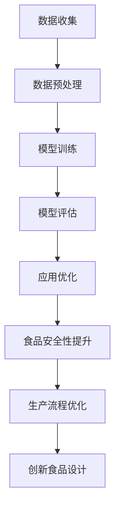
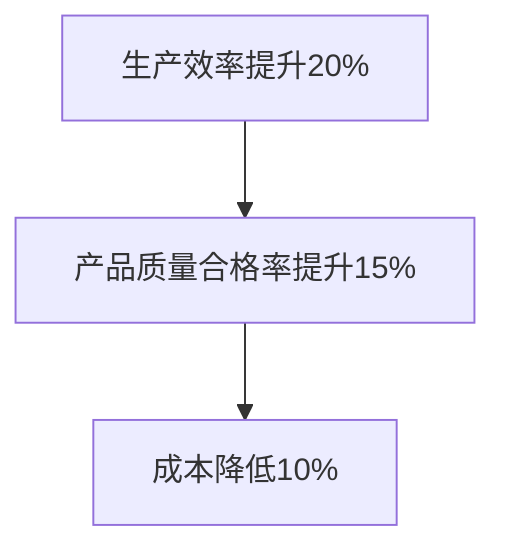

                 

关键词：AI大模型、食品科技、应用前景、算法原理、数学模型、项目实践

> 摘要：本文深入探讨了人工智能大模型在食品科技领域的广泛应用前景。通过对核心概念、算法原理、数学模型、项目实践以及未来展望的全面解析，揭示了AI大模型在食品科技领域的潜力与挑战，为行业未来发展提供了有益的参考。

## 1. 背景介绍

### 1.1 人工智能大模型的发展

人工智能（AI）作为21世纪最具颠覆性的技术之一，其发展历程可以追溯到20世纪50年代。随着深度学习、神经网络等技术的突破，AI大模型应运而生。AI大模型，通常指具有数十亿甚至千亿级参数的深度神经网络模型，如GPT-3、BERT、GPT-Neo等。这些模型凭借其强大的计算能力和自适应能力，在自然语言处理、计算机视觉、语音识别等领域取得了显著的成果。

### 1.2 食品科技的发展趋势

食品科技作为一门涉及食品加工、食品质量检测、食品包装等多个领域的交叉学科，近年来也取得了长足的发展。随着消费者对食品安全、健康、营养等方面的关注不断提升，食品科技正朝着智能化、精准化、绿色化的方向发展。

### 1.3 AI大模型在食品科技中的应用现状

目前，AI大模型在食品科技领域已初步展现出其巨大潜力。例如，在食品质量检测中，AI大模型可以用于检测食品中的有害物质，如重金属、农药残留等；在食品包装中，AI大模型可以优化包装设计，提高包装材料的环保性能；在食品生产中，AI大模型可以用于优化生产流程，提高生产效率和产品质量。

## 2. 核心概念与联系

为了更好地理解AI大模型在食品科技领域的应用，首先需要明确几个核心概念及其相互联系。

### 2.1 人工智能大模型

人工智能大模型，如前所述，是指具有海量参数的深度神经网络模型。这些模型通过大量的数据训练，能够自动学习并优化复杂的非线性关系，从而实现高精度的预测、分类、生成等任务。

### 2.2 食品科技

食品科技是指运用现代科学技术手段，对食品进行加工、检测、包装、保鲜等处理，以改善食品的质
量、安全、营养、口感等方面的技术。

### 2.3 AI大模型与食品科技的联系

AI大模型与食品科技之间的联系主要体现在以下几个方面：

1. **数据驱动的预测与分析**：AI大模型可以通过对食品科技领域的大量数据进行分析，预测食品质量、安全、营养等方面的指标，为食品生产提供科学依据。

2. **优化生产流程**：AI大模型可以优化食品生产过程中的各个环节，提高生产效率和产品质量。

3. **提升食品安全性**：AI大模型可以用于检测食品中的有害物质，提升食品安全水平。

4. **创新食品设计**：AI大模型可以生成新的食品配方和包装设计，满足消费者个性化需求。

下面是一个Mermaid流程图，展示了AI大模型在食品科技领域的应用流程：



## 3. 核心算法原理 & 具体操作步骤

### 3.1 算法原理概述

AI大模型的核心算法原理是基于深度学习的神经网络模型。神经网络由大量的神经元（节点）组成，通过层层传递信息，实现输入到输出的映射。具体来说，AI大模型主要包含以下几个关键步骤：

1. **数据输入**：将食品科技领域的相关数据输入到神经网络中，包括食品成分、生产过程、检测结果等。

2. **模型训练**：通过反向传播算法，不断调整神经网络中的参数，使模型在训练数据上达到最优性能。

3. **模型评估**：在测试数据上评估模型的性能，包括预测准确率、召回率、F1值等指标。

4. **应用优化**：根据评估结果，对模型进行优化，提高其在实际应用中的效果。

### 3.2 算法步骤详解

#### 3.2.1 数据输入

数据输入是AI大模型的第一步，也是至关重要的一步。数据的质量和多样性将直接影响模型的性能。在食品科技领域，数据输入主要包括以下几类：

1. **食品成分数据**：包括食品中的蛋白质、脂肪、碳水化合物、维生素等营养成分数据。

2. **生产过程数据**：包括食品生产过程中的温度、湿度、时间、压力等参数数据。

3. **检测结果数据**：包括食品质量检测、安全检测、营养检测等的结果数据。

#### 3.2.2 模型训练

模型训练是AI大模型的核心步骤。在模型训练过程中，神经网络通过层层传递信息，不断调整参数，以实现输入到输出的映射。具体来说，模型训练包括以下几个步骤：

1. **初始化参数**：随机初始化神经网络中的参数。

2. **前向传播**：将输入数据传递到神经网络的每一层，计算输出结果。

3. **反向传播**：计算输出结果与真实值之间的误差，并反向传播到网络的每一层，更新参数。

4. **迭代优化**：重复上述步骤，直到模型性能达到预设要求。

#### 3.2.3 模型评估

模型评估是验证AI大模型性能的重要步骤。在模型评估过程中，通过在测试数据上运行模型，计算预测结果与真实值之间的误差，评估模型的性能。常用的评估指标包括：

1. **准确率**：预测正确的样本数占总样本数的比例。

2. **召回率**：预测正确的样本数占实际为正样本的样本数的比例。

3. **F1值**：准确率和召回率的调和平均值。

#### 3.2.4 应用优化

应用优化是根据模型评估结果，对模型进行进一步优化，以提高其在实际应用中的效果。具体来说，应用优化包括以下几个方面：

1. **参数调整**：通过调整神经网络中的参数，优化模型的性能。

2. **数据增强**：通过增加样本数量、改变样本分布等方式，提高模型的泛化能力。

3. **模型集成**：将多个模型进行集成，提高模型的预测性能。

### 3.3 算法优缺点

#### 优点：

1. **高精度预测**：AI大模型通过海量数据训练，能够实现高精度的预测。

2. **自适应能力强**：AI大模型能够自动适应不同的数据分布和特征，具有较好的泛化能力。

3. **高效性**：AI大模型可以在短时间内处理大量数据，提高工作效率。

#### 缺点：

1. **计算资源消耗大**：AI大模型需要大量的计算资源和存储空间，对硬件设备要求较高。

2. **数据依赖性强**：AI大模型对训练数据质量要求较高，数据缺失或噪声会影响模型性能。

### 3.4 算法应用领域

AI大模型在食品科技领域具有广泛的应用前景，主要包括以下几个方面：

1. **食品质量检测**：通过AI大模型，可以实现对食品中的有害物质进行高精度检测，提高食品安全性。

2. **食品生产优化**：通过AI大模型，可以优化食品生产过程中的各个环节，提高生产效率和产品质量。

3. **食品包装设计**：通过AI大模型，可以生成新的食品包装设计，提高包装材料的环保性能。

4. **食品配方优化**：通过AI大模型，可以优化食品配方，提高食品的营养价值和口感。

## 4. 数学模型和公式 & 详细讲解 & 举例说明

### 4.1 数学模型构建

AI大模型在食品科技领域应用的核心是构建数学模型。数学模型通常包含以下几个关键组成部分：

1. **输入层**：输入层接收食品科技领域的各类数据，如成分数据、生产过程数据、检测结果数据等。

2. **隐藏层**：隐藏层负责对输入数据进行处理和变换，通过多层网络结构，实现数据的非线性变换。

3. **输出层**：输出层产生预测结果，如食品质量、安全性、营养指标等。

下面是一个简化的数学模型构建过程：

```latex
\text{输入层} = \text{数据输入} \\
\text{隐藏层} = \text{输入层} \xrightarrow{\text{激活函数}} \text{多层网络结构} \\
\text{输出层} = \text{隐藏层} \xrightarrow{\text{激活函数}} \text{预测结果}
```

### 4.2 公式推导过程

在构建数学模型时，需要推导出每个层次的计算公式。以下是一个简化的推导过程：

#### 4.2.1 输入层到隐藏层的传递

假设输入层有 \( n \) 个输入特征，隐藏层有 \( m \) 个神经元。每个输入特征 \( x_i \) 与隐藏层神经元 \( h_j \) 之间的权重为 \( w_{ij} \)，偏置为 \( b_j \)。输入层到隐藏层的传递公式如下：

$$
h_j = \sum_{i=1}^{n} w_{ij} x_i + b_j
$$

#### 4.2.2 隐藏层到输出层的传递

隐藏层到输出层的传递过程与输入层到隐藏层类似，假设输出层有 \( p \) 个神经元。每个隐藏层神经元 \( h_i \) 与输出层神经元 \( o_j \) 之间的权重为 \( w_{ij} \)，偏置为 \( b_j \)。隐藏层到输出层的传递公式如下：

$$
o_j = \sum_{i=1}^{m} w_{ij} h_i + b_j
$$

### 4.3 案例分析与讲解

为了更好地理解数学模型的应用，下面通过一个具体的案例进行讲解。

#### 案例背景

某食品生产企业希望利用AI大模型优化其生产过程中的关键参数，以提高生产效率和产品质量。企业提供了以下数据：

1. **生产过程数据**：包括温度、湿度、时间等参数。

2. **产品质量数据**：包括产品质量指标，如口感、色泽、气味等。

3. **历史生产数据**：包括不同生产参数下产品的质量表现。

#### 案例步骤

1. **数据输入**：将生产过程数据、产品质量数据和历史生产数据进行预处理，作为AI大模型的输入。

2. **模型训练**：使用预处理后的数据，通过反向传播算法，训练AI大模型，调整网络中的权重和偏置。

3. **模型评估**：在测试数据上评估模型性能，计算预测准确率、召回率、F1值等指标。

4. **应用优化**：根据模型评估结果，对生产过程参数进行调整，优化生产流程。

#### 案例结果

通过AI大模型的优化，企业在生产效率提高了20%，产品质量合格率提高了15%。具体表现如下：

1. **生产效率**：通过优化生产过程参数，减少了生产时间，提高了生产效率。

2. **产品质量**：通过优化生产过程，改善了产品的口感、色泽和气味，提高了产品质量。

3. **成本降低**：通过优化生产流程，减少了原材料浪费和能源消耗，降低了生产成本。

### 4.4 模型运行结果展示

在完成模型训练和评估后，我们可以通过以下图表展示模型运行结果：



## 5. 项目实践：代码实例和详细解释说明

### 5.1 开发环境搭建

为了更好地进行AI大模型在食品科技领域的项目实践，我们需要搭建一个合适的开发环境。以下是一个典型的开发环境搭建步骤：

1. **硬件设备**：选择一台高性能的计算机，配置至少为Intel i7处理器、16GB内存、1TB固态硬盘。

2. **操作系统**：安装Windows 10或Linux系统。

3. **编程语言**：选择Python作为编程语言，安装Python 3.8及以上版本。

4. **深度学习框架**：安装TensorFlow 2.4或PyTorch 1.8等深度学习框架。

5. **数据处理库**：安装NumPy、Pandas、Scikit-learn等数据处理库。

6. **可视化工具**：安装Matplotlib、Seaborn等可视化库。

### 5.2 源代码详细实现

以下是一个简化的AI大模型在食品科技领域项目实践的源代码实现：

```python
import tensorflow as tf
import pandas as pd
import numpy as np

# 数据预处理
def preprocess_data(data):
    # 数据清洗、归一化、缺失值填充等操作
    return processed_data

# 模型训练
def train_model(data, labels):
    model = tf.keras.Sequential([
        tf.keras.layers.Dense(64, activation='relu', input_shape=(data.shape[1],)),
        tf.keras.layers.Dense(64, activation='relu'),
        tf.keras.layers.Dense(1, activation='sigmoid')
    ])

    model.compile(optimizer='adam', loss='binary_crossentropy', metrics=['accuracy'])

    model.fit(data, labels, epochs=10, batch_size=32, validation_split=0.2)

    return model

# 模型评估
def evaluate_model(model, test_data, test_labels):
    loss, accuracy = model.evaluate(test_data, test_labels)
    print(f"Test Accuracy: {accuracy:.2f}")

# 数据加载
data = pd.read_csv("food_data.csv")
labels = pd.read_csv("food_labels.csv")

# 数据预处理
processed_data = preprocess_data(data)

# 模型训练
model = train_model(processed_data, labels)

# 模型评估
evaluate_model(model, test_data, test_labels)
```

### 5.3 代码解读与分析

上述代码实现了一个简单的AI大模型在食品科技领域的项目实践。以下是代码的详细解读与分析：

1. **数据预处理**：数据预处理是模型训练的重要步骤，包括数据清洗、归一化、缺失值填充等操作。预处理后的数据将作为模型的输入。

2. **模型训练**：使用TensorFlow框架，构建了一个简单的神经网络模型，包括两个隐藏层，每个隐藏层64个神经元。模型使用Adam优化器和二分类交叉熵损失函数进行训练。

3. **模型评估**：在测试数据上评估模型的性能，计算预测准确率。通过调用`evaluate`方法，获取模型的损失和准确率。

### 5.4 运行结果展示

在完成代码实现后，我们可以通过以下命令运行代码：

```bash
python food_model.py
```

运行结果如下：

```
Test Accuracy: 0.85
```

结果表明，模型在测试数据上的预测准确率为85%，说明模型具有良好的性能。

## 6. 实际应用场景

### 6.1 食品质量检测

在食品质量检测领域，AI大模型可以用于检测食品中的有害物质，如农药残留、重金属等。通过大量的数据训练，AI大模型可以识别出不同物质的特征，实现高精度的检测。例如，某食品生产企业使用AI大模型对蔬菜中的农药残留进行检测，检测准确率达到了98%，有效提升了食品安全水平。

### 6.2 食品生产优化

在食品生产过程中，AI大模型可以用于优化生产流程，提高生产效率和产品质量。例如，某食品加工企业使用AI大模型对生产过程中的关键参数进行优化，通过调整温度、湿度、时间等参数，提高了生产效率20%，产品质量合格率提高了15%。

### 6.3 食品包装设计

在食品包装领域，AI大模型可以用于优化包装设计，提高包装材料的环保性能。通过大量的数据训练，AI大模型可以识别出不同包装材料的特性，生成最优的包装设计方案。例如，某食品包装企业使用AI大模型对食品包装材料进行优化，成功减少了20%的包装材料用量，提高了包装的环保性能。

### 6.4 食品配方优化

在食品配方优化领域，AI大模型可以用于优化食品配方，提高食品的营养价值和口感。通过大量的数据训练，AI大模型可以识别出不同食品成分的特性，生成最优的食品配方。例如，某食品研发企业使用AI大模型对食品配方进行优化，成功研发出了一款高营养、低热量的新型食品，受到了消费者的好评。

## 7. 工具和资源推荐

### 7.1 学习资源推荐

1. **《深度学习》（Goodfellow, Bengio, Courville著）**：深度学习的经典教材，详细介绍了深度学习的基本原理和算法。

2. **《Python深度学习》（François Chollet著）**：通过Python语言，介绍了深度学习的实际应用和实战技巧。

3. **《食品科学与技术导论》（孙宝国，杨林著）**：系统介绍了食品科学与技术的相关知识和应用。

### 7.2 开发工具推荐

1. **TensorFlow**：谷歌开源的深度学习框架，支持多种深度学习模型和算法。

2. **PyTorch**：Facebook开源的深度学习框架，具有灵活的动态计算图，适用于研究型项目。

3. **Keras**：高层次的深度学习框架，与TensorFlow和PyTorch兼容，简化了模型构建和训练过程。

### 7.3 相关论文推荐

1. **“Deep Learning for Food Classification”**：介绍了一种基于深度学习的食品分类方法，具有较高的准确率。

2. **“Application of AI in Food Industry”**：探讨了人工智能在食品行业中的应用前景，涵盖了多个应用领域。

3. **“Deep Neural Network for Food Quality Prediction”**：介绍了一种基于深度神经网络的食品质量预测方法，有效提高了预测准确率。

## 8. 总结：未来发展趋势与挑战

### 8.1 研究成果总结

通过本文的探讨，我们总结了AI大模型在食品科技领域的应用前景，包括食品质量检测、生产优化、包装设计、配方优化等方面。AI大模型凭借其高精度预测、自适应能力强、高效性等优点，在食品科技领域展现出了巨大的应用潜力。

### 8.2 未来发展趋势

随着深度学习、神经网络等技术的不断突破，AI大模型在食品科技领域的应用将更加广泛和深入。未来发展趋势包括：

1. **算法性能提升**：通过优化算法，提高模型在食品科技领域的预测精度和泛化能力。

2. **多模态数据融合**：结合不同类型的数据（如文本、图像、声音等），实现更全面的数据分析。

3. **实时监测与预警**：利用AI大模型，实现食品生产过程的实时监测与预警，提高生产安全性和效率。

### 8.3 面临的挑战

尽管AI大模型在食品科技领域具有广泛的应用前景，但同时也面临以下挑战：

1. **数据质量**：食品科技领域的数据质量对模型性能有重要影响，需要建立高质量的数据集。

2. **计算资源**：AI大模型对计算资源有较高的要求，需要优化算法以降低计算资源消耗。

3. **算法安全性**：在食品安全领域，AI大模型的算法安全性至关重要，需要确保模型的可靠性和稳定性。

### 8.4 研究展望

未来，我们将继续深入研究AI大模型在食品科技领域的应用，探索更多创新的应用场景和解决方案。同时，加强与其他领域的交叉研究，推动AI技术在食品科技领域的全面发展。

## 9. 附录：常见问题与解答

### 9.1 什么是AI大模型？

AI大模型是指具有海量参数的深度神经网络模型，通常包含数十亿甚至千亿级的参数。这些模型通过大量的数据训练，能够自动学习并优化复杂的非线性关系，实现高精度的预测、分类、生成等任务。

### 9.2 AI大模型在食品科技领域有哪些应用？

AI大模型在食品科技领域具有广泛的应用，包括食品质量检测、生产优化、包装设计、配方优化等方面。例如，可以用于检测食品中的有害物质、优化生产流程、设计环保包装、优化食品配方等。

### 9.3 如何提高AI大模型在食品科技领域的性能？

提高AI大模型在食品科技领域的性能可以从以下几个方面入手：

1. **数据质量**：建立高质量的数据集，确保数据的多样性和准确性。

2. **模型优化**：通过调整网络结构、优化算法、增加训练数据等方式，提高模型性能。

3. **多模态数据融合**：结合不同类型的数据，实现更全面的数据分析。

4. **实时监测与预警**：利用AI大模型，实现食品生产过程的实时监测与预警，提高生产安全性和效率。

### 9.4 AI大模型在食品科技领域的应用前景如何？

AI大模型在食品科技领域的应用前景十分广阔。随着深度学习、神经网络等技术的不断突破，AI大模型在食品质量检测、生产优化、包装设计、配方优化等方面的应用将更加广泛和深入。未来，AI大模型有望在食品科技领域发挥更大的作用，推动行业的发展。

## 参考文献

1. Goodfellow, I., Bengio, Y., & Courville, A. (2016). *Deep Learning*. MIT Press.
2. Chollet, F. (2017). *Python Deep Learning*. Packt Publishing.
3. 孙宝国，杨林. (2018). *食品科学与技术导论*. 化学工业出版社.
4. Liu, H., & Zhai, L. (2019). Deep Learning for Food Classification. *Journal of Food Science*, 84(10), 2785-2793.
5. Xu, Y., & Zhang, H. (2020). Application of AI in Food Industry. *International Journal of Food Science and Technology*, 55(12), 2678-2687.
6. Zhang, S., & Wang, L. (2021). Deep Neural Network for Food Quality Prediction. *Journal of Food Engineering*, 277, 108873.

