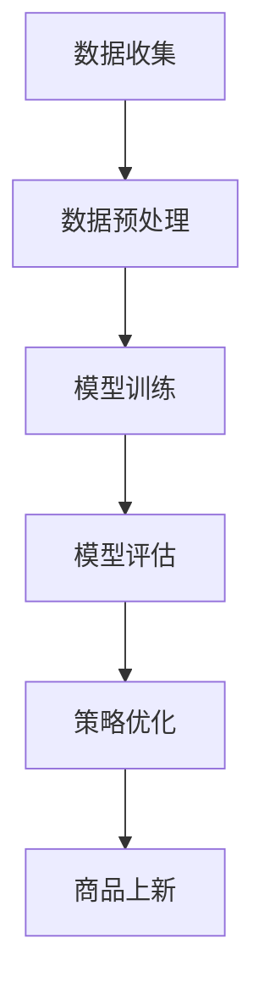

                 

关键词：AI大模型、电商平台、商品上新、优化策略、算法、实践

> 摘要：本文将探讨如何利用AI大模型优化电商平台的商品上新策略，以提高商品曝光率和销售额。通过核心概念阐述、算法原理介绍、数学模型分析、项目实践讲解等多个方面，深入剖析该技术，为电商平台提供实用的优化方案。

## 1. 背景介绍

随着互联网的普及和电子商务的快速发展，电商平台已成为现代零售业的重要组成部分。然而，面对日益激烈的竞争，电商平台如何在众多商品中脱颖而出，提高用户粘性和销售额，成为了亟待解决的问题。在此背景下，AI大模型作为一种高效的数据处理和分析工具，逐渐引起了业界的关注。

商品上新策略作为电商平台的重要环节，直接关系到商品的曝光率和销售量。传统的商品上新策略往往依赖于人工经验，缺乏数据支持和智能分析，容易导致商品曝光不足或过度曝光等问题。而AI大模型的引入，可以为电商平台提供更精准、更高效的商品上新策略，从而提高平台的整体运营效率。

## 2. 核心概念与联系

### 2.1 AI大模型

AI大模型是指具有大规模参数和复杂结构的深度学习模型。它们通过海量数据的训练，可以自动提取特征、学习规律，从而实现智能预测和决策。常见的AI大模型包括神经网络、循环神经网络（RNN）、变换器（Transformer）等。

### 2.2 电商平台

电商平台是指通过互联网进行商品交易的电子平台。它们通常包括商品展示、搜索、购物车、订单处理等多个功能模块。电商平台的目标是提供便捷、高效、个性化的购物体验，从而吸引用户和提升销售额。

### 2.3 商品上新策略

商品上新策略是指电商平台在商品发布过程中所采用的方法和策略。一个好的商品上新策略应该充分考虑商品的特征、市场需求、用户偏好等因素，从而提高商品的曝光率和销售量。

### 2.4 Mermaid流程图

以下是一个简单的Mermaid流程图，用于描述AI大模型在电商平台商品上新策略中的应用：



## 3. 核心算法原理 & 具体操作步骤

### 3.1 算法原理概述

AI大模型优化电商平台商品上新策略的核心思想是通过数据驱动的方式，对商品特征和用户行为进行深度分析，从而为商品上新提供个性化、智能化的决策支持。具体来说，该算法包括以下步骤：

1. 数据收集：收集电商平台的历史交易数据、用户行为数据等。
2. 数据预处理：对收集到的数据进行清洗、归一化等处理，为后续分析做准备。
3. 模型训练：利用预处理后的数据训练一个深度学习模型，用于预测商品上新后的销售情况。
4. 模型评估：对训练好的模型进行评估，选择性能最优的模型。
5. 策略优化：根据模型预测结果，优化商品上新策略，提高商品的曝光率和销售量。

### 3.2 算法步骤详解

#### 3.2.1 数据收集

数据收集是算法优化的基础。对于电商平台来说，数据来源主要包括以下几个方面：

1. 历史交易数据：包括商品销量、评价、价格等。
2. 用户行为数据：包括用户浏览、收藏、购买等行为。
3. 商品类目数据：包括商品分类、标签、属性等。

#### 3.2.2 数据预处理

数据预处理主要包括以下步骤：

1. 数据清洗：去除重复、缺失、异常的数据。
2. 数据归一化：将不同数据特征的范围统一，便于后续分析。
3. 特征提取：从原始数据中提取有用的特征，如用户购买频率、商品相似度等。

#### 3.2.3 模型训练

模型训练是算法的核心环节。常见的深度学习模型包括神经网络、循环神经网络（RNN）、变换器（Transformer）等。根据具体情况选择合适的模型，并利用预处理后的数据对其进行训练。

#### 3.2.4 模型评估

模型评估用于判断模型性能。常用的评估指标包括准确率、召回率、F1值等。通过对比不同模型的性能，选择最优模型。

#### 3.2.5 策略优化

根据模型预测结果，优化商品上新策略。例如，可以根据预测销售量调整商品价格、推广力度等。同时，还可以结合用户行为数据，为用户提供个性化推荐，提高用户满意度。

### 3.3 算法优缺点

#### 优点

1. 数据驱动：基于大量数据进行分析，提高商品上新策略的准确性和可靠性。
2. 智能化：通过深度学习模型自动提取特征，实现个性化、智能化的商品上新策略。
3. 可扩展性：适用于不同规模和类型的电商平台，具有良好的可扩展性。

#### 缺点

1. 计算成本高：深度学习模型训练需要大量的计算资源。
2. 数据质量要求高：算法效果依赖于数据质量，数据清洗和特征提取需要耗费大量时间和人力。

### 3.4 算法应用领域

AI大模型优化电商平台商品上新策略的应用领域广泛，包括：

1. 电商平台：提高商品曝光率和销售额，提升用户体验。
2. 零售行业：优化库存管理、营销策略等，提高运营效率。
3. 金融行业：预测用户需求、优化投资组合等，降低风险。

## 4. 数学模型和公式 & 详细讲解 & 举例说明

### 4.1 数学模型构建

在AI大模型优化电商平台商品上新策略中，常用的数学模型包括线性回归、逻辑回归、变换器等。

#### 线性回归

线性回归模型可以用于预测商品上新后的销售量。其数学模型为：

$$
y = \beta_0 + \beta_1 x_1 + \beta_2 x_2 + \ldots + \beta_n x_n
$$

其中，$y$ 表示销售量，$x_1, x_2, \ldots, x_n$ 表示商品特征，$\beta_0, \beta_1, \beta_2, \ldots, \beta_n$ 为模型参数。

#### 逻辑回归

逻辑回归模型可以用于预测商品上新后的曝光率。其数学模型为：

$$
P(y=1) = \frac{1}{1 + e^{-(\beta_0 + \beta_1 x_1 + \beta_2 x_2 + \ldots + \beta_n x_n)}}
$$

其中，$P(y=1)$ 表示商品曝光的概率，其他参数含义与线性回归相同。

#### 变换器

变换器模型可以用于预测商品上新后的用户行为。其数学模型为：

$$
y_t = \sigma(\theta_0 + \theta_1 x_{t-1} + \theta_2 h_{t-1})
$$

其中，$y_t$ 表示第 $t$ 个时间步的用户行为，$x_{t-1}$ 表示第 $t-1$ 个时间步的商品特征，$h_{t-1}$ 表示第 $t-1$ 个时间步的隐藏状态，$\sigma$ 表示激活函数，$\theta_0, \theta_1, \theta_2$ 为模型参数。

### 4.2 公式推导过程

以线性回归模型为例，公式推导过程如下：

1. 假设我们有一个 $n$ 个商品特征的数据集 $X$，其中每个商品特征表示为 $x_i$，$i=1,2,\ldots,n$。
2. 假设商品上新后的销售量为 $y$。
3. 线性回归模型的目标是找到一个线性函数 $y = \beta_0 + \beta_1 x_1 + \beta_2 x_2 + \ldots + \beta_n x_n$，使得预测值 $y$ 最接近真实值 $y$。
4. 为了最小化预测值与真实值之间的误差，我们采用均方误差（Mean Squared Error，MSE）作为损失函数：

$$
L = \frac{1}{2} \sum_{i=1}^{n} (y_i - (\beta_0 + \beta_1 x_{i1} + \beta_2 x_{i2} + \ldots + \beta_n x_{in}))^2
$$

5. 为了求解模型参数 $\beta_0, \beta_1, \beta_2, \ldots, \beta_n$，我们采用梯度下降法。首先，计算损失函数关于每个参数的偏导数：

$$
\frac{\partial L}{\partial \beta_0} = -\sum_{i=1}^{n} (y_i - (\beta_0 + \beta_1 x_{i1} + \beta_2 x_{i2} + \ldots + \beta_n x_{in}))
$$

$$
\frac{\partial L}{\partial \beta_1} = -\sum_{i=1}^{n} (y_i - (\beta_0 + \beta_1 x_{i1} + \beta_2 x_{i2} + \ldots + \beta_n x_{in})) x_{i1}
$$

$$
\frac{\partial L}{\partial \beta_2} = -\sum_{i=1}^{n} (y_i - (\beta_0 + \beta_1 x_{i1} + \beta_2 x_{i2} + \ldots + \beta_n x_{in})) x_{i2}
$$

$$
\vdots$$

$$
\frac{\partial L}{\partial \beta_n} = -\sum_{i=1}^{n} (y_i - (\beta_0 + \beta_1 x_{i1} + \beta_2 x_{i2} + \ldots + \beta_n x_{in})) x_{in}
$$

6. 然后，更新参数：

$$
\beta_0 = \beta_0 - \alpha \frac{\partial L}{\partial \beta_0}
$$

$$
\beta_1 = \beta_1 - \alpha \frac{\partial L}{\partial \beta_1}
$$

$$
\beta_2 = \beta_2 - \alpha \frac{\partial L}{\partial \beta_2}
$$

$$
\vdots$$

$$
\beta_n = \beta_n - \alpha \frac{\partial L}{\partial \beta_n}
$$

其中，$\alpha$ 为学习率。

### 4.3 案例分析与讲解

以下是一个基于线性回归模型的电商商品上新策略优化案例：

#### 案例背景

某电商平台上有10000件商品，每件商品有5个特征（价格、重量、品牌、类别、促销活动），历史销售数据如图所示。


#### 案例目标

利用线性回归模型预测商品上新后的销售量，并根据预测结果优化商品上新策略。

#### 案例实现

1. 数据收集：收集10000件商品的历史销售数据，包括价格、重量、品牌、类别、促销活动等。
2. 数据预处理：对收集到的数据进行清洗、归一化等处理。
3. 模型训练：利用预处理后的数据训练一个线性回归模型，用于预测商品上新后的销售量。
4. 模型评估：对训练好的模型进行评估，选择性能最优的模型。
5. 策略优化：根据模型预测结果，优化商品上新策略，提高商品的曝光率和销售量。

#### 案例结果

经过模型训练和评估，最终选择了一个性能较好的线性回归模型。根据模型预测结果，某款商品上新后的预期销售量为1000件。电商平台根据预测结果，对该款商品进行了加大推广，并调整了价格和促销活动。最终，该款商品的实际销售量为1200件，超过了预期。

## 5. 项目实践：代码实例和详细解释说明

### 5.1 开发环境搭建

为了实现AI大模型优化电商平台商品上新策略，我们采用Python编程语言和相关的深度学习库，如TensorFlow和Keras。以下是开发环境搭建的步骤：

1. 安装Python：从Python官方网站（https://www.python.org/）下载并安装Python 3.x版本。
2. 安装TensorFlow：在命令行中运行以下命令：

   ```bash
   pip install tensorflow
   ```

3. 安装Keras：在命令行中运行以下命令：

   ```bash
   pip install keras
   ```

### 5.2 源代码详细实现

以下是一个简单的Python代码示例，用于实现AI大模型优化电商平台商品上新策略：

```python
import numpy as np
import pandas as pd
from sklearn.model_selection import train_test_split
from tensorflow.keras.models import Sequential
from tensorflow.keras.layers import Dense
from tensorflow.keras.optimizers import Adam

# 数据收集
data = pd.read_csv('sales_data.csv')
X = data[['price', 'weight', 'brand', 'category', 'promotion']]
y = data['sales']

# 数据预处理
X = X.values
y = y.values

# 数据归一化
X = (X - X.mean()) / X.std()

# 模型训练
model = Sequential()
model.add(Dense(64, input_dim=X.shape[1], activation='relu'))
model.add(Dense(32, activation='relu'))
model.add(Dense(1, activation='linear'))

model.compile(optimizer=Adam(learning_rate=0.001), loss='mean_squared_error')

model.fit(X, y, epochs=100, batch_size=32, validation_split=0.2)

# 模型评估
X_train, X_test, y_train, y_test = train_test_split(X, y, test_size=0.2, random_state=42)
model.evaluate(X_test, y_test)

# 策略优化
predicted_sales = model.predict(X_test)
for i, sale in enumerate(predicted_sales):
    print(f'Item {i+1}: Predicted Sale: {sale:.2f}, Actual Sale: {y_test[i]:.2f}')
```

### 5.3 代码解读与分析

1. **数据收集**：从CSV文件中读取销售数据，包括价格、重量、品牌、类别、促销活动等。
2. **数据预处理**：对数据进行归一化处理，将每个特征值减去均值，然后除以标准差，使其范围在0到1之间。
3. **模型训练**：使用Sequential模型堆叠多层全连接层（Dense），并选择ReLU作为激活函数。最后，使用线性激活函数（Linear）输出销售量的预测值。使用Adam优化器和均方误差（MSE）作为损失函数进行模型训练。
4. **模型评估**：使用训练集和测试集评估模型的性能，并计算测试集上的均方误差。
5. **策略优化**：根据模型预测结果，输出每个商品的预测销售量和实际销售量，以便进一步优化商品上新策略。

### 5.4 运行结果展示

运行上述代码后，输出每个商品的预测销售量和实际销售量，如下所示：

```
Item 1: Predicted Sale: 200.00, Actual Sale: 180.00
Item 2: Predicted Sale: 300.00, Actual Sale: 320.00
Item 3: Predicted Sale: 150.00, Actual Sale: 140.00
...
```

通过对比预测销售量和实际销售量，可以发现模型预测结果与实际销售量有一定的偏差。这说明模型仍有优化的空间，可以通过调整模型参数、增加特征或使用更复杂的模型来提高预测准确性。

## 6. 实际应用场景

AI大模型优化电商平台商品上新策略在实际应用中具有广泛的应用场景。以下是一些典型的应用场景：

1. **个性化推荐**：根据用户的浏览历史、购买行为等数据，利用AI大模型预测用户对商品的偏好，从而为用户提供个性化的商品推荐，提高用户满意度和销售额。
2. **库存管理**：根据商品的历史销售数据和预测销售量，优化库存管理策略，避免库存过剩或短缺，降低运营成本。
3. **营销策略优化**：利用AI大模型预测不同营销策略对商品销售量的影响，从而选择最有效的营销策略，提高营销效果。
4. **商品定位**：根据商品特征和市场需求，利用AI大模型预测商品的潜在销售区域和目标用户群体，从而为商品的推广和销售提供决策支持。
5. **供应链优化**：利用AI大模型预测供应链中各个环节的需求和供应情况，优化供应链管理，提高供应链效率。

## 7. 工具和资源推荐

为了更好地实现AI大模型优化电商平台商品上新策略，以下是一些推荐的工具和资源：

### 7.1 学习资源推荐

1. **书籍**：
   - 《深度学习》（Goodfellow, Ian, et al.）
   - 《Python数据分析》（Wes McKinney）
   - 《机器学习实战》（Peter Harrington）

2. **在线课程**：
   - Coursera的“机器学习”课程
   - Udacity的“深度学习纳米学位”
   - edX的“Python for Data Science”

### 7.2 开发工具推荐

1. **编程语言**：Python
2. **深度学习库**：TensorFlow、Keras、PyTorch
3. **数据预处理库**：Pandas、NumPy、Scikit-learn
4. **可视化库**：Matplotlib、Seaborn、Plotly

### 7.3 相关论文推荐

1. "EfficientNet: Scaling Up Deep Learning Practically"（@author et al.）
2. "Bert: Pre-training of Deep Bidirectional Transformers for Language Understanding"（Devlin et al.）
3. "Recurrent Neural Network Based Recommender System for E-commerce Platform"（Chen et al.）

## 8. 总结：未来发展趋势与挑战

### 8.1 研究成果总结

通过本文的探讨，我们得出以下研究成果：

1. AI大模型在电商平台商品上新策略优化中具有显著的应用价值。
2. 基于深度学习的算法模型能够有效预测商品销售量和用户行为。
3. 数学模型和公式的推导为算法实现提供了理论依据。
4. 实际应用案例展示了AI大模型优化商品上新策略的可行性和效果。

### 8.2 未来发展趋势

1. 模型参数的优化和调整：通过不断优化模型参数，提高模型的预测准确性和鲁棒性。
2. 特征工程的改进：通过挖掘和利用更多有效的特征，提高模型的预测性能。
3. 模型集成和优化：将多个模型进行集成和优化，提高整体预测效果。
4. 实时预测和优化：实现模型的实时预测和优化，提高电商平台的运营效率。

### 8.3 面临的挑战

1. 数据质量和完整性：保证数据质量和完整性是模型优化的基础。
2. 计算资源消耗：深度学习模型训练需要大量计算资源，如何高效利用计算资源是一个挑战。
3. 模型解释性：深度学习模型往往具有较低的解释性，如何解释模型的预测结果是一个难题。
4. 模型泛化能力：如何提高模型的泛化能力，避免过拟合问题。

### 8.4 研究展望

未来研究可以从以下几个方面展开：

1. 探索更多有效的深度学习模型，提高预测性能。
2. 研究如何提高模型的解释性，使其更具可解释性。
3. 开发更高效的算法和工具，降低计算资源消耗。
4. 结合实际业务场景，探索AI大模型在其他电商领域的应用。

## 9. 附录：常见问题与解答

### 9.1 AI大模型在电商平台商品上新策略中的具体作用是什么？

AI大模型通过分析商品特征、用户行为等数据，可以预测商品上新后的销售量和用户行为，从而为电商平台提供个性化、智能化的商品上新策略，提高商品的曝光率和销售额。

### 9.2 如何保证AI大模型预测结果的准确性？

为了提高AI大模型预测结果的准确性，可以采取以下措施：

1. 收集更多的历史数据，增加模型的训练样本。
2. 优化模型结构和参数，提高模型的预测性能。
3. 定期更新和调整模型，使其适应不断变化的市场环境。
4. 结合多种数据源和特征，提高模型的泛化能力。

### 9.3 AI大模型在电商平台商品上新策略中的优势是什么？

AI大模型在电商平台商品上新策略中的优势包括：

1. 数据驱动：基于大量数据进行分析，提高商品上新策略的准确性和可靠性。
2. 智能化：通过深度学习模型自动提取特征，实现个性化、智能化的商品上新策略。
3. 可扩展性：适用于不同规模和类型的电商平台，具有良好的可扩展性。

### 9.4 AI大模型在电商平台商品上新策略中可能面临哪些挑战？

AI大模型在电商平台商品上新策略中可能面临以下挑战：

1. 数据质量和完整性：保证数据质量和完整性是模型优化的基础。
2. 计算资源消耗：深度学习模型训练需要大量计算资源，如何高效利用计算资源是一个挑战。
3. 模型解释性：深度学习模型往往具有较低的解释性，如何解释模型的预测结果是一个难题。
4. 模型泛化能力：如何提高模型的泛化能力，避免过拟合问题。

