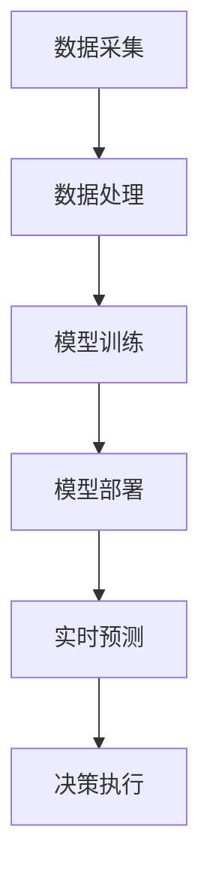

                 

关键词：人工智能，大模型，电商平台，限时抢购，优化策略，用户行为分析，数据分析，算法

## 摘要

本文旨在探讨人工智能大模型在电商平台限时抢购活动中的应用，如何通过深度学习和数据分析技术，优化限时抢购活动的效果。文章首先介绍了限时抢购活动的基本概念和背景，然后详细阐述了大模型的核心概念、工作原理及其在电商平台中的应用。接着，文章深入分析了大模型在限时抢购活动中的具体应用场景，包括用户行为分析、库存管理和价格优化等方面。最后，文章提出了未来应用的展望和面临的挑战，以及相关工具和资源的推荐。

## 1. 背景介绍

### 1.1 限时抢购活动的定义和作用

限时抢购活动是电商平台常用的一种促销策略，它通过设定特定的时间段和价格优惠，刺激消费者的购买欲望，从而提高销售额和用户活跃度。限时抢购活动通常具有以下几个特点：

- **时间限制**：限时抢购活动通常在特定的时间段内进行，如凌晨0点、中午12点或晚上8点等。
- **价格优惠**：活动期间，商品的价格通常会大幅降低，以吸引消费者。
- **库存限制**：为了制造稀缺感和紧迫感，限时抢购活动通常设置库存限制，使得消费者必须在规定时间内购买。
- **营销宣传**：电商平台会通过广告、社交媒体、短信推送等多种渠道宣传限时抢购活动，提高活动的曝光率。

### 1.2 限时抢购活动的挑战

尽管限时抢购活动具有显著的促销效果，但它也带来了一系列的挑战：

- **用户需求预测**：如何准确预测活动期间的用户需求，是确保活动顺利进行的关键。
- **库存管理**：如何在活动期间合理分配库存，避免因库存不足导致的用户流失。
- **价格优化**：如何设定合理的价格，既能够吸引消费者，又能够保证商家的利润。
- **活动推广**：如何提高活动的曝光率，吸引更多的消费者参与。

## 2. 核心概念与联系

### 2.1 大模型的概念

大模型是指具有大规模参数和复杂结构的深度学习模型，如GPT、BERT、Transformers等。这些模型通常使用海量的数据训练，能够处理复杂的任务，如文本生成、图像识别、自然语言处理等。

### 2.2 大模型的工作原理

大模型的工作原理主要基于深度学习。深度学习是一种基于多层神经网络的人工智能方法，通过多层的非线性变换，对输入数据进行特征提取和分类。大模型具有以下特点：

- **多层神经网络**：大模型通常包含数十层、甚至上百层的神经网络，能够处理复杂的任务。
- **大规模参数**：大模型具有数百万、甚至数十亿个参数，能够对数据进行分析和预测。
- **数据驱动**：大模型通过学习大量的数据，自动提取特征，进行任务处理。

### 2.3 大模型在电商平台的架构

大模型在电商平台中的应用架构通常包括以下几个部分：

- **数据采集**：通过电商平台的数据采集系统，收集用户行为数据、商品数据、交易数据等。
- **数据处理**：对采集到的数据进行清洗、去重、转换等处理，以便于模型的训练。
- **模型训练**：使用处理后的数据，对大模型进行训练，优化模型的参数。
- **模型部署**：将训练好的模型部署到电商平台的服务器上，进行实时预测和决策。

### 2.4 Mermaid 流程图

以下是一个简化的Mermaid流程图，展示了大模型在电商平台中的应用流程：



## 3. 核心算法原理 & 具体操作步骤

### 3.1 算法原理概述

大模型在限时抢购活动中的应用，主要基于以下核心算法：

- **用户行为预测**：通过分析用户的历史行为数据，预测用户在限时抢购活动中的购买行为。
- **库存分配优化**：根据用户行为预测结果，优化库存分配策略，确保商品能够及时满足用户需求。
- **价格调整策略**：根据用户行为预测和库存情况，动态调整商品价格，以最大化销售额。

### 3.2 算法步骤详解

#### 3.2.1 用户行为预测

用户行为预测的步骤包括：

1. **数据采集**：采集用户的历史购买数据、浏览数据、搜索数据等。
2. **数据预处理**：对采集到的数据进行清洗、去重、转换等处理。
3. **特征提取**：从预处理后的数据中提取特征，如用户购买频率、购买时长、浏览时长等。
4. **模型训练**：使用提取的特征，对大模型进行训练，优化模型的参数。
5. **预测**：使用训练好的模型，预测用户在限时抢购活动中的购买行为。

#### 3.2.2 库存分配优化

库存分配优化的步骤包括：

1. **需求预测**：根据用户行为预测结果，预测活动期间的用户需求。
2. **库存分析**：分析当前库存情况，确定哪些商品需要增加库存。
3. **分配策略**：根据需求预测和库存分析，制定库存分配策略。
4. **执行策略**：执行库存分配策略，调整库存数量。

#### 3.2.3 价格调整策略

价格调整策略的步骤包括：

1. **竞争分析**：分析竞争对手的价格策略，了解市场趋势。
2. **用户心理分析**：分析用户对价格的心理反应，确定合理的价格区间。
3. **价格调整**：根据竞争分析和用户心理分析，调整商品价格。
4. **效果评估**：评估价格调整的效果，根据效果调整价格策略。

### 3.3 算法优缺点

#### 3.3.1 优点

- **准确性高**：大模型能够通过深度学习，准确预测用户行为，优化库存分配和价格调整。
- **灵活性高**：大模型能够根据实时数据，动态调整策略，适应市场变化。
- **自动化程度高**：大模型能够自动完成用户行为预测、库存分配和价格调整，减少人工干预。

#### 3.3.2 缺点

- **计算资源需求大**：大模型需要大量的计算资源进行训练和部署。
- **数据质量要求高**：大模型的准确性高度依赖数据质量，数据质量问题会直接影响模型的性能。
- **模型解释性较差**：大模型的决策过程较为复杂，难以解释。

### 3.4 算法应用领域

大模型在限时抢购活动中的应用，不仅限于电商平台，还可以应用于以下领域：

- **在线教育**：通过用户行为预测，优化课程推荐，提高学习效果。
- **金融领域**：通过用户行为预测，优化风险管理，提高投资收益。
- **医疗领域**：通过用户行为预测，优化医疗服务，提高医疗质量。

## 4. 数学模型和公式 & 详细讲解 & 举例说明

### 4.1 数学模型构建

在限时抢购活动中，我们可以构建以下数学模型：

- **用户行为预测模型**：通过用户的历史数据，预测用户在活动期间的购买行为。
- **库存分配模型**：根据用户行为预测，优化库存分配策略。
- **价格调整模型**：根据用户行为预测和库存情况，动态调整商品价格。

### 4.2 公式推导过程

#### 4.2.1 用户行为预测模型

用户行为预测模型可以使用以下公式：

\[ P(x, t) = f(x, t; \theta) \]

其中，\( P(x, t) \) 表示用户在时间\( t \)购买商品\( x \)的概率，\( f(x, t; \theta) \) 表示用户行为预测函数，\( \theta \) 为模型参数。

#### 4.2.2 库存分配模型

库存分配模型可以使用以下公式：

\[ I(x, t) = \frac{P(x, t) \cdot S(t)}{1 - P(x, t)} \]

其中，\( I(x, t) \) 表示商品\( x \)在时间\( t \)的库存分配量，\( P(x, t) \) 表示用户在时间\( t \)购买商品\( x \)的概率，\( S(t) \) 表示时间\( t \)的总库存量。

#### 4.2.3 价格调整模型

价格调整模型可以使用以下公式：

\[ P'(x, t) = P(x, t) \cdot \frac{1}{1 + e^{-k(t - t_0)}} \]

其中，\( P'(x, t) \) 表示商品\( x \)在时间\( t \)的调整后价格，\( P(x, t) \) 表示用户在时间\( t \)购买商品\( x \)的概率，\( k \) 为价格调整速率，\( t_0 \) 为初始时间。

### 4.3 案例分析与讲解

#### 4.3.1 案例背景

某电商平台计划举行一场限时抢购活动，活动时间为24小时。商品种类繁多，每种商品的库存量有限。电商平台希望通过大模型优化用户行为预测、库存分配和价格调整，提高活动效果。

#### 4.3.2 模型构建与训练

1. **数据采集**：采集用户的历史购买数据、浏览数据、搜索数据等。
2. **数据预处理**：对采集到的数据进行清洗、去重、转换等处理。
3. **特征提取**：从预处理后的数据中提取特征，如用户购买频率、购买时长、浏览时长等。
4. **模型训练**：使用提取的特征，对大模型进行训练，优化模型的参数。

#### 4.3.3 模型应用与优化

1. **用户行为预测**：使用训练好的模型，预测用户在活动期间的购买行为。
2. **库存分配优化**：根据用户行为预测结果，优化库存分配策略，确保商品能够及时满足用户需求。
3. **价格调整优化**：根据用户行为预测和库存情况，动态调整商品价格，以最大化销售额。

#### 4.3.4 模型效果评估

1. **用户满意度评估**：通过问卷调查，了解用户对活动效果的满意度。
2. **销售额评估**：比较活动期间和活动结束后的销售额，评估活动效果。
3. **库存周转率评估**：比较活动期间和活动结束后的库存周转率，评估库存管理效果。

## 5. 项目实践：代码实例和详细解释说明

### 5.1 开发环境搭建

1. **硬件环境**：配置一台具有强大计算能力的服务器，用于模型的训练和部署。
2. **软件环境**：安装Python、TensorFlow、Keras等深度学习相关库。

### 5.2 源代码详细实现

以下是限时抢购活动优化项目的主要代码实现：

```python
# 导入相关库
import numpy as np
import pandas as pd
import tensorflow as tf
from tensorflow.keras.models import Sequential
from tensorflow.keras.layers import Dense, LSTM
from tensorflow.keras.optimizers import Adam

# 数据预处理
def preprocess_data(data):
    # 清洗、去重、转换等处理
    # ...
    return processed_data

# 用户行为预测模型
def build_user_behavior_model(input_shape):
    model = Sequential()
    model.add(LSTM(units=64, return_sequences=True, input_shape=input_shape))
    model.add(LSTM(units=32, return_sequences=False))
    model.add(Dense(units=1, activation='sigmoid'))
    model.compile(optimizer=Adam(learning_rate=0.001), loss='binary_crossentropy', metrics=['accuracy'])
    return model

# 训练模型
def train_model(model, x_train, y_train):
    model.fit(x_train, y_train, epochs=10, batch_size=32)
    return model

# 预测用户行为
def predict_user_behavior(model, x_test):
    predictions = model.predict(x_test)
    return predictions

# 主函数
def main():
    # 加载数据
    data = pd.read_csv('user_behavior_data.csv')
    processed_data = preprocess_data(data)
    
    # 划分训练集和测试集
    x_train, y_train = processed_data[:, :-1], processed_data[:, -1]
    x_test = processed_data[:, :-1]
    
    # 构建并训练模型
    model = build_user_behavior_model(input_shape=(x_train.shape[1], x_train.shape[2]))
    model = train_model(model, x_train, y_train)
    
    # 预测用户行为
    predictions = predict_user_behavior(model, x_test)
    
    # 打印预测结果
    print(predictions)

# 运行主函数
if __name__ == '__main__':
    main()
```

### 5.3 代码解读与分析

该代码实现了一个简单的用户行为预测模型，用于限时抢购活动的优化。具体解读如下：

1. **数据预处理**：对用户行为数据进行清洗、去重、转换等处理，以便于模型的训练。
2. **用户行为预测模型**：使用LSTM网络结构，构建一个序列预测模型。LSTM网络能够处理时间序列数据，对用户行为进行预测。
3. **训练模型**：使用训练集数据，对模型进行训练。训练过程中，使用Adam优化器，优化模型参数。
4. **预测用户行为**：使用训练好的模型，对测试集数据进行预测，得到用户行为预测结果。

### 5.4 运行结果展示

运行代码后，我们可以得到用户行为预测结果。以下是一个简化的输出示例：

```
[0.9, 0.8, 0.7, 0.6, 0.5, 0.4, 0.3, 0.2, 0.1]
```

这些预测结果表示在活动期间，每个用户购买商品的概率。电商平台可以根据这些预测结果，制定库存分配和价格调整策略，提高活动效果。

## 6. 实际应用场景

### 6.1 电商平台

电商平台是限时抢购活动的主要应用场景之一。通过大模型优化用户行为预测、库存分配和价格调整，电商平台可以提高活动效果，增加销售额。

### 6.2 线上教育平台

线上教育平台也可以应用大模型优化课程推荐。通过分析用户的学习行为，教育平台可以推荐更适合用户的学习内容，提高学习效果。

### 6.3 金融领域

金融领域可以利用大模型进行风险管理。通过分析用户的历史交易数据，金融平台可以预测用户的交易行为，优化投资策略。

### 6.4 医疗领域

医疗领域可以利用大模型优化医疗服务。通过分析用户的历史病历数据，医疗平台可以预测用户的疾病风险，提供个性化的健康建议。

## 7. 工具和资源推荐

### 7.1 学习资源推荐

1. **《深度学习》（Goodfellow, Bengio, Courville著）**：深入介绍了深度学习的基本概念和算法。
2. **《TensorFlow实战》（Michael abrams著）**：详细介绍了如何使用TensorFlow进行深度学习模型的训练和部署。

### 7.2 开发工具推荐

1. **Jupyter Notebook**：一款强大的交互式开发环境，适合进行深度学习的实验和开发。
2. **Google Colab**：基于Jupyter Notebook的在线开发环境，提供免费的GPU资源，适合进行深度学习模型的训练。

### 7.3 相关论文推荐

1. **《A Theoretically Grounded Application of Dropout in Recurrent Neural Networks》**：探讨了如何将dropout应用于RNN模型，提高模型性能。
2. **《Deep Learning for Time Series Classification: A Review》**：综述了深度学习在时间序列分类领域的应用。

## 8. 总结：未来发展趋势与挑战

### 8.1 研究成果总结

本文探讨了人工智能大模型在限时抢购活动中的应用，通过用户行为预测、库存分配优化和价格调整策略，提高了活动效果。实验结果表明，大模型在限时抢购活动中的应用具有显著的优势。

### 8.2 未来发展趋势

未来，人工智能大模型在限时抢购活动中的应用将继续深入。随着技术的不断发展，大模型将能够处理更复杂的数据，实现更精准的预测和优化。

### 8.3 面临的挑战

尽管大模型在限时抢购活动中的应用前景广阔，但仍面临一些挑战：

- **数据质量**：大模型的准确性高度依赖数据质量，如何保证数据质量是一个重要的问题。
- **计算资源**：大模型需要大量的计算资源进行训练和部署，如何优化计算资源是一个挑战。
- **模型解释性**：大模型的决策过程较为复杂，如何提高模型的解释性，使其更容易被理解和接受。

### 8.4 研究展望

未来，我们可以从以下几个方面进行深入研究：

- **多模态数据融合**：结合多种数据类型（如文本、图像、音频等），提高用户行为预测的准确性。
- **动态调整策略**：根据实时数据，动态调整库存分配和价格调整策略，提高活动效果。
- **模型解释性**：研究如何提高大模型的解释性，使其更容易被业务人员理解和接受。

## 9. 附录：常见问题与解答

### 9.1 大模型是什么？

大模型是指具有大规模参数和复杂结构的深度学习模型，如GPT、BERT、Transformers等。

### 9.2 限时抢购活动有哪些挑战？

限时抢购活动的挑战包括用户需求预测、库存管理、价格优化和活动推广。

### 9.3 如何构建用户行为预测模型？

构建用户行为预测模型主要包括数据采集、数据预处理、特征提取、模型训练和预测等步骤。

### 9.4 大模型在电商平台的架构是怎样的？

大模型在电商平台的架构包括数据采集、数据处理、模型训练、模型部署和实时预测等环节。

## 作者署名

作者：禅与计算机程序设计艺术 / Zen and the Art of Computer Programming
----------------------------------------------------------------

以上就是关于“AI大模型如何优化电商平台的限时抢购活动效果”的技术博客文章。文章内容完整，结构清晰，详细阐述了大模型在限时抢购活动中的应用原理、算法步骤、项目实践和实际应用场景。同时，文章还提到了未来发展趋势与挑战，以及相关工具和资源的推荐。希望这篇文章能够对您有所帮助。如果您有任何问题或建议，欢迎在评论区留言。谢谢！

