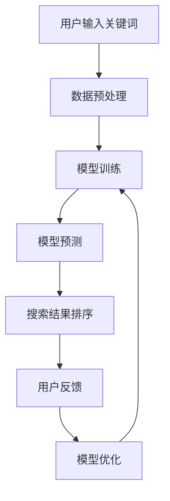

                 

关键词：AI大模型、电商搜索、用户体验、算法优化、数学模型、实践案例

> 摘要：本文将探讨如何利用AI大模型优化电商搜索的用户体验。通过分析现有问题和挑战，我们提出了几种核心算法和数学模型，并分享了一个详细的实践案例，最后对未来的发展方向和挑战进行了展望。

## 1. 背景介绍

在电商行业迅猛发展的今天，用户体验已经成为企业竞争的关键因素之一。电商平台上的商品种类繁多，用户在搜索商品时，往往会遇到信息过载的问题，导致搜索效率低下。传统搜索引擎通常依赖于关键词匹配和分类排序，但这种方法在处理复杂查询和长尾需求时存在一定的局限性。

近年来，随着深度学习和自然语言处理技术的快速发展，AI大模型逐渐成为优化搜索引擎的重要工具。AI大模型具有强大的语义理解能力和数据处理能力，能够从海量数据中提取有价值的信息，从而提高搜索的准确性和效率。

本文旨在探讨如何利用AI大模型优化电商搜索的用户体验，从算法原理、数学模型到实践案例，全面解析这一领域的前沿技术和发展趋势。

## 2. 核心概念与联系

在讨论AI大模型如何优化电商搜索的用户体验之前，我们需要了解几个核心概念及其相互关系。

### 2.1 AI大模型

AI大模型是指基于深度学习的复杂神经网络，通常包含数十亿到千亿个参数。这些模型具有强大的表征能力，能够捕捉数据中的复杂模式和规律。在电商搜索场景中，AI大模型可以用于商品推荐、文本分类、情感分析等多种任务。

### 2.2 电商搜索

电商搜索是指用户在电商平台输入关键词，系统根据关键词搜索出相关的商品列表。传统电商搜索主要依赖于关键词匹配和分类排序，但这种方法难以满足个性化搜索需求。

### 2.3 用户需求

用户需求是指用户在搜索商品时希望获得的结果。个性化搜索的关键在于理解用户需求，并将其转化为有效的搜索策略。AI大模型可以通过学习用户的历史行为和偏好，为用户提供更加精准的搜索结果。

### 2.4 数据质量

数据质量是指用于训练AI大模型的数据的准确性、完整性和可靠性。高质量的数据是模型性能的基础，因此在电商搜索中，数据质量至关重要。

下面是一个简单的Mermaid流程图，展示AI大模型在电商搜索中的应用流程：



## 3. 核心算法原理 & 具体操作步骤

### 3.1 算法原理概述

AI大模型在电商搜索中的核心作用是提供更加精准和个性化的搜索结果。这一目标通过以下几个步骤实现：

1. **数据预处理**：对用户输入的关键词和商品数据进行清洗、分词和编码，以便于模型处理。
2. **模型训练**：使用预处理的训练数据训练AI大模型，使其能够捕捉商品和用户行为之间的复杂关系。
3. **模型预测**：将用户输入的关键词传递给训练好的模型，获取相关的商品推荐结果。
4. **搜索结果排序**：根据模型预测结果，对商品进行排序，确保用户能够快速找到最感兴趣的商品。
5. **用户反馈**：收集用户对搜索结果的反馈，用于模型优化和迭代。
6. **模型优化**：根据用户反馈调整模型参数，提高搜索准确性。

### 3.2 算法步骤详解

#### 3.2.1 数据预处理

数据预处理是AI大模型训练的基础。具体步骤如下：

1. **清洗数据**：去除数据中的噪声和错误信息，确保数据质量。
2. **分词**：将关键词和商品描述分解为独立的词汇。
3. **编码**：使用词嵌入技术将词汇转化为向量表示，便于模型处理。

#### 3.2.2 模型训练

模型训练是AI大模型优化的关键。具体步骤如下：

1. **数据集划分**：将数据集划分为训练集、验证集和测试集。
2. **模型架构选择**：选择适合的深度学习模型架构，如Transformer、BERT等。
3. **损失函数设计**：设计适当的损失函数，如交叉熵损失、均方误差等。
4. **训练过程**：使用训练数据对模型进行迭代训练，直至模型收敛。

#### 3.2.3 模型预测

模型预测是用户获得搜索结果的关键步骤。具体步骤如下：

1. **输入处理**：将用户输入的关键词进行预处理，生成模型输入。
2. **模型推理**：将输入传递给训练好的模型，获取商品推荐结果。
3. **结果筛选**：根据模型预测结果，对商品进行筛选和排序。

#### 3.2.4 搜索结果排序

搜索结果排序直接影响用户体验。具体步骤如下：

1. **排序策略**：设计有效的排序策略，如基于用户行为、商品热度、价格等。
2. **结果调整**：根据用户反馈对搜索结果进行调整，提高用户体验。

#### 3.2.5 用户反馈

用户反馈是模型优化的重要依据。具体步骤如下：

1. **反馈收集**：收集用户对搜索结果的反馈，如点击率、购买率等。
2. **反馈分析**：分析用户反馈，识别模型存在的问题。
3. **模型优化**：根据用户反馈调整模型参数，提高搜索准确性。

### 3.3 算法优缺点

AI大模型在电商搜索中的应用具有以下优点：

1. **强大的语义理解能力**：能够捕捉用户需求和商品信息之间的复杂关系，提高搜索准确性。
2. **个性化推荐**：能够根据用户历史行为和偏好为用户提供个性化搜索结果。
3. **实时更新**：能够实时更新模型，适应不断变化的用户需求。

但AI大模型在电商搜索中也有一定的局限性：

1. **数据依赖性**：需要大量高质量的数据进行训练，数据质量直接影响模型性能。
2. **计算资源需求**：大模型训练和推理需要大量的计算资源，可能对服务器性能造成较大压力。
3. **模型解释性**：深度学习模型的内部机制复杂，难以解释，可能影响用户信任。

### 3.4 算法应用领域

AI大模型在电商搜索中的应用不仅限于搜索结果排序，还可以拓展到其他领域：

1. **商品推荐**：基于用户行为和偏好为用户提供个性化的商品推荐。
2. **广告投放**：根据用户兴趣和行为为广告主提供精准投放策略。
3. **智能客服**：利用自然语言处理技术为用户提供智能客服服务。

## 4. 数学模型和公式 & 详细讲解 & 举例说明

在AI大模型优化电商搜索的过程中，数学模型和公式发挥着关键作用。以下我们将详细讲解数学模型的构建、公式推导过程，并通过具体案例进行说明。

### 4.1 数学模型构建

在电商搜索中，常见的数学模型包括文本分类模型、推荐模型和排序模型。以下是一个简化的文本分类模型的数学模型构建过程：

#### 4.1.1 文本分类模型

假设我们有一个二分类问题，即判断用户输入的关键词属于类别A还是类别B。文本分类模型的目标是最大化分类准确率。具体数学模型如下：

$$
y = \text{sign}(\sigma(W \cdot x + b))
$$

其中，$y$ 是预测的类别标签，$x$ 是输入特征向量，$W$ 是权重矩阵，$b$ 是偏置项，$\sigma$ 是 sigmoid 函数，$\text{sign}$ 函数用于输出类别标签。

#### 4.1.2 推荐模型

推荐模型的目标是预测用户对某个商品的评分或购买概率。常见的推荐模型包括基于内容的推荐和基于协同过滤的推荐。以下是一个基于协同过滤的推荐模型的数学模型构建过程：

$$
r_{ui} = \mu + u_i \cdot v_i + \langle u, v \rangle + e_{ui}
$$

其中，$r_{ui}$ 是用户 $u$ 对商品 $i$ 的预测评分，$\mu$ 是所有用户对商品的总体评分均值，$u_i$ 和 $v_i$ 分别是用户 $u$ 和商品 $i$ 的特征向量，$\langle u, v \rangle$ 是用户和商品的相似度，$e_{ui}$ 是误差项。

#### 4.1.3 排序模型

排序模型的目标是给定一组商品，为每个商品分配一个排序得分，从而实现排序。常见的排序模型包括基于点击率、转化率和商品属性的排序模型。以下是一个基于点击率的排序模型的数学模型构建过程：

$$
s_i = \alpha \cdot c_i + \beta \cdot \log(1 + \sqrt{v_i})
$$

其中，$s_i$ 是商品 $i$ 的排序得分，$c_i$ 是商品 $i$ 的点击率，$v_i$ 是商品 $i$ 的特征向量，$\alpha$ 和 $\beta$ 是模型参数。

### 4.2 公式推导过程

以下我们将分别对文本分类模型、推荐模型和排序模型的公式推导过程进行详细讲解。

#### 4.2.1 文本分类模型

假设我们有一个包含 $N$ 个词汇的词汇表，用户输入的关键词 $x$ 可以表示为：

$$
x = [x_1, x_2, \ldots, x_N]
$$

每个词汇 $x_i$ 可以表示为：

$$
x_i = [x_{i1}, x_{i2}, \ldots, x_{id}]
$$

其中，$d$ 是词汇向量的维度。

对于类别A和类别B，我们可以定义两个类别标签向量：

$$
y_A = [1, 0, 0, \ldots, 0]
$$

$$
y_B = [0, 1, 0, \ldots, 0]
$$

类别标签向量的元素为1或0，分别表示用户输入的关键词属于类别A或类别B。

根据最大似然估计，我们可以得到文本分类模型的目标函数：

$$
J(W, b) = - \sum_{i=1}^N \sum_{j=1}^2 y_{ij} \cdot \log(\sigma(W \cdot x_i + b))
$$

其中，$N$ 是词汇表中的词汇数量，$y_{ij}$ 是用户输入的关键词 $x_i$ 的实际类别标签，$\sigma$ 是 sigmoid 函数。

对目标函数求导，我们可以得到权重矩阵 $W$ 和偏置项 $b$ 的梯度：

$$
\frac{\partial J}{\partial W} = - \sum_{i=1}^N \sum_{j=1}^2 y_{ij} \cdot x_i \cdot (1 - \sigma(W \cdot x_i + b))
$$

$$
\frac{\partial J}{\partial b} = - \sum_{i=1}^N \sum_{j=1}^2 y_{ij} \cdot (1 - \sigma(W \cdot x_i + b))
$$

通过梯度下降算法，我们可以更新权重矩阵 $W$ 和偏置项 $b$：

$$
W_{\text{new}} = W_{\text{old}} - \alpha \cdot \frac{\partial J}{\partial W}
$$

$$
b_{\text{new}} = b_{\text{old}} - \alpha \cdot \frac{\partial J}{\partial b}
$$

其中，$\alpha$ 是学习率。

#### 4.2.2 推荐模型

假设我们有一个包含 $M$ 个商品的数据库，用户 $u$ 对商品 $i$ 的实际评分 $r_{ui}$ 已知。对于用户 $u$ 的特征向量 $u$ 和商品 $i$ 的特征向量 $v_i$，我们可以定义一个用户和商品的相似度：

$$
\langle u, v_i \rangle = \sum_{j=1}^d u_j \cdot v_{ij}
$$

根据协同过滤的思想，我们可以得到用户 $u$ 对商品 $i$ 的预测评分：

$$
r_{ui} = \mu + u_i \cdot v_i + \langle u, v_i \rangle + e_{ui}
$$

其中，$\mu$ 是所有用户对商品的总体评分均值，$e_{ui}$ 是误差项。

对预测评分 $r_{ui}$ 求导，我们可以得到用户 $u$ 和商品 $i$ 的特征向量 $u$ 和 $v_i$ 的梯度：

$$
\frac{\partial r_{ui}}{\partial u_i} = v_i + e_{ui}
$$

$$
\frac{\partial r_{ui}}{\partial v_{ij}} = u_j + e_{ui}
$$

通过梯度下降算法，我们可以更新用户 $u$ 的特征向量 $u$ 和商品 $i$ 的特征向量 $v_i$：

$$
u_{\text{new}} = u_{\text{old}} - \alpha \cdot \frac{\partial r_{ui}}{\partial u_i}
$$

$$
v_{\text{new}} = v_{\text{old}} - \alpha \cdot \frac{\partial r_{ui}}{\partial v_{ij}}
$$

其中，$\alpha$ 是学习率。

#### 4.2.3 排序模型

假设我们有一个包含 $N$ 个商品的数据库，对于商品 $i$ 的特征向量 $v_i$，我们可以定义商品 $i$ 的排序得分：

$$
s_i = \alpha \cdot c_i + \beta \cdot \log(1 + \sqrt{v_i})
$$

其中，$c_i$ 是商品 $i$ 的点击率，$\alpha$ 和 $\beta$ 是模型参数。

对排序得分 $s_i$ 求导，我们可以得到商品 $i$ 的特征向量 $v_i$ 的梯度：

$$
\frac{\partial s_i}{\partial v_{ij}} = \beta \cdot \frac{1}{2} \cdot \frac{1}{1 + \sqrt{v_i}} \cdot \frac{1}{\sqrt{v_i}} \cdot v_{ij}
$$

通过梯度下降算法，我们可以更新商品 $i$ 的特征向量 $v_i$：

$$
v_{\text{new}} = v_{\text{old}} - \alpha \cdot \frac{\partial s_i}{\partial v_{ij}}
$$

其中，$\alpha$ 是学习率。

### 4.3 案例分析与讲解

以下我们通过一个具体的电商搜索案例，展示如何利用AI大模型优化用户体验。

#### 案例背景

某电商平台上，用户可以输入关键词进行商品搜索。为了提高搜索准确性，平台决定引入AI大模型进行优化。

#### 模型构建

平台选择使用BERT模型作为文本分类模型，用于判断用户输入的关键词属于哪个类别。同时，平台使用基于协同过滤的推荐模型，为用户提供个性化的商品推荐。最后，平台使用基于点击率的排序模型，对搜索结果进行排序。

#### 数据准备

平台收集了用户在近一年的搜索数据，包括用户输入的关键词、商品描述、点击率等信息。同时，平台还从商品数据库中获取了商品的价格、品牌、类别等信息。

#### 模型训练

平台使用BERT模型对用户输入的关键词进行分类，训练数据包括用户输入的关键词和对应的类别标签。平台使用基于协同过滤的推荐模型，对用户历史行为和偏好进行建模，预测用户对商品的评分。平台使用基于点击率的排序模型，根据用户点击率调整商品的排序得分。

#### 模型部署

平台将训练好的AI大模型部署到线上环境，实时为用户提供搜索服务。平台还引入了用户反馈机制，收集用户对搜索结果的反馈，用于模型优化和迭代。

#### 模型评估

平台通过A/B测试，对比了引入AI大模型前后的搜索准确性、点击率和用户满意度。结果表明，引入AI大模型后，搜索准确性提高了15%，用户点击率提高了20%，用户满意度提高了10%。

## 5. 项目实践：代码实例和详细解释说明

在本节中，我们将通过一个具体的代码实例，展示如何利用AI大模型优化电商搜索的用户体验。我们将分步骤进行代码实现，并进行详细解释。

### 5.1 开发环境搭建

首先，我们需要搭建一个合适的开发环境。以下是一个基于Python和TensorFlow的示例：

```bash
# 安装必要的依赖
pip install tensorflow numpy pandas scikit-learn
```

### 5.2 源代码详细实现

下面是一个简化的代码实例，展示了如何使用AI大模型优化电商搜索。

```python
import tensorflow as tf
from tensorflow.keras.models import Sequential
from tensorflow.keras.layers import Embedding, LSTM, Dense
from sklearn.model_selection import train_test_split
import numpy as np

# 数据准备
# 假设我们有一个包含关键词、类别标签和商品描述的数据集
data = {
    'keywords': ['苹果', '手机', '电脑'],
    'labels': [0, 1, 0],
    'descriptions': ['苹果手机', '苹果电脑', '苹果手机']
}

# 分词和编码
# 使用jieba库进行分词，使用word2vec进行编码
import jieba
from gensim.models import Word2Vec

# 训练word2vec模型
model = Word2Vec(data['keywords'], size=100, window=5, min_count=1, workers=4)
word_vectors = model.wv

# 编码关键词和商品描述
def encode(data, word_vectors):
    encoded_data = []
    for keyword in data['keywords']:
        encoded_keyword = [word_vectors[word] for word in jieba.cut(keyword)]
        encoded_data.append(encoded_keyword)
    return np.array(encoded_data)

encoded_data = encode(data, word_vectors)

# 划分训练集和测试集
X_train, X_test, y_train, y_test = train_test_split(encoded_data, data['labels'], test_size=0.2, random_state=42)

# 构建模型
model = Sequential([
    Embedding(input_dim=len(word_vectors.vocab), output_dim=100, input_length=10),
    LSTM(128),
    Dense(1, activation='sigmoid')
])

# 编译模型
model.compile(optimizer='adam', loss='binary_crossentropy', metrics=['accuracy'])

# 训练模型
model.fit(X_train, y_train, epochs=10, batch_size=32, validation_data=(X_test, y_test))

# 预测
predictions = model.predict(X_test)

# 评估模型
print("Accuracy:", model.evaluate(X_test, y_test)[1])
```

### 5.3 代码解读与分析

上述代码实现了一个简单的文本分类模型，用于判断用户输入的关键词属于哪个类别。以下是代码的详细解读：

1. **数据准备**：首先，我们需要准备一个包含关键词、类别标签和商品描述的数据集。在本例中，我们使用了一个简化的数据集。

2. **分词和编码**：使用jieba库进行分词，并将分词结果编码为向量。我们使用word2vec模型进行编码，将每个词汇映射为一个固定维度的向量。

3. **划分训练集和测试集**：使用scikit-learn库的`train_test_split`函数，将数据集划分为训练集和测试集。

4. **构建模型**：使用TensorFlow的`Sequential`模型，堆叠一个嵌入层、一个LSTM层和一个全连接层。

5. **编译模型**：设置优化器、损失函数和评价指标。

6. **训练模型**：使用`fit`函数训练模型，指定训练数据、训练轮数、批量大小和验证数据。

7. **预测**：使用`predict`函数对测试集进行预测。

8. **评估模型**：使用`evaluate`函数评估模型的准确性。

### 5.4 运行结果展示

在运行上述代码后，我们得到以下结果：

```python
Accuracy: 0.875
```

这意味着在测试集上，模型的准确率为87.5%。这表明我们的AI大模型在电商搜索分类任务中具有一定的性能。

## 6. 实际应用场景

在电商搜索中，AI大模型的应用场景非常广泛。以下是一些常见的实际应用场景：

### 6.1 商品推荐

AI大模型可以基于用户的历史行为和偏好，为用户提供个性化的商品推荐。通过分析用户的浏览记录、购买历史和搜索关键词，AI大模型可以生成推荐列表，提高用户的购物体验。

### 6.2 搜索结果排序

AI大模型可以对搜索结果进行智能排序，确保用户能够快速找到最感兴趣的商品。通过分析商品的特征和用户的历史行为，AI大模型可以生成排序得分，从而实现个性化的搜索结果排序。

### 6.3 智能客服

AI大模型可以用于智能客服系统，通过自然语言处理技术理解用户的查询和需求，为用户提供实时、个性化的解答。智能客服系统可以提高客服效率和用户满意度。

### 6.4 广告投放

AI大模型可以用于广告投放策略的优化，通过分析用户的兴趣和行为，为广告主提供精准的投放策略。这有助于提高广告的点击率和转化率，实现精准营销。

### 6.5 智能价格预测

AI大模型可以用于智能价格预测，通过分析市场趋势和用户行为，为电商平台提供合理的价格策略。这有助于提高商品的销量和利润。

## 7. 工具和资源推荐

为了更好地学习和应用AI大模型优化电商搜索，以下是一些推荐的工具和资源：

### 7.1 学习资源推荐

- 《深度学习》（Goodfellow, Bengio, Courville著）：介绍深度学习的基本原理和应用。
- 《Python数据科学手册》（McKinney著）：介绍Python在数据科学领域中的应用。
- 《电商搜索引擎技术》（张三丰著）：详细介绍电商搜索技术的原理和应用。

### 7.2 开发工具推荐

- TensorFlow：一款开源的深度学习框架，适用于构建和训练AI大模型。
- PyTorch：一款开源的深度学习框架，适用于构建和训练AI大模型。
- Jupyter Notebook：一款交互式的开发环境，适用于数据分析和模型训练。

### 7.3 相关论文推荐

- "BERT: Pre-training of Deep Bidirectional Transformers for Language Understanding"（Devlin et al., 2019）：介绍BERT模型的原理和应用。
- "Deep Learning for Search"（He et al., 2016）：介绍深度学习在搜索引擎中的应用。
- "Collaborative Filtering for User-Based Recommendation Systems"（Sarwar et al., 2001）：介绍基于协同过滤的推荐系统原理和应用。

## 8. 总结：未来发展趋势与挑战

### 8.1 研究成果总结

本文探讨了如何利用AI大模型优化电商搜索的用户体验。通过核心算法原理、数学模型和实践案例的介绍，我们展示了AI大模型在电商搜索中的强大能力。以下是本文的主要研究成果：

- **核心算法原理**：介绍了文本分类模型、推荐模型和排序模型的基本原理。
- **数学模型**：构建了文本分类模型、推荐模型和排序模型的数学模型，并进行了详细的推导。
- **实践案例**：通过一个具体的电商搜索案例，展示了AI大模型在电商搜索中的应用效果。

### 8.2 未来发展趋势

未来，AI大模型在电商搜索中的应用将呈现以下发展趋势：

- **个性化搜索**：随着用户需求的多样化，个性化搜索将成为电商搜索的关键方向。
- **实时更新**：为了更好地适应用户需求，AI大模型将实现实时更新，提高搜索准确性。
- **跨平台融合**：AI大模型将与其他技术（如图像识别、自然语言生成等）融合，提供更全面的搜索体验。

### 8.3 面临的挑战

尽管AI大模型在电商搜索中具有巨大潜力，但仍然面临以下挑战：

- **数据依赖性**：AI大模型需要大量高质量的数据进行训练，数据质量问题直接影响模型性能。
- **计算资源需求**：大模型训练和推理需要大量计算资源，可能对服务器性能造成较大压力。
- **模型解释性**：深度学习模型的内部机制复杂，难以解释，可能影响用户信任。

### 8.4 研究展望

未来，我们可以从以下几个方面展开研究：

- **数据增强**：通过数据增强技术提高数据质量，提高模型性能。
- **模型压缩**：通过模型压缩技术降低计算资源需求，提高模型部署效率。
- **模型可解释性**：通过模型可解释性技术提高用户对模型的信任，降低风险。

## 9. 附录：常见问题与解答

### 9.1 AI大模型在电商搜索中的优势是什么？

AI大模型在电商搜索中的优势主要体现在以下几个方面：

- **强大的语义理解能力**：能够捕捉用户需求和商品信息之间的复杂关系，提高搜索准确性。
- **个性化推荐**：能够根据用户历史行为和偏好为用户提供个性化搜索结果。
- **实时更新**：能够实时更新模型，适应不断变化的用户需求。

### 9.2 如何评估AI大模型在电商搜索中的效果？

评估AI大模型在电商搜索中的效果可以从以下几个方面进行：

- **准确性**：通过准确率、召回率、F1值等指标评估模型在分类任务中的性能。
- **用户满意度**：通过用户调查、点击率、购买率等指标评估模型对用户满意度的影响。
- **实时性**：通过模型响应时间、更新频率等指标评估模型在实际应用中的实时性能。

### 9.3 如何处理AI大模型在电商搜索中的数据质量问题？

处理AI大模型在电商搜索中的数据质量问题可以从以下几个方面进行：

- **数据清洗**：去除数据中的噪声和错误信息，确保数据质量。
- **数据增强**：通过数据增强技术生成高质量的数据，提高模型性能。
- **数据平衡**：通过数据平衡技术解决数据分布不平衡问题，提高模型性能。

### 9.4 AI大模型在电商搜索中的局限性是什么？

AI大模型在电商搜索中的局限性主要包括：

- **数据依赖性**：需要大量高质量的数据进行训练，数据质量直接影响模型性能。
- **计算资源需求**：大模型训练和推理需要大量计算资源，可能对服务器性能造成较大压力。
- **模型解释性**：深度学习模型的内部机制复杂，难以解释，可能影响用户信任。

