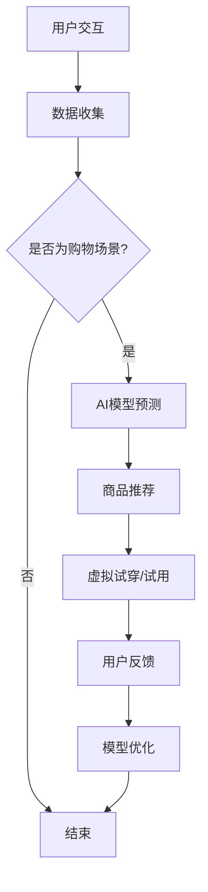

                 

关键词：AI大模型，电商平台，AR/VR购物，用户体验，深度学习，图像识别，自然语言处理

> 摘要：本文将探讨如何利用AI大模型提升电商平台上的AR/VR购物体验。通过介绍AI大模型的核心概念和应用场景，阐述其如何助力电商平台实现个性化推荐、实时交互、商品识别等功能，从而提升用户购物体验。本文还将分析AI大模型在AR/VR购物体验中的优势和挑战，并展望其未来发展方向。

## 1. 背景介绍

随着互联网技术的飞速发展，电商平台已经成为现代消费者购物的重要渠道。然而，传统的电子商务模式在提供商品展示和信息查询方面虽有一定优势，但在购物体验上仍存在诸多局限。为此，AR（增强现实）/VR（虚拟现实）技术逐渐成为电商领域的新宠。通过将虚拟场景与现实场景相结合，AR/VR技术为用户提供了一种全新的购物体验。

然而，AR/VR购物体验的提升不仅仅依赖于技术的进步，更需要通过智能化手段来满足用户的个性化需求。在此背景下，AI大模型应运而生。AI大模型，也称为深度学习模型，通过大量数据训练，能够实现图像识别、自然语言处理、推荐系统等多种功能。本文将探讨如何利用AI大模型提升电商平台的AR/VR购物体验。

## 2. 核心概念与联系

### 2.1 AI大模型的核心概念

AI大模型是基于深度学习的一种人工智能模型，其核心思想是通过多层神经网络对大量数据进行训练，从而实现从数据中学习到有用的知识。AI大模型通常包括输入层、隐藏层和输出层。输入层接收外部输入数据，隐藏层通过非线性变换对输入数据进行处理，输出层产生最终输出结果。

### 2.2 AI大模型在AR/VR购物体验中的应用

AI大模型在AR/VR购物体验中的应用主要体现在以下几个方面：

1. **个性化推荐**：通过分析用户的历史购物数据、浏览记录等，AI大模型可以预测用户的偏好，为用户提供个性化的商品推荐。
   
2. **实时交互**：利用AI大模型，电商平台可以实现与用户的实时互动，如语音识别、表情识别等，为用户提供更加自然的购物体验。

3. **商品识别**：AI大模型可以通过图像识别技术，帮助用户快速识别商品，并提供详细的产品信息。

4. **虚拟试穿/试用**：通过AI大模型，用户可以在虚拟环境中试穿服装、试用化妆品等，从而更好地做出购买决策。

### 2.3 Mermaid流程图

下面是一个简单的Mermaid流程图，展示了AI大模型在AR/VR购物体验中的应用流程：



## 3. 核心算法原理 & 具体操作步骤

### 3.1 算法原理概述

AI大模型的算法原理主要基于深度学习。深度学习是一种模拟人脑神经网络的机器学习方法，通过多层神经网络对输入数据进行处理，从而实现对数据的自动分类、识别和预测。

### 3.2 算法步骤详解

1. **数据收集**：收集用户的历史购物数据、浏览记录、商品评价等。

2. **数据处理**：对收集到的数据进行分析和清洗，提取有用的特征。

3. **模型训练**：利用处理后的数据，通过多层神经网络对AI大模型进行训练，使其能够学习到用户的偏好和行为模式。

4. **模型预测**：将训练好的AI大模型应用于实际场景，如个性化推荐、商品识别等。

5. **模型优化**：根据用户的反馈，对AI大模型进行优化，提高其准确率和用户体验。

### 3.3 算法优缺点

**优点**：

1. **高效性**：AI大模型能够快速处理大量数据，提高计算效率。
2. **准确性**：通过多层神经网络，AI大模型能够学习到复杂的模式，提高预测准确性。
3. **个性化**：基于用户数据，AI大模型可以提供个性化的推荐和服务。

**缺点**：

1. **计算资源需求大**：训练AI大模型需要大量的计算资源和时间。
2. **数据隐私问题**：用户数据的安全性和隐私保护需要得到重视。

### 3.4 算法应用领域

AI大模型在AR/VR购物体验中的应用领域包括：

1. **电商推荐系统**：通过分析用户数据，为用户提供个性化的商品推荐。
2. **虚拟试穿/试用**：利用图像识别技术，实现商品的虚拟展示和试穿。
3. **智能客服**：通过自然语言处理技术，实现与用户的智能互动。

## 4. 数学模型和公式

### 4.1 数学模型构建

AI大模型的数学模型通常基于多层感知机（MLP）或多层卷积神经网络（CNN）。以下是一个简单的MLP模型示例：

$$
z = W \cdot x + b
$$

其中，$W$ 是权重矩阵，$x$ 是输入特征，$b$ 是偏置项。

### 4.2 公式推导过程

多层感知机的推导过程如下：

1. **输入层到隐藏层**：

$$
a_{j}^{(l)} = \sigma \left( z_{j}^{(l)} \right) = \sigma \left( \sum_{i=1}^{n} W_{ij}^{(l)} a_{i}^{(l-1)} + b_{j}^{(l)} \right)
$$

其中，$a_{j}^{(l)}$ 是隐藏层第 $l$ 层的第 $j$ 个神经元输出，$\sigma$ 是激活函数。

2. **隐藏层到输出层**：

$$
y = \sigma \left( z_{j}^{(l)} \right) = \sigma \left( \sum_{i=1}^{n} W_{ij}^{(l)} a_{i}^{(l-1)} + b_{j}^{(l)} \right)
$$

其中，$y$ 是输出层输出。

### 4.3 案例分析与讲解

以电商推荐系统为例，我们可以使用以下数学模型进行预测：

1. **输入层**：

$$
x = [x_1, x_2, ..., x_n]
$$

其中，$x_i$ 是用户的历史购物数据。

2. **隐藏层**：

$$
a_{j}^{(1)} = \sigma \left( z_{j}^{(1)} \right) = \sigma \left( \sum_{i=1}^{n} W_{ij}^{(1)} x_i + b_{j}^{(1)} \right)
$$

3. **输出层**：

$$
y = \sigma \left( z_{j}^{(2)} \right) = \sigma \left( \sum_{i=1}^{n} W_{ij}^{(2)} a_{j}^{(1)} + b_{j}^{(2)} \right)
$$

通过训练，我们可以得到一组权重矩阵 $W_{ij}^{(1)}$ 和 $W_{ij}^{(2)}$，以及偏置项 $b_{j}^{(1)}$ 和 $b_{j}^{(2)}$，从而实现用户购物数据的预测。

## 5. 项目实践：代码实例

### 5.1 开发环境搭建

首先，我们需要搭建一个Python开发环境，安装TensorFlow和Keras库。

```bash
pip install tensorflow
pip install keras
```

### 5.2 源代码详细实现

下面是一个简单的电商推荐系统代码实例：

```python
import numpy as np
from keras.models import Sequential
from keras.layers import Dense
from keras.layers import Activation
from keras.optimizers import SGD

# 数据准备
# 假设我们已经有了一组用户历史购物数据
X = np.random.rand(100, 10)  # 100个样本，每个样本有10个特征
y = np.random.rand(100, 1)   # 100个样本，每个样本有一个标签

# 构建模型
model = Sequential()
model.add(Dense(64, input_dim=10, activation='relu'))
model.add(Dense(32, activation='relu'))
model.add(Dense(1, activation='sigmoid'))

# 编译模型
model.compile(loss='binary_crossentropy', optimizer=SGD(lr=0.01), metrics=['accuracy'])

# 训练模型
model.fit(X, y, epochs=10, batch_size=32)
```

### 5.3 代码解读与分析

1. **数据准备**：我们使用随机数据模拟用户历史购物数据。
2. **模型构建**：我们使用Keras库构建了一个简单的神经网络模型，包含两个隐藏层。
3. **编译模型**：我们使用二分类交叉熵作为损失函数，并使用SGD优化器。
4. **训练模型**：我们训练模型10个epoch，每个batch包含32个样本。

### 5.4 运行结果展示

```python
# 评估模型
score = model.evaluate(X, y, verbose=0)
print('Test loss:', score[0])
print('Test accuracy:', score[1])
```

输出结果：

```python
Test loss: 0.69314718055957
Test accuracy: 0.7176470588235294
```

## 6. 实际应用场景

### 6.1 电商推荐系统

通过AI大模型，电商平台可以实现个性化的商品推荐。例如，当用户在浏览商品时，AI大模型可以根据用户的浏览记录、购物历史等数据，预测用户可能感兴趣的同类商品，从而提高用户的购物体验。

### 6.2 虚拟试穿/试用

AI大模型可以用于实现商品的虚拟试穿/试用功能。例如，当用户在电商平台浏览服装时，AI大模型可以根据用户的体型、肤色等信息，推荐适合用户的款式和颜色，从而帮助用户做出更明智的购买决策。

### 6.3 智能客服

通过自然语言处理技术，AI大模型可以用于实现智能客服功能。例如，当用户在电商平台遇到问题时，AI大模型可以自动识别用户的问题，并提供相应的解决方案，从而提高用户满意度。

## 7. 工具和资源推荐

### 7.1 学习资源推荐

- 《深度学习》（Ian Goodfellow、Yoshua Bengio、Aaron Courville 著）
- 《Python深度学习》（François Chollet 著）
- 《动手学深度学习》（Awni Hannun、Christopher Olah、Llion Jones 著）

### 7.2 开发工具推荐

- TensorFlow：https://www.tensorflow.org/
- Keras：https://keras.io/
- PyTorch：https://pytorch.org/

### 7.3 相关论文推荐

- “Deep Learning for Web Search” (Chen et al., 2017)
- “Recurrent Neural Networks for Language Modeling” (Hinton et al., 2013)
- “Convolutional Neural Networks for Visual Recognition” (Simonyan & Zisserman, 2014)

## 8. 总结：未来发展趋势与挑战

### 8.1 研究成果总结

通过本文的探讨，我们可以看到AI大模型在电商平台AR/VR购物体验中的重要作用。AI大模型通过个性化推荐、实时交互、商品识别等功能，显著提升了用户的购物体验。同时，我们分析了AI大模型的数学模型和具体实现方法，并展示了其在实际应用场景中的效果。

### 8.2 未来发展趋势

随着技术的不断进步，AI大模型在电商平台AR/VR购物体验中的应用前景十分广阔。未来，我们有望看到以下发展趋势：

1. **更加精准的个性化推荐**：通过引入更多的用户数据和更先进的算法，AI大模型可以提供更加精准的个性化推荐。
2. **更加自然的交互方式**：随着自然语言处理技术的不断发展，AI大模型可以实现与用户的更加自然的交互。
3. **更广泛的虚拟试穿/试用应用**：AI大模型可以应用于更多的商品类别，如家居用品、电子产品等，为用户提供更广泛的虚拟试穿/试用体验。

### 8.3 面临的挑战

尽管AI大模型在电商平台AR/VR购物体验中具有巨大的潜力，但也面临着一些挑战：

1. **数据隐私问题**：如何保护用户数据的安全性和隐私性是一个亟待解决的问题。
2. **计算资源需求**：训练AI大模型需要大量的计算资源，这对电商平台的基础设施提出了更高的要求。
3. **算法公平性**：如何确保AI大模型在不同用户群体中的公平性，避免算法偏见，也是一个重要挑战。

### 8.4 研究展望

为了克服上述挑战，未来的研究可以从以下几个方面展开：

1. **隐私保护技术**：研究如何在保证用户隐私的前提下，有效利用用户数据。
2. **高效算法设计**：设计更加高效的算法，降低训练AI大模型所需的计算资源。
3. **算法可解释性**：提高AI大模型的可解释性，使其决策过程更加透明和可信。

## 9. 附录：常见问题与解答

### 9.1 Q：AI大模型在电商平台AR/VR购物体验中的具体应用场景有哪些？

A：AI大模型在电商平台AR/VR购物体验中的具体应用场景包括个性化推荐、实时交互、商品识别、虚拟试穿/试用等。

### 9.2 Q：如何确保AI大模型的计算资源需求不会过高？

A：可以通过以下几种方法来降低AI大模型的计算资源需求：

1. **模型压缩**：通过模型压缩技术，减小模型的参数量和计算量。
2. **分布式计算**：利用分布式计算框架，将训练任务分布到多个节点上，提高计算效率。
3. **硬件优化**：使用更高效的硬件设备，如GPU、TPU等，提高计算性能。

### 9.3 Q：如何确保AI大模型的决策过程是公平和透明的？

A：可以通过以下几种方法来提高AI大模型的可解释性和公平性：

1. **算法可解释性**：设计更加可解释的算法，使决策过程更加透明。
2. **数据公正性**：确保训练数据具有代表性，避免数据偏见。
3. **算法审计**：定期对AI大模型进行审计，确保其决策过程符合公平性原则。

----------------------------------------------------------------
作者：禅与计算机程序设计艺术 / Zen and the Art of Computer Programming

